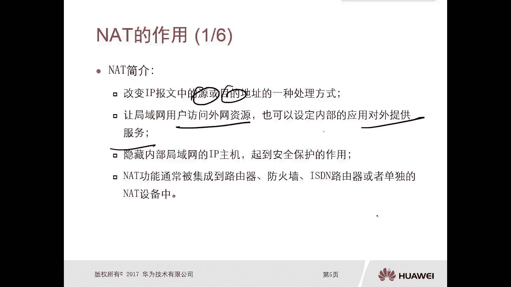
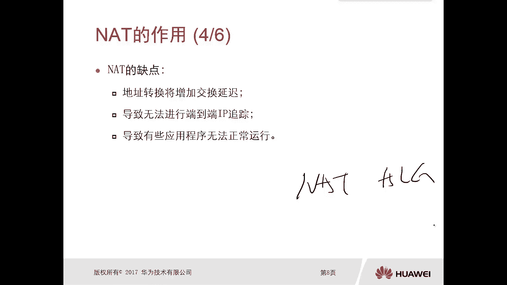
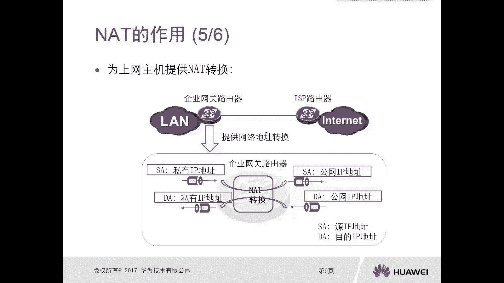
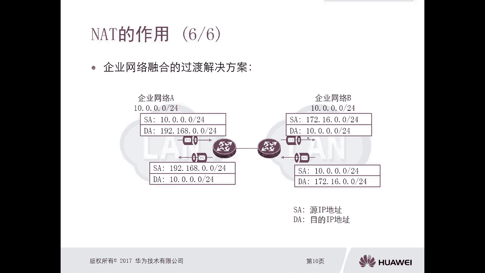
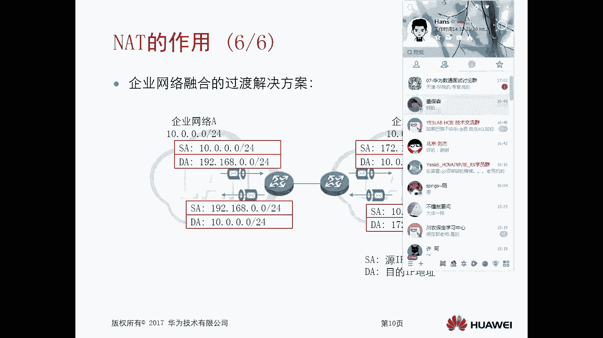
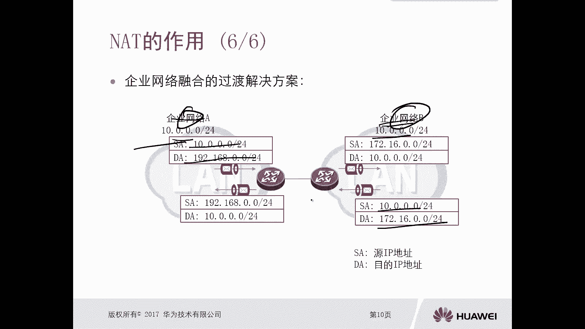

# 华为认证ICT学院HCIA/HCIP-Datacom教程：第3册-第4章-1：NAT的作用 🌐

在本节课中，我们将要学习网络地址转换（NAT）技术。NAT是现代网络中一项至关重要的技术，它解决了私网地址访问公网资源的核心问题。我们将从NAT的基本概念、作用、优缺点以及典型应用场景入手，帮助初学者理解其工作原理和重要性。

## NAT简介

上一节我们回顾了IP地址的基础知识，本节中我们来看看NAT技术。NAT的全称是 **Network Address Translation**，即网络地址转换。

这种技术主要用于私网IP地址与公网IP地址之间的转换。典型场景是企业内网用户需要访问互联网资源。此时，需要在企业网络的网关出口设备上部署NAT技术。

可以说，在所有企业网络中都会使用NAT。因为企业内网通常使用私网地址进行互联。即使内网使用公网地址部署，这些地址也无法直接在互联网上路由。因此，内网用户访问互联网时，必须通过NAT技术将私网地址转换为运营商分配的公网地址。

以下是NAT的核心定义与功能：

*   NAT是改变IP报文中源或目的地址的一种处理方式。当内网用户（私网地址）访问公网资源时，其数据包最终必须以公网地址的形式到达互联网。NAT负责完成这个地址转换过程。
*   NAT让局域网用户能够访问外网资源，也可以设定内部服务器对外提供服务。前者通常转换源地址，后者通常转换目的地址。
*   NAT隐藏了内部局域网主机的真实IP地址，起到了一定的安全保护作用。因为外部攻击者无法直接知晓内部主机的具体私网地址。

NAT功能在多种网络设备上得到支持，例如：

*   路由器
*   防火墙
*   三层交换机
*   专门的NAT设备

## 私网地址回顾

在深入了解NAT如何工作之前，我们先简要回顾一下私网地址。IANA组织在IP地址分类中预留了特定的私网地址段供内部网络自由使用，无需申请。

以下是预留的私网地址范围：

*   **A类**：`10.0.0.0/8` （`10.0.0.0` - `10.255.255.255`）
*   **B类**：`172.16.0.0/12` （`172.16.0.0` - `172.31.255.255`）
*   **C类**：`192.168.0.0/16` （`192.168.0.0` - `192.168.255.255`）

私网地址可以在不同企业的内网中重复使用而不会冲突，因为它们只在各自网络内部有效。其根本目的是实现地址复用，以应对IPv4公网地址不足的问题。

## NAT的优缺点

了解了NAT的基本概念和私网地址后，我们来看看这项技术的优缺点。

### 优点

NAT技术带来了多方面的好处，以下是其主要优点：

1.  **节省公网地址**：企业无需为每个内网用户购买一个公网IP。只需购买一个或少数几个公网IP，通过NAT转换即可让成百上千的内网用户访问互联网，极大地节省了成本。
2.  **解决地址重叠问题**：当两个使用相同私网地址段的企业需要合并或互通时，NAT可以提供解决方案，避免因地址冲突而无法通信。
3.  **提高连接灵活性**：简化了网络接入互联网的配置和管理。
4.  **避免网络重新编址**：当内部网络结构调整时，可以避免大规模修改IP地址规划。

NAT技术出现的最主要原因是**解决IPv4公网地址枯竭的问题**。尽管IPv6可以从根本上提供近乎无限的地址空间，但在IPv4向IPv6过渡的漫长时期内，NAT仍然是不可或缺的技术。

### 缺点

当然，NAT技术也存在一些局限性，以下是其主要缺点：

1.  **增加转发延迟**：地址转换需要消耗设备资源进行处理，会引入一定的转发延迟。不过在现代高性能硬件设备上，这种延迟通常可以忽略不计。
2.  **破坏端到端IP追踪**：由于隐藏了内网主机的真实IP，给网络溯源、故障排查带来困难，同时也为一些网络犯罪提供了隐蔽条件。
3.  **影响特定应用**：某些特殊应用（如传统的FTP协议）在简单的NAT环境下无法正常工作，需要启用更高级的 **NAT ALG（应用层网关）** 功能来协助完成转换。

## NAT的应用场景

接下来，我们通过两个典型场景来具体看看NAT是如何工作的。

### 场景一：为内网主机提供互联网访问 🌍

这是NAT最常见、最广泛的应用场景。企业内网用户通过网关路由器访问互联网。

**工作原理简述：**
1.  内网主机（私网地址）发送访问互联网（公网地址）的数据包。
2.  数据包到达企业网关路由器，路由器根据NAT策略，将数据包的**源IP地址（私网）** 转换为**公网IP地址**，然后转发给运营商。
3.  互联网服务器收到请求后，回复的数据包目的地址是该公网IP。
4.  数据包经路由返回企业网关路由器，路由器根据NAT转换记录，将数据包的**目的IP地址（公网）** 转换回最初的**私网IP地址**，并转发给内网主机。

通过这种方式，使用私网地址的内网主机得以与公网资源通信。

### 场景二：作为企业网络融合的过渡方案 🔀

当企业并购或与合作伙伴网络互联，而双方内网使用了重叠的IP地址段时，NAT可以提供解决方案。

**工作原理简述（以图示为例）：**
1.  企业网络A（`10.0.0.0/24`）中的主机想访问企业网络B（`10.0.0.0/24`）中的服务器。由于地址重叠，直接访问会失败。
2.  在连接路由器上配置NAT。企业网络A发出的数据包，其源地址`10.0.0.x`被转换为一个中间地址（如`172.16.0.x`）。
3.  数据包到达企业网络B侧的路由器，再做一次NAT转换，将目的地址`172.16.0.x`转换为企业网络B内服务器的真实地址`10.0.0.y`。
4.  返回流程反之亦然。

通过两次NAT转换，即使双方内网地址完全重叠，也能实现互联互通，同时在一定程度上隐藏了各自的真实网络结构。

---

本节课中我们一起学习了NAT技术。我们了解了NAT是一种在网络边界进行IP地址转换的技术，主要用于实现私网地址访问公网资源。我们回顾了私网地址段，分析了NAT在节省公网地址、解决地址重叠方面的优点，也认识了它可能带来的延迟和端到端通信问题。最后，我们通过内网上网和企业网络互联两个典型场景，具体理解了NAT的工作机制。掌握NAT是理解现代企业网络架构的基础。