# 华为认证ICT学院HCIA/HCIP-Datacom教程：P45：第3册-第4章-2-NAT工作原理

在本节课中，我们将要学习网络地址转换（NAT）的核心工作原理。NAT是实现内网私有地址设备访问互联网公网资源的关键技术。我们将重点探讨两种主要的NAT实现方式：基本NAT和基于端口的NAT（NAPT），并通过简单的示例解释其工作流程。

## 传统NAT介绍

上一节我们介绍了NAT的基本概念，本节中我们来看看它的具体工作原理。首先，我们需要理解传统NAT的必要性。

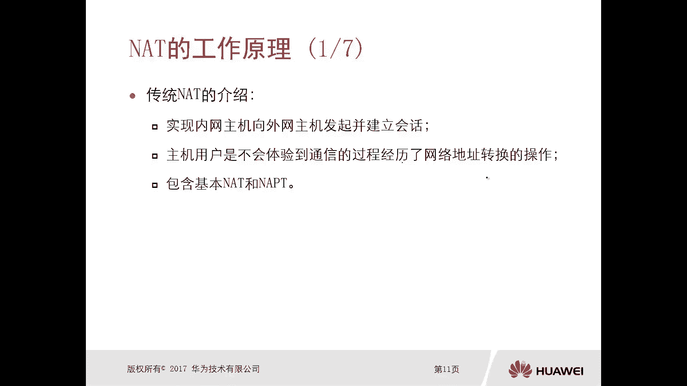

内网主机使用私有IP地址。当它需要向外网主机发起并建立会话时，外网主机在回复时，其目的地址必须是公网地址，会话才能成功建立。因此，内网主机访问外网资源时，必须进行NAT地址转换。

主机用户不会感知到地址转换的过程。例如，在公司或家庭上网访问网站、游戏或视频时，用户完全感受不到地址被转换了。

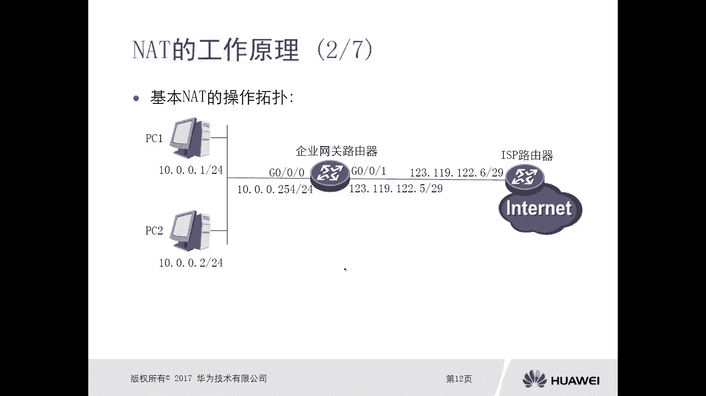

传统NAT包含两种主要类型：**基本NAT**和**NAPT**。NAPT全称为Network Address Port Translation，即基于端口的NAT技术。

## 基本NAT工作原理

接下来，我们看一下基本NAT的操作。下图展示了一个典型的基本NAT应用拓扑：

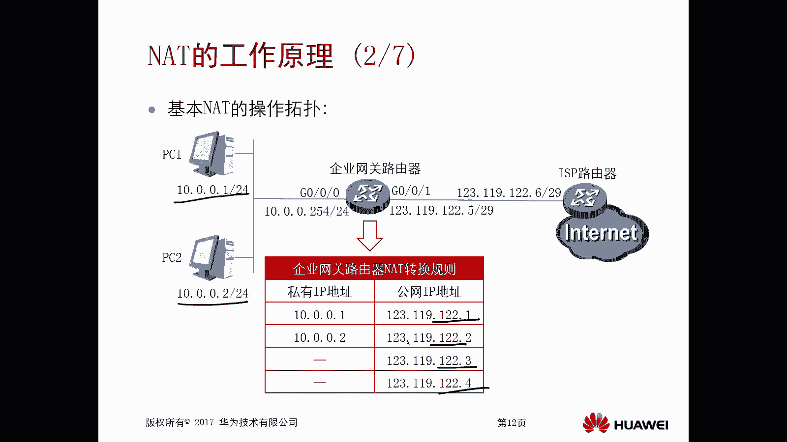

左侧是企业内网，使用私有地址（如10.0.0.0/24）。中间是企业网关路由器。右侧连接运营商，使用公网地址。

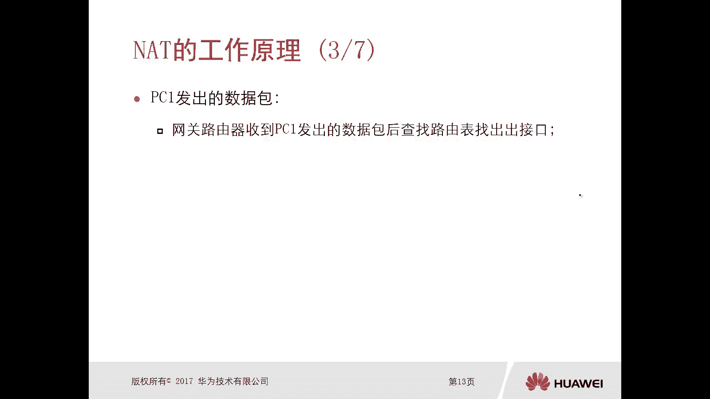

基本NAT的操作是：在网关路由器上部署NAT，将内网主机的私有IP地址一对一地转换为固定的公网IP地址。

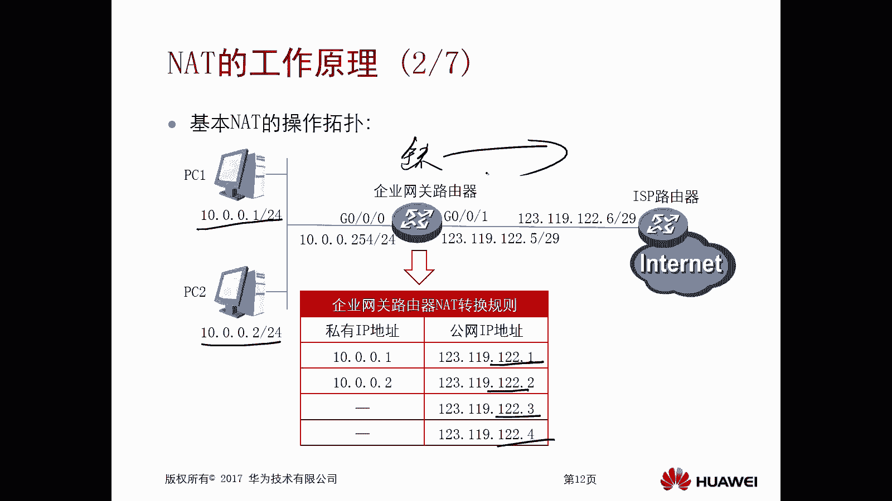

例如：
*   将内网主机 `10.0.0.1` 转换为公网地址 `123.1.2.1`。
*   将内网主机 `10.0.0.2` 转换为公网地址 `123.1.2.2`。

这样，当PC1（10.0.0.1）访问互联网时，其数据包经过路由器后，源地址会被替换为123.1.2.1。

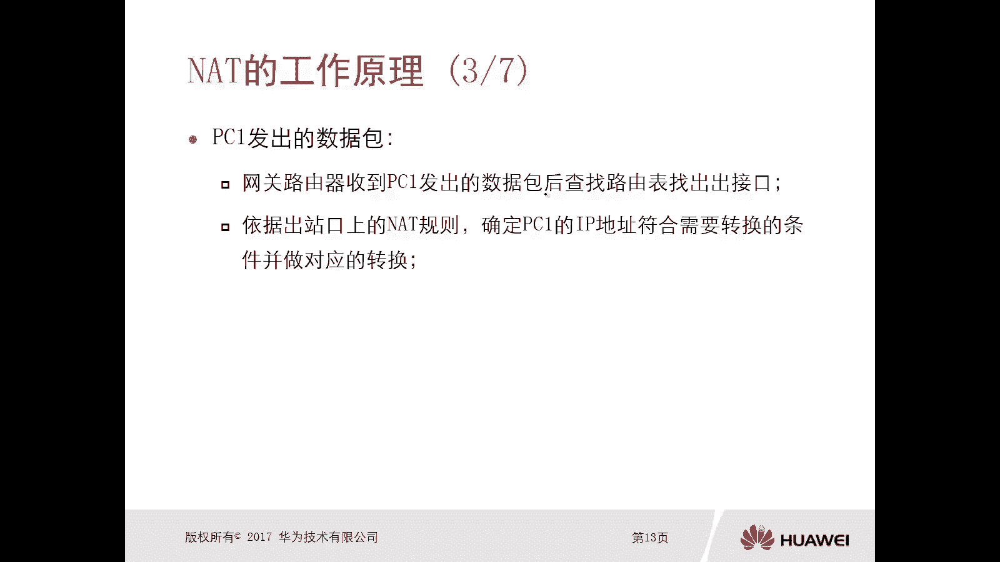

以下是数据包转发与转换的详细过程：

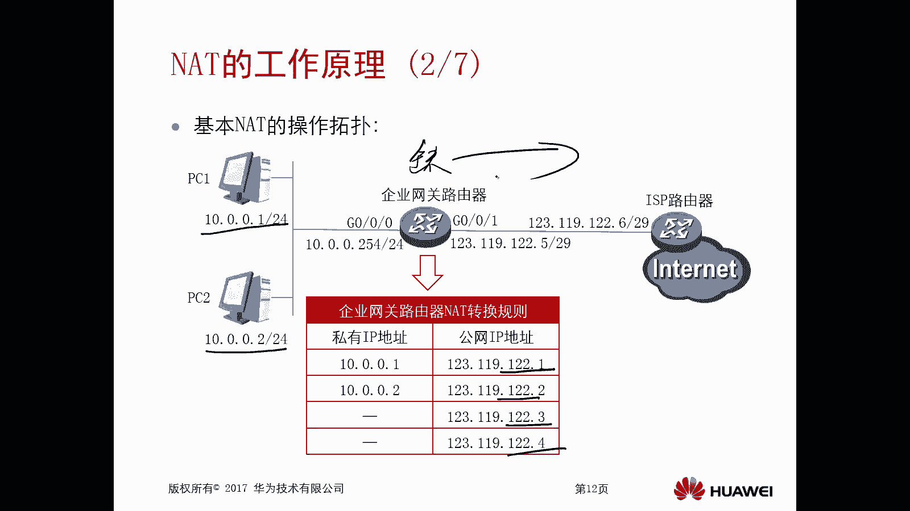

1.  **数据包出站（内网 -> 外网）**
    *   PC1发出数据包，目的地址为外网服务器。
    *   网关路由器收到数据包后，首先**查找路由表**，确定出口（通常是配置了指向运营商的**默认路由**）。
    *   路由器根据出口接口上配置的NAT规则，判断PC1的IP地址（10.0.0.1）符合转换条件。
    *   路由器将数据包的**源IP地址**从 `10.0.0.1` 转换为 `123.1.2.1`。
    *   路由器用转换后的地址重新封装数据包，并从出口（如G0/0/1）发送出去。

2.  **数据包入站（外网 -> 内网）**
    *   外网服务器回复的数据包到达路由器，其目的地址是转换后的公网IP（123.1.2.1）。
    *   路由器收到回复包后，**依据NAT转换表**，将目的IP地址从公网地址（123.1.2.1）**还原**为对应的私有地址（10.0.0.1）。
    *   路由器再**查找路由表**，确定去往10.0.0.1的出口（如内网接口G0/0/0），并将数据包转发给PC1。

**核心概念**：基本NAT是**一对一**的IP地址转换，仅转换IP地址，不涉及端口。其转换关系通常是静态配置的。

> **顺序总结**：数据包**出站**时，先查路由，后做NAT转换；数据包**入站**时，先做NAT反向转换，后查路由。

## NAPT（基于端口的NAT）工作原理

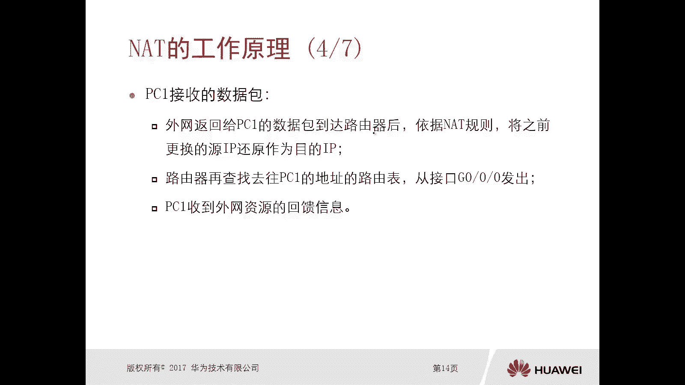

基本NAT存在明显缺陷：一个内网IP需要一个公网IP，如果企业有100台主机，就需要100个公网地址，这非常不经济。因此，在实际应用中，更常见的是**NAPT**。

NAPT允许多个内网私有IP地址共享同一个公网IP地址，通过**不同的端口号**来区分不同的会话。如下图所示：

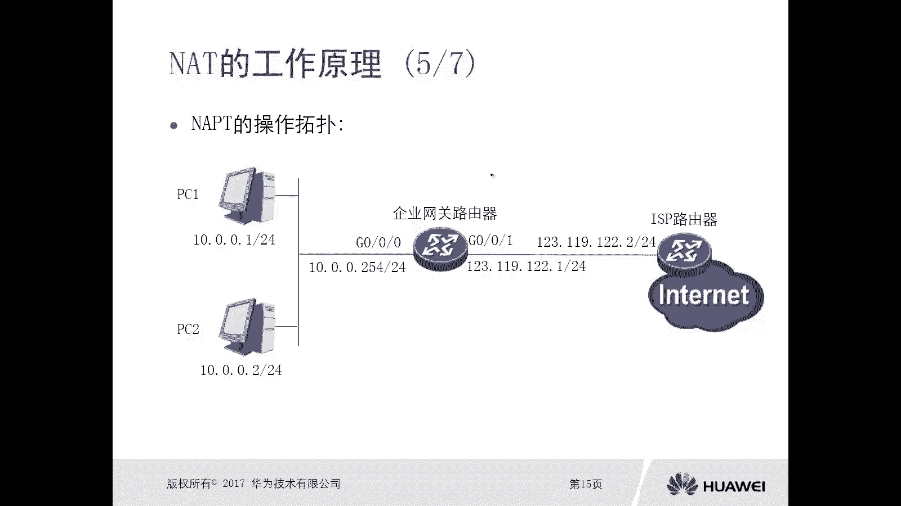

在NAPT中，路由器会将不同内网主机的 `源IP地址 + 源端口` 组合，映射到同一个公网IP地址的不同端口上。

例如：
*   PC1（10.0.0.1:3000） 可能被转换为 （123.1.2.1:15000）
*   PC2（10.0.0.2:3000） 可能被转换为 （123.1.2.1:15001）

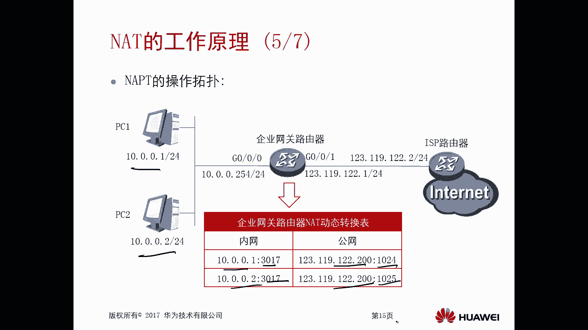

这样，即使转换后的公网IP相同，但端口不同，路由器在收到回包时也能准确地将数据转发给对应的内网主机。

以下是NAPT的工作过程简述：

1.  **PC1数据包出站**：路由器收到包后，查路由确定出口，根据NAT规则，将 `源IP:源端口` (10.0.0.1:3000) 转换为 `公网IP:新端口` (123.1.2.1:15000)，然后发出。
2.  **PC2数据包出站**：路由器将 `源IP:源端口` (10.0.0.2:3000) 转换为 `公网IP:新端口` (123.1.2.1:15001)，然后发出。
3.  **数据包入站**：当回复包到达路由器（目的为123.1.2.1:15000），路由器根据NAT表，将其目的IP和端口还原为10.0.0.1:3000，并转发给PC1。

**核心概念**：NAPT是**多对一**的转换，同时转换**IP地址和端口号**。其转换表项通常是**动态生成**的，当第一个数据包触发时创建，会话结束后老化删除。

> **重要区别**：基本NAT（常为静态）只有IP映射表，且通常预先配置；NAPT（常为动态）有IP+端口的映射表，且随流量动态建立。

## 总结

本节课中我们一起学习了NAT的核心工作原理。

我们了解到，NAT通过在网络出口处修改数据包的IP地址（和端口），实现了内网私有地址访问公网资源的需求。**基本NAT**进行一对一的IP地址转换，而更常用的**NAPT**则通过“IP地址+端口号”的组合转换，实现了多台内网主机共享一个公网IP地址，极大地节约了公网地址资源。

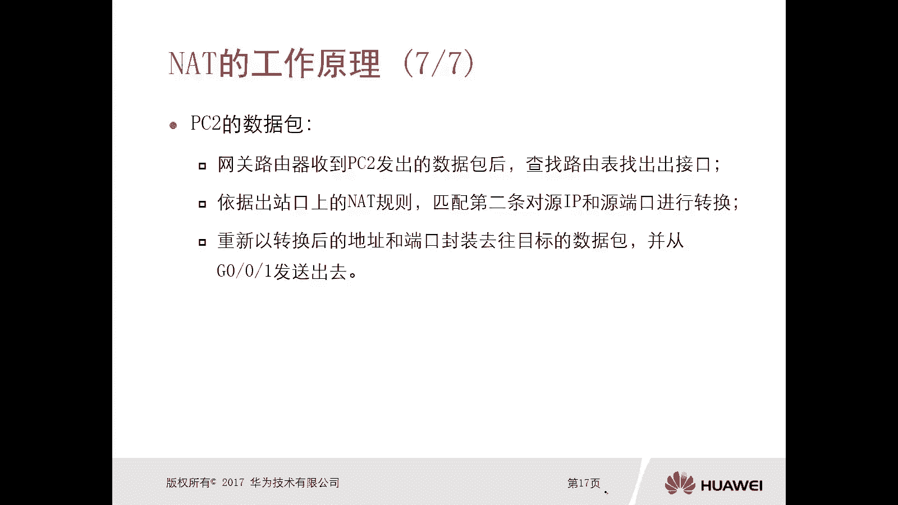

其核心流程可以概括为：**出站数据包先路由后转换源地址，入站数据包先转换目的地址后路由**。理解这一原理是掌握后续各种NAT配置和应用的基础。