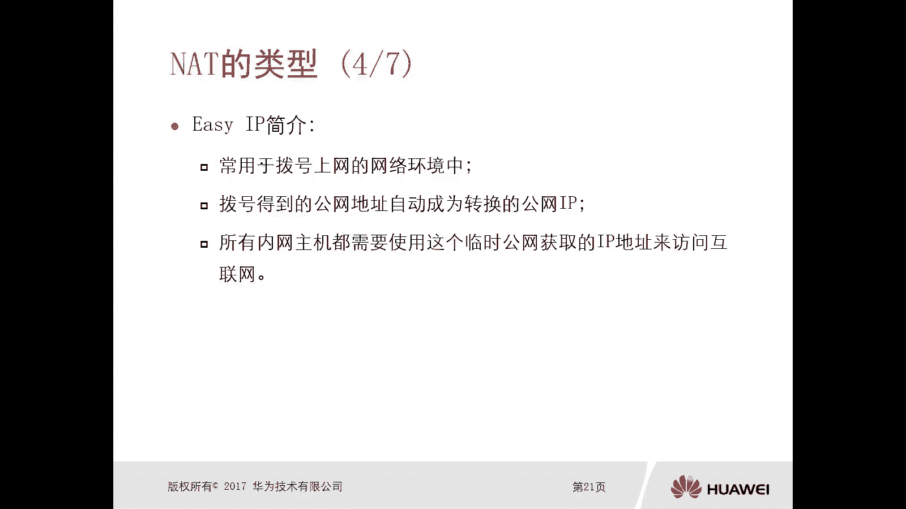
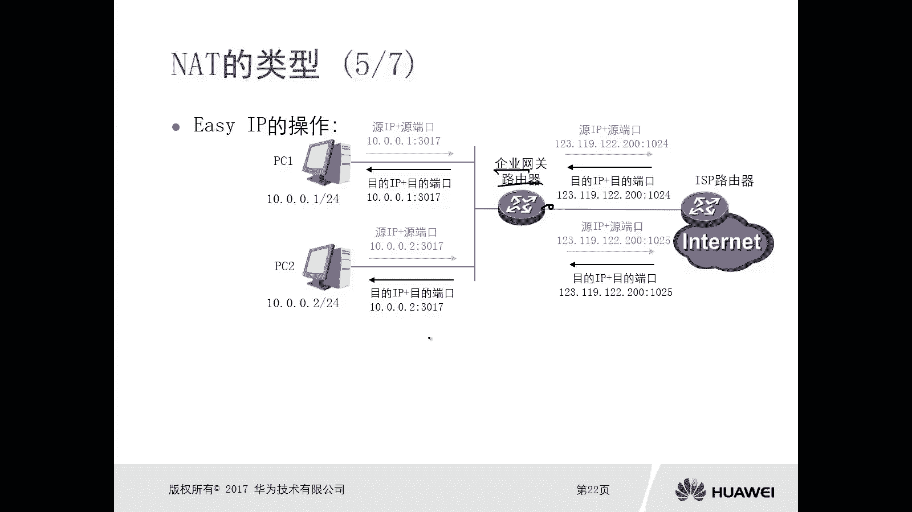
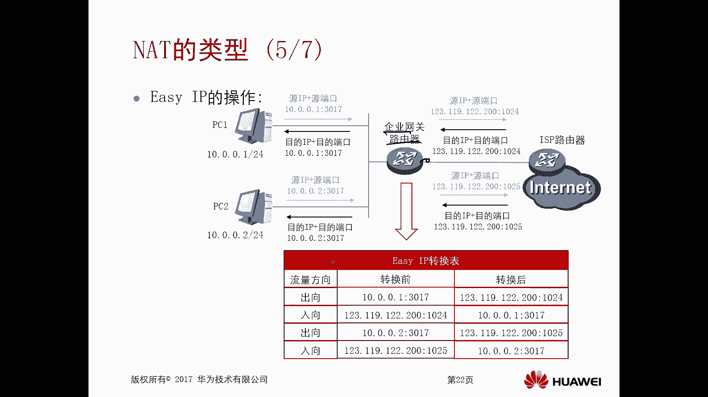
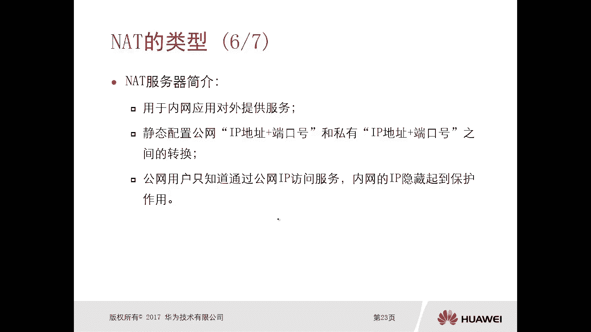
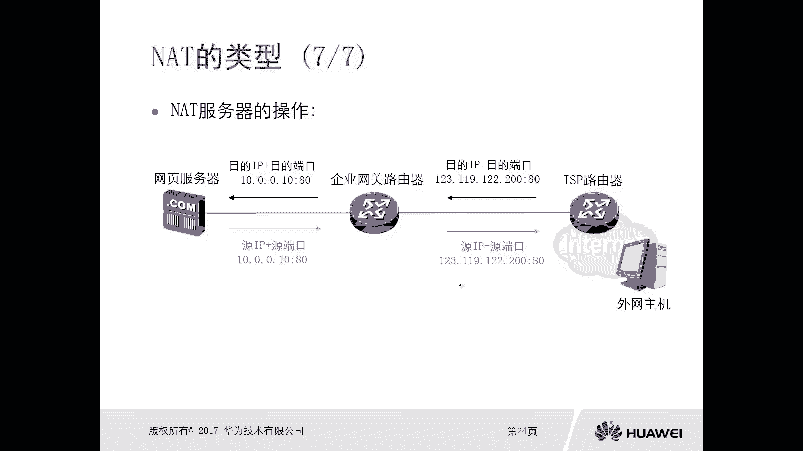
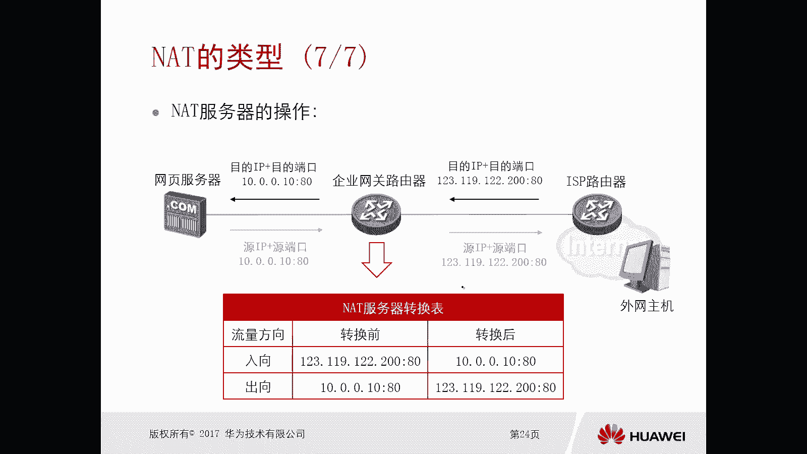
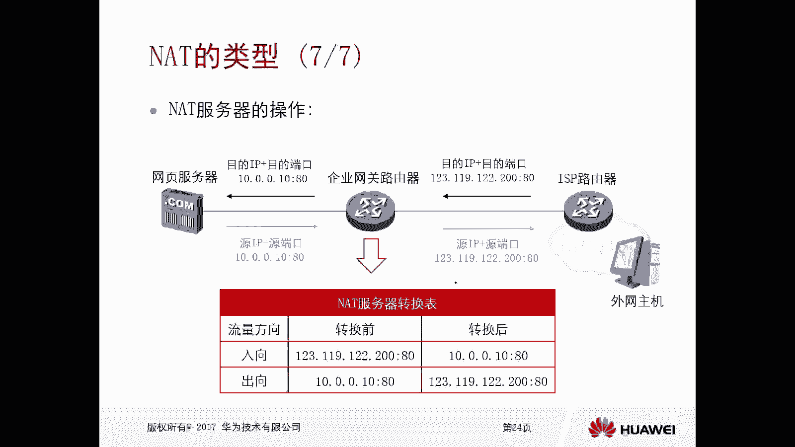

# 华为认证ICT学院HCIA/HCIP-Datacom教程：P46：第3册-第4章-3-NAT的类型 🧭

在本节课中，我们将要学习NAT（网络地址转换）的主要类型。我们将了解静态NAT、NAPT、Easy IP以及NAT服务器的概念、工作原理和应用场景，帮助你理解不同NAT技术之间的区别。

## 概述

NAT技术有多种实现方式，主要分为三大类：静态NAT（包括NAPT）、Easy IP和NAT服务器。上一节我们介绍了NAT的基本工作原理，本节中我们来看看这些具体的类型。

## 静态NAT

静态NAT实现内网中一个主机的私网IP地址与一个公网IP地址的一对一绑定。

这种技术实现的效果是一对一的转换关系，即我们上一小节讲到的NAT工作原理中的基本NAT。例如，PC1固定使用一个公网地址，PC2固定使用另一个公网地址。

在实际应用中，静态NAT很少使用。因为这种技术下，一个公网地址无法为内网中的多台主机提供外联服务。这意味着你有多少台内网主机，就需要使用多少个公网地址，这显然是不现实的。

## NAPT（网络地址端口转换）

NAPT转换的是数据包的源IP地址和源端口号，即内网主机的“IP地址+端口号”二元组，将其转换成一个公网IP地址和端口号，并进行一对一绑定。

这种情况下，一个公网IP地址可以同时为多个私网IP地址提供访问外网的服务。NAPT技术比较常见，应用较多。

## Easy IP

Easy IP技术常用于拨号上网的网络环境中。

这种环境的特点是，设备（如企业网关路由器）通过PPPoE等方式动态获取公网IP地址，且这个地址是临时的、不固定的。例如，这次开机获得一个地址，下次开机可能获得另一个地址。

Easy IP的操作过程是：将所有内网主机的私网地址，都转换成这个动态获取到的临时公网地址，从而使所有内网主机能够访问互联网。

以下是Easy IP的工作流程示例：

1.  PC1（IP: 10.0.0.1，端口: 3017）发起访问。
2.  企业网关路由器将其源IP和端口转换为获取的公网地址（如123.19.12.200）和一个新端口（如1024）。
3.  数据包到达外网服务器，服务器回复时目的地址为123.19.12.200:1024。
4.  企业网关路由器根据之前建立的映射表，将目的地址转换回10.0.0.1:3017，并转发给PC1。

Easy IP与NAPT的过程基本没有太大区别，主要区别在于应用场景：NAPT使用固定的公网地址池，而Easy IP使用动态获取的单个公网地址。

## NAT服务器（NAT Server）

前面讲到的静态NAT、NAPT和Easy IP，其应用场景都是内网主机主动去访问互联网资源。而NAT服务器用于内网应用对外提供服务的情况。

假设你的企业内网有一台服务器，需要为互联网上的用户提供WWW服务。由于服务器使用私网地址，外网用户无法直接访问。此时，需要在网关设备上静态配置NAT服务器规则。

NAT服务器静态配置了公网IP地址及端口与私网IP地址及端口之间的映射关系。外网用户只需知道这个公网地址和端口，就可以访问到内网的真实服务器，从而隐藏了内网服务器的真实IP地址。

例如，大型网站（如百度、新浪）的DNS解析返回一个公网地址，但这个地址可能是一台防火墙或路由器，真实的服务器在其内部IDC机房中。这层转换也提供了一定的安全保护。

以下是NAT服务器的工作流程示例：

1.  外网用户访问公网地址 `123.129.12.200:80`。
2.  企业网关路由器根据NAT服务器规则，将目的地址转换为内网服务器地址 `10.0.0.10:80`。
3.  内网服务器回复数据包，到达网关路由器。
4.  网关路由器根据映射表，将回复包的源地址转换回公网地址 `123.129.12.200:80`，并发送给外网用户。

对于外网用户而言，其感受就是直接与公网地址 `123.129.12.200` 进行了通信。

## 总结

本节课中我们一起学习了NAT的四种主要类型：

*   **静态NAT**：实现私网IP与公网IP的一对一静态映射，使用较少。
*   **NAPT**：转换源IP和源端口，实现一个公网IP为多个私网主机服务，使用固定地址池。
*   **Easy IP**：原理同NAPT，但使用动态获取的单个公网IP地址，常用于拨号网络。
*   **NAT服务器**：转换目的IP和目的端口，将公网地址的访问请求映射到内网服务器，实现内网服务对外发布。

其中，静态NAT、NAPT和Easy IP属于**源NAT**技术，主要转换数据的源地址信息；而NAT服务器属于**目的NAT**技术，主要转换数据的目的地址信息。理解这些类型的区别对于网络规划和配置至关重要。