# 华为认证ICT学院HCIA/HCIP-Datacom教程：第3册-第5章-1：PPP原理 🧩

在本节课中，我们将要学习点到点协议（PPP）的基本原理。PPP是一种在点到点链路上广泛使用的数据链路层协议，主要用于建立、配置和测试数据链路的连接。我们将重点了解PPP的分层结构、封装格式以及关键的协商过程。

---

## PPP的封装格式 📦

上一节我们介绍了PPP的应用场景，本节中我们来看看PPP的帧结构。与以太网帧不同，PPP的帧格式非常简单，因为它专用于点到点链路。

PPP帧的格式如下：
```
| 标志 (0x7E) | 地址 (0xFF) | 控制 (0x03) | 协议 (2字节) | 信息 (可变) | FCS (2/4字节) | 标志 (0x7E) |
```

**核心概念解析**：
*   **地址字段**：固定为 `0xFF`（全1）。因为在点到点链路上，数据帧只会被唯一的对端设备接收，所以无需复杂的源和目的地址。
*   **控制字段**：固定为 `0x03`，代表无编号信息帧。
*   **协议字段**：用于标识信息字段中封装的是哪种协议的数据。例如，`0xC021` 代表 **LCP** 报文，`0x8021` 代表 **IPCP** 报文，`0x0057` 代表 **IPv6CP** 报文。

这种简化的封装格式使得PPP在点到点链路上非常高效。

---

## PPP的分层结构 🏗️

PPP协议采用分层设计，主要分为两层：**链路控制协议（LCP）** 和 **网络控制协议（NCP）**。这种设计使得PPP能够灵活地支持多种网络层协议。

### 链路控制协议（LCP）

LCP负责数据链路的建立、配置、测试和终止。可以把它想象成两个设备在建立物理连接后，首先要进行的“握手”和“链路质量检查”阶段。

以下是LCP的主要功能：
*   **链路建立与配置协商**：在传输数据前，双方设备通过交换LCP报文来协商链路参数，如最大接收单元（MRU）、认证协议、魔术字等。
*   **链路质量检测**：链路建立后，通过周期性地发送 **LCP Echo-Request** 和接收 **LCP Echo-Reply** 报文来监控链路状态。
*   **链路终止**：当通信结束时，通过交换 **LCP Terminate-Request** 和 **LCP Terminate-Ack** 报文来优雅地关闭链路。

### 网络控制协议（NCP）

在LCP成功建立链路之后，PPP进入NCP阶段。NCP是一个协议族，用于协商和配置不同的网络层协议。

常见的NCP协议包括：
*   **IPCP**：用于协商IPv4参数，如接口的IP地址。
*   **IPv6CP**：用于协商IPv6参数，如接口标识符。
*   **其他**：如IPXCP、MPSCP等，用于支持相应的网络层协议。

**核心流程**：`LCP协商成功` -> `NCP（如IPCP）协商成功` -> `网络层通信开始`。

---

## LCP的协商过程 🤝

LCP协商是PPP建立连接的第一步。这个过程类似于双方就合作条款进行磋商。

协商过程主要通过以下几种类型的LCP报文完成：
*   **Configure-Request**：向对端发送本端的配置参数列表。
*   **Configure-Ack**：完全认可对端发来的所有参数。
*   **Configure-Nak**：不认可对端的某些参数，并给出本端可接受的建议值。
*   **Configure-Reject**：完全不识别对端的某些参数选项。

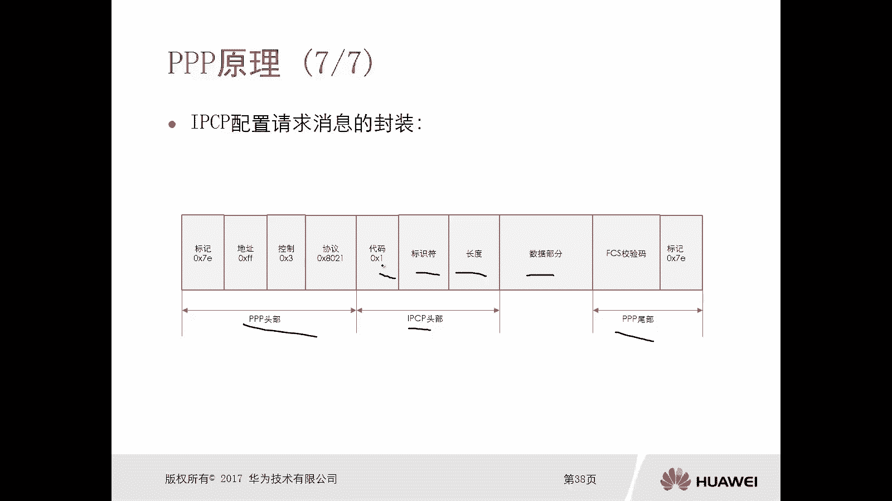

一个最简单的成功协商过程如下：
1.  **设备A** 发送 `LCP Configure-Request` 给设备B。
2.  **设备B** 认可所有参数，回复 `LCP Configure-Ack`。
3.  **设备B** 发送 `LCP Configure-Request` 给设备A。
4.  **设备A** 认可所有参数，回复 `LCP Configure-Ack`。


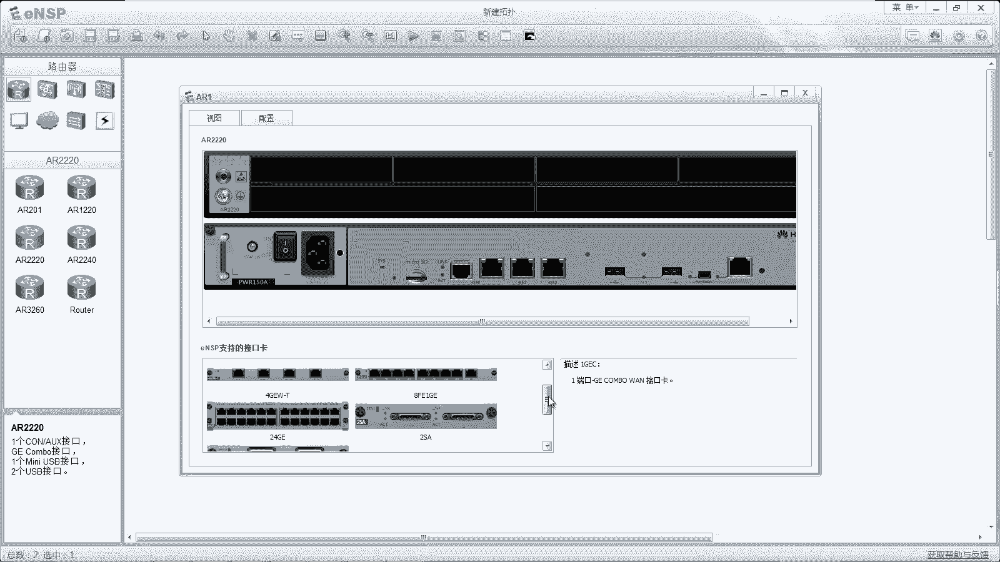

至此，LCP链路建立成功。如果任何一方对参数有异议，则会通过 `Configure-Nak` 或 `Configure-Reject` 报文进行“讨价还价”，直到双方达成一致或协商失败。

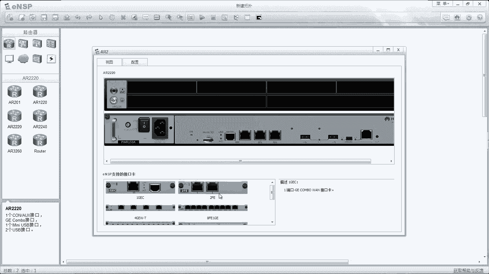

---

## NCP的协商过程（以IPCP为例） 🌐

LCP链路建立后，便进入NCP协商阶段。我们以最常用的IPCP为例，说明如何为链路配置网络层参数。

IPCP协商过程与LCP类似，目的是为接口分配IP地址等参数。其报文类型代码（Code）含义如下：
*   **1: Configure-Request**
*   **2: Configure-Ack**
*   **3: Configure-Nak**
*   **4: Configure-Reject**
*   **5: Terminate-Request**
*   **6: Terminate-Ack**

一个典型的IPCP协商过程（用于分配IP地址）如下：
1.  **设备A** 发送 `IPCP Configure-Request`，其中可能包含一个建议的IP地址（如0.0.0.0，表示请求对端分配）。
2.  **设备B** 回复 `IPCP Configure-Nak`，其中包含一个它为设备A分配的IP地址（如10.0.12.1）。
3.  **设备A** 使用这个新地址，再次发送 `IPCP Configure-Request`（此时信息字段中包含IP地址10.0.12.1）。
4.  **设备B** 回复 `IPCP Configure-Ack`，确认该地址。
5.  同时，**设备B** 也会发起上述过程，协商自己的IP地址。

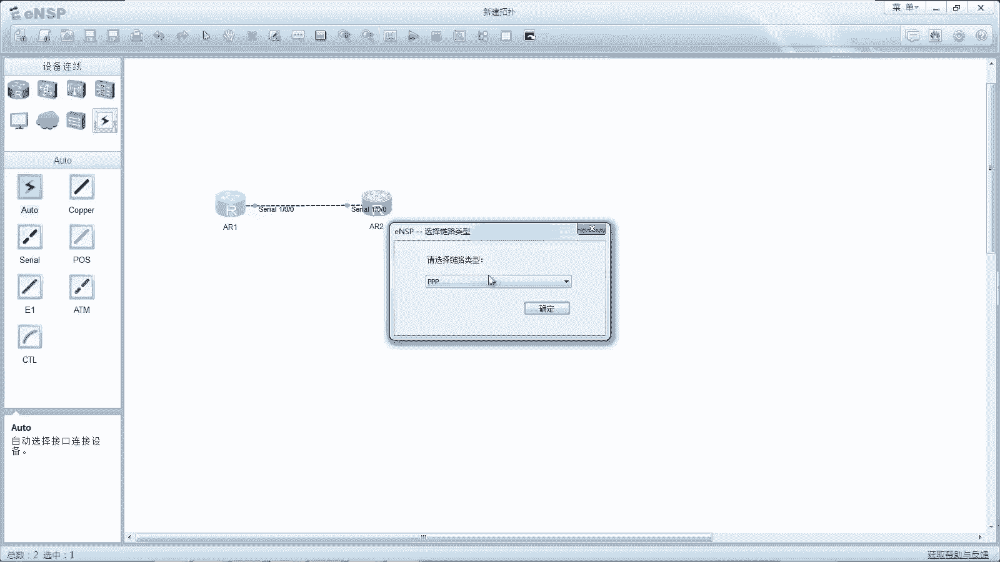

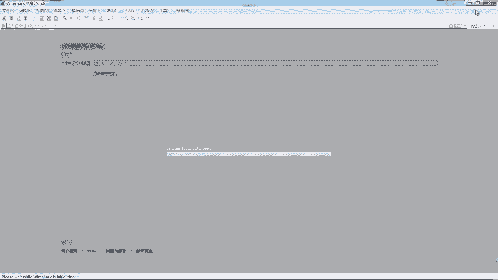

当双方的IPCP状态都变为 `Opened` 后，该PPP链路就可以传输IPv4数据报文了。

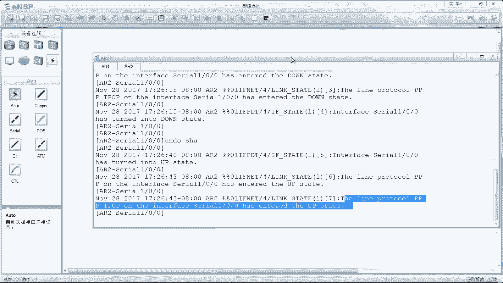

---

## 实验验证与抓包分析 🔬

理论需要实践来验证。我们可以在华为eNSP模拟器中搭建一个简单的PPP链路，并通过抓包来直观地观察整个协商过程。

**实验拓扑**：两台路由器（AR1和AR2）通过串行接口（Serial）背靠背连接。

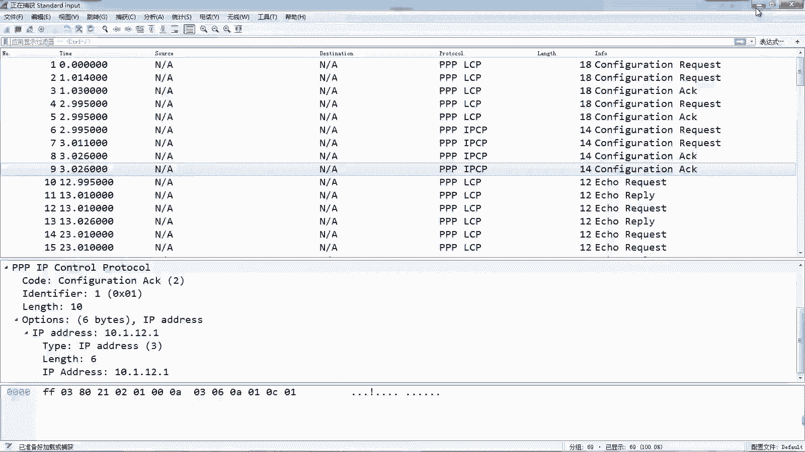

**关键配置命令**：
```bash
# 进入串行接口视图（缺省封装即为PPP，若非PPP可使用 `link-protocol ppp` 修改）
interface Serial 1/0/0
# 配置IPv4地址
ip address 10.0.12.1 255.255.255.0
# 启用IPv6
ipv6 enable
ipv6 address 2001:12::1/64
```

**抓包分析关键点**：
1.  在接口 `shutdown` 再 `undo shutdown` 后抓包，可以捕获完整的PPP协商过程。
2.  **首先**，会看到一系列 `LCP` 报文（协议号 `0xC021`）交互，完成链路层参数协商。
3.  **接着**，会看到 `IPCP` 报文（协议号 `0x8021`）和 `IPv6CP` 报文（协议号 `0x8057`）交互，分别完成IPv4和IPv6的网络层参数协商。
4.  协商成功后，可以使用 `display interface Serial 1/0/0` 命令查看接口状态，确认 `LCP` 和 `IPCP` 状态均为 `OPEN`。
5.  在链路维护期间，还能周期性地看到 `LCP Echo-Request` 和 `LCP Echo-Reply` 报文，用于保活和检测链路质量。

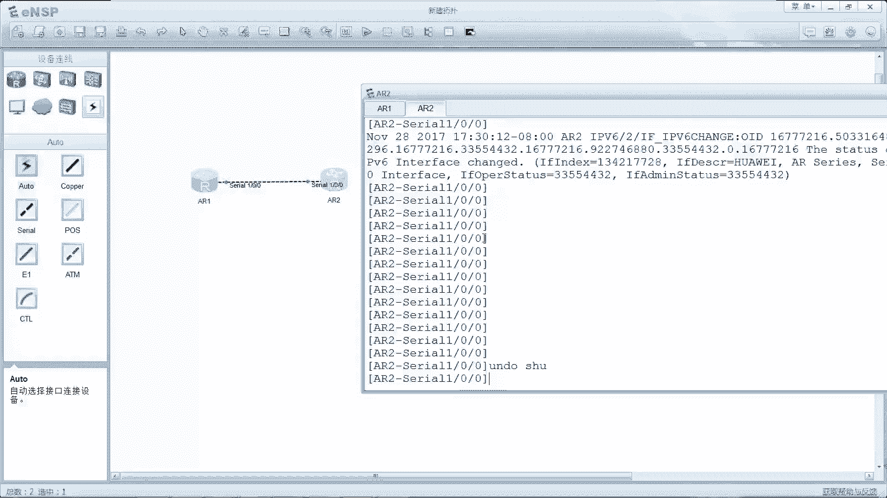

---

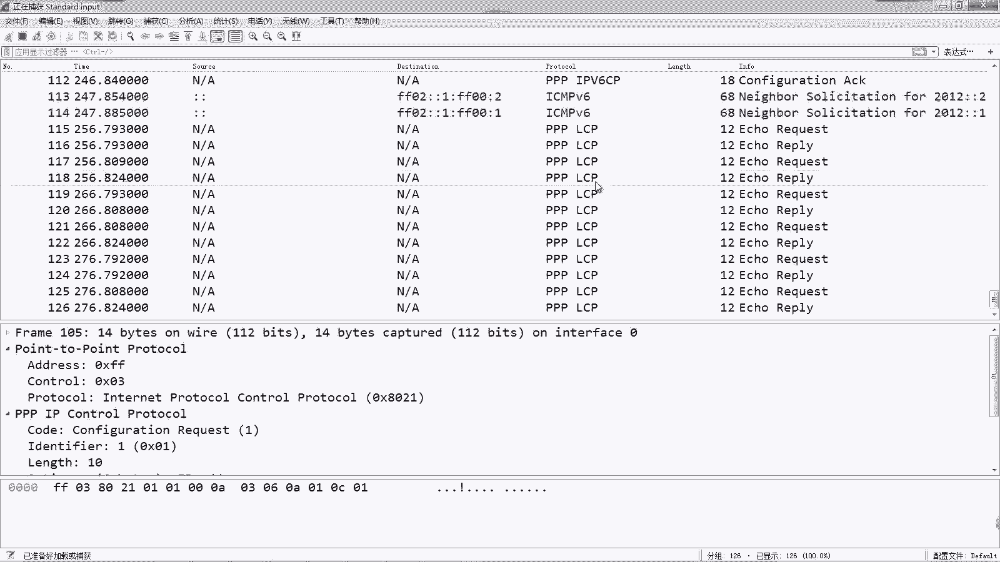

## 总结 📝

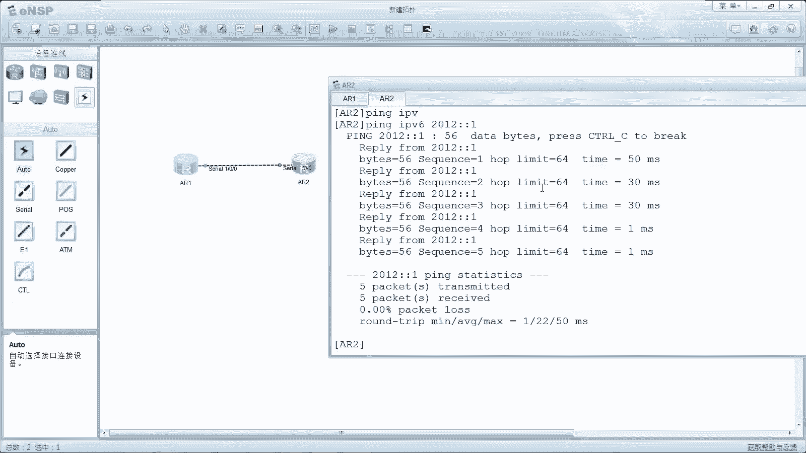

本节课中我们一起学习了PPP协议的核心原理。
*   **PPP封装**：针对点到点链路设计的简洁帧结构。
*   **分层结构**：分为负责链路建立与维护的 **LCP**，和负责网络层协议配置的 **NCP**。
*   **协商过程**：PPP连接建立需经历 `LCP协商` 和 `NCP协商` 两个关键阶段，类似于“先修路，再制定交通规则”。
*   **协议应用**：通过抓包分析，我们直观地看到了PPP如何通过报文交互，一步步建立起一条可用的数据链路。

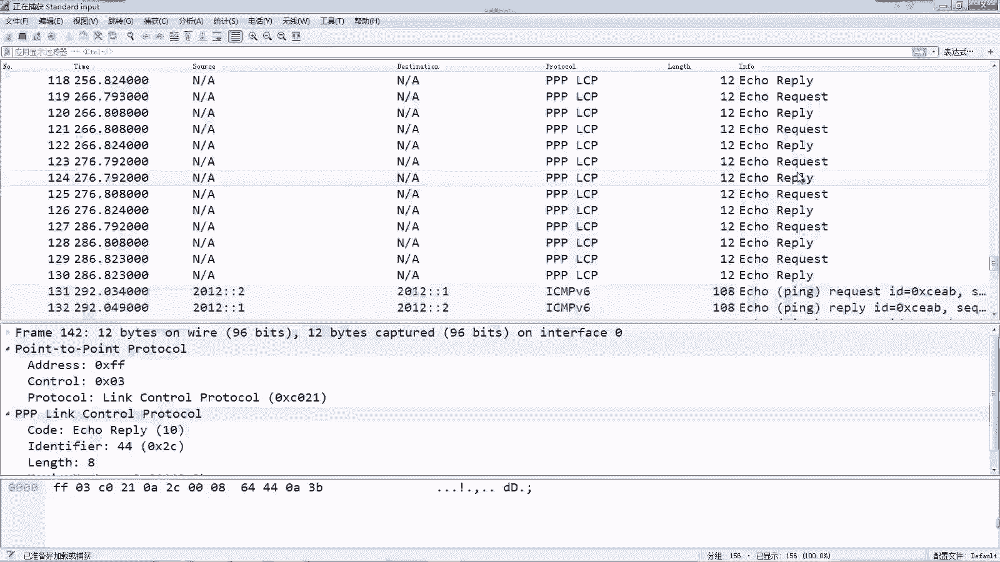

理解PPP的原理，是掌握广域网技术和后续学习PPPoE等协议的重要基础。