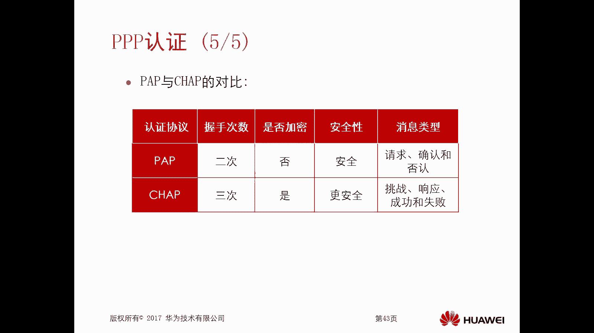
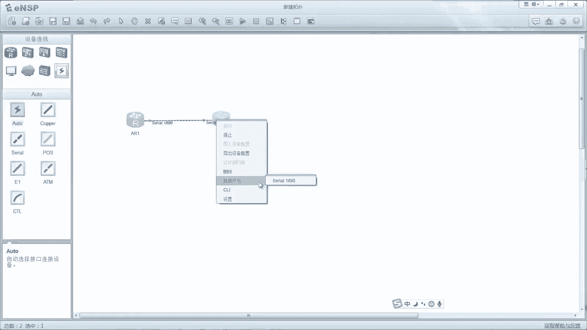
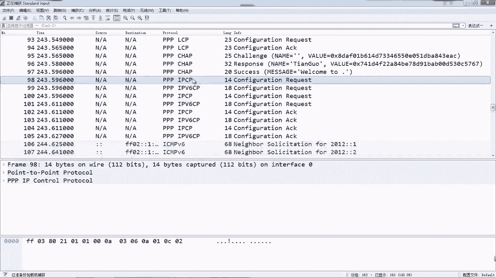
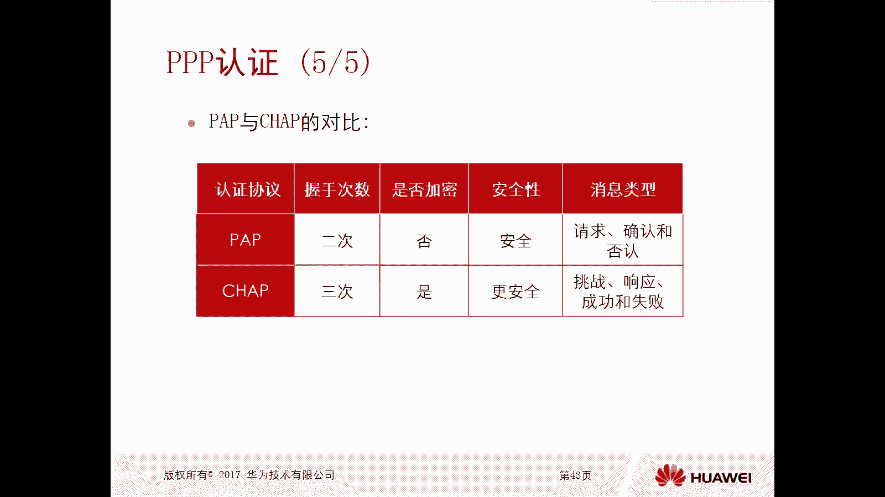

# 华为认证ICT学院HCIA/HCIP-Datacom教程：P48：第3册-第5章-2-PPP认证及配置实验

在本节课中，我们将要学习PPP协议中的认证机制。PPP协议在建立连接时，除了基本的LCP和NCP协商阶段，还可以引入认证阶段以增强安全性。我们将详细介绍两种主要的PPP认证协议：PAP和CHAP，并通过实验演示它们的配置过程与报文交互。

## PPP认证概述

上一节我们介绍了PPP协议的基本协商阶段。本节中我们来看看PPP的认证机制。PPP协议在缺省情况下只包含LCP和NCP两个阶段。当引入认证后，认证阶段会出现在LCP和NCP之间。这意味着，在LCP协商成功后，会先进行认证，只有认证通过后，才会进入NCP阶段协商网络层协议。

引入认证的主要目的是为了安全。它确保只有经过身份验证的设备才能建立PPP连接，防止未经授权的访问。

## PPP认证协议类型

PPP协议支持两种认证协议：PAP和CHAP。

*   **PAP**：密码认证协议。这是一种简单的两次握手认证，认证过程中密码以**明文**方式在网络中传输，因此安全性较低。
*   **CHAP**：挑战握手认证协议。这是一种更安全的三次握手认证。它通过哈希算法（如MD5）计算一个散列值进行验证，**不会在网络中直接传输密码**。

## PAP认证原理与过程

PAP认证采用两次握手，过程相对简单。假设设备A为被认证方，设备B为认证方。

以下是PAP认证的交互流程：
1.  **LCP协商**：双方进行LCP协商。认证方B会在其LCP配置请求报文中携带“要求认证”的参数。
2.  **认证请求**：LCP协商成功后，被认证方A主动向认证方B发送PAP认证请求报文，其中包含**明文**的用户名和密码。
3.  **认证响应**：认证方B收到请求后，检查本地数据库中的用户名和密码是否匹配。
    *   若匹配，则回复**认证确认**消息。
    *   若不匹配，则回复**认证否认**消息，并可能断开LCP连接。

如果认证失败，连接将无法进入NCP阶段。整个过程在网络中传输的是未经加密的密码。

## CHAP认证原理与过程

CHAP认证采用三次握手，安全性更高。同样假设设备A为被认证方，设备B为认证方。**注意**：CHAP认证要求双方预先配置相同的密钥。

以下是CHAP认证的交互流程：
1.  **挑战（Challenge）**：认证方B向被认证方A发送一个挑战报文，其中包含一个**标识符（ID）**和一个**随机产生的挑战值（Challenge Value）**。
2.  **响应（Response）**：被认证方A收到挑战后，将以下三个元素输入哈希算法（如MD5）进行计算：
    *   本地配置的密钥
    *   收到的**标识符（ID）**
    *   收到的**挑战值（Challenge Value）**
    计算得到一个**散列值（Hash Value）**。A将此散列值、标识符及自己的用户名封装在响应报文中，发送给B。
3.  **成功/失败（Success/Failure）**：认证方B收到响应后，使用本地存储的对应用户的密钥、之前发送的标识符和挑战值，进行相同的哈希计算，得到另一个散列值。
    *   若B计算出的散列值与A发送来的散列值一致，则发送**认证成功**消息。
    *   若不一致，则发送**认证失败**消息。



在整个CHAP过程中，密钥本身从未在网络上传输，传输的是由密钥、随机数和标识符计算出的散列值，因此非常安全。

## PAP与CHAP对比

以下是PAP与CHAP两种认证方式的核心区别：




*   **握手次数**：PAP为两次握手；CHAP为三次握手。
*   **密码传输**：PAP以**明文**传输密码；CHAP传输**哈希值**，不传密码。
*   **安全性**：PAP安全性低；CHAP安全性高。
*   **报文类型**：PAP包含请求、确认、否认；CHAP包含挑战、响应、成功、失败。

## 实验配置：PAP认证

接下来我们通过实验来配置和验证PAP认证。实验拓扑中，R2作为认证方，R1作为被认证方。

**在认证方R2上的配置：**
```bash
# 创建本地用户数据库，用户名为tianguo，密码为Huawei@123
[R2] local-user tianguo password cipher Huawei@123
# 设置该用户的服务类型为PPP（可选，缺省支持所有服务）
[R2] local-user tianguo service-type ppp
# 进入连接R1的串口
[R2] interface Serial 1/0/0
# 设置该接口的PPP认证模式为PAP
[R2-Serial1/0/0] ppp authentication-mode pap
```
**在被认证方R1上的配置：**
```bash
# 进入连接R2的串口
[R1] interface Serial 1/0/0
# 配置PAP认证使用的用户名和密码（需与认证方数据库一致）
[R1-Serial1/0/0] ppp pap local-user tianguo password cipher Huawei@123
```
配置完成后，在R2的接口上执行`shutdown`和`undo shutdown`以触发连接重建。通过抓包工具可以观察到，在LCP协商之后，R1会发送包含明文用户名`tianguo`和密码`Huawei@123`的PAP认证请求报文。

## 实验配置：CHAP认证

现在我们将认证模式改为更安全的CHAP。

**在认证方R2上的配置：**
```bash
# 本地用户数据库配置保持不变（用户tianguo，密码Huawei@123）
[R2] local-user tianguo password cipher Huawei@123
# 进入串口，将认证模式改为CHAP
[R2] interface Serial 1/0/0
[R2-Serial1/0/0] ppp authentication-mode chap
```
**在被认证方R1上的配置：**
```bash
# 进入串口
[R1] interface Serial 1/0/0
# 配置CHAP认证使用的用户名（发送给对端）和密码（用于本地计算哈希）
[R1-Serial1/0/0] ppp chap user tianguo
[R1-Serial1/0/0] ppp chap password cipher Huawei@123
```
同样，重启R2的接口链路。通过抓包分析，可以看到三次握手过程：首先R2发送挑战报文（包含ID和随机数），然后R1回复响应报文（包含ID、用户名和计算出的哈希值），最后R2验证成功，发送成功报文。在整个过程中，密码`Huawei@123`从未出现在网络报文中。

## 总结





本节课中我们一起学习了PPP协议的认证机制。我们了解到PPP可以通过PAP或CHAP协议在LCP和NCP之间插入一个认证阶段，以保障连接的安全性。PAP协议实现简单但安全性差，密码明文传输；CHAP协议通过三次握手和哈希算法，实现了不传输密码的高安全性认证。通过实验配置和抓包分析，我们直观地对比了两种认证方式的报文交互过程，加深了对PPP认证原理的理解。