# 华为认证ICT学院HCIA/HCIP-Datacom教程：第3册-第6章-1：DHCP概述及工作方式 🖧

在本节课中，我们将要学习动态主机配置协议（DHCP）的基本概念及其工作方式。DHCP是网络中最常用的协议之一，它允许终端设备自动从服务器获取网络配置参数，从而简化了网络管理。

## DHCP协议简介

上一节我们介绍了DHCP在网络中的重要性，本节中我们来看看DHCP协议的具体定义。DHCP的全称是**动态主机配置协议**。该协议的目的是让终端设备能够从DHCP服务器自动获取网络通信所需的参数信息。

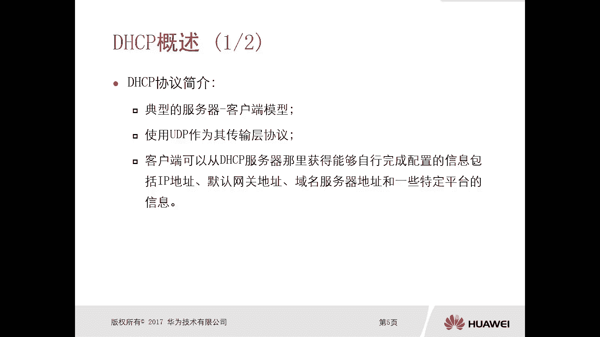

以下是客户端可以从DHCP服务器获取的主要信息：
*   IP地址
*   网关地址
*   DNS服务器地址
*   域名
*   其他特定平台的信息

在一个大型网络环境中，手动为成百上千台设备配置IP地址是不现实的。因此，部署DHCP服务器，让客户端通过DHCP协议自动获取配置，成为了一种高效且必要的解决方案。无论是大型企业网、小型办公网络，还是家庭路由器，DHCP都得到了广泛应用。

## DHCP工作模型与传输方式

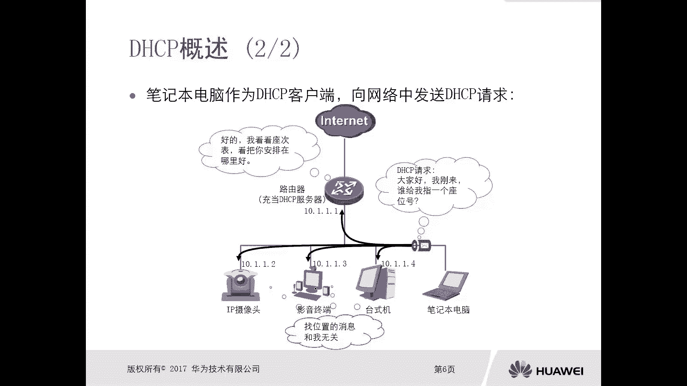

DHCP采用典型的**服务器-客户端模型**。服务器负责管理和分配网络参数，而客户端（如手机、电脑、打印机等终端设备）则向服务器请求这些参数。

在通信时，DHCP使用**UDP**作为其传输层协议。客户端使用端口`68`，服务器使用端口`67`。这是一种无连接的协议，虽然不提供可靠性保证，但在局域网环境中通常能够高效工作。

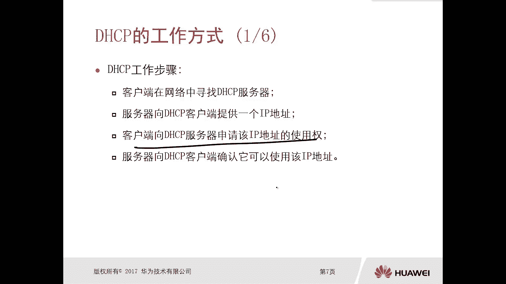

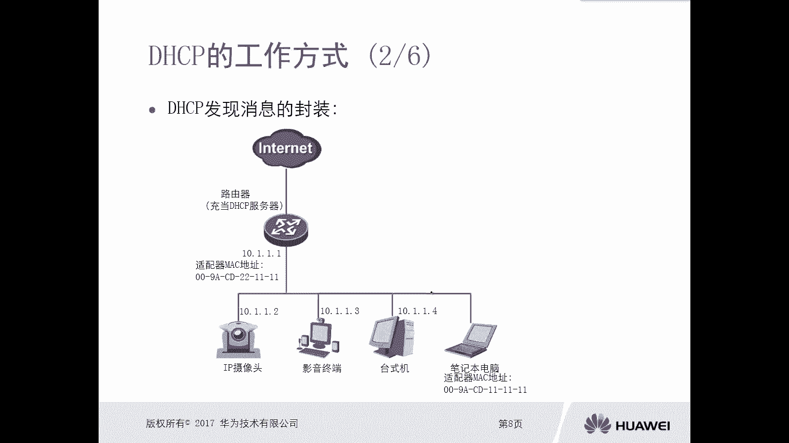

## DHCP工作流程（四次握手）🤝

DHCP客户端从服务器获取地址的过程通常被称为“四次握手”，它包含四个核心步骤。

以下是DHCP交互的四个步骤：
1.  **DHCP Discover（发现）**：客户端初始化后，在网络中广播一个`DHCP Discover`报文，以寻找可用的DHCP服务器。
2.  **DHCP Offer（提供）**：收到Discover报文的DHCP服务器，会向客户端回复一个`DHCP Offer`报文，其中包含一个可供使用的IP地址及其他配置信息。
3.  **DHCP Request（请求）**：客户端可能会收到多个服务器的Offer。它会选择其中一个（通常是第一个收到的），并广播一个`DHCP Request`报文，正式向该服务器申请使用其提供的IP地址。
4.  **DHCP ACK（确认）**：被选中的服务器收到Request报文后，发送一个`DHCP ACK`报文进行最终确认。客户端收到ACK后，才正式使用分配到的IP地址。

这个过程确保了在一个可能存在多台DHCP服务器的网络中，地址分配能够有序进行。

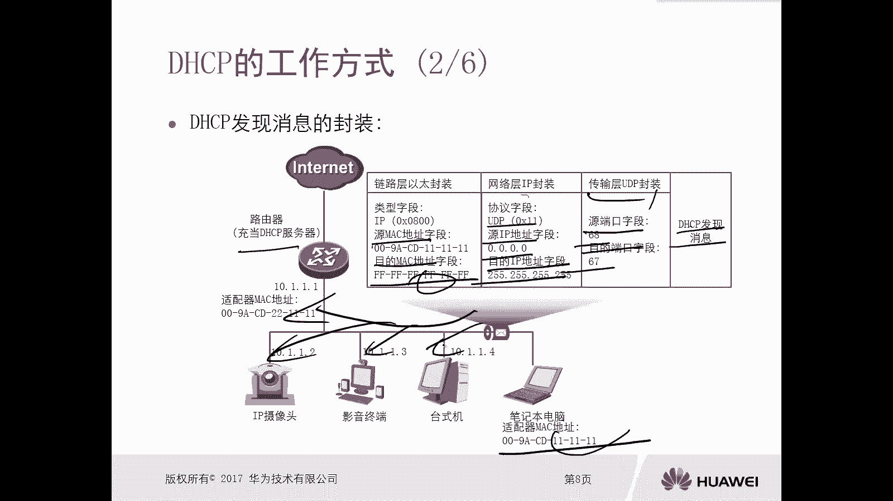

## 报文交互详解 📨

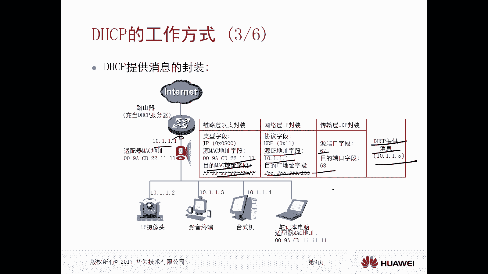

让我们通过一个具体的例子，详细分析这四个报文的封装格式。假设一台MAC地址为`11-11-11-11-11-11`的笔记本电脑，向一台IP地址为`10.1.1.1`、MAC地址为`22-11-11-11-11-11`的路由器（DHCP服务器）请求地址。

**1. DHCP Discover**
客户端广播发送发现报文。
*   **以太网帧头**：源MAC=`11-11-11-11-11-11`，目的MAC=`FF-FF-FF-FF-FF-FF`（广播）。
*   **IP报文头**：源IP=`0.0.0.0`（客户端尚无IP），目的IP=`255.255.255.255`（广播）。
*   **UDP头**：源端口=`68`，目的端口=`67`。
*   **DHCP消息**：类型为`Discover`。

**2. DHCP Offer**
服务器广播回复提供报文。
*   **以太网帧头**：源MAC=`22-11-11-11-11-11`，目的MAC=`FF-FF-FF-FF-FF-FF`。
*   **IP报文头**：源IP=`10.1.1.1`（服务器IP），目的IP=`255.255.255.255`。
*   **UDP头**：源端口=`67`，目的端口=`68`。
*   **DHCP消息**：类型为`Offer`，其中包含提供的IP地址（例如`10.1.1.5`）、网关、DNS等信息。

**3. DHCP Request**
客户端广播发送请求报文，确认使用哪个Offer。
*   **以太网帧头**：源MAC=`11-11-11-11-11-11`，目的MAC=`FF-FF-FF-FF-FF-FF`。
*   **IP报文头**：源IP=`0.0.0.0`，目的IP=`255.255.255.255`。
*   **UDP头**：源端口=`68`，目的端口=`67`。
*   **DHCP消息**：类型为`Request`，其中指定了选中的服务器IP（`10.1.1.1`）和请求的地址（`10.1.1.5`）。

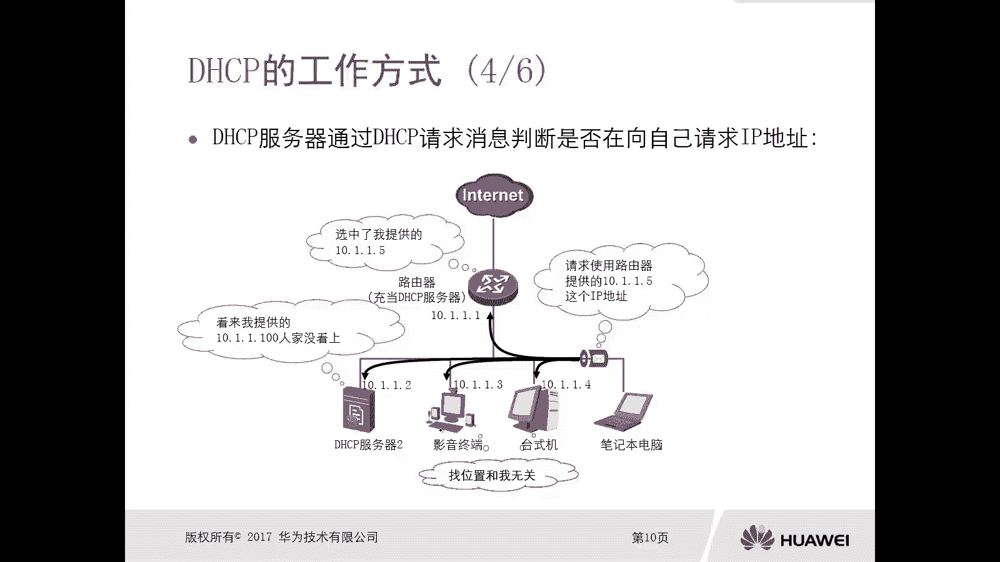

**4. DHCP ACK**
服务器最终确认，通常以单播形式发送。
*   **以太网帧头**：源MAC=`22-11-11-11-11-11`，目的MAC=`11-11-11-11-11-11`（客户端MAC）。
*   **IP报文头**：源IP=`10.1.1.1`，目的IP=`10.1.1.5`（分配给客户端的IP）。
*   **UDP头**：源端口=`67`，目的端口=`68`。
*   **DHCP消息**：类型为`ACK`，内容与Offer报文类似，作为最终确认。

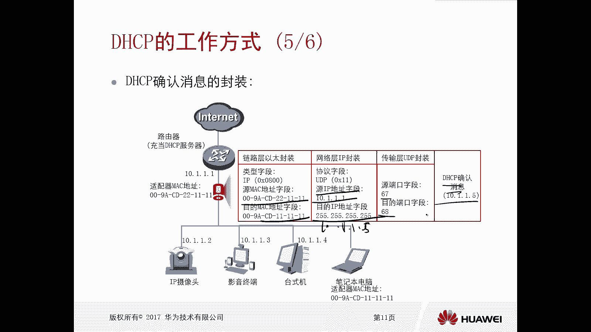

## DHCP中继代理 🔄

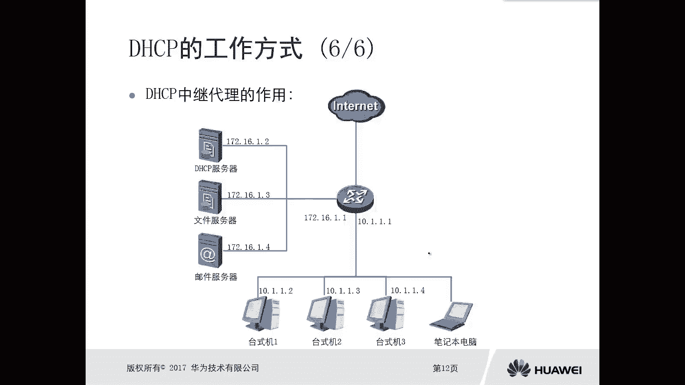

在了解了基本工作流程后，我们需要考虑一个现实问题：广播报文无法跨越路由器传播。如果DHCP服务器和客户端位于不同的子网，客户端发送的Discover广播报文将无法到达服务器。

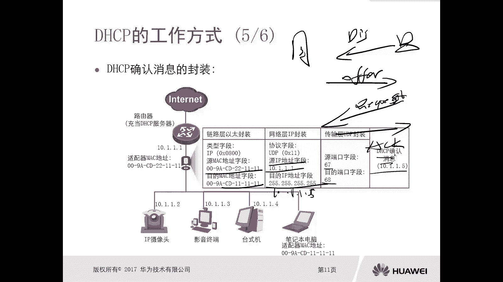

此时，就需要在客户端所在网段的路由器或三层交换机上配置**DHCP中继代理**。中继代理的作用是充当一个“中间人”。

以下是DHCP中继代理的工作过程：
1.  客户端照常广播发送`DHCP Discover`报文。
2.  中继代理（路由器）收到该广播报文后，将其修改为**单播**报文，并转发给指定的DHCP服务器（已知其IP地址）。
3.  DHCP服务器回复的`Offer`等报文以单播形式发送给中继代理。
4.  中继代理再将报文以广播或单播形式转发给客户端所在的网络。

通过这种方式，实现了跨网段的DHCP服务，这在大型企业网络部署中非常常见。

## 总结

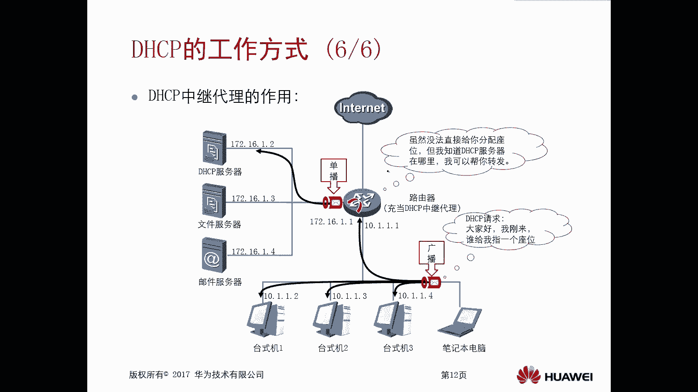

本节课中我们一起学习了DHCP协议的核心知识。我们首先了解了DHCP的定义和作用，即自动为终端设备分配IP地址等网络参数。接着，我们深入分析了DHCP的服务器-客户端模型及其基于UDP的传输方式。然后，我们重点讲解了DHCP工作的四个步骤：Discover、Offer、Request、ACK，并详细剖析了每个报文的封装格式。最后，我们探讨了当DHCP服务器与客户端不在同一网段时，如何通过DHCP中继代理来解决广播隔离的问题，从而在复杂网络环境中实现自动地址分配。掌握这些原理是进行网络规划、部署和故障排查的基础。