# 华为认证ICT学院HCIA/HCIP-Datacom教程：第1册-第3章：OSI参考模型与TCP/IP参考模型 📚

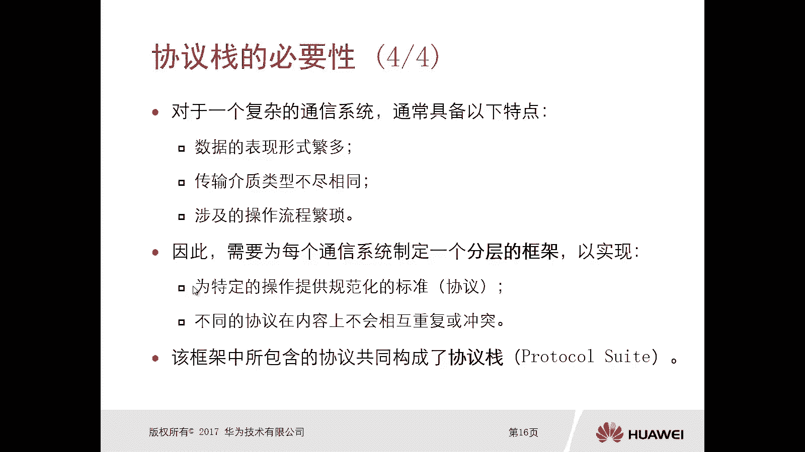

在本节课中，我们将要学习网络通信中两个核心的参考模型：OSI参考模型与TCP/IP参考模型。我们将了解它们的分层结构、各层功能、核心概念以及它们之间的区别与联系。

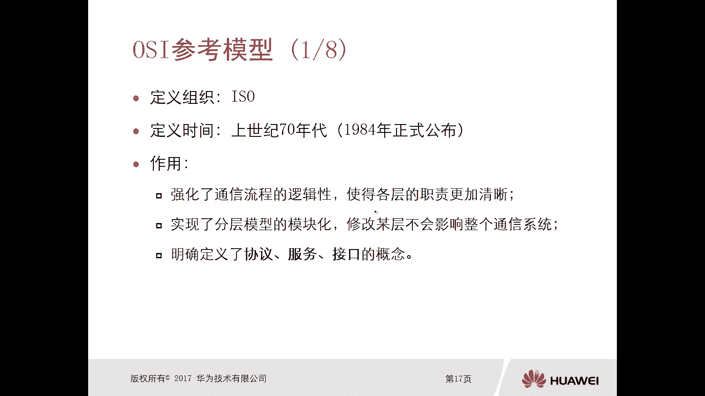

## 协议、服务与接口 🔗

上一节我们介绍了协议栈的必要性，本节中我们来看看两种重要的参考模型。首先，我们需要理解OSI参考模型中的三个核心概念：协议、服务与接口。

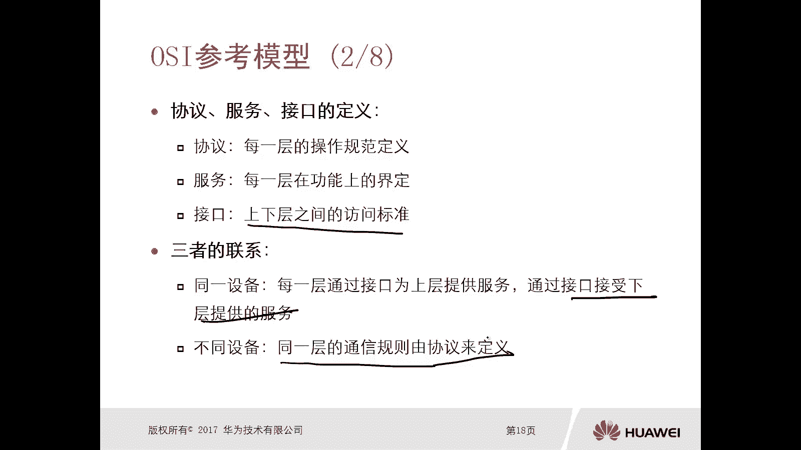

OSI参考模型由国际标准化组织（ISO）开发，全称为开放式系统互联模型。它是一个参考模型，于上世纪70年代制定，并在1984年正式公布。

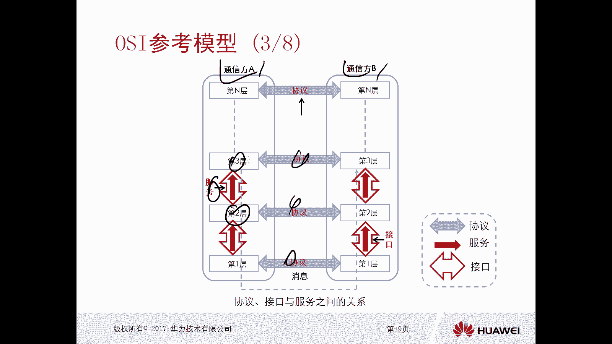

定义OSI参考模型的作用有三个：
1.  强化通信流程的逻辑性，使各层次的职责更加清晰。
2.  实现分层模型的模块化，修改某一层不会影响整个通信系统。
3.  明确定义了协议、服务、接口的概念。

以下是协议、服务与接口的具体定义：

*   **协议**：指每一层的操作规范定义。它是不同设备之间，**相同层次**进行通信的规则。
    *   **公式/代码示例**：`通信规则 = 协议(层N)`
*   **服务**：指每一层在功能上的界定，即该层能够实现的功能。它是同一设备内部，**下层**为相邻**上层**提供的功能调用。
*   **接口**：指上下层之间的访问标准。它是同一设备内部，**相邻层次**之间的通信规则。

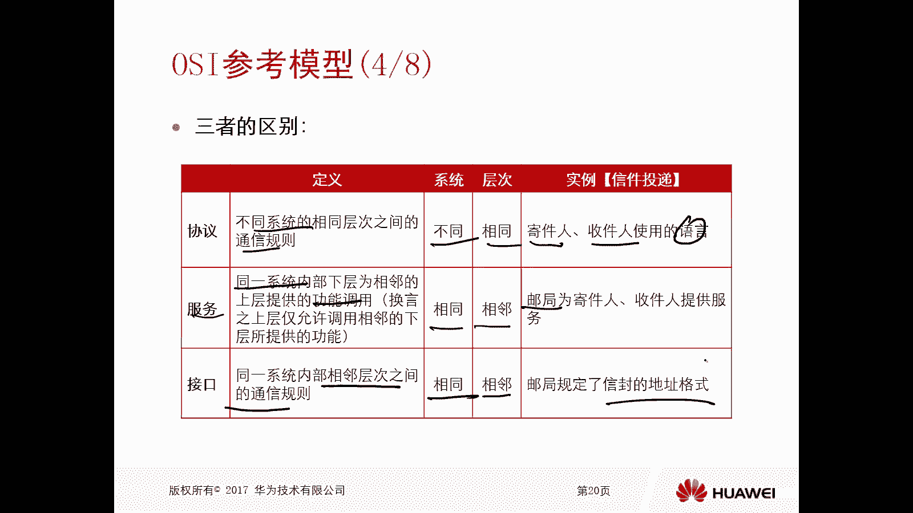

三者的联系是：在同一设备中，每一层通过接口为上层提供服务，也通过接口接受下层提供的服务。在不同设备之间，同一层的通信则由协议来定义。

为了更好地区分这三者，请看以下对比：

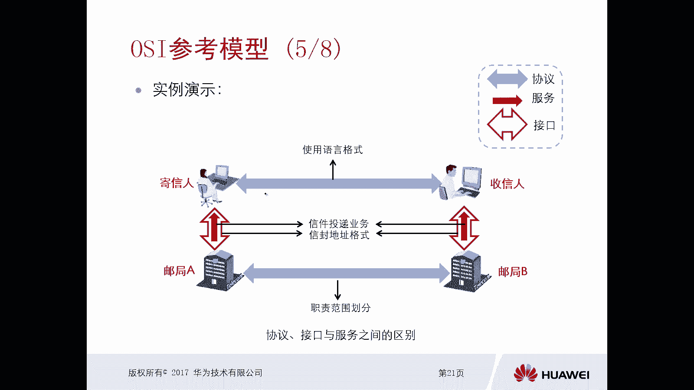

*   **协议**：存在于**不同系统**的**相同层次**之间。例如，寄信人和收信人使用同一种语言（如中文）写信和读信。
*   **服务**：存在于**同一系统**内部，是**相邻层次**之间的功能调用。例如，邮局为寄信人和收信人提供信件寄送与接收的服务。
*   **接口**：存在于**同一系统**内部，是**相邻层次**之间的通信规则。例如，邮局规定的信封地址书写格式（省、市、区、街道、邮编）。

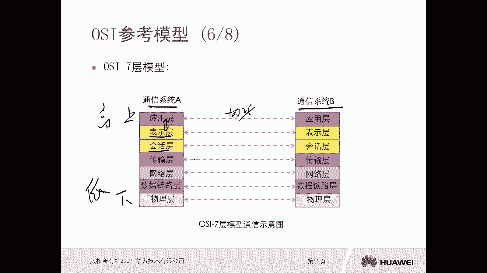

## OSI七层参考模型 🏗️

理解了核心概念后，我们详细看看OSI参考模型的具体构成。OSI模型一共分为七层，从上到下依次是：

1.  **应用层**：提供用户接口，即常见的应用程序，如QQ、微信。
2.  **表示层**：确保应用层发出的信息可以被对方解读，负责数据格式转换、加解密、压缩等。
3.  **会话层**：为通信双方建立、管理和终止会话，例如进行认证和授权。
4.  **传输层**：规范数据传输的功能和流程，如确认机制、数据分片与重组。此层数据单元称为**段（Segment）**。
5.  **网络层**：提供寻址和路由功能，定义逻辑地址（如IP地址）。此层数据单元称为**包（Packet）**。
6.  **数据链路层**：在相邻节点之间可靠地传输数据，定义硬件地址（如MAC地址）、进行差错校验等。此层数据单元称为**帧（Frame）**。
7.  **物理层**：为通信提供物理介质，定义电气、机械等硬件标准。此层传输的是**比特（Bit）**。

数据在发送方从高层（应用层）向低层（物理层）逐层处理封装；在接收方则从低层向高层逐层解封装和处理。

然而，OSI参考模型存在一些缺陷：层次划分过于琐碎；严格绑定服务与协议导致实现复杂；部分服务在不同层次重复出现，效率较低；且由于提出时间早，难以适应新的网络协议。

## TCP/IP四层参考模型 🌐

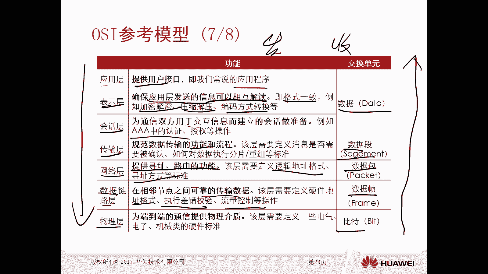

鉴于OSI模型的不足，实践中广泛采用的是TCP/IP参考模型。它对OSI模型做出了以下调整：

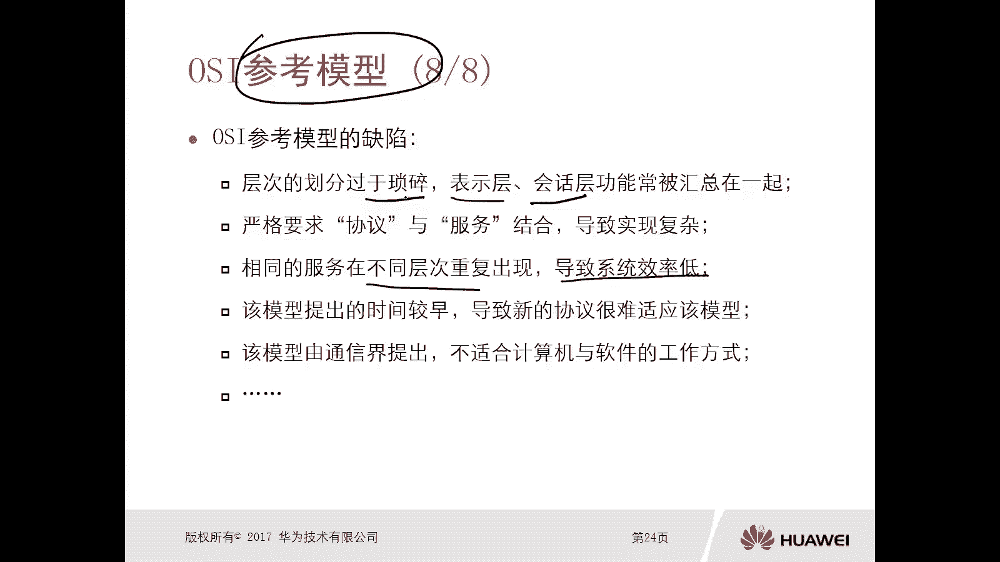

1.  合并了OSI的应用层、表示层和会话层，统称为**应用层**。
2.  合并了OSI的数据链路层和物理层，称为**网络接入层**（或网络接口层）。
3.  模型与现有的TCP/IP协议族高度吻合。
4.  没有明确定义协议、服务、接口的概念。

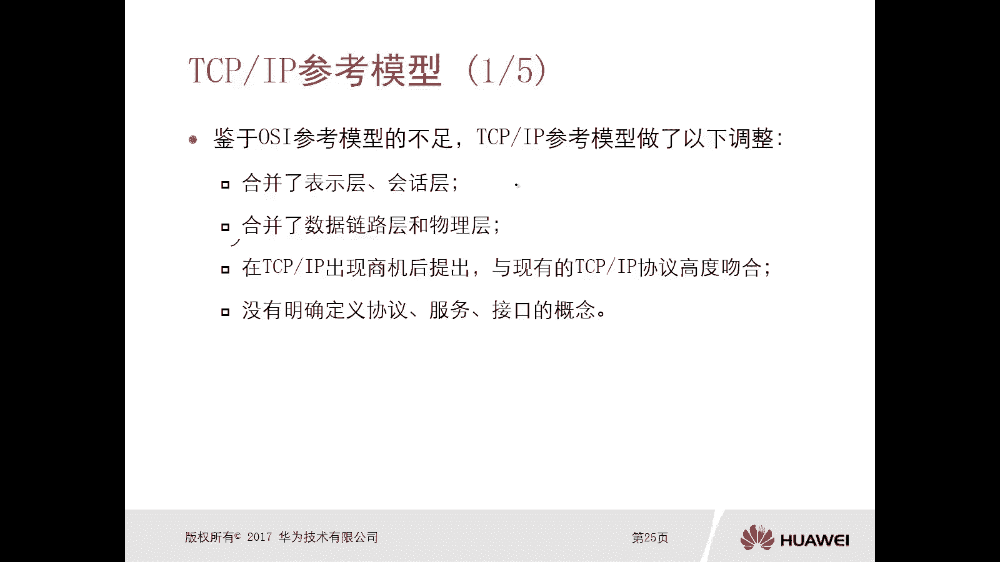

因此，TCP/IP模型是一个四层结构：

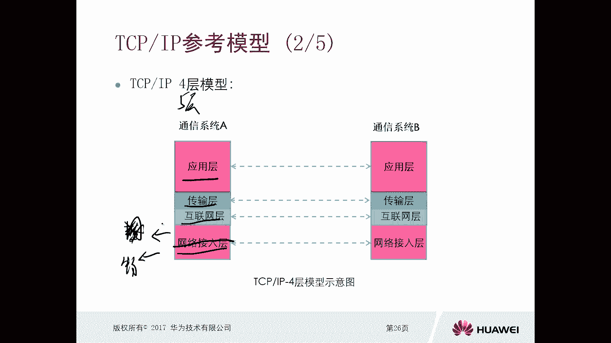

1.  **应用层**：对应OSI的应用层、表示层、会话层，提供各种网络服务，常见协议有HTTP、DNS、FTP。
2.  **传输层**：对应OSI的传输层，建立端到端的连接，主要协议是TCP和UDP。
3.  **互联网层**：对应OSI的网络层，负责数据包的路由和转发，核心协议是IP。
4.  **网络接入层**：对应OSI的数据链路层和物理层，负责在物理网络上传输数据。

有时，为了教学和理解的方便，也会将TCP/IP模型表述为五层，即把网络接入层拆分为**数据链路层**和**物理层**。

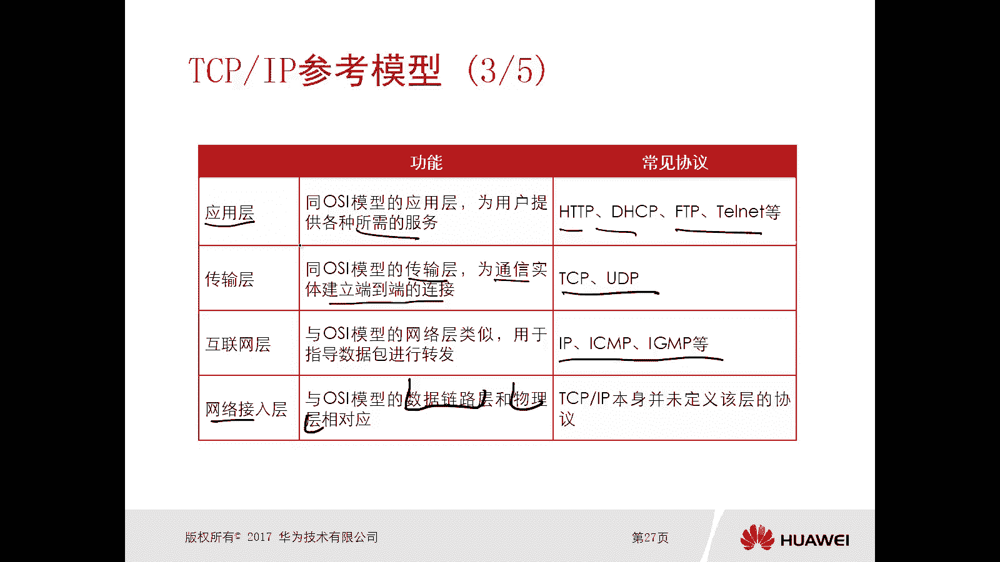

TCP/IP模型同样存在缺陷：未明确定义协议、服务、接口，导致不同厂商实现有差异；对网络接入层的定义较为模糊；且主要围绕TCP/IP协议设计，通用性不如OSI模型。

## 模型对比与总结 ⚖️

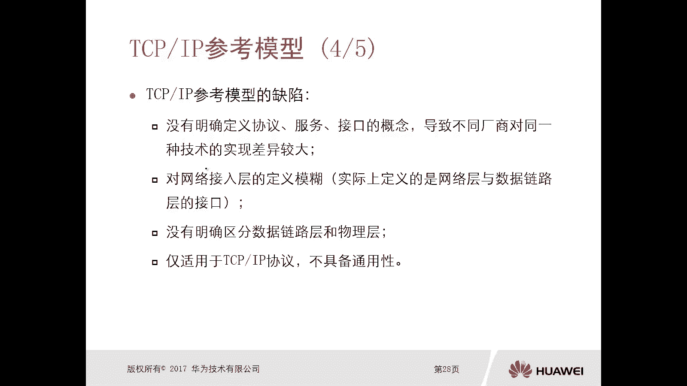

最后，我们来对比一下这两个模型。OSI七层模型划分细致，理论性强，**更适合用于教学和研究**。而TCP/IP四层模型结构精简，与实践中的TCP/IP协议族完美契合，**更具备实践意义，是当前网络通信的实际标准**。

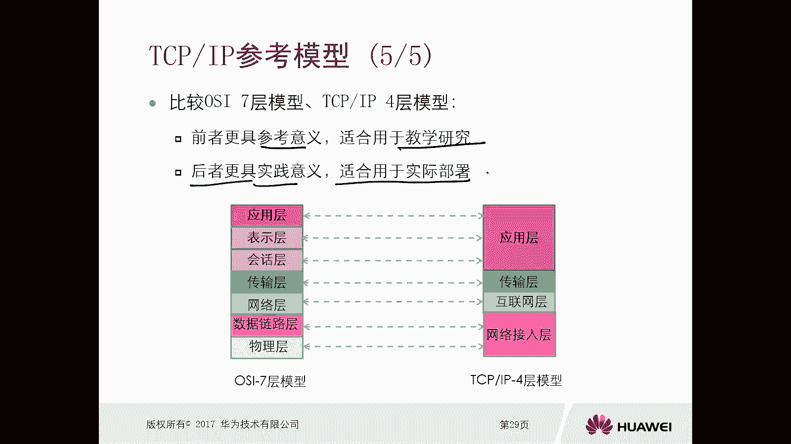

本节课中我们一起学习了：
1.  通信需要解决的基本问题。
2.  协议的作用与协议分层的好处。
3.  OSI参考模型中协议、服务、接口的概念与区别。
4.  OSI七层模型与TCP/IP四层模型各层的名称与功能。
5.  TCP/IP模型相对于OSI模型的主要改进之处。

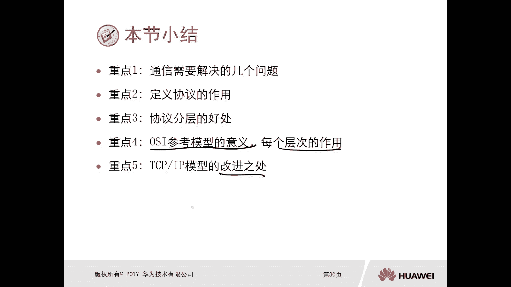

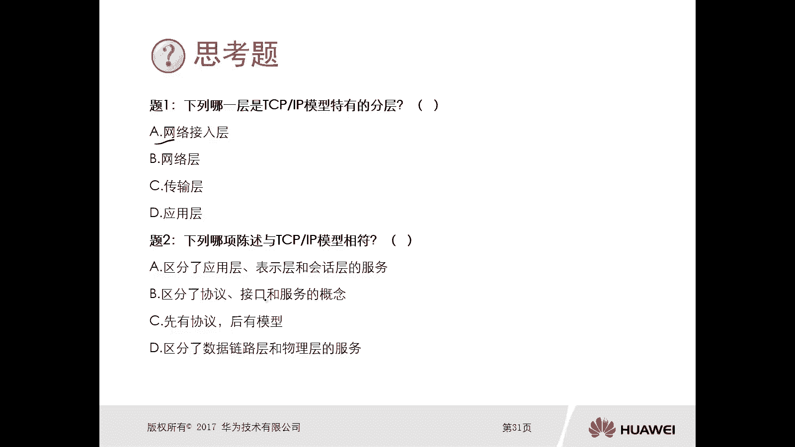

---
**思考题答案提示**：
1.  TCP/IP模型特有的分层是**网络接入层**（它合并了OSI的数据链路层和物理层）。
2.  与TCP/IP模型相符的陈述应体现其四层结构及与协议的对应关系，例如：“TCP/IP模型包含应用层、传输层、互联网层和网络接口层”。