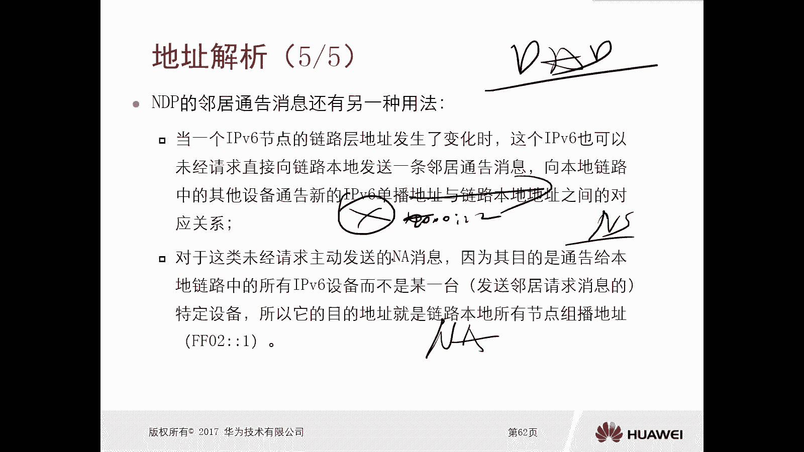
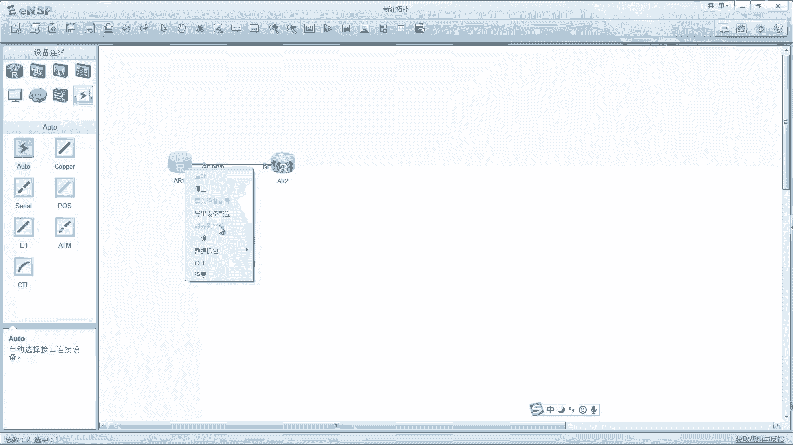
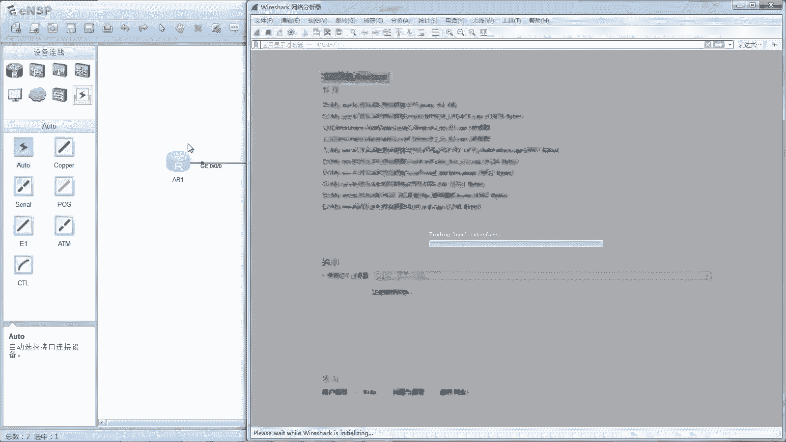
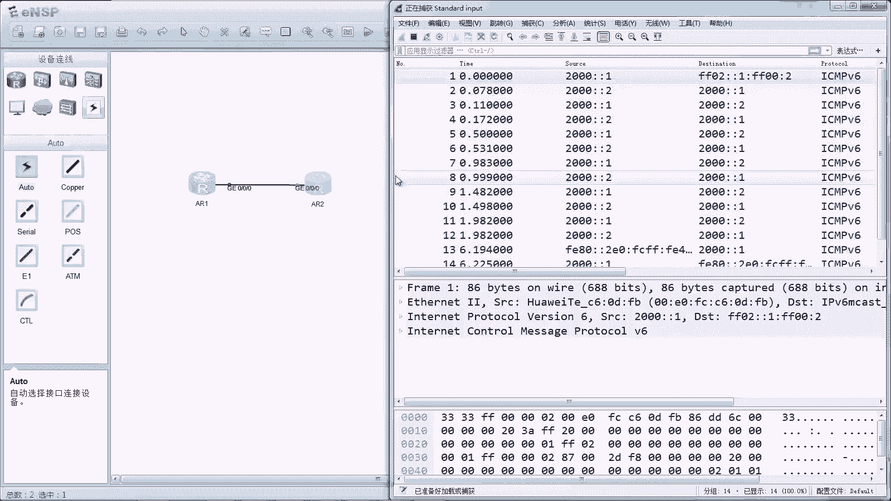
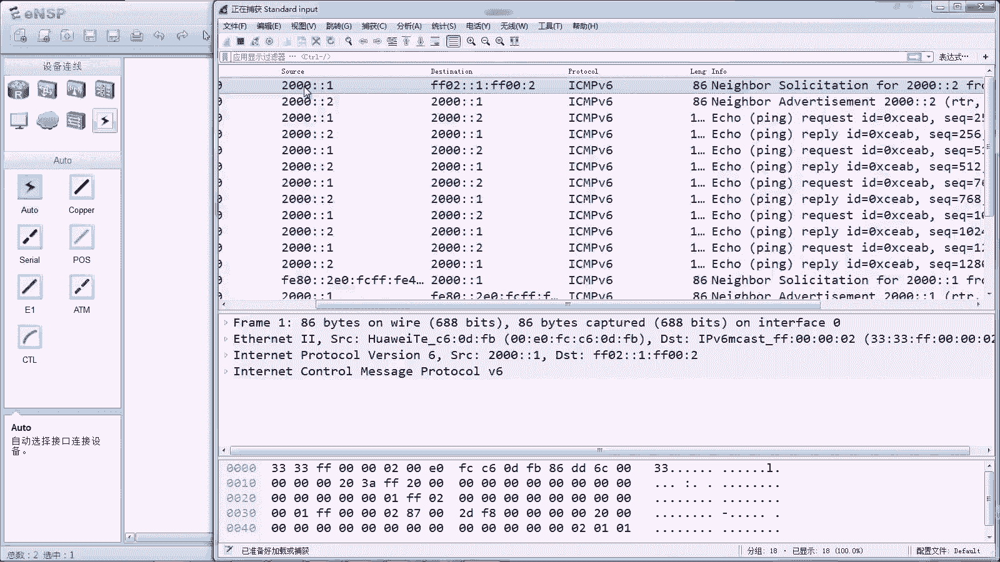
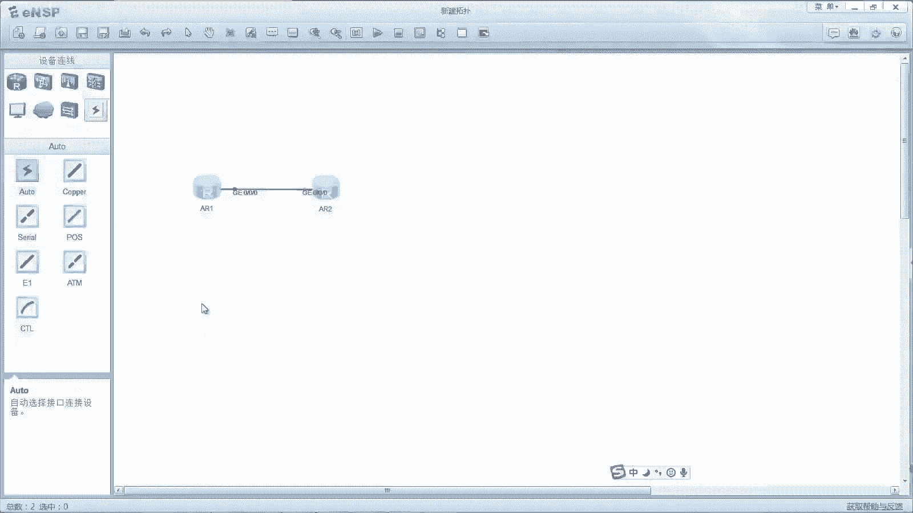

# 华为认证ICT学院HCIA/HCIP-Datacom教程：第3册-第7章-2：IPv6地址解析过程及配置 🧩

在本节课中，我们将要学习IPv6网络中一个核心的通信基础：地址解析过程。我们将了解IPv6如何在没有广播和ARP协议的情况下，通过NDP协议完成地址解析，并会通过实验演示其具体过程。

## IPv6地址解析概述

上一节我们介绍了IPv6的基础地址类型。本节中我们来看看IPv6设备如何获取目标IP地址对应的MAC地址，即地址解析过程。

在IPv4网络中，地址解析主要通过ARP协议实现，并且采用广播方式。然而，IPv6地址类型包含单播、组播和任播，但没有广播。因此，IPv6不再使用ARP协议。

那么，IPv6如何进行地址解析？实际上，IPv6使用邻居发现协议（NDP）来实现这一功能。NDP协议功能众多，地址解析只是其功能之一。

## NDP地址解析原理

NDP协议在地址解析时，使用组播而非广播。具体来说，它使用目标设备的**请求节点组播地址**作为邻居请求报文的目的IP地址。

请求节点组播地址的格式是固定的，其构成如下：
```
FF02::1:FFXX:XXXX
```
其中，前104位（`FF02::1:FF`）是固定前缀。后24位（`XX:XXXX`）则直接取自目标IPv6单播地址接口ID的最后24位。

这意味着，每当一个网络接口配置了一个单播或任播IPv6地址时，该接口会自动加入该地址对应的请求节点组播组。因此，不同的IPv6地址对应不同的请求节点组播地址。

## 地址解析过程详解

以下是IPv6地址解析的具体步骤，它主要使用NDP协议中的**邻居请求（NS）** 和**邻居通告（NA）** 两种报文。

1.  **发送邻居请求（NS）**：当主机A需要与主机B通信，但不知道主机B的MAC地址时，主机A会构造一个NS报文。该报文的目的IP地址是主机B的IPv6地址对应的请求节点组播地址。报文中包含主机A的IP和MAC地址，并询问“谁是主机B的IP地址？请告知你的MAC地址。”
2.  **接收与处理NS报文**：由于这是一个组播报文，链路上所有主机都能收到。但只有其IPv6地址与请求节点组播地址匹配的主机（即主机B）才会处理此报文。
3.  **回复邻居通告（NA）**：主机B处理NS报文后，会以单播形式回复一个NA报文给主机A。报文中包含主机B的IP地址和MAC地址。
4.  **完成解析**：主机A收到NA报文后，就获得了主机B的MAC地址，从而可以完成数据帧的封装并进行通信。

此过程与IPv4的ARP解析目的一致，但初始请求的方式从广播变为了针对特定组播地址的组播。

## 重复地址检测（DAD）

在IPv6中，当一个接口配置新的IPv6地址时，会自动进行重复地址检测，以确保地址唯一性。这个过程也利用NDP协议。

DAD过程简述如下：
*   主机会向新配置地址的请求节点组播地址发送一个NS报文，询问该地址的MAC地址。
*   如果收到回应，说明该地址已被使用，则配置失败。
*   如果没有收到回应，则判定该地址可用，主机可能会随后发送一个NA报文（在某些设备上可能省略）来宣告自己开始使用此地址。

## 实验：配置与抓包分析

接下来，我们通过一个简单的实验来验证IPv6的地址解析过程。



### 实验拓扑与配置

实验使用两台路由器直连。
*   **R1** 接口配置：`ipv6 address 2000::1/64`
*   **R2** 接口配置：`ipv6 address 2000::2/64`

在R1上执行 `ping ipv6 2000::2` 命令，触发地址解析过程。

### 观察请求节点组播组

配置地址后，可以使用 `display ipv6 interface GigabitEthernet 0/0/0` 命令查看接口信息。可以看到，接口自动加入了其IPv6地址对应的请求节点组播组，例如 `FF02::1:FF00:2`。





### 抓包分析过程



在链路上抓包，可以观察到以下报文序列：
1.  **NS报文**：源地址为 `2000::1`，目的地址为 `FF02::1:FF00:2`（即 `2000::2` 的请求节点组播地址）。报文内容为请求 `2000::2` 的链路层地址。
2.  **NA报文**：源地址为 `2000::2`，目的地址为 `2000::1`（单播）。报文内容为通告 `2000::2` 的链路层地址。



通过这两个报文，R1成功获取了R2的MAC地址，随后ICMPv6 Echo请求和回复得以正常传输。

### 演示DAD过程

在R1的接口上新配置一个地址，例如 `ipv6 address 2088::88/64`。抓包可以观察到，系统立即发出一个NS报文，源地址为“未指定地址”(::)，目的地址为新地址 `2088::88` 的请求节点组播地址 `FF02::1:FF00:88`，以此进行重复地址检测。

## 总结

本节课中我们一起学习了IPv6的地址解析机制。关键点总结如下：
*   IPv6使用**NDP协议**替代ARP进行地址解析。
*   初始请求使用**请求节点组播地址**（格式为 `FF02::1:FFXX:XXXX`），而非广播。
*   解析过程使用 **NS（邻居请求）** 和 **NA（邻居通告）** 两种报文。
*   新配置IPv6地址时会自动进行**重复地址检测（DAD）**。
*   通过实验抓包，我们直观地验证了NS/NA报文的交互过程以及DAD的触发机制。



理解这一过程是掌握IPv6基础通信原理的重要一步。