# 华为认证ICT学院HCIA/HCIP-Datacom教程：P52：第3册-第9章-1-AAA简介和RADIUS简介

在本节课中，我们将要学习AAA技术的基本概念、工作原理以及RADIUS协议的基础知识。AAA是网络访问控制中一项重要的安全技术，理解它对于构建安全的网络管理体系至关重要。

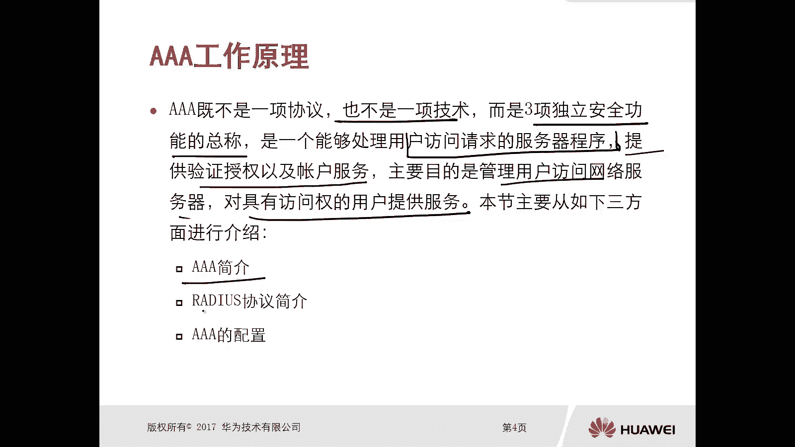

## AAA技术简介

上一节我们介绍了课程的整体结构，本节中我们来看看AAA技术。AAA不是一项具体的协议，而是一项由三项独立安全功能组成的技术框架。这三个“A”分别代表认证、授权和审计。

以下是AAA的三项核心功能：

*   **认证**：验证用户身份的过程。用户需要提供凭证（如用户名和密码）来证明自己的身份。
*   **授权**：根据用户的身份和属性，授予其相应的访问权限和操作权限。
*   **审计**：记录用户在访问网络资源期间所执行的操作，用于安全分析和行为追溯。

## AAA的工作原理

了解了AAA的基本构成后，我们来看看它是如何工作的。AAA的实现方式主要分为两种：本地AAA和基于服务器的AAA。

### 本地AAA工作方式

在小型网络中，可以直接在网络设备（如路由器、交换机）上配置AAA。设备自身维护一个用户数据库，直接处理认证、授权和审计请求。

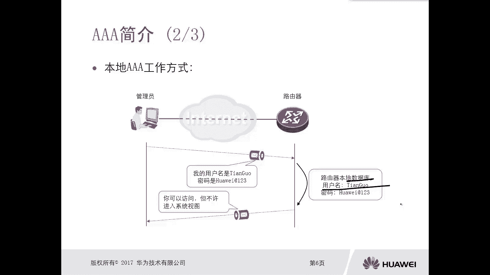

其工作流程可以概括为：
1.  用户（如管理员）尝试登录设备（例如通过Telnet）。
2.  设备提示用户输入用户名和密码。
3.  设备在自身的本地用户数据库中查找并核对凭证。
4.  认证成功后，设备根据为该用户配置的权限级别（如0-15级）进行授权。
5.  设备记录用户的操作日志，完成审计。

**代码示例：在华为设备上创建本地用户**
```
[Huawei] local-user admin password cipher Huawei@123
[Huawei] local-user admin privilege level 15
[Huawei] local-user admin service-type telnet
```

然而，当网络规模扩大、设备数量增多时，需要在每台设备上重复配置用户信息，管理效率低下，扩展性差。

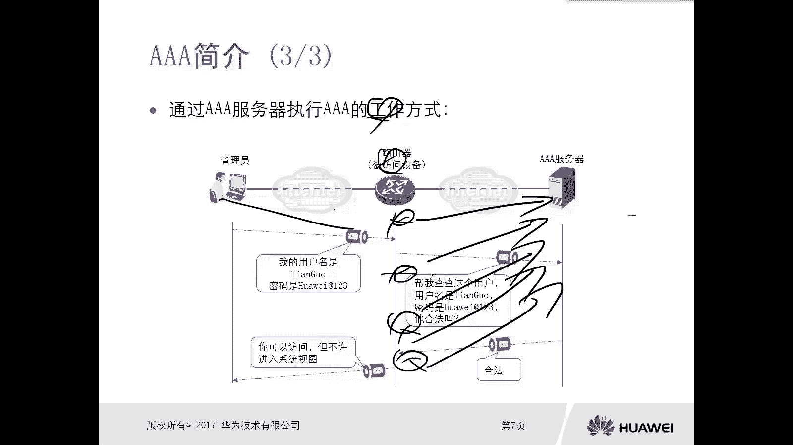

### 基于AAA服务器的工作方式

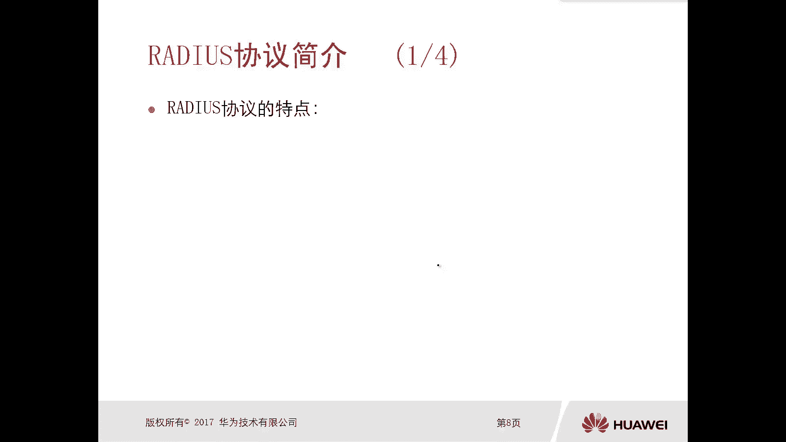

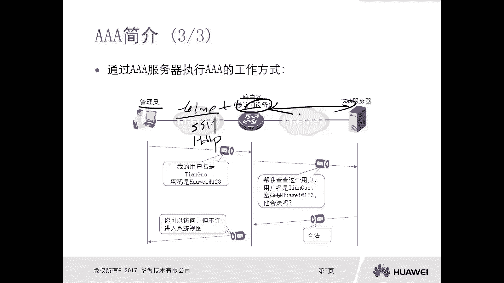

为了解决上述问题，可以采用集中的AAA服务器。网络设备作为AAA客户端，将认证、授权和审计请求转发给专门的AAA服务器处理。

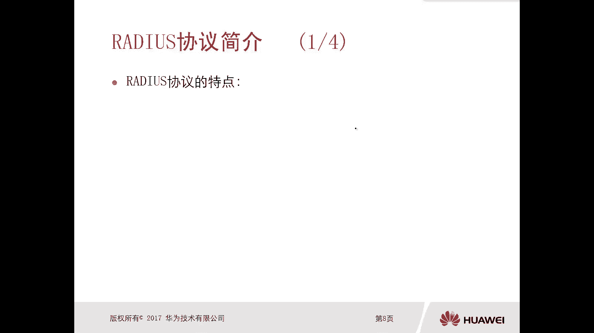

其工作流程如下：
1.  用户尝试登录网络设备。
2.  设备将用户凭证转发给AAA服务器。
3.  AAA服务器在其中心数据库中核对用户凭证。
4.  服务器将认证结果和授权信息（如VLAN、ACL、权限级别）返回给设备。
5.  设备根据服务器的响应允许或拒绝用户访问，并记录审计信息。

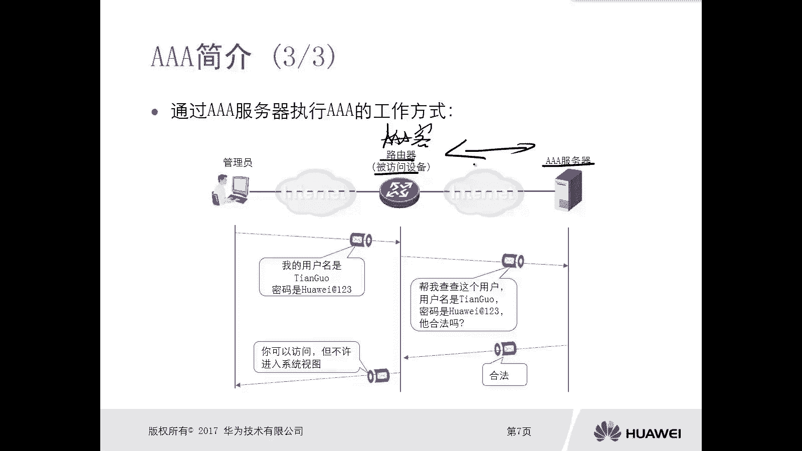

这种方式实现了用户的集中管理，大大提升了网络管理的可扩展性和便捷性。

## RADIUS协议简介

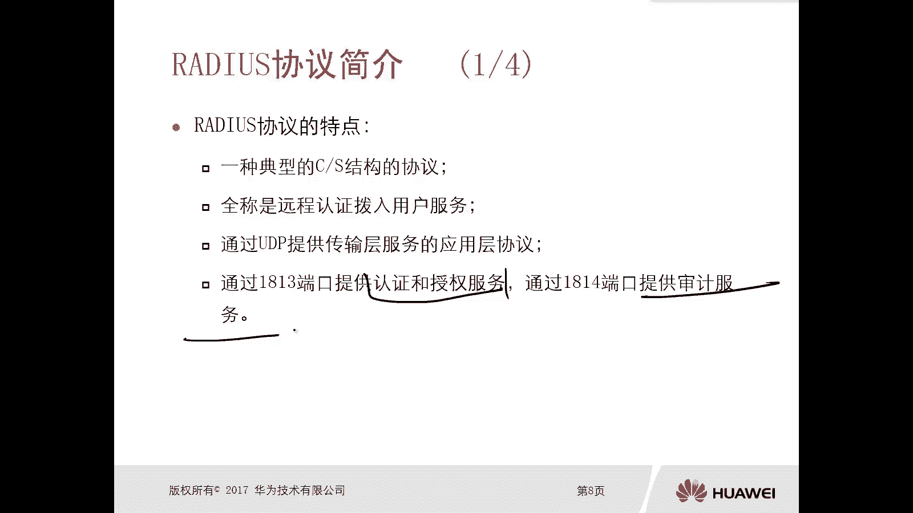

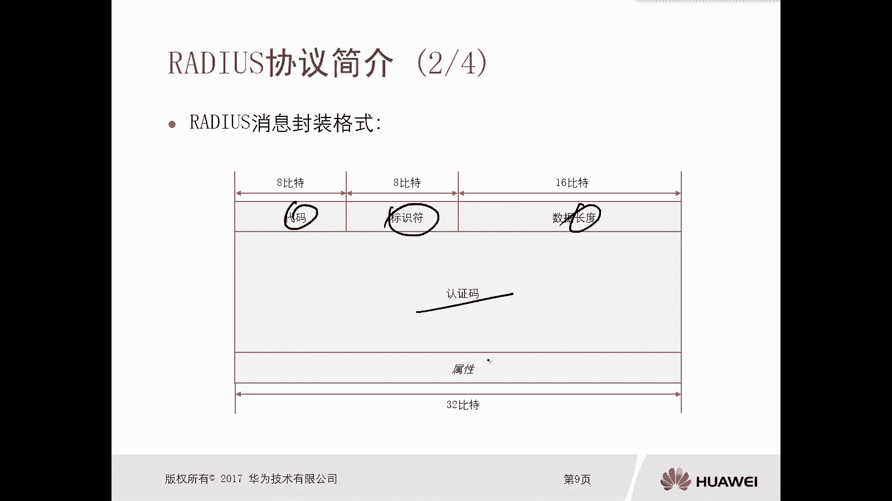

在基于服务器的AAA架构中，AAA客户端与服务器之间需要使用特定的协议进行通信。RADIUS就是其中最常用的一种标准协议。

RADIUS是一种典型的C/S（客户端/服务器）结构协议，全称为**远程认证拨号用户服务**。它使用UDP协议进行传输，具有以下特点：
*   使用**UDP 1812端口**进行认证和授权。
*   使用**UDP 1813端口**进行计费（审计）。
*   认证和授权过程通常合并进行。

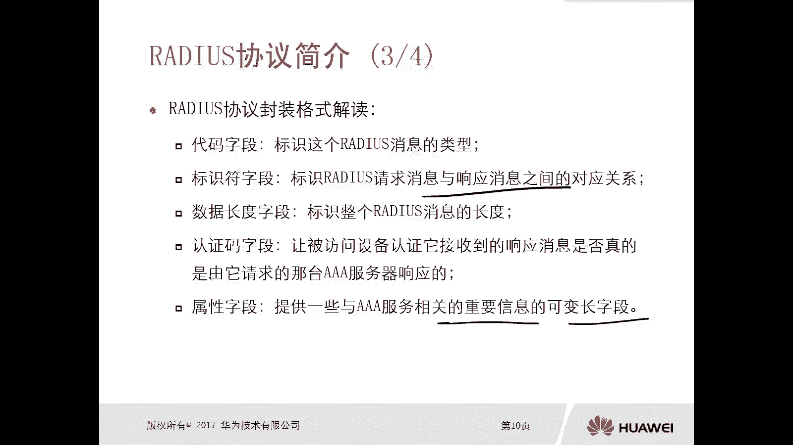

RADIUS报文的基本格式包含以下字段：
*   **Code**：标识RADIUS报文类型（如认证请求、接受、拒绝）。
*   **Identifier**：匹配请求与响应的标识符。
*   **Length**：整个报文的总长度。
*   **Authenticator**：用于验证响应报文真实性的认证码。
*   **Attributes**：携带详细认证、授权及配置信息的属性集合，这是报文的核心部分。

一个基本的RADIUS认证/授权流程如下：
1.  用户访问设备（AAA客户端）。
2.  客户端向RADIUS服务器发送**Access-Request**报文，包含用户名等信息。
3.  服务器查询数据库，若凭证正确，则回复**Access-Accept**报文（包含授权属性）；若错误，则回复**Access-Reject**报文。
4.  客户端根据接收到的报文决定允许或拒绝用户访问。

**公式：基本RADIUS交互**
`客户端 (Access-Request) -> 服务器 -> 客户端 (Access-Accept / Access-Reject)`

## 总结

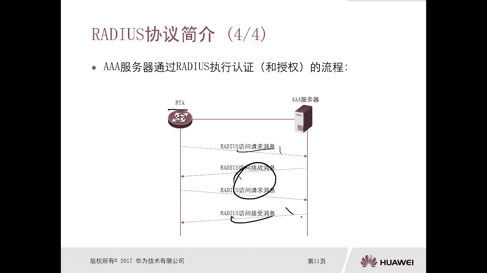

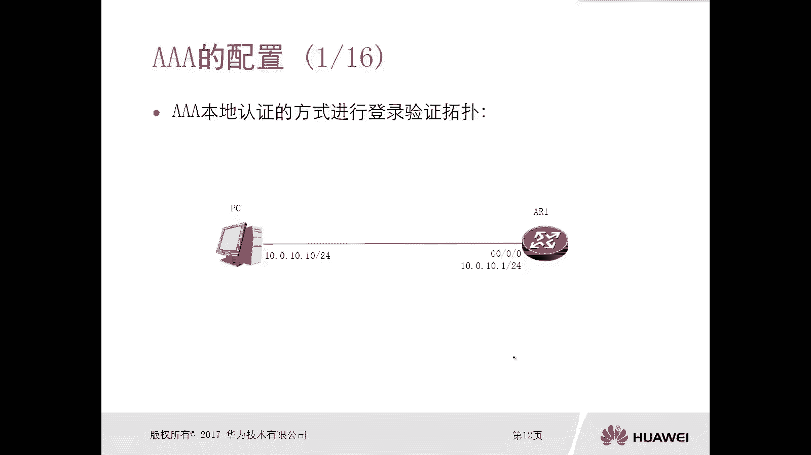

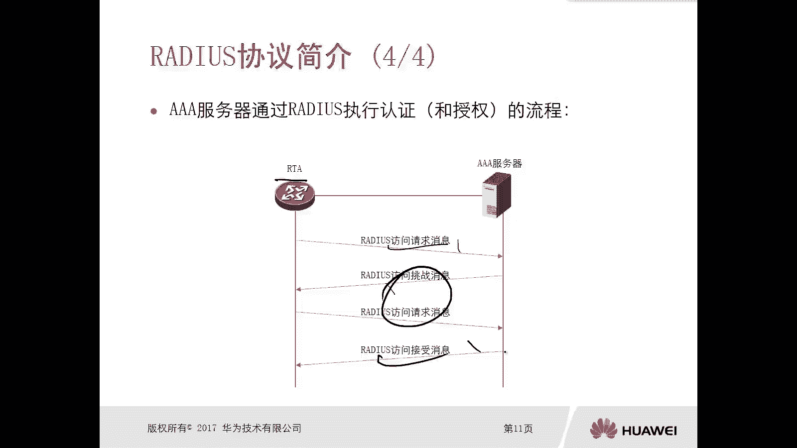

本节课中我们一起学习了AAA技术的基础知识。我们首先明确了AAA代表认证、授权和审计三项安全功能，是一项技术框架而非单一协议。接着，我们分析了本地AAA和基于服务器AAA两种工作方式的原理及适用场景。最后，我们介绍了AAA客户端与服务器间通信的标准协议——RADIUS，了解了其特点、报文格式和基本工作流程。掌握这些内容是后续进行实际AAA配置的重要基础。