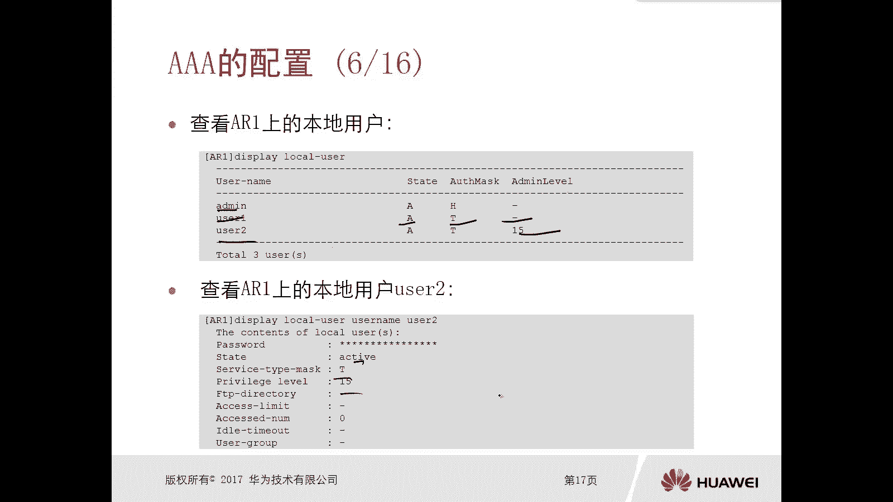
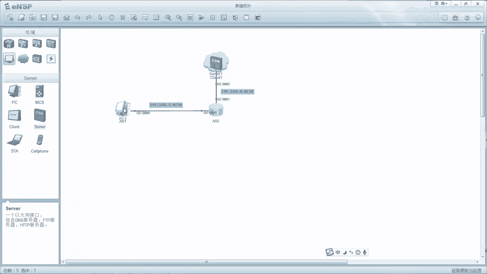
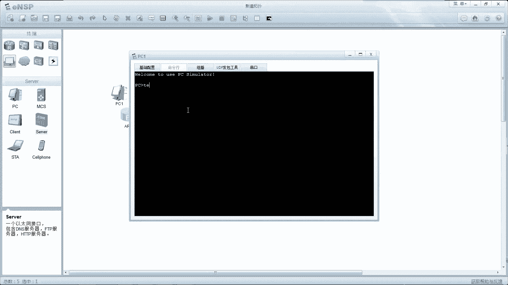
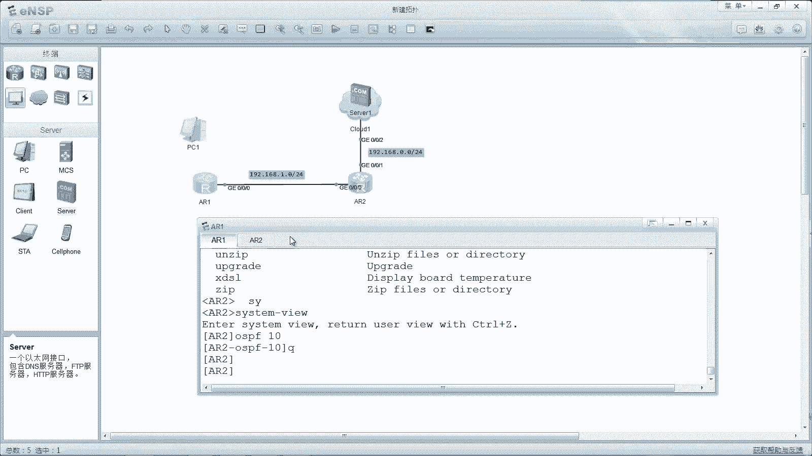
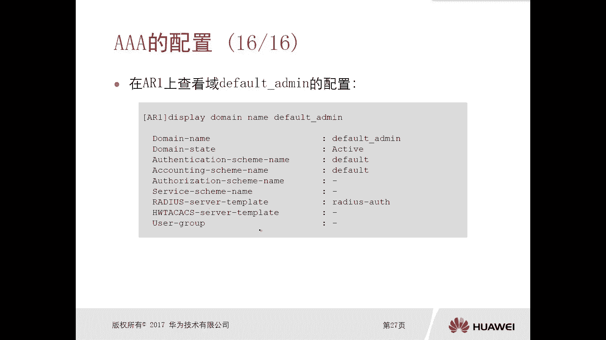
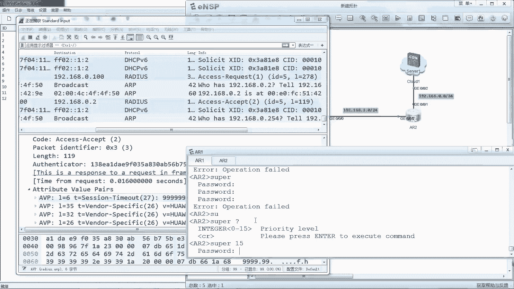
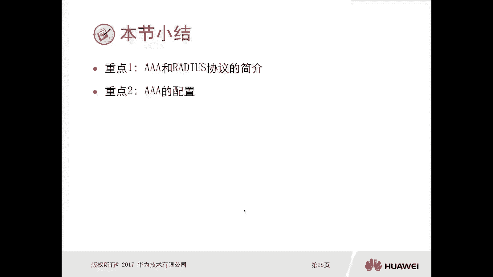

# 华为认证ICT学院HCIA/HCIP-Datacom教程：第3册-第9章-2：AAA配置 🛠️

在本节课中，我们将学习AAA（认证、授权、计费）的配置方法。AAA是网络设备管理中的重要安全机制，用于验证用户身份、控制访问权限并记录操作日志。我们将分别介绍本地AAA认证和基于RADIUS服务器的远程AAA认证两种配置方式，并通过实验演示其具体操作步骤。

## 本地AAA认证配置 🔐





上一节我们介绍了AAA的基本概念，本节中我们来看看如何在网络设备上配置本地AAA认证。本地认证将用户信息（如用户名和密码）存储在设备本地，适用于小型或简单的管理场景。



以下是在路由器上配置本地AAA认证以管理Telnet登录的步骤：

1.  **创建本地用户**：在系统视图下，使用命令创建用户并设置密码与服务类型。
    ```bash
    [Huawei] local-user user1 password cipher Huawei@123
    [Huawei] local-user user1 service-type telnet
    ```
2.  **（可选）设置用户权限级别**：可以为不同用户设置不同的命令执行权限级别（0-15级，15级为最高）。
    ```bash
    [Huawei] local-user user2 password cipher Huawei@123
    [Huawei] local-user user2 service-type telnet
    [Huawei] local-user user2 privilege level 15
    ```
3.  **在VTY线路下启用AAA认证**：进入用户接口视图，将认证模式设置为AAA。
    ```bash
    [Huawei] user-interface vty 0 4
    [Huawei-ui-vty0-4] authentication-mode aaa
    ```

配置完成后，当用户通过Telnet登录设备时，系统会要求输入用户名和密码。不同权限级别的用户登录后，可执行的命令范围不同。例如，`user1`（默认级别0）只能执行`ping`、`display`等监控命令，而`user2`（级别15）可以进入系统视图并执行所有配置命令。



我们可以使用 `display local-user` 命令来查看已创建的本地用户及其状态。

## 基于RADIUS服务器的远程AAA认证 🌐

了解了本地认证后，我们来看看更适用于中大型网络的远程集中认证方式。这种方式将用户数据库部署在独立的RADIUS服务器上，由网络设备将认证请求转发至服务器进行处理，便于统一管理。

以下是配置基于RADIUS服务器认证的关键步骤：

1.  **配置RADIUS服务器模板**：在设备上指定RADIUS服务器的地址、端口及共享密钥。
    ```bash
    [Huawei] radius-server template radius_os
    [Huawei-radius-radius_os] radius-server authentication 192.168.0.100 1812
    [Huawei-radius-radius_os] radius-server shared-key cipher Huawei@123
    ```
2.  **修改认证方案**：将默认认证方案从`local`改为`radius`。
    ```bash
    [Huawei] aaa
    [Huawei-aaa] authentication-scheme default
    [Huawei-aaa-authen-default] authentication-mode radius
    ```
3.  **在域中应用RADIUS服务器模板**：在默认管理域中调用已创建的RADIUS模板。
    ```bash
    [Huawei-aaa] domain default_admin
    [Huawei-aaa-domain-default_admin] authentication-scheme default
    [Huawei-aaa-domain-default_admin] radius-server radius_os
    ```



配置完成后，可以使用 `test-aaa` 命令测试与RADIUS服务器的连通性及用户认证是否成功。
```bash
[Huawei] test-aaa user01 Huawei@123 radius-template radius_os
```
如果提示“Authentication test succeeded”，则表明配置正确。

当用户通过Telnet登录时，设备会向RADIUS服务器（如`192.168.0.100`）发送认证请求。服务器验证用户信息后，将结果（接受或拒绝）返回给设备，从而决定用户能否登录。我们可以通过抓包工具观察RADIUS协议（UDP 1812端口）的交互过程。

> **注意**：在RADIUS协议中，密码是经过加密传输的，这增强了认证过程的安全性。

对于通过RADIUS认证登录但权限较低的用户，可以在设备本地配置提升权限的密码（super密码），实现认证与授权的分离。
```bash
[Huawei] aaa
[Huawei-aaa] authentication-scheme default
[Huawei-aaa-authen-default] authentication-super super
[Huawei] super password level 15 cipher Huawei@456
```
用户登录后，输入 `super 15` 命令并正确输入密码，即可将权限提升至15级。

## 总结 📝

本节课中我们一起学习了AAA的两种主要配置方式。

*   **本地AAA认证**：配置简单，用户信息存储在设备本地，通过创建本地用户、设置服务类型和在VTY接口下启用AAA认证即可实现。适用于设备数量少、用户不多的环境。
*   **远程RADIUS认证**：通过配置RADIUS服务器模板并修改认证方案，将认证请求转发至中央服务器。这种方式便于对大量网络设备和用户进行集中、统一的安全管理，是更可扩展的解决方案。





理解并掌握这两种AAA配置方法，对于构建安全、可控的网络管理环境至关重要。