# 华为认证ICT学院HCIA/HCIP-Datacom教程：P54：IPsec与IKE简介 🔐

在本节课中，我们将要学习IP安全（IPsec）与互联网密钥交换协议（IKE）的基本概念。IPsec用于在不安全的网络环境中保护数据传输的安全，而IKE则用于自动协商和管理IPsec所需的密钥。理解这两者是构建安全网络通信的基础。

## IPsec简介

上一节我们提到了网络安全的重要性，本节中我们来看看实现安全传输的具体技术——IPsec。

IPsec全称为IP安全，其核心目的是保证IP网络传输的数据不被窃取，提供加密传输。在缺省情况下，IP网络传输的数据没有加密和认证机制，因此并不安全。IPsec通过对数据进行封装来解决此问题。

关于数据封装，存在几种不同的加密范围选择：

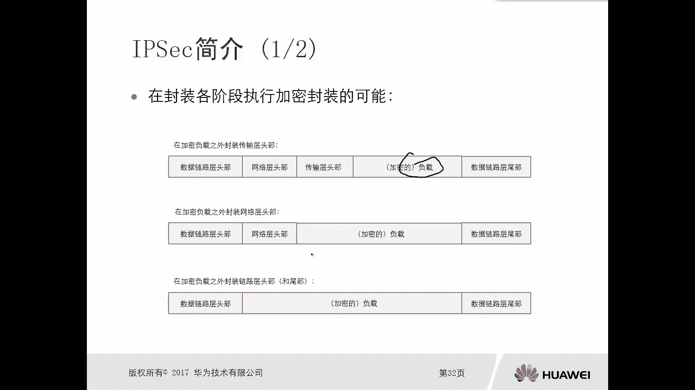

以下是几种可能的加密封装情况：
*   **仅加密负载**：只对数据的负载部分进行加密，传输层头部（如TCP/UDP头部）是裸露的。这种方式相对不够安全。
*   **加密负载及传输层头部**：将负载和传输层头部一同加密，网络层头部（IP头部）裸露在外。安全性有所提升，但网络层信息仍可见。
*   **加密至网络层**：将负载、传输层及网络层头部全部加密。这种方式最安全，但会带来一个问题：路由器等网络设备需要先解密数据包才能查看目的IP地址进行路由转发，这对设备性能要求极高，难以实现。

因此，IPsec采用了一种折中且高效的封装框架。

IPsec不是一个单一的协议，而是一个高度模块化的安全框架。在此框架内，包含诸如IKE、ISAKMP、ESP、AH等一系列协议。

IPsec的核心是两种封装协议：
*   **ESP（封装安全负载）**：IP协议号为`50`。ESP能提供**数据加密**、**通信方身份认证**和**数据完整性保护**。
*   **AH（认证头部）**：IP协议号为`51`。AH只能提供**身份认证**和**完整性校验**，**不提供加密**功能。

由于ESP功能更全面，在实际应用中通常首选ESP，或ESP与AH结合使用，很少单独使用AH。

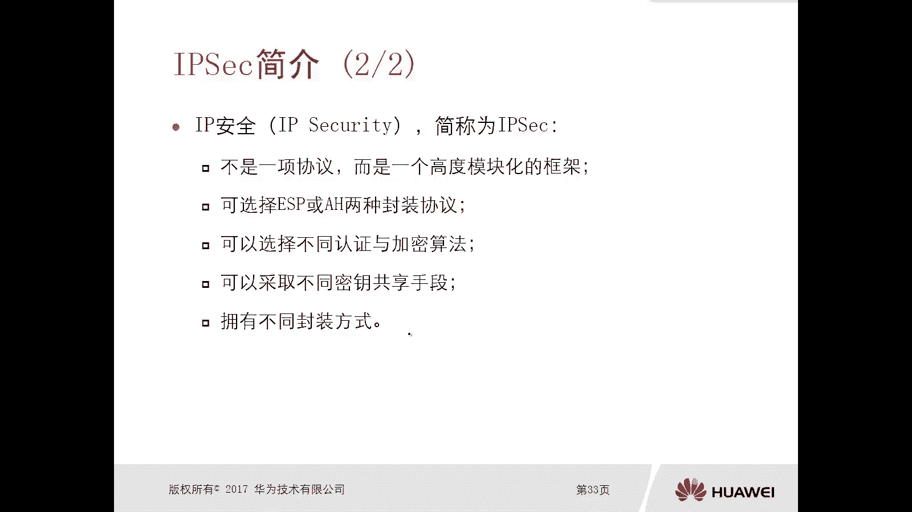

此外，IPsec框架支持多种认证算法（如MD5, SHA）和加密算法（如DES, 3DES, AES），并允许选择不同的共享密钥管理方式和数据封装模式（如隧道模式、传输模式）。

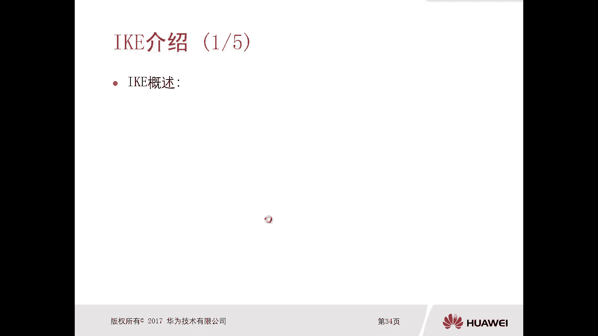

综合而言，IPsec的作用是在不安全的网络链路上保护数据安全，其手段包括加密、完整性校验和身份认证。

## IKE简介

理解了IPsec如何保护数据后，我们面临一个新的问题：通信双方如何安全地协商并使用相同的加密密钥？本节中我们来看看解决这个问题的协议——IKE。

假设路由器A和路由器B需要通过不安全的互联网进行IPsec通信。双方必须使用相同的安全协议（如ESP）、认证加密算法以及密钥。如果为每一对通信设备手工静态配置密钥，当设备数量增多时，密钥管理将变得极其复杂，且定期更换密钥的工作量巨大。

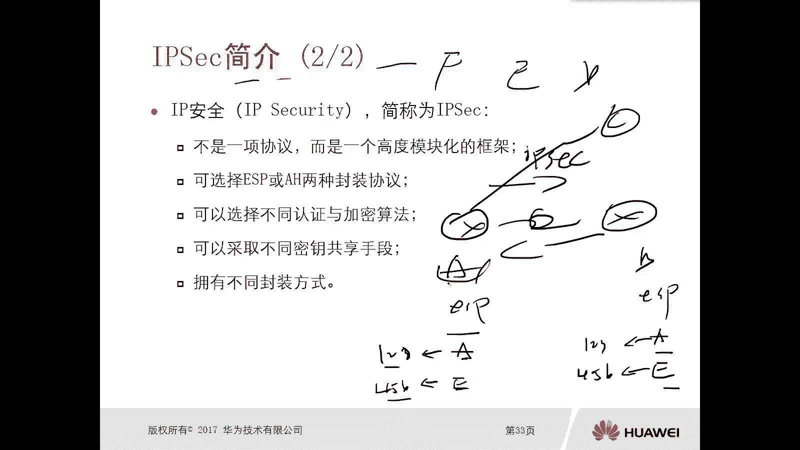

IKE（互联网密钥交换协议）正是为了解决这一问题而设计。它是一种用于**自动协商、交换和管理密钥**的协议。在IPsec中，IKE的作用是提供自动协商交换密钥、建立安全联盟的服务。通过IKE，通信双方可以动态计算出一致的密钥，无需管理员手工静态配置，并且能够定期自动更新密钥，极大地提升了安全性和管理效率。

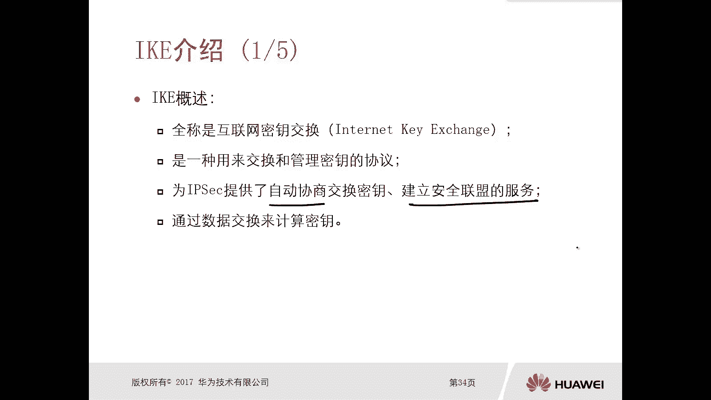

IKE协商分为两个阶段：
1.  **阶段一**：建立一条安全的控制信道（IKE SA），为阶段二的协商提供保护。此阶段有两种模式：**主模式**和**野蛮模式**。
2.  **阶段二**：在阶段一建立的安全信道上，协商用于保护实际数据流的安全参数（IPsec SA）。此阶段称为**快速模式**。

## IKE协商过程详解

下面我们深入了解一下IKE两个阶段的具体协商过程。

### 阶段一：主模式协商

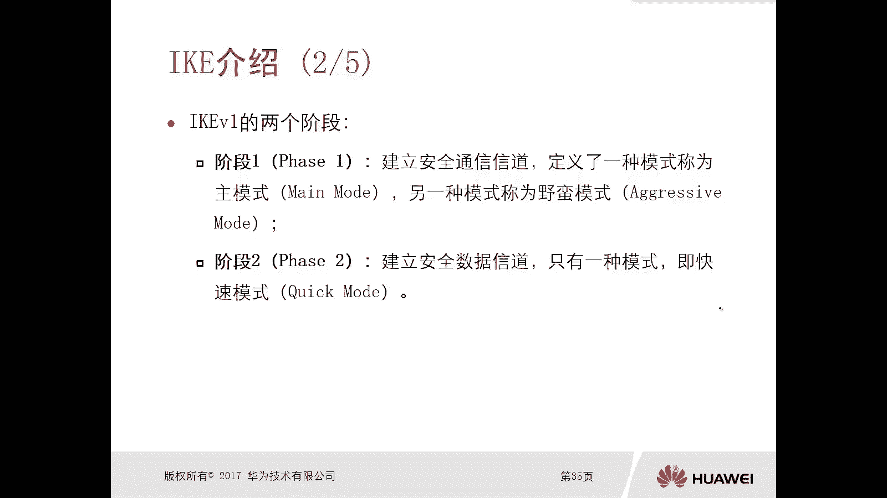

阶段一的主模式协商共交换6个报文，主要完成两个任务：协商安全参数和生成密钥。

**报文1 & 2：协商安全参数**
发起方（如AR1）向响应方（如AR2）发送一个或多个**IKE安全提议**，其中包含认证方式、认证算法、加密算法、Diffie-Hellman组、SA生存周期等参数。响应方从接收到的提议中选择一个与本地配置匹配的提议，并回复确认。至此，双方就后续通信使用的**认证方式、认证算法和加密算法**达成一致。

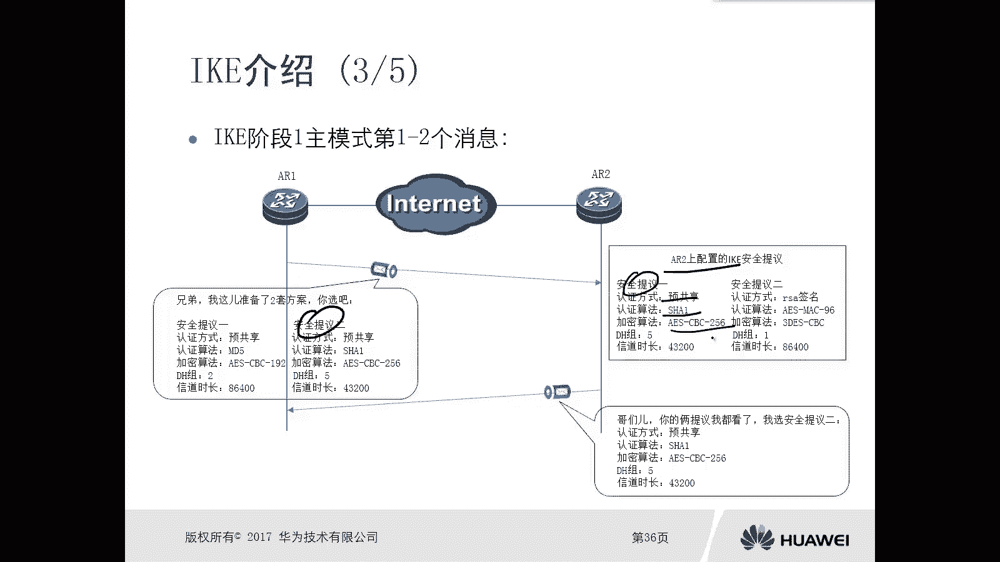

**报文3 & 4：交换密钥生成材料**
双方交换用于生成密钥的随机数（如Nonce）和Diffie-Hellman公共值。**注意，交换的不是密钥本身，而是生成密钥的“材料”**。双方利用这些交换的材料以及各自私有的随机数，独立计算出一致的共享密钥。即使中间人截获了交换的材料，由于缺少私有部分，也无法计算出真正的密钥。

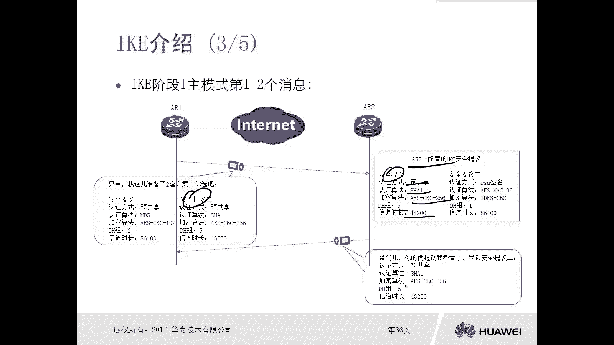

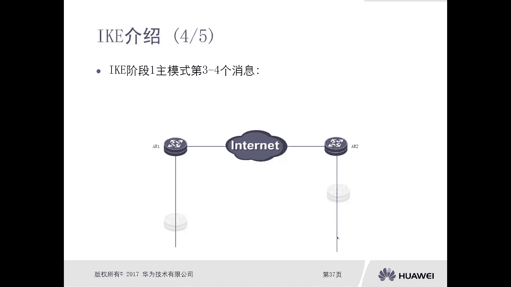

**报文5 & 6：身份认证**
双方使用前4个报文协商出的算法和生成的密钥，进行身份认证。认证通过后，阶段一完成，一条安全的IKE SA建立。

### 阶段二：快速模式协商

在阶段一建立的安全信道保护下，阶段二快速模式开始协商保护实际数据流的具体参数。

**报文1 & 2：协商IPsec安全参数**
发起方向响应方发送**IPsec安全提议**，其中包含对数据流使用的加密算法、认证算法、封装协议（ESP/AH）、封装模式、SA生存周期等。响应方选择匹配的提议并回复确认。

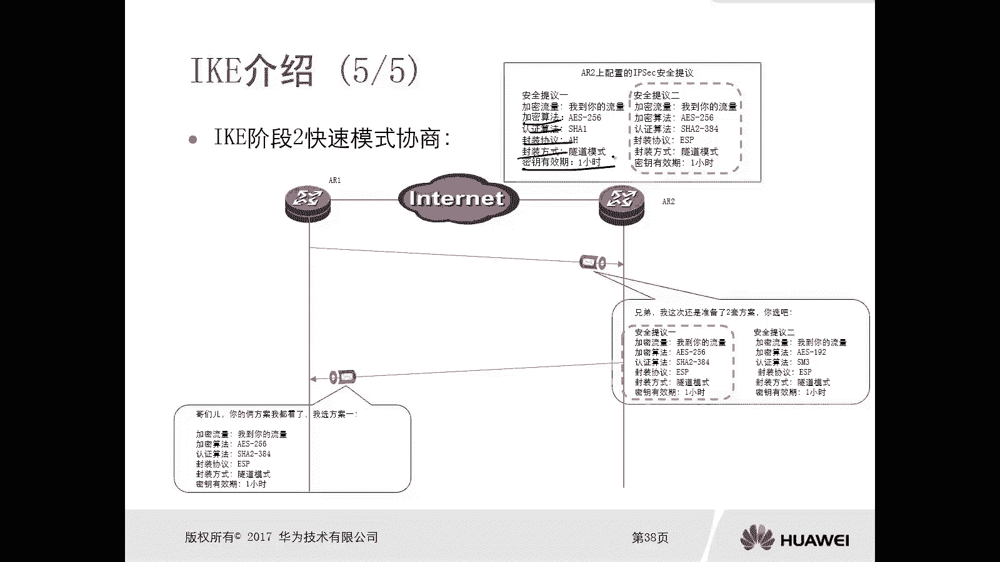

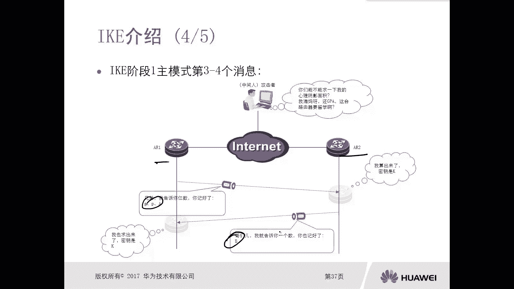

协商完成后，双方即建立了IPsec SA。此后，即可根据协商出的算法、密钥和封装方式，对需要保护的数据流进行加密、认证和完整性校验。

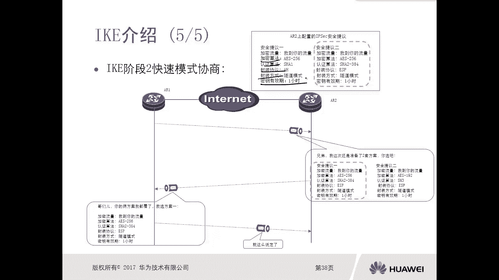

整个过程中，所有密钥均由IKE动态协商生成，无需手工配置，并在SA超时后自动重新协商，确保了通信的长期安全性。

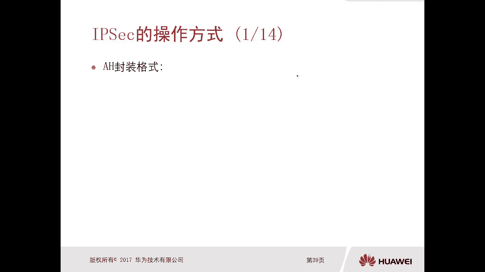

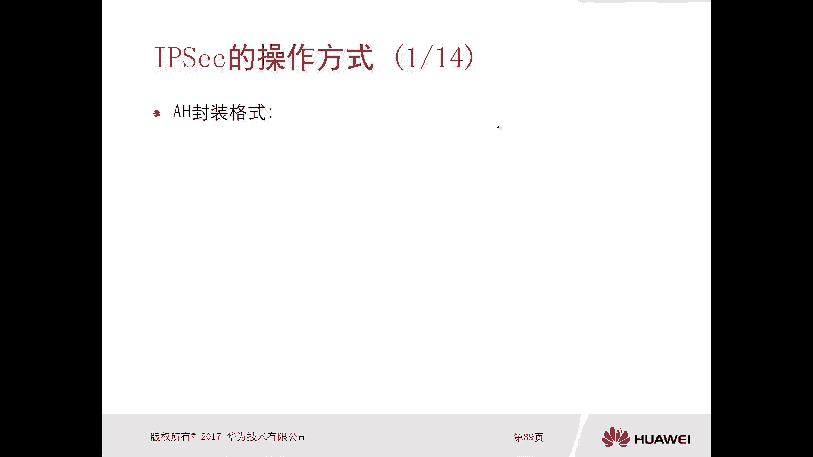
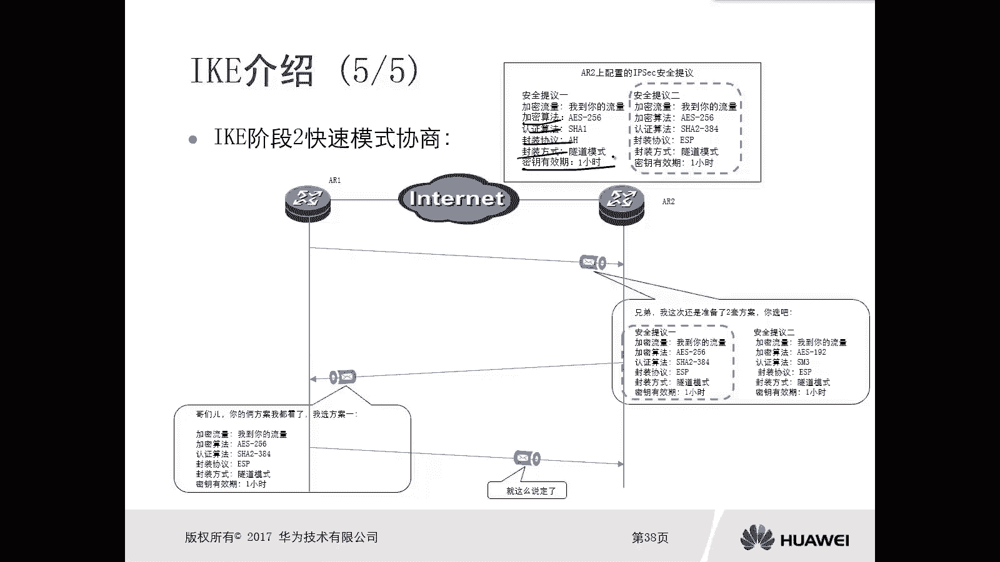

## 总结

本节课中我们一起学习了IPsec和IKE的核心概念。IPsec是一个安全框架，通过ESP和AH等协议为IP数据提供加密、认证和完整性保护。IKE协议则解决了IPsec密钥自动协商与管理的难题，通过两个阶段（主/野蛮模式、快速模式）的协商，动态建立安全联盟，无需人工干预密钥分发与更新，是构建自动化、高安全VPN网络的关键。