# 华为认证ICT学院HCIA/HCIP-Datacom教程：P55：第3册-第9章-4-IPsec的操作方式 🔐

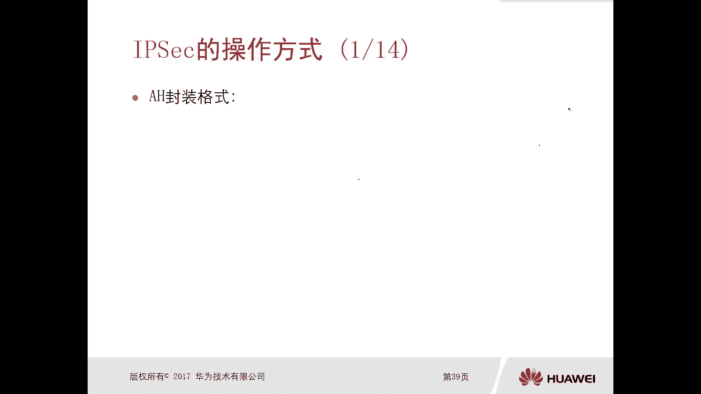

在本节课中，我们将要学习IPsec协议的具体操作方式，包括其两种封装协议（AH和ESP）的格式、两种操作模式（传输模式和隧道模式）的区别，以及一个完整的数据封装与解封装流程。理解这些内容是掌握IPsec如何保障网络通信安全的基础。

## IPsec的封装协议

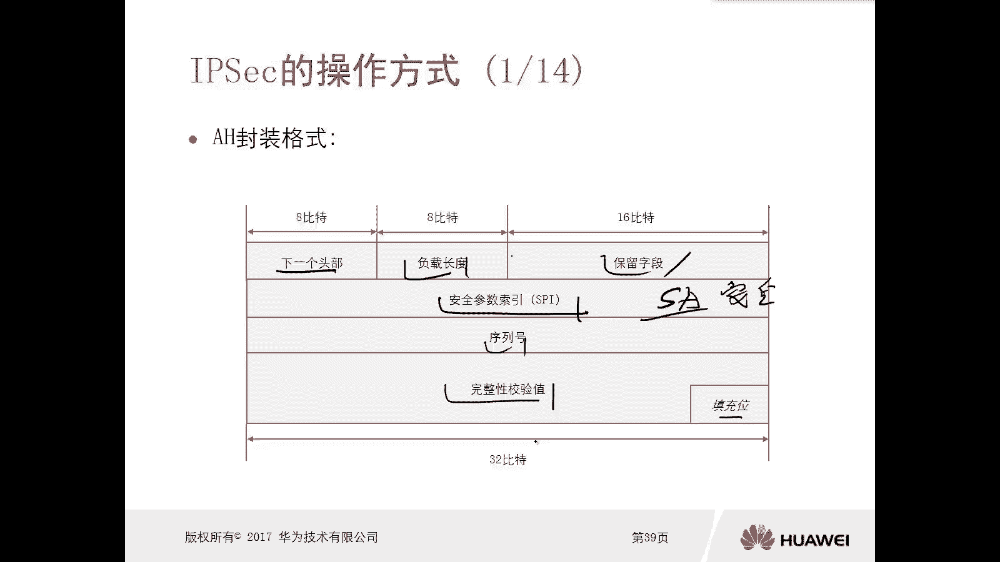

上一节我们介绍了IPsec的基本概念，本节中我们来看看IPsec使用的两种主要封装协议：AH和ESP。

### AH协议格式

AH（认证头）协议提供数据完整性校验和身份认证，但不提供加密功能。其数据包格式包含多个字段。

以下是AH协议头部的主要字段：

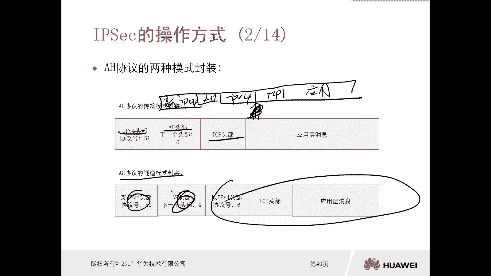

*   **下一个头部**：指示紧跟在AH头部之后的下一个协议类型。
*   **负载长度**：表示AH头部的长度。
*   **保留字段**：保留以备将来使用。
*   **安全参数索引**：这是一个非常重要的字段，其作用是**唯一地标识一个安全联盟**。设备通过不同的SPI来索引不同的SA，从而应用相应的安全策略（如认证和加密算法）。
*   **序列号**：用于防止重放攻击。
*   **完整性校验值**：用于验证数据在传输过程中是否被篡改。

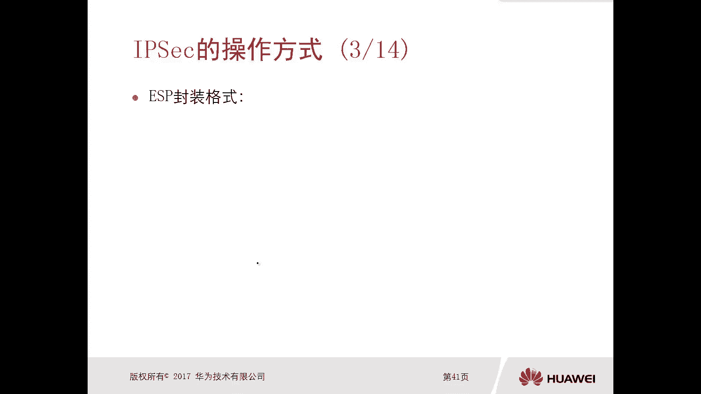

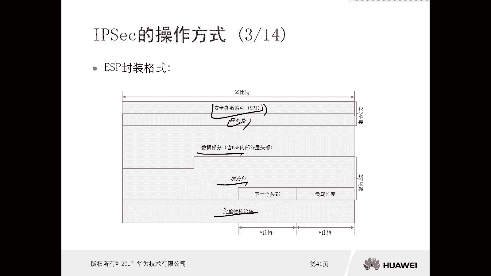

### ESP协议格式

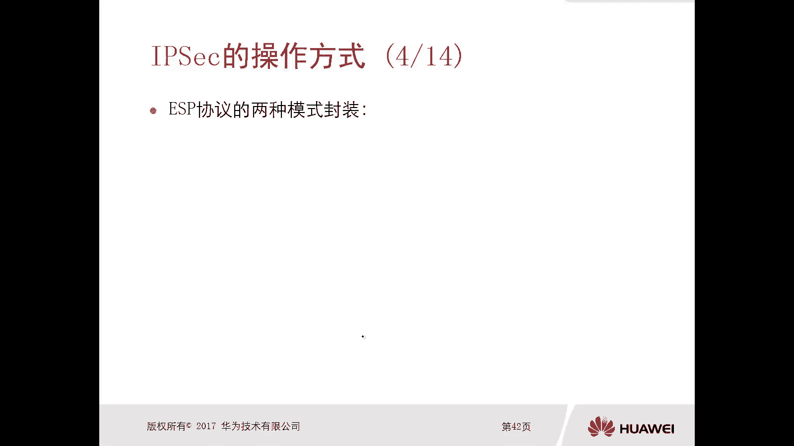

ESP（封装安全载荷）协议除了提供数据完整性校验和身份认证外，还提供数据加密功能。其格式比AH更复杂。

以下是ESP协议数据包的主要组成部分：

*   **安全参数索引**：与AH中的SPI作用相同，用于标识安全联盟。
*   **序列号**：用于防止重放攻击。
*   **数据部分**：经过加密的原始数据。
*   **填充位**：为了满足加密算法对数据块长度的要求而添加的字段。
*   **完整性校验值**：用于验证数据完整性。

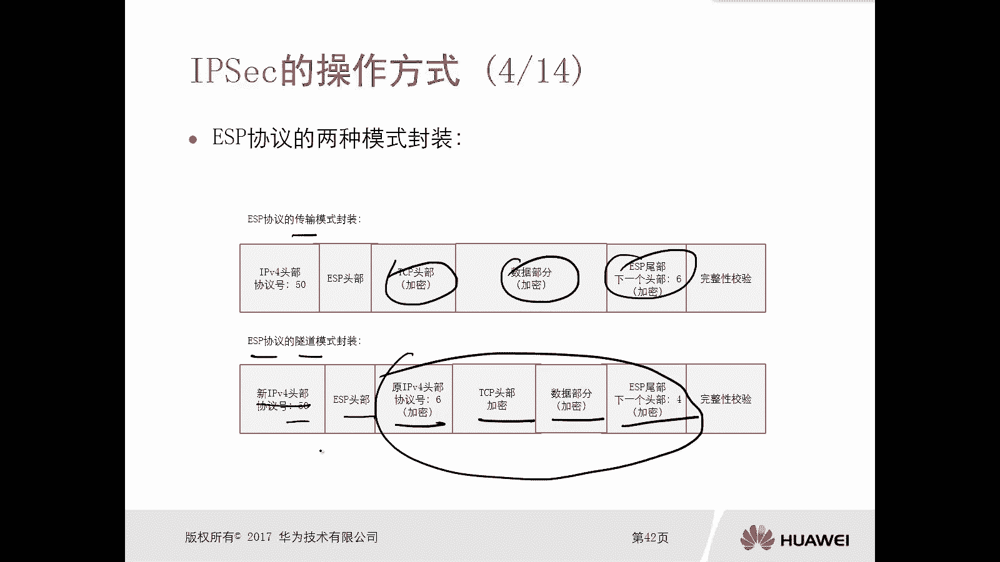

## IPsec的操作模式

了解了封装协议后，我们来看看IPsec的两种操作模式。这两种模式决定了安全协议头（AH或ESP）被插入原始数据包的位置。

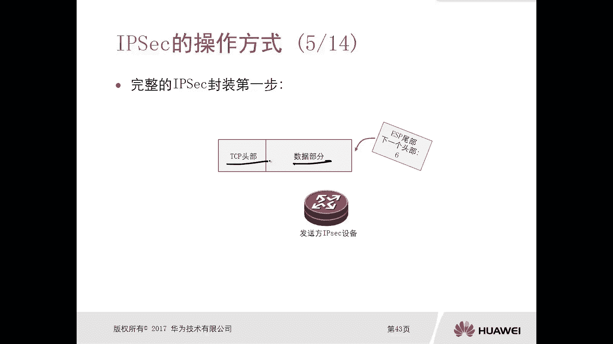

### 传输模式

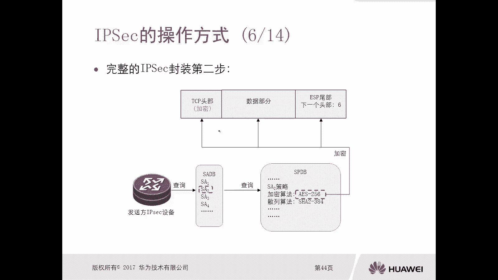

在传输模式下，安全协议头被插入到原始IP头部和传输层（如TCP/UDP）头部之间。这种模式主要用于保护两个主机之间的端到端通信。

*   **AH传输模式**：在原始IP头和TCP头之间插入一个AH头。
*   **ESP传输模式**：在原始IP头和TCP头之间插入一个ESP头，并在数据尾部添加ESP尾和完整性校验值。**ESP传输模式仅对传输层载荷（TCP/UDP头和应用数据）进行加密**。

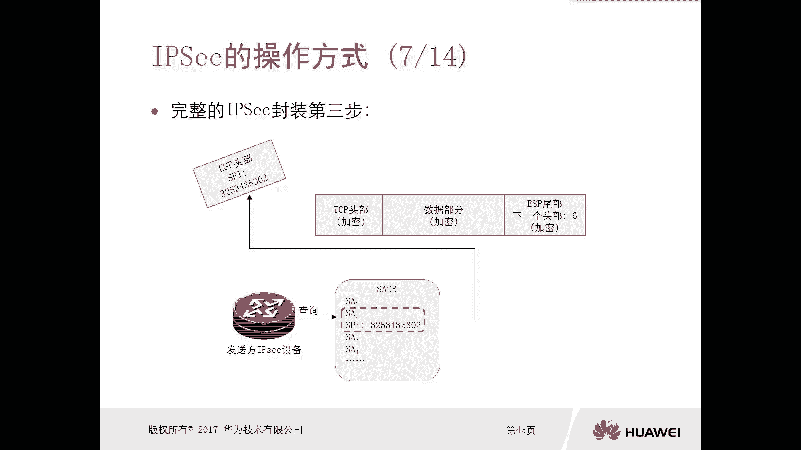

### 隧道模式

在隧道模式下，整个原始IP数据包被当作载荷，然后为其添加一个新的IP头部和安全协议头。这种模式通常用于在两个安全网关（如路由器或防火墙）之间建立VPN隧道。

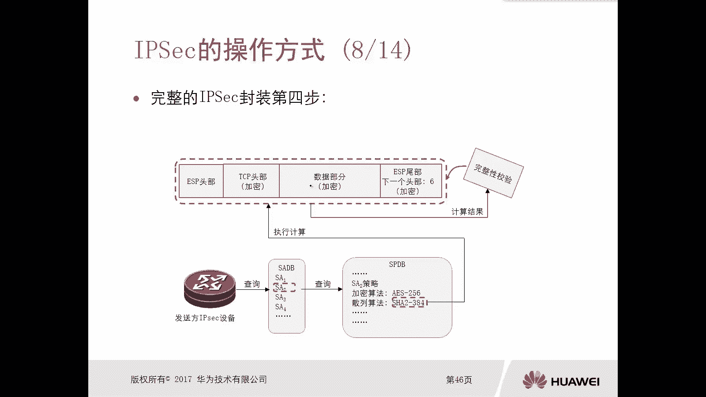

*   **AH隧道模式**：原始数据包前添加AH头，然后再添加一个新的IP头。
*   **ESP隧道模式**：原始数据包被封装，添加ESP头和尾，然后再添加一个新的IP头。**ESP隧道模式会对整个原始IP数据包（包括原始IP头）进行加密**，因此比传输模式更安全。

## 完整的IPsec数据封装与解封装流程

现在，我们结合ESP隧道模式，来看一个完整的IPsec数据从发送到接收的处理过程。这个过程清晰地展示了IPsec如何协同工作以提供安全保障。

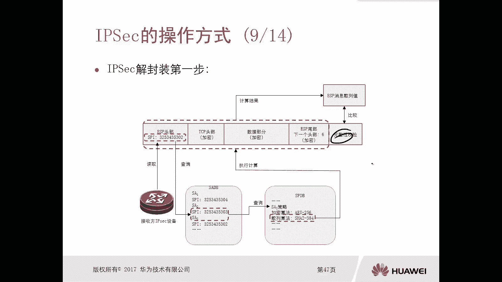

以下是发送方设备对出站数据包的处理步骤：

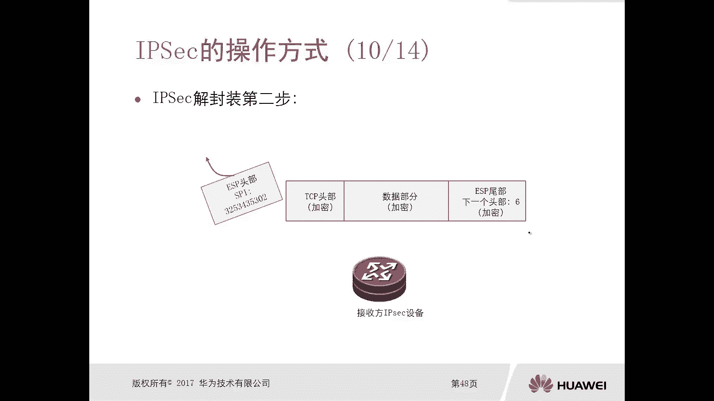

1.  **添加ESP尾部**：设备首先为原始的TCP数据包添加一个ESP尾部。尾部中的“下一个头部”字段指明原始载荷的协议类型（例如，TCP对应值6）。
2.  **查询并加密**：设备查询本地的安全联盟数据库，根据目标找到对应的SA，并利用SA中协商的加密算法（如AES），对“TCP头+数据+ESP尾”进行加密。
3.  **添加ESP头部**：设备再次查询SA，获取安全参数索引，并将其填入新生成的ESP头部中。
4.  **计算并添加完整性校验值**：设备利用SA中协商的散列算法（如SHA-256）和密钥，对整个数据包（ESP头+加密数据）进行计算，生成一个散列值，作为完整性校验值附加在数据包末尾。
5.  **添加新IP头并发送**：最后，设备为整个数据包添加一个新的IP头部（通常是公网地址），然后发送出去。

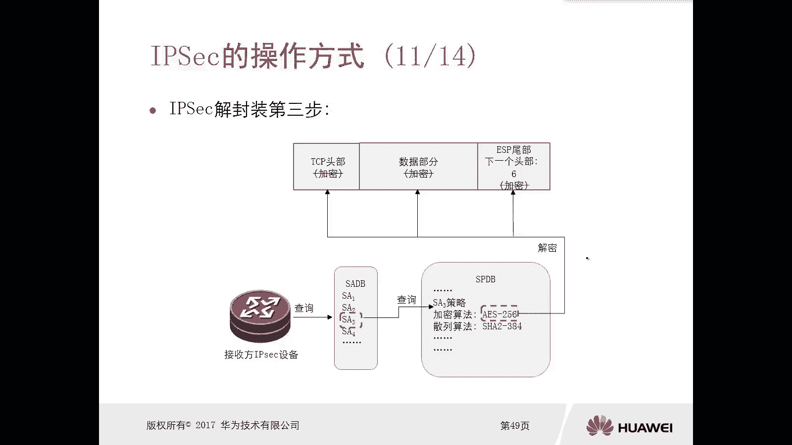

接收方设备对入站数据包的处理是发送方过程的逆过程。

以下是接收方设备对入站数据包的处理步骤：

1.  **验证完整性**：接收方读取ESP头中的SPI，查询本地的SA数据库，找到对应的SA。然后使用相同的散列算法和密钥对数据包进行计算。如果计算结果与数据包中的完整性校验值一致，则证明数据未被篡改。
2.  **移除ESP头和校验值**：验证通过后，设备移除ESP头部和完整性校验值。
3.  **查询并解密**：设备再次查询SA，利用其中协商的解密算法，对剩余的加密部分（TCP头+数据+ESP尾）进行解密。
4.  **移除ESP尾部**：设备移除ESP尾部。
5.  **处理原始数据包**：此时，原始的IP数据包被还原，设备可以像处理普通数据包一样对其进行路由和转发。

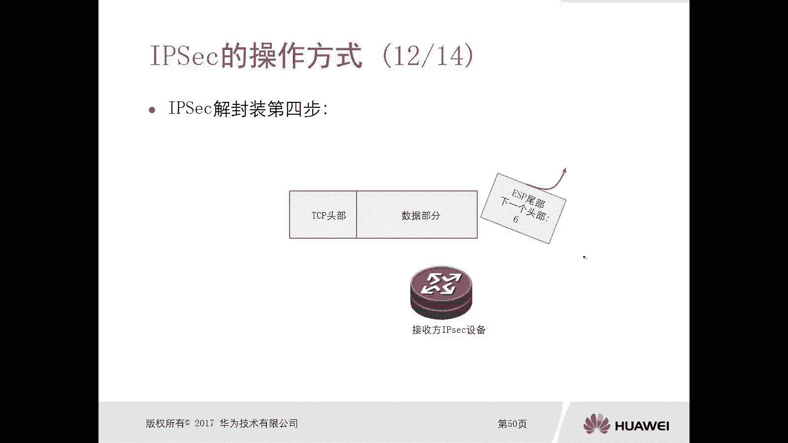

## IPsec模式的应用场景

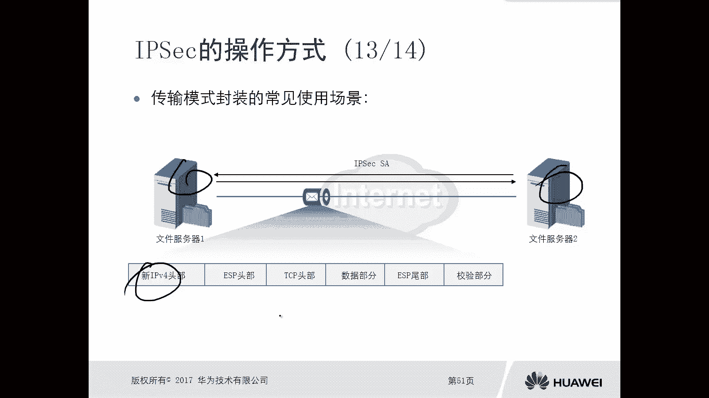

不同的操作模式适用于不同的网络场景。选择合适的模式对于构建高效安全的网络至关重要。

以下是两种模式的主要应用场景：

*   **传输模式**：适用于**主机到主机**的直接通信。例如，公司内部两台需要高安全通信的服务器之间。
*   **隧道模式**：适用于**网关到网关**或**主机到网关**的通信，常用于构建站点到站点的VPN。例如，公司总部和分支机构的路由器通过互联网建立安全隧道，保护两个内部网络之间的所有流量。

## 总结

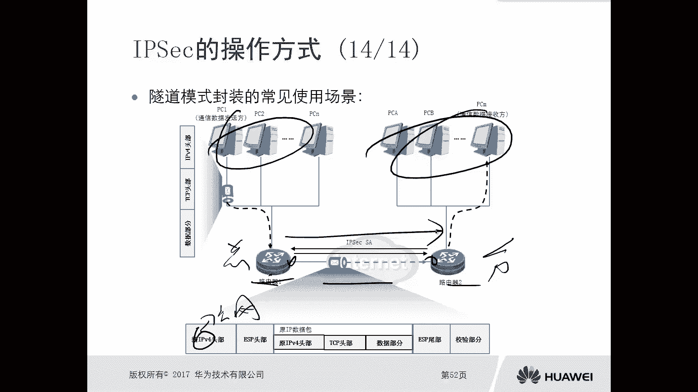

本节课中我们一起学习了IPsec协议的核心操作方式。我们首先了解了AH和ESP两种封装协议的格式与区别，其中**ESP**因其同时提供**加密和认证**功能而更为常用。接着，我们深入探讨了**传输模式**和**隧道模式**，明确了前者用于保护端到端载荷，后者用于保护整个原始IP包。最后，我们梳理了ESP在隧道模式下完整的封装与解封装流程，看到IPsec如何通过**加密、完整性校验和防重放**机制，在不可信的网络中构建起一条安全的数据传输通道。理解这些原理，是配置和排查IPsec VPN故障的基础。