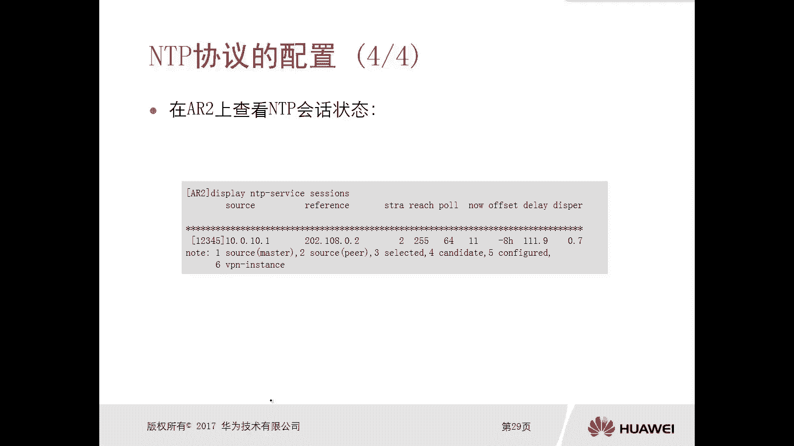
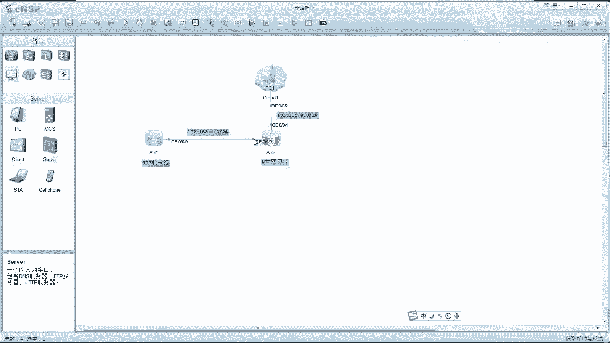
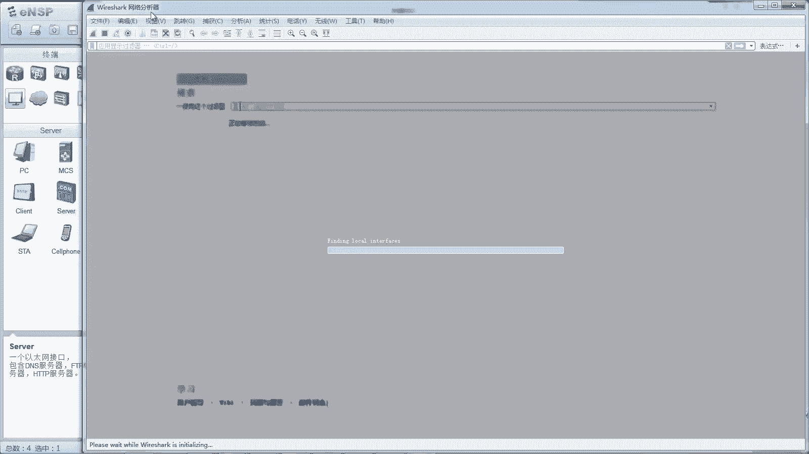
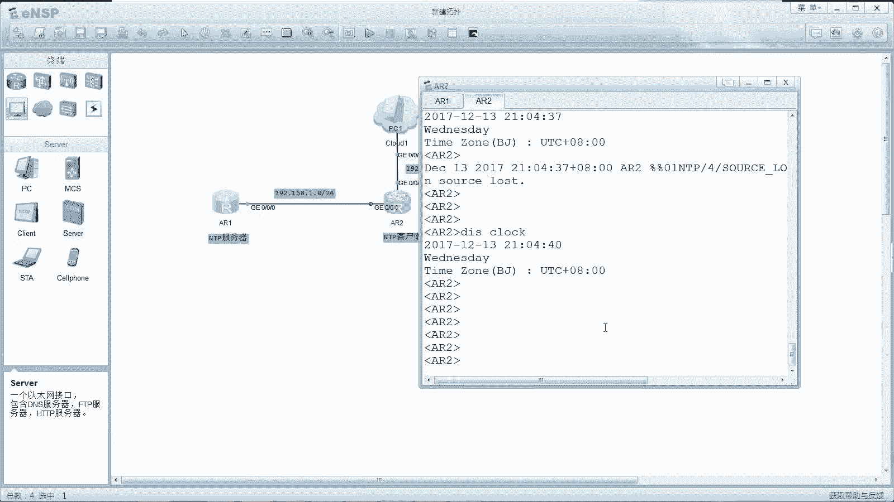
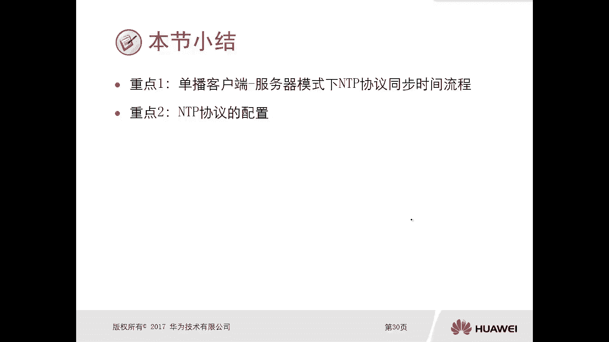

# 华为认证ICT学院HCIA/HCIP-Datacom教程：P56：第3册-第11章-2-NTP协议及配置 ⏰

在本节课中，我们将要学习网络时间协议（NTP）的原理与配置。NTP对于确保网络设备时间准确一致至关重要，这直接关系到故障排查、日志记录和日常运维的效率。

## NTP协议简介

NTP是一种用于在网络设备间同步时间的协议。它使用UDP作为传输层协议，端口号为**123**。NTP定义了同步消息和控制消息，并支持多种工作模式以适应不同场景。

## NTP协议原理

上一节我们介绍了NTP的基本概念，本节中我们来看看NTP是如何实现时间同步的。其核心原理是通过计算客户端与服务器之间的时间差和网络延迟来校准时间。

以下是NTP客户端与服务器交互并计算时间差的过程：

1.  **客户端发送请求**：NTP客户端向服务器发送一个同步请求报文。该报文中携带了客户端发送时的本地时间，记为 **T0**。
2.  **服务器接收并响应**：服务器在收到请求报文时记录本地时间 **T1**，在发送响应报文时记录本地时间 **T2**。响应报文中会包含 **T1** 和 **T2**。
3.  **客户端接收响应**：客户端在收到响应报文时记录本地时间 **T3**。
4.  **时间差计算**：客户端利用 **T0, T1, T2, T3** 这四个时间戳进行计算。
    *   计算网络往返延迟：`Delay = (T3 - T0) - (T2 - T1)`
    *   计算客户端与服务器的时间偏差：`Offset = ((T1 - T0) + (T2 - T3)) / 2`
5.  **时间校准**：客户端根据计算出的 **Offset** 值调整自己的本地时钟，使其与服务器时间同步。

这个过程确保了即使在存在网络延迟的情况下，也能精确地校准时间。

## NTP的层次结构

NTP采用分层（Stratum）的时钟源结构来组织时间同步，以提高可靠性和避免环路。

以下是NTP的典型层次结构：

*   **第1层（Stratum 1）**：直接连接到高精度时钟源（如原子钟、GPS）的设备，精度最高。
*   **第2层（Stratum 2）**：从第1层设备同步时间的设备。
*   **第3层（Stratum 3）**：从第2层设备同步时间的设备。

同步方向总是从高层（数字小）向低层（数字大）进行。这种结构保证了整个网络时间的一致性。

## NTP配置实验

了解了NTP的原理后，我们通过一个实验来掌握其基本配置。实验拓扑包含两台路由器：R1作为NTP服务器，R2作为NTP客户端。



### 步骤一：配置NTP服务器（R1）

首先，我们需要确保NTP服务器自身的时间准确。

1.  **配置接口IP地址**：
    ```bash
    [R1] interface GigabitEthernet 0/0/0
    [R1-GigabitEthernet0/0/0] ip address 192.168.1.100 24
    ```

2.  **设置时区**（先设置时区，再设置时间）：
    ```bash
    <R1> clock timezone Beijing add 08:00:00
    ```

3.  **设置本地日期与时间**：
    ```bash
    <R1> clock datetime 20:53:50 2017-12-13
    ```

4.  **将R1配置为NTP主时钟源**：
    ```bash
    [R1] ntp-service refclock-master 5
    ```
    （`5` 指定了时钟的层级，可根据需要调整）

5.  **验证服务器时间与NTP状态**：
    ```bash
    <R1> display clock
    <R1> display ntp-service status
    ```

### 步骤二：配置NTP客户端（R2）

接下来，配置客户端R2向服务器R1同步时间。

1.  **配置接口IP地址**：
    ```bash
    [R2] interface GigabitEthernet 0/0/0
    [R2-GigabitEthernet0/0/0] ip address 192.168.1.2 24
    ```

2.  **设置时区**（与服务器保持一致）：
    ```bash
    <R2> clock timezone Beijing add 08:00:00
    ```





3.  **指定NTP服务器地址**：
    ```bash
    [R2] ntp-service unicast-server 192.168.1.100
    ```

4.  **验证时间同步状态**：
    ```bash
    <R2> display ntp-service status
    <R2> display clock
    ```
    等待片刻后，R2的`display clock`显示的时间应与R1同步。

## 总结





本节课中我们一起学习了网络时间协议（NTP）。我们首先了解了NTP对于网络运维的重要性，然后深入探讨了其通过四个时间戳（**T0, T1, T2, T3**）计算时间偏差（**Offset**）和延迟（**Delay**）的同步原理。接着，我们认识了NTP的层次化（Stratum）结构。最后，通过一个配置实验，我们掌握了如何将一台设备配置为NTP服务器，以及如何将另一台设备配置为客户端并成功同步时间。掌握NTP的配置是保障网络设备日志准确性和运维效率的基础技能。