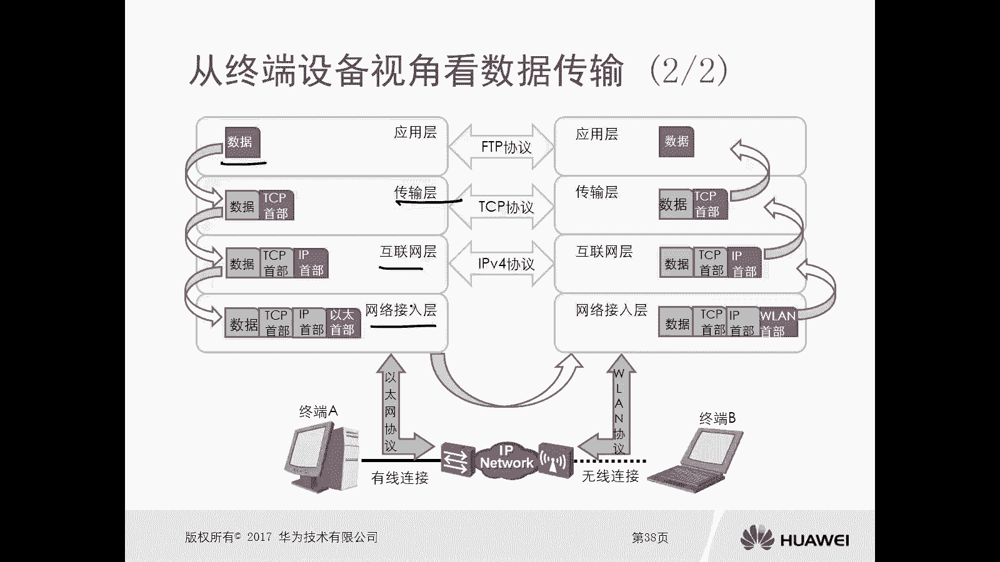
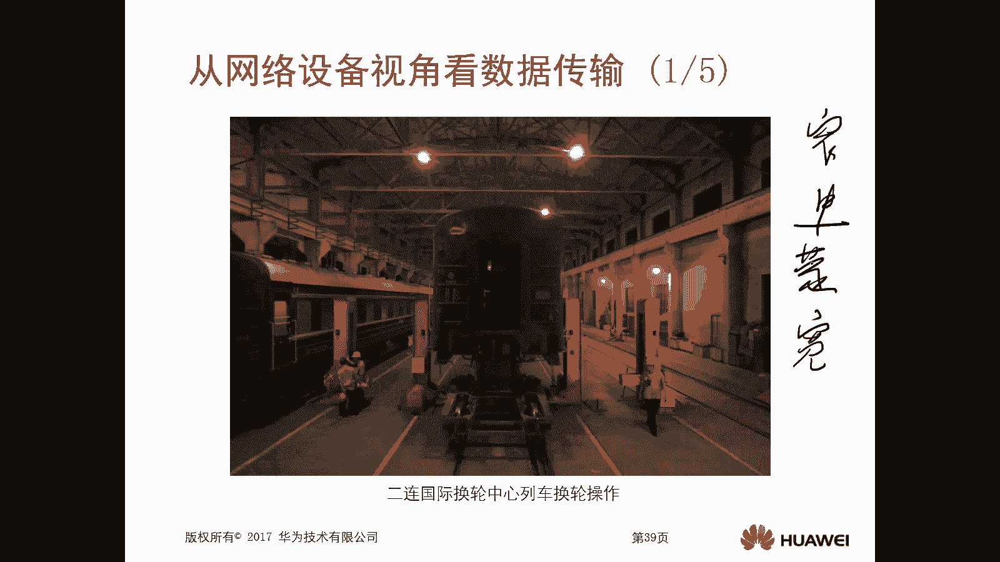
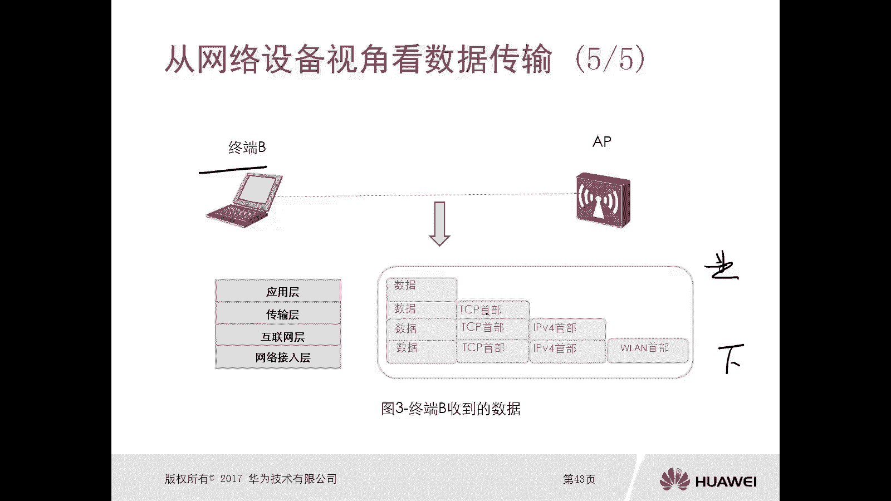

# 华为认证ICT学院HCIA/HCIP-Datacom教程：第1册-第3章-4：实现数据传输1 🚀

在本节课程中，我们将学习数据在网络中传输的核心过程——封装与解封装。我们将从不同视角理解数据如何被处理，以确保它能够可靠地从发送方到达接收方。

---

## 封装与解封装 🔄

上一节我们介绍了OSI七层模型和TCP/IP四层模型。本节中，我们来看看数据在这些模型中的具体处理过程。对于发送方，数据从高层（应用层）向低层（网络接入层）处理，这个过程称为**封装**。对于接收方，数据从低层向高层处理，这个过程称为**解封装**。

**封装**是指每一层为载荷（Payload，即有效数据）添加本层相关的控制信息（如头部）。
*   **作用**：确保数据能够可靠地到达目的地。
*   **特点**：操作是**自上而下**的，数据内容**由少变多**。

**解封装**是指每一层为载荷剥离（移除）本层相关的控制信息。
*   **作用**：提取出原始数据，交付给上层应用。
*   **特点**：操作是**自下而上**的，数据内容**由多变少**。

让我们通过一个TCP/IP四层模型的例子来具体说明。

假设发送方要通过FTP协议向接收方传输一个文件。
1.  **应用层**：生成文件数据。
2.  **传输层**：使用TCP协议，为数据添加**TCP头部**。此时载荷是“数据”。
3.  **互联网层**：使用IP协议，为“数据+TCP头部”添加**IP头部**。此时载荷是“数据+TCP头部”。
4.  **网络接入层**：使用以太网协议，为“数据+TCP头部+IP头部”添加**以太网头部**。此时完整的**数据帧**准备就绪，可以通过物理链路发送。

接收方收到数据帧后，进行反向操作：
1.  **网络接入层**：剥离**以太网头部**，将剩余部分上交。
2.  **互联网层**：剥离**IP头部**，将剩余部分上交。
3.  **传输层**：剥离**TCP头部**，将剩余部分上交。
4.  **应用层**：最终获得原始的“文件数据”。

通过这一过程，发送方发出的数据与接收方最终得到的数据完全一致。

---

## 从终端设备的视角看数据传输 💻

上一节我们介绍了封装与解封装的基本概念，本节中我们来看看终端设备（如你的电脑、手机）是如何看待这个过程的。

对于终端设备而言，它只关心**最终的应用层数据**。它并不清楚数据在传输过程中，中间的网络设备（如交换机、路由器）是否对其进行了重新封装或解封装。下层协议（如TCP、IP、以太网）的细节对上层应用是透明的，或者说被上层协议“掩盖”了。

从终端设备的视角看，数据传输就像一个“黑盒”：
*   **发送方**：我把数据交给网络，然后数据就发出去了。
*   **接收方**：我从网络收到了数据。
中间复杂的处理过程，终端设备并不感知。

---

## 从网络设备的视角看数据传输 🌐

上一节我们从终端视角看到了一个简化的过程，本节中我们切换到网络设备（如交换机、路由器）的视角，看看数据在传输路径上经历了什么。

一个生动的比喻是**国际列车换轮**。中国铁路使用标准轨距，而蒙古国使用宽轨。火车从中国进入蒙古前，必须在边境车站更换适合宽轨的轮对，才能继续行驶。数据通信也是如此，当数据经过不同类型的网络（如以太网、无线网络）或设备时，其**数据链路层的头部**（控制信息）可能需要被替换，以适配下一段链路。

从网络设备视角看数据传输的特点是：
*   数据包的封装和解封装操作，主要发生在**互联网层**和**网络接入层**。
*   网络设备（非终端）可能对数据包的协议头部进行**替换和修改**。

让我们通过一个网络拓扑来理解：

假设终端A（有线连接）要向终端B（无线连接）发送数据。
1.  **终端A**：完成完整的四层封装（应用层数据 + TCP头部 + IP头部 + 以太网头部），然后发出。
2.  **交换机**（工作于**网络接入层**）：
    *   查看**以太网头部**中的目的MAC地址。
    *   发现目的MAC地址不是自己，而是网关路由器。因此，交换机**不修改**以太网头部，直接将数据帧转发给路由器。
    *   *交换机不处理IP头部及以上的内容。*
3.  **路由器**（工作于**互联网层**和**网络接入层**）：
    *   **网络接入层处理**：发现数据帧的**以太网头部**目的MAC地址是自己，于是**剥离**该头部。
    *   **互联网层处理**：查看**IP头部**中的目的IP地址（终端B），查询路由表，确定下一跳是AP（无线接入点）。
    *   **重新封装**：为“数据+TCP头部+IP头部”**添加一个新的以太网头部**（目的MAC地址改为AP的地址），然后转发给AP。
    *   *路由器不处理TCP头部及以上的内容。*
4.  **AP**（无线接入点，工作于**网络接入层**）：
    *   发现数据帧的**以太网头部**目的MAC地址是自己，于是**剥离**该头部。
    *   为了通过无线链路发送给终端B，AP将数据**重新封装**，**替换**为**WLAN（无线局域网）头部**，然后发送出去。
    *   *AP不处理IP头部及以上的内容。*
5.  **终端B**：收到无线帧后，开始从下至上的解封装过程（剥离WLAN头部 -> 剥离IP头部 -> 剥离TCP头部），最终获得应用层数据。

以下是各网络设备的操作总结：

*   **交换机**：仅工作在**网络接入层**。根据MAC地址进行转发，不修改IP层及以上内容。
*   **路由器**：工作在**互联网层**和**网络接入层**。根据IP地址进行路由选择，并可能替换数据链路层头部。
*   **AP**：主要工作在**网络接入层**。负责有线与无线帧格式的转换。

---

## 总结 📝

本节课中，我们一起学习了数据在网络中传输的核心机制。

1.  **封装与解封装**：我们理解了数据在发送时**自上而下**添加头部（封装），在接收时**自下而上**剥离头部（解封装）的过程。这是可靠数据传输的基础。
2.  **终端视角**：我们认识到终端设备只关注最终的应用数据，对传输细节是透明的。
3.  **网络设备视角**：我们深入了解了交换机、路由器、AP等设备如何在**互联网层**和**网络接入层**对数据包进行查看、修改和转发，就像国际列车换轮一样，确保数据能适应不同的网络路段。

掌握这些不同视角下的数据传输过程，是理解更复杂网络通信原理的重要基石。