# 华为认证ICT学院HCIA/HCIP-Datacom教程：第1册-第3章-5：实现数据传输2 🌐

在本节课中，我们将从网络拓扑的全局视角，深入观察数据在网络中传输的完整过程。我们将了解数据如何在不同类型的链路上被封装和解封装，以及不同网络设备（如交换机、路由器）在其中扮演的角色。

上一节我们介绍了数据传输的局部视角，本节中我们来看看从全局网络拓扑观察数据传输的过程。

## 全局视角下的数据传输过程

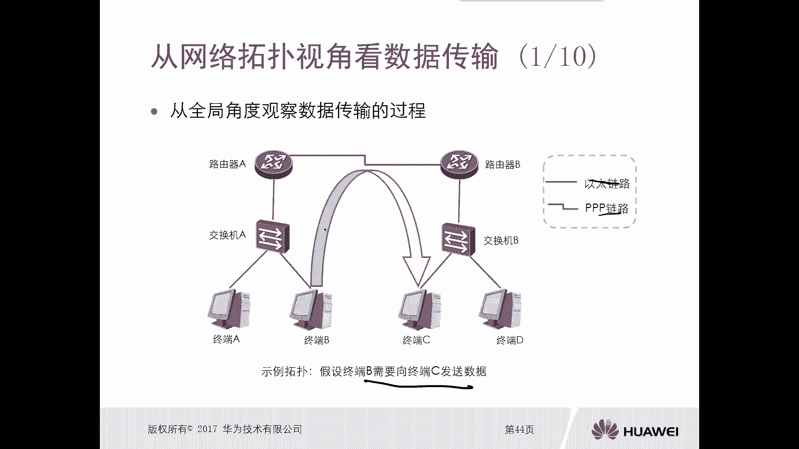

假设终端B需要向终端C发送数据。从全局角度看，数据从B到C的路径会经过多种类型的链路，例如以太网链路和PPP链路。在不同类型的链路上，数据帧的封装格式是不同的。例如，在以太网链路上，数据链路层首部是以太网帧头；而在PPP链路上，则是PPP帧头。这是观察数据传输的全局视角。

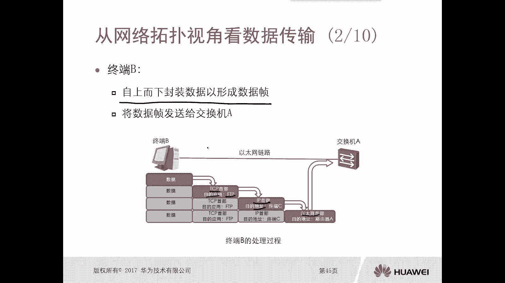

## 数据发送端：终端B的封装过程

终端B要发送数据给终端C，首先会从上至下进行数据封装，形成数据帧。

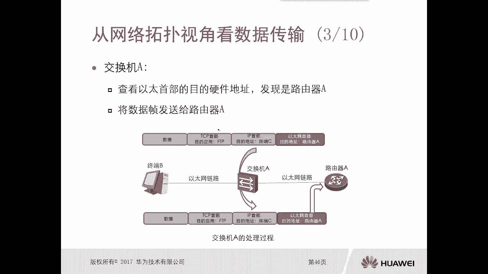

以下是终端B的封装步骤：
1.  **应用层**：处理数据（例如FTP应用）。
2.  **传输层**：增加TCP首部。
3.  **互联网层**：增加IP首部，目的是进行逻辑寻址。
4.  **网络接入层**：增加以太网首部，目的是进行物理寻址（MAC地址）。

封装完成后，终端B将数据帧发送给交换机A。

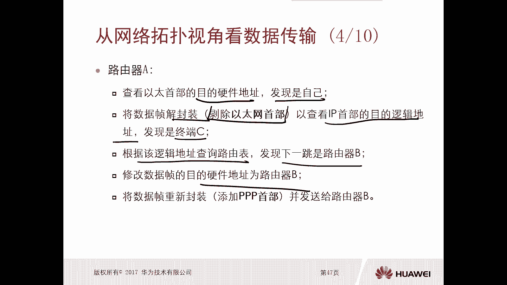

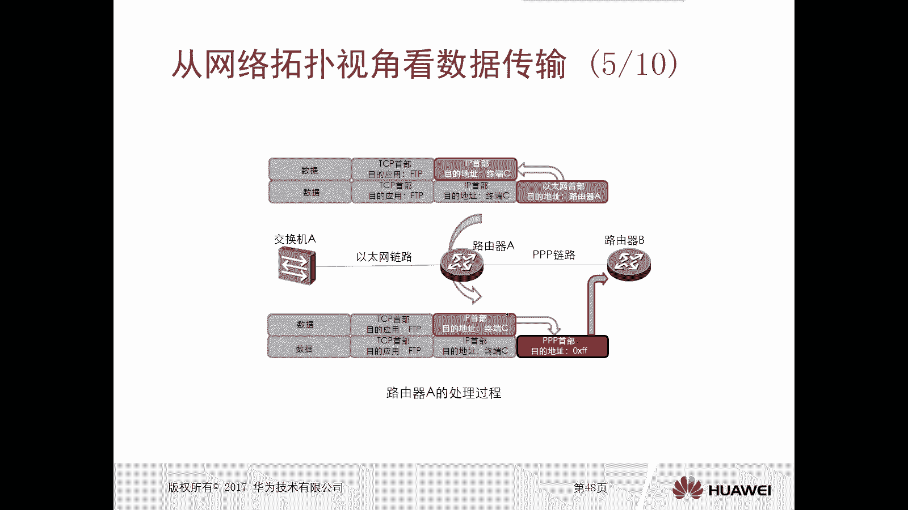

## 中间设备处理：交换机与路由器

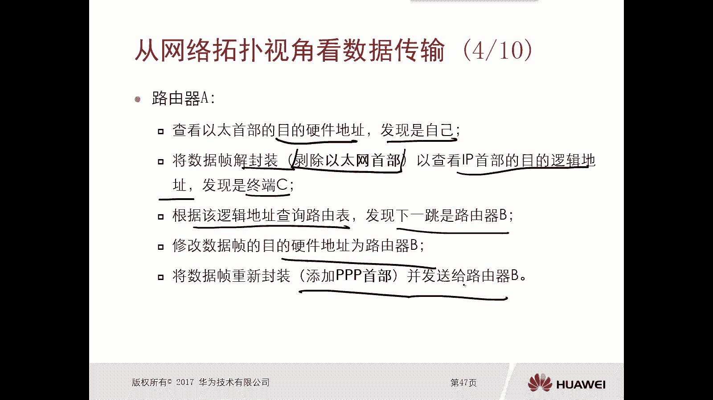

### 交换机A的处理
交换机A收到数据帧后，查看以太网首部的目的MAC地址，发现是路由器A的地址。根据原理，交换机A不会修改以太网首部，而是直接将数据帧转发给路由器A。

### 路由器A的处理
当路由器A收到数据帧后，会执行以下操作：
1.  查询以太网首部的目的MAC地址，确认是自己。
2.  进行解封装，移除以太网首部。
3.  查看IP首部的目的IP地址，发现是终端C。
4.  根据目的IP地址查询路由表，发现下一跳是路由器B。
5.  由于路由器A与路由器B之间是PPP链路，因此路由器A会**重新封装**数据，为数据添加PPP首部（目的硬件地址指向路由器B），然后将数据发送给路由器B。

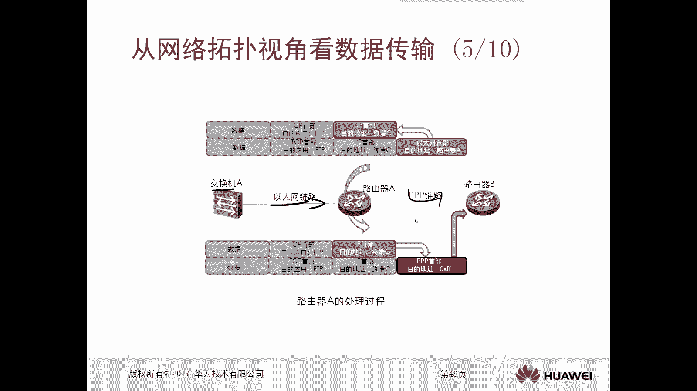

### 路由器B的处理
路由器B收到数据后，处理流程如下：
1.  查询PPP首部，确认目的是自己。
2.  进行解封装，移除PPP首部。
3.  查看IP首部的目的IP地址，发现是终端C。
4.  查询路由表，确定去往终端C的路径。
5.  由于路由器B与终端C之间是以太网链路，因此路由器B会**重新封装**数据，为其添加以太网首部（目的MAC地址指向终端C），然后将数据帧发送给交换机B。

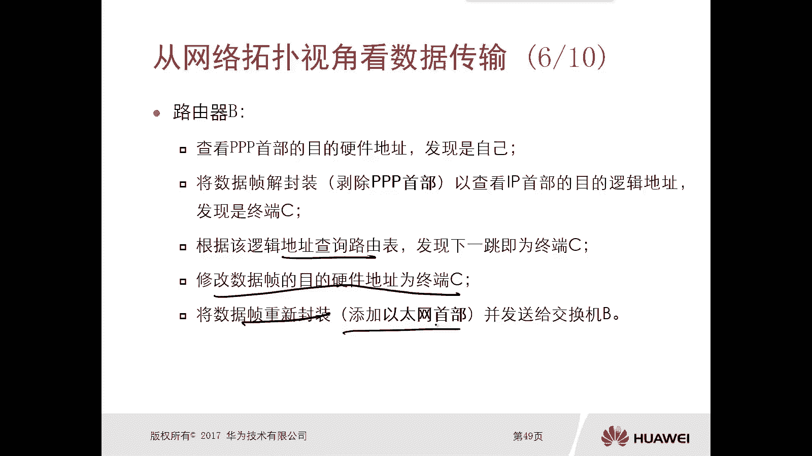

### 交换机B的处理
交换机B收到数据帧后，查看以太网首部的目的MAC地址，发现是终端C，于是直接将数据帧转发给终端C。

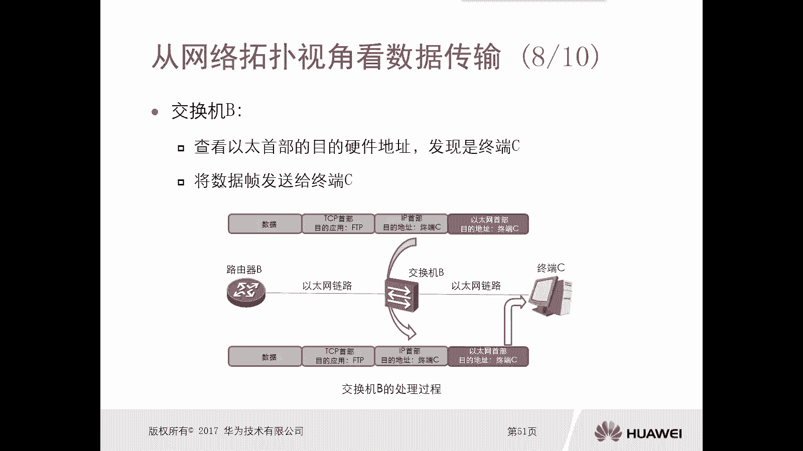

## 数据接收端：终端C的解封装过程

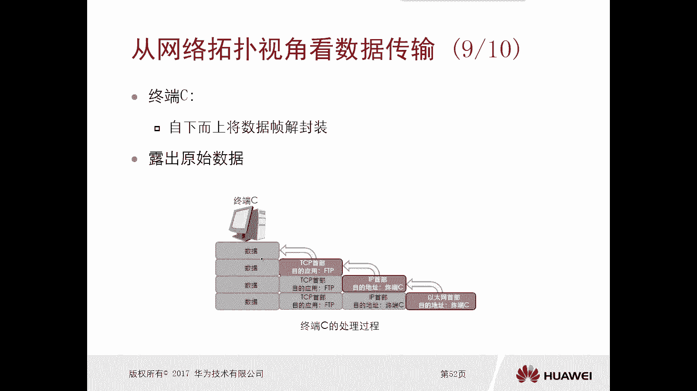

终端C收到数据帧后，从下至上进行解封装：
1.  **网络接入层**：检查以太网首部目的MAC地址是否为自己，确认后移除以太网首部。
2.  **互联网层**：检查IP首部目的IP地址是否为自己，确认后移除IP首部。
3.  **传输层**：根据TCP首部信息（如端口号），识别出这是FTP应用的数据，移除TCP首部。
4.  **应用层**：将最终的用户数据交给FTP应用程序处理。

## TCP/IP模型下的各设备工作层次

从TCP/IP模型的层次角度观察整个流程：
*   **终端B**：经历了**应用层 -> 传输层 -> 互联网层 -> 网络接入层**的完整封装过程。
*   **交换机A/B**：仅工作在**网络接入层**，处理数据链路层帧。
*   **路由器A/B**：工作在**互联网层**和**网络接入层**。它们需要解封装到网络层查看IP地址，并根据需要重新封装数据链路层帧。
*   **终端C**：经历了**网络接入层 -> 互联网层 -> 传输层 -> 应用层**的完整解封装过程。

**核心概念**：不同网络设备工作的层次决定了其处理数据的能力。中间设备（交换机、路由器）通常不关心高层（如应用层）的内容，只处理其所在层次及以下的信息。

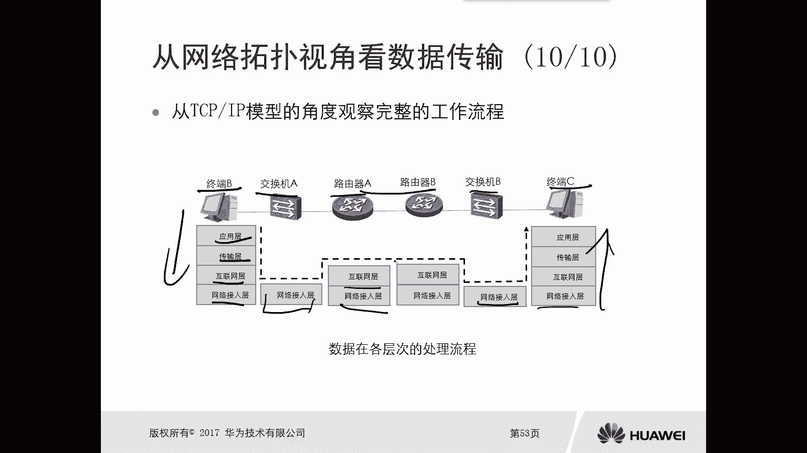

## 本节总结与练习

本节课中我们一起学习了从网络拓扑全局视角观察数据传输。重点包括：
1.  封装与解封装的意义和特点。
2.  从终端设备（局部）、网络设备（局部）和网络拓扑（全局）三个视角理解数据传输。

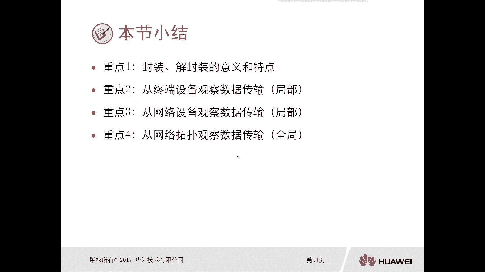

以下是两道练习题：
1.  下列哪项陈述不符合事实？
    *   A. 封装操作会导致数据增加。
    *   B. 解封装操作会导致数据增加。
    *   C. 发送方设备对数据执行封装。
    *   D. 接收方设备对数据执行封装。
    *   **答案：B和D**。解封装是移除头部，不会增加数据；接收方执行的是解封装。

2.  路由器为何被称为三层设备？
    *   A. 因为路由器工作在OSI参考模型的互联网层。
    *   B. 因为路由器工作在OSI参考模型的网络层。
    *   C. 因为路由器工作在TCP/IP参考模型的互联网层。
    *   D. 因为路由器工作在TCP/IP参考模型的传输层。
    *   **答案：B**。在OSI模型中，网络层对应第三层。

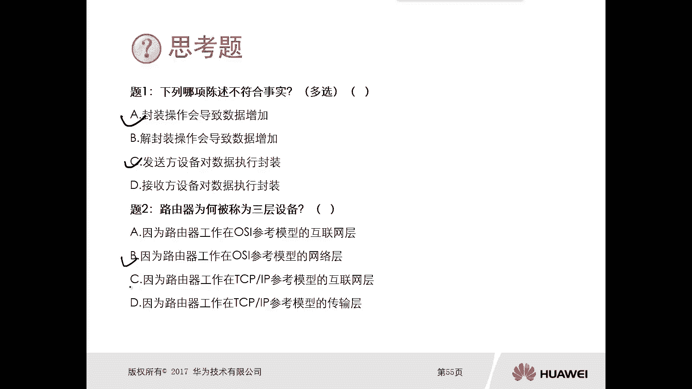

