# 华为认证ICT学院HCIA/HCIP-Datacom教程：第1册-第4章-1：数据链路层 📡

在本节课中，我们将要学习数据链路层的基础知识。数据链路层是OSI模型中的第二层，它负责在直接相连的网络节点之间建立可靠的通信链路。我们将从数据链路层的作用开始，逐步深入到其具体的工作内容、错误检测方法以及链路类型等核心概念。

---

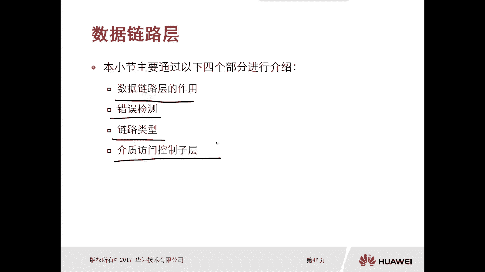

## 数据链路层的作用 🔗

上一节我们回顾了网络分层模型，本节中我们来看看数据链路层的具体作用。数据链路层位于网络层和物理层之间，它在数据的封装和解封装过程中扮演着关键角色。

对于发送方设备（如PC1），数据链路层接收来自上层（网络层）的**数据包**，并将其封装成**数据帧**，然后交给物理层进行编码和发送。

对于接收方设备（如PC2），数据链路层接收来自物理层的**比特流**，将其处理成**数据帧**，然后剥离帧头帧尾，将内部的**数据包**交给上层的网络层进行处理。

简单概括，数据链路层的作用是：
*   **发送时**：将网络层的数据包封装成帧。
*   **接收时**：将物理层的比特流解封装成数据包。

---

## 数据链路层的工作内容 ⚙️

了解了数据链路层的基本作用后，本节中我们来看看它具体要完成哪些工作。数据链路层的主要职责包括以下四个方面：

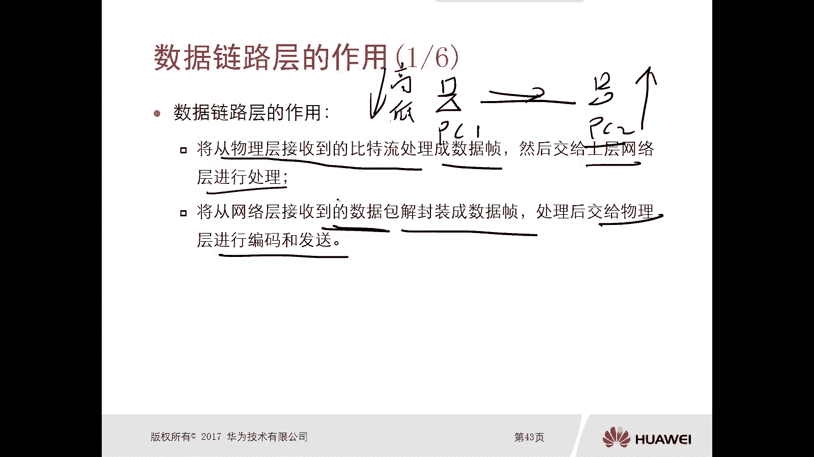

以下是数据链路层的四项核心工作：
1.  **数据成帧**：为网络层下发的数据包添加头部和尾部，形成可以在链路上传输的数据帧结构。
2.  **错误校验**：检测数据在物理传输过程中是否出现差错，确保交付给网络层的数据是正确的。
3.  **物理寻址**：使用硬件地址（如MAC地址）来标识和寻址网络中的设备，确保帧能被正确的接收方识别。
4.  **可靠传输**：在差错率较高的链路上，通过确认和重传等机制，保证数据能够可靠地送达接收方。

接下来，我们将对每一项工作进行详细说明。

---

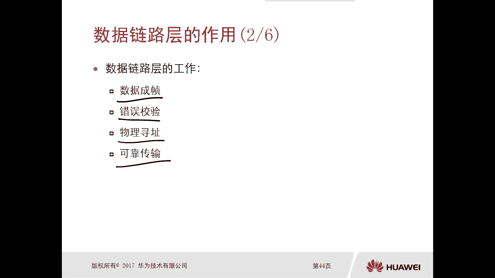

### 1. 数据成帧

数据成帧是数据链路层的基础功能。当网络层的数据包到达数据链路层时，协议会为其添加一个特定的头部和一个尾部。

这个封装后的结构就是**数据帧**。数据帧是物理层进行编码和转换（如转换为电信号或光信号）的基本单位。帧的头部通常包含控制信息，如目的地址、源地址等；尾部则常包含用于错误检测的字段。

---

### 2. 错误校验

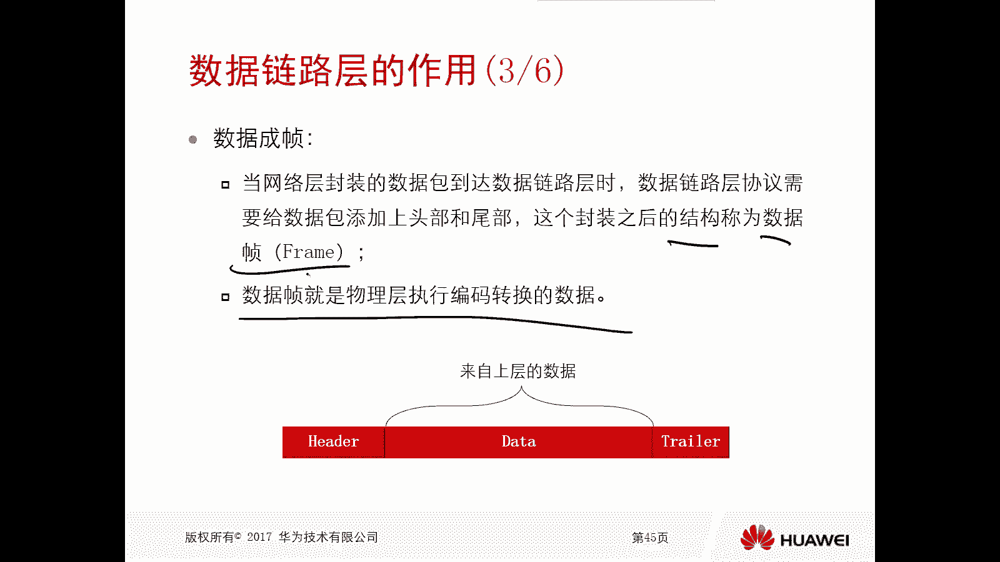

信号在物理介质上传输时，可能因各种干扰而产生错误。位于物理层之上的数据链路层需要承担错误检测的职责。

其目的是确保交付给网络层的数据帧是正确的。如果帧在传输过程中出错，数据链路层会将其丢弃，避免上层处理无效数据。这也是数据链路层协议需要为数据包封装尾部的一个重要原因。

---

### 3. 物理寻址

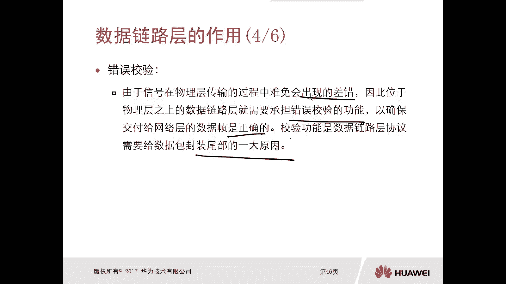

在网络层，我们使用逻辑地址（如IP地址）进行寻址，这类似于寄信时需要收件人的城市和街道地址。而在数据链路层，我们使用**物理地址**进行寻址。

最常见的物理地址是**MAC地址**。MAC地址是一个固化在网络设备网卡中的硬件地址，理论上全球唯一。当PC1要与PC2通信时，除了要知道PC2的IP地址，还必须知道PC2的MAC地址。

在封装数据帧时，发送方需要在帧头中填入**源MAC地址**和**目的MAC地址**。接收方设备会检查帧头中的目的MAC地址是否与自己的MAC地址匹配，只有匹配的帧才会被接收并向上层传递。

> **核心问题**：发送方如何获取接收方的MAC地址？这需要通过**ARP协议**来实现，我们将在后续章节详细介绍。

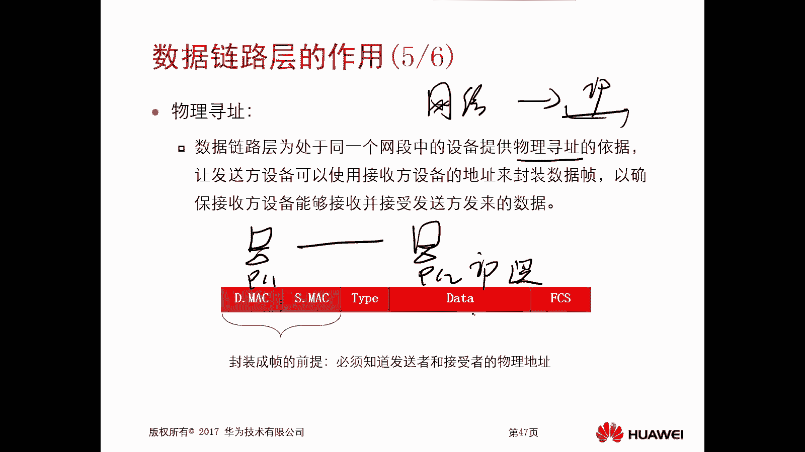

一个典型的数据帧结构可以简化为：
```
[ 帧头 (含目的MAC、源MAC、类型) | 数据 (来自网络层) | 帧尾 (FCS校验) ]
```

---

### 4. 可靠传输

在物理链路质量较差、差错率较高的情况下，数据链路层可以提供可靠传输机制。这通常通过**确认**和**重传**来实现。

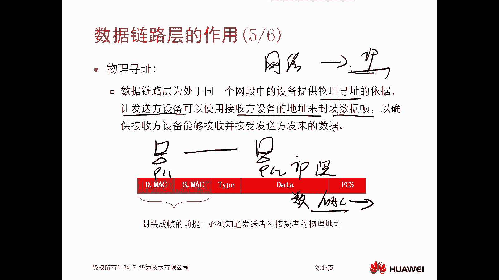

发送方发送一个帧后，会等待接收方的确认回复。如果收到确认，则继续发送；如果超时未收到确认，则认为帧丢失或出错，会进行重传。这种机制确保了即使在有干扰的链路上，数据也能被可靠地传递。

---

## 错误检测方法 🔍

上一节我们介绍了错误校验是数据链路层的重要职责，本节中我们来看看实现错误检测的几种具体方法。常见的错误检测方法主要有三种：

以下是三种主要的错误检测方法：
1.  **奇偶校验**
2.  **校验和**
3.  **循环冗余校验 (CRC)**

---

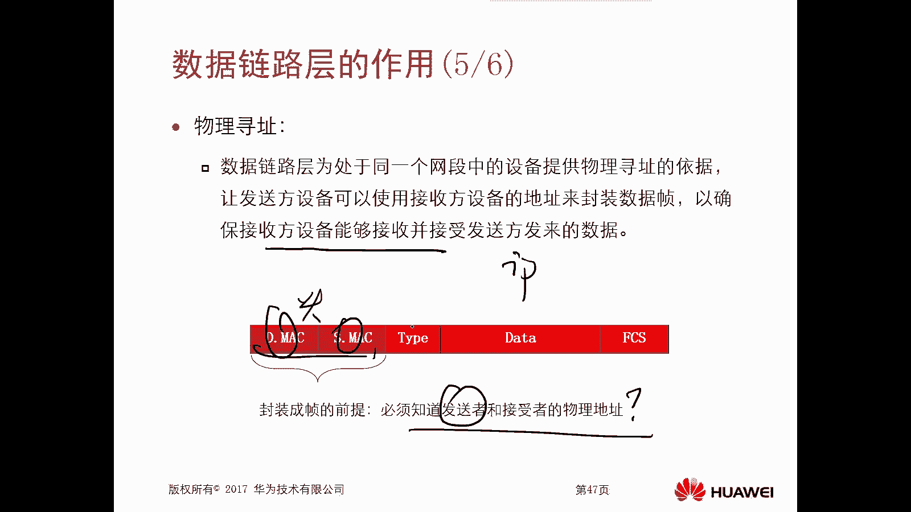

### 1. 奇偶校验

奇偶校验是一种简单的检错方法。在传输开始前，发送方和接收方需约定使用**奇校验**还是**偶校验**。

发送方在原始数据后增加一个校验位，使整个数据中“1”的个数为奇数（奇校验）或偶数（偶校验）。接收方收到数据后，计算“1”的个数。如果个数不符合约定，则说明传输过程中出现了单数位错误。

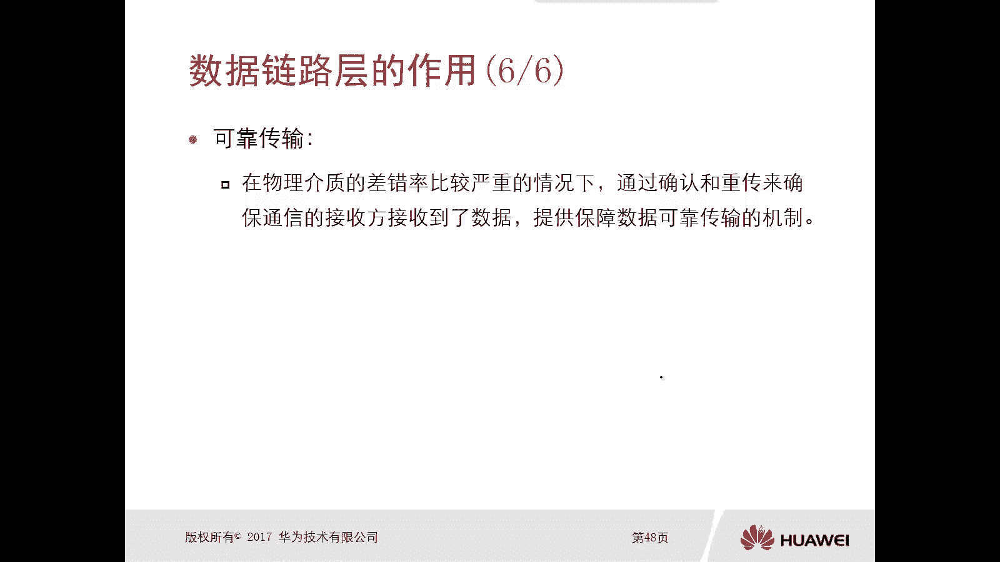

**局限性**：如果传输过程中有偶数个位发生错误，“1”的个数奇偶性可能保持不变，从而导致无法检测出错误。因此，在差错率较高的环境中，奇偶校验不再适用。

---

### 2. 校验和

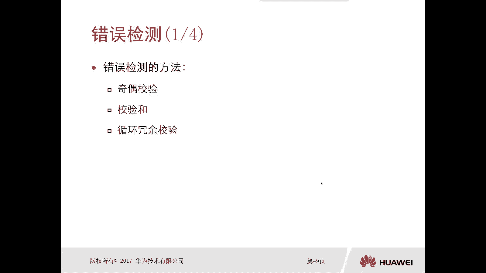

校验和是一种应用广泛的检错方法。发送方在发送数据前，通过特定算法（如对16位二进制数进行反码求和）计算出一个**校验和值**，并将其封装在数据中一起发送。

接收方收到数据后，使用相同的算法对数据部分重新计算校验和。然后将计算结果与数据中携带的校验和值进行比较。

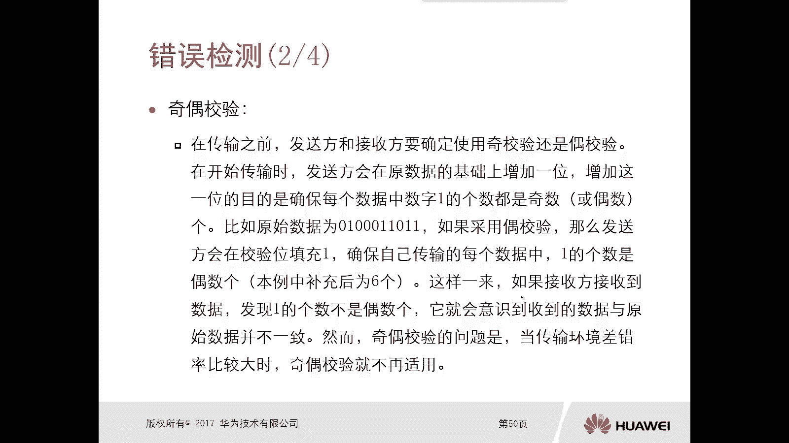

*   **如果两者相同**：认为数据在传输过程中没有出错。
*   **如果两者不同**：认为数据在传输过程中出现了差错。

许多上层协议（如IP、TCP、UDP）都使用校验和进行错误检测。

---

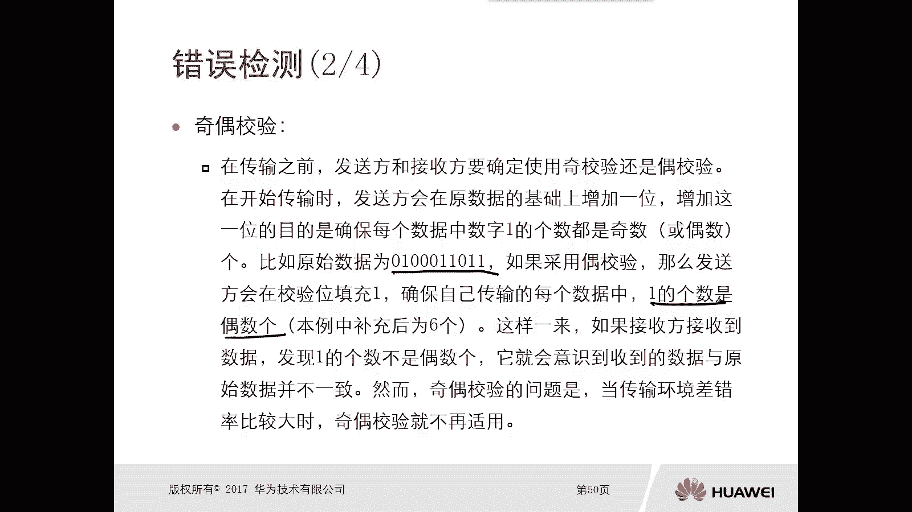

### 3. 循环冗余校验 (CRC)

循环冗余校验是一种基于多项式除法的强效检错方法。发送方将待发送的数据和一个附加的冗余码（即CRC码）一起发送，这个组合可以被一个预先约定的**生成多项式**整除。

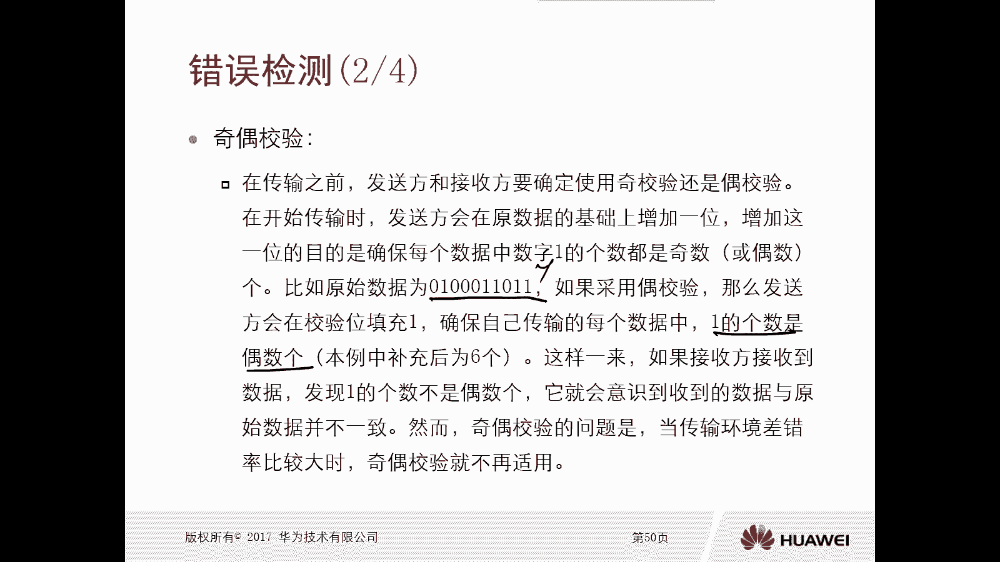

接收方收到数据后，用同样的生成多项式去除接收到的数据（包含CRC码）。

*   **如果余数为0**：认为数据传输正确。
*   **如果余数不为0**：认为数据传输出现了差错。

CRC的检错能力非常强，是数据链路层（如以太网）最常用的错误检测方法。

> **核心概念**：无论是奇偶校验、校验和还是CRC，其核心思想都是**发送方通过算法生成一个“指纹”（校验值），接收方通过相同的算法验证这个“指纹”**。如果“指纹”匹配，则数据完整；否则，数据可能已损坏。

---

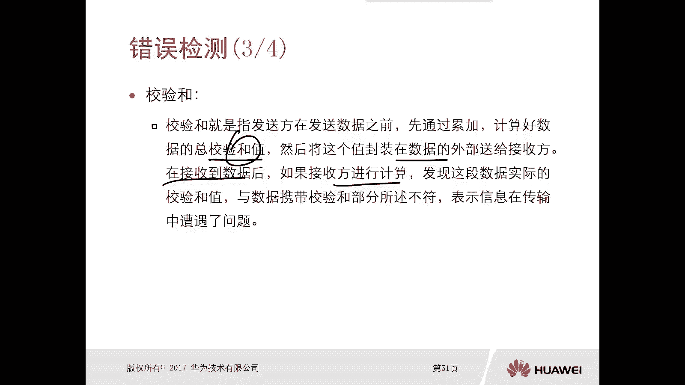

## 总结 📝

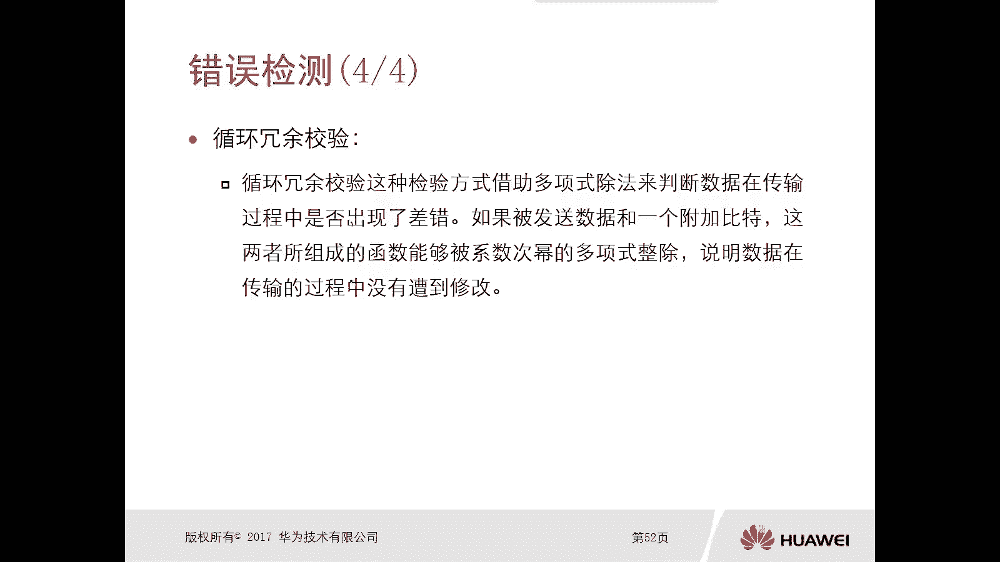

本节课中我们一起学习了数据链路层的核心知识。

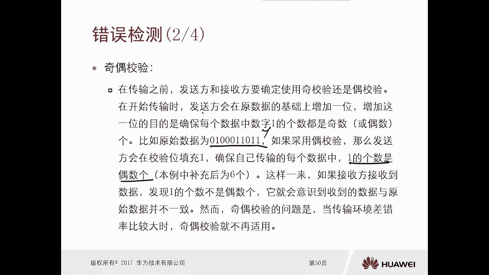

我们首先明确了数据链路层在OSI模型中的位置和作用：**封装与解封装数据帧**，充当网络层与物理层之间的桥梁。

接着，我们详细探讨了数据链路层的四项主要工作：**数据成帧**、**错误校验**、**物理寻址**（使用MAC地址）和**可靠传输**。

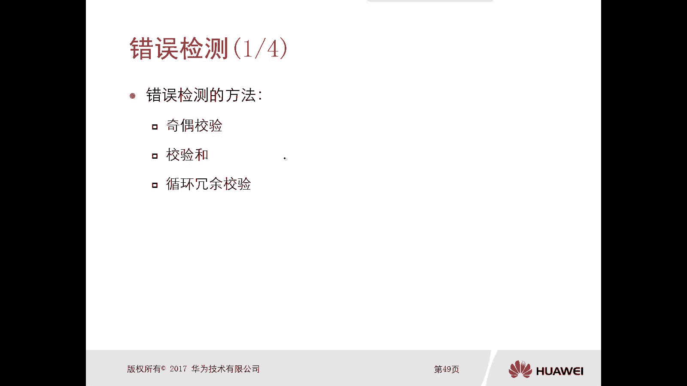

最后，我们深入分析了三种常见的错误检测方法：**奇偶校验**、**校验和**以及**循环冗余校验(CRC)**，理解了它们如何确保数据传输的完整性。

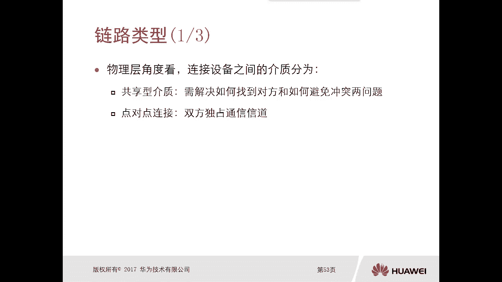

掌握数据链路层的这些基本原理，是理解局域网通信和后续更复杂网络协议的基础。