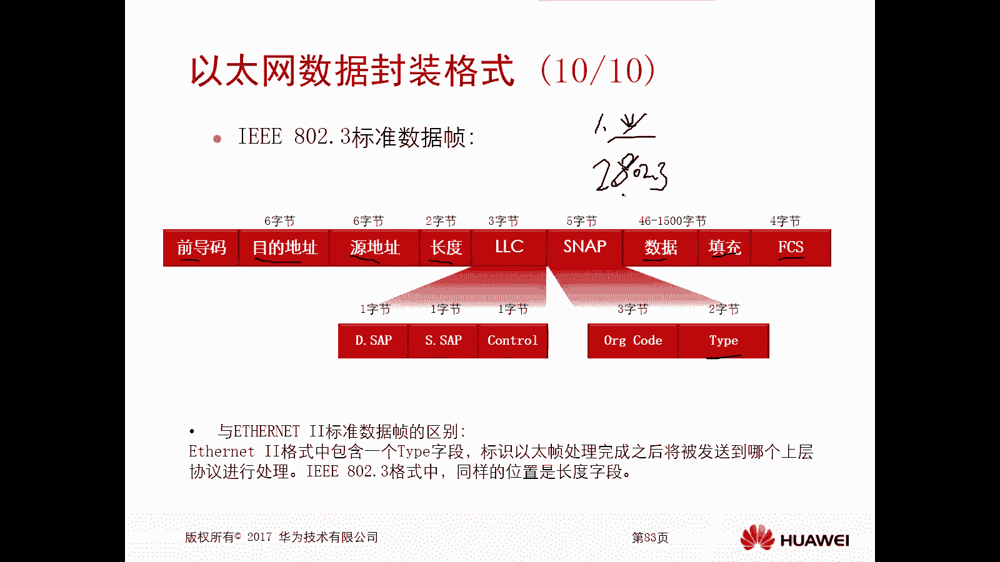
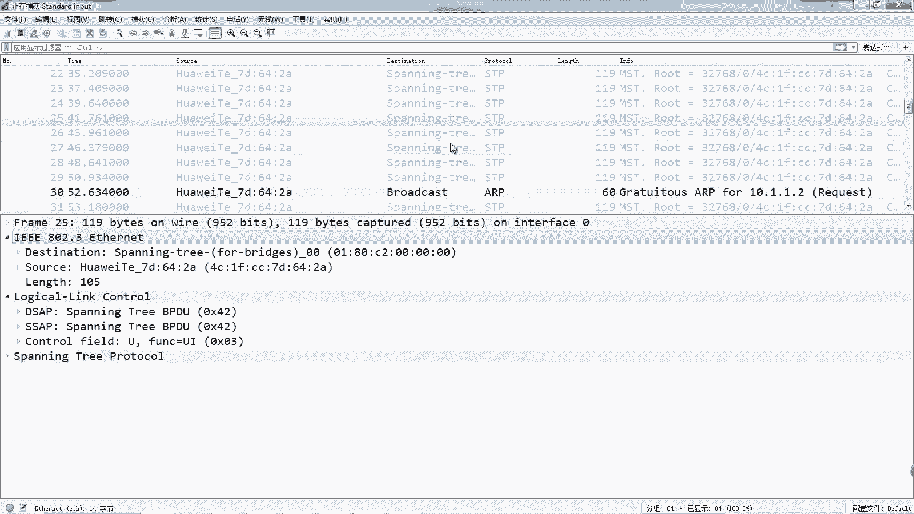
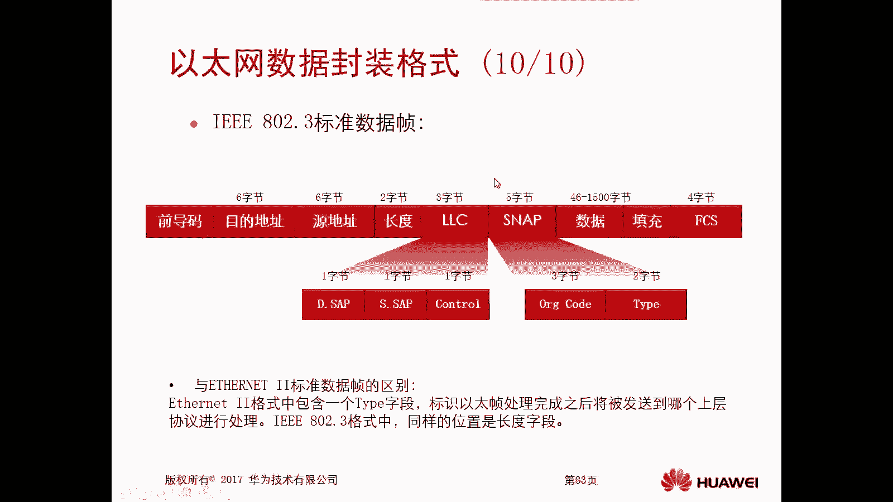

# 华为认证ICT学院HCIA/HCIP-Datacom教程：P9：第1册-第4章-3-以太网协议概述及以太网数据封装格式

在本节课中，我们将要学习以太网协议的基础知识。以太网是当今局域网中最主流的通信技术。我们将从以太网的起源讲起，然后深入探讨其数据帧的封装格式，最后介绍MAC地址的基本概念。

## 以太网概述 🧭

上一节我们介绍了数据链路层的基本功能，本节中我们来看看局域网中最核心的技术——以太网。

以太网的历史始于1973年。Robert Metcalfe在施乐公司的帕洛阿尔托研究中心使用粗同轴电缆搭建了第一个局域网，其传输速率为2.94兆每秒。他将这个网络命名为“以太网”。

几年后，DEC、英特尔和施乐公司共同制定了速率为10兆每秒的以太网标准，该标准目前被称为**以太网II**标准。1983年，IEEE（电气和电子工程师协会）发布了**IEEE 802.3**标准，它对以太网II标准进行了少量修改，旨在重新定义以太网规范。

根据工作方式，以太网主要分为两类：
*   **共享型以太网**：所有设备处于同一个冲突域。当一台设备发送数据时，其他设备必须等待。它使用**CSMA/CD**技术来检测和避免冲突。随着网络规模扩大，性能会显著下降。早期的集线器就是典型的共享型设备。
*   **交换型以太网**：使用交换机隔离冲突域，每个端口是一个独立的冲突域。通信双方通过独占的媒介进行通信，互不干扰，网络性能高效。这是目前主流的组网方式。

## 以太网数据封装格式 📦

了解了以太网的背景后，本节中我们来看看数据是如何在以太网中被封装和传输的。最常见的以太网数据帧封装格式有两种：**以太网II**和**IEEE 802.3**。

### 以太网II帧格式

以太网II标准定义的数据帧封装格式如下：

```
| 前导码 (7字节) | 帧起始定界符 (1字节) | 目的MAC地址 (6字节) | 源MAC地址 (6字节) | 类型 (2字节) | 数据与填充 (46-1500字节) | 帧校验序列 (4字节) |
```

一个完整的以太网II帧长度在**64**到**1518**字节之间。以下是各字段的详细说明：

*   **前导码与帧起始定界符**：前导码为7个字节的固定模式`10101010`，用于接收方时钟同步。帧起始定界符为1个字节的固定模式`10101011`，其最后两位`11`标识着帧数据的正式开始。
*   **目的/源MAC地址**：各占6个字节。目的地址标识数据帧的接收设备，类似于快递的“收件人地址”；源地址标识发送设备，类似于“发件人地址”。
*   **类型字段**：占2个字节，用于指明数据帧承载的上层网络协议。接收方根据此字段选择对应的协议进行解封装。常见类型包括：
    *   `0x0800`：表示上层协议是**IP协议**。
    *   `0x0806`：表示上层协议是**ARP协议**。
*   **数据与填充字段**：数据部分长度在46到1500字节之间。如果数据本身不足46字节，则必须用填充字段补齐至46字节。这是为了满足以太网帧的**最小长度64字节**的要求。
    *   **为什么需要最小帧长？** 在早期的共享型以太网中，使用CSMA/CD机制检测冲突。定义最小帧长是为了确保发送方在发送完整个帧之前，有足够的时间检测到可能发生的冲突。如果帧太短，发送方可能在冲突信号传回之前就认为发送成功，导致数据丢失。
*   **帧校验序列**：占4个字节，位于帧尾部。它使用**循环冗余校验**算法，供接收方校验数据在传输过程中是否被破坏。如果校验失败，该帧将被丢弃。

### IEEE 802.3帧格式

IEEE 802.3标准的数据帧格式与以太网II类似，但存在关键区别：

```
| 前导码 (7字节) | 帧起始定界符 (1字节) | 目的MAC地址 (6字节) | 源MAC地址 (6字节) | 长度 (2字节) | LLC (3字节) | SNAP (5字节) | 数据与填充 (46-1500字节) | 帧校验序列 (4字节) |
```

主要区别在于：
*   **长度字段**：在以太网II“类型”字段的位置，IEEE 802.3使用的是“长度”字段，指明后续数据的长度。
*   **LLC与SNAP头部**：为了标识上层协议，IEEE 802.3帧在数据字段前添加了LLC和SNAP子层头部。其中，**SNAP头部中的“类型”字段**功能与以太网II的“类型”字段相同。

### 两种格式的应用场景

在现网中：
*   **以太网II**格式用于封装**几乎所有的用户业务数据**，如网页访问、文件传输等。
*   **IEEE 802.3**格式通常用于**网络设备间的协议报文**，例如生成树协议、某些路由协议等。

## MAC地址简介 🔑

在上一节我们提到数据链路层需要进行物理寻址，本节中我们明确这个地址就是MAC地址。



MAC地址，也叫物理地址或硬件地址，由48位（6字节）二进制数组成，通常表示为12位十六进制数（如`00-1A-2B-3C-4D-5E`）。它是网络设备在网络中的唯一标识，固化在网卡中。在以太网帧中，源和目的MAC地址是实现数据在局域网内准确投递的基础。

## 总结 📝





本节课中我们一起学习了以太网的核心知识。我们回顾了以太网的起源与发展，详细剖析了**以太网II**和**IEEE 802.3**两种数据帧封装格式的异同，并理解了最小帧长、MAC地址等关键概念。掌握这些内容是理解局域网通信和后续学习交换技术的重要基础。