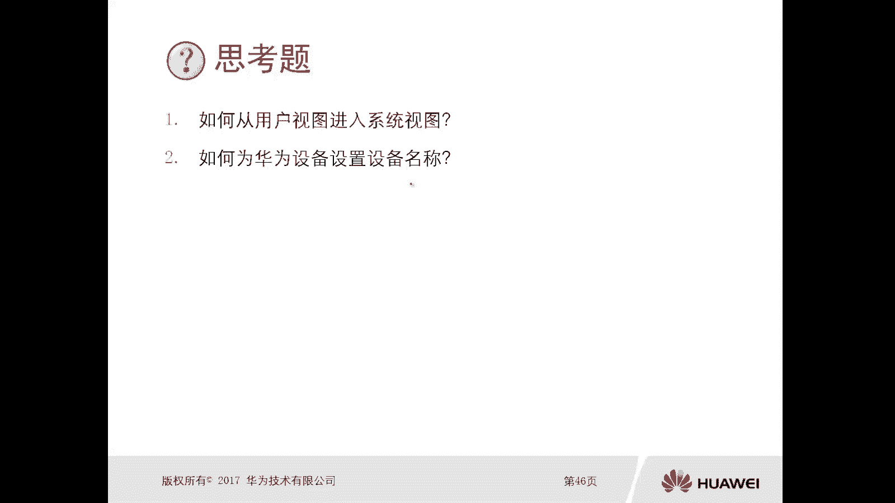

# 华为认证ICT学院HCIA／HCIP-Datacom教程【共56集】 数通 路由交换 考试 题库 - P1 - ICT网络攻城狮 - BV1yc41147f8

那接下来呢给大家介绍一下，华为VIP网络操作系统，本小节主要是介绍，VRP的操作系统和配置基础，那现在华为的网络设备呢，都是采用统一的一个操作平台，就叫做VRP。

那么对于我们学习华为网络技术的人员来讲呢，那么对VIP的一个操作系统比较熟悉，以及能够做一些基本的配置，那么这个呢是我们学习华为网络的一个，最最基础的一个东西，那么本小节呢主要是由三个部分组成。

第一个呢是VRP系统的概述啊，我们得搞清楚VIP操作系统它的一个作用啊，VIP操作系统，它的发展史啊等等内容啊，那么第二个呢是命令行的基础，因为现在我们华为设备呢，包括我们最常规常见的路由器，交换机啊。

PC等等，那么一系列设备，都是可以采用这种命令行的方式进行配置的，那么有一些高端的设备，比如说我们防火墙啊，那么可以采用web页面的方式去做，但是大部分呢还是采用这种命令行的方式，去做啊，去做操作。

所以说呢我们一定要对这个命令行呢，有一定的基础，那么第三个呢是VIP系统的配置基础，那么我们了解了命令行，那么我们要知道怎么对一个VIP操作系统，去做一个最基本的一个配置，OK这是三部分内容。

那么接下来我们先看一下VIP的一个系统概述，那么我们先介绍一下VIP系统，VIP系统呢它就是一个操作系统啊，只不过这个操作系统呢，它是运行在华为的一些网络产品上，那你比如说路由器和交换机啊。

这个VIP操作系统呢，很类似于我们现在比如说PC啊，笔记本啊，采用了一些windows操作系统或者是苹果的操作系统，只不过我们windows操作系统或者苹果操作系统，是在笔记本或者PC上面的。

那么对于VIP系统呢，是华为公司具有完全自主知识产权的，一个网络操作系统，那么这个呢是由华为自主研发的啊，当然你把这个VIP操作系统，你放到其他的厂商的硬件设备上，肯定是不能用的对吧。

那是华为这个自主研发的，那么可以运行在多种数据通信产品的，硬件平台之上，那么我们能够想到的，比如说路由器交换机啊对吧，然后安全的一些防火墙啊，安全的一些DOS设备啊，IPX啊，无线的一些APAC啊等等。

都可以使用这个VIP操作系统，所以说这个VIP操作系统呢它是集成了路由交换，安全无线等多种数据通信的一个功能，那么VIP操作系统呢，它的一个特点是非常非常好的啊，第一个是高考性。

那么VIP系统呢有高可性的一些特性对吧，那么还有高性能可扩展的特点，那么对于一个VIP操作系统，那么不同的产品，可能使用的VIP的一个版本是不一样的，那么对于VIP的版本号组成部分呢，主要是分为两大块。

一个呢是主版本号，一个是产品版本号，那么比如说我们主版本号，我们举个例子啊，我们可能看到过这种VIP操作系统，你打开以后呢就能看到一个叫做version啊，五点几啊，那么这样给大家去看一个实际的一个。

设备上的一个版本啊，好，那么这个呢是华为自主研发的一个，ESP的模拟器啊，那么他可以去模拟华为这个流行的一些设备啊，比如说交换机啊，路由器啊，防火墙啊，APAC啊，那现在我给大家去打开一个这个路由器。

叫做ARE，那么在这里边呢，我们可以去查看一下他的这个，VIP的一个操作系统，那么对于这个命令行呢，我们后面有解释啊，所以在这呢大家不用这个担心，我们先看一下这个display version。

那么在这里边呢，我们可以看到它有一个OBRP的software对吧，一个软件版本是5。13，这个5。130呢就是一个大的版本啊，主版本号，那么后边呢是产品的一个版本啊。

AR220V2002003C零零啊，那么我们可以通过这种方式啊，去查看他的这个VIP操作系统的一个版本。

啊以及这个产品的版本号啊。

那么对于VIP的一个版本呃，实际上它是经过了好几个发展阶段，那么最初呢是在1998年到2001年，那么主要采用的是集中式的一个部署方式，那么叫做VRP1啊，那么VRP1呢，那么它是集中式的设计。

那么适用于我们中低端的一些设备，性能呢在当时来讲是比较低的啊，OK那么第二个呢是在1999年到2000年的，V r p2，那么这个呢是采用分布式的一些设计啊，分布式的设计。

那么到了2000年到2004年，那么开发出了VIP3啊，那么也是分布式的一个平台，而且支持众多的一些特性啊，可以支持这个核心路由器嗯，那么现在我们大部分的华为的产品呢，还是采用的VIP5啊。

那VIP5VIP5呢它是组件化设计，那么是用于华为的多个产品，你比如说最常见的AR系列呀，比如说S交换机系列呀，啊比如说防火墙这个USG系列啊，啊那么它的特点是高性能。

那么对于一些数据中心的一些网络设备来讲呢，它采用的是VIP8，那么VIP8呢就更加高端了，它是多进程，那么组组件化设计是支持多个CPU的，是多宽的。

OK好，这是整体VIP版本，它的发展历程，那么当我们进入到一个华为的产品以后，实际上我们采用命令行的方式对它进行操控啊，那么对它操控的这个内容，实际上就是VIP的一个系统，那么进入到VIP系统以后。

你会看到有一系列的视图就是为new啊，那么视图你不同的视图，对应的是不同的一个权限，那么执行的操作的命令也是不一样的，所以说在华为的VIP系统里面呢，它定义了一系列的视图。

而且视图和操作命令之间是存在对应关系的啊，那么接下来我们就认识一下啊，在华为设备里边，它都有哪些这个操作的一个视图啊，那么视图呢第一种视图呢叫做用户视图，叫做用户视图，那么用户视图呢我们很容易区分出来。

它的提示符是一个尖括号啊，一个尖括号好，那么对于用户视图呢，只能去查看设备的一些运行状态，和基本的一些参数啊，你说其他操作这个基本是做不了的啊，如果说你想对设备做进一步的一些操作啊。

比如说配置一个系统的这个设备的名称啊对吧，去配置什么一些协议啊，对不对，那么这种情况下，我们需要从用户视图进入到系统视图，那么系统视图呢它的提示符呢是一个中括号啊，是一个中括号，中括号。

那么它的作用是配置全局和系统参数等等内容，那如果说你想对设备的一些接口，比如说去配这个IP地址啊对吧，去应用一个什么ACLO啊等等，要对接口进行操作，那么这种情况下我们需要进入到接口视图啊。

那么接口视图呢它的提示符呢还是中括号，只不过多了一个杠接口的一个ID啊，那么作用呢就是我们配置接口对系列的参数啊，好那么如果说我们要去配置一些协议相关的，那么需要在系统视图进入到这个协议视图啊。

系统视图进入到斜视图，那么协议视图呢它的提示符呢也是设备名称杠，然后协议类型协议ID，那么它的作用是配置协议参数，那么对于这个VIP的一个视图呢，包括他的操作命令，后面也会有专门的章节给大家演示。

OK好，这是这个视图和操作命令嗯，那么紧接着呢我们接下来就要去看对吧，它的一个配置啊，那么刚才我们讲了，你在这个呃VIP定义的这个视图里边呢，有用户视图啊，有系统视图啊，接口视图，还有斜视图。

那么我们通过什么样的方式去进入到，不同的一个视频呢，那么缺省情况下，我们进入到华为的一个产品以后啊，缺省就是用户视图啊，我们可以看到啊，在这儿呢进来以后呢，他就是一个这样的一个监控号。

而且大部分设备它的初始的一个名称呢，叫做华为，哎，就是华为，OK然后呢我们通过执行system venue啊，进入到系统系统模式，一定要注意是通过system menu是吧，这个很容易理解啊。

这个直译的话就是系统视图，对不对好，那么如果说你想从系统视图切换到接口视图，那么我们要输入的命令呢叫做interface，那么后边的是接口id啊，那么接口id呢，我们有呃这个不同类型的一个接口啊。

比如说有接口啊，有一口哇，有S串口啊等等是吧，那么你要对哪个接口进行操作呢，需要执行相应的一个命令啊，好，那么我们也可以从系统视图，切换到这个斜视图啊，斜视图，那么主要是通过比如说我们要配置OSPF。

那么就是配个OSPF后面的是一个process id，而且D那么进入到100，那么最终呢我们可以看到这个提示符呢，就是已经进入到了OSPF100啊，这样的一个进程里边。

那么接下来我给大家找一下这个华为的设备啊。

去给大家演示一下好，那么还是这个模拟器啊，我现在打开的就是这个路由器R1，你看当我打开设备以后呢，初始就会进入到一个这个用户视图监控号，那么名字呢是华为，那么我通过执行system renew啊。

System menu，那么回车啊，那么进入到了一个叫做系统视图啊，那么在系统视图里面呢，我也可以去执行interface，比如说进入到G0杠零杠一哎，那么这种情况下呢，你是进入到了一个华为设备的。

即零杠零杠一考啊的一个接口视图啊，那么退出来呢大家就是想我们用cut去退出来，退到系统视图以后呢，我们还可以通过执行，比如说OSPF100啊，我们去配置一个OSSPF协议。

那么就进入到了一个协议的一个视图啊，斜的视图，那么我们还可以进行退休啊，啊这个是比较简单的啊，这是最基础的啊，我们得知道你通过什么样的方式进入到，系统视图，通过什么样的方式进入到接口视图。

通过什么样的方式进入到啊这个斜视图。

那么用户等级和命令等级啊，这个也是比较重要的，那么对于我们去访问华为设备的时候，那么你的用户等级呢呃有0~15个级别啊，0~15个级别，那么如果说你的用户等级是零的话，那么是一个访问级的。

一个用户可执行的命令的等级呢只有零几的诶，那么大家注意一下我们的华为设备呢，它是有用户等级和命令等级的，那么它们之间的对应关系，第一个呢就是用户级别为零的，对应的是可执行的命令等级为零。

那么命令等级为零的，我们可以执行的命令的类型有哪些呢，主要是一些网络诊断工具相关的命令，比如说我去做一个拼音呀，去做一个trace呀，对不对诶，或者是从本设备发出的，访问外部设备的一些命令。

比如TNT和部分的一些display的命令等等，那么如果说你的用户等级是一，那么这个呢是一个监控级的用户，那么它可以执行命令等级是零和一啊，那么零一这样的一个命令等级呢，是包含了哪些命令类型呢。

主要是包括用于系统维护的一些命令和display啊，那么对于上面那个不管是呃，零级别的还是一级别的啊，那基本都是比如说做一个诊断呀，做一个维护啊，啊你做配置的是受不了，如果说你想对设备做一些配置。

配置层面的一些事情啊，那么我们需要有用户级别为二的一个级别，那么是配置级别，配置级别呢，可执行的命令等级是0123个级别，那么这里面包含的内容就比较多了，比如说我可以去配置路由啊。

可以去配置网络课程的命令啊，哎也可以，这个用于向用户提供一些直接的网络服务，等等等等这些内容，那么这是一个配置的，如果你想做更多的一些事情，比如说我要做系统的管理啊，电源那些控制啊，用户的管理啊。

什么命令级别的一些设置等等等等这些内容，那么你通过配置级就搞不定了，我们需要采用管理局，那么管理局呢它的用户等级呢，它的这个嗯这个数量是比较多的，是从3~15的，那么3~15。

实际上它可执行的命令级别是一样的，都是01232013，那么这里边就是刚才我讲了，你也可以对对这个文件系统进行管理啊，对吧啊，对一些这个命令级别进行设置啊，我们系统内部的一些参数设置等等等等。

那么只能使用这种管理级别的啊，用户等级包括这个命令等级才能够实现哎，就是这个用户等级和命令等级，那么一般情况下呢，我们去在什么样的一个场景里边，需要使用到用户级别和可执行的命令级别呢。

比如说我通过远程TNT也好，或者是S3H也好，去远程管理某个设备的时候，那么一般情况下我们都有一个用户对吧，有一个密码你登上去去对它进行管理，那么这种情况下，你这个用户呢。

我就可以在设备上去定义它的用户级别，和可执行的命令等级啊，你得去监管这样的用户，你不能说上来，你随便去对我设备进行操控啊，对不对，你比如说你你只能上来去做一个这个诊断啊，比如说你只能上来去做一些维护。

你不能去做配置，你不能去做管理，对不对，这是可以控制的啊，那么VIP操作系统我们现在基本能够了解了，那么对于我们拿到一台设备，你不管是路由器也好，还是交换机也好，还是防火墙也好，对不对。

那么第一个我们要做的事情，是要去对这个网络设备进行命名啊，这个非常非常重要，因为我们刚才看到了华为的产品，缺少它的初始的名字都叫华为，对不对，那如果说你不对设备进行命名的话，假设有移动大厦对吧。

然后十层每一层都有路由器交换机，那么你通过远程的方式登上去以后，你发现设备都是一个名字华为，那你也搞不清楚，我到底登录的是一层机房里边的路由器设备呢，还是二层机房路由器设备对吧，搞不清楚，所以在这呢。

我们第一个要做的事情是要对它进行命名啊，那么这些命名的这个方式呢，这个规则啊，我们可以这样的是，第一个要区分设备的一个类型对啊，你比如说我们是路由器，一般的就是RR是rot对啊，R1。

那么比如说交换机呢一般是switch switch1对吧，哎比如防火墙，防火墙一般是FW，firewall啊，FW啊等等，也可以这样去命名，那么也可以去区分设备的一个所属部门，那么很有可能。

比如说你一个大厦里边可能有多个部门对吧，你多个部门里面呢有不同的一个设备，那你可以去设置，比如说哎这是这个销售部的R，一是这个售后部的这个SW1啊，包括可以区分设备的一些物理位置。

比如说它放到了这个大厦里面的一层，二层或者三层，你可以去做一个设置的，对不对好，那么我们通过什么样的命令去设置，这个华为设备啊，它的一个名字呢是通过system name，System name。

那么这个system name呢是在系统视图下去执行的，那么这个呢我给大家抄一下啊。

好你比如说现在我进入到了这个用户视图，先通过system menu进入到这个系统视图，对不对，然后在系统视图呢通过system name去配置它的名称，比如说它叫ARE啊。

叫做access rotter e啊，因为我们华为这个AR系列呢，叫做访问的一个路由器对吧，访问接入路由器就access rotk a r e好，那么同样的我们还可以对这种switch啊对吧，去命名。

比如说system name对吧，然后SWE没有W可以这样的啊。

好那么第二个要做的事情呢也是比较重要的，就是我们要设置这个系统的一个时钟，就是给他配个时间啊，在后期如果说我们的设备出现问题啊，它也会有一些log信息，那么log信息里边呢。

呃就会显示它的一个发生问题的一个时间啊，如果说你设备的时间不准确的话，对你后期去拍照的话就比较困难了，你都不知道在什么时间段会出现的问题，对不对，哎那么设置时钟。

设置系统时钟的命令呢就是clock time zone，那么后面呢先设置时区和变量，然后通过clock this time去设置它的一个日期啊，日期和时间啊，啊然后呢我们还可以去设置这个夏令时啊。

夏令时是OK这是第二个要做的事情，那么第三个呢是我们可以去配置标题消息，那么当我们用户登录到设备的时候啊，给它显示一个内容，那么分为你登录前的显示和登录后的显示啊。

那么我们可以通过header login information啊，后面呢比如说welcome to access华为，那这个呢是我们在登录之前，它的一个显示标题信息啊。

那么header share uh information，Do not be bought the device，那么这个呢是呃当我们登录以后，它显示这个标签机对吧。

那这个呢是类似于一个警告的一个信息啊，那么还是建议大家不要在设备上去写这种welcome，这种字眼啊，因为你welcome，如果说一个黑客对吧，登录上来发现是welcome，那黑客进来以后呢。

可能就随便搞了对吧，哎这个呢是有一个笑话呢，就是在美国对不对，有一个黑客入侵了一个公司的一个设备，但是呢这个黑客呢后来呢被这个抓到了啊，然后呢告上了法庭，最终呢这个这个公司呢没有胜诉，败诉了。

原因就是它的设备上呢写了一个welcome，那你welcome，那我黑客就进来随便搞一搞了，好，那么这是第三个啊，那么第四个呢是我们要为这个设备配置IP地址，那么呃我们网络设备呢都有IP地址进行互联。

那么这个IP地址呢是我们在哪配呢，是在接口视图下去配啊，那么IP地址那么采用点分十进制，那么有王位和掩码位，那么这个呢也是我们要讲的内容，那么后面也会去讲的，OK那么这个就类似于我们每每台PC啊。

每个笔记本呢都会有一个IP地址，你没有IP地址怎么进行上网啊，对不对，就是这个配置IP地址，那么第五个呢就是当你做了一系列操作以后，我们对这些配置进行保存，如果说你不对这个配置你保存。

那么你的设备在断电或者是重启以后啊，那么呢你所做的操作配置呢全部都没有了啊，所以说一定要在用户视图输入save这个命令，进行保存就可以了，嗯但是在某些情况下啊，我们需要把你之前保存的一些配置啊。

全部全部都清空啊，那么清空的命令呢，是在用户视图呢去做一个reset save configuration啊，然后呢他会做一个告警，说你这样的配置呢，你这样的一个操作呢。

会删除所有的一个这个保存的一个配置，你要不要继续，我们讲我们要敲一个1Y全部清空好，那么呃呃如果说我们对设备进行维护的时候呢，要进行一个重启重启的话啊，我们可以在这个设备上去按一个开关键。

但是你比如说你是远程的登录的设备，你没法够得着这个设备对吧，那么我们只能通过这种命令的方式，对这个设备进行重启操作，那么是在用户视图呢啊，去设置一个去配置一个bot这样的一个命令。

然后这种程序呢它也会有一个information，也会有告警是吧，你这个设备要不要要不要重启重启，继续，yes就可以了，好那么这个呢我们就把本小节就结束掉了，那本小节的重点是VIP的版本格式。

那我们有这个主版本，有产品版本，那么不同视图和等级，有用户视图，系统视图啊，接口视图和斜视图是吧，那么等级呢有零级别，有一级别，有二级别，有三级别，对不对，好第三个呢是VIP的一个基本配置。

那么我们最起码要对设备进行一个命名，要配置时间对吧好，那么要配置地址，最后呢还要保存是吧，Ok，好那么有两个思考题，第一个如何从用户视图进入到系统视图，大家考虑下如何从用户视图进入到系统。

试图通过执行system new对吧，第二个如何为华为设备啊，华为的设备去设置设备名称，那么主要是通过system name去设置，对不对，OK好。

