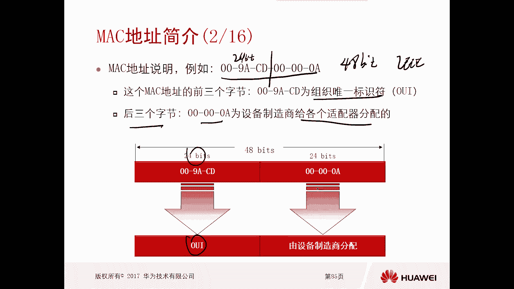
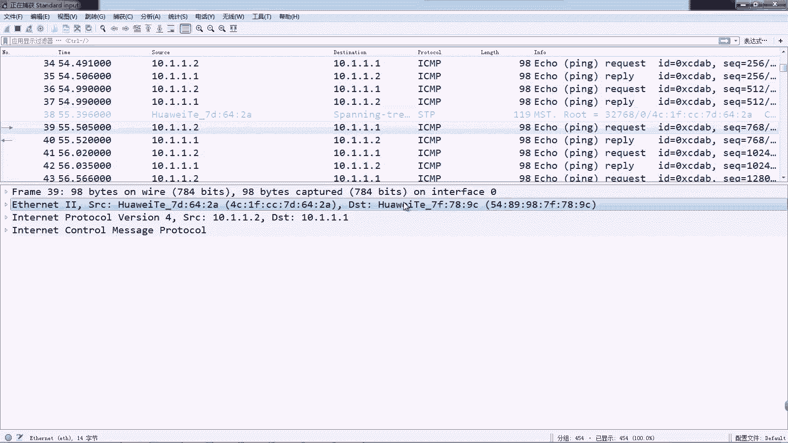
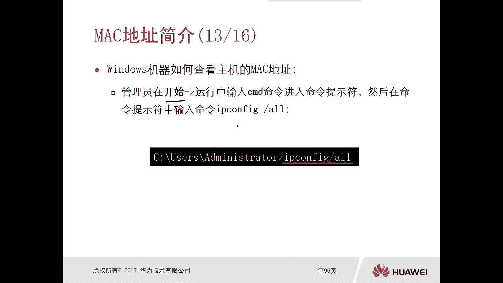
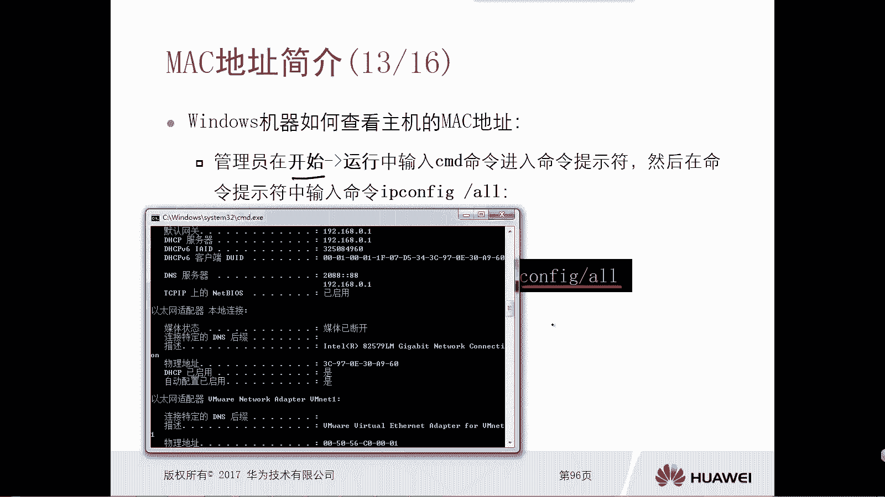
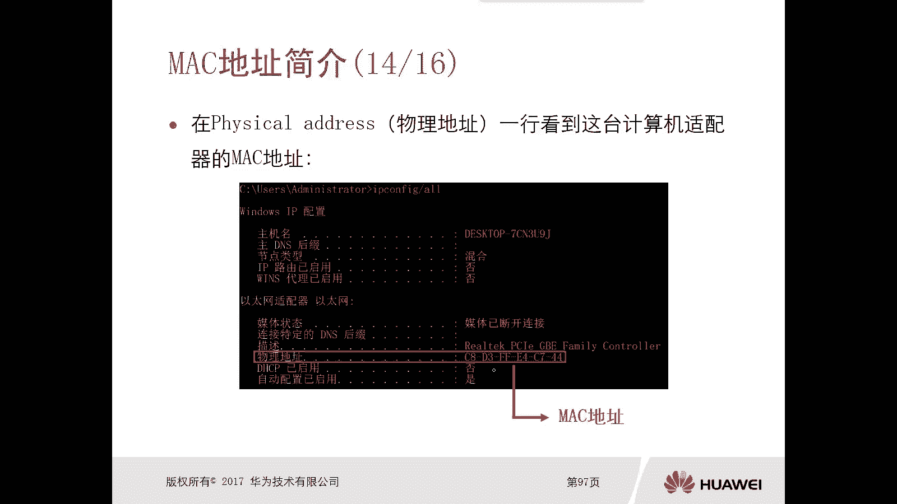
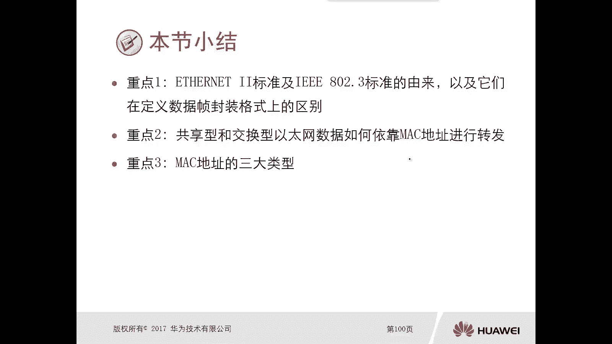

# 华为认证ICT学院HCIA／HCIP-Datacom教程【共56集】 数通 路由交换 考试 题库 - P10：第1册-第4章-4-MAC地址介绍 - ICT网络攻城狮 - BV1yc41147f8

好那么接下来呢给大家介绍一下，刚才我们在这个以太网标准里面提到的，它的封装里面有一个嗯原木地址对吧，哎这个原木地址呢其实指的是原木Mac地址啊，那么接下来我们就看一下，这个Mac地址的一个简介啊。

Mac地址呢也称为硬件地址啊，那么前面我也简单做个介绍啊，就是你比如说我们的一些呃产品啊，一些硬件终端设备啊，比如网络设备，终端设备，那么它出厂的时候都会有一个激活卡。

这个卡上就会有一个Mac地址是固化的，收进去的啊，烧进去的，那么一般情况下是不能更改的啊，当然现在呢我们有一些，可以通过一些软件进水改来进行修改，但是并不是实际的感，它只是一个这个叫做呃叫做伪装啊。

叫做伪装，那么作用呢是在这个数据链路层内，去标识一台设备适配器的一个身份，那么理论上来讲呢，像这种Mac地址啊，这种硬件地址是全球唯一的啊，是全球唯一的，那么这个Mac地呢是由六个字节组成。

六个字节组成，那么当然我们分析什么原木Mac地址对吧，一共是48个比特，那么比如说这里边又给了一个举例啊，有一个Mac地址是009ACD00000A好，那么这个Mac地址的前三个字节啊。

因为一共是六个字节嘛，从中间岔开啊，那么前三个字节呢叫做组织位移标识符，叫做OUY，那么这个OUN呢是我们的一些生产厂商，比如华为N它要向着IANN进行申请的，唉像这种IN进行申请的啊。

那么申请下来以后呢，你才能够去使用，后三个字节呢，是由厂商为他的各个适配器去分配的，当然这后三个字节就是厂商任意去做了对吧，上的一个设备的id啊，这是OUI啊，这个组织位移标识符呢是必须要去做申请的。

那么当然华为呢你看这个应该是华为的对吧啊，这个公司的，那么实际上嗯，华为公司呢它是有多个这个OUI的一个oi，你肯定不够用嘛，对不对，会有多个OI，OK好，这是这个48个比特的Mac地址。

它分为两部分哦，这个搞清楚，一个是OUI前面24个比特对吧，三个字节，后面24个比特呢，是设备厂商去分配的一个id好，那么接下来我们就看一下，这给了一个Mac地址的一个例子啊，呃比如说他给了一个举例。

举例呢这个MAD的是零零杠9A杠CD杠，零零杠，零零杠0A那么这些呢全都是16进制的数啊，对不对，哎，那么对于这样一个48个比特，六个字节的Mac地址，它分为两部分，正好这两部分呢是从这个中间查看。

那么前三个字节，也就是前面24个比特是组织唯一标识符，那比如说在这个例子里面就是009ACD啊，这是华为的其中一个OI，那么这个OUI呢组织不一，标识符是要向着IEEE申请的啊，这个H不要给你分配。

你比如说我们各大厂商比华为啊，其他的一些这个设备厂商，那么它都需要去向着i trip e去申请oi，但是对于华为来讲呢，一个oi可能不够用哦，那可能会有多个oi，那么后边三个字节呢就是后边24个比特啊。

比如说这个例子里面啊，00000a，那么这个呢是设备制造商啊，给这个各个适配器去分配的一个i id，所以说前面24个比特实际上是OUI啊，这个呢是要向着H不去申请的，你不能厂商随便去乱造的对吧。

后边24个比赛呢是厂商随便去编排的，当然他也有自己的一种规律啊，去编排，那么一个厂商呢，可能这种这个设备制造商，他这个24个比特不够用，他可能要向着这个白学博弈啊，去申请多个oi。

那么对于华为呢就有好多oi对吧好，那么我接下来就给大家展示一下，在我们华为设备上去抓到的，这个华为设备发出来的一些数据包，那么这个数据包，它自动的就会将这个Mac地址的前面。

24个比特解析成啊华为公司了，唉大家可以看一下啊。

唉大家可以看一下，这个就是一个抓包的一个文件啊，这个文件呢我们可以看一下，在这个以太to去封装的时候，它的原Mac地址和这个目的Mac地址，那么前面的你看全都是华为公司嘛，哎华为公司截出来。

实际上它对应的是4CEFCC，那么这个呢肯定是华为向着I却不去申请的，其中的一个oi对吧，后边那才是你这个设备的一个接口的id，的适配器接口id，Ok，那么当然其他厂商肯定也有其他厂商的额外了。

解析的非常清楚啊，好那么OUI呢刚才我们已经介绍过了啊，他就是这个适配器制造商在生产适配器之前啊，像这个HPE注册并申请得到的这个啊，本厂商的一个标识符，然后Mac地址呢刚才我们讲到了，它是16进制。

那么16进制，二进制，十进制它的一个表示啊，这个我觉得大家应该都在大学里面都讲过的，对吧，在我们学校上课的过程中都讲过的对吧，二进制，比如说四个零呢，那十进制有零了，16进制零啊，对不对。

那二进制只有零和一啊，所以说就是啊一呢就是零幺，211103的幺幺，那11就不用提了，那么16进制呢是123456789，ABCDEF这个关系还是比较简单的，我们都学过嗯。

那么接下来我们就看一下在共享型以太数据，在这个共享型以太网里边，这个以太数据真它的一个处理方式是什么样的，那么由于它是一个共享型的以太网，那么比如说中间是一个集线器hub，那么比如说中单A终端A。

他要找的目的设备的Mac地址是009ACD3，33333对吧，那是终端C嘛，哎终端三嘛，对不对，那么这种情况下他去发送数据的时候，由于从比如说这是一口二口，三口四口从一口进去了。

因为集线器呢它是一个共享，共享网络的一个设备，那么它属于同一个冲突域，这些设备啊，这些终端设备啊，所以这种情况下呢，他会这个继电器呢会把这个数据啊，从二口三口四口都转发出去，但转发出去以后。

那么终端二和终端四发现这个数据的一个目的，Mac地址是三三，但是我终端二是二二，我中单四十四四哦，那不是找我的，对不对，那我就直接把数据给丢掉了，那么终端三呢他是给我的，我就先说了啊。

所以说从这个例子里面呢，我们也能够感受到，在一个共享型的这种以太网里边，它这个效率是比较低的，你看我不是给不是给我的哦，但是集线器呢也给到我了，对不对啊，但是在我们这个交换型的一个以太网里边。

这个以太帧数据处理呢就不太一样了，因为在我们这个交换交换型的以太网里面呢，我们最常用的是交换机，那么交换机上呢它有一张表叫做交换表，或者叫做cam表啊，或者叫做Mac地址转发表。

那当然这个这个表的一个这个名称很多啊，Mac地址转发表看表交换表，对不对，哎那我们呃专业名词呢应该叫做can表，好看，表里面呢实际上它是一大堆接口对应的Mac地址，就说白了，就是你这个接口接的是一个。

有什么样的Mac地址的设备，那么从这个图里面可以看到一口呢记得是幺幺，二口接的是二三口，334口接的是四四，那么这样的话，终端一再向着终端C去发送数据的时候，他终端一发送出来数据的目的。

Mac地址一定是3333，然后交换机收到以后呢，他就去查这个表，看表诶，发现3333这个Mac地址对吧，对应的接口是三口，这种情况下他会把数据只从三口转发出去，而不会从二口和四口转出去啊，那这样的话。

你看在这种交换型的这个网络环境里边，对这个以太网，以太网数据帧啊处理呢就比较高效了，那么对于终端二和终端四呢，不会收到这种无用的数据，对吧好，那么接下来我们就看一下这个看表。

看表呢指的是这个Mac地址和交换机端口的，这个二元组映射关系，二元组的一个映射关系啊，当然我们后边随着知识的深入啊，那可能我们要讲的这个看表，可能不只是Mac地址和交换机端口了，甚至有一些围栏信息呀。

那么对于这个看表的一个作用呢，第一个交换型以太网中，那么主要是通过看表实现有针对性的数据转发，而不再像这个共享型的这个网络环境里面，反正我收到了，我都转一份对吧，你要是有的话，你肯定收到了，对不对。

它它没有针对性对吧，但对于这个交换以太网里面呢，它就有针对性了，你是给他的吗，是给他的，我有映射表象吗，有就给他了，对不对好，那么对于这个表象，他的学习呢，大家注意下这个交换机里面那个表象。

它并不是说你这个交换机你放那儿对吧，开机对吧，家电它就有了，它有一个学习的过程，他学习过程呢是基于原Mac地址进行学习的，就是你你的主机，你的终端设备，你发送数据出来的时候，一定是被交换机收到了。

对不对，那你发送出来的数据里面的封装呢，肯定是有原Mac地址和目的Mac地址对吧，那么对于一个交换机，它一开始是一个空的一张表，那么他收到数据以后呢，手首先就是根据收到数据帧的原卖地址应学习。

那你比如说假设啊我这个终端一，他发送一个数据出来，他用他自己的Mac地址是1111，那么交换机收到了发现是从G01口收到的，那么他就会学习到了哦，原来G0杠一口连接的是这么一台设备对吧。

一定是用终端的原麦粒子进行学习嘛，对不对，哎这是学习过程，那你随着你这个交换网络环境里边，这个设备终端它相互去发送数据的一个过程啊，最终呢这个交换机呢，肯定会学到一个完整的表啊，好那么有了这个表以后。

你当你交换机再收到数据的时候，那么在进行转发的时候，它是基于目的Mac地址进行转发的，只是看一下哎你要去哪吗对吧，哎你要去哪吗，就是这个啊注意一下好，那么接下来我们看一下这个Mac地址它的分类啊。

那么Mac地址分类是分为三大类啊，第一个是单播Mac地址啊，第二个是广播Mac地址，第三个呢是主播Mac地址，那么对于一个单播Mac地址，它的第一个字节的第八个beat一定是零，第一个字节的第八个比特。

因为我们说这个Mac地址是48个比特，六个字节对吧，一定是第一个字节的第八个比特为零，那么这种Mac地址呢一定是单播Mac地址啊，一定是单播Mac地址啊，比如说主角发个弹幕啊，给C的还是给B的。

还是给D的，对不对，如果说你这个单播是给B的，那么C和D肯定是收不到的啊，因为单播嘛比较有针对性啊，好接下来我们看一下广播Mac地址啊，那么广播Mac地址很容易区分啊，它就是四个八里的，全都是一。

全都是全都是腰啊，48个比的腰那一的话就是全都是FF嘛，那么如果说你现在主机它使用这种广播啊，Mac地址去发送数据，那么由于我们现在还是同一个，处于同一个广播域里面，虽然不是这个冲突语言。

比如说我们中间是交换机，那么由于这个是广播啊，所以说呢即使你中间是交换机设备啊，他也会把这种广播类型的啊，这个这种数据啊，发送给除了收到接口以外的其他接口，那么这样的话就是ABCD全部都可以收到。

这样的这个广播的一个数据，哎这是广播Mac地址啊，好那么接下来我们看一下主播卖地址，主播卖地址是第一个字节的，第八个比特币一这样的一个Mac地址呢，他一定是组Mac地址。

那么如果说主机A用主播Mac地址去发送数据，那么假设主机B和主机地是处于这个主播里边，那么对于一个主机C呢，是没有处于这个主播组里面啊，那么这种情况下，这个数据被发出来以后。

只会被主机B和主机基地属于相同的，这个主播组里边的主机收到这主意，C呢它不属于这个组合组，他是收不到这个数据的，哎这是这个主播Mac地址啊，好那么前面我们看的啊，全都是这个广播啊，单播啊和这个主播。

当然这个主播讲的是IPV4，那么对于IPV6里边呢，他也有广播，也有单播，当然也会有这个主播，那么对于IPV6里面的主播，Mac地址是怎么得到的呢，他是将，IP就是IPV63层IP地址的32个比特。

就是后32个比特啊，再结合固定的3333啊，正好得到48个比特的Mac地址，但是这个我觉得啊，就是这个主播卖地址对应的IPV6这一块啊，在这讲呢可能稍微有一点点早啊，稍微有点点早啊。

我觉得应该是在讲IPV6的时候，再重新去把这个主播magic给大家去介绍，所以在这呢，只能说大家知道IPV6的主C怎么来的，它是通过这种映射好，那么通过这种映射，那么当然IPV4组播Mac地址呢。

它也是通过映射映射下来的啊，他是这个23个比特，那么前面的是固定的呃，00X0100510啊，是这样的一个效果啊，那么这个我们在后期在讲主播的时候，再慢慢的去深入吧。

好那么呃比如说我们在这个一些机器上面，怎么去查看这个主机的Mac地址呢，比如说我们在这个windows操作系统里面啊，那么在开始运行CMD里边对吧，进入这个命令行，然后呢输入这个IPCONFIG港澳好。

那现在我已经把这个CMD的命令行打开了对吧，我们直接输入这个IPCONFIG杠，那么在这里面呢我们就能看到我网络结构卡，它的这个呃就是Mac地址，我们看一下啊，我得找一下，因为我的这个网卡比较多。

我们看这个以太网适配器就是本地连接对吧好，这就可以看到它的一个实际的物理Mac地址对，就这个物理地址能看到的对吧好啊。

这是我们在这个呃windows操作系统里面，通过IPCONFIG2以后看到的这个物理地址啊。

这就是Mac地址，这就是我本机的Mac地址啊，好那么如果说我们的是LINUX操作系统呢，我们在这个命令这个提示符里面输入AICONFIG，杠A啊，然后管道符more就可以看到。

那么看到效果呢就是我有一个以太网卡对吧，这个网卡它这个硬件的地址，硬件地址是多少，那么这个是有两个卡呀，有两个网卡，所以他就他就可以看到两个网卡的硬件地址啊，好这样我们就把这个Mac地址啊就介绍完毕了。

那么Mac地址呢实际上就是这个物理地址对吧，每个接口适配器都会有，那么它是包括包括两部分，一个是oi，一个是场上ID对不对，OI呢是有要向这个H不去申请的，对不对，那么它的类型呢分为什么。

单播Mac地址啊，广播Mac地址啊，和组或Mac地址。

