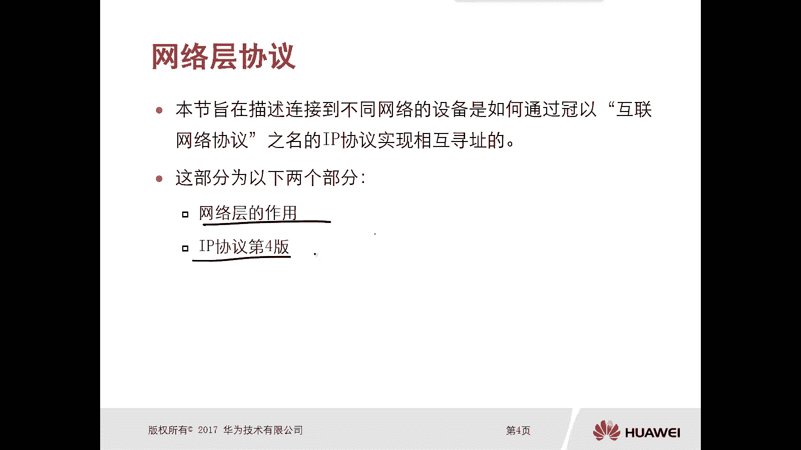
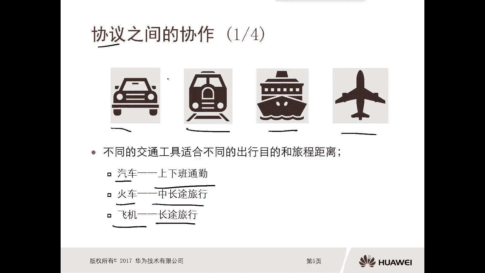
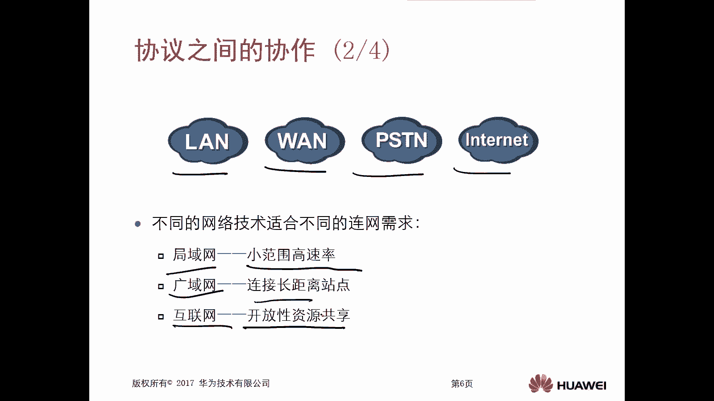
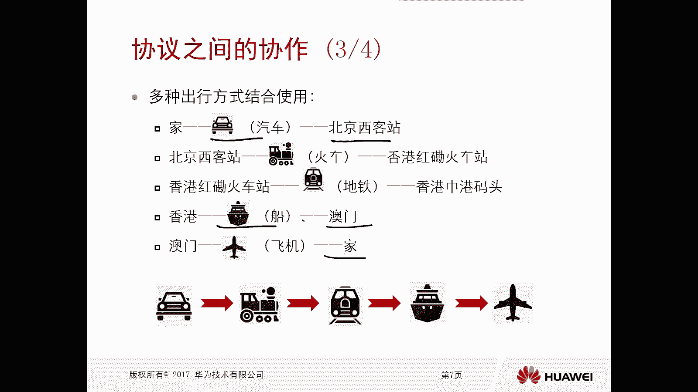
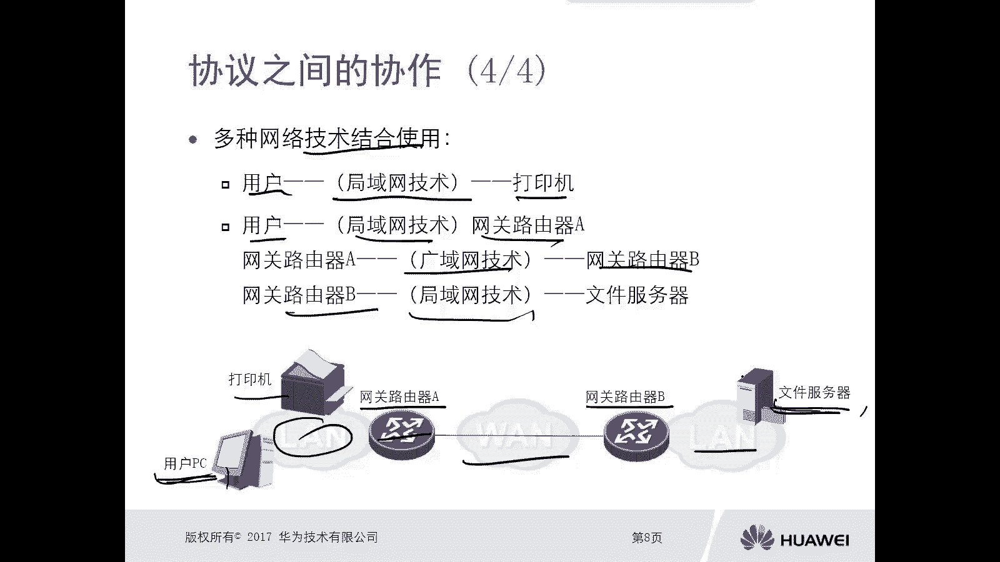
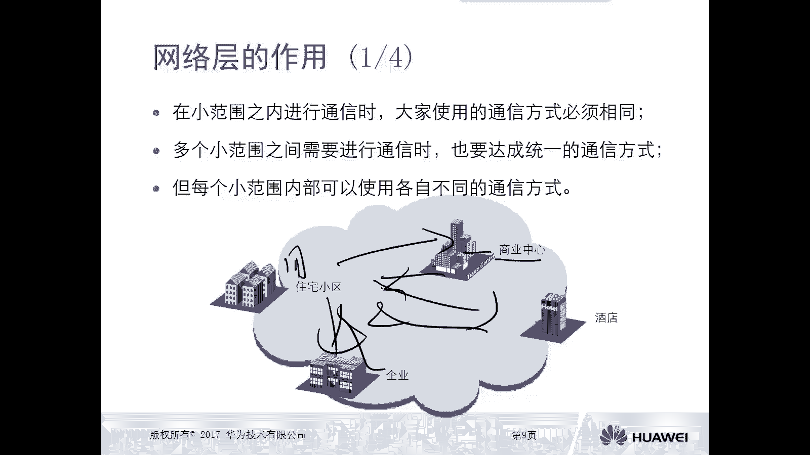
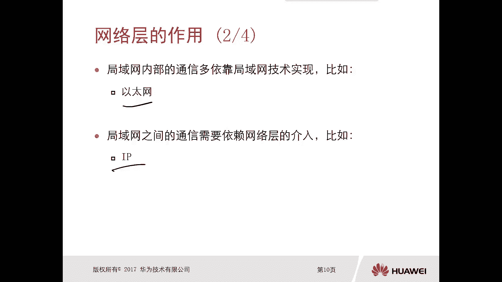
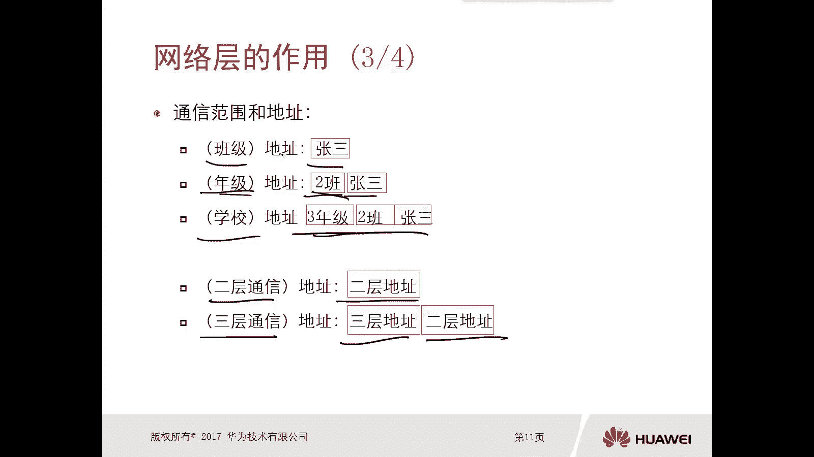
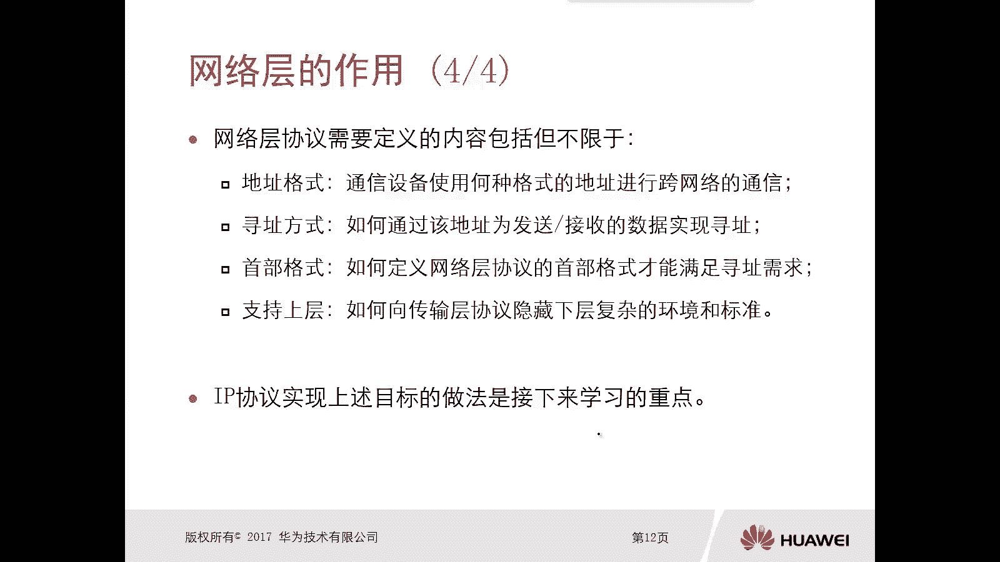

# 华为认证ICT学院HCIA／HCIP-Datacom教程【共56集】 数通 路由交换 考试 题库 - P11：第1册-第5章-1-网络层的作用 - ICT网络攻城狮 - BV1yc41147f8

好那么接下来呢我们讲一下这个网络层协议，那么本节呢主要是为了描述，连接在不同网络的设备，是如何通过观影互联网协议啊，互联网络协议，知名的这个IP协议实现相互熏死的，那么这部分主要是由两部分组成。

第一个就是网络层作用层，第二个是IP协议，第四版好。

那么首先呢我们先看一下弦之间它的一个协作，那么这个胶片呢，是通过一个实际的一个生活案例而引出来的，你看我们我们可以乘坐不同的一个交通工具，对不对，我们可以乘坐汽车对吧，然后是火车呀或者轮船呀或者飞机。

但是呢我们不同的这种交通工具啊，是适合不同的出行目的和旅程的一个距离的，你比如说我们上下班对吧，从家到这个公司，你比如说这个我们在北京，或者在什么某某个市区啊，那么一般呢我们都是采用汽车的方式对吧。

如果近一点呢，我们可能采用什么自行车，甚至是步行，对不对好，那么如果说我们要做一次这个中长途的旅行，比如从北京到这个青岛对吧，到这个上海啊，我们可以采用火车，那么火车呢又分为什么高铁啊，动车呀。

普通普通的火车啊，对不对啊，那么就是这个中长途的旅行，那么还有呢就是这个啊长途旅行，那么长途旅行，比如说我要出国了对吧，那这种情况下可能要飞机，你甭甭说出国了对吧，你比如说我去一趟杭州。

我去一趟这个深圳，从北京啊去一趟温州，那么我们也得用飞机吧对吧，你坐火车这个实在是受不了啊啊，十几个小时，七八个小时受不了对吧，所以说呢我们可以按照自己的需求啊，你可以去选择这个不同的交通工具啊。

那么不可能说有一种交通工具，去满足所有的需求，如果说有一种交通工具满足所有的需求，我们也不需要搞这么多交通工具了，对不对，那你坐公交车吧，你坐公交车要去深圳买对吧，一个月半个月的才到对吧。

半个月估计够呛，一个月对吧，这可不像是古代了，古代的话只有马车对吧，马车，那马车，比如说从京城到了这个南方某某个这个郡对吧，我可能这个路上要耗一个小时一个月对吧，我们现在不是这个远古时代了是吧。

那么同样这个协议是一样的，这个网络网络技术也是一样的，网络技术呢我们最常见的就是协议，最常说的也是协议，不可能说有一种协议可以满足所有的通信能啊。

所以我们的协议呢有好多种啊，什么局域网协议啊，广域网那些协议啊，对吧啊等等，那么我们的这个呃联网需求呢也是多种多样的，你比如说我们有局域网的需求啊，有这个广域网的需求啊，什么有PT呀。

什么有internet呀等等等等等等，对吧好，那么就和刚才我们说的这种交通工具是一样的，没有说有一种网络，有一种网络技术能够使用所有的联网需求的，对吧啊，那刚才我们看到了我们不同的这个网络技术。

大体呢是分为这么几种，第一种是局域网，而第二种是广域网，第三种是互联网，那么对于局域网是小范围的高速率，这样的需求，你看你比如说呃很简单，我一个办公室吧，那么我有几台设备连到一块了对吧，我。

我我的主要目的就是实现一些什么资源共享啊，对吧，搞个打印机啊，我的目的就是要提高我的工作效率对吧，那这样我就使用局域网就可以了对吧，那现在我们所有的企业都是有聚网好，那么广域网呢。

就是要连接这个长距离的一个站点了，这样的一个需求了，对不对，你比如说我这个有个企业，它有这个不同的这个站点，他们之间要进行一个连接，我们这种情况下就可以使用这种广域网的技术，哎比如说这个华为公司。

我们北京也有，深圳也有杭州有，那么是不同的分部，分部和总部之间我们进行连接的时候呢，我们可以采用这种广域网的连接，那么这种连接呢是传输距离比较远，但是速率呢肯定相对局域网来讲就小，速率就低了好。

另外一种呢就是互联网，互联网是这个开放性的自由梦想，那现在我们比如说我们上个网聊个天啊，看个电视啊对吧，看个电影啊，这全都是啊互联网，那么基本上我们所有的家庭用户啊，包括我们其他的一些上网用户啊对吧。

都是有这个需求的，我们是会使用到这个互联网好。

那么刚才我们讲到了，就是讲的这个交通实力啊，就是我们虽然我们说有不同的这个需求，你使用的这个交通工具是不一样的对吧，但是呢往往达到某种目的，你采用的交通工具诶可能是多个啊，混合到一块儿去用的啊。

你比如说这儿有个例子啊，这个例子呢就是说从北京出发啊，到这个香港啊，港澳港澳去做这个7日游对吧，我们都都去做过旅行啊，那么这种情况呢我们看你从家对吧，一直到从港澳再返回来，那么可能中间呢。

我采用了各种各样的一个交通工具，是结合使用的，你比如说我从家对吧，北京的家通过公交车也好，出租车也好，就是汽车的方式到达北京西客站对啊，然后呢在北京西客站呢，我可以去坐火车高铁，对不对。

然后到达香港的一个火车站，那么从香港的火车站呢，再通过地铁的方式，我们到达这个香港的这个码头啊，然后再从这个码头呢坐轮船到澳门对吧，经过这个港澳吃油对吧，我们再从澳门坐飞机飞到下对吧。

当然你这个飞机不可能到家，你们家没有飞机场对吧，肯定是飞机到了这个首都机场，再从首都机场啊，再通过汽车的方式对吧，或者打击的方式在大家对吧，如果说你们家有飞机场也是土豪了，对不对。

这是这个协议之间的协作啊啊这个，好那我们这就是这个你要满足对吧，这是一个例子啊，比如说我们要持有这样的一个目的，他的这个出行方式的这种结合使用好，这是以这个港澳汽油这种目的啊。

我们多种出行方式的结合使用是吧，那么大体来看就是诶我可以用汽车，然后呢再经由这个火车，在经由这个地铁啊对吧，然后这个轮船飞机一共用了这么多，那么同样这个网络技术也是一样的。

我们在网络通信的里边呢，也是有多种这种网络技术结合使用的啊，结合使用，那么你比如说我们要在同一个局域网里面，同一个局域网里边对吧，那么用户想要去连接打印机去打印东西，那么这种情况下。

我只需要使用到局域网的技术就可以了对吧，因为用户和打印机呢是处于同一个局域网里面，对吧，用这一个局域网接入就可以了，但是假设啊假设假设你看我们这个图里面啊，假设图里面看展示我们这个用户PC对吧。

想要去访问啊，这个另外一个局域网里面的文件服务器对吧，你比如说我们这个用户PC，他要访问本地的一个局域网里面的打印机，那么就是通过局域网的技术就可以了，但是如果说这个用户PC呢。

想要去访问另外一个局域网里面的文件服务器，那么这种情况下我们看啊，它会涉及到用户到网关路由器A的局域网技术，然后呢，网关路由器A到网关路由器B之间，的广域网的技术啊，假设我们说这两个不同的局域网。

他们处于的位置是不一样的，然后到了网关路由器B呢，网关路由器B和文件服务器之间呢，又采用局域网的技术对吧，所以说在这种在这种场景里面呢，我们就需要去结合这个广域网和局域网的技术，同时来实现用户。

PC和文件服务器之间的一个通信，哎所以这个是协议之间的协作啊，就是通过我们刚才讲的对吧，你要去达到某个旅行目的，你要用多种交通工具，对不对，那同样你要完成一个通信，那么中间使用的网络技术。

也是多种结合在一块啊去使用的啊。

那么对于网络层的作用呢，我们可以看一下，通过刚才我们讲到的就是在一个小范围之内，你进行通信的时候，那么大家的这个通讯方式呢必须相同的，你比如说刚才我们讲到你在一个局域网里面，我们都是采用这种以太网协议。

可以啊，那么多个小范围之间需要进行通信的时候，也要达成统一的通信方式对吧，但是你每个小范围内部，可以使用各自不同的通用方式啊，这个是无所谓的是吧，你假设啊，比如说这个我们有ABC3个企业。

那ABC3个企业你们内部使用的协议对吧，你各自使用各自的，但是ABC这三个企业之间如果想要通信的话，那么你们必须之间要达成统一的通讯方式，要不然肯定有问题嘛，对不对，哎你比如说我们下面有一个例子啊。

假设比如说住宅小区里边对吧，住宅小区里边啊，我们一般情况下是以户主的名字啊，作为一个通信标准嘛，对不对，你比如说你在住宅小区里面要写封信，你肯定是啊，或者不叫写封信吗，比如说物业啊去找某个这个户主。

一般都是户主的名字作为一个通用标准，对不对，哎这是住院小区，那么对于这个商业中心呢，你比如商业中心我有好多入驻的一些品牌，那么就以入驻品牌为通用标准对吧，比如说哎我找这个这个某个这个比如说耐克啊。

阿迪达斯啊，对不对，我就去找呗，对不对，好，那么酒店呢酒店呢是以房间号码作为通用标准，几零几零几，对不对，那么企业呢，我可以采用以部门名称作为一个政策标准，好但是你看他们内部去通信的时候。

你比如说住宅小区我就不管了，我就是以名字作为通用标准的对吧，我上完东西呢，就是以这个入驻的品牌作为统一标准的企业呢，就是这个部门按酒店呢有房间号，那你这个相当于是小范围啊。

你每个都是一个小范围小范围内部通信呢，你必须要统一一，也不能说这个住宅小区对吧，我分为十十栋楼嘛对吧，你第一栋楼里面，我通过这种户主的名字作为通用标准，第二栋楼里边，你采用了一个什么电话号码和QQ号码。

你这肯定不行的嘛，对不对，还要统一标准啊，而且每一个小范围和小范围之间，你可以使用各自不同的通讯方式，那通过这四个呢已经显现出来了对吧，它采用的是用户户主的名字，商业中心品牌对吧。

酒店房间号企业部门不一样，但是如果说你想实现住宅小区和商业中心和，酒店和企业他们之间的相互通信，就必须要使用一种通用标准了，那就是另外一种通讯标准了，比如说我们可以采用邮政编码。

门牌号作为一个通信标准了对吧，那大家都用这个，你看你比如说我写信啊，我住在小区里面的一个用户对吧，要和商业中心办公室里边的一个办公主任，写信对吧，我就可以采用UC编码对吧，然后再加上你商业中心那个地址。

再加上你的一个这个门牌号码就可以了，你不管和谁写信，或者是别人给你写信，全都是按照这种标准就可以了。

好那么放到我们技术里面呢，我们可以看一下，那么局域网内部的通讯呢，一般都是依靠啊我们局域网的技术实现，比如说以太网，我们前面讲过，对不对，好，那么局域网之间的通信，需要依赖网络层的介入了，比如说IP哎。

比如说IP。

好那么对于这个通信范围和地址呢，这边也给了一个举例啊，也给了一个举例，给个举例好，你比如说啊，嗯一开始我们这个通信范围比较小啊，唉我们可能包括的信息比较少，但是我们的通信范围越来越大的话。

你的这个地址信息，包含里面的东西就越来越多了啊，你比如说一开始我的范围很小，就是在班级里面，那么班级里边呢，我就通过姓名作为一个通信地址对吧，只要这个班级里边没有重复的姓名对啊，哎哎之前我上学的时候。

我们班级里边呢就有重复的姓名啊，那那怎么区分呢，哎分大小对吧，大张三小张三嘛就区分出来了，哎但但但这种算特殊啊，哎你比如说我在一个班级里边呢，我就通过张三去区分还是李四，对不对。

但是你比如说我在年级这个范围里边，我得通过一个班级加上性能去区分了对吧，很有可能你不同年级里边都有张三啊，那你到底是找二班的张三呢，还是三班的张三啊，对不对啊，这是这个年级咯。

就是在这个年级这个范围里面啊，某年级哪个班里面好，那么在学校范围里面呢，我还要通过几年级几班的张三对吧，哎几年级几班的张三哎，就是某个学校几年级几班的张三对吧，所以说你看随着这个通信范围的一个增大。

一开始只是班级范围，然后是年级范围，最后是学校范围，那么它的地址信息呢是增加的，那么通信也是一样的，通信也是一样的，你比如说我只想实现二层通信，那可能我有二层地址就可以了，但是如果你想实现三层通信。

你除了二层地址，还得有三层地址对吧，哎这种情况下你就必须要使用三层进行了，不仅仅是二层了。

所以说网络层的作用是什么呢，我们看网络层协议呢需要定义的内容，包括但不限于以下几点啊，第一个地址格式啊，就是网络层，你第一个首先要去规定它的一个地址格式，那就是通信设备要使用何种格式的地址。

进行跨网络的一个通信，这就是刚才我们讲的对吧，刚才我们讲的这个案例，说这个小区要和酒店里面的某个用户进行通信，那我要写信，这个写信，你这个地址格式是什么样的，你好，第二个呢就是寻址方式，寻址方式呢。

就是如果如何通过该地址为发送和接收的数据，实现寻址对吧，你你得有一个寻址的方式啊，好第三个呢是手部的格式，首部格式呢是如何去定义网络层协议，它首部格式啊，你才能满足这个寻址的需求啊，如何定义啊。

好那么第四个呢是知识上层，如何向传输层协议，隐藏下层复杂的一个环境和标准，Ok，那么这个呢正好也和我们之前讲的，这个分层就相关了，那么分层的话就是你每一层做每一层的事情，每一层和零层之间是相互不干扰的。

而且你每一层的变化不会引起，不会不会影响到临场，对不对，哎这是知识上层，所以说我们在网络层里面会讲到，一个非常非常重要的协议，就是IP协议，IP协议呢是网络层的协议啊。

那么IP协议呢是能够实现上述的目标的啊，那么它是如何去实现上述的目标。

