# 华为认证ICT学院HCIA／HCIP-Datacom教程【共56集】 数通 路由交换 考试 题库 - P12：第1册-第5章-2-IP协议第4版 - ICT网络攻城狮 - BV1yc41147f8

好，那么接下来呢我们就介绍一下这个IP协议，第四版啊，那么我们俗称的IPV4IP四好，那么IPV4呢是第四个修订的版本，那么实际上在这之前呢，我们有这个IP1V零，I p v1，IPV2和IPV3啊。

那么这个呢是V0V1V2V3啊，都是呃实验性的一个版本咯，那么IPV4呢才是我们真正的互联网协议，开发的这个第四个修订版本，也是我们现在这个网络上最经常用的，这个版本啊。

所以说这个版本呢是被广泛部署的啊，那么呃因此这个常规意义上呢，这个IP呢一般我们讲IP指的就是现在的IP，好那么后续有个版本叫做IPV6，Ipv6，那么这个IPV6呢，现在也在陆陆续续的进行部署。

那么这个IPV6呢，要叫也叫做I下一代的IP网络啊，啊那么对于这个IP6呢，它是主要用来去解决IPV4，现在面临的一个问题，那么IP4面临的什么问题呢，消耗殆尽的问题。

因为IP这种IP地址呢它都是有数量限制的，那么对于IPV4呢，嗯就目前来讲啊，应该是了解到的是在2011年的2月份，那么全球可分配的IPV4地址呢，已经全部都消耗殆尽了啊，所以说未来呢我们解决IPV4。

地址消耗殆尽的啊，那么最终的一个武器，那么就是IP6，Ipv6，哎那有人就好奇他怎么中间没有IPV呢，V5呢，那么实际上IPV5也是有的啊，IPPP呢主要是这个呃，在这个叫做互联网流协议里面去使用的。

叫做SP啊，那么它也是一个实验性的一个这个地址啊，所以说嗯我们现在在嗯互联网上，或者说我们通信网络里面，使用到的就是IP4和IP6，那么对于这个IPV4这个协议呢。

它是TCP和IP协议书里面最核心的这个组件，那么将来肯定是IPV6了，你说这个IP4过渡到IP6用多长时间呢，这个谁都说不清楚啊，啊所以说我们现在这个核心呢还是IP4嗯。

那么IP4呢是实现异构网络互联的一个关键，哎好这是这个IPV4的一个概述啊，好那么接下来我们看一下IPV4协议，它的宗旨啊，第一个呢就是实现从源到目的的一个数据转发，因为我们后期在数据通信的时候。

他都得去填充一个原IP和目的IP好，那么我们怎么能够实现从原核从源到目的，一个数据转发呢，哎那么必须我们要为数据啊去设置成，设置上原和目的IP地址，然后这样的话中间的一些设备呢。

才可以通过这个IPV4的这个源和目的地址，来进行一个数据的转发，哎那么这是IPV4的第一个它的一个宗旨啊，第二个是提供尽力而为的服务，那么对于IP企业来讲呢，他最终的目标就是去转发数据包的。

去尽力而为的去转发对吧，其他的我是不做的，我就是尽力而为的，转你来了我就给你转来了，我给你转，哎，这是IP协议它的一个服务提供的服务啊，所以说他提供的是尽力而为的一个服务。

所以说它是不能够保证传输的可靠性的，那么你怎么去保证数据的一个可靠性呢，哎我们可以依据上层的协议，比如说传输层协议，甚至是应用层的协议去保证它的可靠性，但是对于IP协议来讲呢，这不是我的职责好。

那么接下来我们就看一下，这个IPV4协调的作用，第一个呢是定义了IP数据报的一个封装格式，那么前面我们讲了网络层协议，它做对吧，他要做的事情就有封装格式，那么那对于IP来讲呢，它是网络层的协议。

所以说第一个作用是定义了IP数据报文的格式，那么这个呢是在TP和IP上可传输的一个，基本的单元，第二个呢是建立了通信设备之间实现寻址，路由的方式，并为此提供参考依据，参考预期，那么什么叫做寻址呢。

寻址其实呢就是用于我们给这些通信设备，不管是路由器也好，还是主机好，还是服务器也给它分配一个唯一的标识啊，那么唯一的标识呢，比如说就是一个逻辑地址对吧，那好比就是唉我们在学校里面。

每个人都有每个人的名字对吧，即使假设一个班里边有三个人的名字，一模一样，OK我们也可以通过一种方式哎给它定义，哎你的名字是什么啊，你是大是小还是中对吧，哎就这样哎它是一个标识啊。

好那么这个标识呢可以是这个本地的，可以是全局意的啊，好，那么当然也是也有，也有可能是这个临时的或者这个永久的，或者私有的共有的啊，好，那么路由呢，路由呢它主要是用于把这个数据包啊。

那么在这个圆和目的之间，去提供一个转发路径啊，这么一种进程或者说叫做一种动作啊，说或者说叫做转发，对不对，哎，那么中间设备呢，我得知道对这个数据包怎么去转，那怎么输出啊，这个你可以认为是漏油。

R路由路由还有更深层次更深层次的解释，看好，那么第三个呢，是定义了一系列的分组处理规则啊，你包括数据包的一些分片啊，要不是重组，那么查做校验，当然这个操作交易呢只是针对这个手部的好，这是这个IP协议。

IPP4协议它的作用好，那么我们通过一个例子给大家看一下，这个IPP4协议的作用啊，那么这个呢是通过一个封装的角度去看的啊，比如说我们以和一个以太网为例啊，那么首先你比如说有个数据。

数据在传输层进行处理的时候，比如说我们现在是以TCP为例的，他加的是TCP的一个手部，对吧好，那当然我们上面不看了啊，比如说还有应用层的，当然还有应用层的，对不对，什么应用层传输层啊对吧，哎这东西好。

经过传输层处理以后，接下来呢就进入到网络层的处理，那么现在你的网络层用的是什么协议，是IP协议IPV4协议，所以说在网络层对这个数据进行处理的时候，是在这个TCP的手部之上，再增加一个IPV4的手部好。

那么网络层进行处理完了以后呢，接下来是数据链路层的处理，数据链路层的处理是在IP首部，TCP首部以及数据的基础之上增加一个以太，首部对吧，哎这个以太守护我们前面做个介绍，以太数吧，802。3以太啊。

两种封装格式对不对好啊，那么在网络层和数据链路层对吧，我们增加的分别是IPV4首部和以太手部，那么我们前面应该讲过，在讲以太首播的时候，那么实际上是给它增加了一个逻辑的地址，是二层寻址对吧，在这一层呢。

我们讲到有一个非常重要的地址，叫做Mac地址对吧，他是工作数据链层，那么对于网络层封装的是IPV4首部，那么IPV4首部，它里边呢有一个非常重要的一个地址啊，逻辑地址叫做IPV4地址。

它是在网络上进行一个寻址的，你看好这是这个通过一个TCP的一个封装啊，就是封装的角度去看这个IPP4，它的一个作用就是为了在网络层实现寻址啊，当然陆游呢这张图呢提现不出来。

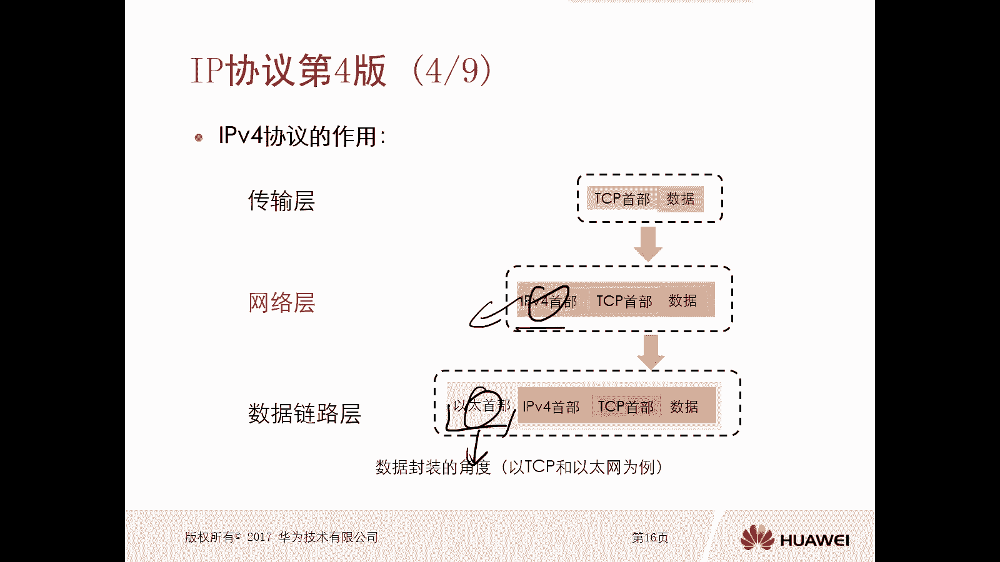

我们后面再去看好，那么对于这个网络层的协议都有哪些呢，哎我们网络层协议呢包括有IPV4，有ARP，有一些路由协议啊，有ISNP，那么对于IPP4来讲呢，它主要是实现寻址的啊，主要是用来所寻找的。

那么对于ARP呢，是主要是用来去做地址解析的啊，那么这个AIP到后面我们会去讲，包括这个ICP，它是用来去做差错的检测的啊，那么还有一些路由协议，那么路由协议呢主要是形成路由表对吧。

然后这个路由器设备呢或者终端的设备呢，再利用这个路由表对数据包进行一个转发，那么对这个数据包进行转发的时候，他的依据是什么呢，哎又回了IP的地址，OK那么后面慢慢再去讲啊，在这呢只是做一个简单的概括啊。

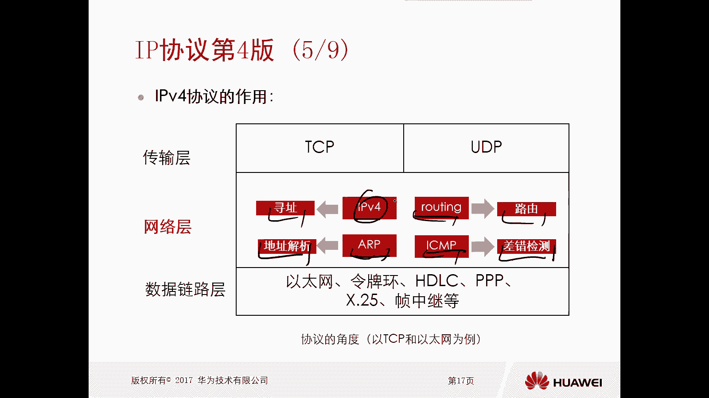

好那么接下来我们看一下这个IPV4协议，它的特点，第一个呢是无连接，无可靠的一个传输机制对吧，因为本身我IPP是提供的一个作用啊，它就是提供尽力而为的传输的对吧，我的目的就是给你传输数据包对吧。

我干嘛要管连接啊，我干嘛要管可靠性啊，那对于数据来讲，比如说我对可靠性有要求的呢，哎你可以根据我的上层，比如说传输层啊啊应用层对吧，哎就可以了啊，所以说这个无连接不可靠的传输机制啊。

他说对于从相同源去往相同目的，多个分组来说的啊，第一个每个分组可以独立的进行处理，或者通过不同的录音进行转发对吧，我不必要说一定要经过一条路进行转发对吧，我没连接嘛，对不对，好。

第二个呢是分组在传输中可能会存在损失啊，啊存在损坏丢失或者是没有按顺序到达，那这我不管了，我不提供可靠的传输机制啊对吧，那损坏怎么办，那你上层去检测啊，丢失了怎么办，你进行重传呀对吧。

那没有按顺序到怎么办，你想通过其他方式进行排序啊是吧，哎所以说这个IPV4它尽力而为，这种传输机制就体现的比较明显了对吧，那么什么是尽力而为，我就是仅仅负责将分组从源传到目的地。

我不提供任何的什么差错检测啊，我甭管是损损坏了还是丢失了对吧，哎我也不需要进行汇报跟踪，我想通过哪个录音转，就通过哪个录音转，哎这就是IPV4协议它的一个特点啊特点，那么对于我们这个IPV4特点。

刚才我们讲的它是无连接，那么相对应的是有连接的啊，有链接你就必须要去维护它的一些状态信息了，然后通过这个链接进行传输，那么IP呢不需要IP不行了。

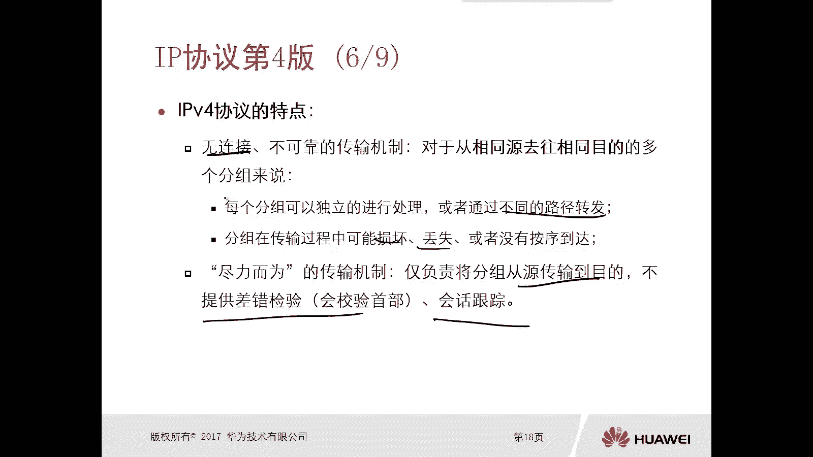

OK好那么接下来我们就看一下，在网络层对数据进行处理的时候，我们要给它加上一个IP首部啊，那么这个IP首部，它的一个数据包的封装格式是什么样的呢，你看一下啊，那么这个比较多啊，但是这里面的内容呢。

也希望大家都能搞清楚对吧，这是我们学习IPV4，它的格式的一个最基础的内容好，那么第一行里面是四个比特，是一个版本啊版本，那么这个版本呢现在呢就是版本思路对吧。

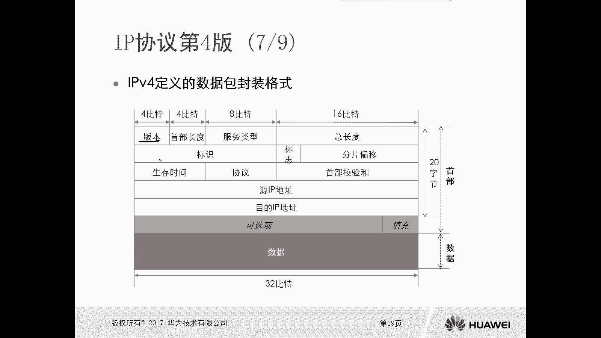

那么相对于IPV4来讲呢，它就是版本四好。

那么紧接着呢是四个比特的首部长度，就是头部长度。

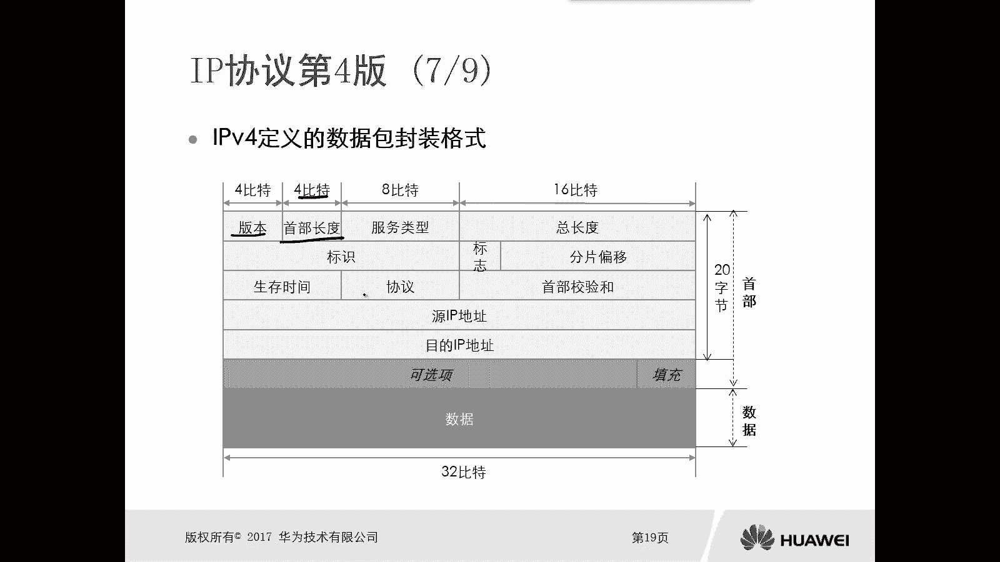

那么这个手部长度呢指的是唉，我们基本的一个IPV4的头部。

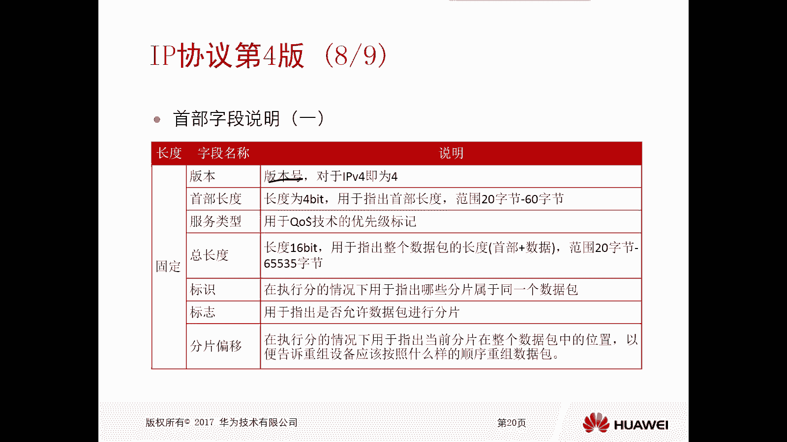

它的长度啊，手部长度好，那么紧接着是八个比特的符类型。

那么这个服务类型呢是我们在用于QS的时候，QS技术的时候要去做一个优先级的标记的啊，所以说后期可能大家在学一些更高级的课程，对吧，可能会学习到这个QS，那么在在学QS的时候，我们就会讲到这个福利性好。

那么紧接着是16个比特的总长度，那么这个总长度呢它是包含两部分，一个是整个数据包的一个啊手部啊，再加上整个数据包的一个数据，所以说它是整个数据包的一个长度，是两部分的一个手绘加数据的。

那么这个范围是20个字节到65354节，好那么注意一下啊，这个手部长度它也是有范围的啊，它是20个字节到60字节好。

那么紧接着呢是标识标志和分片啊，分片的偏移，那么这部分呢是当数据包出现分片的时候。

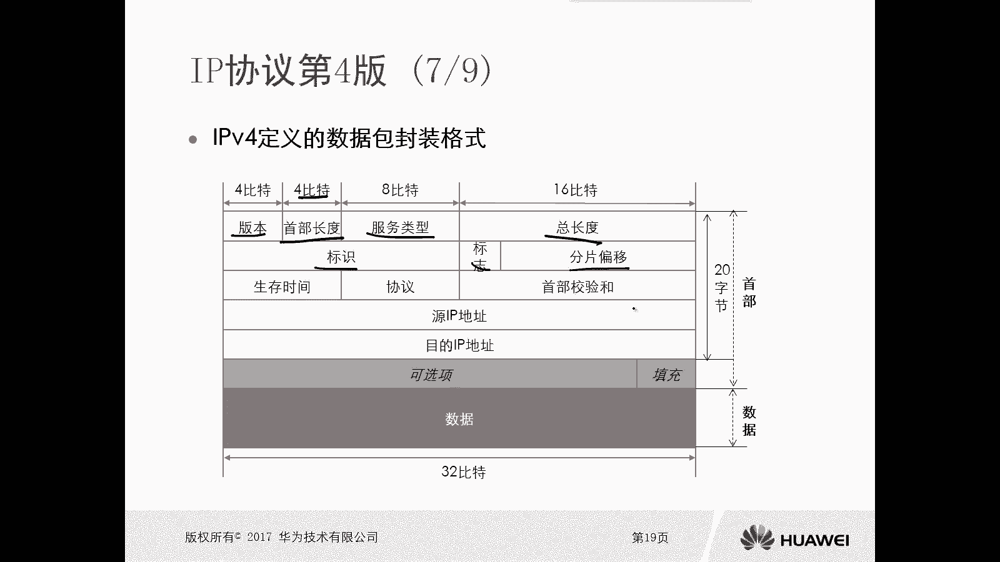

才会使用的，标识呢就是当执行分配的时候对吧，我们用于指出哪些分片属于同一个数据包，你比如说我一个数据包这么大，我分成三片对吧，哎我这第一个数据包啊，好第二个数据包也分成三片。

那么当这些数据包你传到这个终端PC，他得搞清楚这六片哪三片属于第一个，第一个数据吧，哪三片属于第二个数据吧，所以你得标识一下吧，哎比如说标识一下，这是AAA，这是BBB对吧，假设是这样的。

那这样的话我说了三遍，发现这三篇全都是A那就是第一个数据包的哎，这三篇全都是B还是第二个数据包的对吧，好标识好，接下来呢是标志，标志是标志位，那么标志位是用于指出，是否允许数据包进行分片。

啊那这里边呢我们有不分片对吧，比如说DF位就是不要分片的对吧，DF那么如果质疑了是禁止分辨的啊，如果是零的话，是允许分辨的啊，但是有些数据包在传输过程中呢，可能我不允许它分辨，我就把这个标识为之一。

那么就是DF对吧。

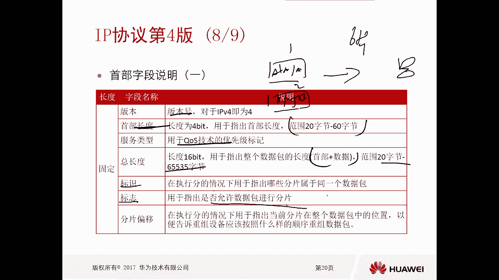

就是不要分片嗯，好那么紧接着是分片分片的一个偏移，分片的一个偏移，那么分片的偏移呢，是你允许携带的一个偏移量对吧，那么这个偏移量呢实际上也是为了，后期我们在进行数据包进行重组的时候。

他能够按照一个正确的顺序进行重组啊，这是偏移量好，那么接下来是生存时间，那么生存时间呢是，当我们数据包在传输的过程中啊，那么万一出现了环路，那么你这个数据包呢你不能永远活下去，它有生存时间，对不对好。

但是这个生存时间呢当初去设计的时候，它是按时间去设计的，但是最终我们现在唉不是按时间算，而是按条数算，或者叫做按设备的数量算，每经过一个路由器。

它就会去检验，这是生存时间啊，生存时间好，当减到零的时候，我就被丢弃了吧，数据被丢弃了。

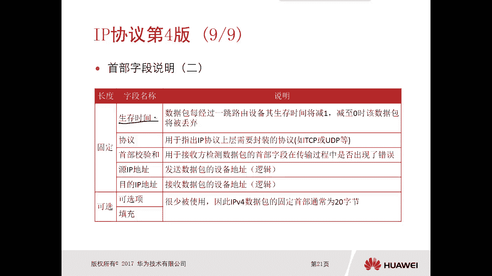

那么缺省是255好，那么紧接着呢是协议，这个协议呢指的是上层的协议啊。

上次封装的是你UDP啊，还是TCP啊，还有其他题写一呢，对不对，好好。

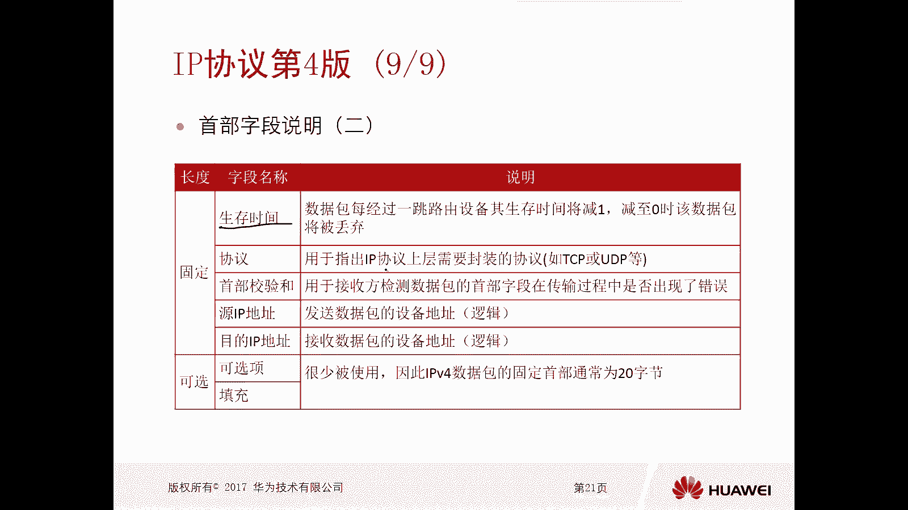

接下来是手部的一个校验和头部校验和对吧。

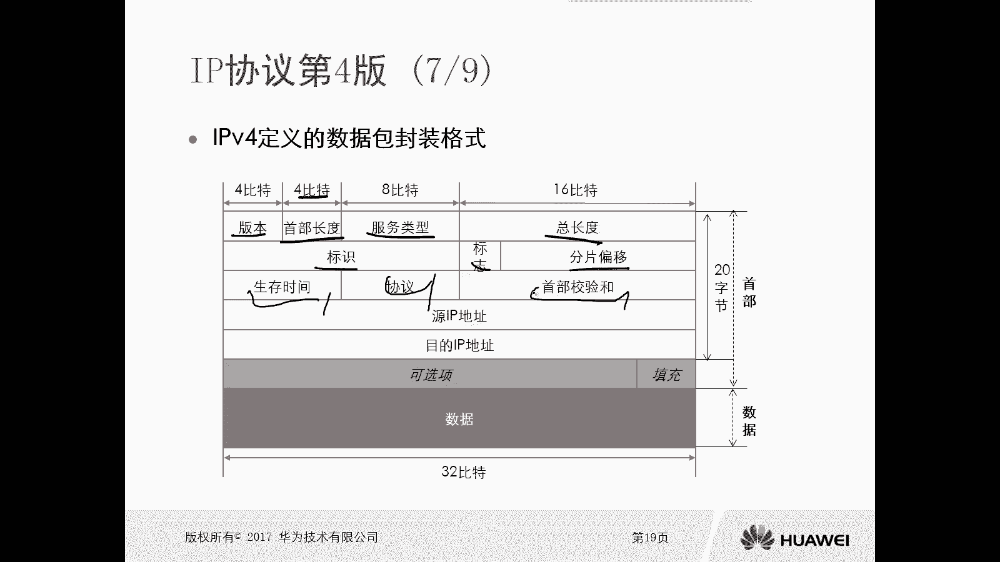

好原IP目的IP啊，我们再看一下啊，手部的线和，那么手部的校验和呢是用于计数方，你去校验这个数据包的首部字段，在传输中是否出现了一个错误，所以说你看这个IPV4啊，哎它是能够去做手部的一个校验。

但是你对整个数据去做校验吗，不需要，因为我是尽力而为传输，没必要去做整个数据校验，那么那整整个数据有没有出问题呢，那你发到这个接收方以后，接收方去加1K对吧好，那么原木IP地址很容易理解了。

原来就是我发送这个数据包的，一个设备的逻辑地址，这个指的是三层的逻辑地址不好，目的地址指的是结束数据包的地址的地址，那好那么后边是可选项和填充，这个是很少被使用到的啊，啊，那么因此呢。

这个IPV4数据包的固定守护，通常为20个字节，当它有手，当它有这个可选项有填充的时候，那么它可能会变动。

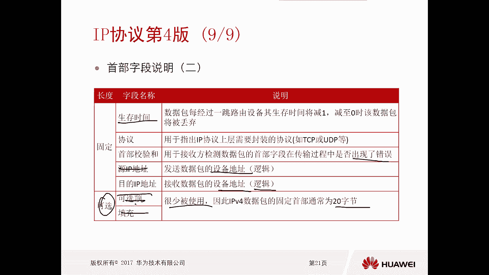

所以说这个数据包的一个首部长度。

可能是20个字节到60个字节，哎，注意一下啊，好这是IPP4的一个基本头部啊，这一部分啊是IPP4的一个基本的头部好，那么后边呢才是真正的一个数据部分啊，你到底学的是什么内容啊。

这才是你真正的数据部分啊。

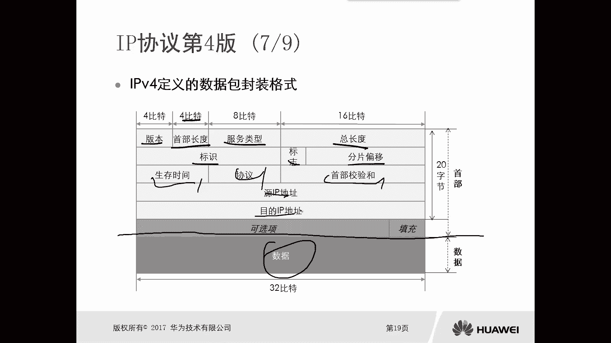

OK好。

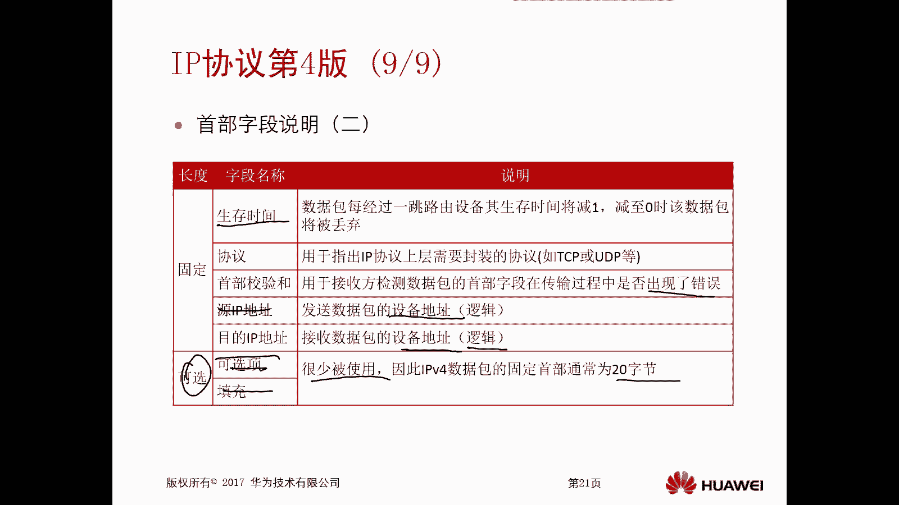