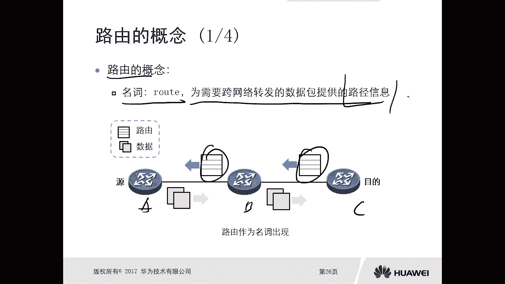
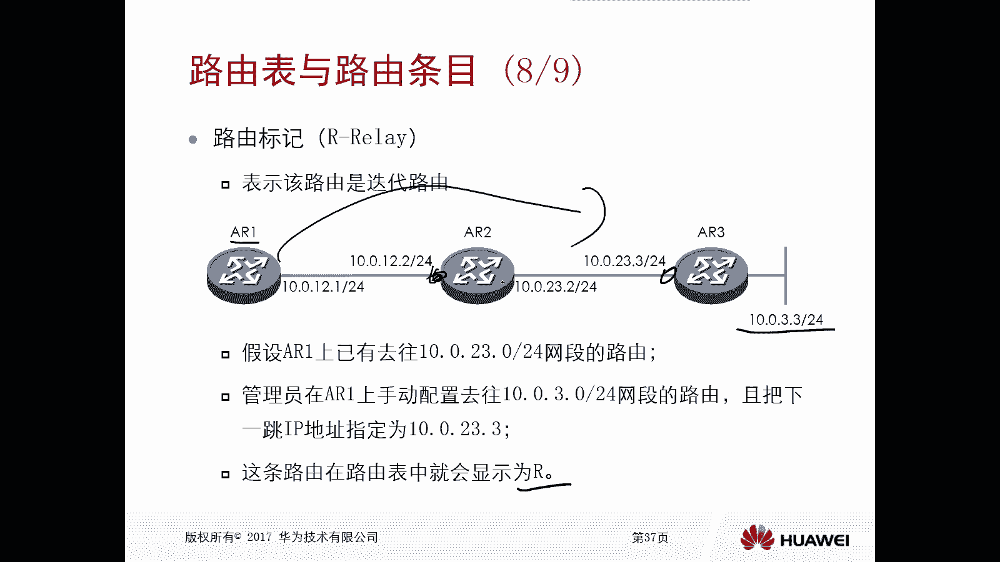

# 华为认证ICT学院HCIA／HCIP-Datacom教程【共56集】 数通 路由交换 考试 题库 - P13：第1册-第5章-3-路由的概念、路由表、路由条目 - ICT网络攻城狮 - BV1yc41147f8

好那么接下来我们看一下路由呃，仅定义这个数据包的格式啊，是不足以将这个数据包呢转发到目的地的，你看我们前面讲了对吧，有IP对吧，IP呢也定义了一个手部的一个格式对吧，有源码IP地址，但是有这些东西呢。

你你你没法把这个数据包啊，正确的转发到这个目的地是吧，你只是说把数据包给它封装了这个MIP，但是没给你转呀，或者转发是什么样的呀，没有定义对吧，所以说我们还需要去定义这个转发数据包，它的方式啊。

那么就是如何通过逻辑地址啊，我们前面讲到的这个网络层的IP地址实现寻址，或者说实现转发，那么本小节呢主要是分为三个部分，第一个呢就是路由的概念，什么叫做路由啊，第二个是路由表和路由条目啊。

第三个呢是路由器的分类好。

那么首先我们看路由的概念，路由第一概念如果作为一个名词的话，它叫做root啊，如果是名词的话，是为需要跨网络转发的数据包呢，提供的一个路径信息，就是你要去往某个目的地，你得知道怎么去往这个目的地。

就好比是比如说我开车从北京到保定，对不对，那我得知道走哪条路对吧，怎么走对吧，遇到路口以后该从A出口出去还是从B口出去，我得知道怎么走，我得有这个路径信息，我才能从北京到保定，对不对。

但是前提是你的目的地的路由信息对吧，得传到圆这边，对你比如说我们看下面那片原路由器是A吧吧，B吧，这是C吧，A不要去访问C设备，那么第一件事情呢就是C设备上的目标网段啊，就是这个路径信息啊。

你得传ab对吧，然后B再传给AA这样就知道了哦，原来选C首先要经过B哦，经过B以后再经过CO，先给BB再给C好，那么我们说C把这个路由信息给到A，这个路由就是以作为名词的一个路由概念。

说白了它就是路径信息啊。

路一好，那么这个路由路径信息。

这个路由啊，它是通过什么样的方式让C告诉给A了呢，哎就会涉及到一个叫做路由协议。

那么路由器呢，实际上就是路由器之间去分享路由信息，所需要遵循的标准，那么我们这个路由器有好多种，好多种路由器，假设啊，比如说ABC3层路由器中间啊之间啊，我们运行了某种路由器，OK那么这种情况下。

我ABC3台路由器就按照这种路由协议，它的标准啊去分享啊，他本设备的一些路径信息是吧，C会把他所有的路径信息告诉给B对吧，B呢会把他所有的路由信息呢告诉给A和C，A呢也会把他自己的路由信息呢告诉给B。

告诉C，那么相互告诉我是吧，那这样的话大家就都知道了哦，A我知道了去往B怎么走，去往C怎么走，B就知道了，去往A怎么走，去往C怎么走对吧，C就知道了，去往A去往B怎么走，对你们得先把路由分享出来。

就是你们所在的网站啊，或者你能到达的网络啊，你分享出来对吧，然后其他路由器就知道了，怎么分享，就是通过路由协议，通过路由协议去分享你的路径信息。

好那么如果说陆游作为动词来讲是routine，Routine，Routine，是依据逻辑地址对跨网络的数据包进行转发，那么这个是一个动作了，就是我怎么转发这个数据包，该转发到哪个接口。

该转发到哪一个下一套设备，你比如说我这个设备又没有标号啊，这个应该叫D吧对吧，因为中间的右侧的是ABC对吧，然后这个就D比如说D设备要去访问ABC，那么D设备可能发出来的数据呢，有的数据是访问A。

有的数据访问B，有的数据访问C，那么到达了中间这个网络，那么中间这个网络它必须要搞清楚对吧，你访问A的要从比如说一口出去对吧，要访问B的，要从这个二口出去，要访问，现在要从这个三口出去。

这样的话你才能访问正确嘛，对不对，哎那么至于中间这个网络，你怎么去对这个数据包执行的这种转发对吧，哎使用的就是这个routine路由，转发这个数据包动词。

所以说这个路由的作用呢，实际上是为路由器这种设备啊，提供去往目的地的途径的对吧，你拿个数据包对吧，被中间设备收到了，我得知道怎么去往这个目的地吧，我得有路由，有了以后呢，我就执行一个路由的动作。

哎就从那个接口出去啊，还是从那个接口出去啊，对不对好，那么路由设备你如何得到这个路由呢，这个很重要了，对不对，哎，第一种方式呢就是我们静态配置，你看我还是以刚才举例说的啊，我开车从北京到保定吧。

因为我是保定人嘛，对不对，我就以保定为例，从北京到保定对吧，那么从北京到保定，那么我第一种方式开车，然后呢我就去找我找了对吧，我先经过五环到五环呢，我进入到这个高速，到了高速以后呢，我就有指路牌了对吧。

哎还有个指路牌到保定还有多少公里，到保定有多少公里，从哪，从哪个出口出去诶，我又找到了，那么像这种指路牌，实际上是我们人工的给打上去的，对不对，它是静态的，一般情况下很很难会变，除非你说路在修。

在改动它，这个指示牌肯定就变了，一般情况下不变，这种呢就类似于我们告诉路由器设备静态配置，你去往某个目的地诶，江走不变了啊，就这样走啊，除非这个路由器挂掉以后，我再想办法去改改啊，啊平常都不改。

哎这就是静态配置，当然我还从从北京到保定，我还可以通过另外一种方式，我就不看牌子对吧，拿个手机下一个导航软件，开导航嘛对吧，导航怎么说怎么走我就怎么走，而且导航很很很智能啊，他会告诉我你走五环比较堵哦。

你别走五环，你走六环吧是吧，哎你走这个高速呢，现在比较畅通啊，这样走对吧，哎他是动态学习的，他知道这个路怎么走，哎，哪条路好走啊，这种是动态区域好，那么路由设备啊它是如何去选择路由的呢。

主要是去查看那个路由表好，那么如何去选择路由的啊，那就是我们接下来要关注的重点了。

好那么接下来呢我们就看一下这种路由设备，它的路由表和路由条目，那么路由表呢实际上就是路由条目的集合，那么什么是路由条目呢，路由条目就是记录了特定目的，IP地址与接口的表象，然后比如说我有台路由器设备。

我我可以到达多个IP网站对吧，然后我我多个IP网站呢，可能就是不同的接口对吧，比如说我这个路由表啊长成这样，路由条目一哎对应出接口A路由条目二，对应出接口A路由条目三。

对应出接口B路由条目四对应出角B不，他就是这样一条一条的组成的一个表。

就叫做路由表，那么在设备上是能够看到的啊，在看到，那么对于我们每台路由器设备啊，那么你至少要维护一张路由表，那么路由器再收到数据包以后呢，他就可以依靠或者依赖路由表里面，这个路由表信息哎。

就可以用来去转发数据包，那么有两种情况，第一种，如果说路由表中没有与数据包目的IP地址，相关的路由条，目，路由器呢只能丢弃数据包，那么大家注意下，你当我们一台路由器设备啊，他收到一个数据包。

那么收到一个数据包，这个数据包里面呢它是有源和目的IP地址的，对不对，哎因为它封装了源码IP地址了，那么这个路由器设备，它是根据你的原地址还是目的地址进行查找，这个路段呢一定是根据目的地址。

因为你数据包是要去，是要把这个数据发给这个目的地，所以说路由器是要去查找哎，你去往的目的地怎么走，如果说我发现你去往的目的地，在我路由表里面是有相关的条目的，没有相关的条目的情况下，只能丢弃数据包。

因为我不知道怎么走，因为路由器怎么走，如果说路由表中对吧，有那我就转，但是如果有多条呢，比如说我我好好好几条都只是啊，都可以去往这个目标对准这种情况下，路由器就需要根据某些规则选出最路径啊。

并且呢以此进行转发啊，注意一下啊，强调一点，如果说没有丢掉，如果说有可以转，但是如果你有多条呢，选一个最优的，那怎么选，后面慢慢看好。

那么我们看一下在华为设备上啊，我们通过display IP uting table，我们就能看到诶路由器设备上它维护的一张表，那么这个表呢就是这样的，比如说你这个路由器收到数据包。

如果数据包去往的目的地是一点一点，1。1杠32，OK那么请把这个数据包转给23。0。02，这个下调设备从G0杠零杠一口出去是吧，哎以此类推，2。2。2啊，也是这个下调对吧，然后10。0。0。0杠八对吧。

这是静态，那么你要走对吧，哎它会存在各种各样的一个表象啊，好，那么接下来我们看一下这个表象，条目里面的各个的解释啊，你看这上面都是有这个呃文字描述的嘛。

destination and magic ptical啊，对不对哎，Preference cost flags。

let's Hope interface对吧，那什么意思呢，destiny max就是你目标的网络和前缀，因为我们刚才讲了，陆游是你去往某个目的地的一个转发路径，对不对，就路径信息。

那么在网络里面是通过什么样的方式去标识路，径信息呢，就是通过destination和掩码，目标网络和掩码啊组成的前缀，对不对，好，protocol协议路由的来源和类型，因为我们前面讲了。

说这个路由呢你可以通过手工配，可以通过学习自动学习，对不对，那么实际上是利用路由协议得到的，那么路由协议呢我们有静态，我们有动态，甚至是直连啊，所以说这个呢就是标识的IE这个路由啊，是从指点学习到的呀。

还是从静态学习到的对吧，还是通过这个动态路由器学习的。

包括他类型好，在这里头呢我们可以看一下啊，你看。

好preference优先级路由写的优先级，那么这个呢是用来去选择哪一条路径是最优的，如果说你比如说你去往同一个目的地啊，他的这个网络的多条路由类型不同，那么这种情况下它会比较优先级，数值越小呢。

路由越优啊，比如说假设啊，我举个简单例子，这个PC到达某个路由器了，啊这个路由器里面呢肯定是有路由表，对不对，比如说这个PC呢要去访问，1592。168。1。1对吧好，那这种情况下，这个路由表里面呢。

它存在可能是这样的路由表啊，192。168。1。1啊，嗯杠32通过某个协议，比如说这个协议的优先级是十，比如说啊这个协议优先级是12学习到的，那么它是从G001口出去是吧，好那么还有一个表，192。

168。1点啊，就这一点哎，1。082104啊，1。0不好啊，1。13102对吧，但这个是从哪学的呢，它是从另外一个协议这个协议优先级的，比如是100，那它是从G0杠零杠一口出去，那上面是二口啊。

G0杠零杠二口啊，下面是G0杠零杠一口，在这种情况下，你想这个路由器按照我们刚才讲的啊对啊，他是从两个协议学习到的一个协议优先级是十，一个协议优先级是100对吧，那么这种情况下他会选哪一个呢。

会选十的数值越小于优先，最终PC发出来的数据包，去往191681。1对吧，哎一定是从G0杠零杠二口转出去，而不会从G0杠零杠一转出去，这就是看优先级，如果优先级都一样呢。

可开交cost cos越小越有限，比如说都是100，都是100对吧，但是上面那个开发者是下面开发值是20，选谁呢，又选上面好。

Flag，flag是路由标记，那么路由标记两个，一个是A1个是DR是RELI，DNA是download对吧，哎啊这个这个relay表示是迭代啊，这个路由是不是迭代路由，那么关于什么是迭代，我们后面再看。

D表示这个路由是成功发布到了FIB，FAB呢叫做for information base，叫做转发信息数据库，这个转发信息数据库呢，实际上是用来转发数据包的啊，好nice，top下跳吓一跳啊。

就是路由的下一跳，就是你这个数据包应该交给下一跳，路由器是谁对吧。

哎接口就是出接口，好那么刚才我们讲到了这个路由优先级对吧，那么路来源和优先级，那么优先级数值越小呢，这个路由的来源呢越可靠，但是我们管理员可以修改这个优先级值啊，直连路由是不能改的，你看我们最常见的啊。

比如说直连它优先级是零，静态是60，OSSPF是十，rap是100，哎，这几个呢需要记住哦，最优的是质量，对不对，其次呢是OSPF，然后呢是静态，然后是这个值越小越优先啊，值越小越优先好。

那么如果路由先级一样，刚才我们讲了看开销，路由开发值越小，路由先对吧，那么对于某一种动态路由器来讲啊，这个路由开销的参数是不一样的啊，所以说你想让他开销，必须要求他们的来源相同啊。

你比如说都是通过OSPF学到的，都是通过rap学到的啊，不同的路由对吧，他们之间进行选择的时候，可以看开小组，你比如说你一条路由信息就相同的路由信息啊，一条是通过rip学到的。

一条是通过OSSPF学到的，这是两种路由协议，这种情况下他看不了开销，只能看优先级，一定是当你的来源相同的时候，才会比较开智啊，你比如说我们有个协议叫做OSPF，O s p f。

它的不同接口就是接口带宽不一样，它的开销不一样的，你比如说十兆的，它的开销是十一百兆的，开发者是一，1G的开发者是一，那这样的话你通过不同接口不同，这个带宽大小不一样，这种接口啊学到的这个OSPF路由。

它的这个开销就不一样了，我就可以根据开销去选择哪条是最多的。

好那接下来我们再看一下这个路由标记啊，标记里面的余力，余力呢是表示这个路由呢它是迭代路由，那么迭代路比如说啊什么叫迭路，比如说ARE啊，要去往啊，要去往那个10。1点啊，10。0。23。0杠二四。

比如说假设AR1，现在他已经有了去往10。0。2，3。0杠24网站都有，那么管理员呢可以直接手动去配置，10。0。3。0到24网段路由，且把他的下一跳呢设置成10。0。23。3，按照正常来讲。

我们去配置路由的时候，一般啊是配置吓一跳，不指点下一跳，就是你比如说你你A21去配置10。0点，3。024，那么一般它的下跳只乘二，但是现在我指的谁呢，指的是下一个下一跳对吧，就是AR的下边三对吧。

那么这种情况下，这条路由在这个路由表里面就会显示是迭代啊，迭代迭代的目的是一定要迭代最近的路由器，迭代到A2上去对吧，因为你这是跨跨，就是跨多网段去配置的一个路由，哎这个后边呢我们再去讲静态路由的时候。

还会重点去讲的啊。

这是一个迭代好，那么我们在这个路由表里面就能看到啊，这个10。3。0啊，他的这个flag呢是一个R对不对，好那么嗯这种情况下会有还有一种情况呢，就是比如说我们在BGP的时候，也会出现这种迭代路由啊。

那么可能后期我们再去讲BP的时候，再讲这部分内容啊。

