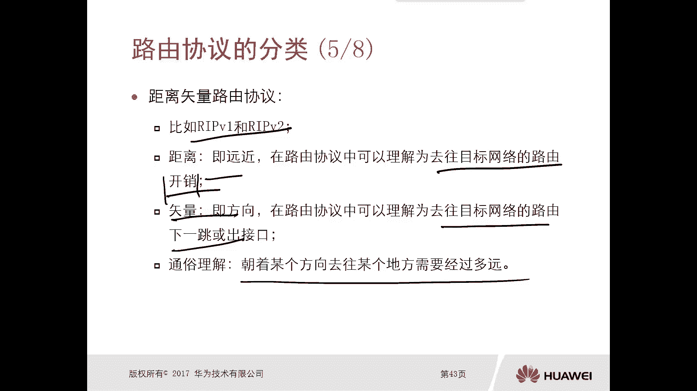

# 华为认证ICT学院HCIA／HCIP-Datacom教程【共56集】 数通 路由交换 考试 题库 - P14：第1册-第5章-4-路由协议的分类 - ICT网络攻城狮 - BV1yc41147f8

好，接下来我们看一下这个路由协议的一个分类啊，那么按照不同的分类标准，我们可以把这个路由协议啊分为多种类别啊，因为这个分类标准不一样啊，它可能属于多多种类别啊，这是很正常的。

那么每种路由协议在不同的分类标准中呢，它对应着不同的类别，一般来说啊，我们可以按照以下几个分类标准，来归类这个路由器，那么第一个呢就是是否通告了子网掩码信息，这是一个标准，第二个标准是适用的范围啊。

又分为什么样的路由器，第三个呢是路由的算法，按照这三个标准，三个标准去分类啊。

好那么首先呢我们先看第一个分类标准，就是是否通告子网掩码信息，按照这个标准分，那么我们的路由协议呢分为两大类，第一类呢叫做有类的路由协议，那么有类的路由协议它有什么样的特点呢。

特点就是去发送路由更新信息的时候，他是不携带子网掩码信息的，还有这个注意下啊，有类路由是发送更新信息的时候，是不携带子网掩码的啊，比如说我们最经典的一个路由协议叫做rap，而且是版本1rip v1啊。

IP呢叫做root的information protocol，叫做路由信息协议啊，那这个呢也是我们后边也要重点去讲的，一个协议啊，这个虽然我们可能用的不是特别多啊，这个rap v e啊。

但是具有代表性啊，那么后边有章节专门会去讲，那么另外一类呢叫做无类路由，无类路由何修，有类路由呢正好就相反了，就是发送路由更新信息的时候呢，它是携带这个子网掩码信息的啊。

那么最经典的就是我们的rap VR啊，这个VR版本和OSSPFWPF呢叫做open shortest path first，叫做开放式的最短路径优先啊，啊就是这个一个比较有代表性的路由器。

那么后面呢也会去讲，那么这两种在这个分类标准里面呢，我们可以看到既有rap，又有OSSPF，对不对，但是可能我们在参考其他的分类标准的时候，就不一样了，好那么接下来我们再看第二个分类标准。

通过适用范围去分的话，也分为两大类，意大利呢叫做内部网关路由协议，那么这个呢叫做IEP啊，叫做IGP内部网关路线好，那么内部网关路由协议它有什么特点呢，特点是在一个as内部去传递的路由。

而这种协议就是IDP啊，你比如说我们的GPV1，GPV2和OSPF全都是内部网关路由器，叫做IGP，那么另外一种叫做外部网关路由器叫EGP哎，就是一级P，那么它的特点是在as之间去传递的路由好。

那么我们最早我们最经常用的就是BGP，BGP呢，边界网关协议啊，边界网关路西好。

这是第二个分类标准分的澳大利亚，接下来我们看第三个分类标准，是通过路由算法分的，那么路由算法呢也是分为两类，一类叫做距离矢量路由器，那么距离矢量路由器它的特点是什么呢，是没有全网的拓扑信息的。

人家路由器是没有全网拓扑信息，只能依靠邻居的传闻去计算路由，那么交互的豹纹呢就是路由条目，那么这个呢我们再去讲实际，去讲rap v1和V2的时候呢，专门会去讲诶，传闻对吧，什么是拓扑信息啊。

在这呢只是一个大概的介绍啊，那么至于谁呀，rap v1边，那么另外一种呢叫做链路状态，它和距离矢量作用相反，它是拥有全网的拓扑信息的，那么依靠自身的一个计算，路由交互的报文通常是数据库。

他和这个距离矢量正好相反，你看距离矢量它是依靠邻居的传闻，对邻居告诉我，你怎么走多少，跳那么多了远，那他就完全相信，因为他不清楚啊，那么对于链路状态呢，我是有拓扑信息的，你不用告诉我，你告诉我也不信啊。

对不对，我自己去记手啊，哎那么代表的就是OSPF啊，当然了，我们后边还有一个协议叫做SS，这个SS叫做中间系统到中间系统啊，这个协议这个协议呢它也是链路状态路行，哎好这是我们通过三个分类标准分出来的好。

那么接下来呢我们就具体看一下，距离矢量路由器，什么是距离矢量路由器，刚才我们讲了距离矢量路由器代表的就是rip，V1和V2rap这个C好，那么什么是距离矢量呢，距离说白了就是远近，我们在路由器里面呢。

你可以理解就是哎，我去往目标网络的路由的开销，那么什么叫做出去往目标网络的路由的开销呢，前面我们讲过对吧，你一台路由器通过多条路径，可以去往某个目标网络的时候，我要进行一个优选对吧，还可以优选路由先级。

如果路由先级一样可选开销对吧，你开销大，那我就不选啊，开销小我就选小的呀对吧，那你想啊，你去这个去天安门对吧，你肯定是走近道啊，你不走远道吧，对不对，哎这就是距离，那么矢量矢量就是方向。

那么在路由协议里面呢，我们可以理解啊，是去往目标网络的路由的下一跳，或者一个出接口，要么是这个下一跳，要么是这个出接口对，不会是另外一下跳另外一个出接口，哎它是距离神通俗的理解，一句话。

朝着某个方向去往某个地方需要经过多远对吧，哎这就是距离矢量啊，距离适量，在某些考试过程中啊，这个就会被考官问到距离矢量的解释好。

那么接下来呢我们来看一下链路状态流行哎，比如说OSSPF对吧，比较经典，当然还有一个叫做S对吧好，那么什么是链路呢，链路及接口对吧，但是这里面包括邻居关系，邻居关系啊对吧，网络类型啊，开销等等信息。

那么什么是状态呢，状态就是描述网中连接的一个状态，通俗来讲内容状态就是关于接口的连接关系啊，网络类型啊，开销等等信息的一些描述，哎这就是链路状态。

好那么对于距离矢量路由协议，它的工作原理是什么呢，按工作原理比较简单，因为我传送的是路由啊，所以说我路由器朝着邻居路由器直接是传送，直接是通告路由条目信息，那就是通告的路由对吧。

那比如说这三台路由器设为，假设这是A这是B这是C，那么A直接通告给A就是路由条目，那么B由于他们是距离矢量，那么B呢是不加思索直接放到路由表里面，只要满足条件啊，那么至于这个路由信息是不是可靠对吧。

是不是可靠的，是不是准确的，那么B呢是不清楚的，他只信A给的也给我是什么，我就给什么，B收了以后他再传给C对吧，就好比是啊，你比如说我要去天安门喽，然后在路上呢我去打听对吧，唉这个天安门怎么走啊。

在一个路口问到了，问到一个保洁的，对不对，一个大叔大叔说从这条路走5km哎，那你就相信了，你就从这条路走了就5km，但是具体是不是从这条这条路去往天安门呢，具体是不是5km呢，你也不清楚。

你只能是听着大叔的，对不对，你就往下走，哎，这就是距离矢量它的一个效果，IKCC后面有路由器。

还是再往后往后给个链路状态就不一样了，链路状态呢比如说真路由器还是ABC吧对吧，我们标一个号啊，A b c，那么A他传给B的不再是路由了，而是链路的状态的数据，I通话BB呢拿到这个链路状态数据以后呢。

他自己去做计算，计算完了以后呢，他再把链路状态数据呢通告给cc呢，也要学习算，这种情况下，他们之间传送的可不是仅仅只是陆游啊，所以说还是按照我刚才举的这个例子，比如说还是我们去天安门了。

走到一个路口又碰到这位大叔了，对不对，然后问怎么去往天安门，大叔啪就给你拿出个地图给地图，你看对吧，从这走吧，这个地图给你了啊，然后你自己去找吧，我还忙，我先走了，大叔就走了对吧，唉那这种情况下。

你拿到地图以后，你是不是有了这个拓扑数据库了，相当于对吧，我就可以自己去判断哦，确实从这条路过去是5km或者10km，到现在对吧，你还需要听别人告诉你们不需要了，我自己去计算出来的，对不对。

哎这就有一点点类似于这个呃列入状态哎，它的一个效果了啊，是不需要啊，这种呢叫做传信路由对吧，前面我们讲的距离使呢，就是传说的路由叫做传言的，对不对，他怎么说你就怎么听，但这种状态不是他传的是拓扑信息。

传的是状态数据看好，这就是我们路由协议的分类，哎那么简单介绍了通过几个维度，应该是分类的标准，三个分类对啊，我们又解释了什么是距离死亡的游戏，什么是链路状态路西哎，这个很重要。

后面呢我们还会专门的去讲距离。

