# 华为认证ICT学院HCIA／HCIP-Datacom教程【共56集】 数通 路由交换 考试 题库 - P15：第1册-第5章-5-路由器的工作原理 - ICT网络攻城狮 - BV1yc41147f8

好，那么接下来呢，我们看一下这个路由器的工作原理啊，那么这张呢也是相对来讲比较重要的啊，那么对于路由器，它是依赖于这个IP路由表来转发数据包的，那么前面呢实际上我们也讲过路由对吧，我们说一台路由器呢。

至少都得有一张路由表对吧，那么什么是路由表，我们前面已经介绍过了，就是一大堆路由条目啊，那么通过这个路由表干嘛用，就是用来去转发数据包，对不对，所以说路由器的一个基本原理就是，它必须要依赖于IP中的好。

那么数据包在转发过程中，它有什么样的特点呢，那么数据包在三层的信息，就是数据包在转化过程中啊，这个三层信息呢是不会发生变化的啊，因为你这个数据包你从一个圆发送到目的。

那么中间你不管是经历多少台路由器设备，它的原木的IP地址都不会变的，那么对于这个IP地址，我们前面讲过了，他是这个三层信息对吧，因为我们IP呢要实现的是端到端的通信对吧。

所以这个IP地址呢他肯定是不能发生变化的，但是对于这个二层信息呢，它是会发生变化的，而且是逐跳发生变化，就是路由器和路由器之间他们发送数据啊，你比如说啊路由器A把搜的数据包以后，他又转发给路由器。

BB呢要转发给路由器C，那么A和B他们之间，就是A把数据包转给B的时候，他们之间抓包啊，你发现那个包它的原木IP地址呢是谁呢，原Mac地址啊，不是原木IP啊，是原木麦克啊，原木Mac，那么原是谁呢。

原是A的一个出接口的Mac地址，目的Mac地址呢是B的入接口的一个Mac地址，就是吓一跳的Mac地址，但是到了B以后，B再把数据包再转交给C的时候啊，那么这种情况下。

它的原Mac又变成B的一个出接口Mac地址啊，目的Mac呢又变成C的一个接口的Mac地址，所以说这个数据包的二层信息呢，它是逐条发生变化的啊，因为我们后面会讲，每台路由器收到数据包以后呢。

他都会去解封装，先把二层信息给剥掉啊，那么为什么要剥掉呢，因为他要看IP啊，因为你IP是三层的，你不播二层怎么看IP啊，为什么要看IP啊，看IP去转发数据包，对不对，所以说数据包在转化过程中。

他特别是三层信息不同方向变化。

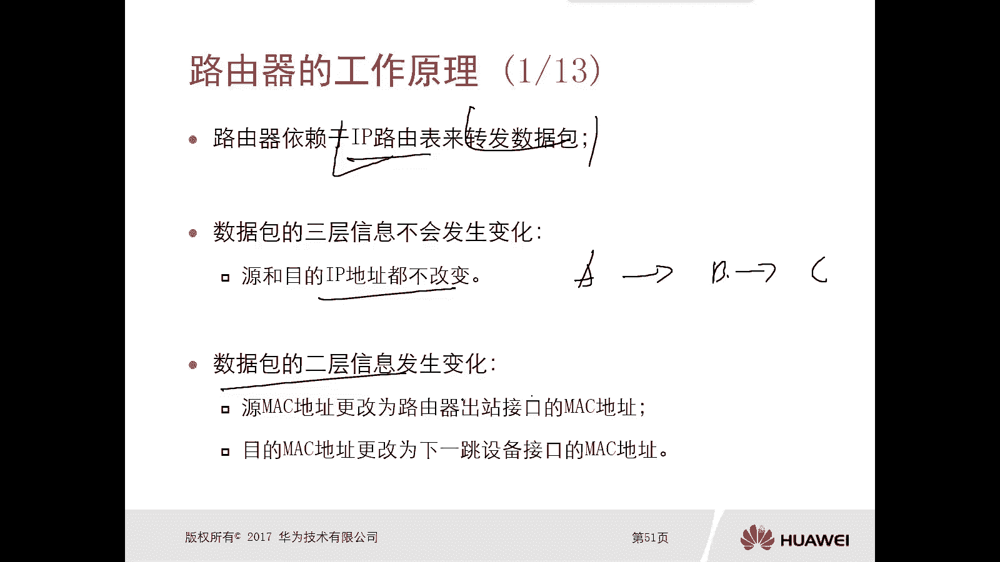

但是二层信息呢它是除跳发生变化的好，那么接下来呢我们看一下路由器的一个，详细的工作原理图，当一台路由器收到一个数据包，首先他要去解封装数据链路层，那么数据链路层呢我们说是二层，他要把二层给几分了。

那么目的呢是要查看网络层的地址，查看网络层地址目的是什么呢，去转发数据包对吧，他得看到你想去往哪一个目标网络，然后呢再去查找它自身的一个路由表对吧，找到出水口，找到吓一跳，进行转换。

那么查看完了这个网络层地址以后呢，他就可以去查找这个路由表，确认啊，路由器是否存在匹配的路由，如果有，那么去检查这个路由的下一跳是否为直连，如果是直连的话，那么重新封装数据论层啊。

并从该路由关联的出气口，因为我们的路由呢它都是有出接口的，你甭管是直连路由还是非直连路由啊，它都是有出接口哎，从这个出口呢把这个数据包转发出去，那么如果说你检查的这个路由的下一跳，不是直连的。

不是直连的，那么这种情况下哎，他会将该路由的下一跳作为目的地址，做一个路由的递归DJV查询，对吧好，那么在反倒再去查找下一跳的路表是吧，哎这样递归啊，就一次一次递归啊。

最终肯定把这个数据包啊从某个接口转出去，哎就是这样的一个流程，但是如果说你收到的数据包，你收到的数据包，查找路由表的时候，发现没有匹配到的路由，如果说没有匹配到路由。

那么这种情况下他还要去看有没有默认路由，或者叫做缺省路由756，如果连缺省路由默认路由都没有的话，那么这种情况下只有一种结果，就是把那个数据包给丢掉，说白了，就是我路由器根本就不知道。

你这个数据包怎么去往目的地，我没法给你转读起来，如果说存在缺省路由，那么就去查查找这个缺省路由，它对应的一个出接口。

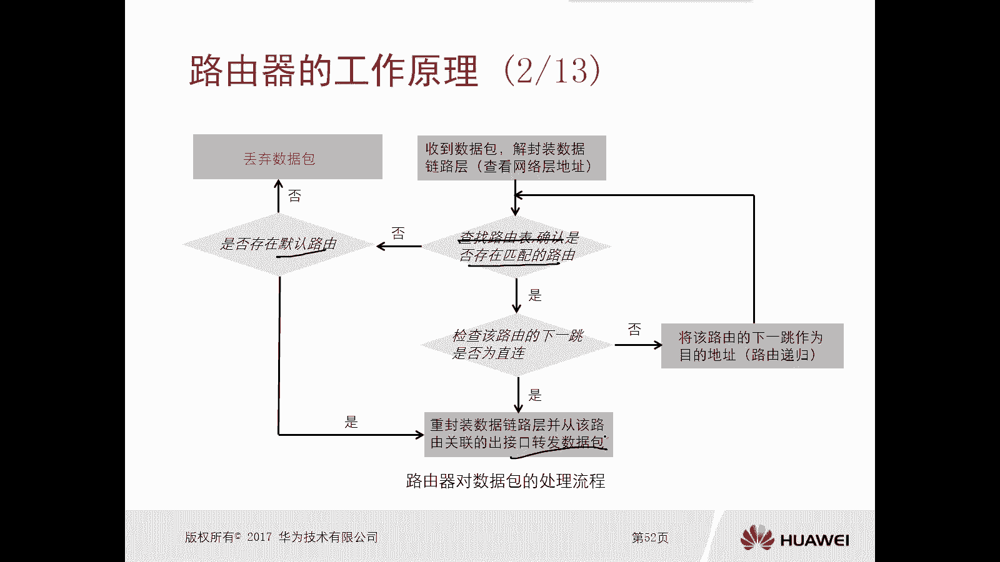

好，那么对于这个路由器转发数据包，的一个操作步骤，大体呢是三个步骤，第一个步骤呢是解封装数据链路层，那么查看网络层已确定目的地址，我要查路由，第二个呢是将目的地址和各路由条目，进行与的运算，有的运算。

那么得到一个结果，再将匹配到的路由所关联接口作为转换接口，这是路由器转发数据包的时候，它的一个操作过程，大家注意只是转发数据包的时候，他的操作过程啊。

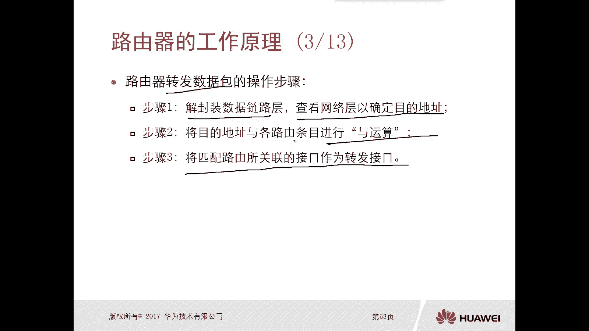

好那么我们接下来就详细的去看这三个步骤，第一步骤啊，比如说啊假设啊我们现在这个数据链路层啊，它是以太网，那么网络层是IPP4啊，比如说这个路由器A对吧，比如说他收到一个数据包。

那么路由器收到一个数据包呢，它一定是一个完整的封装的，真对吧，这里面有数据啊，什么有TCP的首付啊，有IPV4的首付啊，还有这个以太一个首付对吧，那分别是什么应用层，传输层，网络层啊对吧。

然后是我们的数据链路层，都是这样的一个完整的封装的数据，那么他收到以后，首先他要播出数据链路层的首部，他为什么要播出，因为他要去查找IPV4守护里面的IP地址，因为我只有知道这个数据包里面的。

IPV4守护里面的IP地址了，我才能够判断这个数据包从哪个接口转发出去，那么播出以后呢，实际上他就看到了IPV4的首播了对吧，哎就看到了IPV4首部，那么最主要的是查看网络层。

首部里面的一个叫做source address和destination address啊，那么对于我们路由器缺省情况下，他转发数据包的时候，最主要的是看哪一个地址呢，destination目的地址。

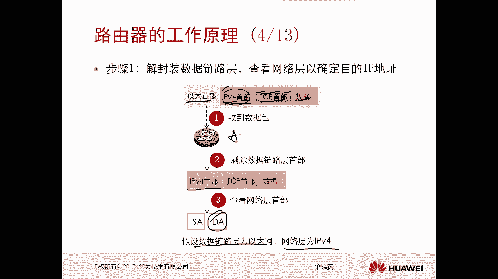

那么目的地址，那么回顾一下，我们前面讲过IP的一个报文格式对吧，在这个位置啊，这个文字。

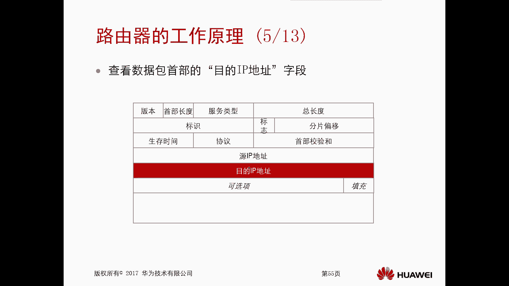

那么找到这个目的IP地址以后，那么他要将这个地址和路由表里面的，各个路由条目进行雨的运算，而雨的运算啊，有的运算好，那么假设啊，假设这个目的地址呢是198。48。10。2，这样一个地址。

就是你去往的目的地，还是19848。10。2对吧，比如说它有一条路由路由，那是198480。0这样的路由，那么这种情况下呢，他又将这个地址和这条路由进行一个雨的运算，与的运算，结果是这样的一个结果。

那么什么是雨的运算呢，很简单，雨的运算呢是将对吧，这地址和路由它的二进制数主谓的一一比较啊，只要对应的两个数中任何一位是零，那么运算结果都是零，除非说你两个位都是一，运算结果是一，哎你比如说啊。

你看我上面这个是零一吧，这个也是零幺对吧，假设这是这个IP地址的比特币零幺，那么假设这个呢是我们这个路由的零幺啊，进行相比啊，你看把这个地址啊从从那个呃，把这个地址啊通过二进制的方式表示出来。

把这个路由呢也通过二进制的方式表示出来，然后呢就上下进行语的操作，上海监狱里的操作，如果两个位都是零的话，得到的还是零对吧，如果一个是零，一个是一呢，得到还是零哈哈，零一还是零。

只有是两个都是一的时候才是一，所以我们可以看一下啊，1111就应幺幺，0000000111111是吧，然后00000111111是吧，后面000000，然后这边是一边是零，最终得到的还是0100。

所以说最终我们可以看到与运算的结果，是这样的结果，哎，这个结果呢你就可以通过十进制方。

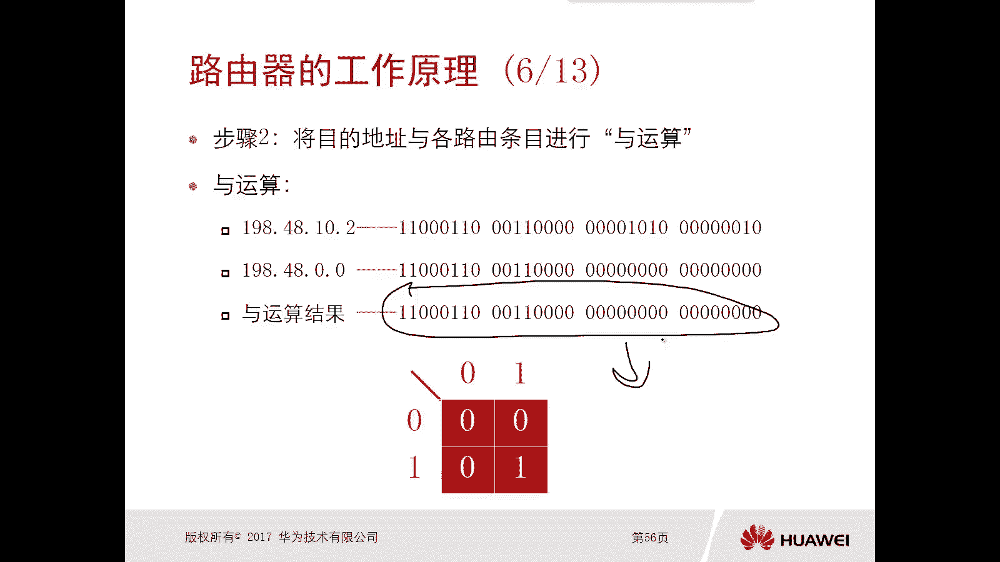

十进制的方式呢，哎再去写出来，哎，写出来啊，好那么这呢看啊有一个具体的例子啊，比如说我们的目的IP地址，刚才讲的是198。48。10。2，但是我们路由器里面呢有两条路由条目，分别是198等于48。0。

0，杠16和198。48。10。024，那么将这样一个地址和这两条路由，分别去做与的运算，得到的结果分别是1984，8。0。0和198。48。10。0，好那么这样预算完了以后，我们得到19198480。

0，和19848。10。0，那么说明你去访问这个19848。10。2，这个地址的时候，那么这两条路由呢是分别都匹配住了，就这说白了，就是这两条路由都可以用来，指导你去转发这个数据包。

啊但是这两条路都可以用来转发这个数据包，我到底是使用哪条路由去转呢，哎所以这种情况下，还有一个选择精确匹配的路径，你得选择一下吧，对吧好，那么他选择的这个角度呢就是精确的。

比如说我们这儿有一个邮寄地址类比啊，你比如说我们这个地址中国啊，中国北京要比中国更精确对吧，中国北京海淀区要比中国北京更精确，中国北京海淀区，长安街要比中国北京海淀区要精确。

中国北京海淀区长安街一号1014，这是最精确的。

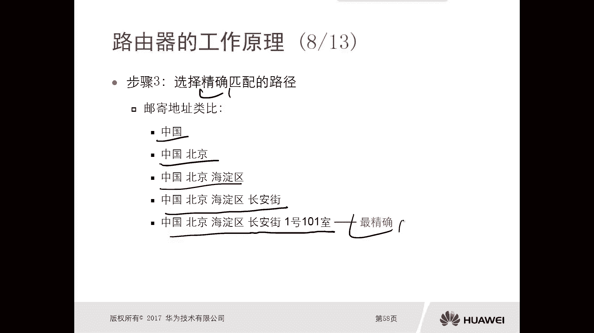

对不对，就进去了，哎那么对于在这个路由层面上，我们怎么去选最正确的啊，它有一个叫做最长匹配原则，最长匹配原则就是通过两元组实现的，一个是IP地址，一个是子网掩码，那么在IP地址相同的前提下。

才会比较子网掩码的长度，那么子网掩码有长有短对吧，如果说你子网掩码里面的一越多，说明你的子网掩码越长，那么子网掩码越长，你这个路由优先级越高，那么说白了就是最精确，这个路由均速精确，注意一下。

我们前面去讲路由，路由这个路由介绍的时候，我们讲了，当你通过多个协议学习到不相同的路由的时候，你怎么去选呢，选一个叫做路由优先级，但是注意一下，大家注意一下，注意一下啊，第一个原则一定是最常匹配。

只有在野马一样的情况下才会使用路由优先级，重点强调一下啊，第一个大的原则，路由器选择原则一定是最长匹配，当你们的掩码，比如说两条路由的掩码一致的情况下，才会选择什么路由三级啊，开小指哎，注意下啊。

这是最大的一个最大的，这个应该是路由选择里面，最大最优先的一个原则，最长匹配二次上学啊。

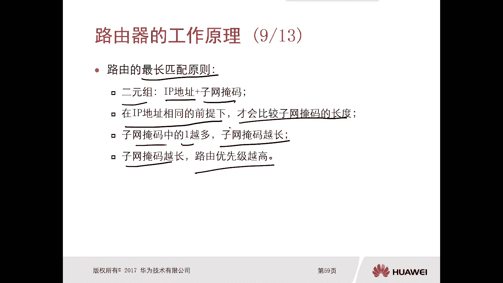

这个注意下好，那么掩码长度，我们这边可以看一下这个事例对吧，那么我们有杠八的，有杠16的，有杠24的，有杠32的，你杠八就是八个比特全都是腰对吧，杠十六十六比特杠24，24个比特杠三十二三十比特对吧。

那你就类比吗，那16的要比八的U，24的要比16的U，32的要比24的优，所以说你这个位数越大的掩码，它的路由是越优的对吧。

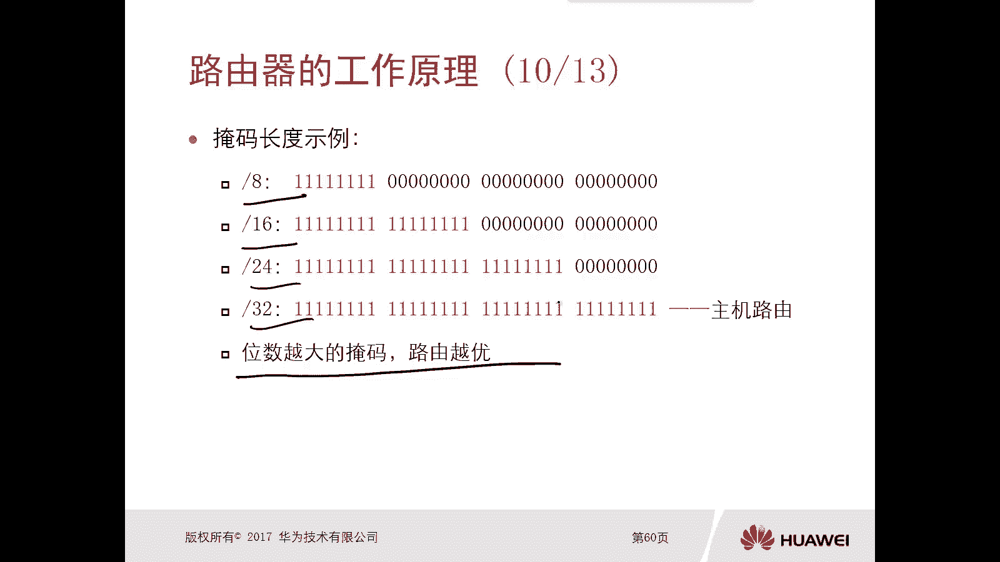

哎那比如说我们举个例子吧，这有个最长匹配匹配原则的实例啊，哎这个拓扑大家可以看一下对吧，那么中间这个路由器A它是连接了三个la啊，三个L啊，那么分别是2021688。0杠二四，19848。10点。

零杠二四是19848。0。0杠16，假设在我，我我把这个标识一下，line1这边是line2，这边是line3，比如说line1里边有个PC要去访问，192。48。10。2这个主机好，那么这种情况下。

我们看这个路由器哎，是会把这个数据包从G0杠零杠二口转发出去，还是把这个数据包从G0杠零杠零口转发出去，那么首先我们看一下这个路由表，应该是什么样的图表。

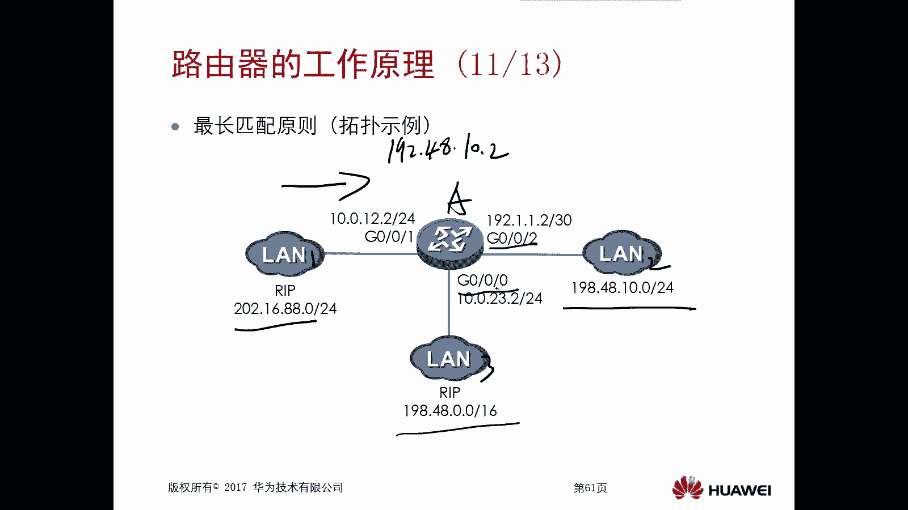

图表在路由器里边，你看到的是198。48。0。0杠16，它的下一跳是10。0。23。3，出气口是G0杠零杠零。

我们可以看一下，在这个路由器A上面啊，你看到的虚网19848。0。0，它的出气口一定是G0杠零杠零对吧，下一跳是10。0。23点的一个地址。

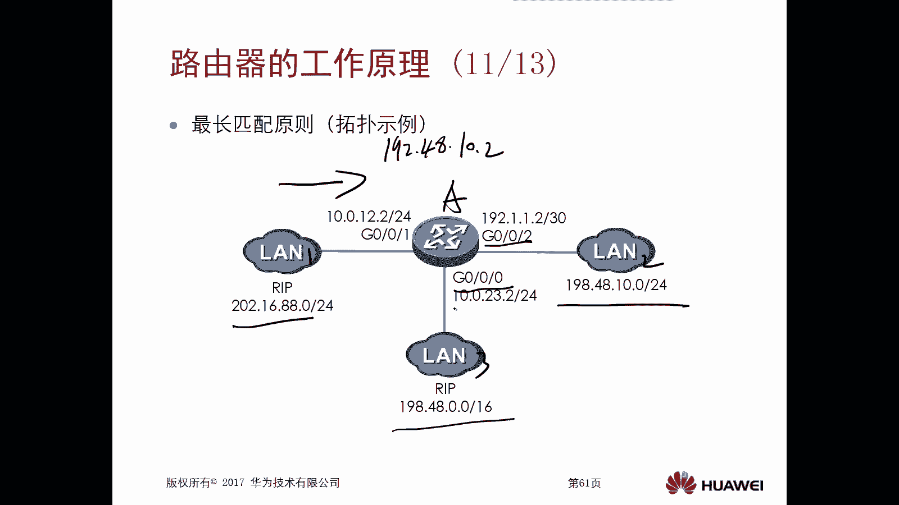

对不对，23。3好，那么另外一个是198。4，8。10。0杠24对吧，它的下1911。1。1G0202，而且这两条路由它的来源不一样，一个是rap，一个是静态，对吧，那么另外也是rap，那么这种情况下。

路由器收到这个数据包以后，首先我们说他做了雨的操作，发现这两条路由都可以去用来转发这个水泡，但是到底选哪一个呢，接下来他就要去比较二元组IP地址和掩码了，对吧，IP地址和掩码。

好那么最终你看他比较的是哪一个呢，肯定是亚马长的，就是24，对不对，减24好，注意一下，那么两元组IP地址和子网掩码相同的时候，才会比较这个路由的来源，所以在这儿你的亚麻不同，这个来源是不看的。

比如说这边也是24对吧，这个10。24，这边10。24，这种情况下才会去看这个来源，所以接下来我们看一下这个路由器啊，它是如何通过一个完整的那个操作流程啊。

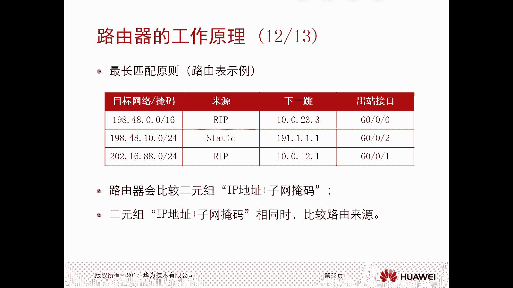

把这个数据包呢把它转换下去了，哎我们看一个动图啊，好比如说嗯现在呢我们这个路由器对吧，它有三个接口对吧，那么这种情况下他收到数据包以后，首先要确认他的一个目的地址啊，那么经过几封装以后。

他发现你的目的地是198。48。10。2好，然后呢，他利用这个地址和现有的路由表进行予以操作，与操作，得到的结果呢是匹配了48。00。0对吧，16和18。10。0。0杠14。

同时呢再做一个最长匹配原则的查找，对不对，哎那么最终呢最终是从哪个接口转发出去的呢，是从G0杠零杠二转发出去，来把这个数据包转发出去，啊所以说呢我们看这个最长匹配的结果就是，1984804点。

零杠二四对吧，转换接口是G002哎，那么这样的话，对于这个G0021口叫做技术接口。

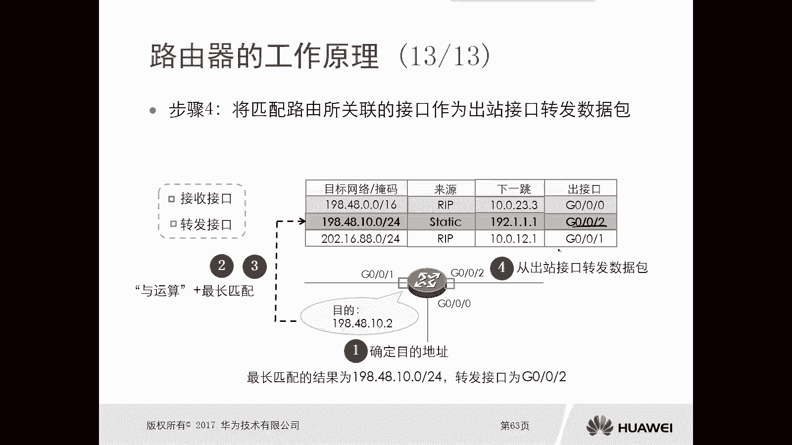