# 华为认证ICT学院HCIA／HCIP-Datacom教程【共56集】 数通 路由交换 考试 题库 - P16：第1册-第5章-6-路由器的基本配置 - ICT网络攻城狮 - BV1yc41147f8

好，那么上一节呢，我们是讲这个路由器的一个工作原理是吧，接下来呢我们看一下这个路由器的基本配置啊，嗯那么本小节呢，主要是通过这个静态路由的演示啊，那么我们学路由的时候，第一个学到的就是静态路由啊。

那么我们通过静态路由的方式啊，去演示路由对于这个数据转发的一个重要性，那么前面我们讲了说路由器呢，它必须有一个路由表对吧，必须有一张路由表，那么用这个路由表呢，用来对这个数据包进行转发。

一会通过静态路由的方式去展示一下，如果没有路由数据包，能不能正常上，那么我们的实验目的呢很简单，我们可以看一下这个实验拓扑，实验拓扑呢就是三台路由器啊，那么相互连到一块，那么一和二之间呢。

是通过G0杠零杠零口和G0杠零杠零口对吧，然后二和三呢是都是通过G0杠一口相连，那么同时呢这里面是有IP地址的规划的，OK那么IP地址呢后面我们也会去讲啊对吧，那么一和二之间呢是10。0。1。1，24。

10。0。1，2。2，24，二和三呢是10。0。23。2，10。0。23。3，那么简单说一句啊，这个IP地址我不应该叫做简单说一句啊，应该叫做回顾一下我们前面讲过这个IP地址，它是一个逻辑地址对吧。

那么它是在这个网络层进行寻址的，那么当时我们去讲这个分层的时候，讲这个网络层我们讲到了对吧，你要去进行通信的话，你得有一个目的地对吧，那好比就是你在写信嘛，对不对，那写信你得有个目的地对吧。

那你写信的话，也得有一个这个叫做写信人的地址，对不对，那就是发件人的地址对吧，那对于我们这个网络来讲呢，也是一样的，你去通信的时候，你得有原IP地址和目的IP地址，对不对。

所以说我们在网络上运行的设备啊，那么它的接口都要去配置IP地址的啊，只要你想经过网络进行通信，都要去配的，所以说你看啊这个一和二之间都配了地址对吧，二和三之间也配了地址。

那么我们的实验目的是想让R1的G0杠零口，能够和AR3的G02001口能够互通啊，说白了就是哎让A二一十。0。1。10，2。1和223的10。0。23。3，去做一个通信，哎这是我们的实验目的好。

那么接下来我们先看一下这个基本配置，第一个呢是我们要将这个华为的路由器，去配置一个名称，就是设备名称呃，这个前面也讲到过的，我们讲这个VIP的基本操作的时候也讲到过，对不对。

因为那有可能我们设备有好多个，那么你得配个名字去区分一下是吧，有利于你远程管理嘛，OK那么配置的方式呢，首先是我们要进入到这个系统视图，那么是通过system menu是吧，好那么具体的一个显示呢。

我们可以看啊，那么一进入这个华为设备呢，好，那么第二步呢就是我们去配置这个设备名称了，sim name后面呢就是我们要配置的设备名字啊，比如说我们下面那个显示的是system name a r e。

那么这样的话你看它初始啊全都叫做华为，那么当我们通过sm name a r e以后呢，它就变成ARE了，对吧啊，这是这个配置设备名称，接下来是给这个设备的配置接口的IP地址。

那么首先呢我们要通过interface这个命令，然后加上接口类型，接口的编号进入到接口视图，那么比如说我们这个例子对吧，在ARE上通过interface g0杠零杠零对吧。

然后呢进入到这个AR1的G0杠零杠零口，那么第二步呢是配置IP地址，那么IP地址是通过IP address这样一个命令，那么后面的是IP地址以及网掩码，那么根据我们的拓扑呢。

比如说这个AREG0杠零杠零接口对吧，它的地址是IP address，中间是有空格的，对不对，然后10。0。12。1R空格，R52525。0，所以说我们要按照刚才那种最基本的配置啊。

将A21A2和A3呢都要配置它的设备名称，接口IP地址啊，我们按照拓扑去配置，包括AR2它的名称和接口地址好，那么配完了以后呢，我们要测试一下哎，这个路由器它们之间的一个连通性啊。

你比如说这里边的是测试R1和A2之间的，那么他俩是成功的对吧，你看在这个AR2上直接去通过一个命令，叫做拼啊拼，那这个拼到后边呢，我们会有专门的章章节去讲啊，那么暂时呢我们先理解。

这就是一个测试的命令啊，测试如果说你要想和某个地址去通信的话，那么你测试的测试有能不能通信对吧，就是你去测试的时候能不能通信，那么这种情况下，我们可以通过拼命令加上你的目的的IP地址，进行测试啊。

那比如说我现在在A2上，我要去测试10。0。1。12点一对吧，这个地址是A二一个接口地址，对不对，如果说出现了以下显示啊，说reply from10。0。12。1，后面什么字节数啊。

rs number啊，TTL啊，time嘛，对不对，如果出现这样的显示，说明本台路由器A2和10。0。12。1，这个地址是能够互通的对吧，这是一和二之间的一个连通性，那么二和三呢我们可以看在二上去平。

10。0。2，3。3也是能够互通的对吧，一和二能互通，二和三是能够互通的好，那么讲到这儿呢，我们这样啊，我们先把这个esp的一个模拟器，把这个top我们先打开啊，这把top打开。

然后呢我们按照刚才这个步骤简单做一个操作，演示一下好。

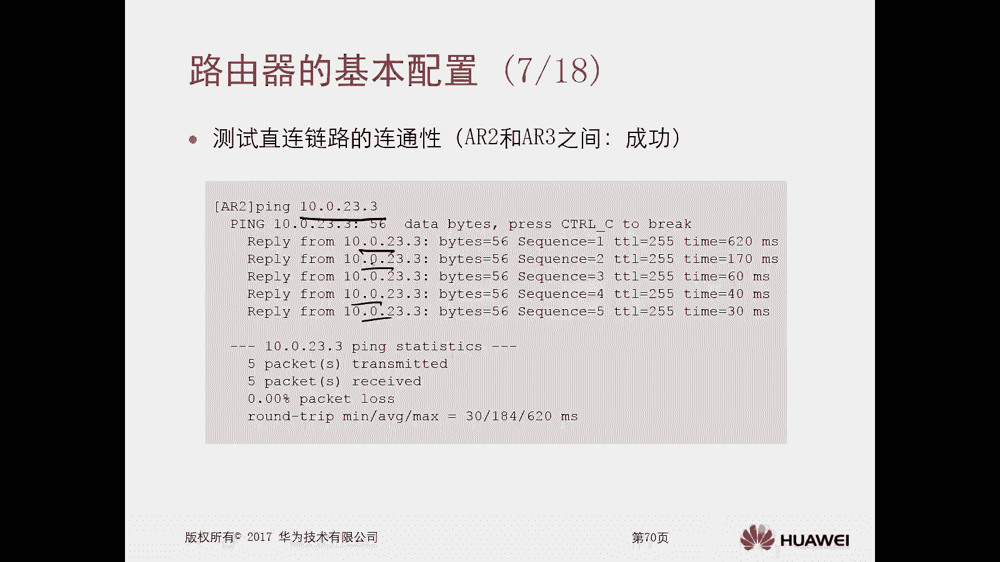

那么首先呢我们对这个路由器啊，先做一个基本的配置啊，我先点开这个LRE好，那么点开以后呢，我们把这个设备呢给他这个框啊，给它压扁一点，拉长一点好，那么我们可以看一下啊。

就是确实当我们华为的这个设备运用起来，那么呢你进入到配置命令页面以后呢，它是这个尖括号啊，他是这种尖括号尖括号，那么这个呢就是用户视图，用户视图，那么这个模拟器和真机呢有一点点不同，那么真实设备呢。

那么有些设备你进入到这个配置命令，配置这个页面以后啊，它首先要提示，让你去设置设备的一个登录的密码啊，就是console密码啊，那么当我们设置了密码以后呢，进入到一个状态。

和现在我们看到的这个模拟器的这个页面，是一模一样的啊，就这点区别啊，那现在模拟器呢是没有这个设置密码这个步骤，啊啊好，那么现在进入到这个用户视图以后呢，首先我们在这个AI上。

通过这个system mu进入到了一个系统视图，那么大家注意一下哎，这个system应用呢你可以去敲一个SY啊，那么table这就补全了，谁都能用嗯，好那么第一个呢我们首先要去配置一个sc name。

那么CD name呢我也可以通过sy table股权，那么大写的AR1对吧，这样的话你看我们这个设备的名称呢，从缺省的华为就变成了ARE好，那么接下来呢我们要去配置这个ARE，它的接口的IP地址。

那么呢我们要通过interface这个命令对吧，然后是这个吉比特以太网口，即零杠零杠零啊，回车好，这里边呢是通过IP address10。0。122。1，后面是四个三个251个零啊，这是他演马好。

那么当这个IP地址配完以后呢，这个接口呢我们可以看到它的协议呢就up了，说明这是可用的，通过pd退出来，那么接下来呢我们在二上去做相同的操作啊，还是system menu。

System name a22，然后接下来呢是G0杠零杠零口诶，可以简写哦，大家注意一下，刚才我们在A二一上呢是通过interface对吧，然后G比特的以太网零杠零杠零啊，这样的话就比较长了。

这个命令对吧，我们可以简写成intro，就interface是吧，记零杠零杠零就可以了，那么配置IP地址的时候，我也可以去简写成IP address，Ip add 10。0。1，2。22104 k。

刚才我们配的是2525。0，对不对，是三个二五，那么后面呢就直接可以输入它的前缀的长度，掩码的长度啊，岩板的长度啊，纠正一下是岩板的长度是24位好，那么这个做完以后，我直接回去，你看这个接口也up了好。

那么我们也可以在interface这个接口的视图啊，直接插入interface g0杠零杠一，他就直接从G02020，切换到G02021了对吧，那实际上后期呢我们做实验做的比较多了。

然后对这个操作命令比较熟了啊，你在任何一个系统系系统啊都可以去跳的啊，好那么接下来我们去配置IP address对吧，10。0。23。二二十四就出来了。

接下来是那个A233system menu system name l23啊，然后呢是这个interface g0杠零杠1IP的JS，10。0。23。三二十四好，那么这样的话我们就把最基础的配置做完。

那么按照胶片呢我们做一个测试，一和二测对吧，二和三测，那么它是都是在二上测的啊，都可以的，比如说我们在二上去拼测10。0。12。1，看看能不能互通诶，你发现它是有这种回显信息的，对不对。

哎那说明呢二合一能够互通，那二合一能通一也和他二能够互通，对不对，因为通信双向的，对不对，好接下来是二二区和三进互通，试下10。0。23。3，那我们看这个呢也是没有问题的，OK的是吧。

哎那么说明现在二是能够访问到一，二，是能够访问到三的对吧，那么前面我们讲了路由器的转发原理，那么你的数据包想要去访问某个目标网段，那么前提是，你必须有去往这个目标网段的一个路由。

那现在二能够访问到一和三，说明一个问题，二上现在已经产生了，已经存在着去往二，而去往一和三的地址的路由信息呢，好，那么我们根据胶片里面通过一条命令叫做display，Ip routing table。

那这个命令呢叫做呃，这个命令的解释呢是去查看IP的路由表，按回车哎，我们可以看到缺省情况下，它的设备只有直连路由direct，对不对，哎，那么这个直连路由怎么来的，只要我们在路由器的接口配了IP地址。

它就会产生这个接口的网段的路由信息，包括它会产生一个32位的主机，都有这个后面慢慢再去解释啊，最起码有一个24位的好，你你看啊，这个ARAR2上，它有一个10。0。12点，零杠24位降的一个路由。

那么你去拼10。0。12。1，是不是正好有这条路由，我就可以进行转发了，那么转发是通过哪一个接口转发出去呢，即零杠零杠零对吧，下一条谁呢，10。0。12。2，对不对，哎，那这样的话。

这个二二呢就可以把这个数据包，从这个G0杠零杠零口扔出来，这样的话你就能收到，收到以后呢，一呢同样的道理也可以去查找路由，直连路由再扔给二回报，这样一和二就通了，那么二和三呢是同理是吧，哎同理哎。

都是同好，但是但是现在一和三能够互通吗。

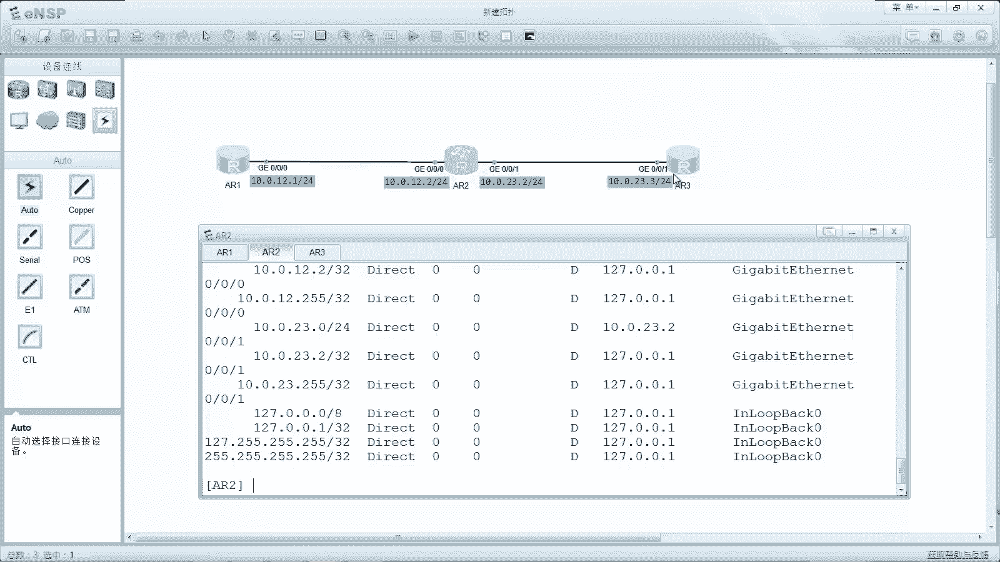

能互通吗，我们看一下一和三之间它是非直连链路对吧，那么测试它的连通性的时候发现是失败的对吧，失败的，那么是在E上直接去评测10。0。23。3，对不对，那么为什么失败呢，我们去检查ARE的路由表的时候。

发现他只有直连路由对吧，它只有零直连路由，有没有去往10。0。23。3的路由呢，没有，那你路由器的最低基本的一个转发原理，就是有路由表才能给你转，对不对，现在你连路由表都没有，你怎么转呀对吧。

所以它是不通的，那么不通最主要的原因就是没有路由，那么我们就想办法让AR1知道，怎么去往这个AR3的地址不就可以了吗，哎那么就是告诉他路由，那么第一种方式呢就是配置静态路由，那么就好比是啊。

你比如说你去逛街吧，走到一个十字路口，十字路口你也不知道这个路口是去哪了，对不对，因为你的目的地呢是这个，比如说诶天文对吧，那这四个路口到底哪个路口是去往天安门的呢，不知道，那不知道的话。

我就可以通过什么方式告诉你呢，比如说对吧，拿了一个这个呃，这个养养路的一个维修工人对吧，他搞了一个这个指示牌，分别标注出来了，这是这个路口的三条路是吧，十字路口三条路，哪条路是去往天安门的。

那条路是去往颐和园的，哪条路是去往圆明园的对吧，哎就是这个维修工人啊，直接在这个路口咔插个大标对吧，标识清楚，这样的话你就知道了，就好比是我们在路由器上去配置静态路由，我告诉你怎么走对吧好。

那么接下来我们看一下这个静态路由，怎么去配置啊，那么命令呢就是通过IP root static，那么后边呢就是你要想要去访问的啊，IP地址的网段啊，掩码啊，吓一跳接口类型啊，吓一跳地址好。

那么具体的一个事例呢，我们可以看一下，在AIE上就是IP route static，10。0。23。0对吧，24位的，而525。0吓一跳是吧，好下定啊，那么你看啊，你看这个命令里边呢，它有下一跳对吧。

还有一个下一跳至地址啊，呃还有一个这个接口的编号，那么当我们去配置静态路由的时候，你是用吓一跳好呢，还是用接口出接口好，OK好，那么这两种呢大家注意下，很重要啊，这是我们配置静态路由的一个重点部分。

重点呢就是第一个你是配置下一跳地址，还是配置一个出接口就好了，那么如果说你是在一个以太的一个链路上，就是一个多路访问啊，A上的网络环境里面，我们必须要配置下跳地址，你出接口有没有，这都无所谓。

必须要去配置下跳地址，如果说你在一个是p to p的一种链路上啊，比如说我们后面会去讲你的是PP封装啊，或者是HDLC封装啊，对吧，这都是属于这种P图P的内容，那么这种链路上你用出接口就可以。

那么当然你在这种链路上呢，你用啊吓一跳也可以，哎这是一个重点啊，一定要注意一下啊，那现在我们看到示例里边用的是狭跳，为什么，因为我们的胶片里面的拓扑呢它都是以太网，那么以太网呢就是这个多路访问。

所以必须要使用下降下一跳好，那么这个下跳它的地址设置的是谁呢，你看啊在我们拓扑图里面呢，这个123之间看一下图啊，哎这个好久了对吧。

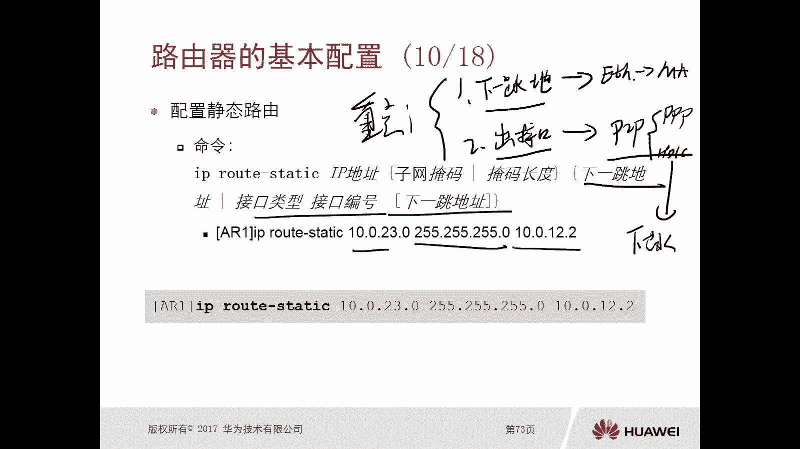

好因为呢在我们的拓扑图里面，大家可以看一下，在我们top里面拓扑图里面，大家可以看一下这个A21对吧，去访问A23的话，那么他的下一跳是谁呢，应该就是要把数据包交给A2，所以说他的吓一跳呢就是R对吧。

那吓一跳是A2的哪个地址呢，是和A二一直接互联的地址，就是10。0。12。2，所以在胶片里边，在A2A上去配置去往10。0。23。0诶，为什么是23。0，不是23。23呢，当然也可以去配置23。3。

那么这样的话叫做主机路由了，只是对于某个地址的一个访问可大，所以我在这呢可以直接去设置整个网点，23。0杠四啊。

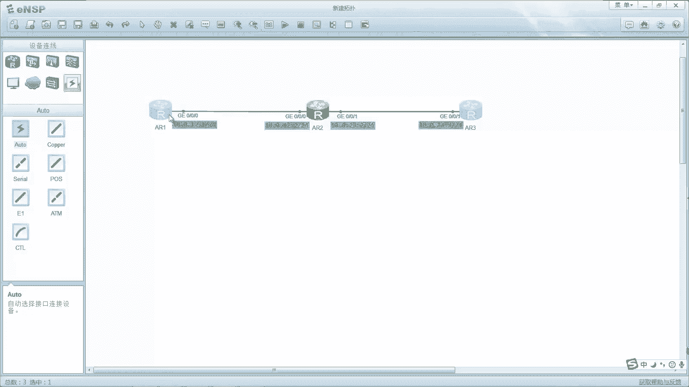

这个网段，那么在一项就可以设置，那么下一项是10。0。12。2对吧，10。0。12。2，这就是在A1上去配置，去往A23塔的一个路由好，那么P完以后呢。

我们再通过display IP routing table protocol static，那么这个命令的意思就是，我要去查看IP路由表，里面是通过手工的静态的方式去配置的路由，那么只有这一条，对不对。

10。0。23。24，静态优先级60，吓一跳，出接口对吧，全部都有了好，但是当我们做完以后呢，你去评测的时候发现还是不通的，那么不通是什么原因造成的呢，我们可以分析一下，那么AR1去拼AR3的时候。

因为AR1已经设置了去往AR3它的路由，所以说A1的发送数据包的时候，是能够通过静态路由将这个数据包转发出去的，他一定是转发到了R2，那么R2呢依旧去查找路由表，去往10。0。23。3。

发现是有直连路由的，所以说A2拿到数据包以后，也能够正常的去转发，并且给了A23，但是AR3要回报，就好比是你的写信呀，你有一个比如说A何必要通信，那么A写信，他的收件人是B，发件人呢是A。

对吧是A那么当B收收到信以后呢，必要进行一个回信，那么这个发件人就变成了B，收件人呢就变成了A，那么这个是一样的，一把数据包传递到了三，那么三是不是要回报，就好比是在回信呀，那么三去回报的时候。

目的地是不是A了，所以这个AR3呢想要去访问AR1的地址，那么AR3呢就必须有关于10。0。1，2。0杠四的网络的一个路由，但实际上A23有没有啊没有，所以说呢它也是无法响应的。

那么无法响应呢就没法平通了，没有核刺痛了，哎所以说我们在esp里面去抓包，你会发现啊，那么只看到了10。0。12。1，朝着10。0。23。3，再去发送ICMP的echo的pin的request啊。

那么我们使用P呢，它有两种报文啊，第一种报文就是request，但是你有没有去看到三区做一个响应request呢，哎这个reply呢没有啊，是没有replied的，只有一去往三的request。

没有三向着一去做一个reply的回复啊，没有恢复，所以说呢我们需要在这个三上去配置，去往ARE的一个静态路由，也就是回程路由配置方式和E上去配配置，去网三的这个回程啊，这个静态路由是一样的啊。

这个叫回程路由，那么就是IP u static，10。0。12。24对吧，然后10。0。23。2，那这样我们再去检查A23的一个IP，如表就能看到他有这个静态图了，对不对，然后我们就在一和三上啊。

呃这个通过拼的方式进行测试，发现能够互通了啊，那么就成功了，同时呢开启抓包也能看到有echo的pin的request，以及三的一个reply啊，都是有回报和发包，有发包和回报。

好那么这个就是我们的静态路由，那么接下来呢我们通过这个ENSP的方式啊，把刚才我们要做的事情要做完，就是配置路由好。

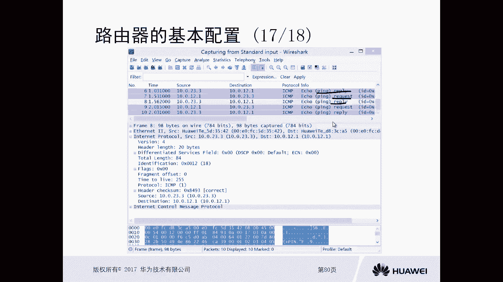

那么首先呢，我们在一上去做一个静态路由的配置啊，啊那么就是在系统视图下去配置一个IP static，10。0。23。0啊，24，那么吓一跳啊，因为我们这是以太网口，所以它是一个A网络环境啊。

所以说我们要去配这个下一跳，吓一跳，就是10。0。12点对吧好，那么做完以后呢，我们随便在一个链路上进行抓包啊，比如说在这个位置进行抓包吧，哎这个位置进行抓包，我们是能够看到一去测试P3的时候。

在这个链路上呢。

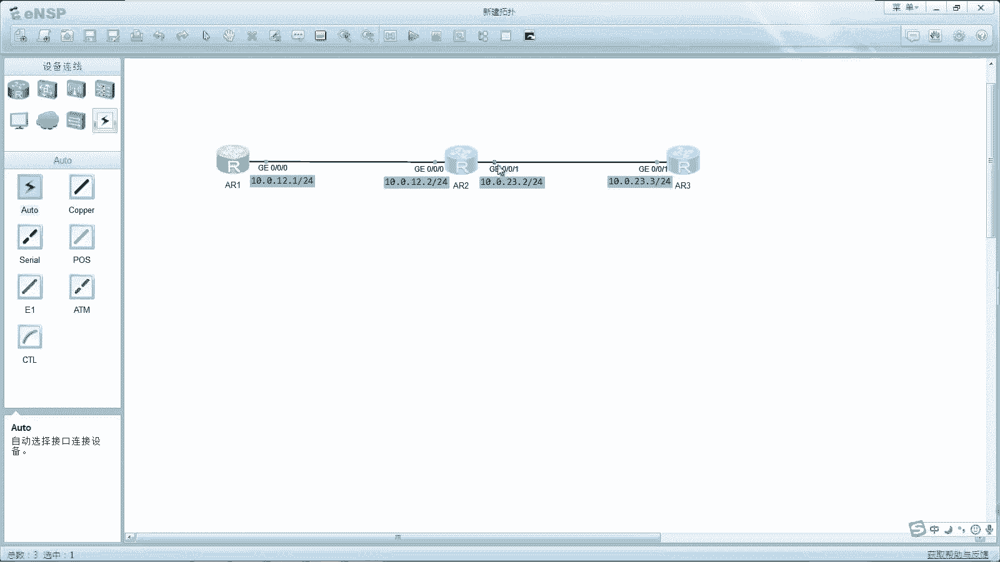

确实A2已经把数据包转到了三啊，这是三呢是没有reply的响应信息的，这是我们在三项，还没有配置回程路由之前的一个效果，我们看一下啊，先把那个最小化了。

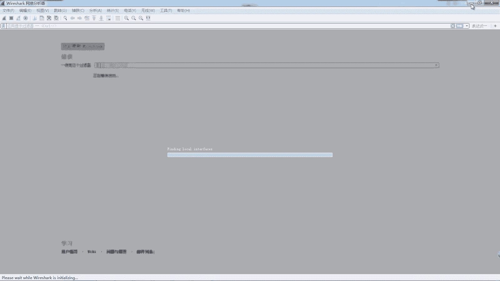

好好好，以后呢，接下来呢就一个测试拼点233啊，发现肯定是不通的，你看啊他是请求超时嘛，对不对，request time out好，那么这样呢我们再把这个呃抓爆啊，给打开看一下好，我们可以看到。

在这呢确实抓到了10。0。12。1，作为source destination呢，10。0。23。3的一个ICMPIO的拼request，但是没有收到三的一个回报对吧，原因就是山上还没有回程路由。

那么我们需要在山上再去配置一个回程路由，那么回程路由呢，这个静态路由的这个路由信息呢，就是10。0。12。0了，就是AR1，它所在的这个网段对不对，然后是24，然后10。0。23。2好，那么做完以后呢。

我们size一上去做一个测试，OK发现能够互通了对吧。

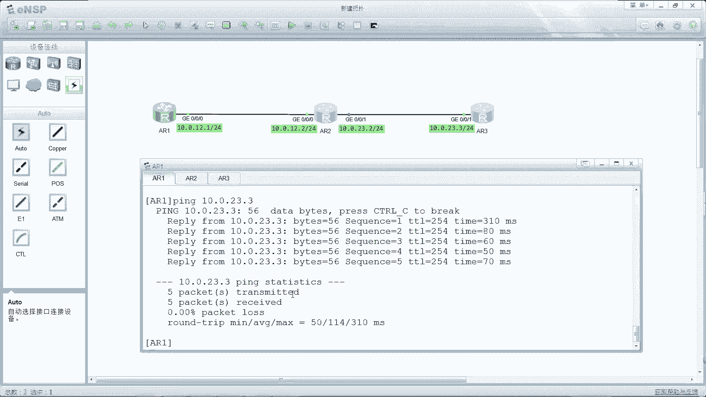

我们再从这儿呢把这个抓包打开看一下效果啊，好我们可以看到啊，这后边的就是有request your reply，Your quest，Reply，request reply啊。

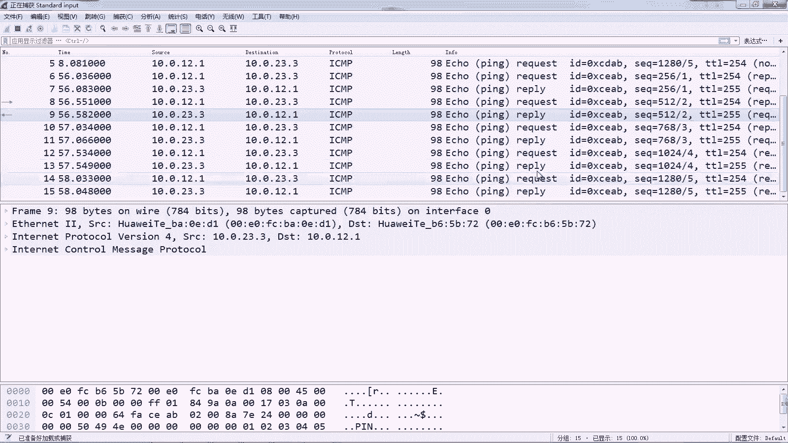

这样就可以实现通信了，哎所以我们可以看到这个路由是双向的对吧，唉想一想，刚才我给大家举个例子，写信的例子嘛，对不对，通信一定是双向的。

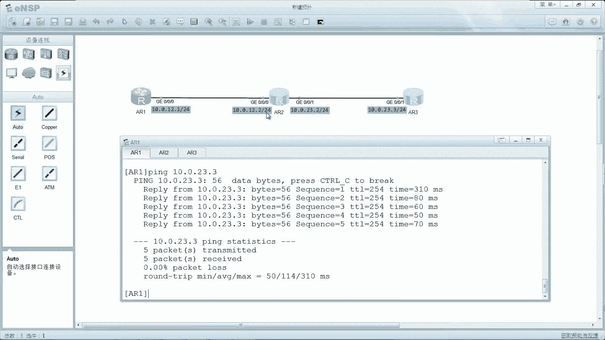

好，我们看这个实验的总结啊，第一个呢我们验证了路由表中，默认的只有直连路由，但是当我们在路由器的接口配置的IP地址，那么缺省它只有直连路由对吧，同时呢我们通过配置静态路由也验证了呃。

这个通信呢它的路由啊，他是必须要是双向的对吧，就是通信的前提，那就是路由必须要双向嗯，不双向的话，你没有双向路由的话，我们通信呢是无法实现的，OK好这就是我们路由器的一个基本配置啊，那么是最基础的啊。

那么同时呢我们也引引入了路由的概念，也引入了静态路由。

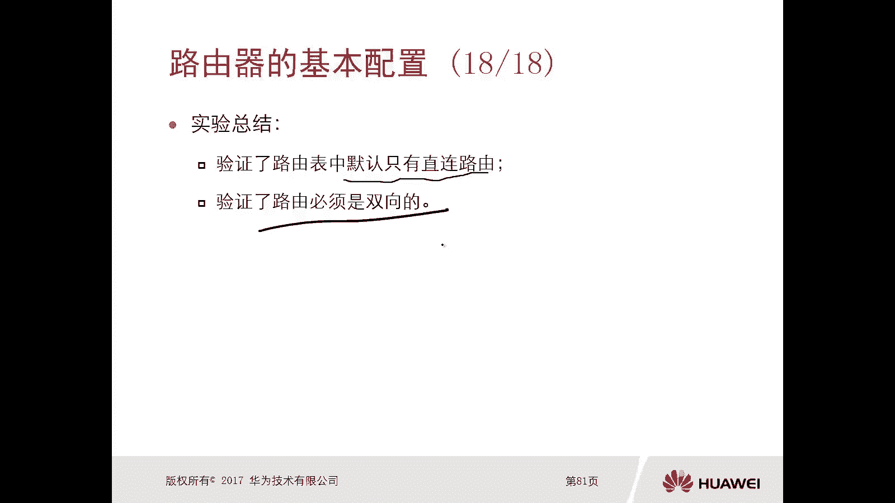