# 华为认证ICT学院HCIA／HCIP-Datacom教程【共56集】 数通 路由交换 考试 题库 - P17：第1册-第6章-1-IPv4编制方式 - ICT网络攻城狮 - BV1yc41147f8

好，那么接下来我们看一下，这个IPV4地址的一个编辑方式，那么IPV4地址的编制方式呢，它是采用这种点分十进制计数法啊，点分十进制计数法，那么对于IPV4地址，它的一个长度是32位，是32个比特。

那么正好是四个字节，那么呢，我们我们前面其实呢应该是有这个基础的，我们讲过这个二进制，十进制啊，16进制啊，我们在前面的章节里面应该是有的，那我们的资料里边，那么我也相信大家呢嗯是学习过这种二进制。

十进制，16进制的转换，那么对于我们的计算机里面呢，它所有的数据呢，都是以二进制的方式去呈现的啊，所以说对于IPV4这种地址，它也是使用二进制的方式，在计算机里面去标识的好。

但是我们实际上实际上我们需要把这32位，二进制的数对就是四个字节，那么给它分组分组呢是更为直观一些啊，包括我们后面去配IP地址的时候，你会发现，那么我们怎么进行分组呢，是按照每个字节去分一组。

每个字节分一组啊，美族呢正好是八个比特八位啊，因为八个比特正好是一个字节嘛对吧，这是我们最基础的一个内容啊，那么分了四组，四组正好是四个字节嘛，对不对好，那么如果说这八个二进制全都是零，那么它是最小值。

那么十进制呢也是零嘛，对不对，如果八个二进制是一，那么它是最大值，它的十进制就是255，OK好，如果说大家对这个二进制十进制，我觉得大家应该都是了解的啊，如果说哎对于二进制十进制我们模糊了对吧。

我们看一下前面那个资料上面是有的，那么魅族呢是将二进制转换或者换算成十进制，用点分隔开，那么在计算机里边呢，你是不用不需要什么转换呢对吧，不需要用什么隔开的，那计算机能够识别，因为它都是二进制的。

计算机本身就是识别二进制，对不对，但是为什么我们要将二进制转换成十进制，然后用点分开呢，那么点分开的目的，转换成十进制的目的是我们更直观，作为我们管理员做我们的这个学习网络，或者说去为这些设备去配置。

IP地址的一些从业人员来讲对吧，我们通过十进制的方式去给一个节点去编制，那么是更直观的对吧，是可以接受的，你你想想啊，让你给某个设备，某个PC去配32位二进制的一个IP地址，你会不会疯掉啊对吧。

哎这是这个点分十进制的方法啊，我是这样做的，具体是什么样的好，那么我们再看一下这个IPV4地址，它的这个编辑嗯，那么IPV4地址的一个编辑呢，就有一点点像有一点点像，比如说我们快递包裹的一个地址对吧。

你看我们这个快递大家都用过快递，那么快递都用过，那么这个快递上面一般我们都会写上嗯，这个省份国家对吧，国家我们一般都在国内买东西，你除非你是海淘，对不对，哎有国家，然后有这个省份对吧，城市道路对吧。

街道小区甚至是住宅楼门牌号等等，这种方式去写，对不对，那么对于我们IPV4地址去写的时候，它是适合这种类似于这种快递这种方式，有没有什么相似之处呢，那肯定是有的，没有的话也不会放在这对。

那么对于IPV4地址呢，它是分为两部分，一个是网络部分啊，就叫做网络位，这是我们平常的称呼啊，网络另外一部分呢叫做主机位啊，这个主机部分就是主机位好，那么对于刚才我们讲到的这个快递。

比如说以家庭住址为例，城市曲线，再加上你的街道门牌，主要是这两大部分对不对，那么对于这个IPV4地址呢，网络部分主机部分对吧，我们我们这种情况下应该能够理解了，那么对于这个城市曲线。

它是一个大的一个范围，然后具体细化到诶哪一个人，哪一个接收者，对不对，就是你收下这个人呢对吧，就是收快递的人，收件人是谁，接到门牌对吧，那同样对于IP来讲，网络部分呢只是一个大的一个范围啊，一个网段。

那么主机部分呢具体表示的是网络部分，哎这这个网站里面的某一台主机，因为你在一个网络里面有好多主机啊，有100台，对不对，那你具体是主机A呢还是举B呢，还是主C呢，还是主机部分哎。

这就是IPV4地址它的两大部分啊，好那么具体这两大部分，我们再看一下它的它的作用啊，那么网络位或者叫做网络部分啊，指的是IPV4地址所在的网络，我们在一个网络环境里面，你比如说在一个企网企业网里面。

可能它有好多这个网网络对吧，比如说有这个财务啊，有这个售后部啊，有售前部门啊，对不对，有行政部门吗，我们可能把每每一个部门都会设置成一个，不同的网络对吧，那这种情况下这个网络位它的作用就出来了。

哎你这个网络位是给这个残酷的，哎这个网络是给这个销售的，这个网络是给售后的，要分开，对不对，这是王位，那么主机位呢指的是你IPV4地址，在该网络中的一个接口和适配器，就好比是比如说对吧，我们财务。

我们财务部里面有好多电脑，怎么有财务总监呢对吧，然后有财务专员的，有报税专员的，但是我对财务不是不是特别懂啊，我知道有个财务总监对吧，然后财务主管财务专员，假设有三个人对吧，假设有三个人啊。

那么这三个人都有都有电脑啊对吧，那么具体你表示哪一个电脑，哪一个主机的地址啊，哪一个地址表示的是财务总监的呀，哪个地址表示的是这个财务主管的对吧，哪个地址表示的是财务专员的，对不对，那就是主机位。

主机位，好，那么对于我们一个呃完整的一个长度的，32个比特，四个字节的一个IP地址啊，哎你看它是八，它是四个八个比特的组对吧，四组对吧，哎每一组呢是八位，每一组是八位比，好在这里边呢胶片里面给的例子呢。

我们可以看到它的前八位是网络位，后边24分呢全都是主机位，当然这个不是固定不变的，那么后面呢我们会看到诶，有可能是前面16个位是网络位，哎前面24个位是网络位对吧，那你除了网外，剩下的就是主机位了。

对不对，好，那么一会我再去看IP地址的分类啊，但是当我们IP地址啊去编辑的时候，假设你的网络位已经确定了，已经确定了，但是呢有两个特殊用途的地址啊，是没法给主机去配置的，大家注意一下。

那么我们一个网络里边，有两个特殊的地址是不能用的啊，是不能配的，一个呢就是网络地址，这个网络地址呢实际上代表的就是哎，你这是一个网络对吧，哎就是代表一个网络，那么这个网络地址什么样的一个地址。

是网络地址呢，是主机位全为零的地址，是网络地址，大家注意下，这很重要，网络地址，主机主机位选取零的地址是网络地址啊，表示一个网络，另外一个呢是广播地址，广播地址呢是主机位选取一的地址，叫做广播地址。

广播地址呢表示的是所有的主机啊，就是你给广播地址里边，你用广播地址去发送信息，那么所有的主机呢都会收到这个数据广播地址，而这两个地址呢都不能给主机去使用，所以呢一个网络里边。

可以给主机去配置的地址的数量，一般呢都要减去二，减去二，就是减的网络地址和广播地址都是这样的，哎这个对我们后边去做这个子网划分的时候，是非常有意义的啊，好那么呃接下来呢我们就看一下刚才讲到的，哎。

你说的这个网络位呢，它占八个位，有的网络位占16个位，有的网络位占这个24位对吧，唉那具体是什么样的呢，唉是这样的嗯，我们这个地址呢IP地址呢是分类的，它是分为ABCDE一共是五类五类。

那么它的分类方式呢是最最左侧的四位，它是根据最左侧的四位的二进制数，将这个IPPC地址分为ABCD，那我们可以看一下他怎么分的，据左侧距左侧，那么A类呢大家可以看一下，最左侧的一位是零。

其他的无所谓对吧，B类呢10C类呢110，D类呢11101类的111，你看ABCDE这五类啊，他其实看的全都是最多的，就是左侧的四位，最少的是左侧的一位对吧，同时我们可以看到ABC类，ABC类。

他们的网络位和主机位是不一样的，A类的网络位呢是占八位吧，主机位呢是占24位，B类呢是占16位，哎这个主机位占16位，C类呢是网络位，是占24位对吧，然后呢这个主机位是占八位，那么对于D类和E类啊。

没有什么网络位和主机位这一甲啊，这说法。

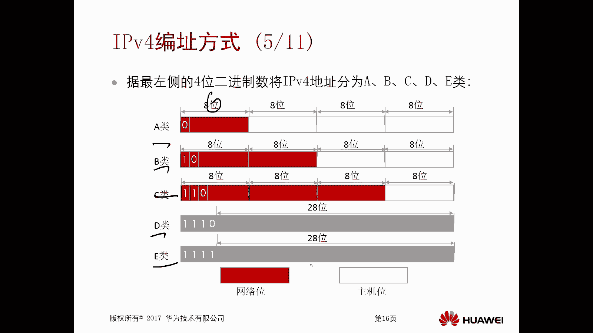

那么一会儿呢我们一个去介绍啊，好，那么首先呢我们接下来就去介绍这个A类地址，A类地址呢左侧的第一位为零的地址。

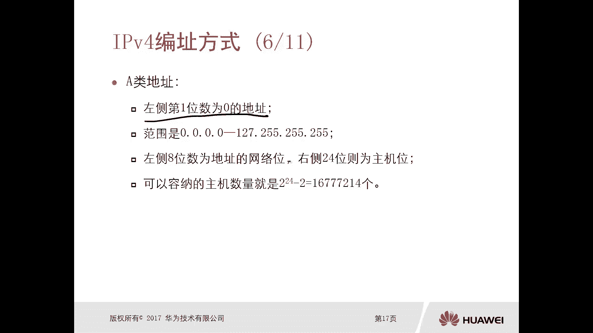

全都是A类，我们可以看一下这个图对吧，只要左侧的第一位是零，那么后边一共是多少位呢，那就是24位减去这个一位就是23位，23位，任意23位可以从零一直变到一。

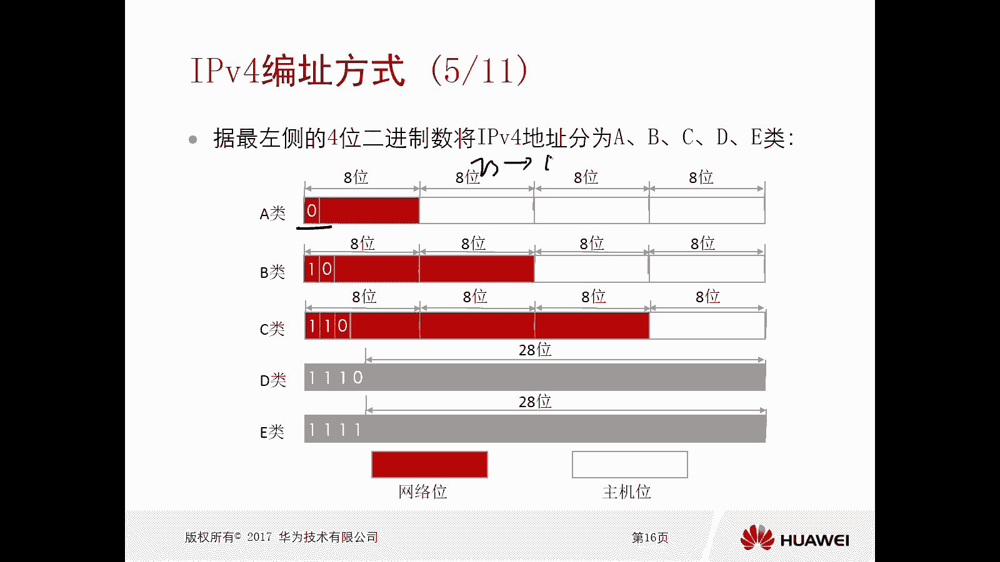

对不对，所以说A类的一个地址的范围是，0。0。0。0127点252525，这就是A类地址的范围，而这个范围非常重要，那么你这是很基础的，以后我们去面试啊，或者怎么着，对不对，这个问题很有可能会被问到。

你会说下A类地址它的一个范围呀，对吧哎搞清楚，那么左侧的八位数呢为地址的网位，右侧24位呢为主机位，那么这么一个范围里边可用的主机的数量，就是可以容纳的主机数量。

或者叫做可以使用的主机的IP地址数量是多少，是二的24次方减去二，因为你的主机位啊，大家注意你的主机位是24位呀，没事吧，24位，所以说你的主机的数量是二的24次方，因为你24位可变是二的24次方。

个对不对，然后减去二哎，这是A类地址啊，注意一下很重要，那么B类地址呢，左侧的前两位必须是一零的地址，就是一零不变，然后后边呢以任意变化。

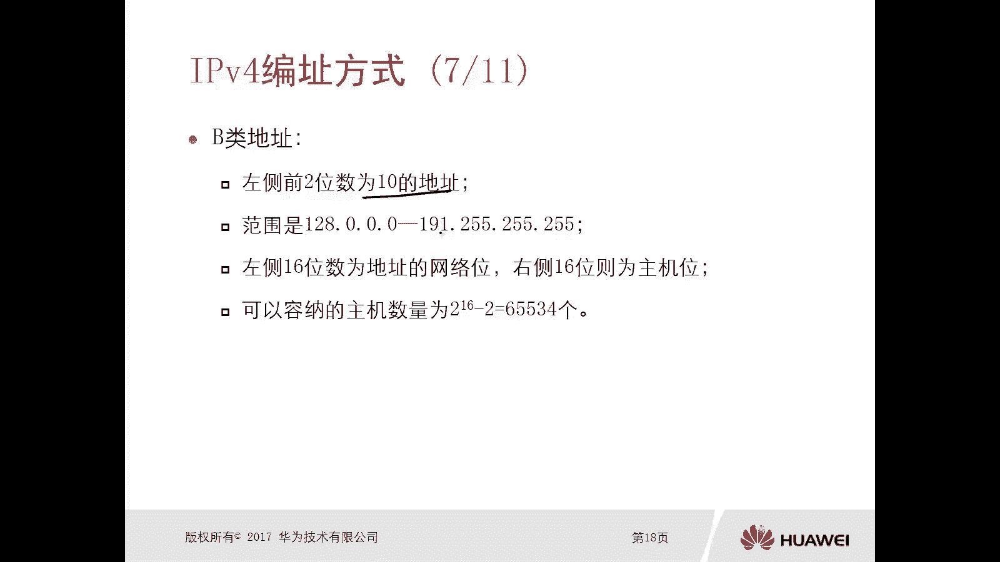

大家可以看一下妖灵不变，后边任意变化。

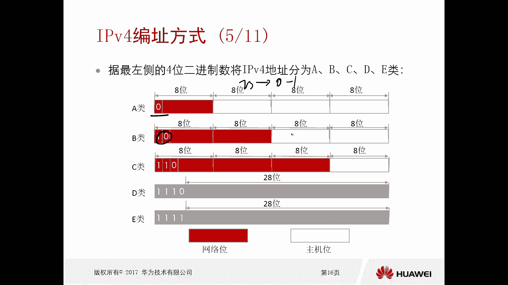

唉那么这种情况下，它的一个范围是128。0。0。0，一直到191。252525，而同时呢这个B类刚才我们看到了，他的左侧16位是地址的一个网络位，对吧，是这个地址的网位，那么右侧16位主机位。

所以说它可变化的一个主机的数量，是二的16次方，所以说它可以容纳的主机数量，或者是可以提供的有笑的，IPV4地址的个数是二的16次方减去，你看我们又减二了，刚才我已经给大家提到了。

这二简直是网络地址和广播地址对吧，任何一个网络段里边，它的可用的IP地址个数一定要减二了，因为它有一个网络位和这个，因为它有一个广播地址和一个叫做网络地址，对不对，注意一下啊。

好那么接下来是这个C类地址，CD地址呢是左侧前三位为110的地址，那么它的范围呢是192。00000，一直到223。252525，OK好，那么左侧的24位一一共是24位啊，全都是这个地址的一个网络位啊。

那么右侧的八位呢是这个主机位，所以说C类地址，它每一个网络里面可以容纳的一个主机的数量，是二的八次方哎又1-2，一共是254个，对不对，哎，是254个啊，每个网络啊都可以容纳这个254个。

这个我们讲的是嗯，一个网络里面它的主机的数量，那你不同类的这个地址，它的网络的数量是不一样的哦对吧，以网络为可以变化的是有几位，那你的网络一共就是多少呗。

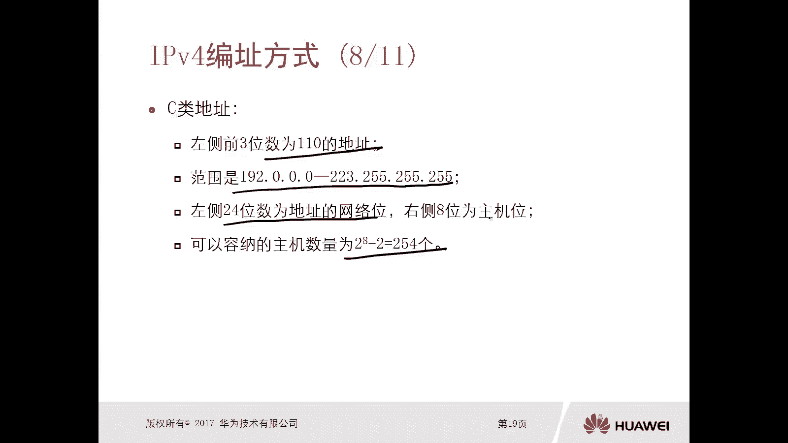

不对什么意思呢，大家可以看一下，你对于这个A里来讲，他的前八位是网络位，其中有一位是不能变的，所以说它可变的是七位，那么A类能够提供的一个网络，网络的数量是二的七层，对不对。

每一个网络里边能够提供的主机数量是二的，24次方减去二，没事吧，那么以此类推，B类呢，B类是16位，但是两位是不能变的，所以说它能变的是14位，那就是二的14次方可以提供这么多网络。

每一个网络里边的主机数是二的16次方，减去对吧，哎那么C类呢是24位，但是三位是不能变的，所以说它可以提供的网络的数量是二的，20一次方啊，每一个网络里边，它能够提供的主机数是二的八次方减去二是吧。

哎那么对于ABC类地址呢，我们叫做单播地址，弹幕地址，那么这些地址都是可以给主机配置的啊。

好但是D类地址呢，D类地址叫做主播地址，你看它和前面ABC类不太一样，它没有什么网络美，没有什么主机位，它是不区分的啊，他也不会去减去二，所以它的范围是24。0。0。0，到239。2525。

所有的地址都是可用的，都是可以用的，包括零，包括二五，你看前面都是要减去什么零啊，减去25，对不对好，那么它的规定是，左侧前四位呢为1110的地址哎，就是D类，那么第一类呢我们可能暂时涉及不到啊。

那么在一些高级的课程里面啊，高级的一些资料里面对吧，高级课程资料里面都会提到会用到主播啊，这是个地理地址啊，那么还有一类呢就是这个异类，那么E类地址呢它是用来做科研研究的啊，啊做做科研用的啊。

这是保留地址，那么它也是不区分的，它是从240。0。0到252525啊，那么它要求呢左侧前四位呢是这个111啊，这个地址好，那么对于我们比如说我们大家有PC，我们个人有个人的笔记本，个人台式机对吧。

那么你的自己的电脑都是有IP地址的啊，因为你没有IP地址，你肯定是没法进行这个发送信息啊，上网啊，对不对，那我怎么去查看我的电脑的一个IP地址呢。

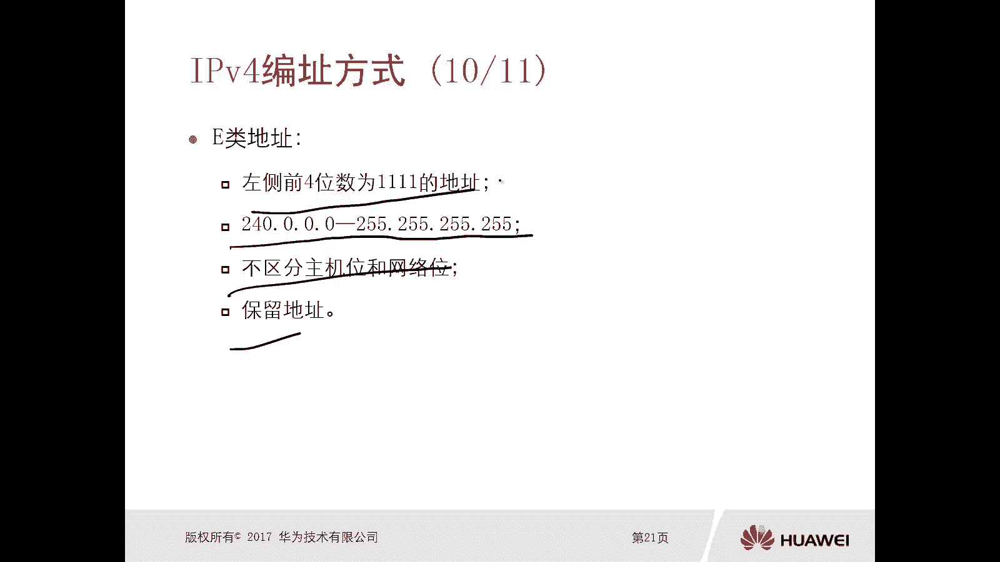

是在我们windows系统里边对吧，在这个命令行CMD里面去输入一个命令，叫做IPCONFIG港澳，那么在这里边呢，我们就能看到你的接口，网卡的一个IPV4的地址啊，IPP地址可以看到1981681。

102，对不对好，那么我可以给大家去看一下，我现在笔记本它的一个IP地址啊。

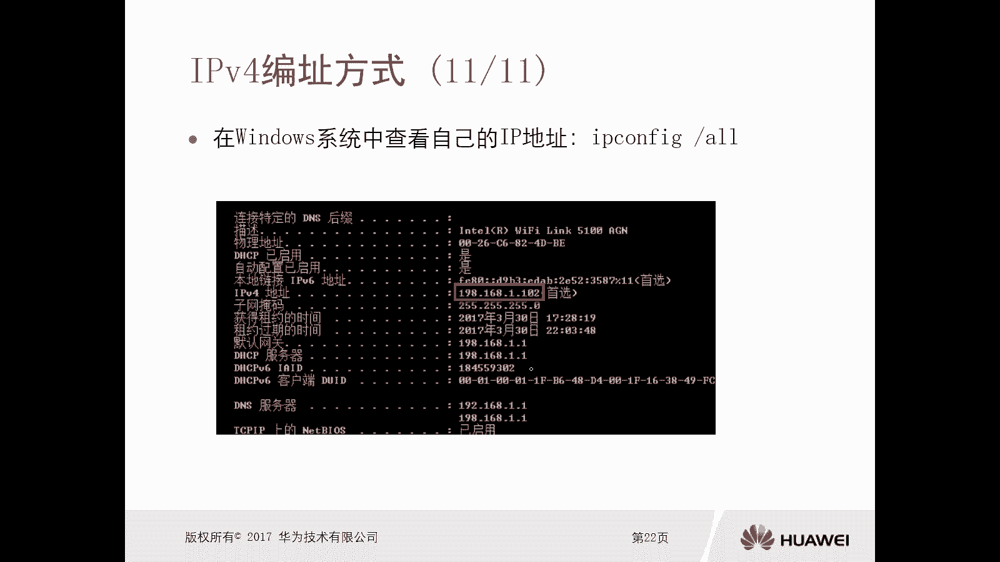

好大家可以看一下啊，这个我就直接输入一个IPCONFIG杠二啊。

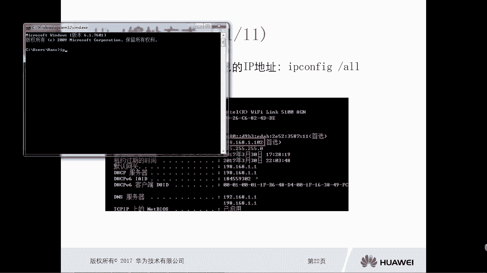

因为我的网卡比较多啊，我们找一下这个。

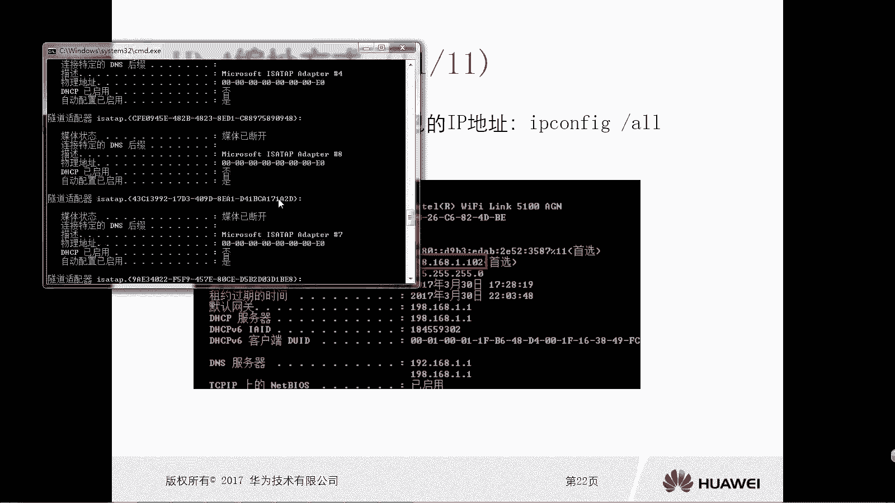

因为现在我用的是无线啊，我们找一下这个无线网卡它的一个IP地址啊。

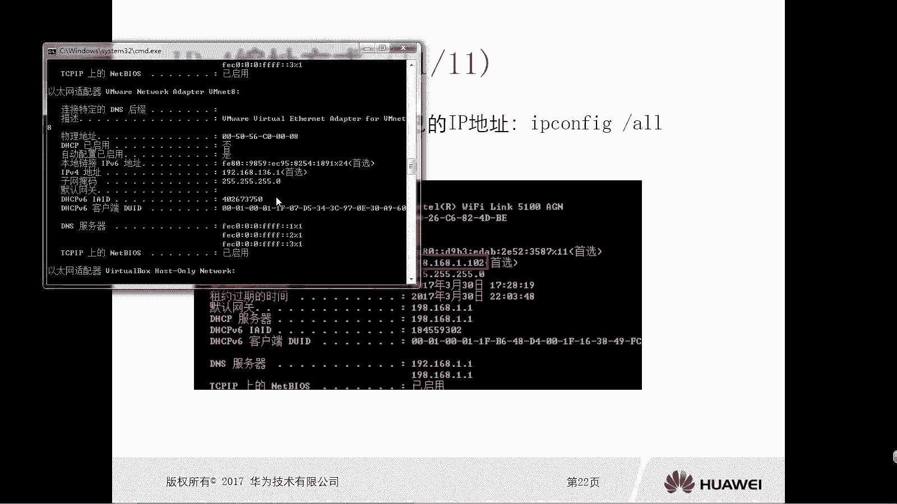

应该可以看到的啊，这是一个虚拟的网卡呃，虚拟网卡。

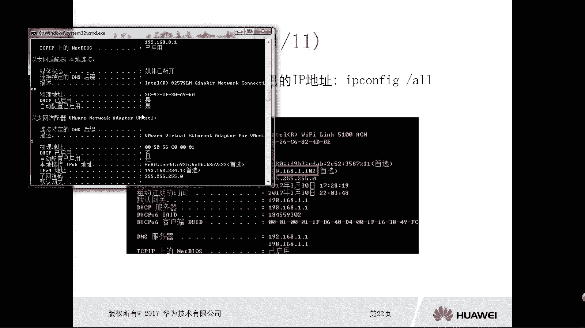

然后按你看这啊，无线局域网适配器对吧，那这里头呢我们可以看到我的IPV4，地址是192。168。8。106对吧，哎这个地址是可以看到的啊，当然我们后面还会去。

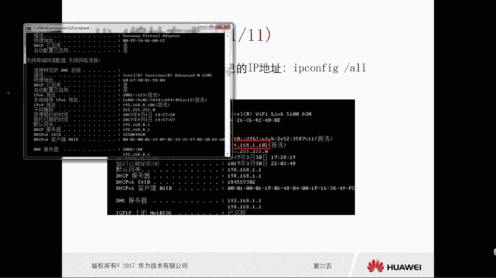

还会去介绍什么IPV6地址，对不对，我们现在用的是IPV4地址，那么刚才我们讲的全都是IPV4地址。

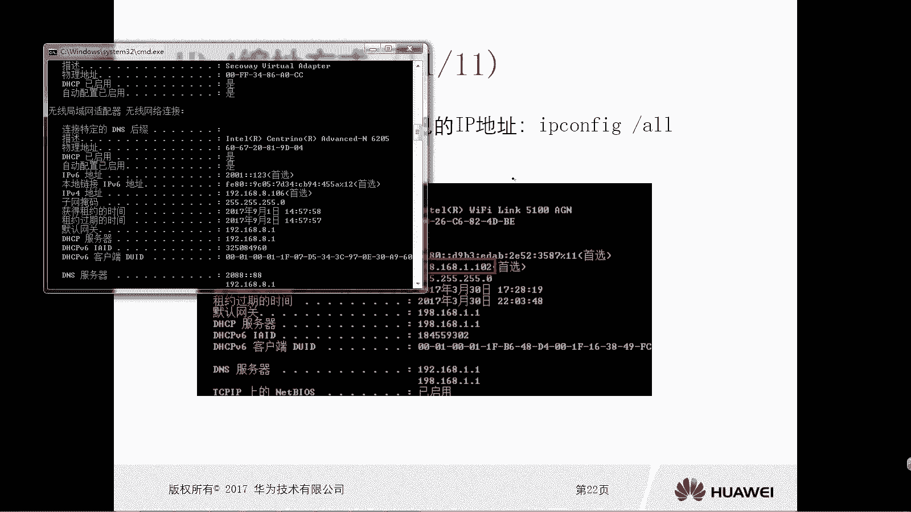