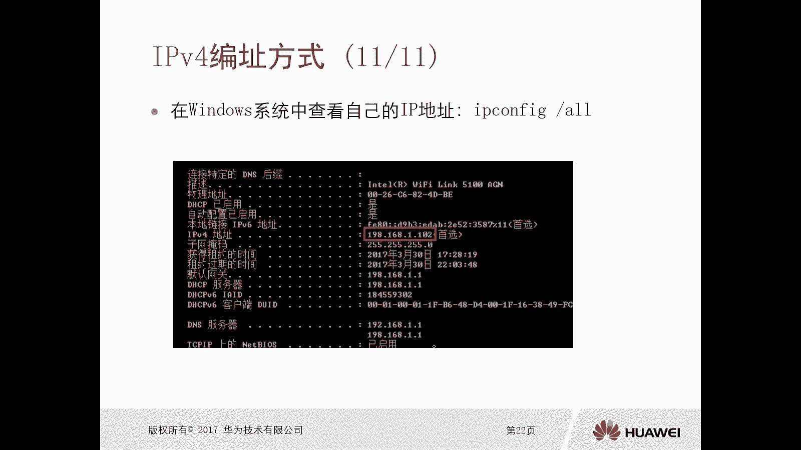
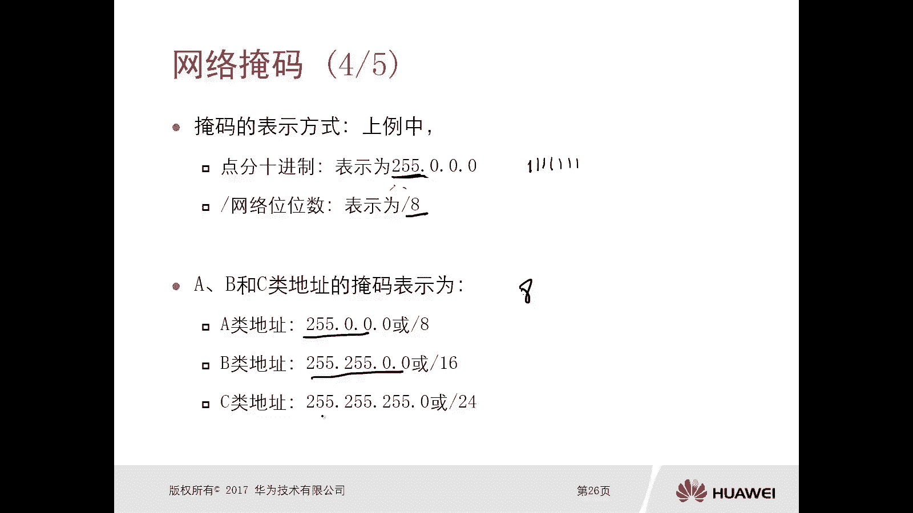
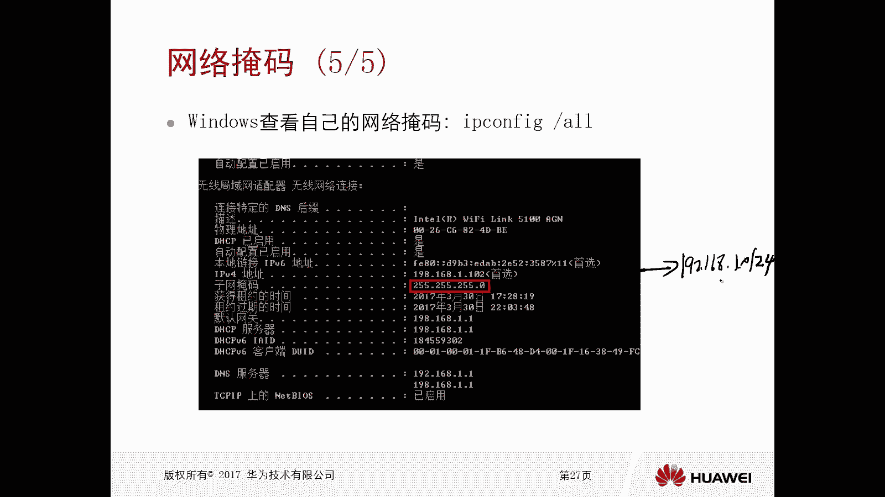
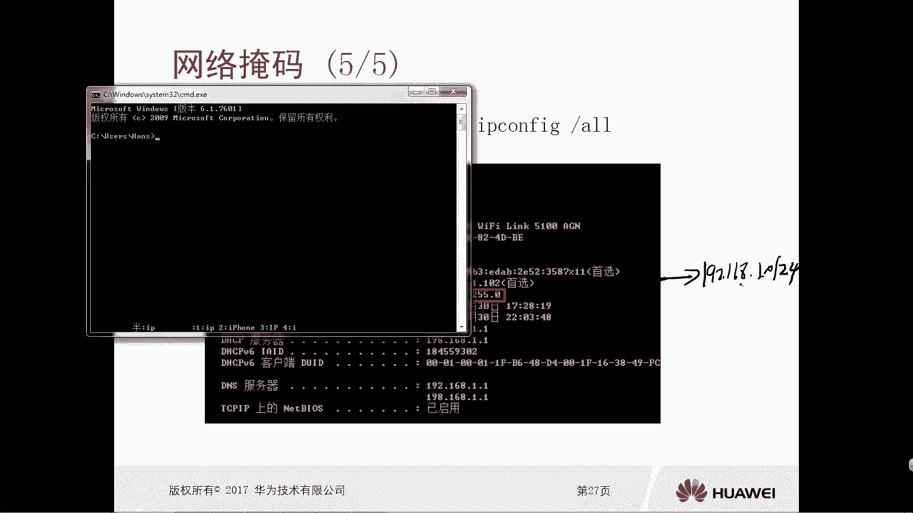
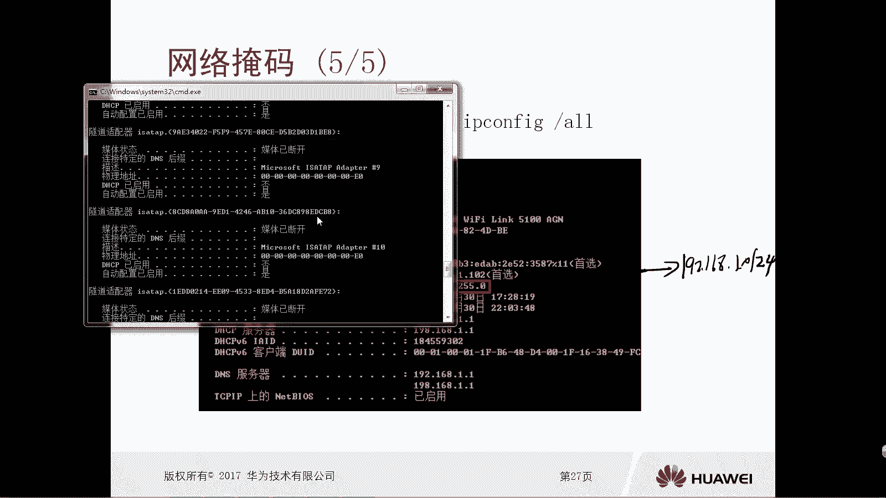
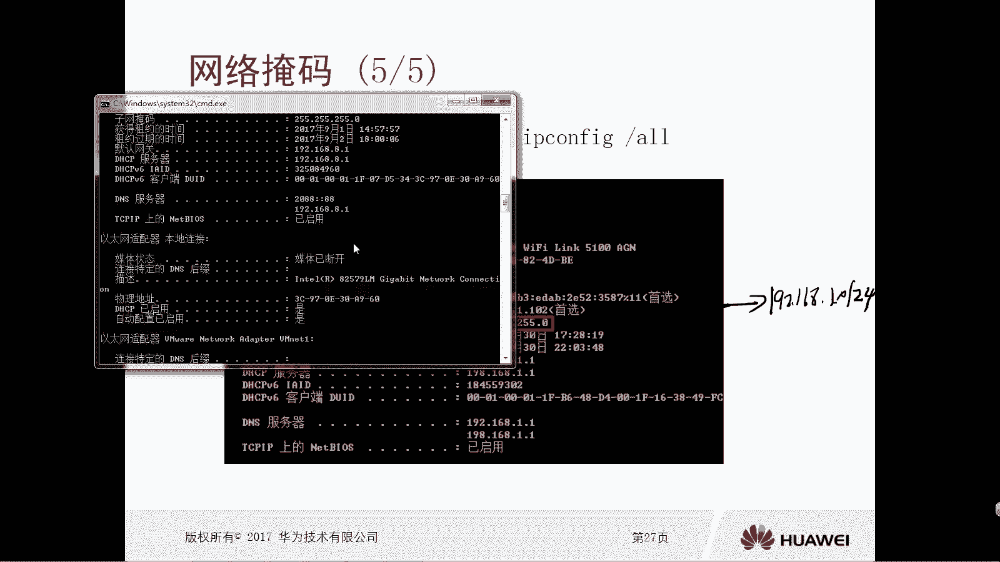
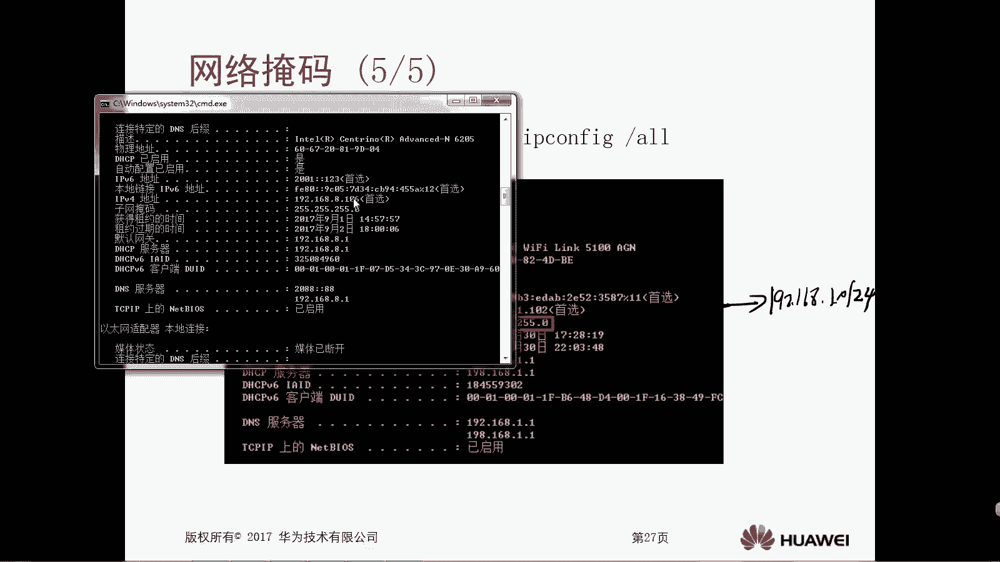

# 华为认证ICT学院HCIA／HCIP-Datacom教程【共56集】 数通 路由交换 考试 题库 - P18：第1册-第6章-2-网络掩码 - ICT网络攻城狮 - BV1yc41147f8

好那么接下来我们再看一下这个网络掩码啊，嗯那么我们前面介绍了在这个IPV4里面啊，就是呃比如说你左侧的N位啊，表示的是网络位，因为我们的IPV4呢它分为什么ABC，那么你的这个网络位数是不一样的对吧。

你A类呢是八位对吧，然后你的B类呢是16位，然后C类是24位，那我们就用N去表示啊，然后剩下的就是32位，减去N表示的是主机位对吧，那么对于我们二进制的一个IP地址呢，比如说我们胶片里面看到的是这个。

红色打底的啊，这是八个位啊，他是王位，那么剩下的就是32-8，剩下的全都是24位对吧，全都是主机位，那么对应对应这个十进制对吧，经过一个格式的换算啊，得到的是40 5168，40 2212。

那么做做我们这个呃，从业人员或者是网络管理员来讲对吧，对于我们这个网络的学习者来讲，我们是知道诶，这是这个这个应该是网位哎，那边是主机位，但是你得让主机或者是路由器，或者是网络设备啊。

让他们知道哪一部分是主机位，哪一部分是网络对吧，所以这种情况下才会有这个掩码，那么掩码呢，实际上就是用来标识网络和主机位的，那么对于掩码来讲呢，它也是32个比特的长度。

大家注意掩码和IP地址是两个东西啊，嗯那么呢如果说你的前N位取选取一，它是连续的啊，然后后边32减去N位全取零，哎这种方式就可以得到掩码的表示方式，大家注意啊，32个比特假设啊。

你比如说你前八个比特全都是腰对吧，12345678，后边三个比三个八个比特组就是24啊，就是这个24个比他对吧，全都为零，那么最终他得到的就是一个掩码，掩码是这样的啊，掩码连续为一，连续为零。

注意一下啊，掩码是连续为一，连续为零，如果说你前面NBNB啊，再强调一点啊，前面N位全都是连续的一，那么后边32减去N位全取零啊，那么这样就可以得到野马，那么这个掩码呢。

再要和这个IPV4地址做一个与的运算，那么雨的运算其实前面我们有讲过的，对不对，然后就可以得到这个IP地址，它对应的一个网络位的地址，那这样的话你路由器也好，交换机也好对吧，三层设备也好。

或者是你主机也好，他就通过这个掩码就可以知道了哦，原来你是在这个网络里面，那么它是遮掩了这个对应IPV4地址的，一个主机位，仅保留其网络位的一个效果，因为我主要的目的呢就是区分出来网络对吧。

至于你是哪一个主机，这个倒是无所谓了，对不对，所以说网络掩码好，那么我们可以看一下啊，在这呢有一个这个十进制的一个IP地址，就是刚才我们看到的是4516，82。22对吧，那么对应的二进制的IP地址呢。

就这么多零幺对吧，好，如果说你有一个掩码，你的掩码是这样的一个方式，前边八个比特全都是妖，后边是32，减去八二十四个比特全都零，就这掩码对不对好，那么这个掩码和这个IP地址去做一个雨的操作。

那么雨的操作我们前面介绍过，怎么做叫做雨的操作，雨的操作呢就是只有两个全都为一的时候，得到的一个，雨的操作呢是一只要任何一个值为零，那么得到的值呢全都为零，那么我们可以看一下，一一对应一一对应。

一一对应一一对应对吧，最终得到的我们可以看一下，就是只要有一个为零的，全都零零哎，全都为一的，上下两个一的才是一对吧，最终得到的一个二进制的一个网络地址呢，就是00101101，后面写的是零。

那么得到的这个十进制的网络地址呢，就是45。0。0。0，对啊，唉这样就是我们可以通过这个掩码，结合这个IP地址，IP地址就可以得到这个IPV4地址，它的一个网络地址了对吧，你我我们学习学习网络的人。

我们知道啊，我们配地址的时候，哎这是网络，但是还是那个问题啊，就是你得让主机或者让这个网络设备知道，哪一部分是网络地址，哪一部分是主机地址诶，就是通过网络掩码来实现的好网络掩码好好。

那么掩码的一个表示方式呢，我们可以看一下啊，它也是点分十进制，和我们IP地址的方式是一样的对吧，我们IP地址的方表示方式也是点分十进制，虽然我们是把二进制啊，我们IPV4计量。

虽然是把二进制变成这个十进制，但是我们分组了吧，分子是由一点分开的啊，注意一下，一点分开，那么这个掩码是一样的，那么比如说我们这有个掩码啊，它表示是255。0。0。0，那么我们可以采用斜杠啊。

杠一个数值，这个数值表示的是他网络位的一个位数，你看你这个点分十进制是255。0。0。0，你这个255，那么是全都是腰啊，就是八个腰，那八个腰的话，我们可以通过杠八去标识这个地址，它的一个掩码对吧。

就是他的网位这个位数啊，哎你比如说我们ABC类地址，它的源码分别为255。0000，或者是杠八对吧，我们A类的它的网络位是八个bit的嘛，对不对，所以说它的眼码要么你写成25。0。00，或者是杠八。

那B类地址呢25250。0，杠16是吧，那么C6是252525。0或者是杠二四啊。

这种写法啊，好，那么在我们的这个实际的这个windows操作系统里边，哎，我们还是可以通过这个IPCONFIGGON，去查看你锁定IP地址，它的一个子网掩码，你比如说在这个胶片里面，我们可以看到198。

16，8。1。102对吧，那么这样一个地址的话，实际上我们后面会去学啊，子网子网划分，你只是拿到这个地址的话，实际上你是得不到他的一个网络啊，网络地址的，所以必须还要配掩码，必须要有掩码。

那么通过掩码和这个主机的IP地址啊，就这个IP地址啊进行一个雨的操作，最终我们可以通过这两个信息，得到一个什么样的结果呢，得到这个IP地址，它所在的一个网络网络是多少呢，192。168。1。24对吧。

哎这就是得到了这个IP地址，它所在的一个网络好，那么接下来我给大家看一下啊，我的这个笔记本它的这个掩码啊。

哎我们通过IPCONFIG杠。

哎我们找一下我的这个无线的一个接口卡。

无线网卡。

因为这个大家可以看一下，192168。8。106，然后他的子网掩码是25252500，所以说通过这个IP地址，再通过他的这个掩码对吧，我们就可以做雨的操作，最终得到我的这个笔记本所在的网络呢。

就是192。168。8。0杠24，这样就完了。

