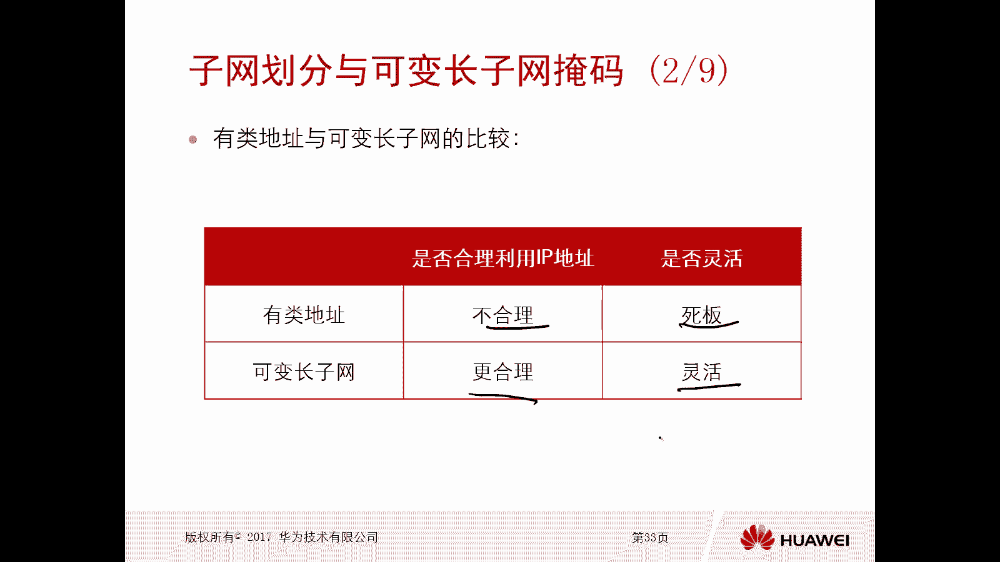

# 华为认证ICT学院HCIA／HCIP-Datacom教程【共56集】 数通 路由交换 考试 题库 - P19：第1册-第6章-3-子网划分与可变长子网掩码 - ICT网络攻城狮 - BV1yc41147f8

好，那么接下来呢我们看一下对这个IPV4网络，如何去划分子网，那么本小节主要是介绍，如何对这个IPV4的网络划分子网，主要是通过以下三个部分进行介绍啊，那么我们看第一部分呢。

是子网划分与可变长的这个子网掩码啊，那么我们看一下为什么要子网划分呀对吧，可编长的子网掩码是什么概念对吧，我们前面讲的叫做网络掩码，那这又提了一个新的概念叫做子网掩码。

那么网络掩码和子网掩码到底有什么区别呢，对不对好，那么第二个呢是规划网络地址对吧，那既然我们现在有了这个网络基础了，那么后期去做实施的时候，难免会遇到去规划网络地址对吧，那么怎么去做地址规划呢。

第三个呢是无类遇见楼好，那么首先我们先看一下啊，这个子网划分的一个原因，那么第一个原因是满足不同网络啊，对不同IP地址它的一个需求，那么为什么不同的网络，对IP地址它有不同的需求呢，呃这个很简单。

我们可以考虑一下啊，比如说嗯我们有一个网络环境，那么比如说它是一个这个销售呃，销售的一个部门，销售部门，比如说有30个主机，那么你想30个主机的话，理论上来讲你只需要有30个IP地址就可以了，对不对。

但是在这种情况下，我按照我们之前讲的这个IPV4地址，那么IPV4地址呢我们分为ABC类，那我们可以考虑一下，那我们如果没有这种子网划分，或者叫做可变长子网掩码这种效果对吧，没有这种技术的话。

那么我们想，我们怎么对这30个主机去配置IP地址呢，那么用A类好呢，B类好呢，还是C类好呢，那么我们可以考虑一下A类的话，它的掩码长度，或者说他的一个网络位啊，网络位，网络位呢是八个比特呀。

那么它的一个网络的主机的数量是多少啊，是二的24次方个主机，那你觉得把A那一个地址拿过来给30个主机，是去使用靠谱吗，其实这个也没什么靠谱不靠谱对吧，也能用，但是你浪费的地址太多了呀，你浪费了多少啊。

你就用30个，但是你这个网络里边的二的24次方，减去30个，剩下所有的地址都不能用了，都不能被别人用了对吧，要不然就会有地址，重点好，那B类B类的话是前面16个比特，是这个网络位，那么你网络位的话。

那你的这个主机位主机位就是可可可变的，可变的是多少个比特呢，也是16个比特，那么这种情况下，你的一个网络能够拿到的IP地址个数是多少呢，二的16次方，但是你现在只需要有30个IP地址啊，对不对。

那也就是说你二的16次方减去30，剩下的地址对吧，会浪费这么多对吧，当然这个这边注意一下啊，我们说二的24个方块，是一共提供的所有的IP地址的特殊对吧，但实际上你的可用的IP地址，不是二的24次方。

火22的24次方根，也不是二的16次方格吧对吧，他应该是二的24次方减去减去二，二的16次方减去二，所以在这呢还要减去二，就是你浪费的地址啊，一是减那么多，那这个这个B类呢就是稍微比A类好一点。

浪费的地址不是那么多了，对不对，那比如说C类C类的话，你的网络位是24个比特，那么你的主机变量是二的八次方个对吧，就是你的主机个数二的八次方个，那么你二的八次方个的话，你能够使用30IP地址。

再减去两个不可用的，你浪费的是这么多，所以说你甭管是用A类，B类C类其实都会在浪费IP地址，还有比如说这边是一个A路由器设备对吧，然后这边是一个B路由器设备，那么这两个路由器设备在一个网段上。

他们互联这个链路上，那么请问用几个地址就可以了，是不是用两个地址就可以了对吧，他们之间是一个网段嘛，对不对，这个网站用两个地址就可以了，但是你你如果按照我们之前的AB，C这种方式去给地址的话。

你最少是给个C类地址，那C类地址，一个C类地址，地址里边它的有效的IP地址个数是二的八次方，个减去二这么多，那你浪费太多了，所以说我们得做子网划分，所以说第一个原因就是我们要满足不同网络。

对不同IP地址的需求，你不要浪费太多好，那么第二个呢是实现网络的一个层次性，那如果说你有那个三个木门，那个销售部，财务部，售后部对吧，那么我去分配IP地址的时候，我可以按照全部都N类，全部都是B类。

或者全部都是C类，甚至你可以去ABC对吧，哎都可以任意组合，那这种情况下呢，实际上是没有什么层次性可言的对吧，因为全都是按照我们之前讲的内容，ABZABC类这种方式去做的，那么只要是按照ABC类。

我们前面讲的这个IPV4地址的一个分类对吧，按照这个类去给一些部门，给一些网络设备去部署IP地址，那么都叫做有类的方式，叫做有类的规划IP地址的方式，但是有类的规划地址的方式有太多问题了对吧。

第一个最大的问题就是我们浪费IP地址，第二个是没有什么层次性是吧，所以说我们都要去做子网划分，那么我们看一下刚才提到的有类地址，那么有类地址刚才我也介绍了，就是按照ABC类给网络设备，给网络对吧。

去设置IP地址对吧，给我们的网络设备去设置IP地址，给我们的网络去规划这个IP，这种叫做有类的，那么可变长子网呢，可变长子网，可变长子网呢，就是不再以有类的方式去部署IP地址，而是以无类的方式哎。

就不分什么ABC了，我的眼我的掩码就是可以变长，之前我们说A类你的页码是八杠八，对不对，那如果有可变长子网掩码这个技术，我可以给它变成九甚至16甚至是24，那么只有你A类是杠八的时候就有类，除此之外。

比如96啊，24啊对吧，全都叫做五类啊，那么B也是一样的，B缺少的是杠16倍，我完全可以把B类呢给它延长成24位，对不对，哎当然C也是一样的。

哎，那么接下来我们就看一下，这个有利地址和可变长子网的一个必须啊，那么对于有类地址和可变长子网，那么主要是通过两个呃这个维度去考虑的，第一个啊，第一个是是否合理的利用IP地址。

那么他俩对比呢有类是不合理，刚才我们讲了解释了，对不对，那么太死板，那么可变长子网呢它更合理啊，更合理，那么当然不是说他一点地址都不浪费啊，他肯定也会浪费，因为不可能说你需要几个。

你正好就是能够给你分成几个啊，浪费的比较少，那么它是否灵活呢，唉非常灵活，那么现在我们在实际工作中，你不管是去做网络的维护对吧，你看到的一个线网，或者说你要去做网络实施啊，只要涉及到IP地址规划的。

我们基本都会去使用变长作，都会去使用可编程，之所以说这章内容非常重要啊。

我们一定要学好，一定要学好，都会用的，那么可变长子网掩码刚才提到了，那么什么叫可变长子网掩码呢，可变长子网掩码叫做VLOSM啊，叫做VLSM，那么这个可变长的一个子网掩码呢。

指的是允许人们根据自己的需求啊，那么什么需求呢，就是你向往的一个需求啊对吧，你用多少个地址不浪费呀，你用多少个地址浪费的少啊对吧，你路由器和路由器之间你需要用多少个地址啊，两个地址还有多少个地址啊。

对不对啊，根据自己的需求，那么将固定的主机位进一步去划分成，子网位和主机本，那么缺省，你看我们A类地址，简单讲A类地址它的网络位只有八个比特，它的主机位呢有24个比特，那么你的主机位的个数越多。

哎注意一下你的主机位数越多，它的主机数越多对吧，就是一个网络里面的主机顺水度，那么你的主机位越少，你的这个IP地址呢就越少，就是一个网络的IP地址越少，对不对，所以呢这个可变长子网掩码。

他的思想呢实际上就是利用主机位对吧，去编造出来，直往位就是将主机位，你比如说24个比特主机位，我将在24个比特币的一部分比特，用来做子网，另外一部分呢做这个主机位，那这样的话相当于是你24位比特。

不全部都是主机不良少了一部分，对不对，那你主机位少了，是不是你一个网络里面的IP地址就变少了，那么恰恰你用用这些地址的时候，是不是浪费的也少啊，对不对，哎同时还有一个好处。

好处是你不仅减少了一个网络IP地址，它的数量，同时你把一个网络，一个主流的网络扩展成了多个子网，阿杜克死亡，所以说本质我们可以看到它的效果，就是节省IP地址对吧，增加了更多的子网供应使用，按规定使用。

那么你比如说我给大家举个例子啊，刚才讲的你比如说我有一个网络环境，有一个网段吧，10。0。0。0杠八，这个网络如果你按照主类的方式去部署的话，那么这个网站只能给一个网络用，你比如说我公司有十个部门。

每个部门按照原理来讲啊，我要分配不同的一个网段，对不对，那你只能给A门，那那其他部门能不能用这个呢就不能用了，但是如果经过子网的一个划分啊，实现这个可编程做网掩码啊，自动划分。

那么这个呢完全可以拿来给十个部门去用，一点问题都没有啊，如果说你不做这个子网划分，不做这个可编程子网掩码，那么这个地址只能被一个部门使用，那剩下的部门怎么办呢，你再去用其他的主页地址，比如还有A类啊。

还有威力C类，这样的话会造成一个非常大的浪费啊，浪费好就是这个子网掩码啊，什么叫可编程的子网掩码呃，那么我们看一下啊，给了一个事例啊，其实刚才我也给了视力，我给的是A类对吧。

现在他给的是一个B类的子网划分对吧，那么B类比如说它是173。6，168。0。0，那这个网络是这样的啊，173。168。0。0杠16，这是缺省的B类，对不对，那么呢我现在呢就完全可以将它的主机位。

它的主机位是后边的16倍，这是主机位，将这16个比特的其中八个比特拿过来做，我作为子网位，那么作为子网位以后，那么我们现在这个地址就不再是一个，有类的B类网络地址了，它就变成了一个这样的一个地址，对吧。

变成了一个这样的地址，是173。168。0。0杠多少了，因为你的网络位缺省是16个比特，对不对，现在呢我又加了一个子网位，子网位是多少个比特呢，八个比特，现在就变成了173。168。0。0杠。

24倍对吧，你看本身这个地址呢，它是B类的16对吧，但是现在呢我经过子网划分，我划分出来了多少个子网呢，二的八次方对你的子网位是八比特吗，那你这个子网位可变的次数，是不是正好对应的子网啊，对不对。

就是二的八次方个子网，那么你每一个子网里面的主系数，二的八次方减去二，所以现在呢就类似于相当于一个C的网络啊，就是他这个地址空间相当于是一个C类网络的，子网也多了对吧，你的主机相对来讲就变少了啊。

如果你不做子网划分的话，那这个就是一个网络，就这一个网络，你的主页很多只有这一个网络啊，OK好这是一个事例啊，一个例子。

好那么接下来呢我们就看一个实际的例子啊，那么这个例子是有几个学院啊，这是一个学校的几个学院对吧，要做这个IP地址的规划，那么现在只给出了一个网段啊，给出了一个网段是173。16，8。0。0杠嗯。

16对吧，这是一个B类的一个地址，他只给出来的这一个地址啊，那么我们为几个学院去做规划，那只有这一个地址的话，你想你给了学院A就不能给学院B对吧，也没法给学院C，所以说只有这一个段的话。

不可能满足几个学员同时去使用，所以我们要对这个原来的这个B类的地址啊，去做一个子网划分，那么首先我们看第一个需求，第一个需求是学院一，他需要1万5000个IP地址啊，那么这个学院比较大。

他的这个人数比较多对吧，需要的这个IP地址数量也比较多，1万5000个，那么1万5000个的话，那么我们就要去考虑你用1万5000个IP地址，那么意味着我要给你有多少个主机位。

因为你的主机位决定了IP地址的数量对吧，你的主机位我们前面也介绍了，你的主机位越多，你的IP地址数量越多对吧，你的主机位越少，你的IP地址越少对吧，那么比如说我们的主机位假设是N，那么假设是N。

假设是N，那么我可以得到的一个IP地址数量是多少呢，就是有效的啊，那么是二的N次方减去2-2是检测这个呃，广播地址和网络地址不对啊，进去，那么现在你这个选一呢需要1万5000个IP地址。

那也就意味着只要我二的N次方减去二，是大于等于1万5的，就可以，就是接近于1万5，不可能不可能说正好等于1万5，不可能的，对不对，就是尽量接近于1万5，那么大家可以算一下这个在N等于多少的时候。

它是大于等于接近1万5呢，N等于14的时候，N等于14的时候好，那现在我们的主机位是多少呢，是16位对吧，那16位的话怎么让它变成14位呢，我就是将其中两位把它拿来作为子网位，对不对，那么作为子网位。

一定是嗯把前面的这两位拿出来呢，还是把后面的两位拿出来呢，注意一下，一定是把前面挨着我们的网络位的啊，紧跟着这两位拿出来，那么这样的话，你原来你的这个网络位是16位，对不对。

现在我拿出来了两个主机位作为一个子网位，那么你的网络位呢就变成了18位，对不对，变成18位，OK好，那么这种情况下，这个学院一最终他得到的一个子网的地址呢。

是173。168。0。0杠18对吧，而且他支持的一个主机地址呢，是二的32次方减去18对吧，三二的32次，32-18次方。

减去二是16382个对吧，因为当这个N等于14的时候。

他正好是这个16384，但是你16384还要减去二呢，所以说他是16382，对不对，正好是最接近1万5的，那么这个子网的首个主机地址呢是173。1，68。0。1啊。

那么它的子网掩码呢按照我们之前学过的啊，我们之前学的叫做网络掩码，对不对，那现在怎么变成叫做子网掩码，不叫网络掩码了，那么前面讲的网络源码是针对于有类的呃，地址来讲的，那现在我们把原来的有类的地址。

它的页码变长了，之前看只有16，现在变成18了，变长了吧，那么这种情况下引入了子网位，所以现在这个掩码叫做子网掩码啊，注意一下子网掩码，但是后期呢我们很容易去抢子网掩码，很少才会说网页嘛。

因为我们现在基本所有的IP地址，都是要用这个子网划分的啊，基本不会说用一个主类的地址就就拿来用了，很少这样做的啊，那么它的网是多少呢，是2525192。0，那为什么是192对吧。

因为只要你的网络位对吧，全是腰的情况下，那么你看一下这个子网掩码全都是一，这是二五，这是R5，那这两个是一对吧。

那是128+64，192对吧，所以是192。0，那么子网的广播地址呢是172。16，8。63。255，哎，这样学院一呢就拿到了一个段，对不对好。

那么接下来呢我们看是学院二，学院二，它的人数比较少对吧，他需要的IP地址呢只有7000个，那么7000个在你原来的这个子网上面，再进行划分对吧，那你7000个的话，那么我需要多少个主机位就可以搞定了呢。

啊也就是说你的二的N次方减去二，是大于等于7000，是最接近于7000的呢，还是13，就是这个N啊等于13，那么13大家可以算一下，他得到的这个IP地址数量是多少呢，是这个81928192-2。

减去二是81908190，对不对，那么8690是最接近于7000的啊，那么这种情况下，这种情况下我们就将它原来的对吧，原来你不是已经接了两个位了吗，接了两个位了嘛，对不对，那现在我再把原来的呃。

就是14个比特的这个主机位，就是你进行了，就是你在学院一的时候，不是已经进行了怎么划分吗，对不对，我再将这14个比特再去拿一位作为YY，对不对，那就变成了借了，就变成了我用了三个主机位作为子网位。

对不对。

好，那么最终最终我们看这个学院二，他拿到的一个子网地址是多少呢，是173。168。64。0。

那么为什么不能用0。0呢，因为你0。0是不是已经给了旋转一了，对不对，所以呢我们看他的子网用的是1010，正好是64，当然你也可以用幺幺，对不对，哎你也可以用这个幺幺都行啊，因为这三个比特都是可以变的。

只要你不用000就行了，为什么不用零零。

你可以看一下我们前边前边这个弦一，它是不是已经用了零零了。

那么后边也是零啊，所以说零零不能用，那你可以用001对吧，或者是010，那在这呢他用的是010好，那么支持的主机地址数量是二的库存，32次方减去19，然后减去20 890个，那么首个主机地址呢是173。

16，8。64。1啊，怎么样嘛，那是一样的，24。0，广播地址17316895。255好。

那么学院三呢在这基础之上啊，学院三需要3000个IP地址数量就更少了，对不对，那么3000个地址呢，我们还是根据对吧，二的N次方减去二大于等于3000就可以了，就是最接近于3000的。

那么这个N是多少呢，那是12对吧，那么12的话是4094对吧，可用的IP地址是4094，那么这样的话，我们就在原来在学院二规划完了以后，再拿来拿一个主机位，唉再拿一个主机位作为子网问子网位，这样的话。

你的子网位就扩充成了这四个比特对吧，那四个比特再加上你原来的16个比特，就变成了20个啊，网源码就是20位的网页码，对不对好，那么最终我们可以看到他可以拿。

可以用的子网地址是173。168。9，16。0杠20啊，每一个网络支持的这个主机数量是二的32，减去24次方减去20 4094，对不对，哎，是4094好，那么首个主机地址呢是173。16，8。96。

1啊，那么子网掩码是2525240。0啊，广播地址是173。168。1，11。255对，哎，这是这是这是我们通过一段地址为三个学院啊，分到的一个地址，当然现在他只为了为三个学院对吧。

已经实现了他的一个需求，但实际上它还有好多好多没有被分配的IP地址，对吧，如果说你只是这一个多的地址的话，你能不能为这么多学员使用呢，用不了，只能给一个原学时，哎，所以说从这几个例子我们可以看出来。

这个子网划分他的思想很简单，就是借用主机位对吧，把它把它变成网络位或者叫做子网位，这样的话你把主机位寄过来用以后，你的主机位就变少了，少了以后你的主机数量就可以减下来。

但是呢你把某些主机位给它用来作为子网位，那有子网位以后，它可以划分的网络就比较多了，哎就是这个思想哎。

这就是子网划分啊。