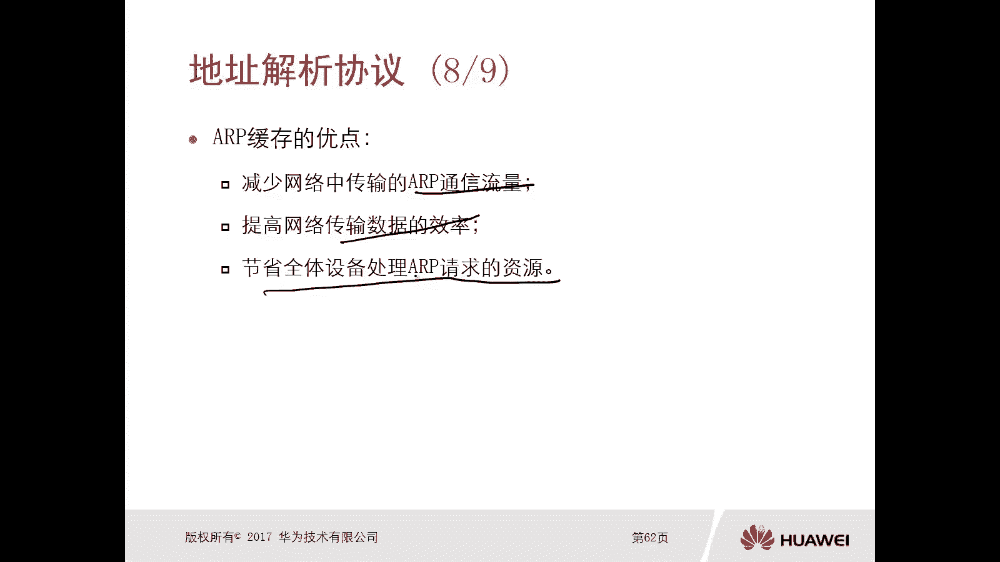
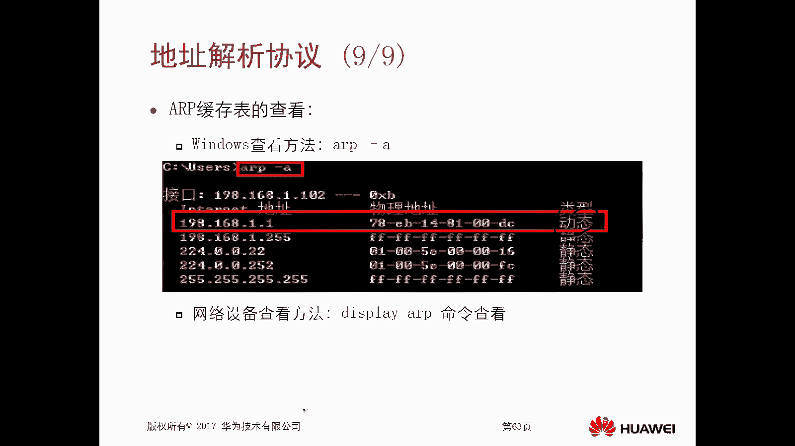
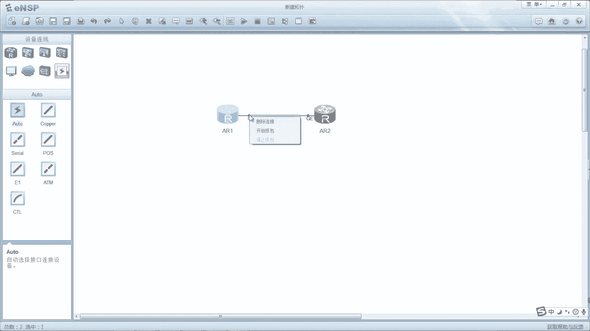
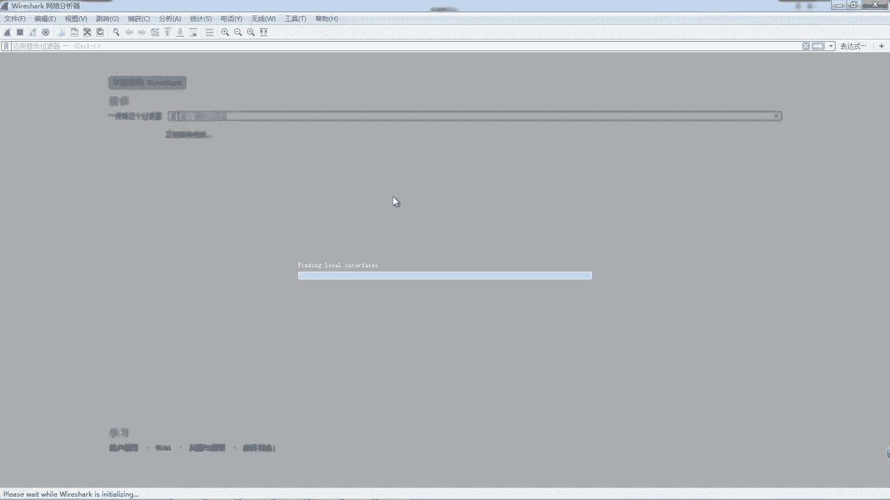
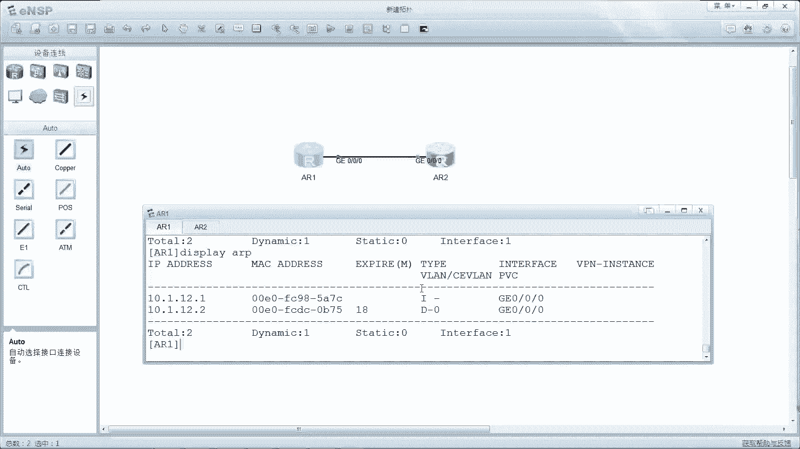

# 华为认证ICT学院HCIA／HCIP-Datacom教程【共56集】 数通 路由交换 考试 题库 - P20：第1册-第6章-4-ARP地址解析协议 - ICT网络攻城狮 - BV1yc41147f8

好，那么接下来我们讲一个非常重要的协议，叫做地址解析协议，Arp，好那么什么叫做ARP呢，叫做address resolution，political地址解析协议，那么我们首先看一下这个ARP的概念。

那么IP呢它的主要作用呢，就是用来根据目的设备的IP地址，来查询Mac地址啊，这样的一种协议，那么我们讲过这个层次，讲过封装啊，我们说在网络层封装的CP，那么在以太链上呢，我们封装的是这个Mac地址。

就是你在三层上呢有逻辑地址，那么在二层呢也得有逻辑地址，对不对，但是往往呢我们的三层的IP地址是可知的啊，你不管通过什么方式啊，这是可以知道的，我们最常见的方式就是通过DNS进行解析，对吧。

你比如说你要去访问百度啊，要去访问这个新浪啊对吧，我们都是有这个有一个DNS的对吧，然后你去百度他就会去解析成地址，但是这个Mac地址一般是未知的，就是目标Mac地址对吧。

你的原Mac地址肯定是已知的圆，这是已知，因为你自己的，你你的自己PC他自己是知道他的Mac地址对不对，但对于这个目标Mac地址怎么得到呢，哎就是需要进行查询查询得到，那么对于这个IP它实现的时候呢。

主要是使用到两种报文，第一种呢叫做ARP的请求，报文叫做request啊，Request，比如说你发送数据包的时候，你发现没有去往这个目标IP地址的一个manager，那么这种情况下。

这个PC呢首先要去发送AIP请求，那么请求的目的呢，就是请求又去往某个目的IP地址的地址好，那么如果说有PC收到了你这个请求，那么他会去做一个响应，那么叫做ARP的一个响应消息reply啊。

那么这个reply的一个主要内容就是OK，那么你想要去访问的这个目的的IP地址，Mac地址是多少多少多少，哎这样的话这个发送方呢就知道了，去往目的IP地址，它的这个manager。

那么就可以进行一个封装了，哎这是这个ALP啊，主要就是通过两个报文实现的比较简单，而且这个协议呢是比较基础的，我们必须要知道的，必须要学会的，必须要理解的啊，好，那么接下来我们先看一下。

这个AIP的一个请求啊，那么中间是一台交换机啊，中间是一台交换机设备嗯，那么呢下面呢我们有终端，终端一终端二终端三终端是吧，那么他们的地址呢也标示的非常清楚啊，分别是1。1。01，1。102。03和1。

04，Mac地址呢我们可以看一下啊，009ACD啊，这个开头都是一样的对吧，这个叫什么，我们前面讲过OUY对不对，后边呢是这个厂商id12223344，对不对，好，那么假设这种情况下，PCE啊。

就是这个终端一啊，要去访问终端三哎，就是就是P终端一啊，想要去访问终端三，但是终端一他不知道终端三的Mac地址，他只知道终端三的IP地址，不知道他的一个Mac地址，那么这种情况下呢。

实际上他是没法去完成封装的，他只能封装到三层二层的封装，对不对，他缺一个东西对吧，所以这种情况下呢，PC1终端一，首先他要去发送一个ARP请求，那么这个ALP请求报文，大家注意一下。

他的目的Mac地址是全F全F前面讲过了，表示的是广播，是一个二层的广播广播，然后这里边有一个目的地址，是1。1。1。3啊，那么这样的一个ARP的请求报文呢，它的作用呢就是OK请问对吧，1。1。1。3。

他的Mac地址是多少，请回复给我，那么这样的一个广播广播呢被交换机收到以后，交换机会向着除了该接口以外的其他接口，进行泛红，你看啊，这一口吧，他从二口转发一份，三口转发一份，四口转发了一份。

这种叫做泛红，除了收到的接口以外的其他接口都要去转发，这个叫上，那么这个泛红出去以后，我们看终端二，我的IP地址是1。1。3吗，不是对吧，和我没关系，因为你请求的是1。1。1。3的，对不对好。

那么和我中关系有关系吗，也没关系，因为我的地址是1。1。1。4对哎，这是第一第一个啊，第一个工作的一个过程就是发送端，它不知道目的设备卖地址的时候，会以广播Mac地址作为目地卖地址，封装成广播数据帧。

向整个网络里面去请求目的IP地址，对应的Mac地址，因为他不知道谁呀，反正我先广播出去吧，如果你是的话，你也在你回复我吧对吧，就是这个先放出去好，那么接下来让我们看终端二和终端三，都不是1。1。1。3。

所以他们不做任何响应，就把这个数据包丢掉了，但是终端三呢，由于它的地址正好是终端一要去请求的地址，所以说终端三要去做响应，那么他去做响应的时候，就没有必要去用广播响应了，他是用单播去响应。

为什么可以用单播，因为终端一发送的请求，报文里边包含了自己的IP地址，包含了自己的Mac地址，那么这样的话我终端C终端三完全可以用啊，单播迅速响应好，我们可以看一下它的原地址，用的是一点一点点三对吧。

目的地址用的是一点点一，那就是终端三要发给终端一的对吧，原Mac地址是这个终端三的Mac地址，3333，目的Mac地址是111啊，同时呢，这个ALP响应报文里面，涵盖了一个非常重要的内容，就是1。1。

1。3，他的Mac地址是009ACD333333，那么这个数据包呢只能被只会被终端销售的，这样的话终端一就知道了哦，原来三的Mac地址是009ACD3，33333啊，这样的话终端一呢就可以发起访问。

所以说AIP的工作方式，第二个就是目的设备会以自己的Mac地址作为新，作为圆的Mac地址，向IP请求包的一个始发设备，去发送单的AIP响应数据包，那么请求设备呢也就看到了，也就得到了目的设备Mac地址。

对吧，那这样就可以进行一个发送数据了，已经封装了对吧，同时，这个原端呢他会把这个ARP缓存下来对吧，我知道了，我知道一点点三，它对应的Mac地址是多少了对吧，这下我记住了，缓存下来。

那么在它的设备上呢会缓存一个高速缓存表啊，那么缓存表呢叫做ARP缓存或者叫做AP表，都是我们通俗的一种称法，那么这里面主要就是IP地址和MAI地址，这种关系，那么缓存下来。

那下次我再向着这个三去发送数据的时候，还需要进行请求吗，不需要了，直接发送就可以了，对诶这是这个ARP的一个缓存，它的目的就是OK，我可以去节省处理这个ARP请求的资源，不用再做好。

所以说IP的工作方式，第三个呢是原设备啊，知道了目的设备的Mac地址呢，就会将目的地址和目的Mac地址，做一个捆绑记录啊，缓存起来，建立一张二元组的AIP合成表，二元组指的是IP和Mac。

好那么对于这个ARP的缓存的优点啊，刚才其实已经提到了，我们再看一下，第一个是减少网络中传输的AIP的通信流量，因为你缓存表象了就不需要再重新请求了嘛，对不对啊，第二个呢是提高了啊。

提高了网络传输数据的一个效率啊，那当然你不去做泛红了，效率提高了对吧，节省了全体设备处理AIP请求的资源，因为为什么说是全体设备呢，因为ARP请求是广播，那广播你交换机要处理吧对吧。

然后你所有收到这个广播官网的一些，其他的PC也要处理吧对吧，他处理完了以后发现不是给我的，我才扔掉吗，都得处理，对不对，哎这是它的一个优点啊，那么在真实设备上我们可以看一下这个缓存表。

它的一个查看方式啊，比如说在windows操作系统里面，我们通过AIP杠A的方式就能看到IP地址，就用了好多对吧，Mac地址对吧，有好多IP地址都有好多Mac地址，同时呢后面呢由于类型有动态和静态对啊。

那我们通过ARP协议学习到的啊，就是动态，那么静态是怎么来的呢，静态是我们手工具配置的，手工可以配的啊，手工配的就是一个IP地址，再加mi地址，就可以了啊，这样好，那么接下来呢就给大家去做一个实验。

验证一下我们刚才讲的这个内容啊，好这个拓扑非常简单，就是两台设备啊，为什么别的东西啊，嗯我们在一和二上来，先去做一个最基本的操作，就是配个IP地址就可以了啊，哎我们由于我们前面做过这种类似的配置实验。

对吧，我就读出来了，这个地址是11。12。112，有配置一个名字对吧，标识小七零杠零杠零，这个IP地址是10。112。二二十四，哎，那么前面我们配置静态路由的时候呢，呃配过类似的这种IP地址对吧。

同时呢我们配完以后，我们应该在静态路由的时候做了个测试，就是A二一直接去P2通了，那么通过这个拼的命令去拼10。1。12。2，如果能通了，说明这个数据包肯定是经历了完整的封装啊，所以完整的封装里面呢。

肯定是包含这个网络层的封装，和数据链路层的封装，那也就是他知道了IP地址和magi，但这个通信很快，那怎么到底他怎么知道的呢，就是通过IP，那么一开始设备是没有去往A2，它的一个IP表象的。

我们可以看一下，通过display ARP哎我们能够看到啊，在华为的设备上是通过display AI p，你看到这里面呢，我们可以看到它只有自己的对不对，自己的IP地址和自己的Mac地址。

那么有没有去去往终端的Mac地址没有，所以这种情况下，我们去拼10。1。12。2对吧，然后呢在这个位置进行抓包，我们就可以抓到AIP的一个两个报。

分别是IP的一个请求IP的好，看一下里面的内容啊，好。

这个打开了啊，我们评测一下啊，预测一下，现在我们看得通了对吧，那么接下来呢我们把这个where shark打开看一下，抓包好，我们看到不好，我们看到的第一个包和第二包就是ARP，看到没有对吧。

一开始呢在这个发能够正常发送ISNPP猫，之前有一个AIP啊，LP第一个ALP我们看它的圆呢是一个Mac地址，是这个A21的Mac地址对吧，然后他destination是全F。

大家看一下broadcast协议是LP啊，CCIP好，那么AIP的话，我们看他是在请求谁的MAD呢，在请求target IP address med，他给的IP address maddude。

他给的IP address谁呢，10。0。12。2，所以说这个报文你看解析出来，它的info就是谁有10。1。12。2的Mac，请告诉10。1。12。1对啊，这样他放我出去以后呢，这个A2收到以后呢。

A2就可以进行回复了，那A2回复的时候可以用单波折去回来对吧，因为上一包呢是有这个Mac地址和IP地址的对吧，12。1，那么我就可以用单播去回啊，第一个报文呢我们可以看一下叫做request。

第二个报文呢叫做IP p replay呢，我们可以看到他回复的就是target的Mac地址，就是这个地址对应的Mac地址是多少对吧，target IP啊，应该是SERIP啊，注意一下啊，然后3。75吧。

对不对，这样的话实际上这个A21呢他就知道了，哎这个A2的ARP啊，我们在display ARP，我看他就缓存了这样的一个表象，这就是这个ARP的一个表，12。2，他那个id等于七五对吧，那么这样的话。

我后期ARE再发送数据包的时候，就不需要再进行ARP的一个请求了，就直接往外转，对不对，给了这个A2了啊，好当然这个AIP的时间呢，它是有一个超时时间的啊，你看这个现在是18分钟，对不对。

哎这写的应该是18分钟，对不对，那么不同设备呢他对AIP的缓存是不一样的，你windows有windows操作系统的，对不对，你路由器，路由器，交换机，交换机的等等等，他超时以后没有了AIP。

那怎么办呢，重新去做请求，所以说这个不是说你请求一次，它就永远存在了啊，他肯定是会超时的，好这就是这个ARP地址解析协议。

