# 华为认证ICT学院HCIA／HCIP-Datacom教程【共56集】 数通 路由交换 考试 题库 - P21：第2册-第1章-1-交换机对数据帧的转发 - ICT网络攻城狮 - BV1yc41147f8

好那么接下来呢哎我们看一下这个交换机，它的这个数据真的一个转发方式啊，呃那么其实我们在前面的章节里边呢，讲到过路由器对数据包的一个转发，对不对，那么路由器想要对数据包进行转发。

那么它必须要存在一个路由表对吧，然后收到数据包以后呢，根据数据包的一个目的IP啊，去查询他的一个路由啊，那么这个路由可能是通过静态配置的，甚至是通过动态学习到的，对不对，哎那么有了这个表象。

那么找到这个最终的一个正确的出口，就可以把这个数据包呢转发出去，这是当时我们讲路由器转发原理的时候讲到的，那么对于交换机来讲呢，那么交换机收到数据帧以后，他也要对这个数据帧做一个正确的一个转发，对吧。

按照正常来讲，我们要做一个正确的转发，但是交换机和路由器是类似的，那么它必须有依据去转发这个数据帧，那么也就是说交换机必须也存在表象，但是初始的一台交换机，或者是一台初始的路由器。

它是没有这些表现的嗯你想一台路由器对吧，你拿到以后插电，它是没有路由表的，你要么去配置静态路由表对吧，要么去配置什么动态路由信息，有这个路由表，那么同样交换机也是一样的。

初始的交换机里面是没有任何表象的，那没有表现的话，那么你交换机收的数据帧以后呢，是没有任何的依据能够正确地去转发这个数据，真对吧，所以这种情况下，交换机启动以后，第一件要做的事情就是要形成这个表现。

哎那这个表象是怎么形成的，哎我们看一下这个交换机的工作原理，那么初始化的交换机里面是没有任何表象，那么他到底是根据什么样的方式，去得到一个表象，得到一个什么样的表现呢，当我们交换机初始化以后。

你会发现我接到一台交换机上的所有的PC，只要我把PC配置在同一个IP地址段对吧，然后相互去测试它是能够互通的，一点问题没有，那么既然能够互通了，说明交换机已经存在了表象对吧。

你没这个表现肯定是没法通的嘛，对不对，肯定有问题存在，那么这个表象是怎么产生的呢，啊注意一下，一定是根据你数据包的一个发送啊，也就是说你数据包触发它产生的，那么假设当我一台交换机初始化了对吧。

连下面连了两个PCAB，那么A朝着B去发送数据，那么自然交换机就会从连接A主机的接口，收到了一个数据帧，这个数据我们可以想一下，它的原Mac地址是A，他的目的Mac地址是B对不对，OK那么这种情况下。

这种情况下，交换机就会利用从这个接口收到的数据帧，它的圆Mac地址去建立一个二元组的Mac地址表，OK好，这个的话，我觉得有必要去，把刚才我说的那个图给大家画一下啊，哎可以看一下IP。

据说一台交换机对吧，然后呢连接了两个PCAPC和BBC，那么APC呢连接是一口，BPC连接是二口，假设A朝着B去发送数据，那么A的Mac地址呢，比如说A杠A杠AB的Mac地址呢是B杠B杠B。

那么A朝着B去发的时候，交换机实际上它是没有任何表象的对吧，但是交换机A从一口收到了一个数据帧，那么他会利用这个数据帧里边的目的，而原Mac地址啊，原Mac地址去建立二元组，那么这种情况也有。

也就是说在交换机上它会去形成一个表象啊，锁定的接口是一口啊，Mac地址是从这个接口收到的数据，真的原Mac地址Mac地址是多少呢，是A杠A杠A，那么这种二元组的一个表就叫做Mac地址表。

哎那么你想可想而知，如果我们下面挂了好多PC，那么PC和PC之间相互发送数据以后，最终交换机一定会形成很多个这种二元组的Mac，这表有了这个表以后呢，我就可以正确的去转发了，那有人就讲了。

那你一开始你你是没有表象的呀，你没有表象，你怎么去把这个数据转发出去的呢，比如说A1开始发给B的时候，交换机上根本没有这个表象，那怎么样B就能收到了呢，我们看第二个，那如果说你交换机收到一个数据帧。

发现这个数据真的目标就是目的，Mac地址在自己的Mac地址表里面，那么当然这种情况下，他肯定就是从这个对应的接口进行转发，但是比如说刚才我们讲的例子是，A朝着B要去发出去。

但是交换机一上面有没有Mac地址表，对应这个B的Mac地址呢，没有对吧，没有的话，那么当交换机从比如说我们这个例子里面，从一口收到一个H网B的数据帧，但是他不知道怎么转，那么这种情况下。

交换机会向所有的端口进行转发，这个叫做泛红float，所以说你一开始交换机里边虽然是空的表象，没有任何表象，但是由于你是空的，那么A朝着B去发送信息的时候，发信息的时候。

那么你交换机上发现还是没有这个表现的，对不对，但是交换机呢就做一个泛红，那么泛红实际上呢二口也会被收到一份，这样B就收到了，唉这个呢叫做泛红。

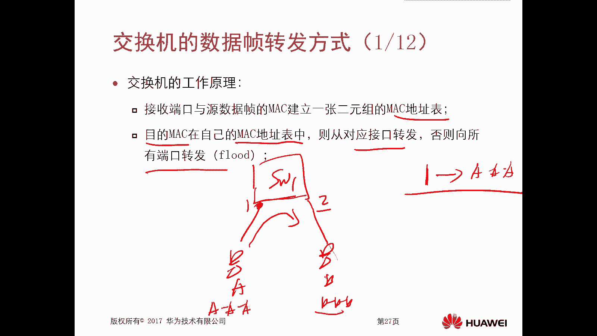

那么泛红实际上刚才我们看到的那种效果啊，就是你收到交换机收到一个数据帧，但是这个数据真的目的，Mac地址，在它自身的Mac地址转发表里面是不存在的，那么它会去泛红，那么这种泛红呢叫做未知单波的泛红。

未知单播，这个指的是你交换机不知道这个Mac地址，所对应的接口是谁啊，叫做未知单播范围，那么除此之外还有两种泛红方式，当交换机收到广播帧或者是主播针的时候，他也会执行一个泛红动作。

唉那么交换机的工作原理呢，大概是概括这么三句话，第一个呢就是我们去建立这个Mac地址表，是怎么建立的，它一定是根据端口和从这个端口收到的数据，中的圆的Mac地址去建立的啊，然后是转发。

如果有对应的表象正确转发，如果没有，就是泛红，还有就是当你收到广播帧和主播针的时候，也是泛红，OK那么我们后边呢就一个去看了，后边就一个去看了，嗯这是这个交换机的工作原理的一个概述啊。

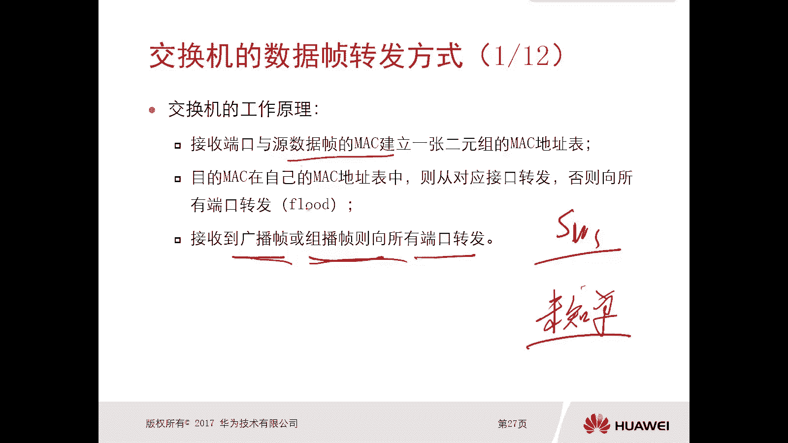

那么接下来我们看一下这个交换机，Mac地址表的建立，我讲了很多了，这个图换机他有连接了四个终端，终端1234是吧，那么呃终端一呢是连接的这个一口，那么这种情况下，如果说终端一发送出来一个数据包啊。

这个数据真，那么这个数据真，如果说它的原max字段是009，A c d11111，那么这种情况下交换机哎他就意识到了哦，原来E0杠，零杠一连接的设备的Mac地址是009，ACD11吧。

因为你想终端一发出的数据，它的原max段是不是就是终端一样对吧，所以说交换机就认为这个接口连接的是111，这个Mac地址没有问题对吧，所以说在交换机里面呢就会形成一个表象，端口一零杠零杠1mac地址。

009ACD111111哎，那么其他的呢都是这样的，包括中端二，中端三，终端四对吧，你发的数据的时候，交换机都是根据所在机口，就收到这个数据的接口，它的原Mac地址就是真的原Mac地址去形成的变形。

所以这这里面有个非常重要的地方，就是交换机去学习的时候，一定是根据数据帧的原Mac地址，而不是目的Mac地址对吧，哎一定要注意一下啊，而不是目的白体型，那有人就讲了，你你交换机你初始化的时候。

那你下面的终端设备根本不知道对端设备的Mac，你怎么能够学习到MAD这表呢，哎你注意一下，我们前面讲过ARP对吧，那你终端一去访问终端二或者中端三，或者中端四的时候，你没有这些终端的Mac地址。

那么你终端一首先要做的叫做什么，叫做ARPIP方，那你ARP泛红，你的目的Mac地址是全F，但是你的原Mac地址是不是，就是你终端一的Mac地址，也就是说当我们终端在未通信之前。

你发出来的AIP其实已经被交换机利用，然后通过ARP报文的原Mac地址，去创建了这个表象，那既然有了这个表象，后期我再去转发数据的时候对吧，就可以根据表现已经转了，哎，就是这个Mac地址表。

它的一个建立过程一定要注意一下啊，一定是根据数据真的原Mac地址，而不是目的Mac地址，那么什么时候会用目的Mac地址，转发数据的时候才会用。

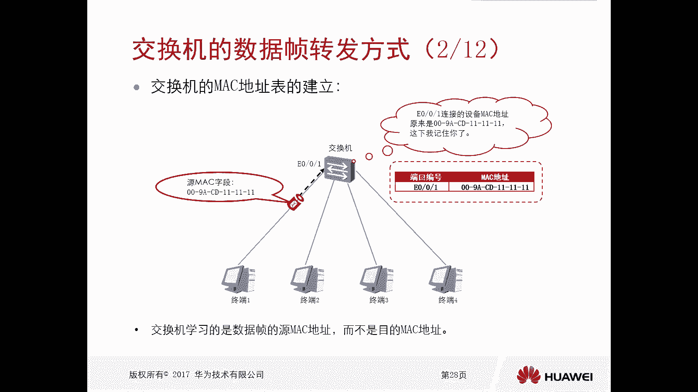

转换的时候才会用好，这是一个创新的过程，那这个表象呢是不是也得去进行维护呢，哎是要维护的，那么交换机Mac地址表的维护怎么维护，我们看第一个，再次同一个接口，说到相同Mac地址为原Mac地址的数据帧。

它就会用新的时间来更新这个Mac地址条目，在交换机里边，只要它产生了Mac地址表，那么这个Mac地址表它会生存300秒，如果300秒过后依旧没有更新，那么它就会删除，那这个300秒呢叫做老化时间。

所以说第二条呢就是在老化时间之内，如果没有通过这个接口，再次收到这个Mac地址发来的数据，它就会将这个老化的条目，从自己的Mac地址表里面进行删除，哎，所以这很重要的一个概念就是卖地址表。

在交换机里面它是有老化时间的，哎你从相同端口收到一个这个数据帧对吧，它就会更新它啊，如果一直没有收到超过300秒，那么把它删除，那么我们怎么在交换机里面去查看。

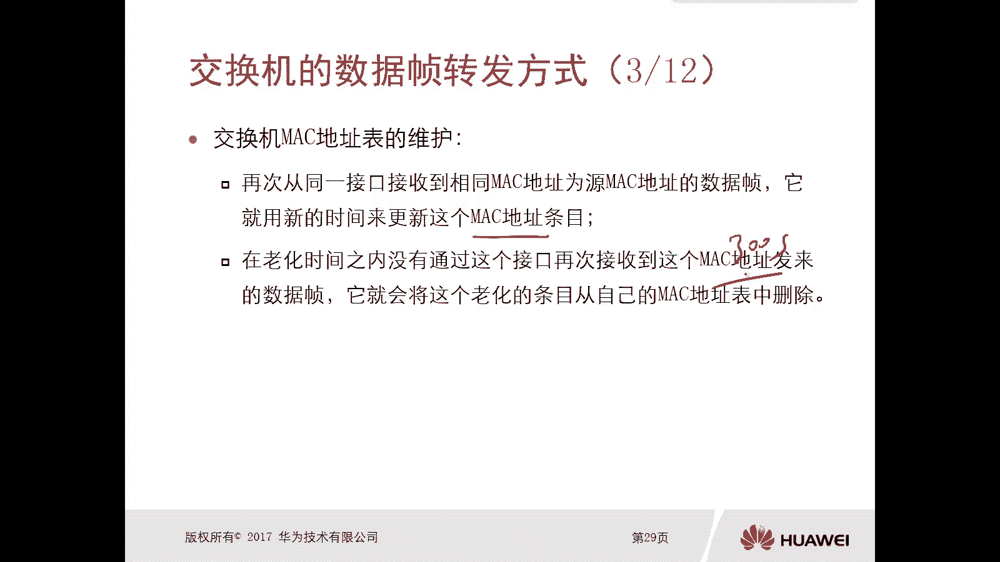

甚至是修改他这个老化时间呢对吧，因为可能在某些特殊的场景下，你需要去更改30秒，可能不够长一点或者短一点，对不对，那么怎么看呢。

查看的方式就是display Mac address ugin time对吧，修改的就是Mac address in time，后面写一个这个描述就可以了啊，这个命令非常简单。

大家下来可以在这个交换机上去做一下，我在这就不去做了，嗯那么还有一种情况可能会使得这个交换机，Mac地址条目老化。

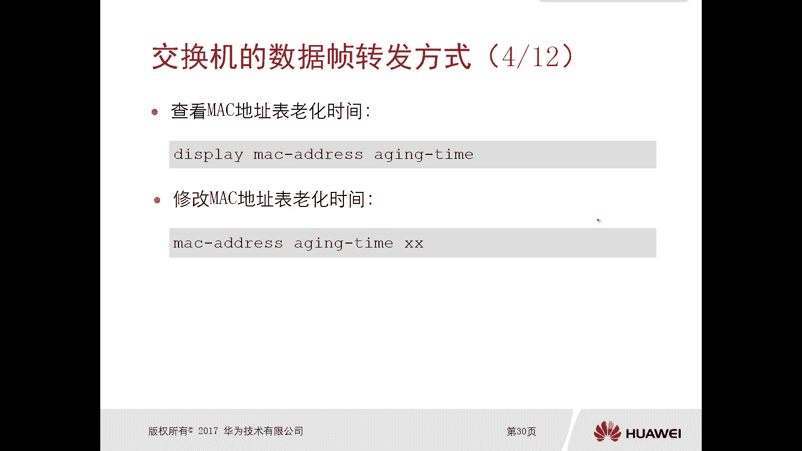

那么刚才我们讲的就是你没有数据来，就老化掉了，对不对，那么另外一种情况呢，就是比如说你这个链路出现故障了是吧，哎出现故障了，那么这种情况下，这个交换机可能意识不到有这个故障。

如果说交换机意识到了有这个故障，比如说接口down掉了，注意一下啊，如果是接口down掉了，那么这个接口相关联的所有的Mac地址都会删除，这个表现就会删除，但是如果说这个链路确实有故障。

但是不是物理的故障，它就是不通了，但是接口交换机的接口还是up的，那么你想这个交换机，它是不是永远都收不到终端一的一个数据帧了，哎这种情况下只能是等待三秒把它删掉，没有吧，哎这是这个呃维护啊维护。

那么对于这个刚才我们讲到的交换机，它产生Mac地址表的方式，刚才我们讲的是动态的方式，因为它就是根据你这个数据帧的原，Mac地址去形成的，对不对，但是实际上除了动态。

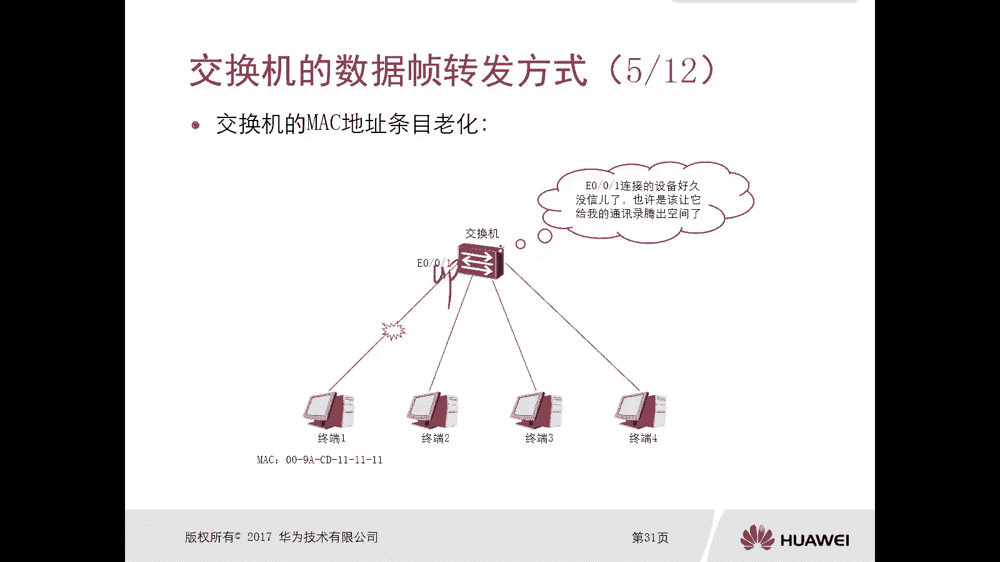

还有一种方式就是静态哎，就是静态，好，那么静态实际上就是我们通过手工的方式，在交换机里面去写入一个Mac表，那么静态添加的Mac地址啊，它是它是优先级，是高于交换机，它通过自己接口动态学习的条目。

那你比你比如说你静态就已经给他指定好了，那动态学了以后还会不会用呢，是不会用的，而且这种静态的和我们动态的不一样，动态它有300秒的老化时间，那么静态呢是不会受到老化时间影响的。

它会一直保存在交换机的Mac地址表里面，除非你手工把它删除啊。

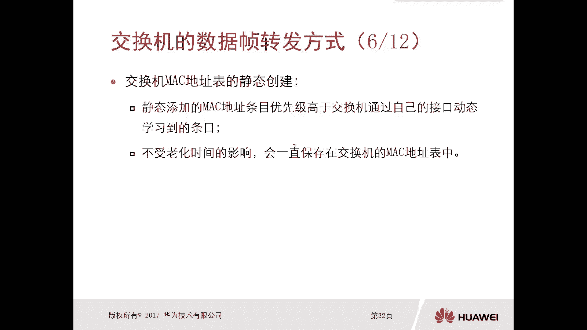

那怎么去通过静态的方式去添加Mac地址条目呢，哎就是在我们交换机里面去通过Mac address static，后边呢是一个Mac地址，紧接着是一个机考危难，你看啊，通过这个命令我们可以看出来。

实际上在一个Mac地址表里边，最基础的是有三元组，而不是二元啊，哪三个组Mac地址接口和van，那由于我们围栏还没有去讲啊，所以说重点我们关注这两张图Mac地址和接口，哎所以说现在我们应该都清楚了吧。

一个交换机里边，他的Mac地址表其实最主要的是两个部分，一个是Mac地址，一个是接口，哎，有了这个呢我就可以转发数据了。

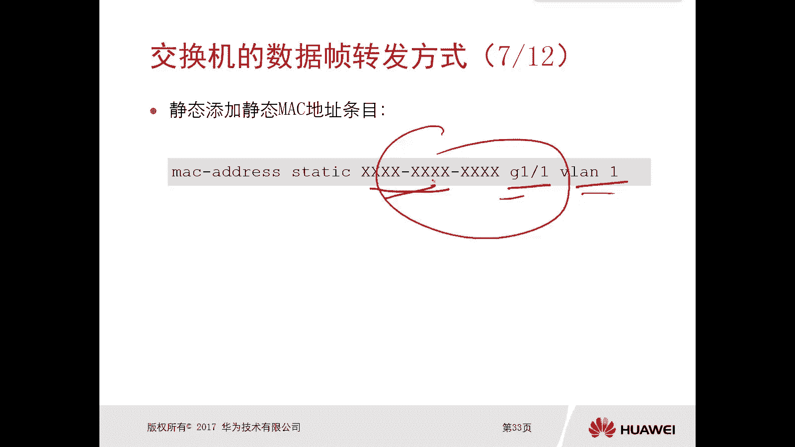

哎就可以转发数据，所以说，当一个交换机收到一个单播数据帧的时候，当然你你比如说你AIP，这是属于广播帧了对吧，广播帧那就是泛红，当交换机收到一个单播数据帧的时候，他一定会查看二层头部信息。

就查看Mac地址，查看Mac地址，查看Mac地址，他可能会原地址，也可能会看，他查看原Mac地址的作用是什么呢，就是去填充自己的Mac地址表，说白了就是学习Mac表。

那么查看目的Mac地址的作用是什么呢。

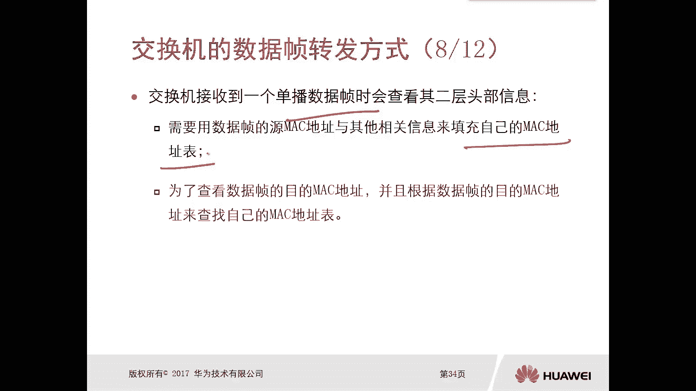

就是用来去正确的去转发这个数据对吧，转发去输进，那么对于交换机去查询Mac地址表。

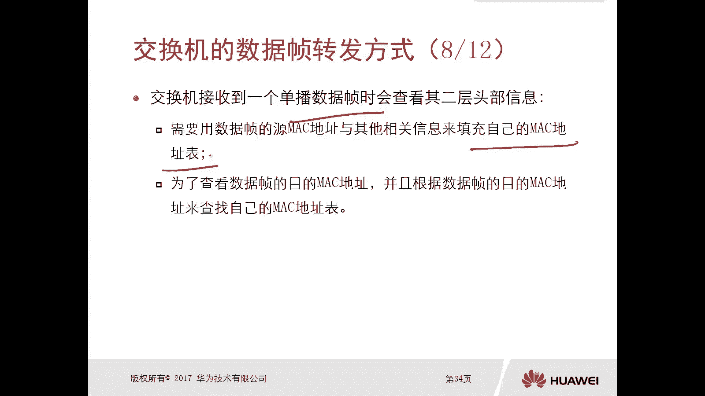

以后的一个结果，对数据帧进行处理的时候啊，是有三种情况，第一种情况就是查了以后泛红，那么就是交换机以查询这个数据的时候，发现这个数据真的目的Mac地址对吧，在我的Mac地址表里面是找不到的。

那么说明我交换机都不知道，这个数据应该从哪个接口转换出去，这种情况下他要泛红，我给所有机会转发一份对吧。

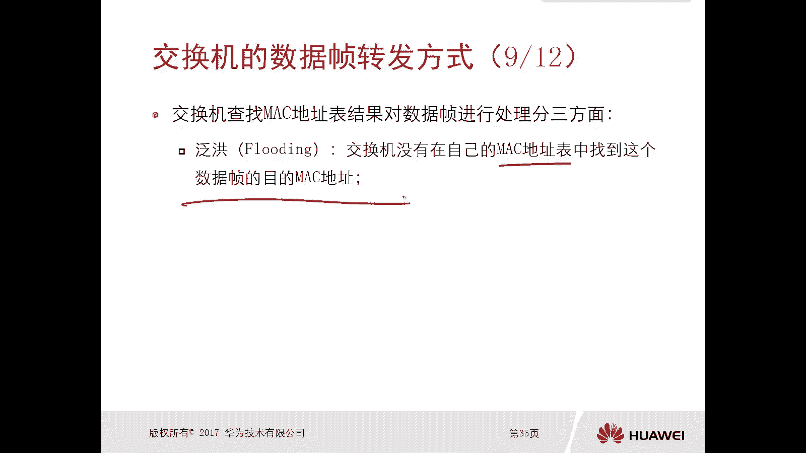

试一下吧，看看你有没有这个叫做泛红，那么另外一种呢，就是比如说我在交换机里面，查到了某个目d Mac地址这种数据帧的一个表象，那么能够找到一个正确的接口，唉，这种情况下。

他只需要把这个数据帧从正确的接口转发出去，就可以了，唉这个呢就是转发，那么还有一种呢就是丢弃。

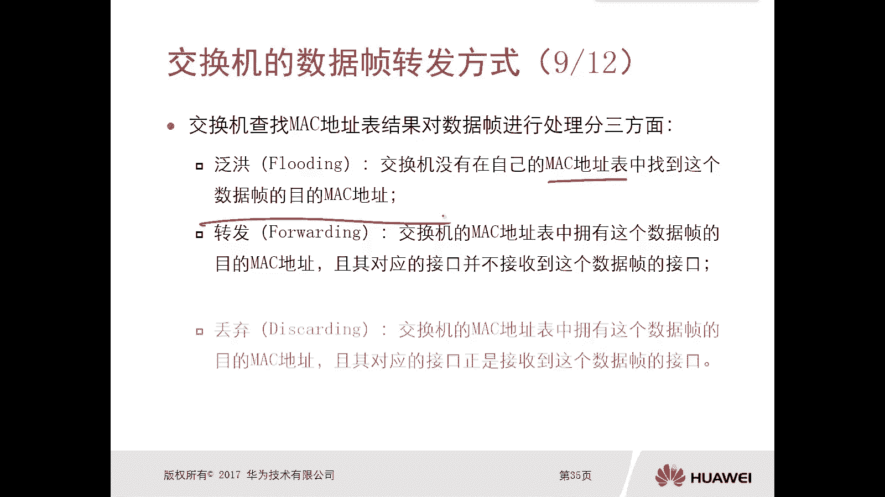

那么交换机它的Mac地址表中，如果说拥有这个数据真的目的Mac地址，并且它对应的接口正式接收到这个数据，真的接口，那么这种情况下一定是丢弃的，哎那么可能我们这三个啊，就是这三种情况啊。

通过这个文字读出来可能不是那么深刻，接下来我们看一下动图啊。

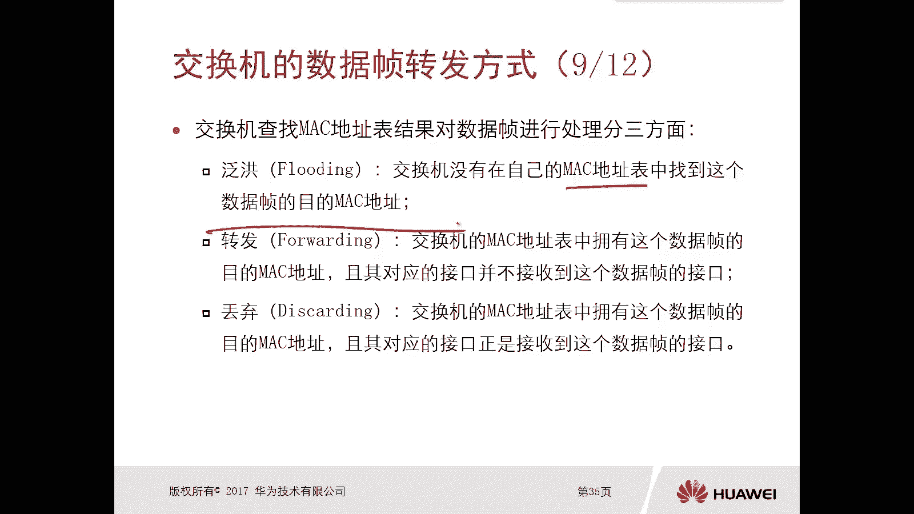

我们看动画啊，哎比如说我们先看第一种这个泛红这种方式啊，你比如说这个交换机上，它现在呢已经有了两个表象，分别呢是呃一口的，这个一口连接的这个PC1的这个买地址，1112口二二，但是他还没有三口的333。

假设啊，他没有三口的三三这个表象，那么这种情况下，比如说PC1发送了一个数据帧，这个数据帧呢它的目的Mac地址是3333，注意一下啊，这个是目的Mac地址是333，那么原Mac地址一定是111对吧。

那这样的一个数据帧呢，是不是意味着我要去访问333这个PC，那么这样交换机收到以后，首先他查询了原Mac地址，哎发现我已经有了这个表现了，不需要再创建了呢，去看他这个目的的，你要去往3333。

那么我要去查找我的Mac地址表，里面有没有这个Mac地址，333它对应的一个接口，发现我没有这个表对吧，哎我也不知道怎么找，那那我不管了，我就把这个数据帧从所有其他的接口，注意一下，是所有其他的接口。

是除收到这个数据帧以外的，其他结构都转发一份出去对吧，因为我也不知道，反正我发了这种就叫做泛红。

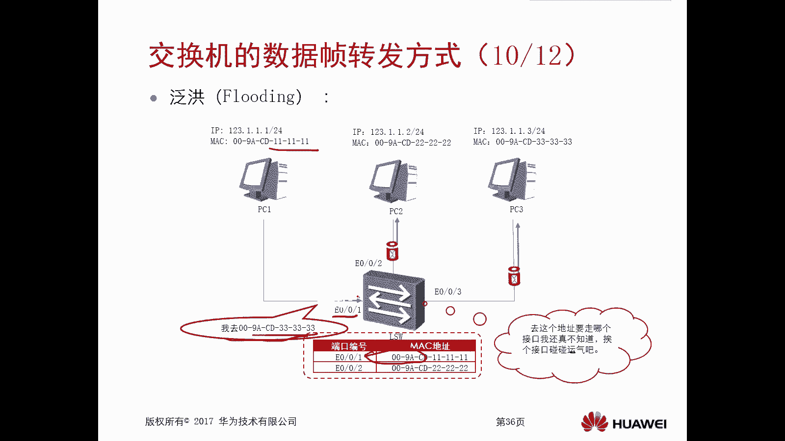

那比如说第二种转发还是这个图啊，一口和二口买DJ112，比如说现在PC1又发生了数据帧，那这个数据真的一个目的，Mac地址是谁呢，是2222，那么交换机收到以后呢。

发现我的Mac地址表里面是有2222这个Mac的，同时它的接口是哪个接口二口，这种情况下，交换机呢就会执行一个转发，把这个数据对呢，从100杠二口转发出去，哎这就是一个单点的转发了，不再是发红了吧对吧。

APC1发过来的，要发给PC2，只有PC2能收到，哎，这是有表现的情况下，哎这个叫做转发，那么第三种呢丢弃丢弃，那么丢弃呢还是这个表象啊，伊尔考幺幺和R2mac地址，那比如说PC1发出来的一个数据增。

这个数据帧它的目的Mac地址也是111，这个正常情况下肯定不会的对吧，你看目的Mac地址是自己啊对吧，你自己给自己发出去，正常情况下肯定不会有这种情况，比如说被攻击了，比如说中毒了。

很有可能有这种情况吧，对不对，诶，那么这种情况下交问题，收到以后，发现你要去往1111这个Mac地址对吧，那我就去查查我的表象，发现我的表象里面是有的，但是奇怪的事对吧。

1111这个地址它的出接口是零杠，零杠一和，现在我收到这个数据真的接口是一样的，诶，那么这种情况下交换技术诶，你去1111，你自己就是啊，你干嘛找我呀对吧，这种情况下交换机要执行的动作是丢弃哎。

这是这个交换机的转发方式啊，那么注意下，那在这里边呢我们主要是讲了两大部分，一个呢是交换机它的一个工作的原理，它没有表象，它必须要形成一个表象，叫做Mac地址表，怎么形成。

就是根据收到数据真的一个原Mac地址去丰富，或者说去动态产生它的Mac地址表，然后有了这个表象以后，我收到数据帧以后，根据表象到底是转发，到底是泛红还是丢弃。

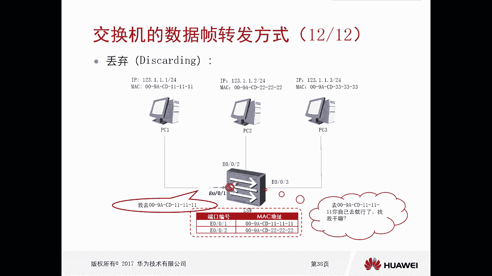

那么重点强调一点啊，我们这个泛红注意一下，其实有两种泛红，刚才我们看到这种泛红叫做未知单波泛红，这个我刚才也解释了什么叫做未知单播，就是我说的一个单播帧，单播帧，但是这个单播帧里面的目的Mac地址。

在我表现里面是没有的，就是位置单播放，第二种情况呢就是当交换机，你收到的是一个广播帧，比如说AIP或者是一个主播针的时候，他也会泛红，好，这就是我们交换机。

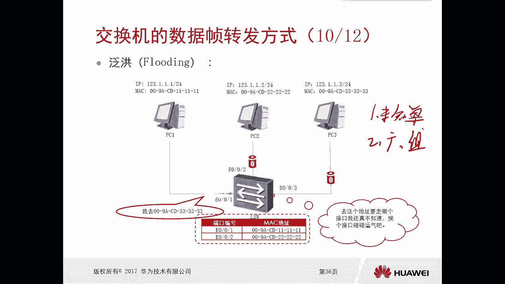