# 华为认证ICT学院HCIA／HCIP-Datacom教程【共56集】 数通 路由交换 考试 题库 - P22：第2册-第2章-1-VLAN的用途 - ICT网络攻城狮 - BV1yc41147f8

好那么接下来我们看一下这个van的一个用途啊，那么呃首先我们先看一下这个交换基因，它的这个工作特点的这个利弊，那么前面我们讲，这个交换机对数据真的一个转发的时候，实际上我们应该已经了解到了。

交换机的工作特点，那么首先第一个呢，就是我们交换机可以实现即插即用对吧，你只要拿了一台交换机，只要插电插网线就可以实现这个转发了对吧，按时间转发了嗯，所以说呢这个很有可能会存在一些问题。

那么第一个问题呢就是这个二用户，那么可以利用这个交换机的工作原理啊，去发起一些网络攻击啊，那么交换机的工作原理，我们在前面呢也简单介绍了，对不对，它主要是形成这个Mac地址表。

然后利用Mac地址表进行数据的一个转发啊，那么最终呢是我们点到点的转发，那么一开始肯定没法做到点到点的转发，那么就会有什么AIP的泛红啊，或者未知单波的泛红啊，对不对，但最后呢。

当我们交换机上有各种各样的，Mac地址表现的时候，那么收到数据帧的时候呢，就可以进行一个点到点的一个转发啊，所以说呢这种恶用户呢就可以利用这个交换机，它的工作原理发起一些网红机，那么后面呢也会简单介绍。

那么第三个呢就是呃通信的数据呢，在局域网里边是没有私密性的啊，是没有私密性的，那么这个怎么解释呢，那么由于由于我们交换机呢，缺少的都属于同一个广播域，那么所以呢，如果说如果说你没有做任何技术手段的话。

那么所有交换机的端口之间都是可以互通的啊，那就没有什么私密性了，对不对，都可以互通的好。

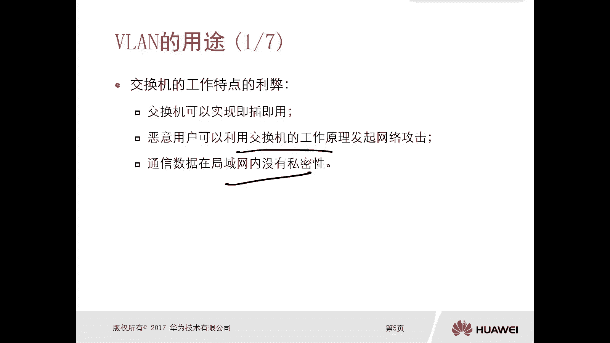

那么对于这个没有微量存在的情况下，的一个交换机，那么很有可能对吧，它连接的是不同的一个部门啊，连接不同部门的一个终端，那么由于是没有这种微量的技术啊，所以说你连接到同一台交换机上的，不同部门的所有终端。

实际上是处于同一个广播剧里面的，实际上是处于同一个广播域里面，那么广播域我们前面应该有章节，会有章节介绍了什么是一个广播域，那么广播域呢就是只要我有一个用户发送数据，发送一个广播数据。

那么在整个这个域里面，所有的其他的主机都能收到，这就是广播域，你比如说我们可以看一下这个交换机，下面有什么工程部的员工终端呀，市场部的销售部的财务的，那假设工程部的这个员工终端。

只要他发送一个AIP的广播，那么这个交换机呢，他会把这个广播信息呢，会泛红给所有的其他部门，假设我与我这个工程部的员工中专啊，他只是想去访问工程部的其他的员工，但是他也会发ARP。

但这个AIP呢就会放我到其他的部门，你想啊，我只是想和我本部门的某些终端设备进行通信，你这个ARP的请求有必要泛红到市场部，销售部财务吗，没必要，但是由于交换机缺省，所有连接终端都处于广播域。

就会有这样的一个问题，就会有这样的问题哎所以呢在这种情况下，有可能就会存在一些攻击来跟他们讲，让他们那个提到的一些攻击啊，那么怎么攻击呢，那么就是利用交换机的工作原理啊，比如说我们这个工程部的员工。

他是一个技术宅，对不对，他懂其他什么市场部，销售部财务不是一点都不懂技术，对不对，那工程部的员工呢很坏啊，他利用交换机的工作原理啊，他知道，那么我们的交换机的Mac地址表啊，那么不同交换机呃。

它能够容纳的这个Mac地址表，象的数量是不一样的，如果满了，他就成不了，假设啊，假设一个交换机的Mac地址表箱容量只有50个，那么他只能乘50个，你来了60个终端，那肯定就会被剃掉一个，明白是吧。

哎它这样的它有上限的，所以说呢这个工程部的这个技术宅员工对吧，他就唉想着哎，我要是把交换机里面的Mac地址表，全部都给他占完，那是不是其他部门所有员工发送出的数据，都会被我输给一份诶。

为什么会有这样的效果呢，你想如果说我工程部的员工对吧，我仿造大量的数据，那么我是变更这个圆圆的圆，这个Mac Mac的这个字段变更，那么使得交换机呢会记录下来，从这个接口啊，这个接口领口对吧。

收到的好多个Mac地址，那么致使交换机的Mac地址容量了没了没了以后，那么这种情况下，你其他部门在发送数据的时候，发现找不到Mac地址表，那么就是一个位置单不泛红，那么你甭管是市场部发送出来一个。

还是销售部发送出来一个，对不对，哎你比如说我市场部是朝着财务部去发的，但是呢这个数据呢，肯定是会能够被这个工程部的员工给接收到，同样你财务部朝着销售部去发送的一些信息，甚至是你财务部内。

你财务部内部的这个员工，就是财务部门内部的员工之间发送数据的时候，也会被工程部的员工，甚至是市场部，市场销售部都能收到一份，因为全都是未知单播放广播域嘛，对不对，哎所以这种情况下呢。

哎就可以达到一个间接的攻击，我是不是可以窥视到了对吧，财务部的一些敏感的数据，那这样对于财务部或者其他部门来讲，那这个数据在这个网络环境里面，实际上是没有私密性的，对啊，你看啊这个交换机的端口被占满了。

对不对，那么后期你这数据包肯定不行了，所以财务部呢完全找不到安全感啊对吧，为啥要把我和技术宅连在一个局域网里面，那我们理想的一个状态呢，就是哎你工程部员工的终端在一个局域网里面，市场部在另外一个局域网。

销售部在一个局域网，财务部在另外一个局域网，以不同的部门应该是处于不同的局域网，处于不同的广播域才对，你处于同一广播域，肯定是有问题的，好这是这个比如说我们不同部门啊，有可能会终端连接到同一个广播里面。

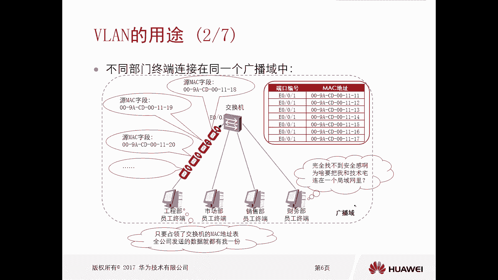

那么还有一种情况，就是很有可能我们同一个部门的终端，它连接到了不同的广播域里面，那你你比如说上面那个不同部门中。

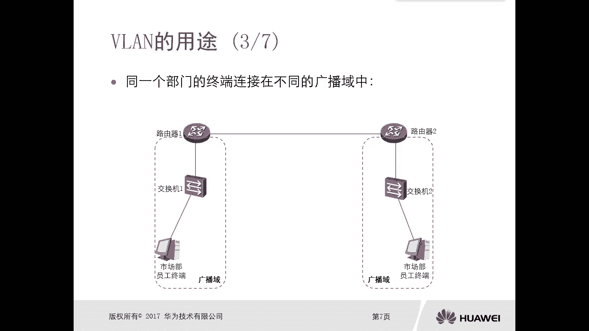

终端连接到同一广播域里面，这个很有可能原因造成这个原因呢，是比如说我的工资规模比较小对吧，我我没有那么多这个这个这个办公室，我只有一个大办公室，然后一个大办公室里面只有一个交换机。

那一个大办公室里面又有什么，销售部，有工程部，有市场部，财务，可能每个部门只有一到两个人对吧，没办法，我放在一个交换机里面对吧，但是什么样的原因会造成同一个部门的终端。

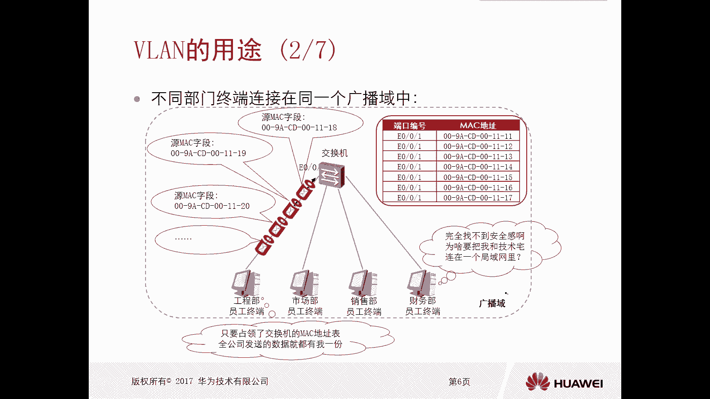

连接了不同的广播域呢，那就是大公司了对吧，哎你比如大公司，我可能由于这个部门他们之间的位置，这个位置不同，距离比较远呀，或者说我一个部门里面的人员比较多，一个交换机你hold不住。

你可能又挂到两个交换机对吧，唉甚至中间可能有路由器的一个这个连接，你比如说你看我们这个图里面啊，这这这这左边的是市场部的员工终端，那么右边的也是市场部的员工终端，按照这个来讲呢，你你属于同一个部门啊。

你同一个部门的员工终端呢，建议是放到同一个广播域里面，但是呢由于我们刚才讲到的呃，交换机端口数量的问题啊，或者是这个你们处于不同物理位置的问题，这个连接比较远的问题，对不对，可能会造成你相同部门啊。

就是同一个部门的终端，连接在不同的广播域里边，那么这种情况下，你想我这个市场部门员工对吧，要朝着另外一个市场部门的员工去发生数据，说唉我的营销策，我的营销策划方案，你帮我提提建议呗。

但是这个呢是没法通过网络，让另外一个广播域里边去收到的，因为我们不属于同一广播域，如果说你想让不同广播域实现能够通信，那么这种情况下必须要依靠于路由器，哎呦有路由了对吧，那在这种情况下。

这边交换机那怪我喽，你说不得怪我咯，我也没收到对吧，那么交换机一二，交换机一呢，就是这个没办法，我只有48个端口对吧，你一个部门你可能有上百人，你不能怪我对吧，你如果说我你这个你这个部门你只有40个人。

OK那你自己直接过来不就行了吗，把这根线直接连过来不就好了嘛，对不对，但是现在不够用啊，那么路由器也有理啊，你和我没关系哦，你没有给我配路由，我掌握不了对吧，很有可能会有这样的问题。

那这时候你在纯交换网络环境就解决不了，你还得还得在路由器上配路由啊，那么微软技术微量技术叫做虚拟局域网啊。

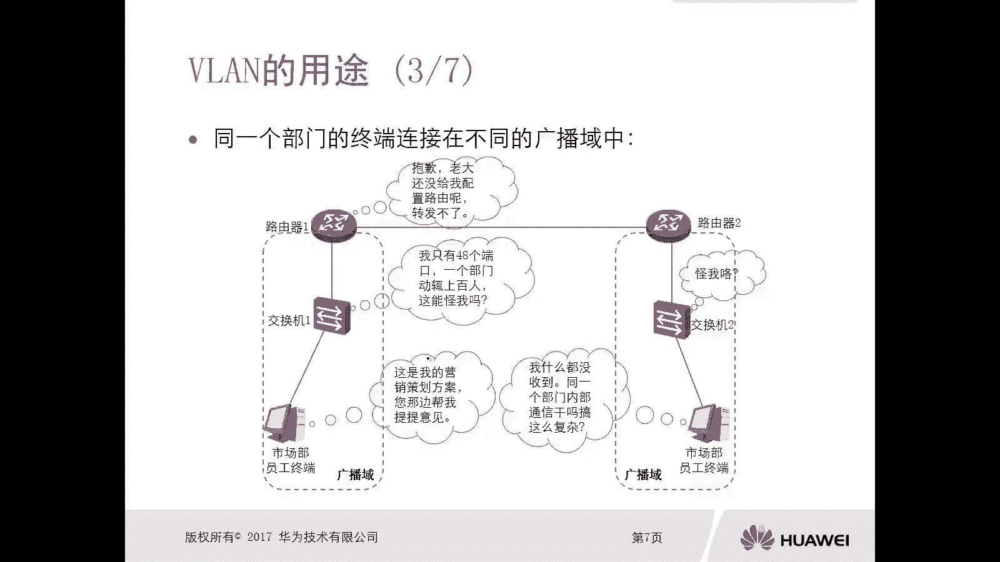

叫做虚拟局域网，那么微量技术是什么技术呢，第一个，我们可以通过逻辑的手段，重新去分配物理资源的虚拟化技术，它是通过逻辑的一个手段啊，重新分配物理资源的驯化技术，那么实际上我们所有的华为交换机出厂呢。

所有的端口都属于同一个微微一，所以说你所有的端口在不做任何操作的情况下，它属于同一个围栏一，也就意味着它属于同一个广播域，那我是不是可以把交换机的端口给它，分配到不同的微量里面。

那么不同的危难之间是属于不同的广播域，相同的微量属于同一广播域，那这样是不是我可以把一个大的广播域，划分成多个小的广播域了，哎这就是微量技术，我可以将物理资源嘛，一开始大家都是同一个交换机上的对吧。

然后我给他画成不同的微量，通过虚拟化的技术，达到一个重新分配的一个这样的结果，那么通过逻辑的方式啊，可以将某些特定的设备组成一个广播域，那这个刚才我们你看上面那个只是讲的，比如说我们在同一台设备上。

你可以为交换机分配不同的备弹，甚至我们可以为不同的设备啊，有不同的设备，不同的交换机设备给他通过逻辑的方式去设定，是不是处于同一法律，也可以跨设备的啊，也可以跨设备，所以说呢我们不需要去考虑。

这些设备连接的是不是同一台交换机，你跨多台交换机也没有问题，也没有问题啊，OK好，那么在这呢我可以简单给大家画一个图，你比如说刚才讲到的这个交换机，那么它一共有一个端口，两个端口，三个端口，四个端口。

假设啊有这么四个端口，那么如果说你没有微量技术的一个，参与的情况下，那么四个端口都属于微量一，那么呢你这四个端口连接了PC以后呢，我们实际上认为这四台PC呢，它是处于同一个岗位的，那么这种情况下。

你甭管是一考去发送一个广播还是二口，那么其他的所有接口都可以接收到，那么如果说我们设定了围栏，假设我把一二口发到一个围栏里面，三四口划到另外一个围栏里边，那么这种情况下，比如说这个是VLAN1。

这边是VLAN2，那么这种情况下，一二口属于同一个广播域，三四口属于同一个广播域，那么这种情况下，你一口发送的一个广播数据，只有二口能被接收到，三口四口是收不到的，那这样的话，是不是我将一个大的广播域。

划分成了两个小的广告语，对不对，这是从逻辑的层面去看看，我们是不是也可以认为实际上一个不同的微量，就是一个不同的小交换机啊，是不是我们可以认为微软实际上是虚拟交换机，对不对。

你这是一个原来你没有微量的情况下，这是一个大的交换机，那么做了微软以后，我就是微软就是一个小交换机，那么怎么实现跨交换机的一个villa呢，那么比如说我们这边也连了一个交换机。

那也有一口二口三口四口四个猴对吧，如果说你不做微量的话，那两个交换机实际上是属于同一广域，那么比如说我这边的一口和二口，给它放到了van2，三口四口放到了V101，那么这种情况下，这种情况下。

比如说这个是交换机，一个交换机二，那么交换机一的一口和二口与交换机二的啊，三口和四口处于同一个广播域，唉，然后交换机一的三口和四口，与交换机二的一口和二口处于同一广播域，那么主要就是看V了啊。

所以说你不用去考虑这些设备，是不是在同一台设备上。

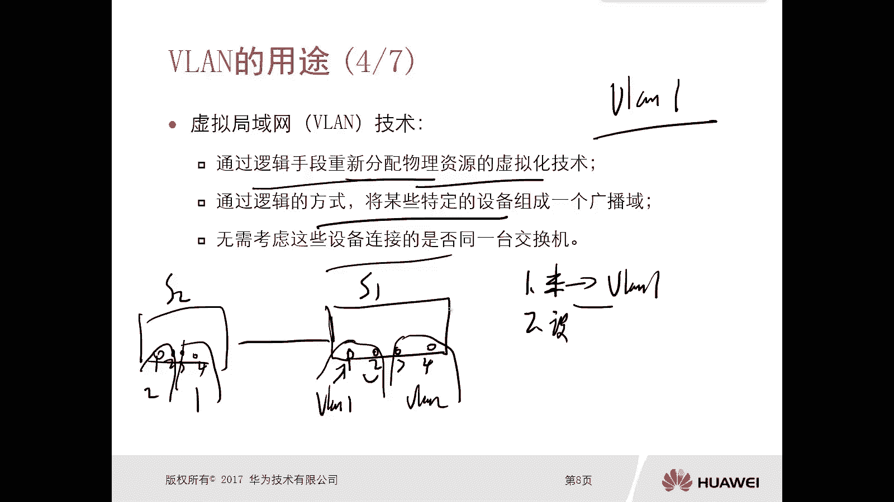

哎那这样的话实际上就解决了，刚才我们前面遇到这个问题，这两个问题吗。

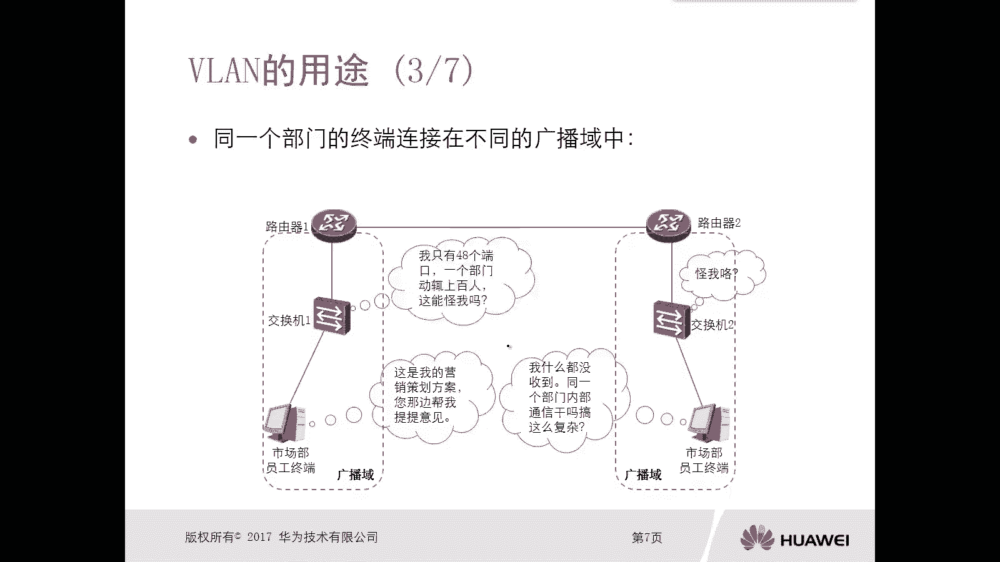

第一个就是不同部门已连接到通广播右边，那这样的话我是不是我可以把这些接口给它，放到不同的微量里面去对吧，你比如说这个未来属于这个工程部的，哎，这个未来属于这个市场部的，这个未来属于销售部的。

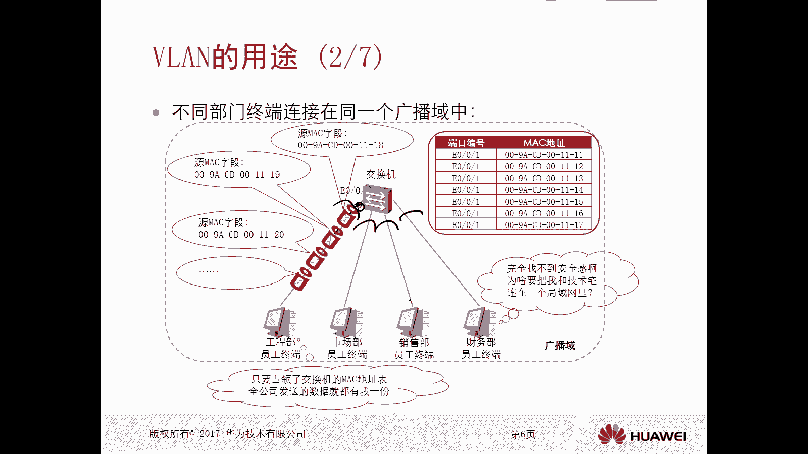

那这样他们四个就隔开了呀，同时即使你部门同一个部门的员工比较多，一个交换机搁不下，没问题啊，我隔两个交换机啊，中间搞一根线对吧，那这边你属于微量一，这边也属于微量一对啊，虽然是不同的一个交换机连接。

但是呢我们还是同一广播域对，就解决这个问题。

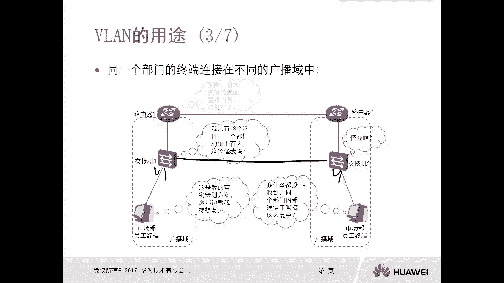

好那么如果说没有van的技术的存在啊，那么还会引起另外一个问题，另外一个问题呢就是未知单波泛红，造成一个通信效率的下降，你你甭管是未知单波泛红也好，还是说这个广播也好，都会有这样的问题。

哎你比如说我们这个发送方发送了一个数据啊，发送方发送的数据，那么假设这是一个位置单，那么在交换机上收到以后，我们前面讲过未知单波是泛红的，所以这个上面一个交换机呢会转发两份数据，一个是给到接收方。

一个呢是朝着上面的交换机去发送，那么上面交换机又受到了又是一个未知淡泊，怎么办呢，泛红泛红给所有下面的交换机，下面交换机所有的PC，你想如果说在一个网络环境里面，如果存在大量的位置单薄，甚至是广播流量。

那么不仅仅是消耗了你设备的一个资源，同时也占用了链路的带宽，这样的话一定会造成通信效率的一个下降，对啊。

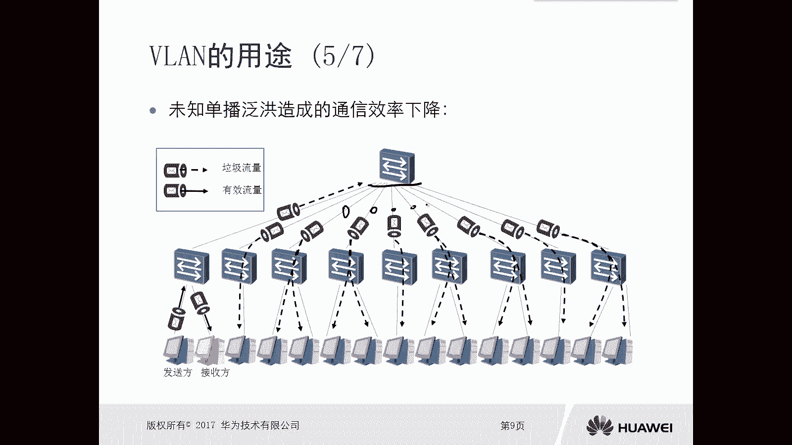

好，那么，我们就可以通过微量去解决了，对不对，那么前面实际上是已经讲到过了，那么只要我们通过逻辑的方式啊，逻辑的方式，把这个交换机给它划分成不同的微量。

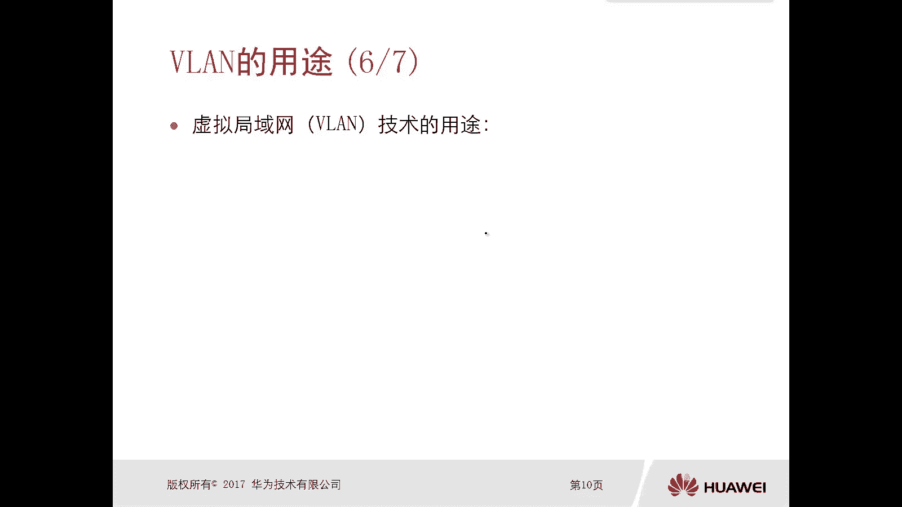

你这样的话，即使你有位置单播泛红，只能是在你一个小的范围内去泛红，不会影响到特别广，对不对，哎就解决了这样的问题。

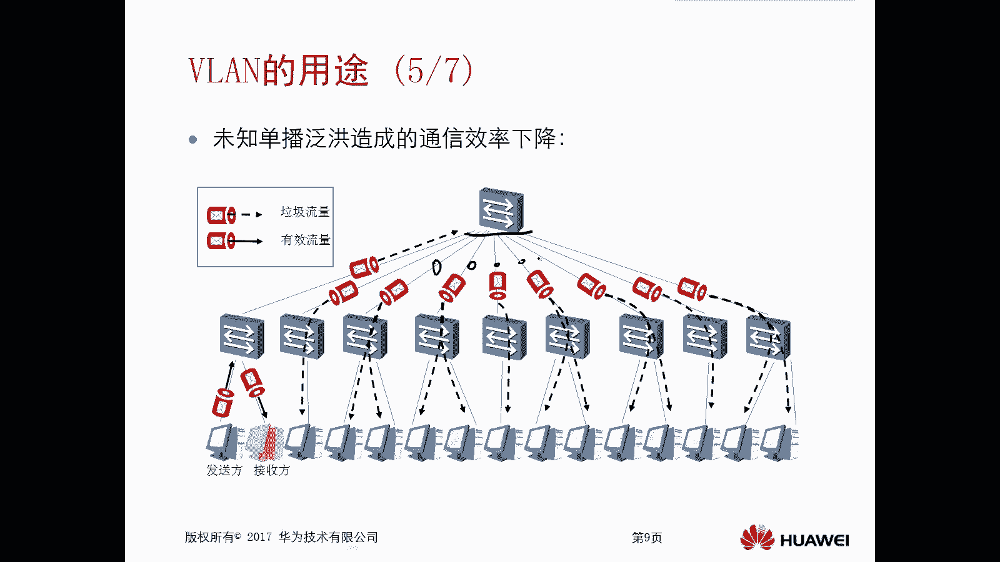

好，那么接下来我们看一下这个数据网微量技术，它的用途啊，第一个呢就是解决了这个广播域扩大不来的，一个性能和安全性降低的问题。

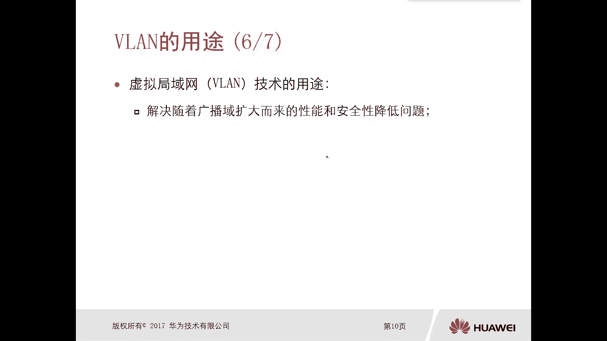

那刚才我们看到的上一个PPT啊，其实就是这个通信效率下降的问题对吧。

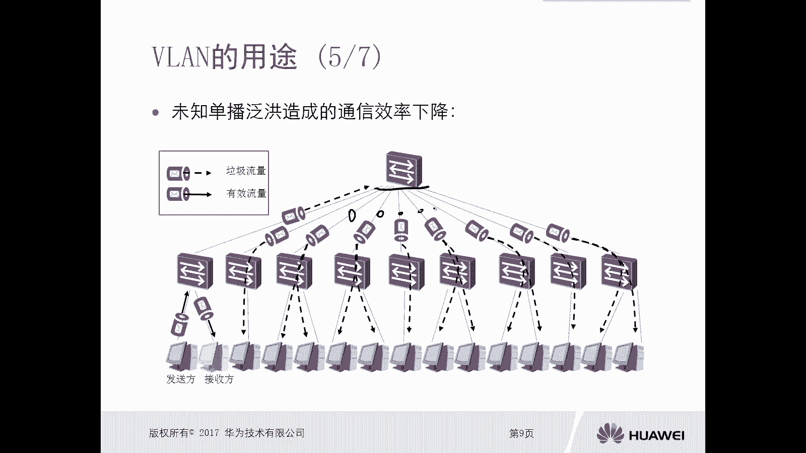

我们可以通过微量技术搞定，另外一个呢是安全性降低，因为你的泛红的范围越大对吧，你连接的部门这个越多，那么人缘越杂的安全性呢就比较低对吧，那么我们通过微量可以提高它的安全性，第二个是逻辑上。

是把一个物理的局网分割成了多个广播域，你看我们一个交换机是物理设备，那一开始呢是所有接口都处于同一个广播域哦，但是我们通过逻辑微量的方式，可以将一个物理的局域网啊，整个的一个广播域划分成多个广播。

那么每个广播域呢都可以称为虚拟局域网，虚拟局域网好，这是这个van的一个用途啊，那么接下来我们再看一下这个局网，VIAN它技术的一个特点，那么每台网络终端设备呢只能属于一个围栏。

比如说我一个交换机24个口，24个口下面挂了24个终端，那么你一个终端只能属于一个微量，但是一个微软里面可以有多个终端，再强调一遍啊，一个终端只能属于一个微量，但是一个微量可以有多个终端啊。

那么注意下啊，那么属于同一个微软的设备，属于同一个微软的设备，那么它们之间是可以直接在二层直接通信的，那么这个也符合我们广播的特点嘛，对不对，那个广播域在一个二层上面，我们是可以互通的，对不对好。

那么第三个呢是属于不同的微量的设备，他们之间肯定是没法通信的，没法在二层直接通信，他们必须要通过路由的功能才能够实现通信，所以后边呢我们还会去讲对吧，不同VLAN之间是如何通信的。

那相同微软之间呢就是直接通信了，二层通信对吧，去去查找，去查询Mac地址表对吧，进行通信，但是不同未来之间是处于隔离状态的，他们在二层通信不了，那么就会用到我们后面讲的什么，不依赖迁的路由好。

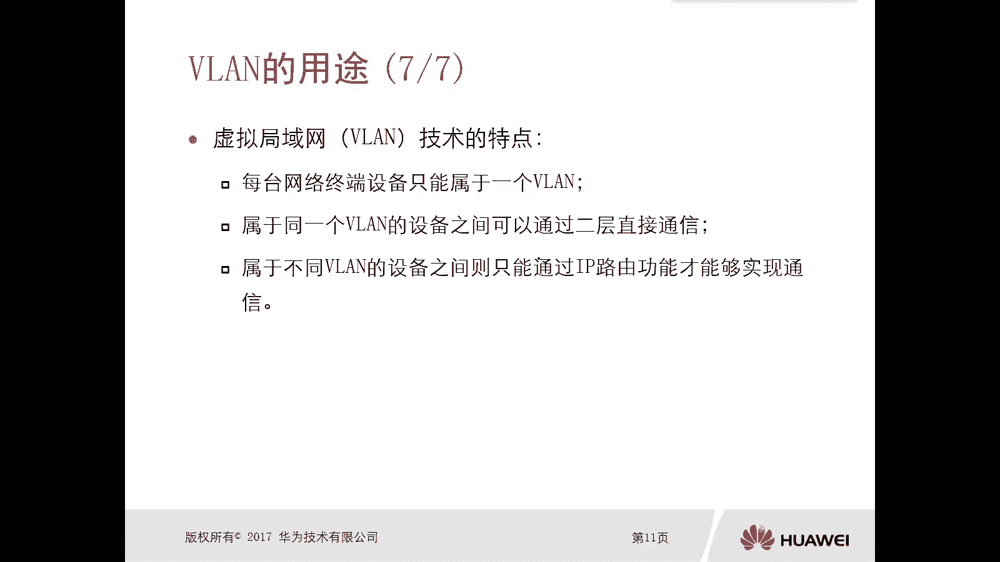