# 华为认证ICT学院HCIA／HCIP-Datacom教程【共56集】 数通 路由交换 考试 题库 - P23：第2册-第2章-2-VLAN的原理 - ICT网络攻城狮 - BV1yc41147f8

那么上一小节呢我们讲的是这个van的一个用途，对吧，那么也简单介绍了一下van，那么接下来我们看一下这个van的原理啊，van的原理，那么对于van的原理呢有两点啊，那么第一点呢就是VLAN技术呢。

会通过给这个数据真他插入不同的VLAN标签呃，因为我们前面讲过了一个终端呢，它只能属于一个不烂对吧，那么从这个终端这个接口接收到的一个数据帧，它会打上所在就是这个接口所在，微软的一个标记就是文件标签好。

那么交换机呢，实际上就是通过去识别这个分类标签，那么可以分辨出来哎，你这个数据真应该所属的是哪一个，我应该怎么把这个数据中转发出去啊。

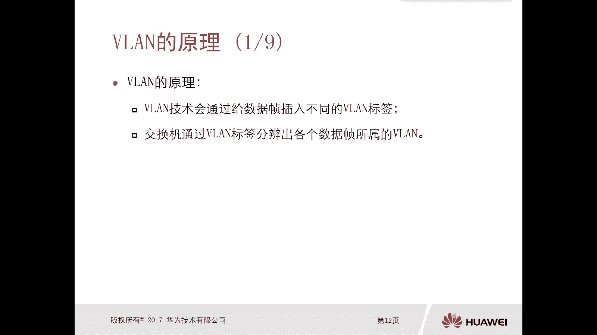

那么具体的一个例子呢我们可以看一下啊，比如说这个胶片里面有一个拓扑图，在这个拓扑图里面呢，我们可以看一下，中间就两台交换机，交换机和交换机二对吧，然后呢我们可以看到这里头有两个围栏，一个叫财务部的围栏。

还是上边的这个财务部的围栏，呃，那么一个呢呃叫做这个工程部的围栏，工程部的ban，那么他这样划分VLAN的一个意图非常明确啊，就是你财务部的ban呢，下面连接的终端呢全都是财务部的终端，那么也就意味着。

那么财务部的终端呢属于同一个广播域，那么工程部的微量呢只有工程部的员工，终端呢啊属于这个工程部的围栏，那么也就意味着工程部的围栏呢，所有的工程部的员工属于同一个广播域。

那么这样的话你看我们是两个不同的van哦，那么这种情况下，这两个未来属于不同的一个广播域，那么正好就是我们看到了这个微量，它的效果实际上是隔离了广播域，将一个大的广播域缩缩减成一个小的广播域，对吧。

那现在是两个了，OK好，那么这种情况下就有一个问题呢，你比如说我这个工程部对吧，某台员工的终端，他发送了一个数据帧啊，比如说我给这个员工终端编一个号码吧，这样我们更清楚啊，比如说这是PC1。

这边呢是PC2，这边是PC3，这边是PC4对吧，好，那么假设比如说PC2这个工程部的员工危难，他要发送一个数据给PC3和PC4，给PC3和PC4，那么这种情况下，那么这种情况下。

那么这个数据帧从交换机一，转到交换机二的时候，实际上就会给这个数据，真给他打上一个微量标记，或者叫做微量标签，那么这个微量标签呢叫做工程部啊，比如说我们这就是工程部的微量标记对吧。

那么实际上呢它是以微量号码去标识的啊，比如说微量一量二，微量三，微量四，只不过呢我们在这举例啊，就是比如说工程部，那么这样的话，这个交换机二收到一个这样打了一个V标记的，一个或者微量标签的一个数据帧哦。

他就能明白哦，原来这个数据应该是要交给工程部的，这样的数据呢是不是一目了然，就是P3还是P4的，那么同样比如说上面这些财务部的PC，比如这个呢是PC5PC6是吧，PC7PC8啊。

假设PC8要给PC5和PC6，这两个财务的员工终端去发送数据啊，那么PC包呢发送一个数据出来，那么这个数据呢从交换机二转发给交换机一，的时候呢，会给这个数据打上一个财务部的威廉标记啊，就微量标签对吧好。

那么这样的话到了交换机一以后，他就可以去分辨诶，这个数据帧应该是交给财务部的员工终端的，那么属于财务部的围栏，不要交给工程部，那哎那么这种情况下哎我就很清楚了，知道该发给谁对吧，是发给PC5和PC6的。

唉，所以说你看我们跨交换机实现VLAN，实际上你你让你怎么让交换机知道，这样的数据应该交给什么，那个微量什么的一些终端呢，主要就是通过微软标签或者微量标记好。

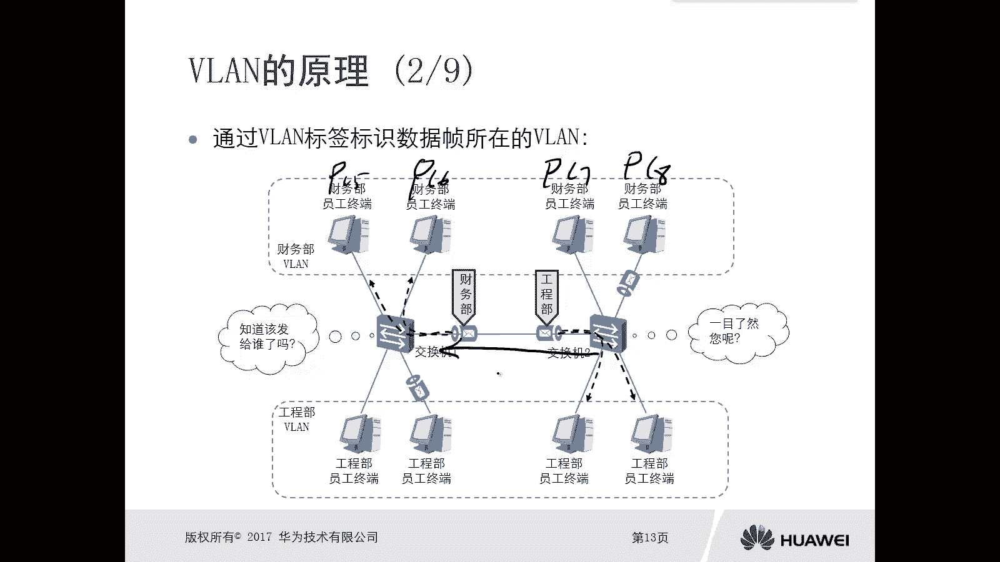

那么接下来我们就看一下，你刚才讲的真的到底长什么样，那么首先我们先看一下没有携带标签的数据，那么这个标签呢有的时候我们也称为tag标记，标签，tag tag也可以这样去讲。

那么这个数据真的我觉得大家并不陌生对吧，它是一个以太to的一个封装，我们前面讲以太真的时候讲过什么以太to啊，802。3以太啊对吧，这是明显是以太to嘛，对不对好，那么这是一个标准的以太to的一个针。

那么它有目的Mac地址，原Mac地址类型，数据和f cs这些我们全部都讲过了对吧，这是当PC发出来的数据帧，他一定是没有VLTC的，但是经过交换机的处理，那么交换机呢会给他打上一个van的tag。

或者微软的标签啊，那么这个微量标签打在哪呢，我们看一下携带了微量标签的一个数据帧，长什么样，那么实际上呢，它就是在原Mac地址和字和这个类型之间，却插入了一个标签字段，哎插入这个标签字段。

那么这个标签字段里边有哪些内容组成呢，我们可以看一下，主要是这几部分，第一部分TPID好，TP id啊，Tp id，那么这个是两个字节啊，那么后面两个字节呢分别包含了PLRC，F i v li d。

那么最主要的啊，我们现阶段最主要的就是这个VLAD对吧，12个比特，那就比如说有可能是微量一啊，有可能是微量二啊，微量345十二十等等啊，好诶，那么其实呢，就是你对端交换机收到这个数据以后呢。

就是通过围栏D去区分这样的一个数据帧，应该是属于哪个围栏的，我应该交给哪些主机，那么具体我们看一下这几个字段。

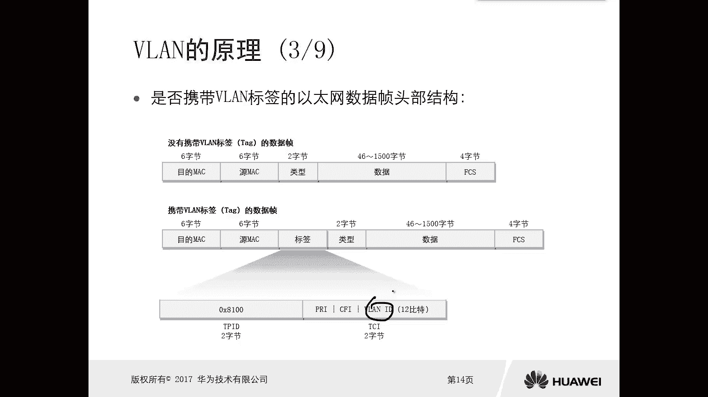

它的一个具体的一个作用啊，或者或者叫做名称，第一个就是TPID，TPID叫做标签协议标识符，这是两个字节啊，而且这个值是固定的。

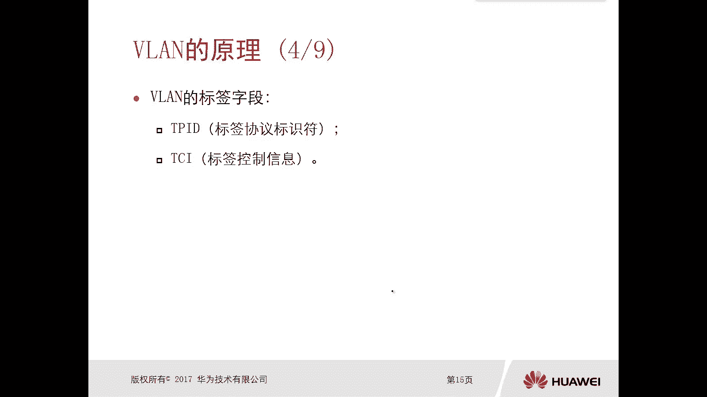

是这个8100，我们可以从这里面可以看到是8100，那么8100呢表示的是携带的是一个。

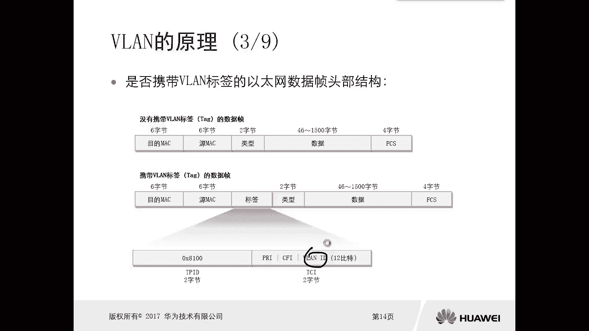

802。1Q的标签，那么我们van tag呢它是一个标准，就是802。1Q啊，这样的一个标签，如果说你有些设备不支持8。201Q，那么收到以后呢，他只是把它丢掉了，我不支持哎，就是这个TPID啊。

协议标签协议标识服务，那么现在我们用的是80201Q，这样的一个标签协议，那么TCITCI呢叫做控制这个标签，控制信息，它也是两个字节，那么主要是用来表示这个数据帧，它的控制信息的好，那么还有哪些呢。

优先级对吧，优先级呢在字段里面显示的就是PAR，那么这个优先级呢和我们后期讲到的QS，是有关系的，哎那么这个当然在我们那些更高级，更深层次的这个课程里面，教材里面才会有对吧。

比如说为了实现流量的一些什么QS啊，那么就会使用到这个优先级，那么CCFI呢就是规范的格式指示器，那么长度是一个比特啊，那么取值呢要不就是零，要不就是一对吧，好那么这一块内容大家注意一下。

如果有兴趣的话，你可以去找找其他的一些教材，那么作为一个作业对吧，去找一下他具体的作用，那么在这呢不就不讲了，因为它超出了我们这个学院这个，教材的知识范畴了啊，好那么最主要的是这个V来D。

那么这是微软的标识符，那么这个长度是12个比特，那么VID不用讲了吧，刚才说的很清楚了，他就是通过VLND去区分，到底这个数据属于哪一个VL，那么微量D的取值范围是1~4094，哎这个要注意一下啊。

1~4094，这是微软的一个标签或者van的tag。

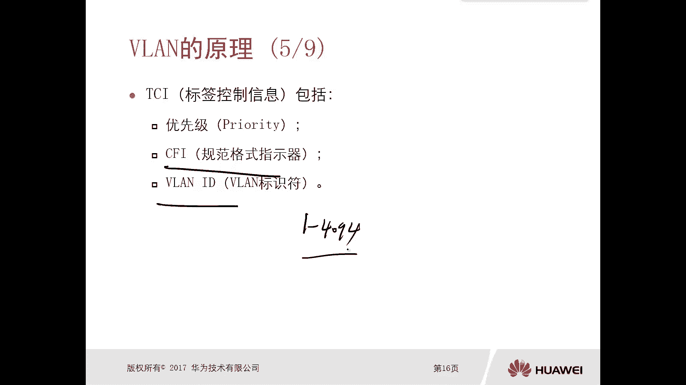

所以在多微量的情况下对吧，你看我们在交换机里面，肯定是要配多个VLAN对吧，那么交换机的工作机制是什么呢，那么其实我们在讲威廉之前，我们讲过交换机的工作机制，大家可以回顾一下，在没有讲不来的时候。

交换机怎么工作的对吧，是不是首先要根据这个Mac地址，原Mac地址去学习形成什么Mac地址表，对吧，第二个呢当时的数据线的时候呢，根据目的Mac地址进行转发，当然我们交换机呢它可能有三种转换方式。

哎那么泛红对吧，然后转发什么丢弃对吧，你比如说你收到一个广播帧，或者是一个位置单针或者是一个主播针，那么他是全网泛红的，因为没有微量的情况下，没有微软技术，没有多微量的情况下。

你所有交换机是不是属于同一个微软，微软一样，对不对，那你可以认为就是没有微量的限制的一个端口，这种情况下，所有交换机的端口都属于同一个广播业务，那么只要有一个接口收到了广播针组合针。

那么它会泛红到所有的接口，这是没有在设置更多微量的情况下，交换机的工作原理我们前面讲过了，对不对，那么但是当多微量的环境下。

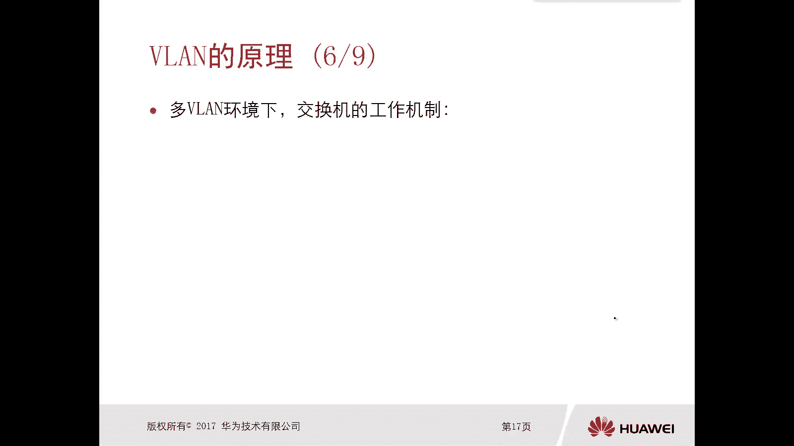

那么交换机的工作机制是什么样呢，来我们看第一个，你会似曾相识的啊，只不过这个范围就小了，我们看一下啊，交换机收到广播数据帧的时候，它只会将这个数据帧从该数额从呃，这个从除了该数据真入站端口之外。

其他的同微量的所有端口发送出去，因为你配了多微量，那么你从某个端口，某个接口收到的一个数据，那么这个接口肯定是有微软所属的，比如说它属于微软系，那么这种情况下，这个真只能转发给所有的van的其他端口。

你不像之前了，之前就是你只要从一个接口收到了，它会转发给所有接口对吧，因为大家都属于一个未来啊，那么现在呢比如说属于未来时不，那么这个其实也是一个泛红了对吧，就广播数据嘛，只不过这个泛红的范围呢。

只是在同微量里面泛红，那这个没有问题，一般前面我讲过，你看一开始我们讲这个未来用途的时候，讲过这个财务部和这个工程部，都在一个围栏里面，都在一个局域网里面，那那财务找不到安全感啊，对不对。

哎找不到安全感，因为它发送出去，比如说一个什么广播数据啊，都会被其他的，都会被其他的这个呃部门都能收到，对不对，现在不一样了，我只在我本财务的微软里面翻红。

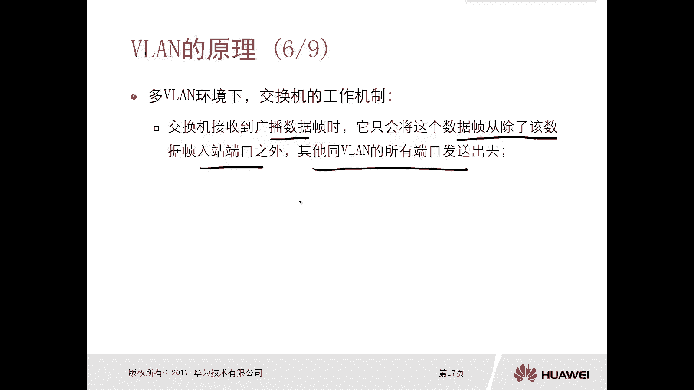

没有什么太大问题对吧好，那么第二个呢是交换机收到一个目的Mac地址。

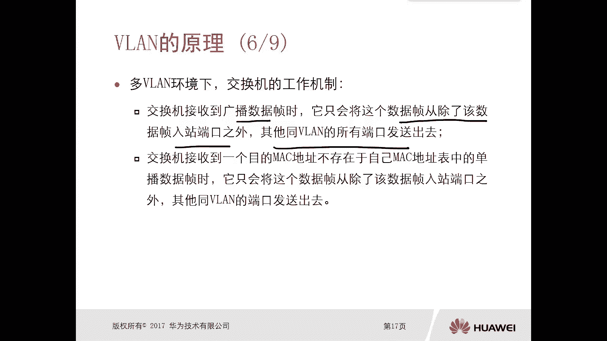

不存在于自行Mac地址表中的单播数据帧的时候，我们前面讲过这个叫做未知单波对吧，那么未知单波实际上也是，除了该数据入站端口之外，其他同围栏的端口发送出去，这叫做未知单波泛红哦，未知单播泛红。

你看这个未知单播泛红和这个广播的泛红。

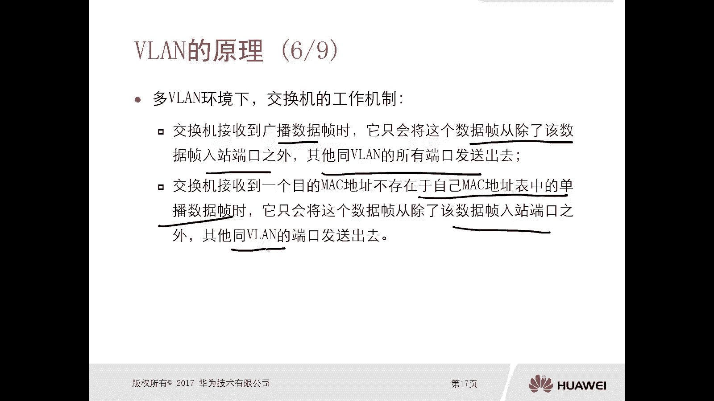

其实最终的这个效果好像很像啊。

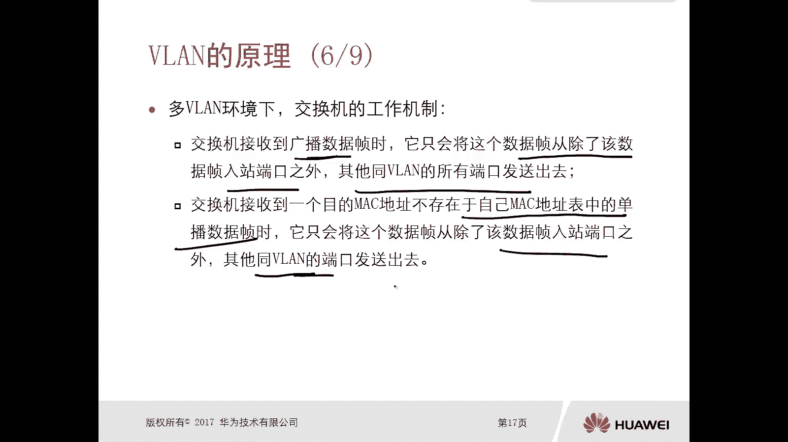

但是注意一下它们实现的原理是不一样的啊，不一样的，一个是位置在播，我找不到，一个是广播，嗯好嗯，所以说呢我们通过V的技术呢，实际上就可以将这个广播域就隔离了对吧，哎那么呃实际上这个微软隔离广播域呃。

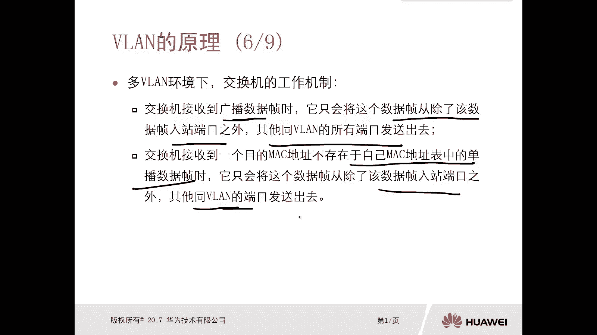

它的具体做法呢就是划分文案啊，我们可以看一下，这有一个这个van隔离这个广播域，它的一个具体做法啊，那么具体做法呢，就是我在交换机上去创建不同的微量，那么给不同部门呢，给它划分到不同的规定里面去。

你比如说我这个交换机它一共连了四台PC，那么PC1PC2，PC3和PC4，那么假设比如说PC123呢，它属于这个财务部，那么这种情况下呢，我们就可以在交换机上去创建一个VLAN啊。

比如说啊第一个围栏呢叫做财务部的微单啊，比如说叫做围栏十哎，这个围栏就是微软id嘛，对不对，那么第二个是工程部的，假设是微软20，然后呢我们说交换机它不是有端口嘛，对不对，哎这一口这二口这三口这四口。

那我们把一口，二口和三口呢给它划分到微软十里面啊，那么这个肯定要手工去配置了，对不对，那么具体怎么将这三个端口画的van10里边啊，其实做法很简单，那么后面呢我们会有专门的这个教材里面会写。

配置比较简单啊，比如说我把一个20，三口呢都给他划到财务部备案十了，然后把四口呢给它划分到微量20，那么这种情况下属于同一个微软的一口二口，三口所连接的PC1，PC2P3属于同一个广播域啊。

比如说广播语音，那么四口连接的PC4呢，他自己属于一个广播域二，那么这种情况下，你比如说哎，比如说我财务部的员工，PC1发送了一个广播真，那么这个广播真请问他还会不会泛红到PC4呢，不会哎。

他只会泛红给PC2和PC3啊，为什么，因为我们隔离了广播域，是两个不同的广域，唉，这就是他这个隔离广播域的一个具体做法。

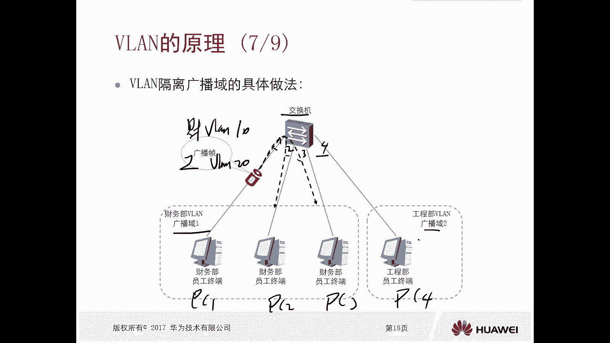

那么位置单播我们再看一下，这个并不陌生对吧，我们在前面讲van的用途的时候，实际上已经讲到过了，对不对，只不过当时这个未知单不泛红呢，呃它这个呃范围比较广，那现在我们引入了多微量的一个情况，对不对。

我们可以看一下呃，在交换机上呢是通过三个对接口，123连接了PC1，PC2PC3对吧，那么现在交换机上有一个Mac地址表，对应的是一零杠零杠一口啊，它有个Mac地址是1111，那么除此之外呢。

它是没有二口和三口的一个Mac地址表达，那么这种情况下，比如说PC1啊，呃他要去访问一个Mac地址，Mac地址是222，那么注意一下啊，前提是我们PC1和PC2呢属于围栏100，他们属于同一微站。

然后PC3呢属于微量101是不同的微量，那么这种情况下，交换机上去查找他的Mac地址表，有没有发现关于222，222这样的一个Mac地址表呢，没有，那没有，就是未知代码对吧，就是未知单波。

那么未知单波的处理呢就是要泛红，那么由于现在我们创建了多危难，他泛红，还能不能从二口和三口都发送一份出去呢，不能那么它只能从对吧，它只能从相同的微量的接口转换出去啊，比如说你看你这个一零杠。

零杠一属于哪个归来呢，是属于未来100的，所以这种情况下，这样的一个位置单薄泛红，只能从我们这个拓扑里边的二口转发出去，而不能从三口转发出去，因为三口属于微量101，那这样的话。

你看你甭管是我们前面讲的什么广播针，还是位置单拨针，实际上他们的一个泛红的范围就减小了，那就将不同的广播域给隔离开来了。

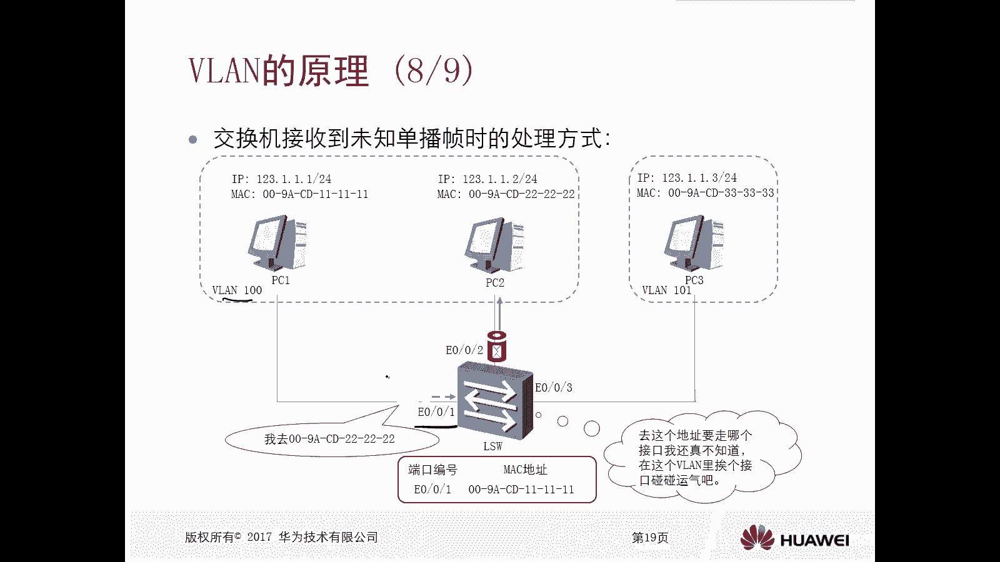

对啊，所以说这个微量的工作的原理概述啊，大家可以看一下，在不借助路由转发的大前提下，注意一下啊，只是二层数据的一个转发，不借助路由器，那么交换机呢不会将从一个微量的端口中。

接收到的数据中转发到任何其他微量中的端口，也就是说，相同微软的PC在不借助路由器转发的情况下，是能够互通的，那么不同的v line里的这个PC，不同步量PC它是不能互通的。

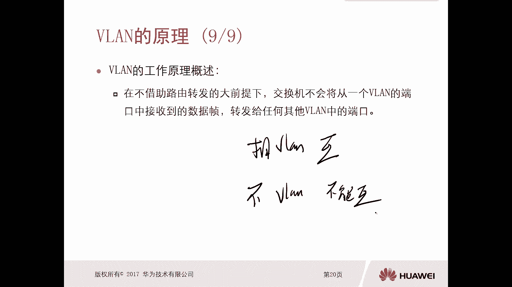