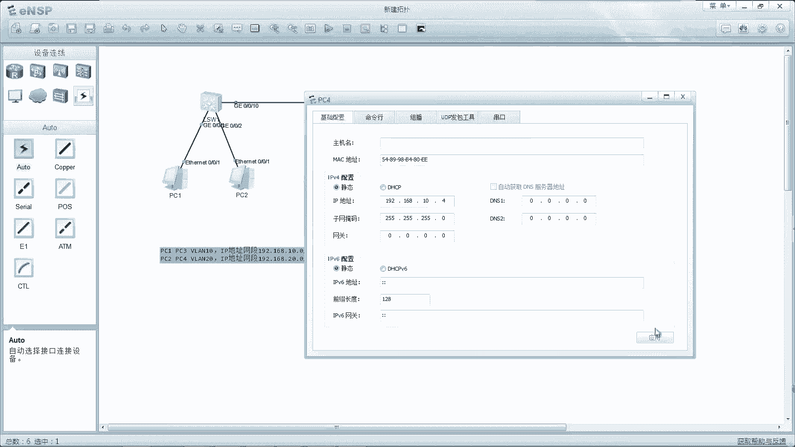

# 华为认证ICT学院HCIA／HCIP-Datacom教程【共56集】 数通 路由交换 考试 题库 - P24：第2册-第2章-3-跨交换机的VLAN原理及实验 - ICT网络攻城狮 - BV1yc41147f8

好，那么接下来我们看一下这个跨交换机的VLAN，原理啊，那么首先我们先看一个概念，叫做PVID啊，那么PPIT呢，实际上是每个交换机的接口都会有一个PYT，那么它的作用呢就是当你从这个接口。

如果收到一个安tag的数据帧的时候，我应该要打上一个什么样的V哎，这就是这个p p id啊，这是什么无标记帧的未来id，那么这个PPT呢，是管理员给这个交换机接口配置的参数，缺省呢全部都是一。

那么也就是说，你当一个交换机没有去做任何配置的情况下，那么从任何一个接口收到的数据帧呢，那么交换机呢都会给他打上一个，VN1的这样一个tag，所以说我们再想一下缺省。

是不是交换机的所有端口都属于VLAN1啊，那么都属于同一个未来都属于同一个广播域啊，哎这个就在这啊，这个叫做呃PVIDPID，那么只要交换机这个端口呃，将这个PVID给这个无标记帧的数据打上了。

那么这样的数据帧呢就变成了一个标记的针，唉唉就变成一个标记，带了标记的一个针了，好，那么接下来我们看一下，在多个交换机互联的这样一个场景里边，包括你交换机连接了各种各样的终端的情况下，对吧。

那么在这里头呢会有几个角色啊，那么呃这个主要是链路和端口，那么如果说你交换机下面，连的是这个员工的一些终端，那么这样的接口你比如说交换机一上的啊，假设啊这是一口就是一口，比如这是二口，这三口这四口。

这个是五口对吧，那么交换机二是也是一样的，12345口，1234呢它连接的是终端，你甭管这个终端属于哪个van是连接终端，那么这样的端口端口1234都叫做access端口啊，都叫做access端口好。

那么交换机和交换机二之间互联的端口，那么在我们里面是五个端口，那就换个端口，那么这个端口的一个类型呢，是管理员要手工去配置的，要手工去配置的，那么如果说你这个端口是连接的这个员工终端。

那么它叫做access端口，所对应的这个链路叫做access链路，那么一样trunk端口所对应的这个链路呢，track链啊，所以说这个交换机的接口类型两个，暂时我们学的是两个，当然还有另外一个。

另外一个在下一节会讲啊，一个是access端口，一个是trunk端口，链路呢是access链路和trunk链路，所以说对于这个access接口呢，一般是连接终端设备，比如说我们的PC机呀。

比如说我们的终端打印机啊等等，那个接口就是用于交换机之间的互联啊，那刚才我讲了，就是还有另外一种叫做hybrid端口，那么hybrid端口，那么在下一阶段再回去讲啊。

那么现在我们看到的就是access和check，那么这个access接口它有什么样的工作特点呢，如果说从一个access端口收到了一个数据帧，那你可以想一下啊，access连接的是一个终端对吧。

终端发出来的针被access端口收到了，那么这个针一定是没有tag的帧对吧，所以说从access收到数据帧的时候呢，一定是为数据帧会打上一个van标签，会打上van标签，那么这个VN打多少呢。

就是我们前面讲的PYD确实是一，当然你可以去给他改对吧，哎就是围栏标签，那么如果说你有一个数据，要从某个access接口去发送的时候啊，发送的时候啊，一定是移除微量标签。

所以我们后边呢去这个去看这个access端口，包括串端口，它的这个工作的时候，一定要站在两个方向去看，一个是接口，收到数据该怎么样，一个是接口啊，转发数据的时候该怎么样啊，那么对于access刚才讲了。

输入的数据是打标签啊，发送数据的时候是移除标签好，这是这个交换机access接口它的工作特点，那么接下来我们看一下这个交换机接口，它的工作特点，那么trunk呢也是刚才我们说了，站在这两个方向。

一个是收的数据，一个是转换数据，对不对，那么收到数据帧的时候，它是保留原来数据真的物料标签的，如果从一个TRANK接口去发送数据帧的时候，那么为了让对端设备，因为串口端口是连接了两个交换机嘛，对不对。

你从本端发到对端，为了是让对端设备能够区分自己，发出流量所在的微量，携带的自己的一个量标签，所以说这是TRANK接口的工作特点啊，那么还有一个例外就注意了，那么当交换机需要从trunk接口。

去发送的数据帧，它的微量标签如果和trunk接口它的pv id相同，那么交换机呢是不会去携带微软标签，去发送这个数据，真的哎那么注意一下，另外当交换机从某个端口发送数据的时候。

比如说这个数据人携带的标签，和你创个接口的PVID是一样的，那么这种情况下，交换机是不会去携带V标签的好，那么呃这两个是重点啊，所以说呢我画个图给大家再详细讲一下，access接口和串口接口。

它的工作对于access接口，比如说一个交换机对吧，然后呢有个两个端口，那么一端口和二端口，比如说一端口呢，它属于这个微单时，好那么二端口呢它属于这个微蓝20，比这边还有一个交换机对吧，一口喝一口。

那一口呢属于这个威兰市，二口呢属于微澜20，那么比如说站在这个access端口的一个方面来看，比如说他从一口收到一个数据帧，那么这种情况下这个交换机要朝着，比如说交换机一吧。

这边是交换机朝着交换机而转发的时候，它会给这个数据帧打上一个VLAN标签，就是van啊，这是VLA对吧，那么到了switch2以后，那么switch2要把这个数据帧交给微软十的PC，要从一口转发出去。

那么对于这个端口来讲，是从这个接口转发的时候，他要移除危难时的标签，对啊你看这样的话，PCPC发出去的针和收到的针，一定是一个纯数据帧，而不是带了van标签的针，好那么对于交换机和交换机之间。

他们的端口是trunk，那么对于交换机的这个创客，他是要去发送数据帧的时候对吧，发送数据帧，如果说如果说你这个trunk是允许了，危难时通过的，注意一下trunk呢，你可以允许某些微量通过。

也可以不允许某人某些不能通过，如果说你这个trunk是允许了VLASH通过，那么这样的数据呢是能够正常转发给switch，如果说不允许的话，是没法通过，那么对于switch2这个窗口端口。

那就是接收到一个数据，那么接收到一个数据帧，如果说端口是允许了这个数据，真那么能接受，如果是没有允许，那么他是不接受的啊，这就是我们刚才讲的那个trunk特点，对不对，发送数据和接收数据，只要允许了。

它都是保留这个不良标签的，但是例外呢，就是当你发送的数据帧，和你串的PYD一样的时候，就不携带这个微软件了，那比如说我们把这个trunk端口，比如说这是三口，这也是三口啊，把他的PVID都设置成十。

那么这样的话，你看你从这个交换机的端口收到一个数据针，打了一个波兰时，要从山口进行转发的时候，发现你这个数据真的标签VLAN10，和这个创客端口的PVID是一样的，这是谁对不对，那么这种情况下。

从这个接口转发出去的数据数据啊，从创建接口转换数据数据就会把这个van给剥掉，这个是比较特殊的剥掉，那么到了最端对端，这个创客就是收到了一个，没有携带微量标记的真，那么这种情况下。

这个创意接口该怎么处理呢，是会给这个没有携带标签真的数据啊，就是没有携带标签tag或者标签哎，这个van tag或者VLAN标签的数据帧，会打上该接口所属的PPT，那么就是对吧。

然后在交换机里面进行查询，再转到这个PC111端口连接的PC，哎所以说一定要注意一下啊，我们去看access接口和串口接口，它的工作的时候一定是站在两个方向，一个是发送数据的时候是什么样的。

一个是接收数据的时候是什么样的，那么串个接口呢比较例外，还有一个例外的情况，对不对，嗯好，那么接下来我们看一下，同一个交换机的通信流程，画图呢把这个讲清楚了，看来你比如说我们看这个图上面啊。

我们一共有两个LV，20/10，两个交换机啊，两个交换机，那么分别有微量10V20对吧，终端1234属于微量十，终端5678属于微量20，那么连接的接口全都是access接口。

交换机和交换机之间是串接口，对不对，那么这种情况下，终端比假设啊终端一要朝着终端三去发送数据，那么终端一发出来的数据呢，肯定是一个纯的以太真，对不对好，那么当access接口收到一个数据帧的时候。

他应该要打上接口所属的VLAN10，正好track接口是允许它通过的，所以这种情况下，在trunk链路上去发送这个数据帧的时候，是携带了微单时，假设现在这个trunk端口。

它的PPID不是十是一不一样吗，不一样就要写在这个文段标签转发，那么到了这个交换机二，那么交换机二的端口创建端口，是收到一个微软真，那么如果说交换机二的串口端口，是允许这个围栏进来的，OK接收对吧。

在交换机二里边呢在向着终端三的端口去转发，但是终端三的接口是access接口去转的时候，他会把这个微量十给剥掉啊，所以说这张图呢，实际上就全面的，从对接口的接口收到一个数据对吧，串个接口发送数据。

串个接口收到数据，access发送数据，整体就讲通讲清楚了，access接口和trunk接口，它的一个工作特点，对工作这样好，所以说我们看这个交换机啊，那么工作原理这里面有个补充啊。

那么如果说收到未知暂不增，我们前面讲过了，是向本微量所有的非接收端口范围，对不对好，那么补充一点是收到未知的单薄针，也会像所有trunk接口泛红，但是前提是串客允许了啊。

这个弹幕真所在的微量通过才能翻红，如果不允许也是没法通过的好，那么基本你看我们前面讲了van的用途啊，讲了van的这个原理啊对吧，讲跨文件原理，是有必要去做一个简单的小实验好。

那么这个实验拓扑呢非常简单，我还是用esp去搭建的一个环境啊，那么一共就是四台终端设备，然后交换机和交换机二啊，那么现在呢我们怎么去规划一下呢，哎我写一下啊，比如说呃我把PC1PC1PC三啊。

给它放到微软十里边，那么IP地址网段是192。168点啊，10。零十。0杠24是吧，好那么PC2和PC4给它放到van20里边，IP地址网段是192。168点，20。0杠24，哎。

那么首先呢我们在这个PC上先去配置IP地址啊，这个都没有配，我现在这个PC一上去配这个地址，PC1呢是192。168。10。1是吧，嗯三个251个零是吧，网关呢我们暂时不不需要的啊。

然后PC3PC3呢是嗯，192。168。10。3，252525。0呃，然后是PC2，PC2呢，我们给它设置成192。168。20点哎，20。2252525。0，一般情况下我们去后面啊。

我们去学就会发现不同的微量，它对应的IP地址网段是不一样的，嗯这个是20。4，啊是这样的情况好，那么这个做完以后呢，接下来呢是在交换机上去配置VLO，先进入到交换机一交换机1system v6对吧。

system name我们起个名switch好，那么怎么去创建van呢，缺省只有一个微量，我们可以display VLAN去看一下对吧，只有VLAN1，所有的端口都属于VLAN，一看到没有。

所有端口都属于VLAN1好，那么现在我们创建VLANVLAN10啊，回车van20回车，这样做完以后呢，我们再display围栏去看一下，就会有van和van20，但是现在微软和微软20有没有接口。

属于这个微微蓝20呢没有，所以现在呢我们要把PC1所连接接口一口，和PC2连接接口二口给它，分别放到微量十和VLAN20里面去对好，那么根据我们刚才的规划呢，呃进入到G0杠零杠一口啊。

那么首先这个接口是连接终端的，我们要去修改它的一个端口的类型啊，就是端口的链类型是access，那么这个端口呢叫做access端口好，然后呢去把这个接口给它关联到V栏里面去。

那PC1刚才我们按照规划是属于villain10，对不对，所以说呢我们要通过pl default villain10，去修改这两条命令。

大家看一下pink tape access potiflash就可以了，那么对于G0杠零杠二口呢就是pot in tab access，Port default，VLAN20对吧。

做完以后我们display v line，我们看一下van10里面有个端口是G0201，微量20里面有个端口是G0202，接下来是交换机一和交换机二之间的互联端口，即零杠零杠十哦。

那么交换机互联呢我们用trunk对吧，port link type就是trunk对吧，然后呢是我们要port trunk low pass，要允许哪些微量通过，那么这里边呢。

你最起码要允许VLAN10和VLAN20对吧，微软十和20最起码你要允许这两位了，因为在这个图里面呢要到跨交换机的通信，对不对，你最起码要允许未来20/10，这是最最起码的啊。

好那么这个命令你完全可以copy一下，复制到switch2上面，switch2G零杠零杠十口，因为配置都是一样的，对不对，OK而另外的是IG0杠零杠三口，G0203口，那么我们也可以复制过来。

敲一下也可以啊，Pink tape access，好注意一下啊，你看这还没有创建，所以就会报错，所以我们也要十来20，然后再在G0杠零杠三下面去敲POTIFLASHI，G0杠零杠四。

Potivan po，嗯嗯这个没敲上炮，fault vlan20啊，这样就可以了对吧，哎，这样做完了，做完以后呢，我们可以去测试一下，测试一下，比如说PC去拼PC3哦，是能互通的，对不对，那么同时呢。

当PC1去发送给PC3方数据的时候，那么在这个接口收到了，他一定会打上一个ban tag，同时你这个track是允许的，对不对，所以说从创客这儿发过来的数据包呢。

是能够看到数据帧里面有个van的tag的，哎我们可以首先在这个位置进行一个抓包，然后再在PC一上去拼这个PC3啊。

我看能不能通。

PC1命令行去拼192。168点嗯，然后呢是10。3对吧，我们开始能通的，那么同时呢这个抓包呢是能够看到这个数据帧，是打了微软TG的啊。

我们看一下好，我们看一下啊，这是一在拼三的，对不对，好，我们可以点开，点开以后呢，我们看以太兔的针对吧，哎以太兔的针在这个呃，以太to真里面有一个802。1Q的微单，对不对，Van，那么是在中间插入的。

那么这个VLG是VLASH，可以看到对面有PI呀，有CFI呀，对不对，有type类型了对吧，在以太里面呢，有这个tab类型是802。1Q的一个VL呃，00x8100，对不对，哎这就是van啊。

所以说你看在这个trunk上面，是能够抓到这个van真的，那么到了交换机交换机二他就去判断哦，原来这个van tag是十，那VTX10，那现在你是转个三呢，还是转个四呢，只能转个三，不能转个四，对不对。

唉当然也要根据这个Mac的表去转，那这样呢一和三就能互通了，那么二和四呢就是peace，就是这个微量20了啊。

我们可以在PC2上去拼192。16，8。20。4对吧，还在这抓爆啊。

好我们看一下啊，这个音抓到了20。2去拼20。4，那个tag是20，没事吧，那么这样我们就可以通过划分微量的方式啊，可以跨交换机实现相同微量里面的PC能够互通，不同微量里面PC不能互通。

那你就讲你现在PC1和PC4能通吗，肯定是通不了，因为PC1属于微单十，PC4呢属于微软20，肯定不能互通对吧，那你测一下肯定不能互通对吧，还有一个问题，就是你PC1和PC4现在属于不同VLAN呀。

属于不同阶段，属于不同的IP网段呀，一个十网段和和20网段肯定现在没法重新呀，那没关系啊，我现在假设我把PC4改成10。4，同一网段了吧对吧。

我把所有的PC啊全都改成十网段测试一下嘛。

对不对，十网段这个呢全都失望段啊，现在全都是失望段了啊，注意一下。

全都是失望段时，网段是1234对吧，那现在这个PC1能不能拼通10。4呢，多对吧，那么能不能拼通10。2呢。

你看这个PC1和PC2啊，他俩是在一个交换机上网也一样。

我能不能10。2不能，所以呢我们再想一下，前面我们讲的微量的一个整体的概括，相同微量里面的是能够互通的，不同微量是不能互通的对吧，即使你那边IP网段是同一个，也通不了，那么假设假设我把G0杠零杠二口。

那么之前属于哪个VLANVLAN20，我把它放到van10里面去，现在是不是PC1和PC2属于同。

未来是不是PC1去拼10。2就能通了，没有理解吧。

唉这是一个非常简单的小实验啊，就是怎么去配v line，怎么去配access端口，怎么去配trunk端口，窗口里面非常注意一下，一定要要去做一个动作，就是allow围栏啊，俄罗斯围栏你要允许它过才能过。

不允许他是没法通过的。

OK好，这个呢就是跨交换机VLAN原理啊。

