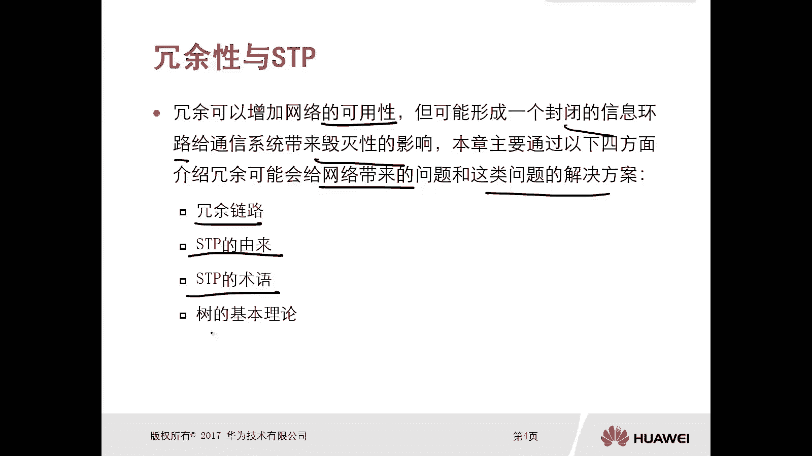
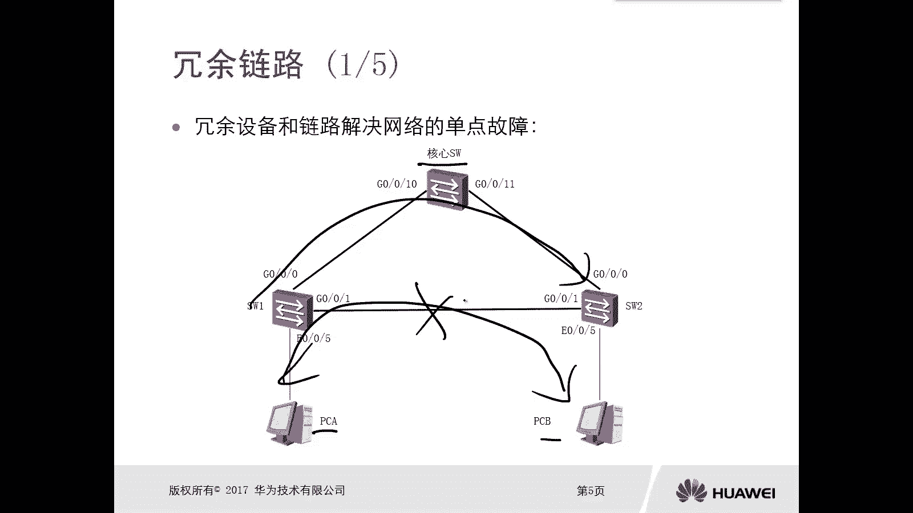
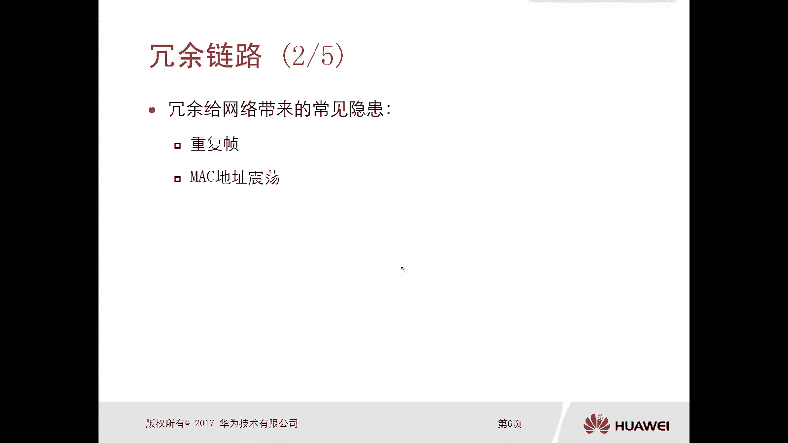
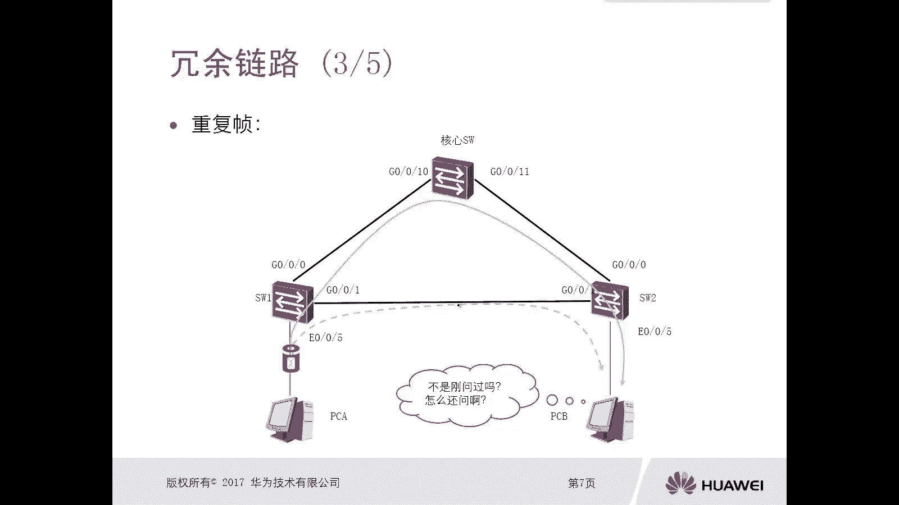
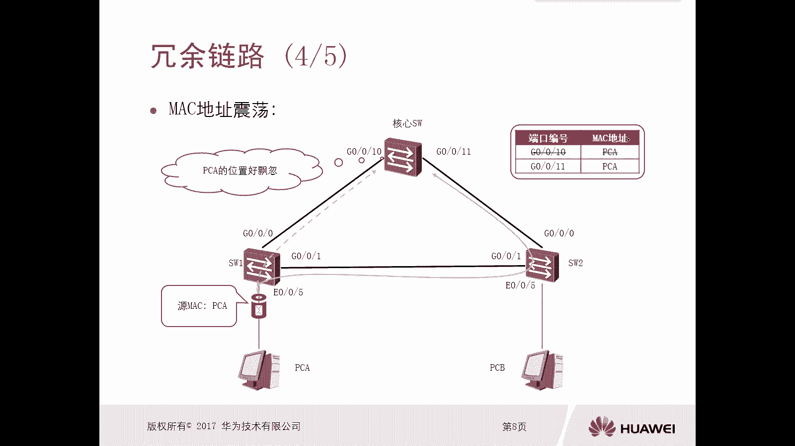
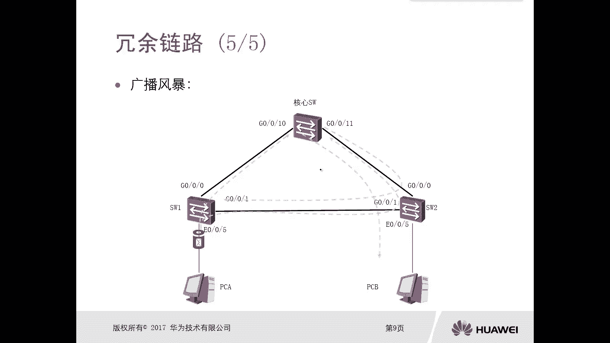
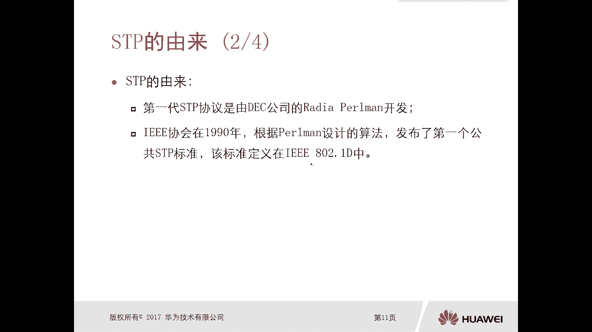
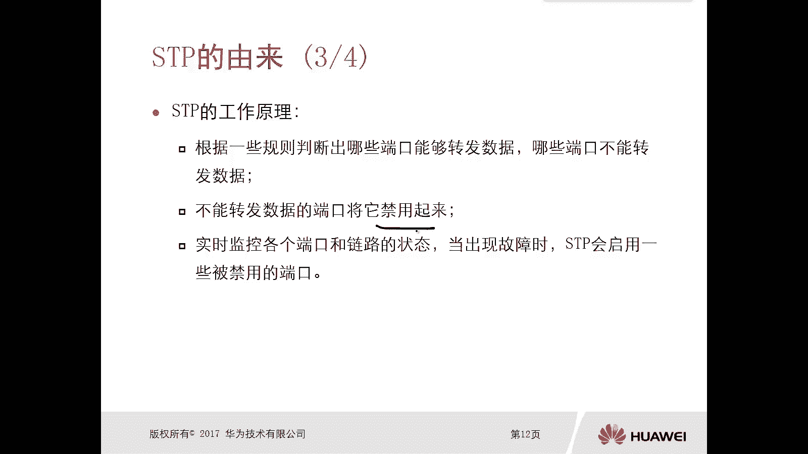
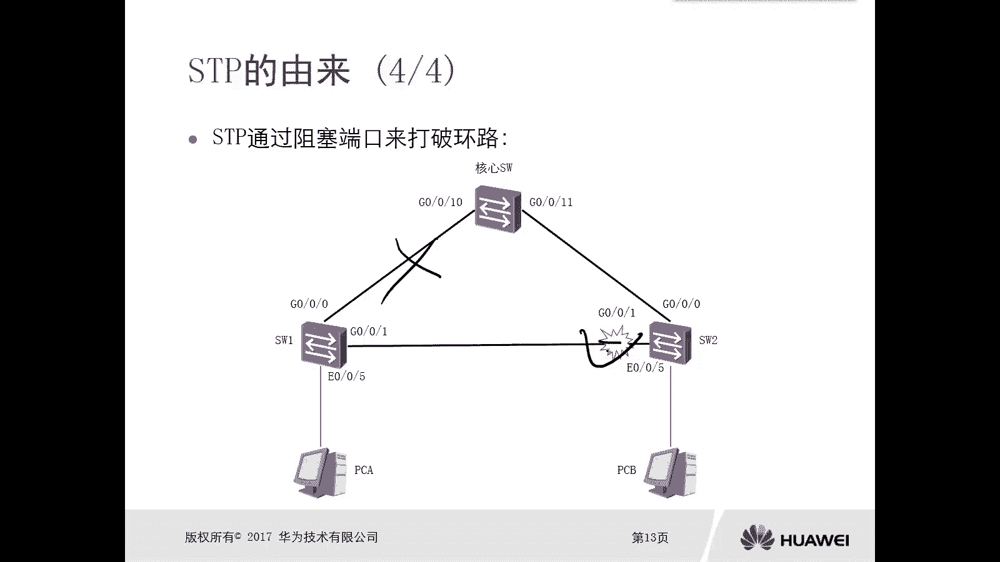

# 华为认证ICT学院HCIA／HCIP-Datacom教程【共56集】 数通 路由交换 考试 题库 - P25：第2册-第3章-1-冗余性与STP的由来 - ICT网络攻城狮 - BV1yc41147f8

好那么接下来我们看一下这个冗余性和TP，那么冗余呢，实际上是可以增加这个网络的可能性，那么实际上我们去部署网络的时候，都可以都要考虑到这种性，但可能呢形成一个封闭的一个信息环路。

那么给通信系统呢带来这个毁灭性的影响，那么本章呢主要是通过以下四个方面啊，去介绍冗余可能会给网络带来的问题，和这类问题的一个解决方案啊，那么第一个呢是冗余的链路啊，第二个呢是STP的由来。

第三个呢是STP的术语，第四个数的一个基本理论。

那么首先我们先看一下冗余链路嗯，那么冗余链路和链路，冗余设备和链路啊，主要是解决这个网络中的一个单点故障，那么实际上我们在部署网络的时候，都要考虑到你的设备要不要冗余啊对吧，要不要做个什么双击设备呀。

要不多搞几台设备啊对吧，哎你的链路要不要做成这个双链路，或者或者更多链路呢，哎目的只有一个，就是为了避免单点故障对吧，你一台设备的时候出问题了，那就完蛋了对吧，我搞两台设备，一台出问题了。

还有另外一台扛着对吧，一个链路出问题的时候，OK完蛋了，那我就可以搞两个链路，甚至三个人，哎你比如说我们这个组网，你看这三个交换机对吧，有一个核心交换机，那么下面呢是非核心，那么呢。

这三台交换机分别都通过一条线进行互联，那么在这种情况下呢，实际上除了有链路的冗余以外，还有设备的冗余，你比如说PC要和PCB通信，比如说正常情况下我这样去通信对吧，但是你比如说这边出现问题了对吧。

内容出问题了，我可以走上面。

对不对，哎这上面但是这种冗余链路太多，冗余设备太多，可能会给网络带来一些常见的隐患，第一个呢可能会带来重复帧，就在这种交换网络环境里面啊，会带来重复分，第二个是Mac地址震荡啊。

第三个呢是广播风暴，这个最严重了，那么什么叫重复帧，比如说还是刚刚才我们看到这个拓扑，对这样的一个拓扑很简单，比如说PCA要给PCB去发送数据，那么由于PCA发出来的数据，假设RPC和PC并没有通过性。

那么PCA发出来的数据，比如说它就是一个ARP那么ARP是广播，对不对，所以呢第一份数据他会从这个G0杠，零杠零口转发出去，转到核心交换机，核心交换机呢又转到了PCP，同时呢它也可以从G0杠。

零杠一口转发一份出去，到switch2，再到PCB，那这样的话，PCB实际上就收到了两份相同的重复的报文，而重复的真对吧，那你刚才不是已经发过了吗。

怎么还发呢，对不对，哎这就是重复帧，第二种问题呢就是Mac地址震荡，比如说PCA还是去做ARB请求，请求PCB的Mac地址对吧，那么他发送了一个报文，根据交换机的一个Mac地址学习的一个原理。

那么它是记录原Mac地址去做记录，不switch1，这个学习呢肯定是这个五口，对应的是PCA这样的Mac，那么当switch1，把这个数据在泛红给核心交换机的时候，那么核心交换机核心交换机。

那么学到是从十口学习到的，所以说在核心交换机上面呢，他就记住了，OK实口对应的是这个PCA啊，他那个地址对不对，哎好，但是呢，由于你下面这个链路也是可以将这个数据帧呢。

转到switch再转交给核心交换机，那么核心交换机就发现诶又从11口收到了，那么这样呢他就把这个表象变成了11口，对应的是PCA哎这样的一个情况，所以呢就会出现啊Mac地址表的一个震荡啊，一会儿十口。

一会儿谁考，那么核心交换机就蒙圈了，对不对，你这个PC位的位置好飘忽啊，对那么另外一种更为严重的后果呢。

叫做广播风暴啊，广播风暴，你比如说我们还是以AIP为例啊，这个PCA发送了一个AIP范围对吧请求，那么交换机呢因为IP是广播嘛，对不对，所以说他要泛红，它会从G0杠零口转发一份到核心交换机。

那么核心交换机收到以后呢，从11口继续转发到switch2，随时从G0杠零杠零口收到一份，转发给G0杠零杠一诶，这个这个数据就还回来了，哎那还回来以后，那个交换机呢。

从这个G10杠零杠一口收到一份又转发过来，又转发过来，那么会形成一个这样，这叫做顺时针的环路，但是你要注意了，你的这个IP泛红，不仅仅从G0杠零杠零口翻红一份啊，它会从G0杠零杠五口也会翻红一份出去哦。

你把到ch2ch2到核心交换机，核心交换1U到ch1，又会形成一个逆时针的环路，而且这种广播报文在这个二层环境里面呢，它是越来越多，它是批量复制的啊，那么如果你遇到这种情况最严重的一个后果。

那就是你的交换机设备宕机，交换机设备CPU百分之百，结果呢交换机宕机了就没法工作了，这个是很严重的一件事情，叫做广播风暴，所以对于这些问题呢，我们通过什么样的技术去解决呢。

哎就是通过STP叫做spin triple生成树协议，哎那么生成树协议的一个作用呢，就是在冗余链路的一个网络的环境下，能够做到两点，第一点去除单点故障的同时，保证每个节点可达对吧，唉它可以实现冗余。

但是呢，第二个呢是打破了网络中的逻辑环路，阻断了广播真的循环的广播，那么就是解决了刚才我们所说的那些问题，什么重复帧呀对吧，然后Mac地址这个不稳定啊，广播风暴啊，你甭管甭管是哪一种。

它都是由于有形成的逻辑环境造成的是吧，哎那这就是STP它的一个作用，那么对于STP第一代的STP协议呢，是由DEC公司的radio pm开发的啊，是由这个呃这个人开发的啊。

这个人好像号称叫做互联网之母啊，她是一个女的啊，大家可以去搜一下，这个人开发了好多，这个和我们通信相关的一些标准对吧，参与了对吧，哎那么这个HOE协会呢，在90年根据这个pram设计的这个算法。

发布了第一个公共的生成数标准，这个标准的定义叫做ITRIBLEE，叫i trip e i e e802。1D，这是第一个生成树的标准啊，那现在我们这个标准，这个标准的一个生成树协议呢也在用啊。

也是用做802。1D的STP。

那么STP的工作原理呢主要是这么几点，第一个根据一些规则去判断啊，当然这些规则呢后面我们都会去想，他去判断哪些端口能够转发数据，哪些端口不能转发数据啊，那这样是不是就可以打破这个逻辑环路了。

唉有一端口能转，有端口你不能转是吧，好，那么不能转发数据的端口呢，把它仅用起来，大家注意一下，这个禁用起来只是一个逻辑的禁用，它并不是一个物理上面的禁用，你想物理上的禁用呢，就是把这个给down掉。

对不对，唉这个不是物理的，是一个逻辑的金融，同时呢他实时去监控各个端口和链路状态，当出现故障的时候，哎，这个生成树呢它会启用一些被禁用的端口对吧，一开始是禁用的，但是现在我主链路可能出问题了。

你这个禁用端口必须要起来了，对不对对吧，当这个备份电阻这个禁用的端口起来以后呢，我就又可以实现通信了对吧，哎在有冗余的情况下，是在打破环路的情况下，我还可以做这种。

这就是生成数它的一个最终的一个目的对吧。

那么接下来我们看一下这个拓扑，大家看一下啊，这个生成树它是通过阻塞端口去打破环路的，那么还是三台交换机对吧，那么中间的是核心交换机，那么它通过某种规则它的一个算法对吧，工作原理。

那么将某个端口处于一个逻辑的阻塞，比如说这个交换机二的这个嗯，G0杠，零杠一口现在处于逻辑的阻塞，它只是逻辑的阻塞，现在是不用来转发数据的，但是一旦比如说上面这些链路出问题了，那么这个接口呢。

又会变成一个可转发数据的状态，而这样既可以打破环路，也可以保证当主链路出问题的时候，那么备份内容能够正常转换数据，做到一个冗余，这就是生成数它最终的一个目标，那么具体申请书怎么工作，唉他有哪些角色来。

