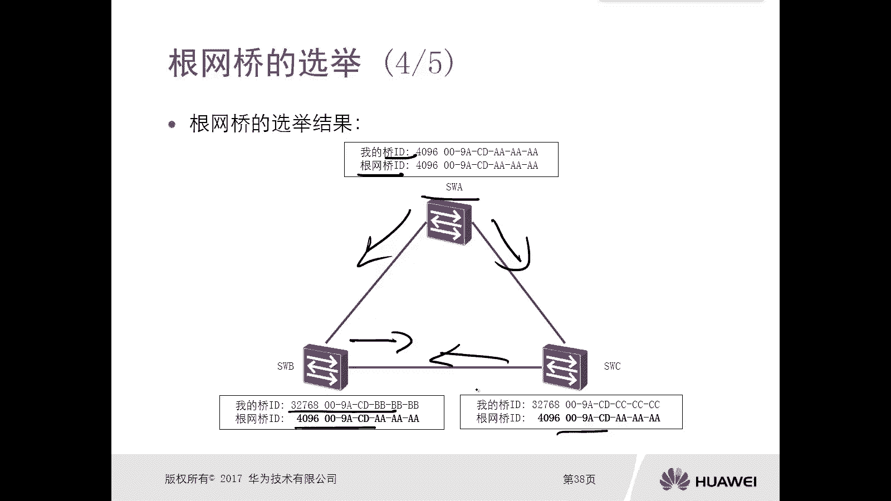
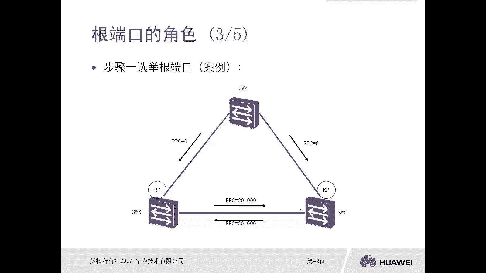

# 华为认证ICT学院HCIA／HCIP-Datacom教程【共56集】 数通 路由交换 考试 题库 - P26：第2册-第3章-2-STP的工作流程 - ICT网络攻城狮 - BV1yc41147f8

好，那么接下来我们看一下这个spanish pro，它的一个工作流程，就是STP的工作流程，那么STP工作的第一步呢，首先要去选选举一个根网桥，每个STP网络中都会有，并且只有一台电网桥。

那么也叫做根交换机，那么作为根交换机的这台交换机呢，就是STP所构建的一个生成树的根，我们说spree protocol叫做生成树协议，那么实际上它是通过生成树协议呢，生成一个无环的无环的数。

那么树当然有树根，对不对，那么在生成树协议里面，这个树根是谁呢，就是根网桥或者叫做根交换机，那么对于这个根网桥的一个选举的范围，是整个交换网络，在整个交换网络里面选出一台啊电网桥啊，根交换机。

那么第二步呢就是要去选择根端口，选举根端口，那么非根交换机一定要注意一下，而是非根交换机会在自己的所有端口之间，选择出距离根网桥最近的端口，这个端口呢叫做根端口，一定要注意一下，他是在哪选的呢。

是在非根交换机上，而且每个交换机当然除了根交换机，就是非定交换机上都会去选啊，都会去选，那么SDP工作第三步呢是选举指定端口，那么位于同一个网段中的所有的端口之间，要选择出一个距离跟网桥最近的端口。

大家注意一下，这个选举的范围呢是每个网段诶，再回顾一下刚才我们讲的根端口是在哪选，是不是非根交换机上啊，哎这个指定端口在哪选呢，是每一个网段里面去选，所以说我们去学生成树协议的时候。

一定要搞清楚选举选什么，在哪选好，那么最后一步呢，这个第四步呢就是阻塞预备人口，那么选出了根端口和指定端口以后，那么生成树协议会把既不是根端口，也不是只能端口的，其他的所有端口都置于阻塞状态啊。

那么处于阻塞状态的端口呢，就叫做叫做预备端口，而预备的口，那么这样呢，实际上经过四步骤的四个步骤的一个这个流程，那么最终会将这个逻辑的环路给打破，那么具体这些是怎么选的呢。

哎我们首先看一下根网桥的一个选举，呃首先我们看这个参选者，参选者呢是在一个生成树协议里边啊，在这个生成树协议网络中啊，默认所有的交换机呢，都会参与根网桥的一个选举啊，只要在一个STP网络域里边啊。

他都会去选举的，都会去选取的，那么所有的这个交换机啊，那么选举原则怎么去选呢，实际上是根据一个参数，这个参数叫做求id，也叫做bridge d，那么选举根桥的时候，是交换机相互去对比这个参数对吧。

那么也就是说每个交换机实际上都有一个桥id，对吧，我发给你发给我啊，我们再发给他，他再发给我们，对相互去发送，然后相互去对比，相互去对比，那么最终决定出来一个电网桥。

那么这个桥id到底是什么样子呢，那么桥id呢是分为两部分，而优先级是16个比特，华为设备的缺省的桥D，桥D的优先级，就是桥id里面的优先级是三十七十八，当然这个优先级是可以改的。

那么第二部分呢就是Mac地址，48个比特，这个是交换机的一个硬件Mac地址，所以说桥id实际上是由16个比特优先级，加上48个比特的地址组成，64比特的一段。

好那么选举根网桥的时候，也就是说你所有的交换机都要相互去发送，他自己的chi，因为这样的话其他的交换机才能收到对吧，相互的这个强化机才能比出来，对不对，哎你比如说我们现在组网三台交换机ABC。

那么A呢它的求id是4096，MC地址呢我只是读后面这几位比较简单，AAAA对吧，然后B呢是32768，BBBC是32768CCC，那么初始化的交换机，他都认为自己就是一个根桥。

所以说当他们相互去发送BBD的时候，配置的BBD的时候，那么会在BBD里面去设置两个参数，一个是求id，一个是根网桥id，那么由于他们在发送这个BBD之前呢，是相互看不到对端对吧。

所以说他认为自己就是一个，但是经过配置BPDU的一个发送以后，那么他们之间都得知了啊，你的BP是这样的，你的这个乔迪是这样的，它的敲击是这样的，哎我的敲击是这样的，那么最终呢就选出来了一个对吧。

选出来一个哎，比如说在这呢，A就是这个地方强，那么A是平板桥呢，A再去发送BBD的时候，那么BBD里面的字段桥ID哎，求ID和根网桥ID那么是一样的，但是B和C在发送BBD的时候，哎发送者的敲id。

而是自己，但是跟网桥id呢就变成A了，那么说明B和C呢是认同了，在我们这个交换网络里面呢，根桥其实就是A。

那么怎么选啊，就是跟往常的选举原则啊，规则怎么选，首先比较优先级，优先级越小的越优先，那如果说你一样嘛，你缺什么都是32768，对不对，你不改的情况下对不对，那么第二个原则就是比较Mac地址。

Mac地址的小的优先，因为Mac地址我们出厂消费阶段肯定不会冲突的，对不对，所以说即使你优先级是一样的，但是Mac地址肯定是有大有小，最终是选举出来。

好那么接下来呢就是根端口的角色的选举，根端口的选举，那么根端口选举的范围是每台非根交换机，大家注意一下，在根交换机上是没有根端口的，根端口一定是处于非根交换机上，那么参选者的是这台交换机。

这台飞机交换机啊，所有启动启用的端口，就是这台非根交换机上，所有启用了生成树协的端口，他们他们之间呢要选择一下，到底是哪个是根端口，那么选举根端口的选取原则是什么呢，首先选择根路径开销。

叫做RPC根路径开销，那这个根路径开销呢，实际上就是这个端口到达根桥的一个路径，开销唉，最低的端口那就是越近越好了，对不对，其次呢如果有多个端口的RPC是相等的，而若有多个端口的RPC是相等的。

那么选择一定要注意一下，是对端桥id最低的端口，注意一下啊，是选择对端桥id最低的端口，最后如果说多个端口对端起化力相等，那么选择对端端口id最低的端口啊。

那比如说我们这有个例子啊，有个案例，这个是选举选择这个根端口的一个案例啊，你看啊，比如说我们在这个环境里面，根桥是谁呢，根桥是switch a，它是根桥，所以说跟桥A发送出来的BPDU。

BPDU里面有一个字段叫PRC，那么A发出来的PRC肯定是零，因为A是根，那么它到它自己的距离，它到它自己的开销肯定是零嘛不好，那么到达了BB上有两个接口，一口和二口，C上也有两个接口，一口和二口。

那么也就是说，根端口是在switch b和switch c上的端口之间去选的，也就是switch b1口和二口，他俩要竞选一下，switch c的一口和二口也要去竞选一下啊，要去竞选一下好。

那么当switch b收到交换机A发送过来的配置，BD以后，他在朝着去朝着C去发送的时候，那么这个BPD里面的RPC呢就变成了2万，哎这个2万怎么来的，因为我们这个胶片里边哎。

这个链路它的开销缺省就是2万，那所有的链路开销缺省都是2万，所以说switch b在发送的时候就是2万是吧，唉那么同样C呢从交换机A收到了哎这个B丢，那么它的RPC是零。

那么C再把这个在朝着必须发送PPT的时候，那么RPC就是两码，那么实际上对于交换机B来讲，一口和二口分别去往根桥，他的RPC是多少呢，你可以算一下吧，虽然你发过来是零，但是这个链路有开销啊。

那就是2万对吧好，那么二口二口呢这边是2万，这边又是2万，那这就是4万，对不对，所以在交换机B上边，一口和二口最终哪一个会胜出呢，啊根据我们第一条选的原则啊，这个选的这个根端口的原则对吧。

第一条的选根的这个端口的原则，开销小的，IPC选2万的，所以说一口就变成了交换机B的根端口，而且注意了在一个非根交换机上，根端口只有一个，那么对于交换机C呢啊，交换机C呢就是二口会变成RPG能口，哎。

这是通过第一个选根端口的原则选出来的RPC。

但是比如说有这样的一个场景，有这样的场景，那么对于交换基地来讲，他要去选根端口，那么这边是2万，这边也是2万，2万2万，那么交换机的一口喝二口，实际上去往根桥，他的RPC全都是4万。

那么根据这个cos的开销，RPC就选不出来，那么这种情况下要根据第二个选择规则啊，选择端口规则，那就是看对端的BAD哎，对端BID，那么对端BID我交换机D怎么知道呢，因为你交换机B向下去发送。

BBD里面包含了cinder的BD啊，就是发送者的BD，那么就是B和C的BD哎，比如说B的BAD是32768，BBBB对C的是36768CCCC，那么这种情况下，从一端口收到的这个最短的BIT小。

所以说一端口就变成了低端口IP哎，这是通过第二个选择，第二个这个规则啊，选择出来的equal是二型，但是很有可能会有这样的一种拓扑，比如说还是DD的两根线连到了交换机B，那么从这两根线两根链路上呢。

你收到的配置PPTU，实际上他们的BID啊，开销啊其实都是一样的，那么第一条和第二条选不出来，这种情况下他选择通过第三条选，就是对端钉桥啊，对端不是跟桥，而是对端的网桥交换机。

它的PID什么是PIDPID呢，两部分，一个是端口，一个是端口号，端口的号码加上一个端口的优先级，端口优先级是128，那么端口号码呢，你这是一口就是二口对吧，那么这种情况下哪个优先呢，越小越优先对吧。

所以这种情况下，我们在地上，比如这是一口，这是二口对吧，那么从一口收到的从B的一口发出来的这个BD，它里面包含的内容就是pad端口号一，加上128，但是从G0杠零杠二发送出来，P p t u。

它的PAD呢是端口号2128，所以这种情况下，交换机D的一口哦就变成了根端口哎，这是通过第三个选择。

第三个这个规则选出来的，dunk好，接下来是这个指定端口的选举，那么指定端口DP，他的选举范围呢是每个网段啊，那么参选者呢是处于参与者，是处于同处于这个网段的所有端口啊。

当然这里面是不包括已经被选举出来的，根端口的端口好。

那么第一批的选举原则呢，首先是根据路径开销，是根据这个根路径开销RPC最低的端口哎，这个选择这个原则和选择选举这个IP的时候，第一条原则是一样的，对不对，好第二条，其次呢。

如果说有多个端口的RPC是相等的，那么选择桥ID最低的端口，OK这个很眼熟，但是和跟端口选举的第二条原则，是完全不一样的，根端口选举的第二条原则是看的最端的，求IDD的，但是这个呢它是本端的。

求IDD的端口啊，如果求ID一样，那么选择本端的端口id最低的端口哎，所以搞清楚了啊，再强调一点啊，根端口的第二条和第三条，我看的是对端的BID啊，对端下id和对端的PID，指定端口选选举的原则。

第二条，第三条呢是can的本端的BAD和本端的PID。

不一样的啊，哎那我们接下来看一下这个选举指定端口，这边有个案例，哎你你比如说现在这个A他是丁桥，那么现在呢有三个网站，一个网段，两个网段，第三个网段，那么这三个网段的两端的端口，都要去竞选诊断考。

但是对于这个交换机A来讲对吧，那他的直连接口那当然是最近的，因为它是挨着这个根是最近的嘛对吧。

所以说根据我们的第一条选择这个原则啊。

选取原则，那么RPC最低的，那么也就意味着跟桥上所有直连的端口，一定是这个网段里面的DP，因为没有比它最近的了，它已经是长在这个根桥上了，对不对，哎所以说你看啊这直接交换机A哎，他的一口和二口。

一定是一网段和二网段里面DP对吧，那么主要是交换机B和交换机C，这个三网段的一口和交换机C的依靠，他们俩之间怎么去选对吧，哎第一条就是看开销，开销的话，这边是2万，这边是2万，OK比不出来对吧好。

那么第二个原则就是BDBAD的话，是本交换机的BID，就这个端口所在交换机的BID，那么B是多少呢，32768BBBBC是36768C4C，那么最终小的胜出，那么也就意味着在三这个网段里边。

谁是DP交换机，B上的一端口是DP，但是很有可能啊，但是很有可能啊，有一种情况很有可能，就是通过BID也没法比较出来，大家可以想一下在什么样的一个场景里边对吧，本段的BD是一样的。

哎是不是有这么一种这种场景呢，比如说画个交换机，这是这个跟桥对啊，好下面连了个交换机，哎这个是switch1假设对吧，以误操作把一口和二口用一根线连一块了，那这个实际上也是一个逻辑的环路啊，对不对。

是不是得有一个端口啊对吧，那么这种情况，这两个端口虽然用一根网线连一块了，它是不是也是一个网段，是不是要选择一个DP，选DP选第一条RPC一样的一根线2万，对不对。

第二个呢BAD两个端口都长在switch上面，BAD一样哎，所以第三个才会比到本交换机，它的PID，那本交换机PID呢你一个是一，一个是二，优先级是一样的，那么最终一口会变成DP2口，就不是DP对吧。

那么当你看当我们这个根端口，根端口指定端口，指端口都选完了，那么剩下的这个端口既不是根端口。

也不是指定端口，那么它是什么端口呢，它叫做阻塞端口，或者叫做预备端口，严格来讲就是预备端口叫做AP alp啊，一边端口啊，你看刚才我们说这个DPRP选完了。

剩下的端口就是AP是吧，嗯所以我们现在呢做一个归纳归纳，我们归纳一下这个交换机端口角色，定端口是非根桥上，距离跟桥最近的端口处于转发状态，还是可以用来转发数据的指定端口，每一个网段中距离根桥最近的端口。

也是处于转发状态唉，预备端口是落选的端口，它是处于监听的状态，那么呢它是逻辑的阻塞状态，它是不会转发数据的。

哎那么对于交换机端口角色的一个对比，我们可以看一下啊，那么主要是通过几个维度去对比的，一个是发送BIU，接受BD发送数据和接收数据，对于根端口来讲，它是既可以发也可以收，别丢，可以发数据。

也可以接收数据，指定端口全部都可以发，全部都可以收，预备端口不能发送PPT，只能接收PPT，不能发送数据，不能接收数据，所以说预备端口，实际上是处于一个逻辑的阻塞状态，但是为什么他要去接受BBT呢。

因为他要检测啊，你其他的电路是不是会存在问题，哎那么通过BT可以检测到，如果说出现了问题，那么预备端口是不是要从一个逻辑的组织状态，变成一个转换状态，OK好这就是生成树它的工作流程啊。

那么主要是选举对吧，选举根桥对吧，选举根端口，选举指定端口是吧，哎我们一定要搞清楚在哪选，选举原则是什么对吧。

