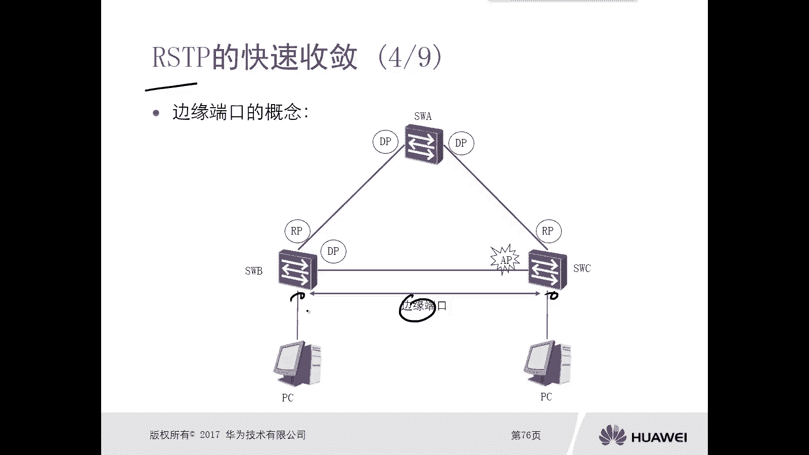
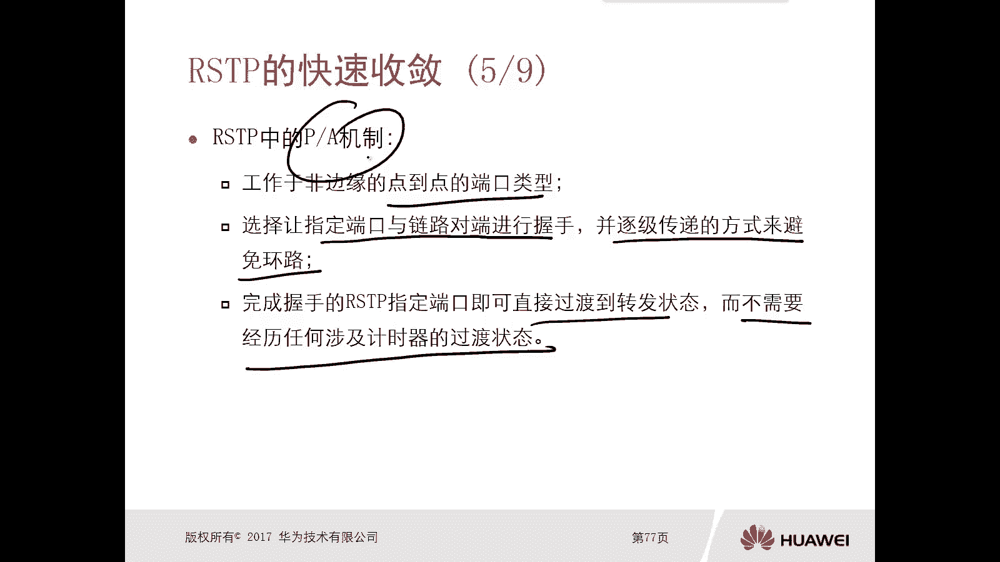

# 华为认证ICT学院HCIA／HCIP-Datacom教程【共56集】 数通 路由交换 考试 题库 - P27：第2册-第3章-3-RSTP的特点和快速收敛 - ICT网络攻城狮 - BV1yc41147f8

好，那么接下来呢，我们再介绍另外的一个生成树协议啊，叫做RSTP，STP呢叫做rapid spenry pro，那么就是快速生成树，那么这个快速生成树呢它是一也是一个标准啊。

我们前面讲spin rpo的时候，这叫做标准参数对吧，它对应的标准802。1D，802。1D好，但是我们现在要讲的这个STP呢，它对应的标准是802。1W，802。1W嗯。

那么ISTP最主要的特点就是rapid就是快，那么在看这个ISTP它的快速收敛的时候，我们先看一下这个spin tree，它的收敛的速度，它的一个特点，那么对于spanish pro802。

1D的STP，那么端口从阻塞状态过渡到转发状态，那么转发延迟呢就会消耗30秒，那么这个呢我们在前面的资料里面也有提到过，他有个状态变迁的过程啊，有两个转发延时啊，一个转发延时是15秒，两个呢就是30秒。

那么第二个呢是当发生故障的时候，那么处于阻塞状态的端口，如果无法无法收到这个B，那么它默认呢会等待20秒，那么这个20秒的前面资料里面，应该也是有讲到的，那么这个20秒就是max时间对吧。

主要就是通过这个max时间去判断我这个链路，是不是和根桥已经无法连通了，那么当这个时间超时以后，那么才会触发交换机重新去计算STP诶，这是STP它的一个收敛速度不是那么高效，不是那么快对吧。

那么我们怎么去改善这个STP，刚才遇到的这个收敛速度慢的问题呢，那么第一个端口，从这个阻塞状态进入到转发状态啊，他需要经历学习，真听两个状态，那么这些过渡状态都是有必要的吗，其实我们可以考虑这个问题。

都是有必要的吗，对吧还不一定，第二个呢是所连接的设备，它根本不是交换机的端口，你比如说我们连接的是PC终端，那么这些端口必须在其他状态中进行等待，才能过多转发状态吗，这样合理吗，不合理。

你想他根本不是交换机端口，有可能会出现环路这种问题吗，不会哎，那你连接终端的不可能出现环路吧，对不对，一般你连接交换机，那么它可能会出现环路，那你没有连接交换机对吧。

一般情况下不会出现这种环境问题的对吧，那你还让他等待吧，等待30秒对吧，合理吗，不合理啊，不合理，好，那么第三个呢是以交换机，将等待根交换机发送的CPU的时间，那么是根交换机发送CPPD间隔的十倍。

那么我们这个根交换机，它发送配置的BPTU的间隔是两秒，对不对，那么十位数是20秒，刚才我们讲了就是max in时间，那么这个等待时间是否过长，所以说我们需要改善STP它的收敛时间。

那么主要我们要从这个造成SP时间过长，这样的因素去入手。

那么对于RSTP它有什么样的特点呢，第一个，取消了和修改了STP标准中，定义的某些端口的一些状态，你看我们刚才讲了，以标准参数里边那么多状态对吧，过渡有30秒有必要吗，这样没有必要，对不对。

第二个呢是定义了集几个新的一个端口角色，和一些可以让端口直接有阻塞状态，过渡到转发状态的一个情景，唉清醒啊，那么这个呢我们后面会去讲这个有备份端口吗，有这个AP啊，他们都是对某些端口起到一个备份作用。

在某种情况下，它是直接从阻塞状态变成一个转换状态，比如说他备份端口出现问题了，那么第三个呢是减少了交换机，等待根交换机发送CBBD的时间，那么我们的标准参数里边呢是20秒，就是你20秒。

如果说没有从根桥收到配置pd，那么认为和根桥之间的互通有问题了，我也经收敛，但是对于RSTP呢，它不是等待20秒，它是等待六秒啊，六秒怎么来的，是三倍的哎，这个配置BB它的间隔就是hello间隔。

那么hello，jack是每两秒发送一次配置，对不对，那么三次六秒六秒内收不到，从根桥发送过来配置BIU，那么这种情况下，交换机呢立马发起一个生成树的收敛，这样就减少了。

对不对，那么对于RSTP的端口角色有哪些呢，第一个跟端口对吧，这个在标准参数里面也是有的，那么他的选举原则和标准生成数的，选取原则是一样的，第二个只能DP，而这个在标准生证书里面也是有的。

那么选举原则和标准的802011，圣诞树协议，他的选举原则是一样的，那么预备端口，预备人口在标准生书里面也是有的，在标准参数里面怎么去描述这个预备端口呢，就是选完了诊断口，选完了诊断口。

那么既不是根端口，又不是指向端口的端口，那就是一个AP，但是在RSTP里边又增加了另外一个端口，角色叫做BP做备份端口啊，不用端口哎，那么这个备份端口和预备端口，AP到底他俩是什么样的。

一个一个一个场景下会出现呢对吧，那BP又是什么东西呢是吧，哎我们看一下这个预备端口和备份端口，它这个比较，那么预备端口叫做AP备份端口，就是BP，那么这两端口首先他们有个相同点，就是拓扑完成收敛以后。

都是会被STP阻塞掉，那么阻塞那意味着它不会去转发数据对吧，哎只是能够处理也不发，好那么第二个呢，第二个是端口接收到更优的PPTU，是由其他网桥转发过来的，那么代表这个端口呢是预备端口。

那说白了就是你怎么去区分这个接口，到底是一个预备端口还是一个备用端口，如果说你这个端口收到的一个更优的BD，也就是说你没有变优，如果这个更优的BP是其他的网桥转发过来的，那个端口端口，那么反之呢。

就是如果说你端口收到的更优的BP，是本网桥发出来发出来的，那么代表这个端口为标准端口，那我这个交换机的端口，怎么去判断这个BBU，到底是其他网桥发送过来的呢，还是由本网桥发送过来的呢。

因为我们发送BB的时候，它有个求id，你是不是可以通过桥id去对比，你这个端口所在的交换机的BD，他俩是不是一样的，一样的说明就是不用网球发送的不一样，就是其他网球发送了呗。

对吧哎你比如说我们这儿有个图。

大家可以看一下，假设这个交换机交换机A是丁桥，那是根桥的话，那么交换机直接相连的接口是DP吧，这个我觉得不用做过多的解释了，前面讲过对不对好，然后交换机B和交换机C啊。

假设假设交换机B的优先级是4096，那么交换机C的优先级是3276，八，根桥呢他是零，那么这样的话交换机B，交换机C和交换机A互联的端口，那么一定是RP对吧，这个没得说啊，好那么接下来是在这个网段上边。

因为这是个集线器哦，它是一个hub，它不是交换机啊，它是集线器，那么在这个网站上要去选择一个诊断口，对吧哎在这个段上面要选取一个井端口，那么选举指定端口是在谁和谁之间去选呢。

一定是在交换机B和交换机C它的端口唉，这三个端口要选择一个，对不对，哎他们之间要选一个，好那么根据选举原则啊，我们可以看到开销是一样的，那么优先级不一样哦，那么4096，那么肯定是这两个端口。

一口和二口这两个端口其中有一口一定是DP，所以说可以确定的是，交换机C的这边一个端口一定是AP，那么对于交换机B来讲，一口和二口对吧，那么如果说有一个端口是DP对吧，另外一个端口呢就是BP哎。

那么这两个端口那怎么去选这个DP呢对吧，又是根据我们之前的DP的选选选，选入原则对吧，这个选举规则啊，那么选举规则就是还是开销，开销比不出来BD一样，端口id p i d嘛，对不对。

我前面讲过PID的话，你看这一口这二口自然一口优先的，所以说一口一定是DP，那么第二口只能是BP，哎我们可以看一下最终的结果DP对吧，A p b p，所以接下来我们再去回顾一下，刚才我们讲的DP和AP。

他们的一个这个就是确认，怎么去确认到底是AP还是BP，那么对于这个app来讲，我们可以看一下，他从交换机B收到的B是不是比CU，比交换机CU吧对吧，因为交换机B的优先级是4096啊。

那么你C呢是30768，对不对，比他U同时，那么发送这个BBU的丁桥是你自己吗，不是自己呀，是交换机B啊，所以这种情况下我只能是AP，那么对于BP来讲，你一口喝二口相互发送了BBD对吧。

那么对于2K来讲，我收到了一个最优的BP，比我更优的BT，那这个PPTU，是不是我这个二端口所在的根桥B发出来的呢，是因为它是从一口发出来的，比我U8，对不对，哎这种情况下，这个二口呢一定是个BP。

所以说这个很重要的，我们一定要知道怎么去确认，这个接口到底是一个AP还是一个BP，好那么这个预备端口和备份端口，它也是ISTP快速收敛的一个小特点，那么对于AP来讲，它是为谁做备份呢，为RP做备份。

BP呢是为DP需做备份，那当你比如说阿B出问题，那么AP就立马可以进入的转换状态，对不对。

哎这也是它快的一个特点啊，好那么接下来我们再看另外一个另外一个角色，那么在我们的STP里面呢，是第一次提出来叫做边缘端口，哎叫做边缘端口，那么边缘端口，边缘端口，实际上第一次提出来是在RSSTP里面。

但是大家可以下去去用交换机去做一下实验，在标准的生成树里边，在华为的设备上也可以去做编程，啊也可以做这个端口啊，那么对于这个边缘端口，实际上交换机它自身他不知道谁，哪些接口是接了终端的，他不知道对吧。

反正你插网线都亮了，我也不知道你是一个交换机啊，还是一个PC，我不知道对吧，所以说这个标端口是要管理员去手工去配置，你，比如说我们看我们交换机B和交换机C，分别都连着这个PC，对不对，那管理员很清楚啊。

这是连PC的，所以这种情况下，对于交换机B和交换机连接PC的接口，我们要通过管理员手工去配置成变端口，那么配置完边缘端口的接口，是不再参与生成树那些端口的一个状态的变迁，那么这些端口有一个特点，特点呢。

就是接上网线以后，他立马从一个down的状态变成一个否定状态，很快就不再像我们之前讲的这个标准分数，你还要等什么，learning listening吧，最终否定你最起码要等30秒，对不对。

但是现在有了这个端口，你这样往下就能通了，对这样给客户的体验是非常好的，对不对，哎所以说在线网里边啊，在现实的网络环境里面，你比如说我们学校里面交换机对吧，甚至一些企业网里面的交换机是吧。

那只要你拿个网线怼上去后，立马就亮了，哎就能上网了对吧，哎一般都是由于它配了这个叫做边端口，如果不配的话，你等着网线，你等一会儿，最起码等半分钟，对不对，哎才能上网，这个肯定是一个非常好的特点。

非常好的一个技术点啊，我们都会去做操作的，一般都是建议去做的好，但是啊这是我们正常情况下，就是理论上来讲，那么你需要管理员去手工去配，哎，但是注意一下啊，我们华为交换机最新版本的，就是这个系统版本啊。

最新版本的这个申通协议是吧，哎它可以自动的去发现哎，这是一个边端口，这是连接了PC端口，这样你手工就不用手工去配了对吧，哎这我提一下，大家下来可以去查一下华为官方的HX文档，去看一下对吧。

他具体怎么做的，哎这个注意下，我这提一下啊，嗯好这是一个边端口啊，这也是RSTP它快速收敛的。

收敛的其中一个一个点，那么另外一个非常非常非常重要的，就是RSTP里面的PA机制啊，叫做proposal agreement，那这个proposal agreement。

实际上是BPD里面的一个option v啊，是一个标志位，一个叫做婆婆手，一个叫做，那么这个PA机制，应该是RSTP里面的一个核心，你像我们之前讲标准生成数8。2。1D，那么他完全是按照时间去收敛的。

就是等对吧，我等一个listening，等一个learning，最终否定，那不就是等嘛，但是RSTP呢，它和它设计的思路和标准不太一样，那么SP的一个原则，就是如果说确定某些链路没有环路。

那我就可以立即进入到转换状态，而不需要等时间，以此加快收敛，这就是PA1制它的核心，那么我们看一下RSTP里面PG日啊，首先PG日必须要工作于非边缘的一个，点对点的一个端口类型，必须是点对点。

那么第二个呢，是选择让指定端口和链路对端进行握手，并逐级传递的方式去避免环路，那么对于P机制，他去协商的时候，他是逐跳逐跳去做的，就逐段逐段去做，这样的话你逐段变成转换状态对吧。

你其他的没有转换状态是不会有环路的，和标准生成树不一样，标准生成树就是靠时间，靠状态去避免环路，对不对，那么完成握手的ISTP，那么指定端口立马就可以直接过渡的转换状态。

而不需要经历任何涉及计时器的一个过渡状态，哎所以说这个一定一定很重要啊，我们RSTP里面的PA机制对吧，是它快速收敛的一个核心好。

那么接下来我们就看一个例子啊，你比如说呃，这是一个这个园区网最经典的一个拓扑对吧，分为什么接入层啊，分布层啊，核心层啊，这是我们一个基础啊，嗯假设假设这个交换机A它是钢板桥，但是现在呢。

交换机A和交换机B之间的互联链路，虚线的出现问题了，那么出现问题以后呢，实际上那么他为了防止这个环路啊，那么生成树的这个协议呢，它将交换机B的其中一个端口。

把它变成一个这个l alternate point AP端口，那么处于一个阻塞的状态，就不会环路，你看在这个环境里面，你看我们的线呢是实际上是有环路的，这样的一个环嘛，对不对，诶。

把这个接口作作为一个AP，那么这个环就没有了，哎这是出现故障的时候，假设这个链路又恢复了，那么恢复以后呢，要重新去做一个SSTP的计算对吧，那么计算的时候，那么这种情况下，你看啊这个链路啊。

这个链路好了好了。

那么这个链路上呢就开始执行pa机制，RPA机制，那么这个P机制指的是根网桥去发送BP的时候，把他BP里面的proposal位置位，同时它的端口是DP吧，因为是根桥嘛，DP啊。

同时呢他是希望立即进入了转换状态的，那么交换机B收到proposal置位的PPT以后，他首先会判断你接收到的这个proposal的端口，是不是非常好对吧，那么他肯定是可以确定的，你对端设置的端口。

那么这边肯定是跟端口，那么确定自己接收到的这个proposal，这个端口啊，它是根端口以后，那么交换机B为了避免环路，它会将自己其他的所有的非边缘端口，所有的非编单口，大家注意的是，所有的非变单口。

把这个端口呢给它进入到一个discarding的状态，那么discarding状态，实际上就是有逻辑的组词状态，那么这个呢叫做PA机制同步过程，那么这个过程呢主要就是为了防止环路，为了防止滑落。

那么当它同步以后呢，这个交换机B啊，朝着交换机A去发送一个agreement，自费的一个，同时，立马将他这个端口，就是RPRRP变成一个切换成一个转换状态，那么交换机A收到agreement bb以后。

那么这个端口DP立马就进入到一个转换状态，那么在这呢你看你注意一下啊，其实就是PA交互一下，两个端口瞬间进入到转换状态，有没有计时器啊，没有对吧，但你这样立马进入转弯状态，会不会滑落呢，不会。

因为呢我交换机B把下游的接口，非编的口都处于阻塞状态，所以说我刚才还是我讲的对吧，你RSTP它的核心是什么呢，核心是我在判断某些端口立马进入的转换状态，如果说没有环路，那么是可以直接不需要时间去等待的。

立马进入到转换状态对吧，那在这个环境里面，你想你B交换机，把下游其他所有端口都处于这个discarding状态，不通了，那么你这个链路瞬间能打通，有问题吗，没问题对吧，按照标准声数就不行。

标准生成数为什么有端口的一个状态的变迁，它的原因就是就怕你瞬间folding瞬间环路，所以他得等时间，所以标准等时间的目的就是为了解决环路，环路最起码是临时环路对吧好，那么当这这段链路收敛完了以后呢。

那么继续往下收敛，你比如说交换机B和交换机D之间，IPAI这边PA，那么它是一段一段去收敛的对吧，那这样的话，即使你链路两端的端口瞬间进入到否定状态，是不会有任何环路的，哎这就是STP里面的P机制啊。

这就是RSTP里面的P机制。

那么最终呢你看他选出来DPDPRP呢，有这个AP，那么这是重新收敛了啊，重新收敛了，那么注意一下啊，这是ISTP的收敛，如果有人就问了，如果说以这个交换机D对吧。

比如说达到一口和二口连接的是PCAPCB，但是这个一口又没有配置，刚才我们讲的就是标准口，那么这个接口该怎么收敛呢，哎这种情况下，除了他只能按照时间收敛，就有点类似于标准身份的收敛方式了对吧。

等时间嘛对啊，所以注意一下RSTP里边，你交换机和交换机之间肯定是P1制，但是如果说你边缘边缘，这些连接终端设备的端口，如果说没有配置边端口的话，那么呢它们是等时间的，所以说一般呢都要去配置这个编程口。

快速收敛嘛，多好，对不对，哎，这就是这个ISTP，它的一个特点和快速收敛对吧，我们我们我们总结一下啊，那么主要是它的快速收敛对吧，主要是这个快速收敛嗯，那么快速收敛呢主要是体现在几个方面。

第一个方面呢就是核心的是P杠A机制，对不对，第二个呢它有什么AP有什么BP去做备份，那么某些接口出现问题以后呢，它可以进入到一个转发状态啊，那么第三个呢是它又多了一个叫做边缘端口啊。

那么边缘端口可以这个接线以后呢，不需要等待这个转发时延，可以直接进入到否定状态好，那么第四个呢是那么我怎么去探测网桥出问题，或者说和网桥之间的链路出问题，还需要等20秒的时间吗，不需要只有六秒的时间。

那么是三倍的，Hello，时间，对不对诶，六秒哎，这是这个RSTP它的一个快速处理。

