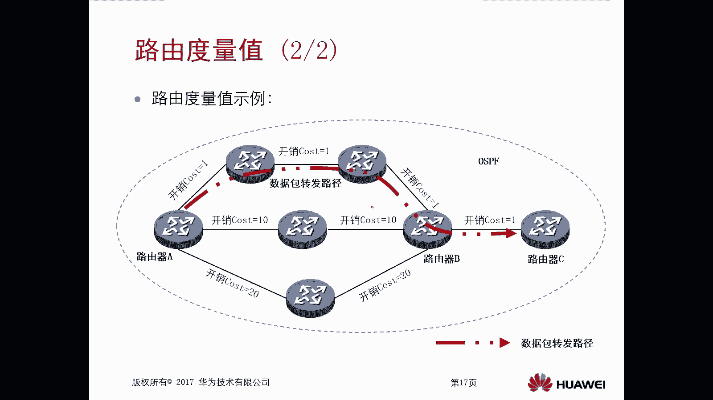

# 华为认证ICT学院HCIA／HCIP-Datacom教程【共56集】 数通 路由交换 考试 题库 - P28：第2册-第4章-1-路由基础 - ICT网络攻城狮 - BV1yc41147f8

好那么接下来我们看一下这个路由基础啊，路由啊，那么在这呢是routine对吧，这个指的是这个中间设备，你比如说我们有这个路由器，或者说这种三层交换机嗯，那么这些设备呢通过查找路由表。

注意一下一定是三层的设备啊，是路由设备，他才能查到这个路由表啊，那么对数据包进行转发的一个处理方式，就叫做UT啊，那么这是一个动词是吧，那么本章呢主要是通过以下六个方面呢，对这个路由的基础来进行介绍。

那么第一个呢是陆游的一个基本概念的回顾，那么实际上我们在前面的章节呢，实际上是讲过这个路由的一些基本概念是吧，那我还要去做一个简单的回顾，然后呢引出来这个路由表和路由条目，那么实际上路由表和路由条目。

我们在前面也介绍过对吧，我觉得大家并不陌生啊，然后后面呢我们还会去讲路由信息的三种来源，包括路由里边的比较重要的相关概念，比如说路由先级呀，路由度量值啊，什么是直连路由，OK好。

这是这个路由基础要包含的内容，那么首先呢我们先看一下这个路由的基，本概念的回顾啊，前面讲过了是吧，哎我们可以想一下啊，第一个呢，我们看这个Mac地址和IP地址的一个对比，哎我们先想一下Mac地址。

IP地址这个地址的作用是什么，作用就是定位设备的，对不对，所以说他们是都可以用来定位设备，但是对于Mac地址和IP地址，我们前面讲层次的时候，我们讲过他们处于的层次不一样，Mac地址是什么层次啊。

是不是在数据层，IP是工作在网络层，哎所以说呢他们工作的层次是不一样的啊，那个Mac地址呢一般我们称为叫做物理地址，但是IP地址呢我们称为叫做逻辑地址，为什么叫做物理地址，那个Mac地址。

因为我们说这个Mac地址呢，就是厂商去生产设备的时候，他会把这个Mac地址给它，收录到这个网卡里边对吧，网卡里面嗯，所以在传输数据的时候呢，这个数据封装的时候，你在三层封装的是IP。

在二层封装的是Mac地址，而且而且那么数据在传输过程中，每一跳他的Mac地址都会去变，但是IP地址是不会变化的，所以说Mac地址呢它是随着载体去移动的，你比如说你在A路由器上发出来的一个数据帧。

他的Mac地址假设可能是A和B，对不对，原木Mac地址可能是A和B，那么到了B以后，B发出来的这个数据帧，它的原木Mac地址呢可能会变成B和C，但是IP地址呢在这过程中，他是不会随着这个载体去移动的啊。

这是他的好，那么刚才我们讲的啊，设备想要去转发数据，那么必须呢他得有数据库，那么接下来我们看一下这个网络设备，它建立转换数据库的方式啊，那么第一种，第一种建立数据库的方式是我们设备啊。

它会自动的把各自的接口所在的子网啊，记录到这个转发数据库里面去对吧，你随便找一下设备，你只要配上接口IP地址，它就会自动把这些接口所在网段给记录进去，我没有配什么动态路由，没有配静态路由对吧。

诶自动的一个行为诶，这是第一种情况啊，你甭管是我们路由器也好，还是我们三个干换机还是防火墙对吧，只要是直连的三层的都会收进去，那么第二种呢，是我们可以直接向着这些网络设备，向着他网络设备。

在他的转发数据库里面去输入，某些子网转发数据的路径，唉其实就是我们要讲的这个静态路由诶，我可以写静态路由告诉路由器是吧，哎你的数据库是什么样的，第三个呢，就是我们可以在网络设备之间去配置，动态路由协议。

那么通过动态路由器这个交互呢，相互去传递路由，相互去学习路由啊，所以说呢也会形成它的转化数据库，那么这个转发数据库，实际上指的就是我们网络设备里边，它的这个路由表啊，其实就是路由表一条一条的题目诶。

这个条目对吧好，所以我们看一下路由路由里面刚才讲的数据库，其实就是路由表，Looting table，它等价于这个转发数据库好，那么路由表中的路由条目，因为我们说你一台路由器的路由表。

它实际上是有好多路由条目组成的，一条第二条，第三条，第四条，很多路由条目实际上是转发的路径，唉等于这个数据转发的一个路径好，那么路由表去转发数据的时候，它的工作原理是什么样的呢。

你刚才不是说了有这个转发数据库嘛，对不对好，那么路由表实际上是路由器赖以转发数据包，的数据库，那刚才我们介绍了数据库，这是必须的，你路由器必须要有一个这个数据库，也就是说必须有一个路由表。

那么有了这个路由表，有了个数据库，当你路由器在收到数据包的时候，我就可以利用数据包里面的目的IP地址，去匹配路由表中的路由条目了对吧，然后根据这个前面我们讲了，我们讲过对吧，你怎么去运算。

一般都是逻辑与运算对吧，你通过这个网地址啊，或者路由表象王源码进行一个运算，那么得到一个网络地址，对不对，然后我们做匹配对吧，然后根据匹配的一个条目里面的路由参数，决定如何去转发这个数据包。

那么这个路由参数有哪些呢，那就是瞎跳啊对吧，然后这个出接口啊对吧等等这些信息，好那么在路由器上，如果说我们有这个路由表，或者说有这个数据库，我们通过什么样的命令去查看呢。

哎那么我们可以通过命令查看这个IPV4，路由表的信息，那为什么现在讲的是IPV4啊，那么我们未来可能会讲到IPV6对吧，当然我们先从IPV4去讲，所以说呢我们要查看这个IPV4，路由表的一个摘要信息。

那么加入信息呢它只是一个简要信息，那么就是display IP netable，那么就能看到，但是假设你比如说你想要看某个路由表的一个，详细信息，或者说你整个路由表的详细信息。

或者是单条路由条目的路详细信息，那么我们需要在这个尾部加上birth这个参数，那么就是li p u t table为B啊，但是这个命令啊以一般情况下呃，不会说建议大家去用这个的。

你假设啊我有我有一台路由器，路由器里面可能有上千条路由表，假设上千条，那么你上千条的话，你通过display IP routing tbs的话，那么你看到的内容太多了对吧。

所以说我们一般情况下是有针对性的去看你，比如说我可以display IP routing table，那么后面加个网站，比如说10。1。1。0，然后we boss正常下只是看10。1。1。0。

这条路有它的一个详细的内容啊，这个没问题啊，好那么我们接下来看一个实例啊，这下面给了一个查看路由表的一个实例，那么在一个台路由器上的display IP routine table。

我们可以看到在这个路由表里面呢就是java信息，那么java信息呢就是一条一条一条的路由表对吧，那么通过哪个协议学习到优先级啊，开销啊，flag v啊，吓一跳啊接口，那么这是主要的一个内容对吧。

但是如果说你要看一个伪boss的话，那他内容太多了啊，他内容非常非常多，那么一会儿呢我会给大家去演示好，那么正如我们现在看到的这个路由器的路由表，有这么多，那么这些路由信息怎么来的。

或者说这个路由器怎么得到这些路由信息对吧，那么也就是说路由信息的来源是什么样的，一共有三种，第一种呢就是直连路由，那么直连路由呢，只要你连接该网络接口状态是正常的，这个正常的指的是你的协议是up的。

你的物理接口也是up的，那我们俗称叫双up，对不对，双up的情况下，不需要做多配置啊，不需要多做配置，那么直连路由呢就会出现在路由表里边，那么这个呢我们一会儿有一个专门的章节去讲，这个质量路由。

我会在我会给大家去做实验啊，这第一种啊直连路由，那么第二种呢就是静态路由，那么静态路由，实际上我们在前面章节中呢也讲过啊，我印象中是在第一册里面，对不对，哎讲了一个静态路由的基础，那么静态路由呢。

是实际上是需要管理员手工去添加啊，一个特定的，把路由给它添加到这个路由表里面啊，这种呢就是静态路由，那么静态路由实际上用场景还是比较多的，那基本所有的网络环境里边，你最起码都得有静态路由对吧。

比如说我们的企业网出口网关都会有好，那么另外一种呢就是我们在内网，在你的路由器组网的环境里面，最经常用的就是一个动态路由啊，动态路由，那么动态路由呢实际上就是通过路由协议，那么路由协议。

那我们后面会去讲哎什么有rap啊，有OSPF啊对吧，什么有BP啊等等等等，那么这些路由协议呢，它是可以相互的学习路由信息的啊，它可以从邻居路由器里面去学习，那么感知路由的变化动态去调整唉。

这个动态路由呢，也是我们往那边必须要用的对吧，不要用的好N，那么我们先看一下这个直连路由啊，那么直连路由呢嗯刚才实际上我们已经看到了，就是不需要额外的路由配置，它会自动添加的。

但是前提是你得为这个设备的接口，配置IP地址对吧，你不配IP地址，它看不到的，那么静态路由呢就是你要手工配置，你要告诉路由器怎么去往某个目标网络，那这个前面我举个例子，就好比是你在一个十字路口对吧。

你十字路口你没有指向，你需要唉找一个工作人员，在这个十字路口盯上一个这个路标，A口穷哪，B口全，C口全哪，这类似于这个你必须要手工去做，那么动态路由呢，就是你通过其他路由器分享的一些路由信息啊。

去获取远端网络路由，那这个就好比是你到了十字路口有个导航，对不对，导航你就知道了，哎这个路口去哪儿，那个路口去哪，对，哎，那么后面呢我们会有专门章节去讲，这个动态路由，直连路由，静态路由好。

那么在路由里面呢，我们可以看到一个非常重要的概念啊，或者重要的参数啊，我们看这有一个叫做优先级啊，优先级，那么这个优先级是干嘛使的，那么如果说当你从多个途径，比如说有一台路由器。

从多个途径学习到去往相同目标网段的时候，那么这种情况下，如果你是通过不同协议而学习到的，那么这种情况下，就要根据路由优先级进行选入了啊，那么路由优先级是什么意思呢，路由优先级是路由器给每种路由信息。

去赋予的一个权重，那么这个权重呢就叫做路由优先级，也叫做协议优先级，那这个协议优先级它的作用是什么呢，作用就是我刚才说的，当你有一台路由器对吧，你通过多个不同的协议啊，啊学习到了同一条路由。

那这种情况你想你通过多个不同的协议，学习到了同一条路由，也就是说你有你可以通过不同的协议对吧，也就是说多条路径去往某个目标网段，那这种情况下你要不要选一选，哪一个更优先一点，就是通过路由陷阱。

所以说这个路由优先级，就是你这个路由协议不一样，它优先级是不一样的，所以我就可以分出来对吧，我就可以选出来，那么选的时候哪一个更优先呢，一定是六优先级，它这个值越小的代表这个类型的六，它的可信度越高。

所以说值越小越优先，那么在IP路由表里面呢，它的呈现是在哪呢，实际上我刚才一样，大家看到了，你看display IP routing table，我们可以看到your destiny mask对吧。

然后ptcl perfect，哎，就是这个位置，那么我们可以看到不同的协议啊，你看这个协议对应的是有rap，有直连，有static静态，那么它们所对应的优先级是不一样的，你看rap100对吧。

只是连零静态六十一百，那么值越小越优先啊，那么常见的路由路由的优先级有哪些呢，实际上我们看的差不多了，对不对，就有一个OSPF没看到直连路由，在路由表中它的标是direct，优先级是零。

那么OS撇F路由标识，OS撇F优先级是十，然后呢我们还会去讲SPF，还有外部外部的优先级是150，这个指的是内部，内部外部是150，静态路由static60，rip100看下，所以说有了这个优先级。

那么如果说我一台路由器学习一条路由信息，通过多个协议学习到了我怎么选路，我就按照优先级数值小的选，比如说我们这有个例子，大家可以看一下，那么假设这个A路由器，要去访问C路由器上的一个网段。

比如说这个C路由器上的网段是10。1。1点，零杠24段，A我们要去访问它，但是A路由器去访问C路由器的时候，实际上它有三条路径可以走，上面可以走，中间可以走下面，那么假设正好这三条路径。

它运行的是不同的路由协议，比如说上面这些路由器，它运行的是OSPF动态路由器，也就是说你C上面的这台这条路由信息，10。1。1。0杠24，这条路由条目，它可以通过OSPF的方式传给路由器A。

那么中间这条下面这条链路是通过rap的方式，也就是说你路由器C上，这条路是可以通过rap的方式传递到路由器A，同时呢我又在路由器A上加了静态路由，也可以去往路由器C，那么这样的话在A上边注意一下啊。

在A上边就有三种途径可以去访问67C，分别是从OSPF学习到了一条路由，10。1。1。0，那么又从rap学习到一条路有10。1。0，然后第三个呢是我用手工静态去配了，那么这种情况下。

他要选一个优化的最优的，怎么选，根据优先级，那么根据优先级的不同，我们说OSPF它的优先级是多少时，rap呢100静态呢60，所以这种情况下它的数据访问的时候啊，一定是优选上面OSPF，没有吧。

这个一定要注意一下，一定要注意一下啊，他肯定要选一个优先级，数值小的，但是有人就问了，假设假设我上面是OSPF，下边也是SSPF呢，中间也是OSPF呢，那么全都是OSPF，我这个路由器对吧。

通过相同协议，不同的路径学习到一个相同的网段的时候，该怎么选对吧，OK这时候就会用到一个叫做路由度量值啊，路由度量值，那么什么叫做路由度量值呢，路由度量值指的是去往目的网络的开销，哎就好比是你你要去。

比如说到了十字路口，哎，这十字路口实际上这几条路啊，都可以去往天安门啊，那么开销呢就是哎你从这个路口去往天安门，5km，从这个路口去往天安门哎，10km哎，就是开销开销实际上就是远近那么远近。

你想是不是这个开销越小越优先呀，哎度量值越小优先好，那么不同路由协议，它参考计算度量值的因素也是不一样的啊，那我们可以看一下，在某台设备上，我们display IP ring table。

那这个度量值在哪呢，在这个位置cost哎，cost对吧，我们可以看到什么这个rap2啊，有一的呀对吧，这个直连和静态呢它就是零了，对不对，然后还有其他的包括OSPF好，那么比如说我们这儿有一个例子啊。

大家可以看一下，就是刚才把这个图全部都搞成OSPF了对吧，全部都搞成OOSPF，然后我们去往那个CC上面，有个网段是10。1。1。0，假设还是对八，那么我从上面这个链路也可以通过OSSPF学习到。

从中间链路通过OSSPF学习到，从下面这个链路也可以通过OSPF学习到，那么也就意味着路由器A通过三个不同的链路，学习到了去往同一个目标网站10。1。1。0，那么这种情况下，我路由器A选一个最优的时候。

怎么选，选开销，那么选开销我们可以看一下，从上面这个链路的开销是多少呢，哎1111，那就是四，对不对，那么中间呢十二十二十一对吧，下面呢二十四十四十一，那就每个链路它的开销值啊有大有小。

那么你加起来是总的一开销，所以说他选的时候一定是总的开销，最终路由器路由器路径还是走上面开销只小哎，这是这个度量值啊。

