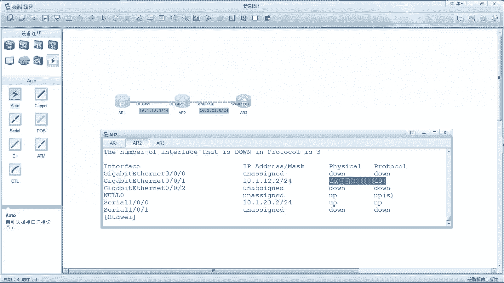
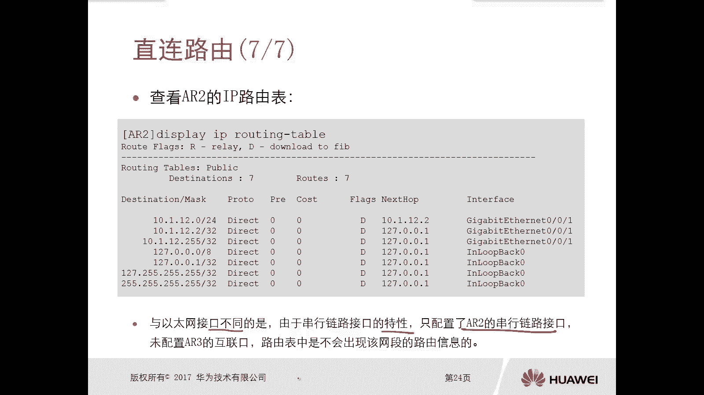
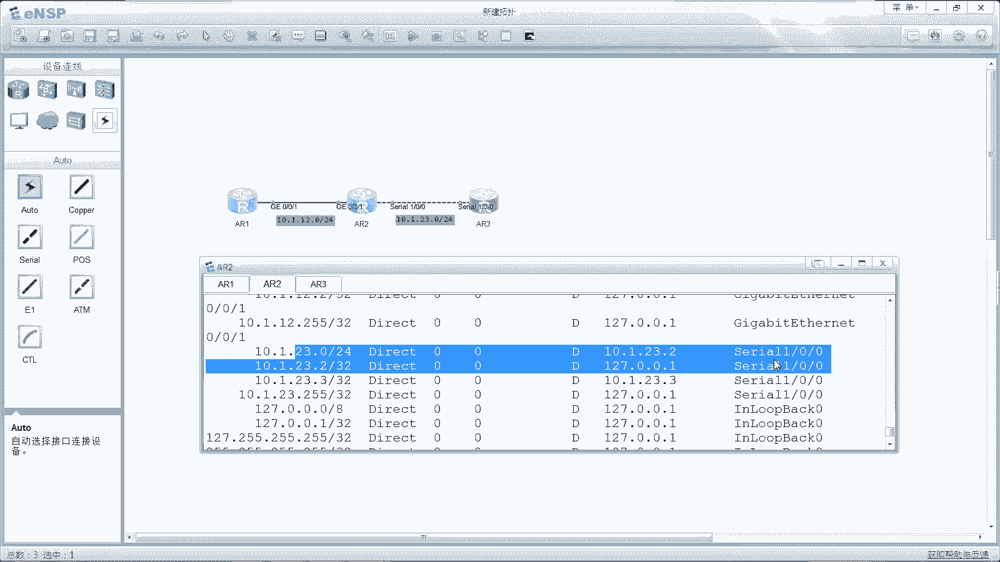
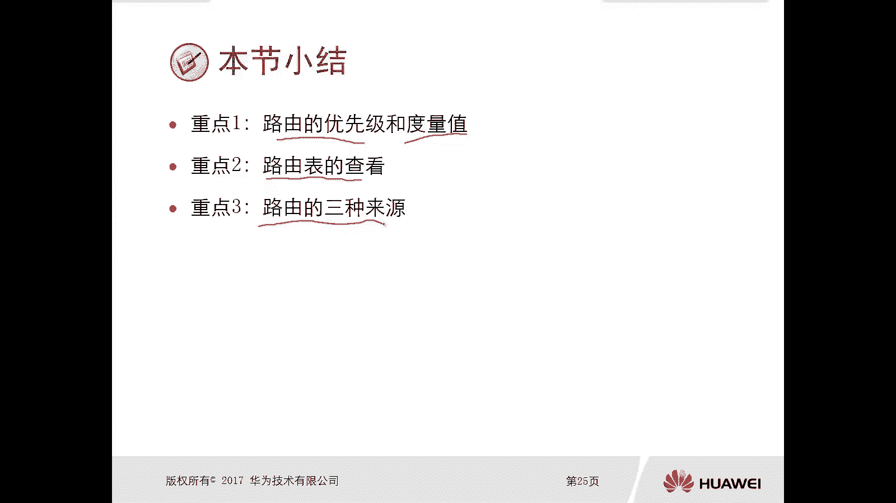

# 华为认证ICT学院HCIA／HCIP-Datacom教程【共56集】 数通 路由交换 考试 题库 - P29：第2册-第4章-2-直连路由 - ICT网络攻城狮 - BV1yc41147f8

好接下来我们看一下这个直连路由啊，重点单独把它讲一下啊，嗯那么直连路由呢就是我们前面也介绍过了，这个路由器呢会把这个状态正常的那个接口啊，它所连接的这个网络作为这个直连路由，放到自己的那个路由表中。

那么什么是状态正常呢，那这个状态正常的主要是体现在两个方面，第一个呢就是你的接口的物理状态是up的啊，第二个呢是你的这个接口的这个协议，状态呢是up的，哎我们俗称的双up，这种情况下。

这个接口才是一个正常的接口，这样的话这个直连路由才会有那么节点路由，它的这个路由先级和度量值呢全都是零啊，全都是零，那么直连路由的优先级，还有刚才讲的这个度量值呢，它是都不可以进行修改的啊。

缺成什么样就什么样不能够改的啊，嗯嗯嗯那么我们看一下啊，这有一个实例啊，实例很简单，就是有三台设备诶，诶123嗯，然后这个接口写的很清楚啊，网段写的很清楚嗯，那么如果说你没有去做任何配置的话。

没有去做任何配置的话，那么我们通过在一台设备上去display，IP interface brief这条命令去查看那个接口啊，这个接口呢你会发现你会发现，那么所有的接口的加入信息呢都有对吧。

那么我们可以看到第一项就是interface，你的接口号码对吧，然后你这个接口有没有配置，IP地址掩码是多少啊，那这个明显是没有做任何配置，然后物理就是物理的状态，你是down还是up的。

习状态是down还是up哎，那么这个注意一下，有一个特殊接口，是一个空接口啊，这是一个特殊的虚拟接口啊，所以他没有配IP地址，没有配地址的情况下，它的物理和PCL都是up的。

那么我们不要去关注这个空接口，我们主要是关注这个物理接口，那么物理接口现在我们可以看到，实际上所有的物理接口，它的协议都是down的，那么都是down的，那这种情况下呢，他肯定是没有路由表的。

路由表是看不到的对吧，所以说由于我们这个ARE啊，它的接口是没有配IP地址的，所以这个接口呢它处于这个未激活的状态是大，所以此时这个IP路由表中是不会出现，和啊这个接口相关的任何的支线路由信息的啊。

我们可以通过在121上去display IP routing table，我们可以看一下有没有这个直连的一些，录入信息呢，就关于这个接口的没有，你看它全都是其他的一些什么还归口啊，这个就不管了。

那么我们为了让这个路由器啊，能够将这个接口它的网络的路由信息啊，添加的这个路由表里边，我们可以在这个ARE的G0杠零杠一上啊，去配置一个IP地址，那么去激活激活这个接口，那么配置方法很简单。

我们前面讲过对吧，就是interface g0杠零杠1ip address，10。1。1。一二十四就可以了对吧，做完以后我们display IP interface brief。

我们就能看到它的物理口和协议，就是物理的层面和协议层面全都是up了，那么既然up了，那么接下来你再去看这个路由信息啊，就是看路由表，那么这个路由啊就出现在路由表里面，我们可以看一下，11。12。

24直连路由，那么优先级和开销都是零下跳呢，12。1接口G02021，对不对，哎就这样了，嗯好，那么我们在这呢我们要去做一个简单的实验啊。

实验你比如说啊，比如说我们这个拓扑图和这个PPT里面，这个拓扑图是一模一样的，对不对，好，我们现在这个A二一上面啊，我们先进来看一下，啊我们先看一下DC IP interface brief。

哎我们看到这个设备上有这么多接口，但是这个接口呢我们可以看一下啊，嗯缺省呢，你只要只要你连了线，它这个物理接口呢就是一个up的，我们可以看一下这个拓扑图，没有连线对吧，只有G020跟一连线了。

它的物理全都down了，你看现在这个口是绿的，绿色的，对它是up的，但是它的协议啊是down了，因为我们这里面是没有配IP协议，没有配IP地址，IP协议是有问题的啊，所以说在这种情况下。

你display IP routing table啊，你是看不到相关的直连路由信息的，那么只有他的一些还回的路由信息啊，这个不管它嗯，所以呢我们需要在接口G0杠，零杠一去配置一个IP值，10。1。

12点，这个比是一二十四啊，那么做完以后呢，实际上你看这个就会报一个报告信息啊，说这个IP协议在这个接口对吧，被使用了，然后同时现在的状态是up了。

好那么我们再去display IP interface brief，我们看一下关于这个接口，它的物理层面和企业层面都是OK的啊，只有这两个双up对吧。

我们再去display IP RT political，才能看到相关的路由信息，11。12。24只是链路由对吧，优先级开销都是零，那么同样在二上面呢，我们也要去做配置，你没有做之前。

你display IP interface brief对吧，我们可以看一下这个二上的G02021口，它的物理层面是up的，协议层面的是down的，对面的，所以也是一样的，我们在记零杠零杠一口配置地址。

10。0。12。二二十四对啊，Display ip interface brief，哎，现在是双up了，对不对，那么上up以后呢，我们再去display IP routing table，就能看到12。

01直接路由好，接下来我们按照相同的方法，在二上将它的S1杠，零杠零口去配置一个IP地址对口，10。1。23。2，24，10。1。2，3。22104。

我们display IP interface brief，好display IP interface brief，我们看一下这个S1杠零杠零口，S1杠零杠零，嗯好这个没问题啊，我们往下看啊。

就是刚才你看我在这个track上也配了，这个IP地址对吧，然后他的这个物理状态和谐状态都是双up的，那按照刚才我们讲的，你应该去查找路由表的时候，应该能够看到这个二三网段的路由，对不对。

我们试着看一下啊，Display ip routing table political，哎，我们看一下，这里边有没有二三网段的路由信息呢，没有没有吧，哎所以说很奇怪诶，你看这个串口。

你看这个串口的状态和你太网的端口的状态诶，是一样的哟，但是不一样的就是你以太网的双up以后，它就会有路由，但是串口呢是没有路由的，哎所以接下来我们看一下这个PPT啊。

好我们看下PPT，PPT呢是在这个二上面做了这个接口IP地址配置，同时呢在二上的S1杠零杠零口呢，也做了这个IP地址的一个配置啊，啊但是做完以后呢，他去查找这个路由表啊，在路由表里面呢。

实际上是没有看到串口，它所在的这个网段信息的啊，所以说一定要注意一下和以太网不同，那么串口呢它是由于这个串行链路，接口的特性啊，因为串口呢后面我可能会去讲PPP的协商，他有协商过程，那么协商完毕以后呢。

它才会出现这个图表，那么说白了就是你串口，你只配置了AR2的串行链路啊，你没有配这个A3的那个串口链路，串行链路，那么是不行的，除非你两边都配了才可以啊，你比如说我们接下来就把那个A23的S口。

给配一下啊，我们把这个L3的接口，A3接口呢我们可以看一下display IP interface brief，这个接口也是up的，对不对，但是我们在这个口上去配置一个嗯，10。1。23。三二十四。

这样好，这种情况下你看它会弹一个信息，叫做PP的IPCP这个up了对吧，所以说这个他这个和以太还真不太一样，以太呢就是双up，它这个呢可能要比双up还要多啊，可能是3up，可能是4up啊。

那么后面这个我们再去讲啊，嗯然后呢我们再在这个呃A2上去display IP路由表，我们看一下，现在就有了二三网段的直连路由现象对吧，吓一跳，出水口注意了。

唉所以说这个一定要注意一下啊，注意一下和串口这个不太一样啊，所以说我们这里的重点呢大家可以看一下，第一个呢就是路由的优先级和度量值，什么情况下会用到路由的优先级对吧，什么情况下需要使用这个度量值。

那么这个呢实际上都是在选最优路径的时候，会用到的对吧，路由表怎么去查看display IP ring table，路由的三种来源呃，实际上我们已经讲了这一种啊，直连路由对吧。

那么后面呢我们还会去讲静态路由，然后呢是动态路由。