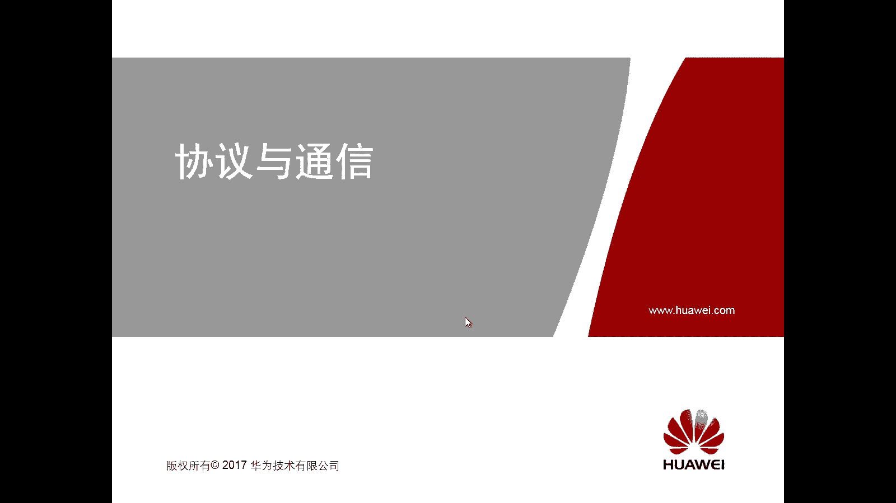
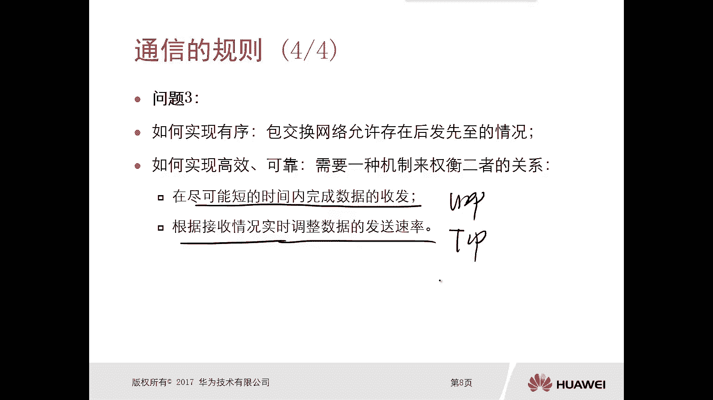

# 华为认证ICT学院HCIA／HCIP-Datacom教程【共56集】 数通 路由交换 考试 题库 - P2：第1册-第3章-1-通信规则 - ICT网络攻城狮 - BV1yc41147f8

好下面我们详细解释一下这个协议通信。

那么首先我们先看一下前一部分啊，呃我们在这个网络纵横章节里面呢，我们已经提到了，那么单一的一个协议呢，是不能够适应复杂的一个通信系统呢，那么对于我们的通信来讲呢，你一个协议肯定是搞不定的啊。

不要大家不要认为说通信就是很简单的一，件事情对吧，你比如说我们平时上个QQ啊，聊个天呀对吧，你发个图片呀，发个视频呀对吧，你不要说我发个图片对吧，瞬间就到了对方，那么对端看到的是一个图片的形式对吧。

其实在这个传送图片的过程中呢，实际上它有各种各样的协议进行参与，它不仅仅是一个协议去搞定的啊，嗯而且呢他这个通信的过程是非常复杂的，对于使用者来的来讲呢，肯定是感受不到的，那么在我们的通信系统里面。

需要有一个框架，来规范协议与协议之间的关系啊，你得有规范啊，你没有规范肯定不行啊，就好比是我们交通，你没有这种交通规则的话，肯定是不可以的对吧，那么设备呢根据协议处理数据的一个顺序啊，以及协议的用途等。

嗯好就是这个，那么本章呢会将整个通信过程呢，分成终端部分和网络部分，那么分别参照协议模型，对通信的这个流程啊进行一个分析和介绍，那么选本课程以后呢，我们应该能够理解的一个规则啊，那就看到底有哪些规则啊。

第二个呢是了解协议分层的概念诶，那这个比较重要，你不管是学对吧，我你将来要学什么安全呀，要学习无线呀，要学习一些其他方向的这个科目对吧，那这个斜分层这个概念呢必须要学的，这是最基础最基础的啊。

第三个呢是了解OSI参考模型，那么你看到的应该是几乎90%的，学习网络的一些书籍里边，都有可能会出现OSI参考模型，包括TCP的一个IP的参考模型啊，都有可能会出现。

所以这两个东西呢出现的频率比较多的啊，因为这是一个网络的基础啊，那这个呢我们必须要了解，那么最后一个是掌握数据的封装和解，封装的概念和流程，那就是我们本课程的学习目标，那么接下来呢我们首先看第一个啊。

第一个呢就是网络协议和标准，那么本小节主要是描述通信的规则，和两种参考模型，那么分为以下五个部分，那么我们看一下到底有哪五个部分，第一个通用的规则，那刚才我讲了一个非常简单的例子。

比如说我们通过QQQ的方式进行聊天对吧，那么你发一个图图片过去，那么对方肯定看到的是一个图片，不可能说你发一个图片过去，对端看到的是一个视频，那么就有问题了吗，对不对，哎那么通信的规则到底是什么样的呢。

啊这第一个第二个是网络协议的作用，那么刚才我们也讲到了通信，它是一个非常复杂的过程，你单靠一个协议肯定是搞不定的，对吧好，那么肯定会有多个协议来协同去工作，那么具体的网络协议它的作用是什么呢。

这是第二个，那么第三个是协议战的必要性，那么刚才我们讲了，你在通信过程中会有各种各样的一些协议，那么这些协议是揉到一块使用呢，还是分工去用对啊，而这种情况下就会提现出来一个叫做协战是吧。

哎那协议站有什么必要性呢，好哎第四个是OSI参考模型，第五个TCPIP参考模型，好，那么接下来我们就看一下这个通信规则第一条，那么在看通信规则第一条的时候，我首先去看一下实现通信的。

实现数据通信的几个问题啊，那么第一个问题是，如何将不同表现形式的数据，放到这个媒介进进行传输呢，因为你看我们现在上网，大家都上网对吧，那你上网的话，你可以用网络去传输一些图片呀啊啊，然后文字啊，文本啊。

视频啊等等等等等等，有各种各样的表现形式对吧，那么这些数据你怎么给它放到一个媒介里面，进行传输啊，那个媒介有可能是光线呀，有可能是网线呀，有可能是无线呀等等对吧，哎这是第一个问题。

第二个问题是你如何确保数据被发送给了，正确的一个接收方对吧，你比如说我通过QQ聊天对吧，假设这个大家有一个同学通过QQ聊天，要给一个这个暗恋的一个对象对吧，要去发一封情书对吧，通过QQ的方式。

但是你一定要确保这位同学，他发过去的一定是这个女生，你不要发错了哦，不要说发到另外一个男生那边去了，那不就有问题了吗，对不对，哎，我们如何确保你的数据能够正确地，发送给接收方，第二个问题，第三个问题。

如何确保数据有效有序高效可靠的到达接收方，对你不能说乱序了，这个文字都不一样了对吧，那个顺序都不一样了，这段接收到以后，他搞不清楚你这说的是什么东西对吧，而且我们怎么高效的可靠的到到达对方呢。

唉这是第三个问题好，那么针对这几个问题啊，我们看一下在我们实现数据通信的时候，是如何去解决这个问题的，第一个我们将对吧，我们如何将数据，它不同的表现方式去放到一个媒介里面，进行传输呢。

就是我们将数据转换为二进制编码，那么我们在网络通信里边呢，最基础的一个进制用的就是二进制，那么当然还有16进制，那我们所有的数据，在计算机里面进行处理的时候，都是二进制进行处理的，进行编码。

哎你不管你不管是传送的什么TXT文档啊，还是一些视频呀，或者是这个呃语音文件啊对吧，音频文件啊对吧，那么比如说我们这是一个发送设备，那么这边呢是一个接收设备，中间是网络对吧网络，那么在这种情况下哦。

我需要在发送设备上，将你不同的一个表现形式的文件啊，内容通过二进制进行编码，二进制进行编码是吧，从我们的IO接口，通过二进制方式转换成物理信号，因为你这个网络啊，有可能你采用的媒介是光纤。

有可能你采用的媒介是网线，有可能你采用的媒介是无线，那么不同的媒介呢，对应的它的信号的方式也是不一样的对吧，所以叫做物理信号啊，物理信号，然后通过这种物理信号的方式呢转到接收设备。

接收设备呢再将物理信号再转换成二进制，那么也是从这个输输入接口啊，那么我们叫做IO接口，IO接口啊，那就是input output，输出和输入IO接口，那么将这个物理信号转换成二进制。

那么转换成二进制呢，再将二进制转换成原始的一个文件的表现方式，所以现在我们应该清楚了，刚才我上来就给大家讲的对吧，QQ去传送一个图片，并不是我们想的那么简单，你图片就在网线上。

在光线里面是一个图片的方式，进行传送过去的吗，不是实际上是经过PC的处理变成二进制，二进制呢在IO接口再变成一些物理信号，在我们的媒介上面进行传输的，来到了对端。

再通过相同的方式唉将物理信号转换成二进制，再由二进制转换成原始的文件，那是图片，就是图片，是文本，就是文本啊，对不对，他是这样的一个过程，这是第一个搞定了好，那么第二个问题，第二个问题，我们刚才讲的是。

你如何正确地将数据交到正确的一个地点，对吧，哎，其实本质呢就是解决数据，在通信过程中寻找问题，什么叫做寻址，就是找地址啊对吧，因为我们这个通信呢，实际上我们后边也会有各种各样的比喻。

有一个非常准确的比喻啊，就是比较贴切的啊，不能叫准确贴切的比喻，就是这个写信啊，写信你看我们现在可能写信比较少啊，那我就以拿快递吧，因为我们都在淘宝啊，去买一些东西对吧。

包括在华为的一些这个官方的一些这个，购物购物这个网站对吧，我们去买东西，买东西的话都会有快递，快递的话你最起码你告诉这个卖家，你的这个地址吧对吧，你的邮编呀，你是属于哪一个这个省啊对吧，哪一个市啊。

哪一个地区，哪个县呀，哪一个街道啊，多少号啊，然后甚至是小区等等，你这就是地址，你有了这个地址以后呢，这个卖家才能够准确的把这个你购买的一些，这个物品啊，通过快递的方式发给你对吧。

那如果说你没这个地址的话，请问这个卖家，他怎么能够准确的把这些买的东西发给你呢，是发不过来的啊，那么实际上在数据通信的过程中也是一样的，needs有个地址啊，其实就是寻找的过程，寻找的过程好。

那么每个通信系统的参与者呢，必须要满足以下两个条件，第一个拥有某种粒子信息，来标识自己的物理问题，因为有了这个地址信息呢，我发送数据的时候才知道哦，原来这个数据应该要发到这样的一个目的地。

第二个是拥有某种身份识别信息，来标识该设备的一个本身，对啊，要不然我怎么知道要发给你，不发给他呀，对不对，哎，这是通信规则三里面的第三个问题的解决方式，实际上就是一个问题解决问题。

那么在我们的通信里面呢，实际上是通过什么方式去寻找呢，用的是一个IP地址，IP地址呢其实就是标识设备位置，而定义的一个逻辑地址，那么实际上我们在这个数据通信里边呢，那么你是通过什么样的方式去标识。

你要去把这个数据传到一个目的地呢，哎就是通过IP地址，通过不同的IP地址就区分了，OK我要把这个数据传到这样的一个目的地，而非那个目的就是IP地址啊，那么这个一定要一定要注意一下，它是一个逻辑的地址好。

逻辑题好，那么接下来呢我们看第三个问题，第三个问题是如何去实现有序，那么实际上在我们这个包交换网络里边呢，是没法很好的去实现有序啊，这个有序指的是什么意思呢，比如说啊我原朝着目的去发送一段数据。

那么一大堆数据呢，肯定是要分成多个数据包网来转发对吧，那我一段数据，那么有第一个包，第二个包，第三包，我发送的时候肯定是按照顺序去发的，那么理想的一个状态呢是接收者就是目的端。

他收到的顺序和发出去的数据是一样的，比如说我发出去的时候是第一个报，第二报，第三个报对吧，一直到第100个报，那么你接受者呢如果是有序的去接收的话，就是目的啊，那你应该首先要进入到第一个包。

第二包一直到100包，但是呢往往我们实际的网络通信非常复杂，那么可能由于网络带宽的问题啊对吧，设备的一个复杂问题啊，设备的性能问题啊，或者是网络多条链路负载的一个问题等等，可能我100个包发出去了。

但是不见得在墓地端一定是有序的被接触打，也有可能是你先发的，后到的，后发的先到的，这个在我们实际的包交换网络里边呢是允许的，而是允许存在的，那我怎么去实现有序呢，哎这个没关系对吧。

哎我们让应用程序或者更糟，更高层次的一些协议去搞定，这个顺序排序的问题就好，那么如何去实现高效可靠的传输呢，哎那这种情况下，就需要一种机制来权衡二者的关系，那么后边呢我们会讲到一个协议啊，传输协议哎。

一个呢叫做TCP，一个叫做UDP，在传输层里面啊，在传输层里面有两个传输协议对吧，一个叫TCP，一个叫DP，那么对于TCP来讲呢，它是可靠的传输协议，UDP是不可靠的传输协议，不可靠传输协议。

但是对于TCP呢，他可以去控制速率，就是你发送的速率，它可以感知你网络的一个状况，你网络好的时候给我这个速度发快一点，对你网络不好的时候慢一点，但是UDP呢UDP不可靠是缺点。

但是它的好处呢是它的效率要比TCP要好对吧，他也不需要去调整，我就使劲的发，这是UDP它的它的特点，那么后面呢我们还有还有专门的章节去讲TP，UP啊，所以这种情况下。

你如果实现实现这个数据通信的时候对吧，那你要权衡一下了，哎我这个用到底是他的点，到底是可以去动态的调整速率呢，还是就是最大可能最大效率的去发送数据，所以说这个权衡呢我们看主要是通过两个方面，第一个呢。

就是你是不是在尽可能短的时间内，去完成数据的一个收合法，如果拿着我刚才举的这两个协议来讲，如果说你是从这样的角度去考虑的，在这种情况下能使用UP比较靠谱了，那还有一种呢是根据接收情况。

实时的去调整数据的速率，哎你的针对是不是这个点，如果是这个点的话，那么可能使用TCP就好好好，这就是我们讲到的这个通信规则啊，它里面遇到的一些问题。

