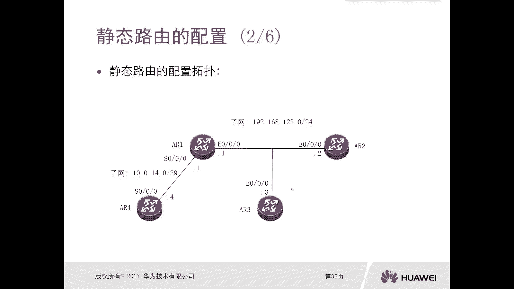
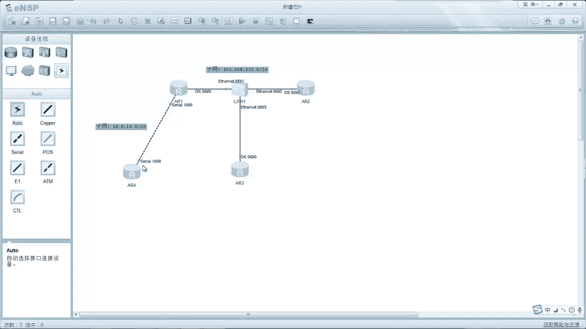
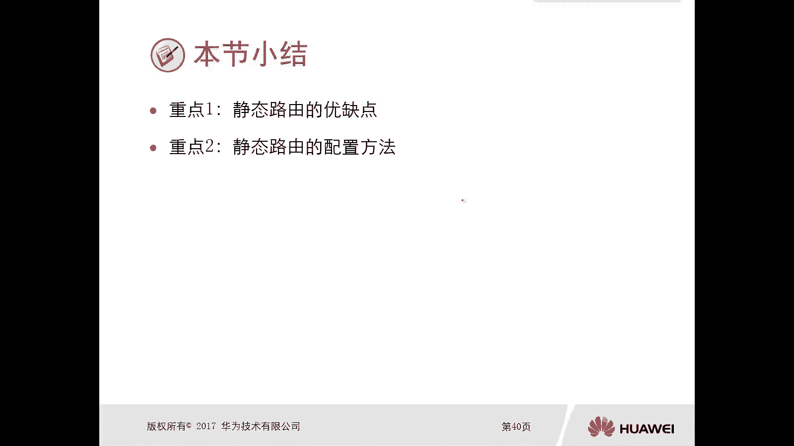

# 华为认证ICT学院HCIA／HCIP-Datacom教程【共56集】 数通 路由交换 考试 题库 - P30：第2册-第4章-3-静态路由 - ICT网络攻城狮 - BV1yc41147f8

好那么接下来我们讲一下这个静态路由呃，那么其实我们之前应该是讲过，这个静态路由相关的一些概念呢，对不对，那么本小节呢主要是通过如下三个方面啊，去介绍这个静态路由它的优缺点和配置。

那么第一个呢就是静态路由的概述啊，那这个我觉得并不陌生了，第二个呢是静态路由的一个优缺点，第三个呢是静态路由的一个配置，我们先看一下这个静态路由概述，那么对于静态路由呢，我们在上一节其实已经提到过了。

就是这个路由的来源，那么主要是三大类嘛，一种呢就是直连路由，一种呢是静态路由，还有是动态路由，对不对，那么对于这个静态路由呢，是我们管理员手工去配置的，去网墓地网络的一个路径啊。

这层面我们应该也介绍过了，对不对，是手工区配置的好，那么它默认值，比如说它优先级，优先级的默认值是60，那在前面讲讲路由基础的时候，我们也看到了，对不对，然后他的度量值是零，那么度量值是没法去更改的。

但是优先级呢我们可以通过命令进行修改啊，那么在某种特殊的一种场景里面，那么可能我们需要去修改静态路由的优先级，但是大多数情况下是不需要去更改的，那么对于路由优先级的一个调配，我们可以看一下。

刚才我们讲了这个路由先级是可以进行修改的，对不对啊，你比如说我去往同一墓地网的时候，那么如果说你有多条，去往相同目标的网络的静态路由，并且他们在优先级相同的情况下，可以实现负载。

哎那么大家可以看一下这个在这个ARE上面，我们通过display IP routing table，Political，OK你看啊，我们前面都是讲的display IP routing table。

但是后边呢可以跟一个political static这个命令，这个整体的命令的意思是什么呢，意思是我去查看IP图表，只查看从静态路由协议得到的啊，或者说我去查看路由表，通过静态协议去配置的。

或者通过静态的方式去配置的啊，这种路由表啊，因为在我们的实际网络中呢，也可能一台设备它上面的路由表太多了对吧，但是我只想看静态的，或者说我只想看rap的，或者我只想看OSPF的。

那如果说你只是display IP using table，那你太多了对吧，你得这个回车或者空格，摁半天才能找到你想要的啊，即使你想找静态，也也也得逐个逐个去看，对不对。

所以说我直接去display IP ring people political static，这样就可以把把这个静态路由给过滤出来了，对我只看静态路由，而且在这里边呢我们可以看到去往同一个目标。

191682。0，实际上它是有两个链路的，分别是从G0杠，零杠一口可以可以可以出去就可以到达，另外一个是从G0杠零杠二口可以到达，那两个不同的吓一跳对吧，但是由于他们的优先级一样，这种情况下。

这两个路由在路由表里边呢，都可以用来去转发数据包，那也就是说查完这个路由表以后，数据包很有可能可以从G0杠零杠一转发出去，也有可能从G0杠零杠二转出去，也就是说两个接口都可以去转发出去，这种呢叫做负载。

哎这种呢叫做负载，哎但是在某种情况下，你可能不想让它复杂，比如说我就想实现主备，我就想走走一条链路，另外一条链路你轻视对吧，空置等主链出问题，我再用备份，那也可以，我们也可以通过配置不同的优先级啊。

实现一个储备，那么还有几条命令，我们可以看一下，现在这个路由表里面处于active状态的，191282。0static，60吓一跳，10。1。12。2接口是G0杠零杠一，那么另外一条呢。

你看另外一条路由，182。0static是处于INTI啊，原因是什么，原因是我把它的优先级修改成了100，那么之前呢我们看你做到这个叫做呃，负载的时候，你看他两个优先级都是60，所以他没没得选。

这两个是一样的，我就全部都优选，所以说这两条路由呢全都是处于active，这样是复杂，但是当我把第二条它的优先级改成100以后，那么你想在路由表里面一个是60，一个是100，那么你选哪一个呢。

优先值数值小的对吧，路由表里面就优选了60，那么100呢哎就变成in active，那么在什么情况下，这个优先级为100的静态路由又会浮动出来呢，或者说又会变成active呢，是当这条路由出问题的时候。

哎那么下面这条路由才会变成X，因为你想你这条路由有问题了对吧，那没得选了，只能选这个100对，他就是唯一了嘛，对不对，就从inactive active，所以这种也叫做浮动静态路由，这种浮动的静态流啊。

这个浮动用那么浮动利用，那就是你正常情况下主的生效，你背的处于一个下沉的状态，当你觉得出问题以后呢，哎这个下沉的一个路由呢就会浮动浮现出来，哎这个叫做浮动路由啊。

浮动静态路由哎就是通过优先级控制的很简单，那么静态路由有哪些优点呢对吧，那么第一条呢是这个静态路由呢，比动态路由更加稳定，那当然稳定了，太稳定了，对不对，你配的那只要你保存了，重启不重启啊。

只要你保存了，你管理员不去改路由，100年都不会变的很稳定，很稳定，对不对，那么静态路由呢比动态路由更加的可控对吧，那你动态路由后面我会去讲，它是按照自己的一个算法去算的对吧，完全是有邪去控制它。

我们人为的管理员是控制不了的啊，你除非去更改一些什么开票值啊，优先级啊，这样对吧，但是经常有呢是很容易控制的对啊，指哪儿打哪儿对吧，你让它向左，它不敢向右对吧，你让他向右，他不敢向左。

那么静态路由呢也比动态路由更容易部署啊，所以说这个静态路由比较简单，但是呢他的缺点也比较体现出来了，扩展性比较差的，你配一条静态路由唉没什么问题吧，配两条也没什么问题对吧，配十条大不了多花点时间。

唉请问你配1000条对吧，那就哭了，对不对，哎这个扩展性很差嘛，对不对，OK好，那么第二个呢是静态路由，由于它非常非常的稳定，即使你往出问题以后，它依旧在那存在，对吧哎那么这种情况下它的缺点就出来了。

拓扑变化以后，它不会跟着top的变化而变动对吧，就好比是我们前面给大家介绍的十字路口，搞了个路牌对吧，那这个路牌你不把它拔掉，这个路牌永远放，那就放在那只将A路口去往天安门。

但是突然有一天A路口他修路呢没法过去，但是你这个路牌还没有拿到，还在这放着呢，那就有问题啊，不对哎，这就是静态路由，他没法去反映这个拓扑的一个变化啊，好，那么接下来我们看一下这个静态路由的配置啊。

啊首先我们看第一个图啊，第一个图呢是两台路由器，左边的网络子网呢是19281。24，右边的是191682。0杠24，中间互联网络是10。1。2。0杠24啊，分别都有地址点一和点二啊。

那么现在比如说要求ARE的小小，1681。0，能够去访问到AR2的192。16，8。2。0那个网络，那么在ARE上，你应该怎么去做静态路由的配置呢，我看有两种配置方法。

第一种IP root study10192。168。2。0啊，R五R五R5。0，这是它的一个子网掩码，对不对好，那么下面是配置的一个吓一跳的路径，那么对于一来讲，你配置静态路由。

那么下一套自然是相邻的AR2的G0杠，零杠一口接口的地址，那就是10。0。12。2，另外一种呢是比较简洁的IP ru static，192。168。2。0，那么子网呢我直接写成它的码的长度，24位。

对24位说明表示24个一嘛，10。0。12。2，那么注意一下，我们配置静态路由的时候，如果说它的出气口是个以太网段，它的下一跳处于一个以太网的环境里边，那么必须要配置下一跳地址，不能配置出接口。

那什么时候可以去配置出接口呢，比如说下面那个图，把一和二之间的链路，从以太口呢给它换成一个串口链路，点对点的链路，那么这时候还是在E上去配置静态路由对吧，哎在这种环境里面呢，我就可以这样做了。

IP如果static19。16，8。2。0252525等于后边呢，不用给你吓一跳，直接跟着出接口就可以了，因为点对点的链路你跟一个出口，你从这个口进来，一定是从出来，因为它是点对点链路对啊。

那有人就想我能不能在这种串口链路上，我不用出接口，我直接用一个下一跳地址呢啊也是可以的，这样好，那么简写呢就是IP u static，1921682。24页码，简写S1杠零杠零或者下跳都是可以的。

但是重点强调一下，在这种以太网环境里边，你去配置静态路由的时候，必须要指定下跳，不能指定出接口，或者说你指定出接口同时指定下一跳没问题，那么对于串口链路上，点对点链路上可指接口，可指下跳好。

那么接下来我们就看一个案例啊，这个拓扑的例子啊，这里边的路由器给的比较多啊，给的多呢呃其实也不难啊，嗯我们现在可以看一下，一共是12344台设备，那么一和四之间的互联网段呢是10。0。40，4。

0杠二十九二十九位，然后他们的这个链路类型的是串口链路，大家可以看一下嗯，然后再在123之间呢，实际上这应该是有个交换机的，对不对啊，是这个非典到点的内容吗，交换机以太网，那么它的网站是1918123。

0123，点零杠二四，那么分别是点1。2。3，点1。4这样的一个环境，那么现在它最终的要求呢是嗯配置静态路由，那么使得AR4能够和AR2以及R3，能够互通，所以说最基本的配置是从接口的一个IP地址。

开始的，这个我觉得不用再一个去讲了，就是配IP，嗯然后呢是配完1P以后呢，我们在这个ARE上去查看路由表，那么现在你能看到的它全都是直线路由没有，你可以看一下，全部都是直连路由，地址直连路由的。

然后接下来呢我们在这个四上去添加额表，因为你在这个拓扑里边，四想要去访问AR3和A2，那么就必须有去往A23A2，它的直连的路由信息对吧，那A2和A23这两个接口，所直连的网站是多少呢，1968123。

024，所以在R4上我们去配置静态路由的时候呢，配置是1928123。0杠二四啊，那么由于它的出接口呢是一个串口链路，所以说你可以指定出接口或者是下跳，所以我们看一下这四啥啊。

就是IP RT static1968123。0214，然后是串口S0杠零杠零，那么同样你在四上配了，去往二和三的一个静态路由，那么二和三也需要去配置，去网四的静态路由对吧，因为我们的通信是双向的。

你能去也得能回来对吧，你如果说你能去回不来，这个就不是一个完整的通信了，对不对，所以在二和三上呢，我们还要通过IP root static去配置10。0。1，4。29的路由信息啊。

那么全都是指定的吓一跳，那么这个呢还只能出接口对吧，哎那么最主要的是一定是要有下一跳，有没有出接口，这无所谓，对不对，诶，下跳好，那么接下来呢我们就按照这个环境里边，这个PPT胶片上面那个拓扑啊。

我们也搭了一个类似的一个拓扑，我们去做一个简单的静态路由的配置啊。

好看啊，这个拓扑和胶片里面的拓扑基本是类似的，只不过接口接口类型不太一样啊，我们胶片里边呢这个接口类型是以太口对吧，我这用的是快速以太口是吧，然后串口的这个号码槽位也无所谓啊，没有什么太大的这个问题啊。

基本是一样的啊，只不过潮流不一样，那现在呢我们接下来是先去配置这个接口地址，然后呢我们再去配置路由，我们在四上去配IP地址，现在这个设备呢，所有的设备全都是一个初始化的状态啊。

那我先给这个设备起一个名字A24，然后S1杠零杠零，这个地址是10。0。14。四二十九位对啊，然后下来是这个ARE，ARES1杠零杠零，地震的10。1。10。0点4。14。1啊，29位，那么做完以后呢。

我们可以简单测试一下嗯，合适的连通性，10。0。14。4，看能不能通，没问题，对不对，好我们继续配置以太接口，是G0杠零杠0IP，地址呢是192。168。12，3。12104对吧，然后在三上面呢。

A23G0杠零杠0FG指的是192。16，8。123。三二十四，接下来是这个AR2，AR2上边即零杠零杠零，IP地址是192。168。123。2，24好，那么这样做完以后呢，我们在这个二上面去测试一下。

和一和三的一个连通性啊，那么在二上呢就是通过拼192。16，8。123。1，我们看一下能不能连通哎，这个是没有问题的，对不对好，然后呢，我们再去拼192。168。123。3啊，这个连通性也没问题。

但是现在我们只是做了基础的配置，没有去做路由，那么在L4上我们display嗯IP using table，我们去看一下他有没有去往19168，123。0的路由信息呢是没有的对吧，只有它的一些节点路由。

那么节点路由我们配置的14。0是有的，对不对，那现在你没有去往这个目标网段路由，那这个数据包肯定是没法进行转发的，对不对，所以我们要在市场去配置IPROSTATIC对吧，是192。168。123。

24啊，或者是252525。0对啊，那么后边呢，由于我们现在四上边要去访问数据的时候，它的出接口是一个串口，那么在这呢你可以直接去跟S1杠零，杠零就可以了，那现在四上有了去往19168，123。

0的路由了，那么他把数据包转发给ARE，那么ARE上面有没有去往192168，123。0的路由呢，有的因为是直连路由，在一上是能够去转发给二和三的，但是二和三所有的数据包他们要进行回报，回报的时候呢。

二和三要去查找去往10。0。14。0的路由，但是现在二和三上有这个路由信息吗，没有没有的话，那么这种情况下呢肯定是无法通信的，对吧嗯，所以说呢我们需要在二上面呢和三上面去配置，静态路由，指向10。0。

14。29，这样的目标网段呃，那么由于这个二它发送数据包啊，或者说它这个静态路由这个出接口，它是一个以太网，所以说在二和三上去配置静态路由的时候呢，你不能说直接去跟一个出接口，一定要跟吓一跳啊。

那么出接口无所谓，一定要跟一下跳，那这个吓一跳呢，在二上面跟着吓一跳呢，就是192。168。123。1对啊，哎那那我们再在三上去配置一下啊，三上去呢你也可以这样去做静态路由，要10。0。14。29对吧。

然后G0杠零杠零对吧，指了一个出气口，同时呢我再去配置一个，再配置一个这个下降，好这是一个吹一口对吧，然后配下跳下跳的是192。16，8。123。1对吧，我们看一下这个拓扑啊，那没有错的，123。1好。

那么这样做完以后呢，我们在四上面呢去做一个评测啊，评测我们拼192。168。123。2，看是能够互通的，对不对，同时呢我们去拼1292。16，8。123。3 r3，哎也是互通的对吧，没问题啊。

这是非常简单的一个静态路由配置啊，重点是你在点到点链路上，和在以太链路上配置静态路由的时候呢，啊需要注意啊，注意的就是你以太链路上必须要指定吓一跳，在串口链路上呢，你可以直接指一个出接口啊。

或者说可以直接指一个下跳都可以。

好所以说这个静态路由的这个配置方法呢，实际上一共是三种啊，三种我们可以组合的啊，这个呢只是拿一个串口所做的一个例子啊，因为串口呢它可以直接指一个出接口，也可以直接以直接指一个吓一跳对吧。

或者是你出接口和下一跳一块指，那么在这种点到点的链路上呢，你可以通过这三种方式去做，但是如果说你是一个以太口，比如说这是个G口，那么忌口只能是两种啊，就是这个指一个下降，或者说指一个忌口。

这几下跳这两种方式在串口上是三种，在一口上呢只能是下面这两种啊，好这就是这个静态路由啊，那么看一下这个小节重点啊，静态路由的优缺点我们现在应该很清楚了。

