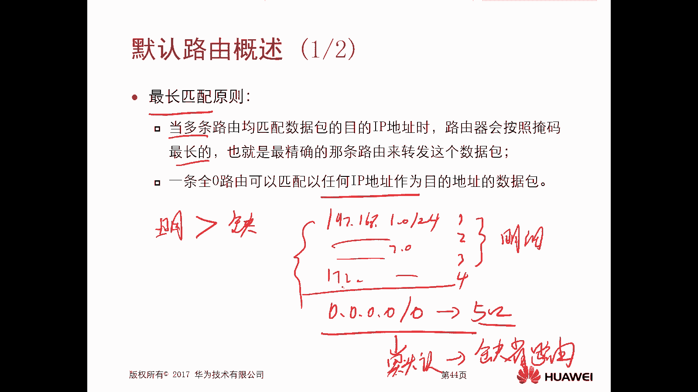
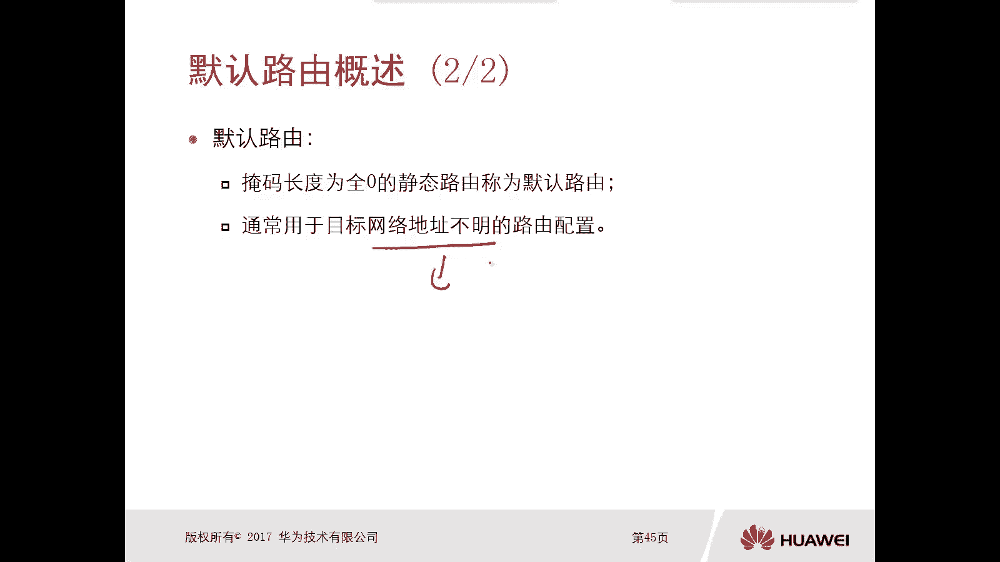
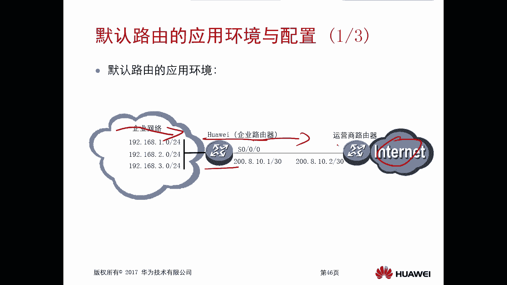
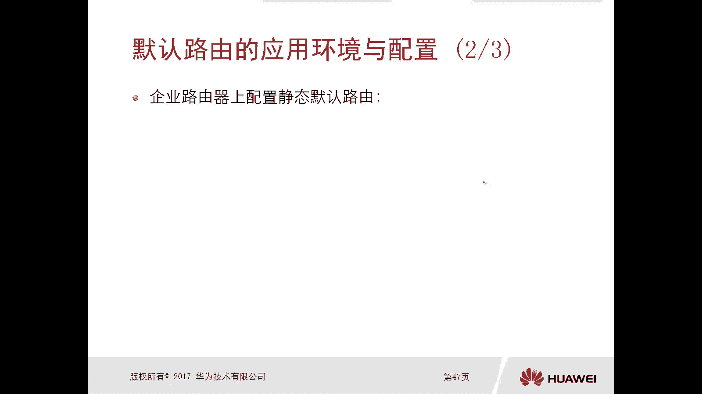
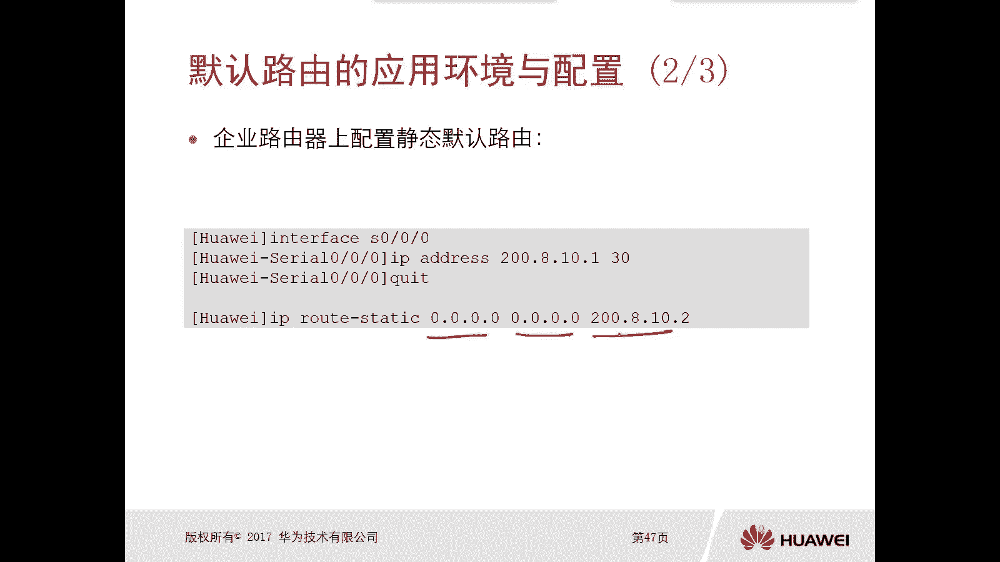
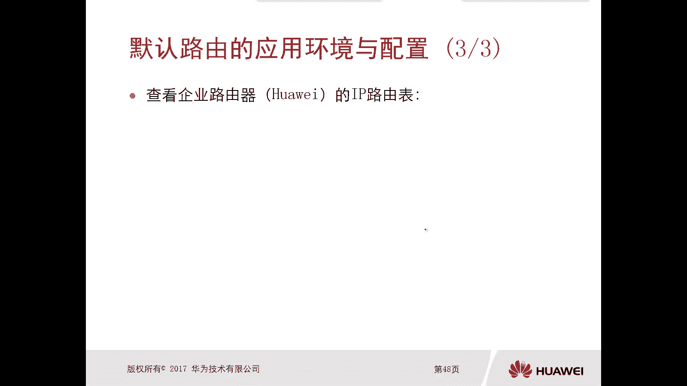
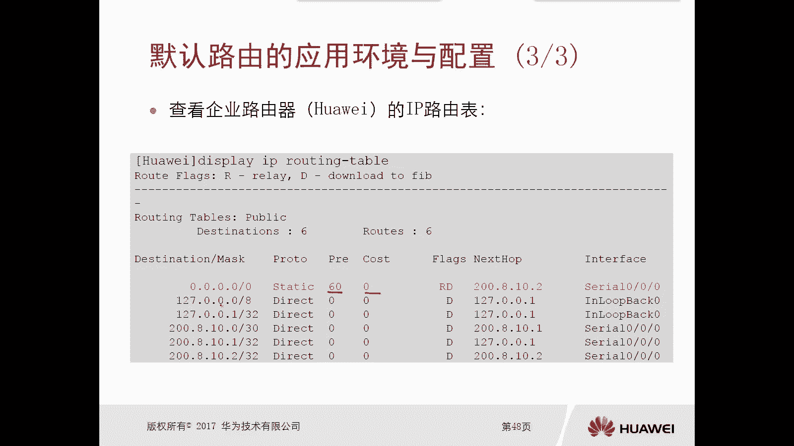
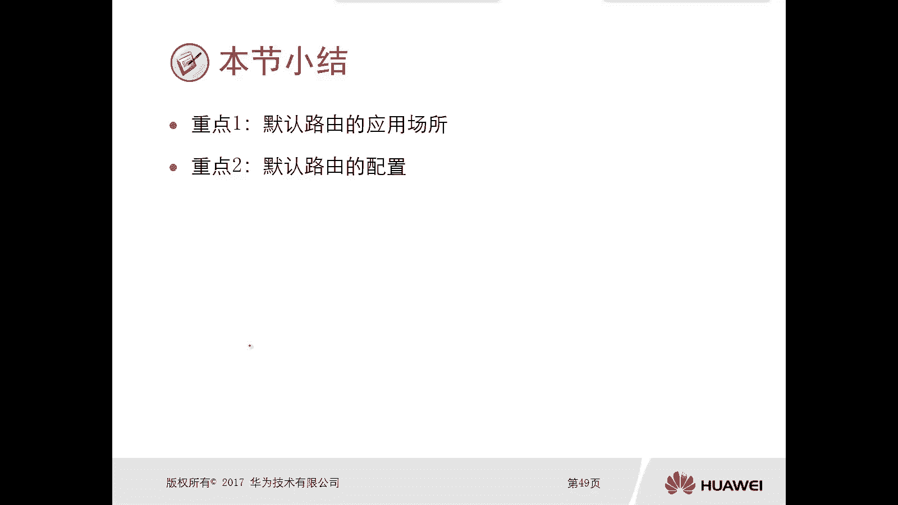

# 华为认证ICT学院HCIA／HCIP-Datacom教程【共56集】 数通 路由交换 考试 题库 - P31：第2册-第4章-4-默认路由 - ICT网络攻城狮 - BV1yc41147f8

好那么接下来呢我们看一下这个默认路由啊，那么上一小节呢，我们应该是介绍过这个静态路由对吧，哎那么默认路由和静态路由，他们俩之间又有什么关系呢对吧，哎我们看一下啊，这个默认路由。

实际上它是一种这个特殊的静态路由，那说白了这个默认路由，它也是静态路由的一种是吧，哎所以它的配置呢和静态路由的配置呢，没有什么太大区别，那这个我们并不陌生了，那么本章呢主要是通过以下两个方面。

对这个默认路由呢进行一个介绍，那么第一个呢就是默认路由的概述，什么是默认流哎，那么第二个呢就是默认路由，它的应用环境和配置，那么重点是应用环境，那么我们在一个呃非常常见的环境里边呢。

都会用到这个默认路由啊，那么基本你比如说你后期参加工作也好对吧，或者说我们在学校去做一些实验也好，那么基本都会用到这个默认路由，那那么配置呢就不是那么陌生了，因为它既然是一个静态路由。

我们静态路由的配置呢是非常熟悉的，对不对，所以说这个默认路由的这个配置呢也不在话下，好，那么接下来我们先看一下这个默认路由，它的一个概述啊，嗯我们先看一个概念，叫做最长匹配原则，哎这个呢很重要很重要。

这是我们在路由器上面选录的第一条原则，就是路由器上面啊进行选路，就是选路由啊，他的第一条原则哎就必须要看这个选路的时候，第一条原则必须要看这个最长匹配原则，那么什么叫做最长匹配原则。

那么当多条路由均匹配数据包的，目的的IP地址的时候，那么也就是说你一台路由器上有多个路由表，当你收到一个数据包的时候，这几个路由表都可以用来去指导转发这个数据，那也就是说匹配了多条路由。

那么路由器呢会按照掩码最长的，也就是最精确的这条路由来转发这个数据包，那比如说我给大家举个例子啊，你看这是一台路由器啊，那么呢它有这个三个接口，一口二口和三口啊。

那么同时呢这台路由器上呢存在三条路由信息，那么呢一个呢是192。16，8。1。0杠24这样的路由，那么它所对应的一个出接口是一口，那么还有一条路由信息呢是192。16，8。0。0杠16嗯。

那么它的出口呢是二口，那么还有一条路由是192。0点，0。0杠八哎，它的出口是三口，OK那么假设这个路由器收到一个数据包，那么这个数据包他要去访问的目标的IP地址是，192。168。1。100。

这样一个数据包哎，这是一个目的地目的地数据包，那么正常路由器经过查询图表发现诶，实际上这三条路由都可以用来去指导，转发这个数据包，那么到底是从一口转发出去呢，还是从二口转发出去，还是从三口转发出去。

OK最长匹配原则，最长匹配原则，那么最长匹配原则是按照掩码最长的，那么眼马最长的，我们可以看一下86，24，哪个最长的，24最长对吧，所以最终这个数据包，是从哪个接口转发出去的呢，是从EO转发出去。

哎这个呢就叫做最长匹配原则哎，所以注意一下啊，这是我们应该是学了一个最最新的一个概念，而且这是一个非常重要的一个概念啊，好匹配，那么一条全零的路由可以匹配，以任何IP地址作为目的地址的数据包。

哎那实际这个就是一个默认路由，那么你看我们之前在路由表里面看到的啊，这个路由呢就是哎无非就是192。168点，什么1。0杠24啊，什么2。0杠24啊，都是有数字的对吧，都是IP地址路由前缀，但是。

如果说有一条路，有个信息，他是这样的，四个零杠零，还有一个出口，比如是五口对吧，那上面是1212口，三口和四口，这是五口那么多路由，那么上面这些呢我们俗称叫做明细路由，那么这条呢就全都是零的路由。

它就叫做认路由，或者叫做缺省路由，进入有，那么对于这种缺省路由，他可以去转发任何IP地址，作为目的地址的数据包，但是由于有一个最长匹配原则在前面，所以说明细路由一定是优于这个缺省路由。

就是你来了一个数据包去查找路由表的时候，先看看有没有明细路由，如果有就直接按照明细路由进行转发了，就不再使用缺省路由，但是如果说你来了一个数据包，发现我的明细路由，没有任何一个路由信息是能够匹配数据包。

它去往的目的IP地址的情况下，这种情况下，如果你没有缺省路由，那么这个数据包一定会被路由器给丢掉，如果说有缺省路由，OK那么就按照这个缺省路由啊，他这个出气口进行一个转发，所以我再次强调一点啊。

这个缺省路由它是可以去转发任何IP地址，作为目的地址的数据包啊，但是前提是你确实来了，这个数据包没有明细路由指导他转发，如果有的话，就不会用缺省路由转啊，也就是说只有当你匹配不到明细路由的时候。

就可以使用缺省路由进行数据包的一个转发，唉这就是这个默认路由，默认路由它的一个使用啊，最长匹配，最长匹配明细，匹配数用缺省。

所以说这个默认路由呢，实际上就是掩码长度全为零的静态路由，它就是一个默认路由，它不仅是YM长度全为零啊，它的前缀也全都是零啊，对不对，哎，那么这种默认路由通常是用于目标网络地址，不明确的一个路由配置。

那么网络地址不明确，就是也就是说在你的路由器里面是没有明细的，或者说这些网络地址太多，我没法去得到所有的明星的路由信息，那么我们可以采用一个默认路由，去指导数据包的一个转发。

哎这就是这个默认路由再强调一点啊，啊默认路由是研发强度全都是零对吧，而且他是一个静态路由，那么一般的是指导，当数据包在本路由器里边，无法通过明细路由去匹配的啊，这种数据要通过缺省路由啊去指导转发。

那么默认路由，那么既然这个默认路由是这样的。

那么它的用场景是什么样的呢，哎这个场景太常见了，百分之百的企业都会用全程路由，都会用默认路由，那么为什么呢，大家可以看一下好，这是一个典型的这个企业网，那么企业网呢你看啊，这是我们的企业内网。

那么中间有一台华为的路由器，是企业路由器，那么这个路由器呢我们俗称叫做网关设备，哎，这个呢这个设备呢，它是一边是连接了企业的内网，一边是连接了这个运营商的SP，那也就是说你的内网只要是访问这个。

要去访问这个internet，必须要经过这个网关设备出去啊，然后呢把数据包扔到这个运营商路由器，运营商路由器再转发给这个internet这样的一个访问，对吧，OK那么这种情况下。

这台企业路由器就存在一个问题，问题是什么呢，如果说你的内网，企业内网的数据都转发给了这个网关设备，那么这个华为这个路由器，它就必须存在内网想要访问的运营商，他的一些资源。

你比如说我内网用户可能要求访问百度啊，可能访问新浪啊对吧，那我们国内的这些网站太多了对吧，包括应用也太多了，那么可能不同的企业它对应的不同的路由，那是不是意味着你在网关设备上必须要存在。

去往运营商这些服务的一些路由啊，对吧路由，但是这个路由太多了呀对吧，我可能有我，我要访问国内的，我可能要访问国外的太多路由了，你让我通过静态路由一条一条去配对吧，是非常，不合适的，是非常不好的对吧。

对啊不现实非常不现实，你怎么做怎么做啊，那么多，但是我们换句话想一下啊，换个方方位考虑一下，假设对吧，我就是个非常亲近的人，对不对，勤奋的人，我用了两个月的时间，把所有全网的静态路由都培养了对吧。

很勤奋哦，老板要加薪，对不对，但是你甭管你配的是上千条还是上万条，那么明细路由，那他的明细路由想一下他的吓一跳，是不是应该就是运营商的路由器啊，那也就是说你配的这上千条上万条静态路由。

实际上数据都是被转发到同一个运营商，因为你假设你购买一个专线，就买了一个宽带运营商对吧，所以在这种情况下，干脆我就用一条缺省路由啊，也是这个也叫做默认路由对吧，我就用一条就可以了。

你来了数据包发现哎你这个要访问百度啊，那我去查入流表，发现我没有这个明细路由，但是我有一条确实路由，OK走你对吧，哎就从这个接口出去了，就到了云上对吧，不管是访问百度。

新浪还是其他国外的国外的这个网站对吧，还有还有各种各样的应用，最终所有的数据全部都是交到了这个运营商，路由器，所以你看这个对于这个最终的结果来讲，你配上千条和上万条，还是配一条默认路由。

他们最终的数据全都是交给了运营商，所以我们干脆用一条就搞定就可以了，唉那就是缺什么用，所以在我们的企业网里边啊，那么百分之百的企业，在它的出口网关设备上都会有一条缺省路由，指向它的运营商对吧。

那么企业内网内网的这个数据去访问的时候，只要访问的是这个运营商，它因特网的资源，那么都会使得路由器使用这个确认路由，指导他去转发到运营商，这就是它的一个应用场景，OK好这是他的应用场景啊。

那么配置呢非常简单了，好，我们看怎么去配置一个静态默认路由啊，照着葫芦画个瓢对吧，我们前面讲讲讲过这个静态路由配置方法对吧。

那静态的静态的默认路由，或者叫做静态的缺省路由，那其实就是八个零对吧，前缀是零，掩码全都是零对吧，然后指一下一跳就可以了对吧，哎这是一种特殊的这个静态路由，那我觉得这个不用演示，So easy。

对不对好，那么当我们配完以后呢，我们去查看这个路由表。

你会发现哎有一条路由信息，它是四个零杠零静态，你看优先级呀，开销值啊，那么这些显示其实和我们前面配置这个形态，是一模一样的，对吧，哎就是这样的一个操作，那么当然了，数据包只要我在路由表里面去查询。

只要明没有明细路由去指导，或者说没有明细路由匹配这个数据，那么就利用缺省路由进行转发，那么如果说你连缺省路由怎么有，那怎么办，丢包呗，对吧好，这就是这个默认路由啊，或者叫做缺省路由啊，它的一个概述。

包括它的一个应用场景和这个配置啊。

好我们看一下这个重点啊，小节第一个是这个默认路由的用场所，那么一般呢就是我们用在这个企业出口对吧，你要指向这个运营商啊，用来去指导一些不明网络，它的配置的一些路由，我们用缺省指导他转发就可以了对吧。

那么第二个呢是默认路由的配置，那就是配置一个静态路由，只不过它的前缀和掩码比较特殊。

全都是零就可以了。