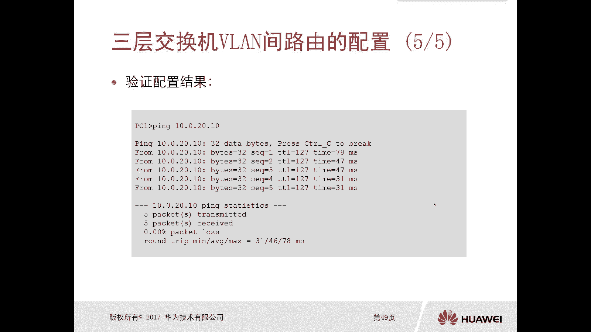
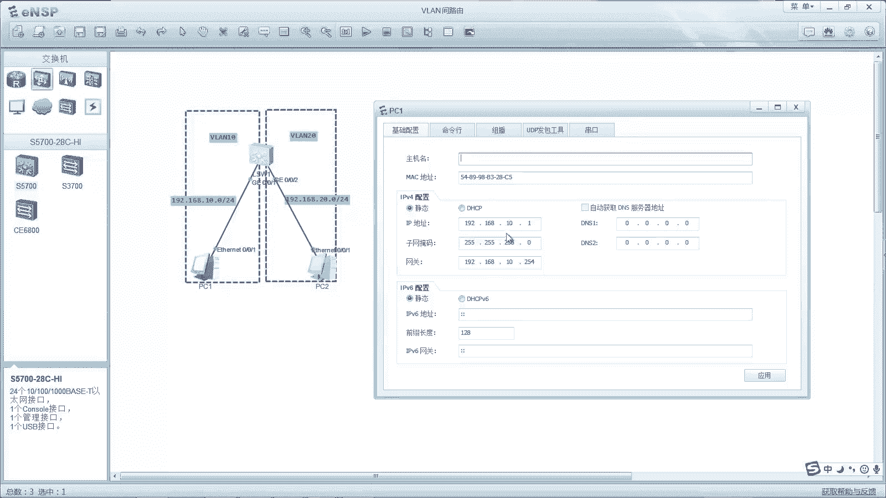
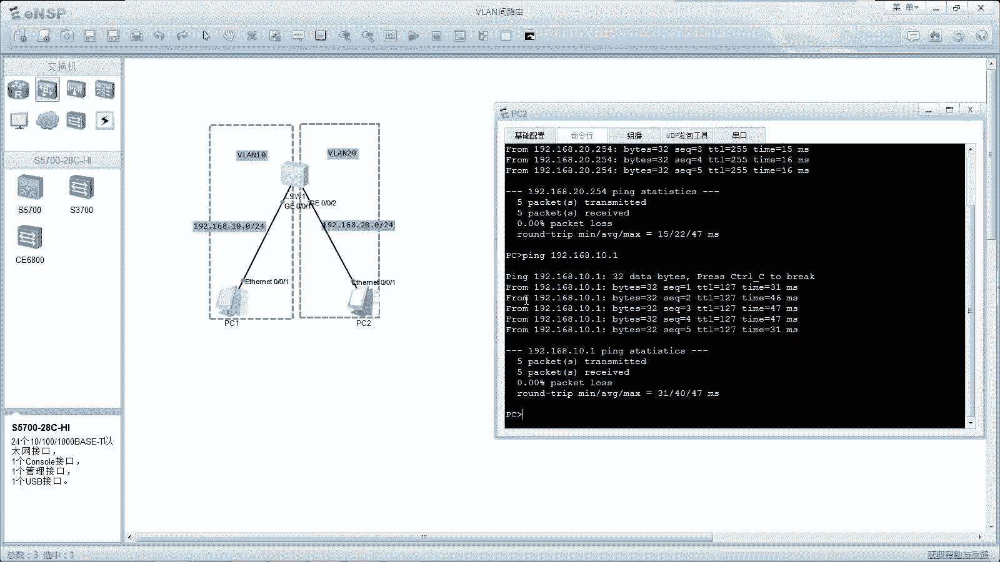
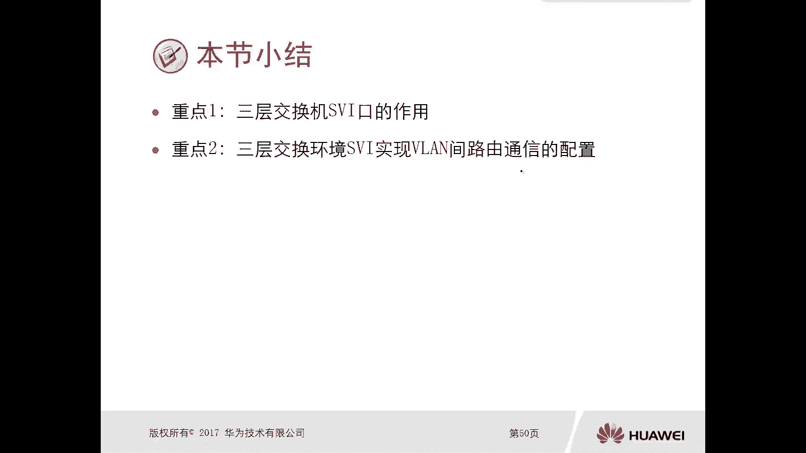

# 华为认证ICT学院HCIA／HCIP-Datacom教程【共56集】 数通 路由交换 考试 题库 - P32：第2册-第5章-2-VLAN间路由概念及配置三层交换技术 - ICT网络攻城狮 - BV1yc41147f8

好那么上一小节呢我们讲了这个微软件的路由，那么实际上我们在上一小节呢，应该是讲了两种方法，可以实现这个微软件的路由对吧，那么一种方法呢，就是通过这种传统的微软间路由的，这种方式来实现。

那么我们一般是要在交换机上，要连连到路由器的不同端口对吧，然后再划分到不同的VLAN实现通信啊，但这个并不灵活，扩展性比较不不好，对不对，所以说呢我们还有另外一种方法就是单臂路由，那么通过单臂路由。

那么使用这个子接口嗯，那么可以实现这个微链接的一个互访，那么接下来呢我们要讲这个第三种，第三种呢就是使通过这个三层交换机，三层交换机，那么利用这个三层交换机里边的路由功能，实现微软件之间的一个通信。

那么接下来呢我们就看一下这个，三层交换技术啊，呃如果说一台交换机啊，它可以这个集成三层路由功能，那么它在同一个微软中啊，他在那么他在同一个文件中的主机呢，就可以提供基于Mac地址的数据真的转发。

那这个是一个交换机的一个呃本质的能力，最基础的能力，对不对，你不管是三星交换机还是二层交换机，都是有这个能力的，但是由于现在它是一个三层路由功能的交换机，它还可以在内部直接消化掉。

整个B段监督由所需要的三层数据包转法，那也就是说，你这如果你这台交换机，是一个三层路由功能的交换机，那么它是完全可以实现相同微软间PC能够通信，也可以实现微软件的一个通信啊。

根本就不再需要什么路由器呀对吧，不需要什么单位路由啊，所以说本节主要是通过以下三个方面，来进行一个重点的介绍啊，那么第一点呢就是三层交换机的概述。

那第二个呢就是三层交换机和这个van interface，就是van接口，它的环境，最后是三层交换机，VLAN间路由的配置啊，好接下来我们就看一下这个三层交换机的概述，那么再看三层交换机概述的时候呢。

哎我们先看一下这个二层交换机，它的特征是，因为我们在前面的章节，应该是已经学过了二层交换机啊，那么对它的特征呢应该并不并不是那么陌生啊，第一个呢就是这种二层交换机呢，它主要是用来连接这个铜同构啊。

网络的一个设备，而且这个二层交换机呢，他怎么对数据进行转发呢，完全是依靠Mac地址表，但是我们初始化的这种二层交换机，它没有Mac地址表对吧，那怎么转发呢，就是泛红呗对吧。

但是当我们收当我们这个交换机啊，收到了这个数据帧以后，那么他就可以利用这个数据帧的原Mac地址对吧，然后生成Mac地址表，那么当我们交换机里面存在大量的Mac地址表，的时候对吧。

会改变交换机他此后的一个转化行为，你之前如果没有表象，那么不管是什么样的数据帧，它被交换机收了以后，他都会进行泛红，但是有了表象以后，我就完全可以根据表象对吧，去匹配。

就是根据你这个数据真的目的Mac地址，去匹配这个Mac地址表对吧，哎以及呢，该条目是否是数据帧的一个入站接口啊，那么作为转发泛红还是丢弃对吧，这样的决策啊，因为我们前面也讲过这个交换机。

它的一个工作过程对吧，那无非就是转发泛红和丢弃，那么什么情况下转发呢，如果有匹配就转发，那么什么会什么情况下泛红呢，如果说没有匹配注max的表，或者说你收到了一个广播帧，或者是主播真的情况下会泛红。

那么丢弃呢我们前面讲了，假设你收到一个这个目的Mac地址对吧，发现他这个出接口和你收的这个接口是一样的，那么这种情况下肯定是丢弃的好，这个我们前面讲过了是吧，而且这个交换操作叫switching。

实际上它是一项高度城市化的一个固定流程啊，我相信大家如果学习过这个算法啊，学习过算法课程这种同学啊，那么实际上这个二层交换机它的转化流程呢，完全可以用几行这个伪代码去描述出来对吧，它是比较固定的好。

那么看完了这个二层交换机的特征，接下来我们看一下这个路由器的特征，因为这两个东西我们前面都讲了，对不对，那么路由器的特征呢，它是目的主要是连接易购网的设备，只在连接异构网络设备，那么对于路由器。

它不仅要支持二层，要支持三层甚至是更高层次，所以说他必须要在各层，支持大量的不同的协议和标准，那么路由器怎么对数据包进行转发呢，也就是路由器它的工作原理是什么样的呢，它是首先要形成路表。

那么形成路由表的方式，我们前面讲过了，直连路由，静态路由啊，动态路由啊对吧，不管是哪种方式，先学习路由，有了路由表，我再根据最长匹配原则，我们前面讲过了，对不对，然后去判断数据包它的出现接口。

那么这样的一个路由器，它的一个工作过程呢，要比这个交换机执行交换的操作啊，这么一个逻辑啊要复杂的多，哎这个是路由器它的一个特征在这好，那么既然我们知道了这个交换机，二层交换机和路由器的特征。

那么实际上三层交换机的特征也就出来了，因为对于这个三层交换机呢，它是兼具了有二层交换机和路由器，两种设备的功能，融为一体啊，融为一体，哎所以说我们可以看一下什么是三层交换机。

集成了三层数据包转发功能的交换机，具有三层交换机，你要注意了，我们去购买设备的时候都是交换机，外观长得都是一样，但是不见得你购买到的交换机都是三星机对吧，哎有可能你购买的是二层对吧，有可能是三层对吧。

好那么这种三层交换机呢，它可以实现将终端隔离在不同的微量里面对吧，那这个就有一点点类似于二层交换机的作用吗，因为你二层交换机也是可以划分多个微量，将不同的终端呢放到不同的微量里面。

那不同的微量呢他们之间是没法进行互通的，如果就二层而言对吧，同时我现在是一个三层交换机，我也可以为这些终端，就是属于不同微量里面的终端，去提供微软接路由的功能，那么这种情况下，你就考虑一个问题。

有了这个三层交换机，我还需要做什么单位录用吗，不用对吧，哎不用好，所以说我们的二层交换机呢，一般呢主要是应用于接入层，你像我们这种三层交换机呢，可能用在这个分布层或者是核心层对吧。

你你接入层呢用个二层交换机就完事了对吧，你把这个设备接上来就可以了，对不对，那么实现路由功能呢，我们在分布或者在核心完成就可以了，这种情况下你得使用三层交换机，然后三个你要解好。

那么同时呢你看我们最早之前啊，就是呃这个早期啊，我们可以用早期去描述，就是早期的时候呢，哎我们这个交换机呢，是通过这个硬件进行数据进行转发，但是路由器呢呃它是使用这个软件进行转发，对吧。

去转发这个IP包，但是随着这个网络发展啊，我们越来越多的路由器，它开始使用硬件进行转发了，也就是说，那现在实际上你路由器的转化速度，和交换机的转速度，基本可以处于同一个这个平面了。

我们都是通过硬件进行转发的，对不对，诶，或者是这个网络处理器，所以说当我们把交换机集成了这个，三层的一个路功能，那么这种情况下，就会使得这个真正的路由器和三层交换机，之间的界限呢就变得十分模糊了对吧。

反正你这个三元交换机也有路由的功能嘛对吧，OK好，那么这是一个三层交换机的一个功能，那么我们怎么去对这个三层交换机进行配置，就可以实现这个微软件的路由呢，我们先来看一下三。

我们看一下这个三层交换机的配置啊，那么三层交换机的配置呢，首先第一个我们可以创建VL对啊，然后并根据我们的设计方案，将各个接口划分到不同的微软这个配置对吧，划分到不同的，那么这个配置呢。

实际上和我们之前讲这个交换机，配微量是一模一样的，没什么区别，哎这个是一个纯的微软的配置部分，第二个呢就是路由部分的配置，那么路由部分的配置和真正的路由器的配置，是相差无几的对吧，我们下路由器要配什么。

要配IP地址，对不对，哎甚至还可以去配静态路由，配动态路由，那么对于三层交换机完全可以配地址对吧，配静态路由，配动态路由等等这些功能啊，啊所以说你三层交换机只要能够配地址。

只要在一个接口里面配的IP地址，那么是不是它就会产生节点内容啊，对不对，所以说三层交换机需要解决的是接口分配，三层IP地址的配置，否则呢它是不具备称终端网关设备的能力的，一定要注意一下啊，这种三交换机。

那么大家注意一下，有些二层交换机也可以配地址，但是二层交换机往往只能配一个IP地址，那么配一个IP地址的目的是什么呢，用来做管理，但是对于三层交换机来讲就不是了，三层交换机它可以配多个IP地址。

每一个微量它都可以配一个地址是吧，唉然后这个地址呢，就作为这个VA里面的网关地址就可以了，那么这个我们我们配地址的时候在哪配，那么这种情况下，就有一个新的名词叫做虚拟微软接口，我们前面讲过微软对吧。

那么在交换机上呢，我们可以去配置微软接口，这个未来接口呢简称s vi接口，SVI接口，那么他们所在的这个网段呢，可以直接作为直连路由，放到这个三层交换机里面的路由表中啊。

也就是说你在三层交换机上去配置一个，s vi接口，就好比是你在一台路由器上面，配置一个物理接口，那个效果，它会产生这些路由啊，所以呢这个虚拟微软接口就十分适合，充当这个微量里边，它所连接的设备总关。

也就是说利用了三层交换机，如果说你下面有多个微量，那么你想实现微软件的通信，那么就必须为这些微量，每一个微软都要去配置一个虚拟微软接口SI，那么这种情况下，这个不同微软件的数据才可以正常的通信。

OK注意一下，这个SB接口一定是一个三层接口，一定是三层接口，那么三层接口呢，也就是我们可以配置IP地址接口，那么另外一个接口呢就是二层接口，二层接口呢是没法去配置地址的，比如说我们纯交换机啊。

就是纯二层交换机，它的接口我们可以放到access，可以配置成trunk对吧，可以配置成HABT等等，好那么接下来我们看一下这个三层交换机，微软监督由环境它的一个物理拓扑啊，那这是一个三层交换机。

三层交换机呢它有多个端口，那么我可以把多个端口给它，划分到不同的VLAN里边，你看啊前面这些端口啊，那么其中包括PCPC2，那他们属于van11，后面这些端口呢包括PC3PCPC4啊。

属于这个微软时期对吧，那么相同微量之间去互通的时候呢，就直接经过交换机二层转发，一点问题没有，但是如果说你想实现vs1和VN17，在三层交换机上能够进行互通的话，那么这种情况下。

我们必须要为微软11和微软时期去配置，S v i，SV就是微软的接口，而配置呢就是什么interface interface van时期，那么当我们配置了这两个微量的SV，I接口以后，那么这种情况下。

对于这个三层交换机呢，它就有了这个路由转发引擎，我就可以利用路由转发引擎，实现微软11和VN17这两个不同的，他们所连接的终端的互通，那么也就是说它实现了微链接的路由好，那么这样的一个物理拓扑。

得到的一个逻辑拓扑是什么样的，哎就是这样的哎就是这样的好，那么这边是PCPC2对吧，然后连接它网关设备，网关设备实际上就是41啊，那么具体一点是switch1的van interface11。

那么PC3PC4，他们的网关呢就是VIAN17，具体点就是vian interface时期里面的地址，哎那么这样的一个逻辑拓扑图，我们是不是，很眼熟啊，是不是很像诶，这个交换机好比是一台路由器哦。

这有个物理口一口，这个物理口二口对吧，唉只不过现在变成一个交换机，但是这个交换机呢是三层交换机，它这个物理口变成了一个van interface，11变成一个vian interface时期。

那么呢甭管是交换机也好，还是路由器也好，内部呢是能够提供路由的功能的，哎这样就可以实现微软件的一个通信好，那么接下来我们看一下这个三层交换机，接路由配置它的示意图啊，这个图就非常简单了对吧。

你看如果说我们这台交换机啊，它不是一个三层交换机啊，他肯定不支持这个willian interface，那么你连了两个PC，一个PC1不能使一个PC，二不能20，他们两个想要通信的话。

你这边最起码要搞一个路由路由器，然后去配置单臂路由，或者说你要用这种传统的方式实现通信也可以，对不对，但是那现在呢它是一个三层交换机，不需要外接路由器了。

我直接在交换机上去创建vian interface，Vlan interface，然后这些PC各自设置成它的网关地址，要设置成这个van interface所对应的IP地址，那么就可以实现微软件的路由。

那么具体配置看一下，首先交换机上创建两个VLAN啊，这个命令是批量创建VLAN，我们可以单个单个去创建，就van是van20，van30对啊，如果说你们我们去配william bench。

后面的十二十三十四十一条命令，全部都创建完了，那么创建完了以后，接下来呢是我们要去配置s vi接口，SVI接口，那么就是虚拟的这个VLAN接口，那么就是通过interface VLAN。

interface10配这个IP地址，Vian interface20，配个IP地址啊，那么同时呢嗯我们要在交换机上，把PC所连接的端口给它划分到啊，win10还是win20就行了，对吧啊。

那么后边呢我们可以在交换机上去查看这个，VA信息对吧，哎那么有van10VLAN20属于哪啊，哪个接口属于这个VLAN10VUE20。

那么同时呢我们还可以去display IP routing table，你看啊，这个本身是我们在路由器上查看路由表的，对不对，但是现在它是一个三层交换机，它也有路由的功能。

那么我们display IP using table呢，我们就能够看到，刚才我们在SVI接口里面配的IP地址，所对应的一个网络10。20。0，那么直连路由，分别对应接口是微单十和微量20好。

然后呢我们在PC上呢再相互去拼啊，评测，那么两台PC之间去拼，或者是PC和网关之间去评测，那么是能够互通的啊，好那么接下来呢我们就通过一个实验演示一下，三层交换机实现微软路由的配置啊。

哎这个图眼熟对吧，哎我们上一小节呢，我们是用这个图做了一个传统的，微软件路由的实验，同时也做了一个单臂路由的实验，对不对，哎那么当时我们做的我们做单臂路由也好，还是做传统的这个啊。

微软件路由这个配置也好，实际上呢，我们是将这个交换机，作为一个二层交换机去处理的，但实际上呢这个模拟器里边这个武器交换机，我们点一下交换机啊，这个武器包括三七，实际上它全都是三层交换机。

只不过我们没有用它的三层功能而已对吧，那这样的话我们才能够演示什么单位论文嘛，对吧，哎那现在比如说哎，你看我们之前是这样的一个连接方式对吧，我们PC1和PC2如果想要互通的话。

假设这个交换机如果是一个纯二层交换机的话，必须要连一个路由器做单臂路由，但是现在我们这台交换机，如果说它是一台三层交换机，这种情况下，上面这个内容完全就可以不要了，完全可以不要了，哎多删了一个东西啊。

这个VLAN20，对吧，就这样一个效果，是这样的效果，那么我们完全可以使用这个三层交换机，实现这个不同微量里面的PC能够相互相互通信，我们看下它的配置啊，现在这个交换机的配置是空的啊，我重启过啊。

没有保存配置，我们display wlan看这里面只有VLAN1不好呢，我要去围栏批量的方式去LAN10分之20对吧好，那么创建完了以后呢，我们display van看一下van van20。

但是呢没有接口，属于VLAN10VLAN20，哎，我们需要把PC1画的van10PC2呢画的van20，分别对应接口是G02021G0杠零杠二啊，好，那么我们通过interface g0杠零杠一啊。

port link type access podefault vlan10对吧，interface g0杠零杠二，Part in tab access podefault vlan rush。

可以了对吧好，那么这个做完以后呢，我们display啊，van我们看一下，Ok，那么微量van10和VLAN20，分别都有所对应的端口了，对吧好，那么接下来呢，是我们要在交换机上去创建SB接口。

那么怎么创建呢，就是在啊在我们这个系统视图模式下啊，我们通过interface van啊，van if啊，bin10啊，去P地址地址呢，就是IP address192。168。10。254，24对吧好。

当我们配完地址以后，你会发现这样的一个逻辑虚拟接口就起来了，对不对啊，这个叫虚拟接口啊，Interface vlan f20，app地址192。168。20。254，24是吧，好，那么做完以后。

我们通过display IP interface brief查看诶，我们会发现在这个三层交换机里边呢，它是有两个接口被我创建了，那么它的物理状态和协议状态全都是up。

你看这个display IP interface brief，看到的效果和在路由器里面，display IP interface brief看到效果是一样的对吧，哎同时那么这个接口OK了。

我们display IP rating table，我们应该就能看到，十网段和20网段的直连路由，分别连接的是微单10VLAN20这两个接口，对啊，这就做完了，接下来就是测试了，我们在PC一上啊。

我们看PC1呢它的地址是10。1。

它的网关是10。254，我们通过命令啊去评测一下，它的网关是否是OK的啊，192。168。10。254，疼痛对吧，那PC2呢PC2也是一样的，我们通过命令行的方式去评测，192。168。2，10。

254也能通对吧，好那么接下来就是PC1和PC2，你们之间能不能通信，P 192。168。10。1，KPC2和PCE能不能正常互动，哎，这就是通过三层交换机技术，实现微软件的一个路由啊。

实现不连接的路由好，我们接下来看一下这个小小结啊，重点一呢就是三层交换机这个s vi口它的作用，那么SB口呢首先它是一个3D接口，对不对，哎我们要配置一个IP地址，那么配完了IP地址呢。

它就会有直连路由，就会填填充到这个路由表里面对吧，那这个路由它的作用是什么呢，就是当你收到数据包以后，那么我通过路由进行查表进行一个转发对吧，同时呢这个SV接口呢，一般都是锁在微蓝下的PC。

它的一个网关地址，那么三角交换机SBI接口，实现微软间路由通信的配置，那么配置呢，其实就是我们在三线交换机上去创建interface，VLI就可以了，然后配上IP地址，那么这个IP地址刚刚讲了。

他是这个PC的网络地址好。

