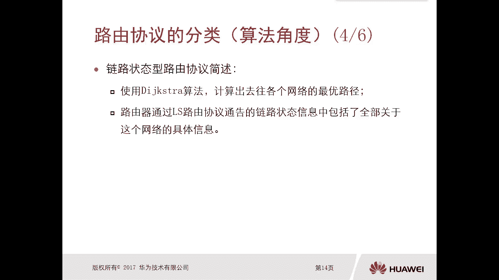

# 华为认证ICT学院HCIA／HCIP-Datacom教程【共56集】 数通 路由交换 考试 题库 - P33：第2册-第6章-1-动态路由概述 - ICT网络攻城狮 - BV1yc41147f8

好那么接下来我们看一下这个路由概述啊，哎那这个应该算是这个动态路由的概述呃，那么相比较这个静态路由，那么动态路由协议呢，它具有更强的这个可扩展性，具有更强的应变能力，那么本章主要是通过以下三个方面。

第一个就是静态路由和动态路由协议的对比，第二个呢就是这个路由器的一个分类啊，那这个分类是从算法角度去分的类，那么其实呢我们还可以从这个掩码角度去分类，那么主要是通过这三个方面进行介绍。

那么首先我们先看一下这个静态路由协议，和动态路由协议的一个对比，那么相对于这个静态路由呢，动态路由协呢，它是更适合于这个大规模的网络环境对吧，那么更适合于这个大规模的网络环境中的，理由呢有两个。

那么第一个呢就是这个动态路由协议，它的扩展性要强，要比这个静态要强多啊，那么第二个呢就是这个动态路由器呢，具备应变能力，那么在以后我们参加工作也好啊，包括我们在现有的这个学校的一个实验环境。

去做实验也好，那么我们基本都是要用到这个动态路由协议，但是静态路由也会用对吧，我们前面也讲到了这个静态路由，它的应用场景一般都是用的这个出口网关设备，对不对，但是对于我们的内网的一些路由器啊。

三个交换机啊，你去配置路由的时候，基本都是用动态路由，很少会用到这个静态路由的啊，好那么接下来我们就看一下这两个理由啊，第一个呢就是这个动态路由协议，它的扩展性强，那么体现在哪。

那么第一个体现呢就是这个配置，对于配置而言呢，我们随着这个网络规模的增加，你配置静态路的难度也会随之增大，你想啊你两台路由器我们可能配置静态路由，可能比如说两条三条搞定了，对不对。

但是假设比如说我有这个网络规模，里面有50台路由器对吧，有这个100个网段，你配吧，这个难度就非常非常大了，对不对，好，那么第二个呢是动态路由，去配置动态路由的时候。

它的好处呢就是我们只需要去宣告路由器，路由器的时间垄断啊，相对来讲呢它简化的多了啊，所以说这个动态路由协议它的扩展性强，就体现在两点是吧，好那比如说胶片下面呢就给了一个例子啊，静态路由的例子啊。

大家看一下嗯，这个场景呢就是舞台路由器，它是串联的一个环境，那我们能够看到有AREA2A二三A4A5，那么有好多知网是吧，十一十2212啊，那么后面不读了，那么在这种舞台啊。

就是假设我们这是舞台路由器串联，这样的环境里边，如果说你想要让所有的路由器都能够互访，他们的知网，就是知网之间能够互通，那么这种情况下，如果说我们采用静态路由的话，我们大家考虑下啊。

比如说我们在一上对吧，在一上如果采用静态路由，那么如果说你想要去访问到A2A3A4A5，那么所有的知网，那么这种情况下AR一上边你需要去设置啊，去配置多条静态路由呢，大家可以算一下。

对于ARE它的直连网段啊，这个和这个还是这个，这三个你就不用去费了对吧，直连有路由，除此之外我们看啊，你需要加一条两条三条啊，四条五条，六条，七条，八条，九条，十条11条，也就是说。

如果说你想要在AR上能够访问到全网，所有的子网啊，不管是互联的，还是我们这个路由器后面挂的这个字吧，那么你需要在A2E上配置11条，静态路由对吧，那你除了A21A2A23A24A二五。

也也要去访问其他的一些子网吧，那这种情况，比如说A2A2，那么它的直连网段你不要加了，除此之外我们看A2需要加几条静态路由啊，一条两条，三条四条，五条，六条，七条，八条九条十条，对不对。

也就是说A二一十一A20条，对不对，那A23的话，大家可以算一下，它也是十条，A二四十条，好，那么A25呢，哎他是和R1是一样的，she对吧，那你想就五台路由器啊，你加起来要配多少条，总共是多少条。

静态路由，52条，对不对，那如果说你在一个大型的网络环境里面，你的路由器更多，那这个就没办法弄了，对不对，哎或者说当你某个路由器某些路由器啊，比如说A21A2A3A4，都增加了一个子网或者两个子网。

在这种情况下，你所有全网的路由器还要去重新加上静态路由，对，所以说你的这个扩展性灵活性是不够的，而且一旦子网出现问题，你进的路由不会不会自动消失啊对吧，它不会根据拓扑的变化而变化。

哎这也是静态路由它的一些缺点，对不对好，那如果说我们采用这个动态路由呢，那么采用动态路由，比如说还是这个舞台这个路由器串联环境，对不对，那我采用动态路由，那么我只需要在ARE上将三个链路去走。

相告A24个链路对吧，A234个链路，L44个链路，L53个链路去除宣告就可以了对吧，所以从这个配置上来看啊，我们就能够明显的感觉到，我给动态路由的配置，要比静态路由的配置要少得多。

当然除了这个配置以外，还有更好的其他的一些更好的地方，你比如说我们动态路由，可以根据拓扑的变化而变化对吧，还有一个就比如说你有台路由器，你增加了一个呃，这个网，我只需要再增加子网的这台路由器上去。

配置一条命令，就是把它全关进去，然后其他所有的路都能学习到这条路，你还需要在其他路由器上去。

创建什么静态路由吗，不需要好，那么我们看一下，下面有一个这个对比啊，大家看一下，就是我们配置动态路由协议，和配置静态路由协议，它的对比，那这个呢是呃，前面那个呢是，比如说我们的环境是串联路由器的数量。

那么有两台三台四台呃对吧，两台三台四台五台对吧，哎两台三台四台五台，但是后边的这个是子网的这个直连子网数啊，那么前面2345呢都是一个子网，那么后面2345呢是两个子网，哎那么针对这种不同的一个情况。

如果你采用静态静态的方式而去配路由，那么如果是串联的两台路由器啊，子网数是一个，那么你配的静态路由是两个啊，如果是三个呢，那么你的丝袜是一个，那么就是八个对吧，哎四个一个18个对，五个一个32个。

你看这个成倍增长了对吧，大概是成倍增长，2~88到18~18到32对吧，好，但是我们采用动态内容呢，那么宣告我们可以看对吧，四七十十三呃，其实当你子网少的情况下，其实我们看这个你配置明细。

路由的条目数和宣告子网数啊，他俩好像没有什么，这个就是比一下啊，就是不分高下，对不对，但是我们往下看，假设我们还是2345啊数量，但是我们的子网呢全都变成两个子网，那么这种情况下。

有的就有体现了很明显的体现对吧，如果你还用静态的话，你看啊哎四条14条，30条，52条，但是我用动态路由，动态路由宣告呢，哎六六个字对吧，十个十四十八对啊，所以在这种小规模的网络环境里边。

实际上你静态路由和这个动态路由，那么从这个配置上或者宣告子网上，其实体现不出来没有太大差距，但是你在一个越来越大的一个网络环境里边，或者说你路由路由器数量非常多，你的自爆非常多的一个环境里边。

那么这个动态路由它的好处就体现出来了啊，至于在就是在这个配置上面，就很容易体现出来了，当然除了配置，当然我们还有更好的一些地方。

对不对，这个动态路由好诶，这是我们动态路由协议，它的第一个这个特点对吧，就是它的这个嗯扩展性比较强，那么接下来我们看第二个。

第二个特点呢是这个动态路由协呢，它具备这个应变能力，那么应变能力呢我们看啊，对静态路由呢它是缺乏这个应变能力的，你静态路由就配那了对吧，即使你的网络环境出现问题，它会变化吗，不会对吧。

所以呢导致这个静态路由呢，它是不适合在大型网络中去单独使用的对吧，你在网络里边，你说有没有监测路由啊，肯定是有的，但是不会特别多啊，肯定是有少部分少部分的静态路由，大部分呢还是有动态路由对吧。

因为你动态路由呢可以对网络产生的异常呢，自动的收敛和应变，你比如说网络哪个链路出问题了，那这个动态路由呢它自动计算啊，这个链路走不了，我走那边对吧，哎我还是用我们之前讲的例子啊。

静态路由就好比是你在这个十字路口，有一个指路牌趴在那了，哎这个口突然间没那个口通往鸟巢对吧，那个口通过什么圆明园颐和圆，但是动态路由呢就好比是你站在一个十字路口，你开了一个导航对吧，那这个导航很清楚诶。

这个路上在修路啊，这个路在堵啊，你不要这样走啊，走对吧，哎这个导航就类似于动态路由，你的指路牌呢就类似于静态路由对吧，这是一个小举例啊，好那么这个静态路由和动态路由协议的对比啊。

那就看这个动态路由协议它的分类啊，好，那么接下来我们就看一个，简单的一个网络环境啊，我看他怎么可以实现这个呃应变能力呢，你看啊，如果说你在这个环境里面很简单，就三台路由器是吧，哎三台路由器。

那么在这个ARE上面呢，他配了一个静态路由，那么这个静态路由实际上是去访问这个，330。0。024对吧，然后他吓一跳是指的13。0。0。3，那么假设啊，如果你采用静态路由方式这样做。

如果说这条链路出现问题了，那么一呢是没法再去访问到A23了，如果再不增加任何路由的情况下对吧，他会不会通过这个A2去访问呢，不会除非你在A2E上再配个静态路由，在二上再配个静态路由才可以进行访问。

所以说对于这种静态路由，你放这了就放这了，链路出问题，它不会变化，但是如果说你采用的是动态路由协议，那么确认情况下，A21去访问这个A2333。0。00，它是走这个这条链，如果这个电路出了问题。

那么这个动态路由协议呢它是能够感知到的，它会自动计算，OK去往这个A2333。0。0。0杠，24的时候，我们走上边不要走下面了，下面出问题了，这就是他的一个这个应变的能力，应变能力好。

那么接下来呢我们就看一下这个路由协议。

它的一个分类啊，那么第一个呢，我们是从这个算法的角度去分类的啊，那么根据这个路由协议所使用的算法，那么对路由协议来进行分类，那么主要是分为两大类，这两个是非常经典的，一个叫做距离矢量型路由协议。

一个叫做链路状态路由协议啊，那么距离矢量路由器呢哎也叫做DVDV，那么哎链路状态路由器呢也叫做LS，那么这边呢是distance victory，然后LS是link state链状态，它缩写嘛。

对不对好，那么我们首先介绍一下这个距离矢量路由协议，距离矢量路由协议呢，它采用的算法叫做贝尔曼福特，这样的一个算法啊，那么这个肯定是以这个这哥们命名的啊，这哥们还是姐妹啊，查一下啊。

那么通过这个DV路由协议对吧，学习到的远端的网络D和V呢，就是路由器所了解的全部信息啊，那么距D呢是什么，距离V呢是这个矢量矢量矢量有方向，就是有距离有方向啊，这样的一个算法很简单的一个算法啊。

这是一个距离矢量，那么对于距离距离矢量，那么这个路由器它通过路由信息的时候，是什么一种方式呢，哎它是这样的，你比如说两台路由器对吧，好那么呃比如说路由器A要告诉路由器B，哎从我这儿你去往自网易有三跳。

唉，去往自号有五条，你就需要知道这么多就够了对吧，哎那说白了就是我还举个例子，我再举个例子，就好比是啊，你假设你还是我还是按照这个路口去讲对吧，比如说你到了某个路口，那现在我们不采用这个叫做静态路由了。

没有指路标了，但是这有个环卫工在打扫卫生对吧，那比如说哎这个又到了十字路口，我要去呃问一下到底从哪个口出去呢，是可以到天安门的，那么这种情况下你就要去问这个环卫工对吧，你就问哎。

那个请问一下这个哪条路是去往天安门的呀，哎那个环卫工就告诉你了啊，从这个口过去，你从这个口往往那边走吧对吧，大概走5km就到了天安门了，OK好那么对于环卫工说的这件事情，你只能信对吧。

你也没法确定他说的是不是真的对吧，所以这种DV路由器呢，实际上呢它传送的就是哎，我告诉你你去你从这走啊，有多远多远对吧就行了，然后你就根据他说的去就行了，那么这种DV这种DV算法的路由呢。

我们也叫做传说路由，传输路由，那什么叫传输路由，就告诉你怎么走吧，你就你就你就你就你就一听就相信，就走就可以了对吧，但是具体是不是5km，是不是从这个口出去呢，我也不清楚，反正就是他告诉我的。

我就走对吧，哎这是这个DV路由传输路由好。

那么另外一种呢就是链路状态，那么链路状态呢是使用的是DJ斯特拉算法，那么它会计算出去往各个网络的最佳路径，那是每台路由器他自己去计算，那么路由器呢通过这个IOS路由器，通告的链路状态信息呢对吧。

还包括了全部关于这个网络的一个，具体信息对吧。

那么对于这个运行了IOS路由协议，这个路由器，它通过信息的时候呢，他就不会说哎我告诉你你你从我这边走啊，你去往这个网一网二啊，有几条我是把地图给你对吧，我给你张地图，就好比是你又到了十字路口对吧。

又有一个环卫工对吧，你去问他，哎你说这些路口，这个哪个路口可以去天安门更近呢对吧，距离是多少呢，这种情况下，环卫工直接不告诉你，直接给一张地图，该地图你看吧，哎我们在这对吧，你看从这个链接过去。

从这个链接过去哎你你自己去看哦，那么这种情况下，也就是说运行的链路状态路由协议的路由器，它给你的并不是传输的路由对吧，而是一个类似于地图的东西，当你拿到地图以后，你自己去算，你自己去看。

到底去往天安门怎么进，到底开销是多少，那你有地图，这个路肯定是可信的，所以说呢这个链路状态路由器呢，也叫做传信路由啊，传信他传的是这个整体的信息，好这个图吧，这个图呢我们一般叫做链路状态数据的一个。

拓扑信息，OK好，那么这两个呢我们后边呢也会着重去讲的啊，在这呢只是简单的一个介绍啊，DV啊链状态嗯嗯这是从啊从这个算法的角啊，从算法角度去做了一个对比啊。

接下来我们看一下这两类路由协议，它的一个比较，那么运行距离矢量路由器的路由器呢，你只拥有自己周围这几台路由器，分享的距离和矢量的信息，它是不够全面的，但是运行了链路状态型路由器的路由器呢。

就像是每个路口，为远足者提供了一张完整的一个区域地图，那么你得有地图了，那么肯定你能够找到对最优的，最合适的一个路径，而且是可信的，而且是可信的好，那么接下来我们再看这个从掩码角度去分类。

那么路由器呢又分为对吧，有类路由器和无类路由器，那么这个呢主要是，当你路由器发送你的路由更新的时候，是否携带了M信息，如果带了五类，如果没带掩码信息，那就是有类路由协议，注意一下啊。

如果携带了就是无类路由协议，如果没有携带，就是有类好，那么实际工作中，我们使用有类路由协议比较多呢，还是无类路由协议比较多呢，那一定是无类路由器比较多，因为无类呢是可以支持这个VLOSM的。

那么对于有类呢，那么是不支持这个VLSM肯定是有问题，但是对于我们线网环境中呢，你说哪一个网络它不会使用这个VFSM，都会用对吧，都会用这个词划分，所以说我们一般都是使用这个无类的路由器。

很少会用有类的啊，所以下来我们就看一下这个有类路由器。

它的一个效果是什么样的啊，那么既然这个有类路由器呢，它是不携带掩码的，所以说他去传送路由的时候呢，他只是去传送一个前缀信息，那么具体掩码是多少，它不会发送过去啊，那也就是说你比如说这个拓扑图里面。

我们可以看到这个AR1和A2直连，直连互联网都在12。1。1点，零杠24对吧，然后呢，这个哎A2的左侧呢是12。1。2。0，杠二四，那么A2的右侧是22。1。1。0杠二四，哎那么在这样的一个环境里边呢。

哎在这样一个环境里边，我们说假设AR1要将10。1。2。0的，路由呢传送给A2，那么A2呢要将22。1。1。0，杠二四的这个呃路由呢传送给这个ARE，由于现在是一个有类路由协议对吧。

所以说他们相互去通告自己后边路由的时候，实际上是不带雅马信息的啊，是不带掩码信息的，那么也就是说ARE序通告的时候，他只是将12。1。2。0往这边发对吧，然后A2呢只是将22。1。1。0发。

那么都不会去写在这个亚马信息，那么当AR1AR收到这些路由的时候，因为你放在路由表里面，肯定是有这个叫做掩码信息的，对不对，那我到底是给他杠八位掩码呢，还是杠24位呢，还是杠66位呢。

哎他是怎么判断的呢，哎它是通过比较收到这条路由他的入接口，哎你你比如举个例子啊，比如说这个A2把22。1。1。0杠24，这个路由传递给了A21，那么ARE呢是从一零口收到的对吧，当然你A2去发送的时候。

肯定只是22。1。1。0啊，就是没有这个掩码的一个长度嘛对吧，没有这个掩码的长度，那么当这个AR1收到以后，那么ARE呢去判断诶，我是从一零口收到的那一零口，它所在的IP地址是12。1。1。0。

那么现在呢是22。1。1。0对吧，那么他去判断这两个是不是属于同一种类，那么对于12。1。1。0，它所属的主力是12。0。0。0杠八，这个主类，那么二十一二。1。1。0呢，所属的主力是22。0。0。

0杠八对吧，所以这种情况下他俩一对比，发现诶不是同一个主类呀对吧，不是同一个主流啊，那么这种情况下，AR1接收到这条路以后啊，放到路由表里边，它的源码呢就会用这个路由它的主类掩码，那么最终得到了ARE。

它的路由表就是22。0。0。0杠八，那么相反当AR1把12。1。2。0，传送给AR2的时候，那么它传送路有的时候呢，就是12。1。2。0啊，没有掩码长度给了A2，A2呢从一零口收到了，他要去判断啊。

哎这条路由和这个接口所在的一个路由网段，是不是属于同一种类，诶，发现是处于同主类，那么这种情况下，这条路由被A2收到以后，他会使用收到这条路由接口，所在的IP地址的一个前缀，这个掩码作为它的码。

那么就变成了12。1。2。0杠二四哎，这个一定要注意一下，这个很重要，就是有类路由协议，它传送的是不带雅马的，那么对端路由器收到以后怎么对吧，给它附上这个源码信息，因为路由毕竟是有掩码信息的。

就是看收到路由的接口啊，所在的网段，和你这个路由是不是处于同一种类啊，是不是处于同组了啊，这个注意一下。

好所以这种情况呢这个有类路由协议呢，就类似于有一点点汇总的感觉了啊，你比如说哎这边是22。1点点零，这边是12。1点点零，这边是12。1。2。0对吧，那么你A2和A23，22。1000的路由信息呢。

最终发给AR1，AR1看到的就是2。0。0杠八，但是呢你AR一上面的这个12。1。2。0，这个路由信息传给A23啊，那其中A23看到效果是12。0。0。0，杠八啊，就好比是中间这台设备啊，做了一个会长。

那么像这种这个中间设备呢，我们可以认为它叫做主类的一个边界，或者叫做有类的边界啊，那么一边呢是12这个主类，一边是二这种类，那么只要经过这个路由器的路由信息呢，都会被做成一个汇总的一个效果啊。

看好这是这个按照掩码的角度去做的。

这个路由协的一个分类啊，接下来我们看一下这本小节的重点，重点是相对静态路由，动态路由两大特性是什么样的对吧，哎我们得我们得知道啊，刚才我们讲了对吧，哎有哪两个这个特性就是扩展性比较强，应变能力比较高。

对不对，好，那么重点二呢就是基于算法角度，路由协议呢分为基于矢量路由协议，零状态路由协议。

