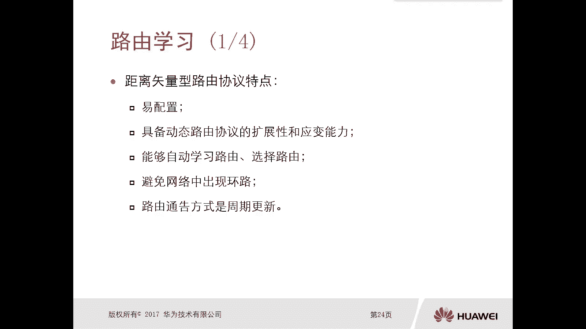
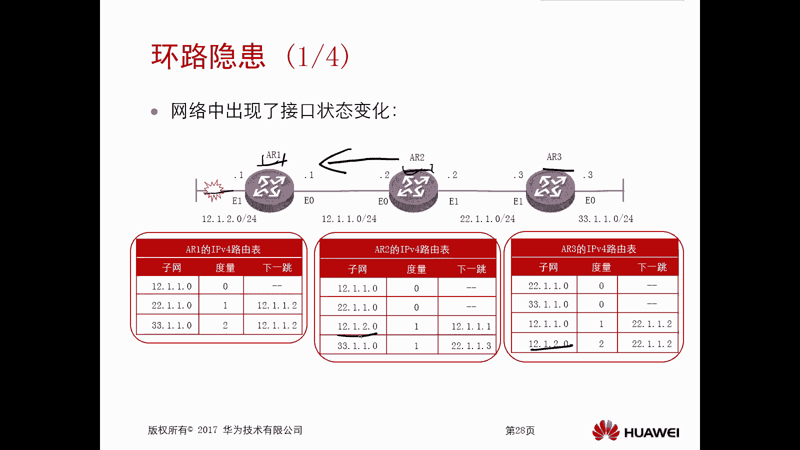
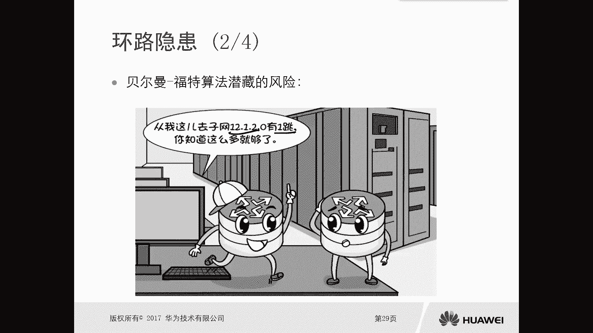
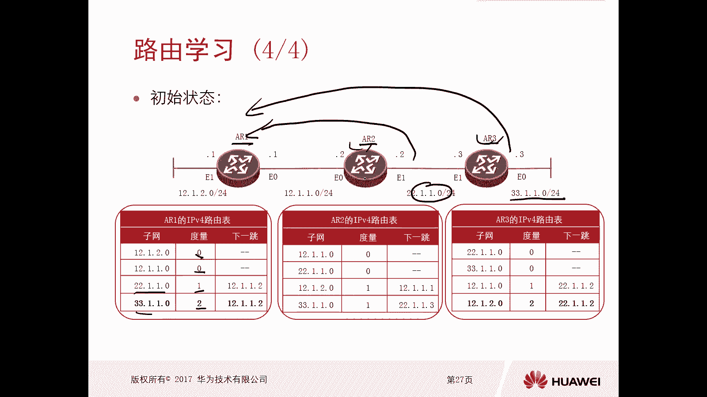
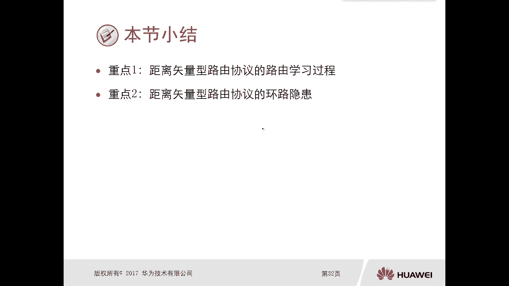
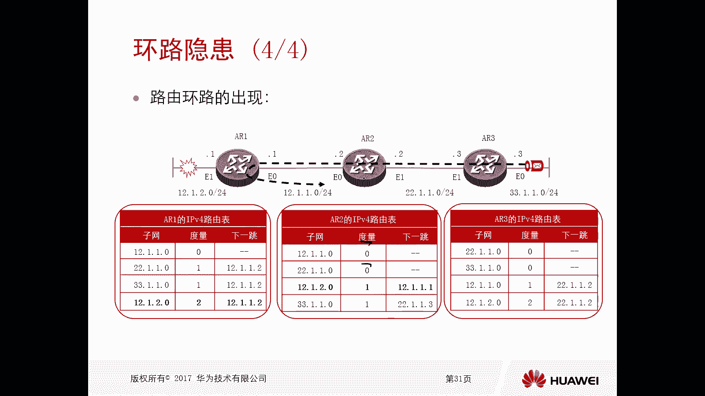
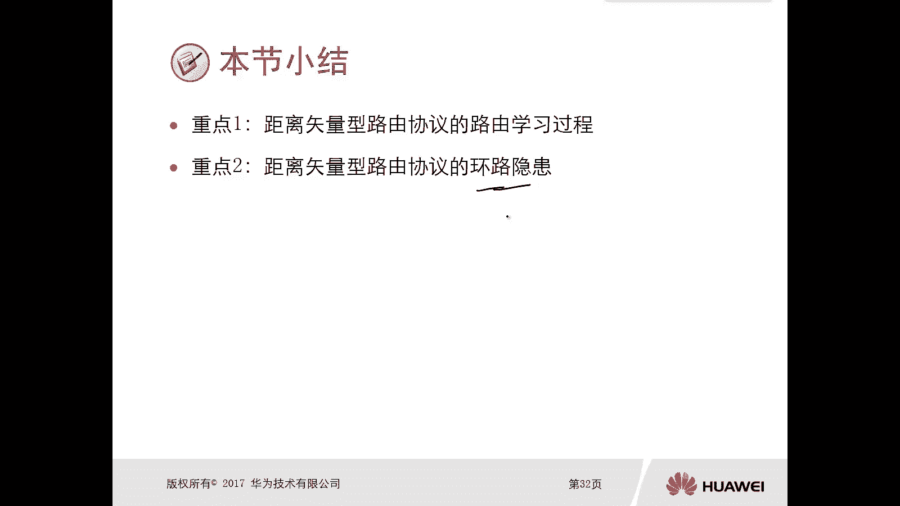

# 华为认证ICT学院HCIA／HCIP-Datacom教程【共56集】 数通 路由交换 考试 题库 - P34：第2册-第6章-2-距离矢量路由协议 - ICT网络攻城狮 - BV1yc41147f8

好，那么上一小节呢，我们主要是讲这个路由概述对吧，我们讲了这个有两种类型的这个路由协议，动态路由协议，第一种呢就是这个距离矢量路由协议对吧，然后第二种呢是这个链路状态路由协议啊。

那么接下来呢我们看这个距离矢量型的这个，路由协议啊，那本小节呢主要是从如下两个方面啊，详细去介绍距离矢量型路由协议，它的特点和环路避免机制啊，那么第一个呢，就是我们要介绍这个距离矢量型路由协议。

它的一个路由的学习方法或者学习过程啊，那么第二个呢就是距离矢量型路由器呢，实际上是由环路隐患的，那么这个环路隐患主要体现或者说主要原因啊，是这个它的算法所致啊，好我们先看一下这个距离矢量型路由协议。

它的一个特点，那么第一个是E配置，那么后面我们会讲一个矢量路由协议的代表，Rip，那么这个rap这个协议呢，我们讲到的时候大家就明白了对吧，非常非常容易配置，没有什么非常复杂的一个配置过程很简单。

那么这种距离矢量路由协议动态路由协的一种，所以说它是具备动态路由协议，的扩展性和应变能力的对吧，因为你只有这种扩展性和应变能力，那么你才适用啊，才能称得上这个动态路由器，你连扩展性和应变能力都没有。

那叫什么动态路线，对不对，OK好，那么能够自动的去学习路由，选择路由，哎这也是我们动态路由协议必须的对吧，要不然你学习不到路由，你没法去选的和静态路由有什么区别呢，对吧好。

那么同时呢这种距离矢量型路由协议呢，要避免网络中出现环路，那本身它算法呢是不是免不了的，那个算法很简单，我们前面讲过对吧，哎算法很简单，那么实际上如果说你是距离矢量路由协议，那么从协议的层面出发。

你得考虑到环路它的避免方法，而对于这个路由通告呢，它的方式呢是周期去更新的啊，也就是说它每过一段时间啊，这个时间是固定值对吧，固定值每过一段时间呢，他就会把路由更新出去，每过一段时间就会把路由更新出去。

那么其实他这样做的目的呢，也是为了保证在短时间内或者在固定时间内，你的路由是OK的啊，是OK的啊，也保证啊，从从这个侧面啊，也可以去保证路由不会出现环路，当然这个路由周期的更新啊，只是避免环路。

避免路由出现问题的一个小小的机制好。

那么接下来我们就看一下这个，当我们做完了这个距离矢量路由器的配置以后，那么一开始呢，比如说我们拓扑图里面看到的123，这三台设备哎，他处于这种串联的方式啊，那么这里边有网络，你看这个A21呢，它有12。

1。2。0，12。1。1。0，然后这个二和三之间的是22。1。1。0，那么后面的是33。101。024，那么一开始就是当我们还没有去嗯，当我们还没有去运行这个距离矢量之前，那么在A21A2A三上呢。

实际上只有他的直连路由，就是它在它的IP路由表里面啊，只有直连路由，那么这个前面我们讲过直线路，对不对好，那么当我们在123上呢，配置了这个距离矢量路由协议，那么他们就会相互去通告路由信息。

就和他的邻居啊去通告这个路由信息，马路信息好，那么这样呢就是这个路由器呢，可以通过这个协议它周期的去更新呃，而获得获得这个非直连网络的一些理由，哎那也就是说你比如说啊，你看当我们二和3123之间运行了。

这个动态路由协议，比如说这个rap距离矢量对不对，那么他们开始相互发送路由更新，就是比如说A21，他就会把他所在的直线网络对吧，做给A2，A2呢把他所建成的网络交给A21，再交给A23。

相互这样去存对吧，好，那么最终呢我们看这个路由表就发生了变化了，对吧，在A1上面，我学习到了去往22。1。1。0，这样的路由对吧好，那么去往这个2。1。1。0，它的下一趟是12。1。1。2。

A2呢我学习到了12。1。2。0，下跳的是12。1点点一三，3。1。02。103，那么A23也学习到了去往12。1。1。0，再下一跳是22。1。1。2，哎那么就是相互啊，我给你寄给我啊。

那么最终当路由区稳定的状态下啊，趋于稳定的情况下啊，那么所有的路由器的路由表呢应该是吧，应该是一致的，就是你的路由条目是一致的啊，我们可以看一下，现在呢就已经处于一个哎，这个这个稳定的状态了。

那么稳定状态下，我们看下A2E上面，A2E上面12。1。2。0对吧，然后1。02。10033。1点零，我们可以看一下A2上，是不是和ARE上边的路由表，是完全一样的是吧，12。1。0啊，十二二。1。

零零十二。1点2。03，3。1。00，对不对，同时这个A3也是一样的，2。1。03，3。1。012。1点012。1。2。0啊，大家注意下，当我们动态路由，协议路由器之间相互通告了路由以后。

路由处于稳定的情况下，所有的路由器它的路由表上是一致的，大家注意下，这个一致指的是你的路由的前缀啊，强度是一样的，不代表说你的度量值吓一跳是一样的，这个肯定不能一样，哎注意一下啊。

这个一致指的是你的前缀路由前缀，或者说你的这个路由信息是一样的啊，不是说你的度量和你的吓一跳，这东西肯定是不一样的，OK好这是这个呃，这是我们路由稳定的情况下啊，那这样的话当我稳定以后呢。

我们是不是就呃都说到了，去往所有这个呃网段里边啊，所有这个网络里面网站的一个路由信息，那么就可以发起访问了，对不对，好，那么比如说啊比如说比如说我网络中某个接口，它的状态发生变化，比如说ARE的对吧。

这个E1口这个链路出现了down掉啊，不管什么原因啊，他一开始是up，现在出问题了，那么down掉以后，由于R1是它的直连的链路，所以说它是能够感知到的，所以说这种情况下，他直接从它的路由表里面12。

1。2。0，这个路由呢就给删除了，我们看一下啊，这是上面那个路由表是吧，好下面这个路由表，我们看还有没有12。1。2。0呢，没有了，把这个删掉了，对不对，因为质量出问题了嘛，对不对，不可达。

但是这种情况下，对于AR2和R3，实际上他们是不知道的，他们是不知道的对吧，但是由于由于我们这种距离矢量路由路由，它会周期的去通告路由更新，也就是说即使你这个AR1，现在这条链路出问题了。

但是A2和A3上依旧有12。1。2。0，这条路由信息，那么很有可能过了一个固定时间，AR2会把这个路由信息又传给了ARE，但实际上这个路由是不是已经出问题了对吧。

那这马已经断掉了，对不对，那么这种情况下，你想A22告诉了A1说，OK对啊，我知道这个去网12。1。2。0怎么走对吧，大概是一跳一跳呢，指的是路由器啊，经过一条路由器对吧。

OK那么这种情况下，这种情况下A2E呢就学习到了一个错误，有哎，他在路由表里面显示的就是12。1。2。0，然后他的下一跳是12。1。1。2，那是从A2学习到的，但实际上这个路由已经出问题了对吧，出问题。

那么这种情况下，我们看这个数据呢就会出现环路，就会出现这个路由环路啊，那当比如说PAR3，这边有它PC要去访问12。1。2。0啊，他的一个目的网段的时候啊，那么首先到了A23A23查找路由表。

发现他下一跳是2。102，交给A2对吧，A2去查路由表，它下一跳是12。1。1。1K就可以A21，但是A21呢它的路由表学习是错误的，他从A2学习到的对不对，所以说呢它的下一跳是12。10。2。

又把这个数据包返回给了A2，那么到了A2又给AR1，AR1给A2，那么就会出现这样的一个环境对吧，哎这是这个环路的一个隐患啊，环路的一个隐患，那么在我们的距离矢量里边呢。

哎我们得距离矢量型这种路由器里面，我们得想办法去避免这样的环路的出现，好这是这个距离矢量路协议啊，好那么在这呢再补充一下啊，我们在距离矢量这种距离矢量型的路由器里边，怎么去算这个度量的呢。

我们可以看到这个路由表里面它是有度量的，对不对，唉那么第一张这个PPT里面，我们可以看到直连它的路由表的度量呢，全都是零，对不对好，但是呢对于这个从远端学习到的路由，它的阻燃值。

实际上是按经过路由器的数目来算的，你比如说这个22。1点点零，在R1上学习到了这个2。1点点零，这条路由要传送给ARE，实际上是经过了一台路由器A2，所以这种情况下。

在A二一上边呢看到它的度量值就是一啊，那么同理，那么AR3后边的那个33。1。1。0，这条路信息，那么传递到AR1，那么经过了两台路由器，所以在A1上面，它的路由表里面的显示就是二哎。

这个注侠这是度量啊，我们距离矢量路由器里面，度量呢就是按这个跳绳啊，这个跳绳呢指的就是你经过了几台路由器，一台路由器呢是一跳，两台路由器呢就是两跳，以此类推，OK啊这就是这个距离矢量型的路由协议。

那么它的路由学习方法呢其实就是哎我传给你。

你往后传对吧，度量呢这个度量值呢以此累加对吧好，那么这种距离矢量路由协议呢，呃它还有环路的风险，对不对，哎，那么我们后面再具体讲到某个具体的一个距离，矢量路由协议的时候呢，我们再去讲。

实际上它是有环路防护的一些机制的好。

所以我们看一下这个重点啊，重点呢就是第一个就是距离矢量型路由协议，它的路由的学习过程，实际上我们重点就讲了这两个，对不对，哎那么学习过程是怎么学习的呢，学习过程怎么学习的呢。

学习过程就是呃当我们相互对吧，所有路由器，邻居，路由器配置了这个距离矢量型的路由协议啊，它就会每隔一段时间啊，一般都是固定的啊，他就会把他自己的完整的路由表，更更新给这个路，更新给邻居的这个路由器对吧。

那么这个路由器就是通过这种方法，就是固定时间内周期更新更新更新吧，大家互学习到远端的路由条目啊，那么重点二呢是这个距离矢量型路由协议，他这个环路的隐患对吧，那么环路隐患呢，刚才我们也讲到了。

你当一台路由器，它的一个节点网站出现问题，以后啊，由于那是这个我们路由器之间的是周期的更新，所以说呃邻居路由器呢，很有可能会把这个路由信息再反过来，对不对，那被我收到以后呢。

哎那么这种情况下我就学习到了一个错误的，实际上这条路由信息本身是我直连的，已经出问题了，但是呢我无法进行判断，对不对，唉所以说它是有这个路由隐患的啊，后边呢我们再去讲具体的路由协议。

如何去防范啊。