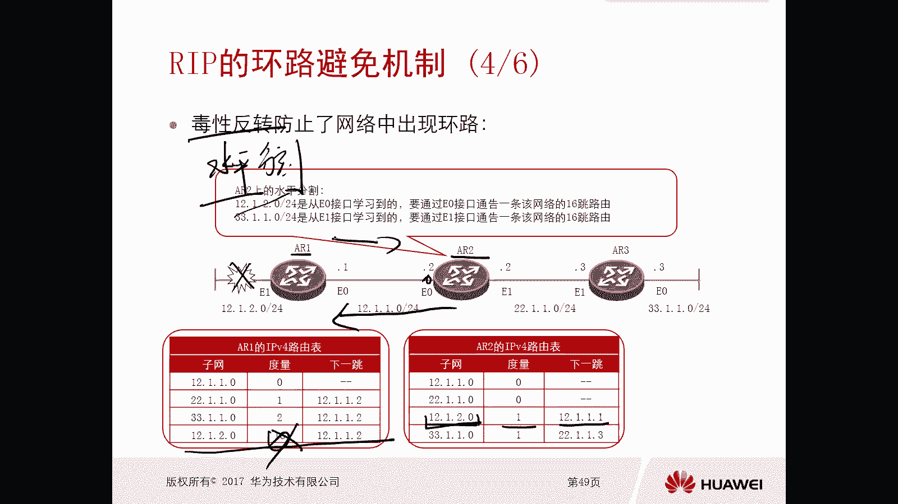

# 华为认证ICT学院HCIA／HCIP-Datacom教程【共56集】 数通 路由交换 考试 题库 - P35：第2册-第6章-3-RIP的防环机制 - ICT网络攻城狮 - BV1yc41147f8

好，那么接下来我们看一下这个rap的环路，避免机制啊，那么根据前面的这个资料呢，我们已经知道了，实际上这个rap协议呢，它就是这种距离矢量型的路由器，而且是比较典型的一个嗯，所以说我们前面也讲到过。

这个距离矢量型路由器呢，它是有存在环路风险啊，这种可能的，对不对，有这种环路风险的可能嗯，所以说这个rap这个协议呢在设计的时候呢，他得想办法去弥补这个算法带来的一些问题。

也就是说rap他必须要避免环路啊，所以说我们接下来就看一下这个rap，它是通过哪些机制来去做一个环路避免的，那么第一个机制呢，这个非常非常重要，叫做水平分割啊，就rap的第一个防范机制叫做水平分割。

那么什么叫做水平分割，水平分割的引入的规则是啊，那么禁止路由器将从一个接口学习到的路由，再从同一个接口通告出去，哎，再通过出去好。

那么我们接下来看一个实际的例子啊，这就是一个水平分割，他就可以去防范这个网络中出现的环路，那么之前我们在讲这个距离，矢量路由协议的环路风险的时候，实际上也用到了这个图对吧，1233台路由器。

那么都是互联的，有12。1。2。01点02。0，1。033。0。0这四个网段好，那么假设啊假设那么当这个路由稳定以后，突然ARE的直连网段出现了问题，那么出现了问题。

那么这个AR1他就会把他的路由表里边，关于10。1。2。0这条路呢给撤销掉对吧，给撤销掉好，那么我们前面讲的是，当他撤销了，由于我们路由器呢每固定一段时间呢，它会周期去更新它的路由信息通告给邻居。

所以说我们前面讲的是A2呢，会把这条路信息就是关于12。1。2。0，12。1。2。0，这条路由通告给ARE，这样就会使得A2E呢，这个学习到错误的路由信息，那么就会发生环路，对不对好。

但是当我们在rap里面引入了水平分割以后，我们再来看啊，那么水平分割是这样的，对于AR1这条路由信息被A2学习到，那么一定是A21通过在一零口发出去，发出去对吧，也就是说A2是从一零口收到了这条路信息。

那么在A2的路由表里面呢，12。1。2。0，那么他吓一跳是12。1。0，开销是1OK，那么由于有水平分割的一个机制在这里，那么这种情况下，AR2即使在通告路由更新的时候，给ARE的时候。

他不会再将从一零口收到的12。1。2。0，这台路由返回给A21，那么这种情况下，即使你这边出问题了，那么A22在更新路由的时候，周期更新路由的时候，我们可以想一下，10。1。2。0。

这条路由还会不会被通告给A2E呢，不会，那么这种情况下，A21呢就不会学习到错误的路由信息，就不会有滑落了对吧，那么同样当AR3的路由信息对吧，通告给A2，A2从一一口收到了。

那么A2还能不能从一口把33。1。1。0，这个路由信息通告回给A23呢也不会唉，这就是水平分割，当你从某个接口收到的路由条目不会再同，再从同一个接口回传回去对吧，哎那么缺省情况下，我们路由器华为路由器。

只要你使用了rap，它所有的接口都是开启了水平格，哎所以说我们可以看一下，以二为例啊，就10。1。2。0杠24，这个路由呢是从一零口学习到的，所以说它是不能够再通过以领口接口通过出去，同样33。1。1。

0，这个路由信息呢是从一口学习到的，也不能再通过一口通过出去唉，以此来防范这个环路哎，这是第一种环路避免机制啊。

就是rap里面就是水分割，第二种呢叫做毒性反转，那么毒性反转的方法呢，和这个水平分割的方法正好恰恰是相反的，那么毒性反转的做法呢是，当一个路由器从一个接口学习到一条，去往某个网络路由的时候。

它就会通过这个接口通告一条，该网络不可达的路由，哎，这个是什么意思呢，意思就是当你从一个接口收到一条路由，这这台路由器依旧会把这条路由，从这个接口回传回去，但是呢会把这条路由给它设置成不可达。

在rap里边我们通过什么方式去标识路由，不可达到通过通过最大跳水16条，哎我们前面的章节里面应该是有啊这个信息的，对不对，哎，rap16条是不可能支持15条，直至15条，15条是有效的，对好。

那么这个正好你看和这个水平分割是相反的吧，水平分割是不传啊，对用反转是传，但是呢我把这个路由信息呢，给它设置成16条啊。

那么你最短路由器收到以后呢，还是不能用嘛，对不对，我们看一下这个事例啊，那么还是这个啊，还是这个还是当这个录入信息啊，一开始稳定的情况下啊，这个A2A21学习到12。1。2。0。

这条路由信息下一跳是12。1点点，一开销是一，那么当这边出问题了，那么A22通关路由的时候，如果说你开启了毒性反转，那么A2呢依旧会把12。1。2。0，这条路由通告回给ARE。

但是由于这条路由是从这个接口收到的，那么从这个接口在回传的时候，他会把这条路由设置成16条，所以这种情况下，A21学习到一条路由信息是16跳，实际上A21呢是不使用的，哎他认为这条路是不可能的。

他也不用，那你不用的话，实际上在这呢也就完全可以打破环路了，那A21和A2之间也不存在环路，哎，这是一个毒性反转啊，注意一下，那么毒性反转和水平分割呢，他俩是互斥的，缺省我们的接口呢是开启了水平分割。

如果说你把接口开起来，毒性反转的话，那么水平分割就自然就失效了，所以说他俩是互斥的，一定要注意缺省是水平分割，这是rap环路避免机制里面的第二个，那么接下来是第三个啊，第三个。

好那么第三个呢是路由毒化与触发更新，那么什么叫做路由毒化，路由图换了，指的是，路由器会将自己路由表中已经失效的路由，作为一条不可达路由主动通告出去，比如说有一台路由器，它的直连网段出问题了。

那么他会主动把这条出问题的路由信息唉，通告一个16条通告出去，那么目的就是告诉其他人说，诶这个路由不可达了，你们赶紧撤销掉，很主动嘛，对不对，这个就叫做路由毒化，那么什么叫做触发更新呢。

顾名思义就是支路由器在网络发生变化的时候，不等待更新，计时器到时主动发送更新，而我们知道我们的rap呢它是周期去发送更新，那么这个周期是30秒，如果说你的路由出现了变化。

它是不需要等待30秒而直接去更新，而目的也是为了加快它的收敛，防范可能会出现的路由环路对吧，那么对于路由毒化和初中，他俩结合到一块的对吧，只要你网络出问题了，那么路由器呢一定会有触发更新。

同时会把这条路由信息呢，给它设置成一个不可达的路由信息。

主动通过出去，哎你比如说我们这个图对吧，那么当你这个AR1这个链路出问题了，那ARE是招了哦，这个路由信息是无效了，那么这种情况下，ARE就会主动的瞬间，把这个12。1。2。0杠24。

这样的路由信息给它设置成16条通告给A2，A2收到以后也变成16条对吧，那么A2呢继续往后通告就会通通告A23，那么这种情况下，所有的设备，最终关于12。1。2。24位，这样的路由信息全都是16条。

那么16条意味着这条路由信息不可用，无效的路由信息，这样的话，所有的路由器就会把这条路由信息给忽略掉，给删除掉，所以你看当这个路由出现问题以后，我通过路由的话触发更新。

可以很快的使得这条路由信息在整网消失，那还有什么黄了吗，没有，那么我们可以考虑一下距离矢量路由协议，往往是当路由出现问题的时候，会出现环路对吧，那可能是这个路由更新不及时，或者说这个路由它在整网的一个。

这个状态是不统一，可能有些路由器没有了，有些路由器还有就有可能会造成环路，那既然现在有了这个路由图和图画更新，我完全对吧，就是当出现问题的时候，我就完整的把这个路由信息更新出去。

把所有全网关于这条路由信息全部都刷掉，那全网瞬间就达到同意了对吧，哎也可以避免这个出现环路，所以在rap里面大家注意一下哎他的机制呢，这些机制呢全部都是有的缺陷都开了，比如说水分割独立运转就不用讲了。

除非你开路由读画和触发更新，把这些呢全都是放在一块去用的啊，所以说zip它的环路避免机制还是非常丰富的，实际上除了这些呢，我们在前面章节里面，其实也讲到过一个东西对吧，也是用来rap的环路避免的。

那么就是最大跳数啊，其实刚才我们也提到了对吧，哎它通过最大跳数也可以在有限的范围里边，去避免环路机制啊，去避免这个环路，他也是一个避免环路的机制，那么还有哪些呢，比如说GP里面的值对吧。

比如说它的更新时间啊对吧，然后edge时间啊，然后什么垃圾计数器啊，垃圾叫做垃圾收集计时器对吧，哎一个叫做更新时间，一个叫做老化时间，一个叫垃圾收集计时器，我们前面讲过的对吧，那么更新时间30秒。

对不对好，然后呢这个老化时间呢180秒对吧，然后这个垃圾收集现在120秒，那么这些时间呢，这些时间呢实际上他也是为了去嗯，避免路由出现环路的唉，所以说我们rap的环路避免机制呢，是非常非常多的。

相对来讲是比较复杂的，对不对，OK好。

