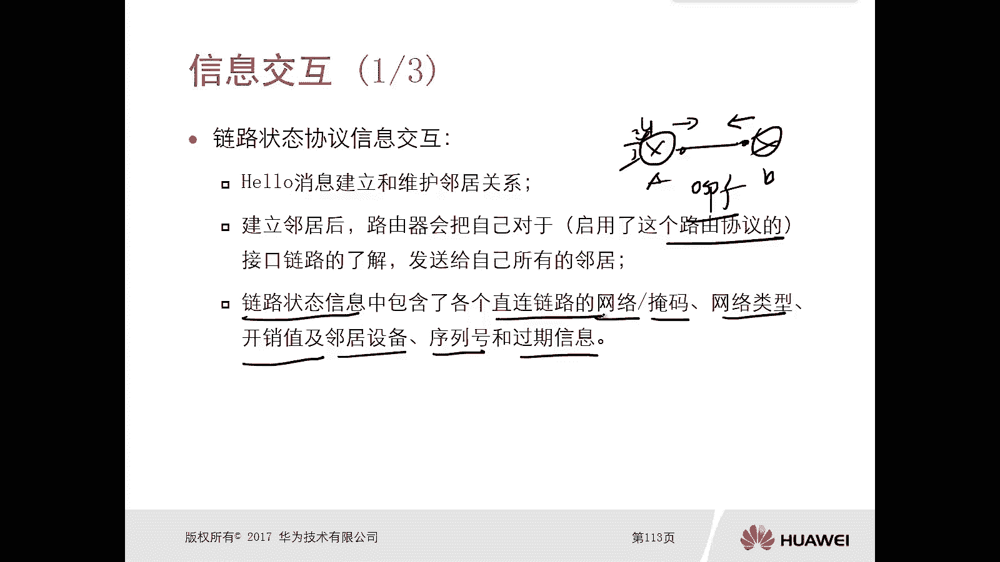
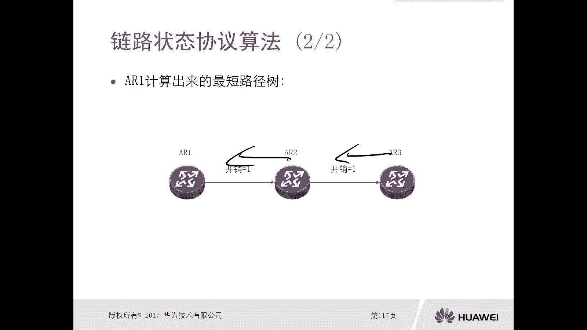

# 华为认证ICT学院HCIA／HCIP-Datacom教程【共56集】 数通 路由交换 考试 题库 - P36：第2册-第6章-4-链路状态路由协议 - ICT网络攻城狮 - BV1yc41147f8

好，那么接下来呢我们来看一下这个链路状态型，路由协议啊，那么在这一小节里边呢，我们将会分为两个小节，对这个链路状态型路由器，这两个步骤呢进行一个简单的介绍，那么第一个呢就是这个信息的交互过程。

信息的交互过程好，第二个呢是这个链路状态协议它的一个算法好。

那么接下来呢，我们先看一下这个链路状态协议信息，它这个交互啊，那么对于这个链路状态路由器的路由器，那么当我们配置了这个这种动态路由器以后，那么首先呢他们会相互去发送hello包啊。

那么比如说啊我们两台路由器对吧，你相互配置的这个比如说OSPF这个协议，OSPF呢也是我们后面要讲的，这个是链路状态路由器的一个代表，那么当我们在路由器A和B上配置完了以后呢。

他们就会在这个只能到OSPF的这个链路上，接口上去相互去发送hello包，那么hello包的目的呢，实际是实际上呢就是去建立邻居关系，和维护这个邻居关系，我们在rap距离矢量路由器里面是没有的概念。

在OP里面有好，那么当这个邻居建立完了以后，那么路由器呢会把自己接口链路的了解啊，那把哪些接口呢，一定是起了这个路由器的接口啊，你比如说这两个接口，比如说你后边呢还有三个接口。

但这三个接口比如说一口二口，三口只有一口和二口，启用了这个OSPF，那这种情况下，他不会说把三口这个信息呢也会发给这个B，他不会对吧，只是说启用了这个路由器的接口啊。

对这个接口链路的了解发给自己所有的邻居好，那么这个嗯对这个接口链路的了解呢，我们也叫做链路状态信息，也叫做链路状态信息，那么这个链路状态信息里面包含的内容呢，是直连链路的网络掩码网类型开销值啊。

还有邻居设备序列号和过期信息，所以它这个内容呢相比较距离，矢量路由协议里边的内容就更加丰富了，你想我们距离矢量路由器传送的叫做路由信息，那么路由信息呢无非就是网络掩码开销啊，没别的了，对不对。

但是我们链路状态路由器呢，他交互的信息呢不再是路由了，而叫做状态信息，那么链路状态信息里面就比较丰富了，唉那么就是刚才我们讲的这些内容对好。

那比如说我们看一下啊，在这个环境里面，他怎么去通过这个链路状态信息呢，呃假设我们现在1233台路由器，那么各自它的互联网段的开销是不一样的对吧，那么ARE这边是开销，二中间是开销，一开销一开销二。

对不对好，那么这种情况下，如果说当这三台路由器之间都相互建立了，这种连这个链路状态路由器它的邻居关系，那么ARE呢，会去收集收集它自身的链路状态信息，那么对于AR1来讲。

假设A21只是一口和一零口运行了动哎，这个链路状态路由协议，比如说OSSPF，那么这种情况下，他会去收集这两个接口的链路状态信息啊，然后通道给他邻居A2啊。

那么这个链路状态信息里面就包含两个链路了，一个链路呢就是10。1。12。0杠二四对吧，网络类型以太网啊，邻居设备是A2，你看啊，他不仅通告了前缀开销，还同通告了一个拓扑信息，哎就是在这个网络上。

实际上A1和A2是有邻居关系的对吧，哎这个类似于一个拓扑信息，类似于小地图是吧，那么第二个的链路呢是12。1。2。0，到24，以太网，现在这边是没有邻居设备诶，开头是二哎那么这样呢传给了A2。

那么A2收到这个链路状态消息之后，他怎么处理呢，哎它首先是自己保存一份啊，保存一份，同时呢他会把这个R1发过来的链路状态信息，原封不动的传给123，当然AR2除了将AR1传送过来的。

关于这两个接口的链路，链路状态信息传给A23以外，那么A2是不是也会将他自己的这个链路的，链路状态信息传给A23啊，对不对，同时当然这个A2也会传给这个A1嘛，对不对，它是双向的，那么这样的话。

你想我A21传给A2，A2传给A23，A2传给A23，A23传给A2，哎，就A2乘A21啊，咱们说错了，A21，A2乘以A21，那么他们相互去发送。

最终呢会使得三台路由器，每台路由器呢都会形成一个完整的，叫做链路状态数据库，那么对于这三台设备，它形成的一个链路状态数据库，实际上是包含了A2的链路状态信息，二三的链路状态信息。

以及R1的链路状态信息啊，那这个数据库呢，实际上是包含了所有路由器的一个链路状态好，那么所有的路由器，那么得到的最终是完整的整个网络里边，所有路由器的链路状态信息，OK那么有了这些小地图对吧。

小地图我们刚才讲了啊，它是拓扑，还有开销，有前缀，对不对，那么因为这些小地图拼凑起来是一个完整的，整个网络的一个大拓扑，一个大地图对吧。

唉那么有了这些信息呢，我每台路由器就可以根据这个数据库，数据库呢叫做SDB去计算出来top啊，计算最佳路径对吧，哎你比如说AR1AR1，它计算出来去往所有路由器的一个路径，就是AR1到A2到A3。

那么如果是A2A2计算出来，就是到A1到A23对吧，如果是A23A23A二到A21，那么其实这个我们可以做个比喻，就好比是啊，哎你得到了好多这个小的地图，你把这个地图拼凑起来，然后上面的各个名胜古迹。

你是不是就能计算出来哦，我从这边走进，还是从那边走走进，那是不是以你自身为一个根对吧，为一个出发点去计算你，你所有各个景点的一个最短的路径，哎，这个算法呢后边呢我们也会去解释，它叫做SSPF算法对吧。

哎这就是这个链路状态，路由协议它的一个特点对吧，信息传递传递的是链路状态，不再像距离矢量路由协议那样，传递的是路由信息，对不对，他的开销是累加的，距离是两，但是我们的链路状态呢，它传送的是链路状态对吧。

在某个区域里边，在某一个范围环境里面，它是不变的传统区域，然后你拿到以后就可以计算。

好，那么重点呢我们可以看一下重点一，链路状态信息交互交互呢首先要建立邻居关系，对不对，然后有了邻居关系，通过hello包啊建立关系，有了邻居关系以后呢，我们相互去发送这个链路状态信息。

那么链路状态信息里面包含什么前缀呀，掩码呀对吧，然后这个设备呀连接的设备啊，对不对，网络类型啊，开销啊等等是吧好，那么第二个呢是链路状态协议的算法，那么算法呢就是以自身为这个中心啊。

去计算一个最短的路径对吧，然后可以算出来，所有网络的最短的最佳路径是怎么走的，对吧，放到路由表里面就可以了。

