# 华为认证ICT学院HCIA／HCIP-Datacom教程【共56集】 数通 路由交换 考试 题库 - P37：第2册-第7章-1-OSPF报文类型 - ICT网络攻城狮 - BV1yc41147f8

好，那么接下来我们看一下这个，OSPF的一个报文类型啊，那么OSPF呢一共是五种报文啊，五种报文类型，那么第一种呢嗯就是hello bn，那么这个类型字段取值为一。

那么后面呢我们也会去看相应的报文格式啊，它有一个类型字段，如果这个类型字段唯一的话就是hello报文，如果这个类型字段为二的话，它叫做数据库的描述信息，那么也简称叫做滴滴啊。

就是database depression呃，叫做数据库的描述滴滴嗯，然后第三个如果这个取值为三的话，它叫做链路状态请求报文叫做LSR啊，就是request嗯，如果说它的类型字段取值为四呢。

叫做链路状态更新信息，叫做LSULSUU呢是update啊，如果类型字段取值为五呢，叫做链路状态券消息叫做LSACK啊，这个LSACK好，那么这几种报文呢，在后边我们去讲这个OSPF状态机的时候。

可能会嗯讲它的一个交互的过程啊，那么呃当然我们接下来呢先看这几种豹纹，它的一个作用啊，那么首先我们先看这个hello消息的一个总，那么OSPF呢，它是依靠这个hello消息去建立OSSPF邻居的。

你比如说两台路由器啊，两台路由器，那么呢我们运行的比如说A和B，我们这两个互联接口啊，运行了这个OSPF，那么这种情况下呢，A和B呢在这个链路上就会相互去发送hello包哎。

那么第一个发送的就是HELO包了，哎，那个哈喽包AA发过来，B就看到A了，B发过来A就看到B啦，那么当A和B，假设他的邻居关系已经建立成功了，那建立成功了，那么还要继续发送hello包。

那么发送hello包的目的是，去维护OSPI的邻居关系，所以说hello hello包消息的一个作用呢主要是两个，建立和维护邻居关系，这个很重要，好，那么接下来我们就看一下。

这个hello包里面包含的一些信息都有哪些啊，呃那么这个呢是一个OSPF的一个hello包，的一个封装，那么最底层的是链路层的封装，那比如说我们以他就是原木Mark呀对吧，这这东西。

然后三层呢就是IP的一个头部，然后紧接着上层就是OSPF头部好，那么OSPF头部后面呢，还有一个OSPF的一个数据部分，最后是链路层的一个尾部啊，那么当我们这个OSPF头部，里面有个类型字段。

如果这个类型字段的取值为一的话，那么OSPF数据部分，实际上携带的就是一个hello bn啊，就是一个hello好，那么这个hello ball里面都有哪些内容呢，大家可以看一下。

首先呢它包含了一个接口的掩码啊，就是你这个接口对吧，配置IP地址，它的源码信息是多少，好嗯嗯然后呢是这个，然后呢是这个hello时间间隔，hello时间间隔。

那么hello时间间隔呢我们缺省hello时间间隔，那不同的网络类型可能它的hello间隔不太一样，嗯不太一样，那么有的是十秒啊，有的是30秒，比如说在我们的以太里面呢，它就是十秒，对不对，哎。

那么紧接着是可选项，然后有一个路由器的优先级，那么路由器的优先级会到DRBDR的概念哎，那么我们要通过这个路由信息，去选一个DR和PDR，那么同时呢我们可以看到啊，下面可以去嗯携带哎，到底谁是DR。

谁是DDR啊，这是通过这个路由先级给这个实现的啊，实现的好，然后呢是这个路由器的失效时间间隔，那么这个失效时间间隔就是你发了那么多次，hello包对吧，我一直收不到你的哈喽包。

我就和你这个邻居出问题了对吧，那么这个间隔呢是hello时间间隔的四倍，哎你比如说你的hello间隔是十秒对吧，那么这个失效时间就是40秒，也就是说，当我一台路由器在40秒内。

依旧收不到对端邻居发送过来的，他们帮我认为这个邻居出问题了，那就会把邻居关系给当掉，哎这是这个失效时间间隔嗯，好那么后面呢有这个邻居邻居的一些绕太低，对路由器的绕太低，这个是表示有哪些邻居哈喽。

啊这是一个hello消息里面写的内容，那么我们刚才讲了hello包的一个作用呢，是去建立和维护邻居关系，对不对，所以说这个hello包它必须要满足一些条件的时候，两台路由器啊。

同时要满足hello包里边一些条件的时候，他们才能够相互去建立一个邻居关系啊，那么接下来我们就看一下这个OSSPF，建立邻居关系的时候，他的一个必要条件有哪些啊。

那么由于我们刚才讲的是你建邻居关系的时候，用的就是hello包，所以说这里边呢基本上用的全都是hello包，里面的内容，那么第一个我们可以看一下接口掩码要匹配，你看这个掩码是不是写在了hello包里面。

对不对，那么A路由器和B路由器相互发送hello包的时候，肯定要携带接口的源码，对不对，哎如果掩码不一致的话，那么这种情况下是没法建邻居关系的，当然注意一下，这个只能说是在我们的以太网环境。

比如果是在PPP里面啊，那就可以不一致，因为PPT里面是不写在雅马达啊，不管了，好不讲这个掩码是否匹配的啊，好那第二个呢是这个hello时间间隔，时间间隔，比如说你A每十秒发一次。

那么B呢每十秒发生一次，如果时间间隔不一，样的邻居关系也无法建立对吧，也无法鉴定好，那么第三个呢，就是这个路由器的失效时间间隔对吧，你比如说A失效时间间隔是40秒，那么B呢他的视效间隔必须也是40秒。

哎这样呢才能建立成这个邻居关系啊，好那么最后一个是认证类型和认证的一个密钥，那么OSSPF也是存在认证的，那么为了安全起见对吧，我们可以在路由器和路由器之间，配置一个认证吧，比如配个马。

那么我们都配了相同的认证，相同的密码，那么这两台路由器才能正常的建立起密关系，那么这种情况下就要求你的认证类型啊，和你的认证的密钥啊，要必须要一样又不一样，自然建立不起来邻居关系，对不对，OK好。

这是这个hello包，它的作用包括OSPF，建立邻居关系的必要条件，那么接下来我们看一下这个数据库，描述消息的作用，就滴滴报文啊，Gt boy，那么滴滴报文呢它的作用是把自己链路状态。

数据库中拥有的所有的链路状态啊，通告啊，列列出一个清单，然后交换这个清单诶，那这个是什么意思呢，就是你看啊，比如说我们两台路由器啊，然后A和B假设A上面呢有五条这个LSA啊，就是链路状态。

链路状态它的数据库里面有五条，肯定是他自己，对不对，那么B呢它有六条，那么当A和B相互发送完了hello包，那么邻居关系起来了以后，接下来呢A和B要相互去发送滴滴报恩，dd报文就是A要发给B。

就说哎你看我这边有五条LC啊，你要不要啊对吧，然后B呢就是哎你看我这边有六条RC呀，你要不要，而且这个注意一下，这个不是一个就是他发送dd报文的时候，这个滴滴报不是真正的LC内容。

它只是一个LSA的一个清单，那么在A的数据库里面，这五条IC是很庞大的对吧，现在很清楚，哎我这里面有前缀啊，哎我这里边这个开销是多少啊，哎我的拓扑是描述是什么样的呀，写的很清楚。

但是这个DD报文呢只是告诉B，我有这么五条啊，那么通过什么样的方式告诉B我有这五条啊，就是通过这五条IC的一个头部，还说我有九，这五条就是一个清单，就类似于书书的这个买一本书书的目录对吧。

哎这个第几页讲的什么内容，第一页讲的什么内容对吧，他就告诉B，因为这种情况下，我也不确定你B到底要不要这五条，我不可能说把五条全部都给你，结果你不要不就浪费带宽吗，那我就给你摘要信息给一个目录。

就是个清单诶，你需要的话，你再找我要啊，你不需要就无所谓了，对不对，哎这是一个滴滴它的一个作用，那么OSPF路由器呢，相互去交换链路状态信息的方式，是使用对方发送的请清单进行一个查缺补漏，查漏补缺啊。

他又不是，因为你想我把这个数据库的一个摘要信息，就是描述信息啊，就是一个目录发给你了，那么你最终收到了对吧，那你就看你有没有，你没有的话，你就赶紧向我请求啊，对不对，哎有的话那就无所谓了。

你就不要去请求了，对不对，但一般情况下，当两台路由器初始化建立完邻居关系以后，相互去发送滴滴报恩，那肯定是你没有对单的，因为你之前没有建立过邻居关系，对不对，有可能你没有其他的一些后门电路去学习到。

那肯定要请求，OK好，这是这个呃，链路的一个数据库的一个描述消息啊，叫做滴滴报它的一个作用，那么接下来呢是链路链路数据库描述信息中，它包含的一个信息，啊就是数据库里面包含里面的信息啊，我们看一下。

那么还是那个刚才我们看到这个封装的格式，二层链路层的头部是IP，然后上面是OSPF，OSPF的数据部分，然后是链路层的一个尾部，那么由于现在呢是这个数据库的一个描述信息，描述消息就是dd bb。

所以说这个OSPF头部里面这个字段呢，它是等于二的对吧，所以这种情况下，OSPF数据部分实际上就是一个dd保存了啊，那么这个滴滴报网，我们可以看一下它携带的内容是什么呢，由接口mt u啊。

然后呢是这个呃可选项诶，然后有标记，然后这个数据库的一个描述消息的一个序列号，然后就是各种各样的LC头部了，它只是一个头部，大家注意一下，这个头部不等于LC啊，SA是包含头部和数据的，这个只是一个头部。

是一个清单，是一个描述，好那么当我们相互发送了那个滴滴报警以后，那么假设A和B相互没有最短的这个IS，那么这种情况下他们要进行请求了，所以你看你发过来这么多对吧，我没有，我要请求一下，我就需要这个IC。

那么这种情况下就要用到链路状态请求消息，叫做LR啊去请求，所以说这个LSR链路状态请求消息，它的作用呢，就是你路由器通过其他OSSPF路由器，发送了这个滴滴报文进行一个查漏之后对吧，发现诶这个少。

它就会发送链路状态请求消息唉，请求该设备用其链路状态数据库的C，来为自己不缺，就是以后我发现我少嘛，我没有嘛，那我就请求一下请求，就是LS2好，那么我们看一下这个链路状态请求消息，里面包含的信息啊。

那还是这个基本的一个数据包对吧，然后是这个链路层的一个头部IP的头部，然后OSPF头部啊，然后紧接着OSSPF数据部分，然后链路层的一个尾部好，那么现在是这个链路状态请求消息。

所以说这个OSPF头部里面有一个类型字段，那么这个取值为三三的话，就是这个OSPF数据部分呢，意味着它就是一个这个LSR，那么这个LSR呢，我们可以看到，实际上它有这个各种各种的这个。

IC的一个状态类型，包括他的一个链路状态id啊等等一系列的啊，那么通过这种方式去做一个请求好，那么当我们相互发送了请求报文以后，收到请求请求嗯，某个FC对不对，因为你看这里面有什么S一S2SN啊。

对不对，我要请求，那么当这端收到这个请求以后呢，他会把这个LC呢完整的LC呢发送给他，对不对，那么这种情况下他要使用哪一种报呢，叫做链路状态更新消息，叫做l s u update，那么进行更新。

那么所以说这个LCU它的作用呢，就是当路由器接收到邻居发送过来的，这个链路状态请求消息的时候对吧，之后，那么他就会按照该消息中指定的这个LS封装，对这个指定这个SA去封装一个链路状态，更新消息。

那么将对方你所请求的各个S的副本对吧，通过这个链路状态更新消息呢，通告给他，那么简单来讲呢，就是我收到LSR以后呢，我就会把LSR相请求的相应请求的，LISAA发送给他啊。

这样的话邻居就收到了这个LSA了对吧，数字IC，那么相当于是你有了别人的小小地图了吧，然后再利用自己的小地图组合到一块，就变成一个大地图，就变成什么了，ISTD了，唉这个数据库了啊。

这个链路状态数据库好，那么这个链路状态更新消息里面包含的信息呢，我们可以看一下，还是一个基本的一个包头对吧，数据包，那么有链路层头部，IP头部，OSPF头部和这个OSPF数据部分。

那么当这个类型字段取值为四的时候，那么OSPF数据部分呢，它里边包含的内容呢，就是一个链路状态更新消息，那么这个链路状态更新消息里面，实际上就是包含的各种各样的C是吧，有一个C的数量。

然后就是各种各样的一个明细C好，那么当路由器收到这个LSA报文以后对吧，那么这种情况下他要做一个确认，说我收到了对吧，这个是很负责的，对不对，我收到就收到，这种情况下他会去回复一个链路状态，确认消息。

ACK就是LSACK，那么这个ACK的作用就是，当路由器收到对方路由器发送过来的，这个链路状态更新消息的时候，Su，他需要对这个更新消息中包含的所有的C，一一进行劝，而确认的这个S的方式和描述链路状态。

数据库中LISA的方式是相同的啊，即使用各个LC的头部来确认，更新消息中包含的C，也就是说你这个S我收到了这个SA都收到了，他会写的写的非常清楚，这就是ACKACK。

那么对于这个ACK链路状态里面包含的内容，还是一个基本的IP头哎，这个IP数据包，那么有链路层的一个头，有IP头部，有OSPF头部，OSPF数据部分对吧，然后链路层尾部。

那么当这个OSPF的一个头部里面的类型，字段为五的时候，表示这个OSPF数据部分呢，实际上是携带的一个这个LSACK，这样的一个保安，那么这个报文里面的内容呢，就是各种各样的SA的一个头部。

哎这是这五种报文，那么我们总结一下啊，总结一下，我们把这几个报文串起来啊，那么路由器A和路由器B，当两个接口相互运行了OSSPF以后啊，那么呢第一个他们会相互去发送hello包哎，相互去发送啊。

两个都会去发，那么hello包满足一定的条件，那么A和B就可以去建立邻居关系，建立关系，那么同时在建立邻居关系的过程中呢，他们又开始相互去发送滴滴报文啊，就是加入信息啊，就是我A有哪些数据库啊。

我A里面数据库里面有哪些C，我B数据库里面有哪些C哎，你需不需要，那么当A和B相互发送了dd以后，那么经过对比发现诶我缺这些呀对吧，我也插入补缺嘛对吧，哎比如说哎我也缺这些啊，那么这种情况下。

他们会相互去发送LSR链路状态请求消息，相互去发送，那么A和B相互去收到了一个FIF以后，发现你缺这些，对他们会相互的l s u update啊，就是你说这些我就给你这些嘛，对不对。

那么A和B相互收到了LSU以后呢，他们最后还要通过LSACK就是链路哎，这个链路状态确认消息对吧，那么进行一个相互的确认，OK这样的话他们的数据库才稳定下来才完整，就是你A和B对吧，我A有了B了。

B就有A了，那么就是一个那对于我们这两台路由器，就是全网的一个拓扑信息了，唉这是这五种豹纹啊，它的一个这个交互的过程，那么先发什么，它的作用是什么，哎我讲清楚了，那么接下来呢。

我可以给大家去看一个实际的抓包啊，给大家看一下唉我们的不同的一个豹纹。

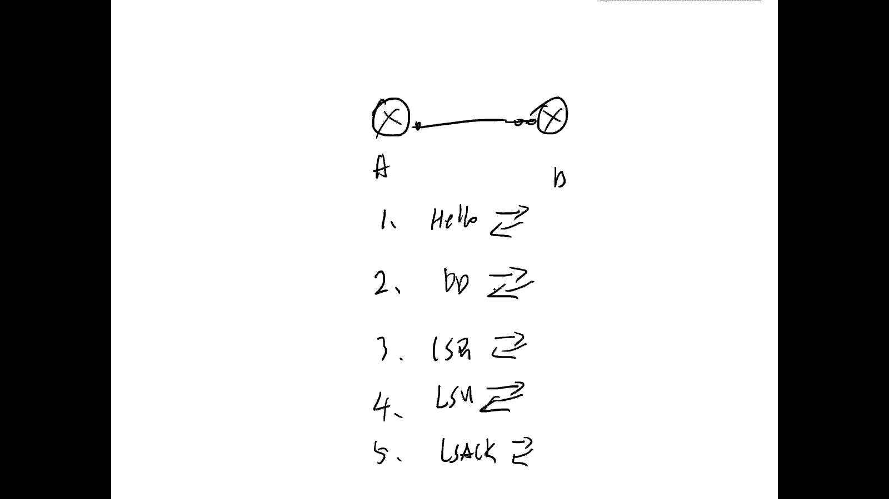

好我们看一下啊，这是我抓的一个豹纹给大家展示一下。

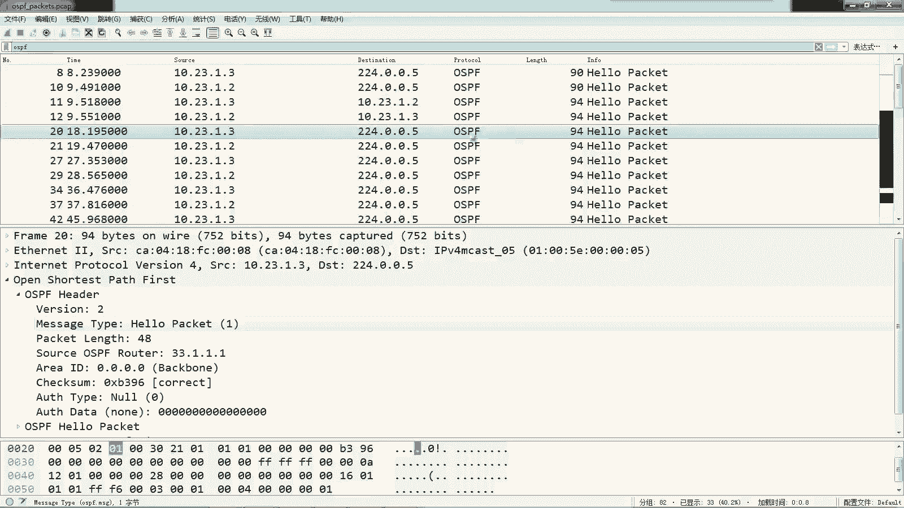

那么这里面呢，我们可以看到有OSSPF的hello packet对吧，然后有滴滴报文。

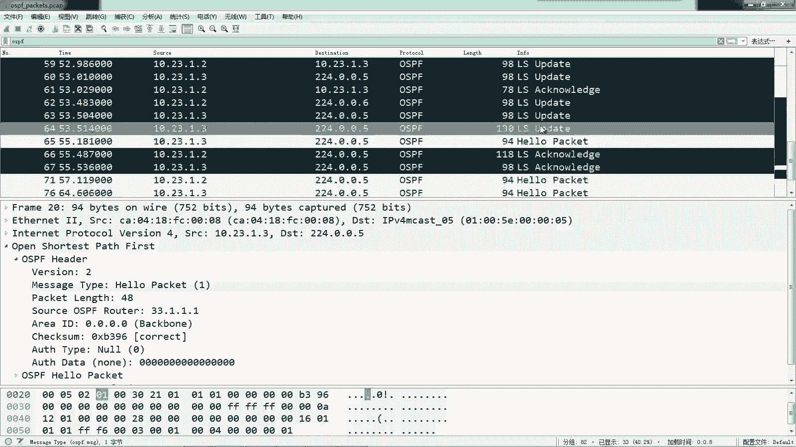

有LSELSR对吧，LSULSACK对不对。

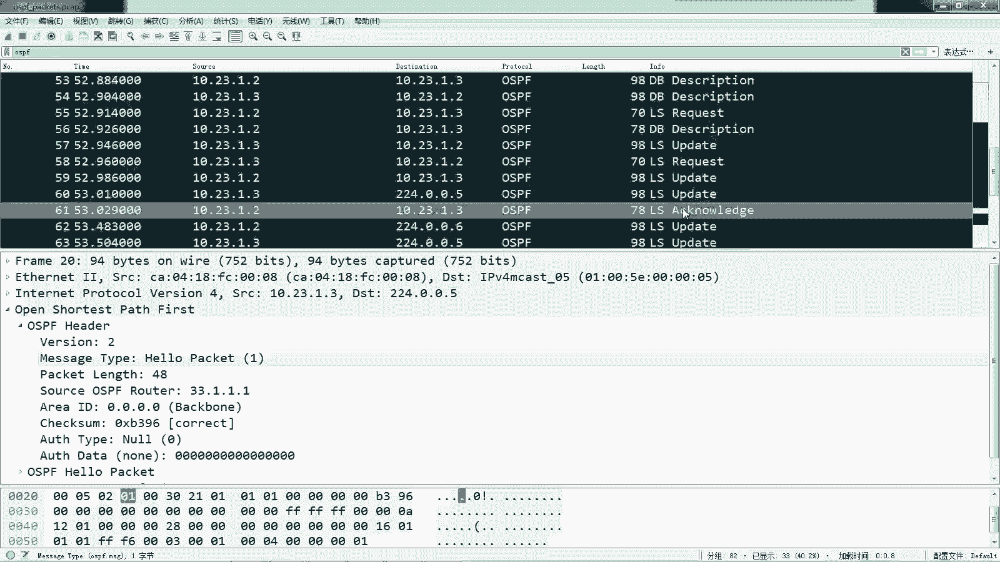

好，我们先看一下这个hello报文，我们点开看一下这个hello报文好，那么这个hello豹纹呢，我们可以看一下封装的就是二层，然后IP对吧，然后是OSPF，那么OSPF里面有一个头部。

那么头部里面有一个type类型，我们可以看一下啊，这个message type对吧，哎如果tap1呢，那么OSPF的数据部分就是hello包对吧，那么hello包有亚马信息啊，interval啊。

Whole time，时间呀，时间呀。

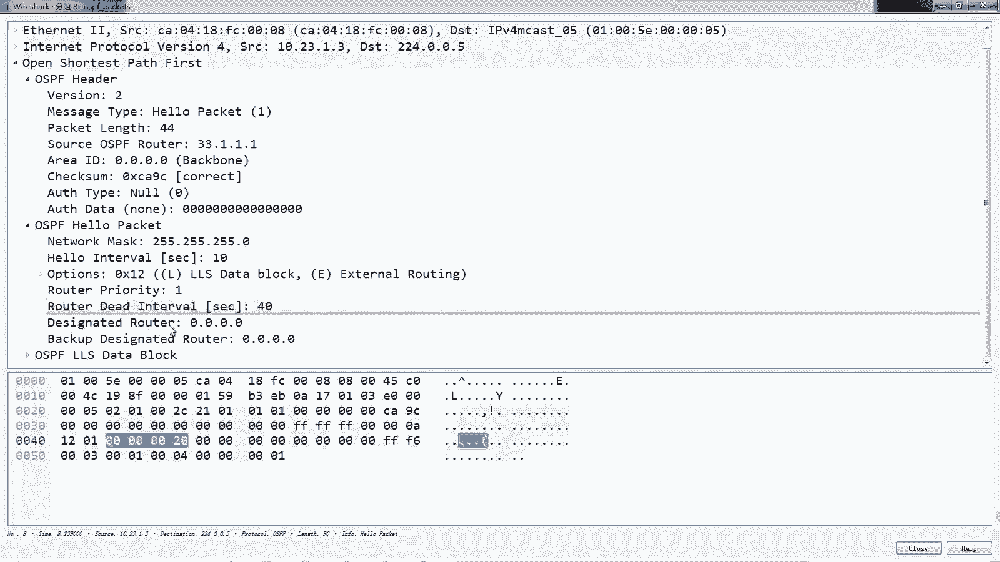

然后DRPD啊，这和我们在PT里面看到的是一样的好。

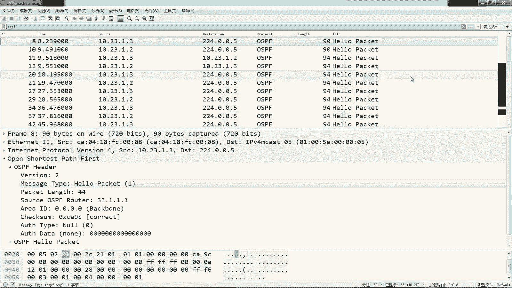

那么先写好报，然后呢是滴滴报恩，那么滴滴报文呢就是一个描述对吧，加入信息，那么在这个OSPF头部里面呢，它tape类型的是二，对不对，诶，地低保嗯，然后呢dd报文里面包含的内容呢就是mt对不对。

然后呢这个有它相应的描述信息，那么这个呢是ford d，那么后面我们会讲到啊，我看后面这些第一方哎，这这些D报文呢我们可以打开看一下对吧，哎就是哎我有这样的一个FC嗯，你要不要对吧。

当然这个我们我抓不到，环境比较简单，所以说这个LC的一类这个LC的数量比较少，你看就这一个对不对，就这一个，而且这个IC呢它只是一个头部，注意下他只有个头部，只有这个type类型啊，嗯IOSID啊。

通关路由器呀，序列号啊，教育和啊，没有实际的什么前缀啊，开销啊，拓扑描述啊，没有这些东西，他只是一个描述啊。

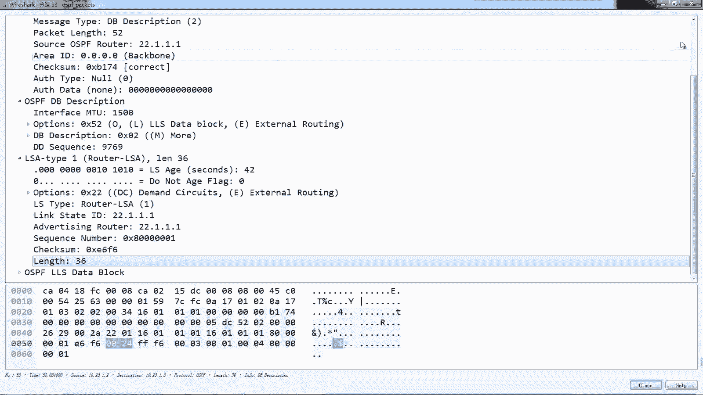

就是清单好，那么然后呢接下来去发送这个iOS r iOS r request，请求request里面包含的内容。

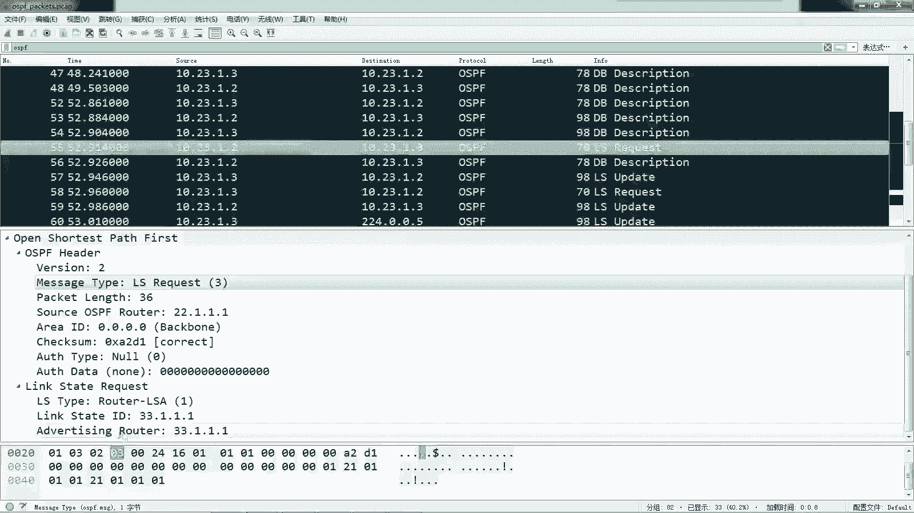

我要去请求什么样的一个SA，对不对好，然后这边呢就是update。

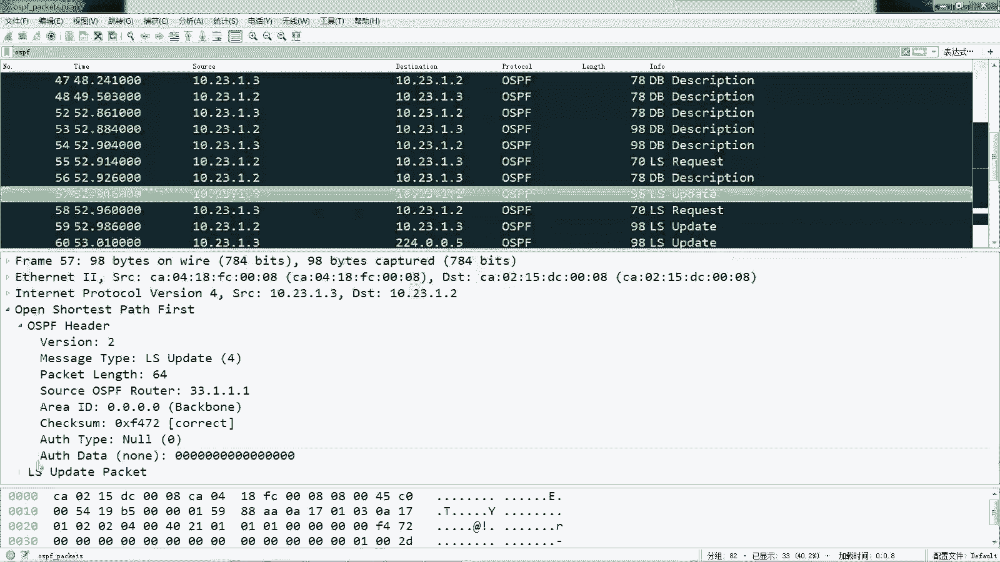

update里面实际上是包含了内容的，包含了实际的一个IC内容的，大家可以看一下啊，这里边你看啊这个IC对吧，类型是多少，然后这里面通过路由器，包括它的一些前缀信息对吧。

包括它的开销值掩码全部都有了网段。

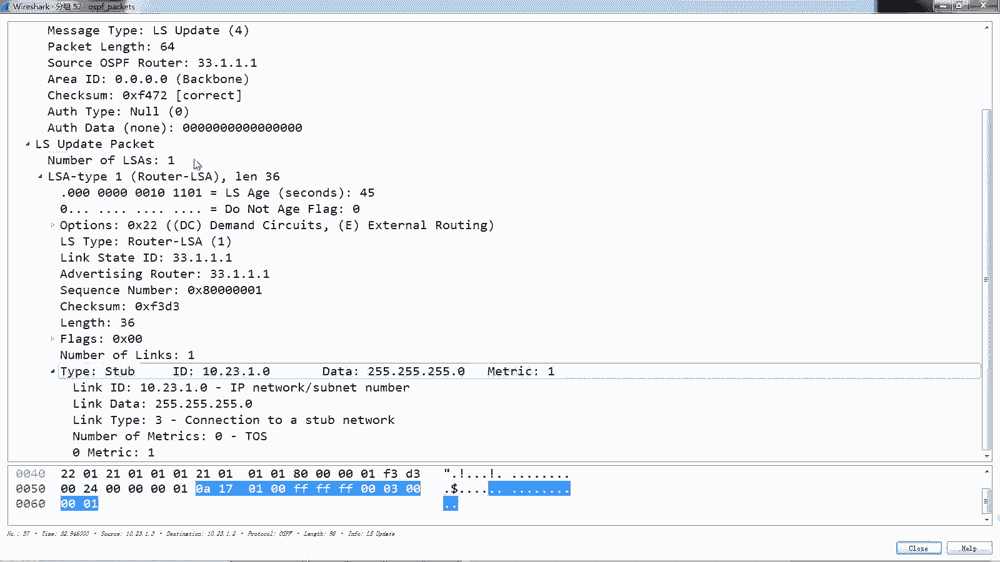

这才是真正的RC，刚才看到DBT只是一个头部描述信息清单。

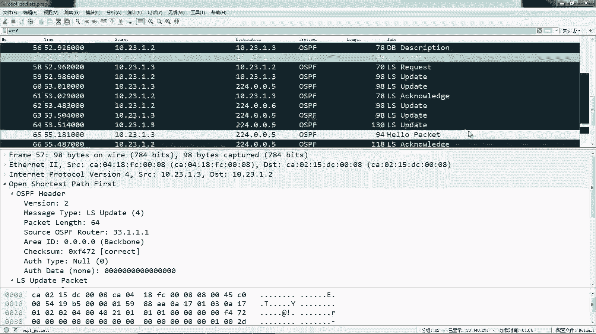

那么当这段收到以后，要去做一个LSACK对吧，去做一个确认，那么确认呢这里边大家可以看一下啊，就是哎这个C我收到了，你看他确认的时候，实际上和滴滴报文发送内容很像的，就是一个加入信息对吧。

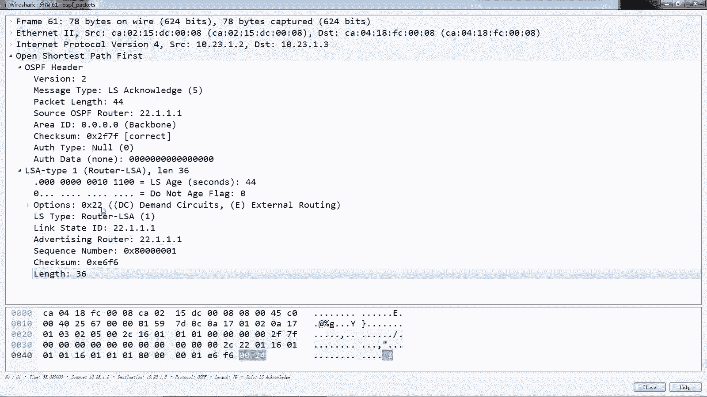

就说诶我这个收到了OK了，对不对好，这是这五种豹纹啊。

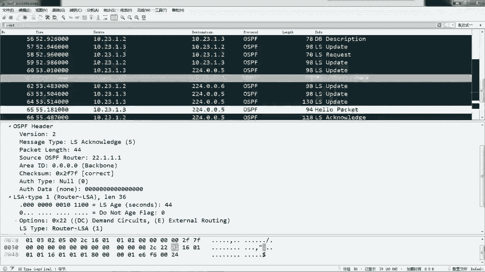

五种豹纹。