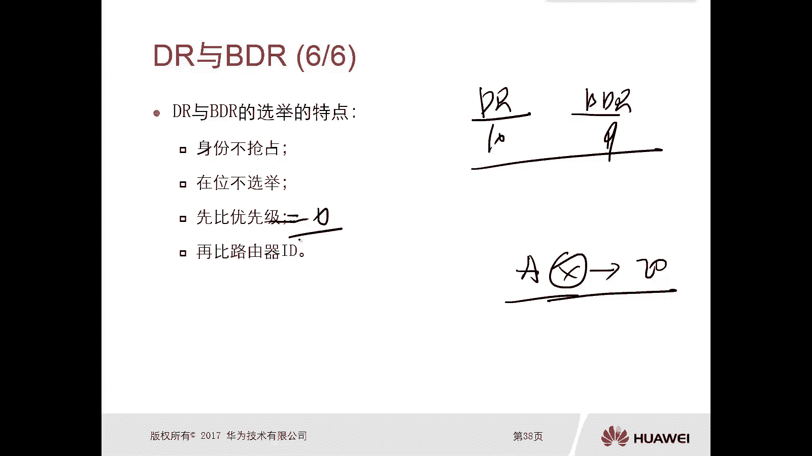

# 华为认证ICT学院HCIA／HCIP-Datacom教程【共56集】 数通 路由交换 考试 题库 - P38：第2册-第7章-2-OSPF路由器ID及DR、BDR - ICT网络攻城狮 - BV1yc41147f8

好，那么接下来我们看一个小的概念，叫做路由器id啊，那么在OSPF里的，在OSSPF的配置工中呢，我们都要去给所有的这种OSPF路由器啊，要去配置一个叫做路由器。

那个路由器ROTD呢我们通常也叫做ROTD，嗯好，那么这个ROTD呃它是什么样的一个格式的呢，它是一个呃一个多用点分十进制这种方式啊，表示的一个32位的二进制，是就有一点点类似于IP地址那种表示方式啊。

但是注意一下路由器id就是ROID，它不是IP地址，它只是和IP地址的格式很像啊，点分十进制啊，这种表示的一个32位的二进制数啊，哎这个一定要注意一下，它不是IP地址啊，那么为什么要在OSPF中。

这个网络里面的，这个路由器上去配置一个ROTD呢，因为这个ROTD呢是在OSPF网中呢，去唯一标识的唯一标识一台路由器的啊，也就是说它是标识的一台路由器的身份呢。

那你想你你OSSPF区域里面那么多路由器，你怎么去标识出来这个路由器是谁呢，那个路由器是谁呢，对不对，那么就是通过这个状态T，那么为什么要通过绕TD去标识他的身份，因为和后面这个是LS是有关系的对吧。

那我们前面讲过这种链路状态算法的，这种这种路由协议对吧，那么他们传送的是LC那C的话，你想你那么多路由器A也产生，B也产生，C也产生，你总归都有有有一个生病去标识，这个S是谁产生的，对不对。

那么就是通过绕裁定啊，67id好，那么这个路由器id呢它是无抢占性的，路由器id是无抢占性的，这个五强人意的意思呢，就是当你一台路由器，你配完了OSSPF，那么既然你已经指定了他的招牌D对吧。

你甭管是指定的啊，还是他自己选的，那么选好了稳定下来就不会再改变，它的绕太低了，它绕太低就不会发生变化了，除非说你把OSSPF进程给它重启一下，很有可能他的绕开id会发生变化。

但是如果说你已经选定了绕太低进程，在不重启的情况下，这是不会变化的，所以就绕太低了，没有抢占性啊，好那么具体这个ROTD怎么去选呢，那么第一种呢，就是我们管理员可以手工的，静态去配置一个路由器。

Rotd，当我们在OSPF的路由器上，去配置这个OSPF的时候，对不对，在路由器上去配置OSPF的时候，你可以去指定的ROCD是多少，这个肯定是最优的啊，但是假设你没有去指定招太低，那么这种情况下。

这台路由器，它会选择它本身最大逻辑接口IP地址，作为它的一个绕台地，那这个逻辑接口地址，你比如说路由器有环回口地址对，但是你比如说你路由器有好多个环口地址，他选哪一个呢，选接口IP地址大的。

但是有人就说比如说我没有这个环口对吧，有可能你的路由器啊，你没有配这个环口，那么这种情况下，它如果你有也没有手动去指定的话，他会去选择这个最大的这个活动的，这个物理接口的IP地址作为它的状态。

OK所以说这个的话，你看你你即使你没有配这个让他听，其实也没有他的关系对吧，他会选一个，要么选这个环口的，要么选这个物理口的，但是还是建议大家去配置os pf的时候，一定要手工去指定一个聊天记。

要不然呢后边你只要重新进场，你知道它就变了，可能一些相关的一些配置可能就会有问题，比如说序列路路做的是配对的太低，你没有规划，你也不知道他选哪一个，你要去找对吧，一旦这个进程重启以后呢。

你修电路可能会出现问题，所以说还是建议大家手工静态的去配置，招待地好，这个状态TT在后面呢都会在讲更深的内容里面，都会去用到啊，所以说这个很重要很重要，再次强调一点，ROID路由器的ID是一个id。

它不是IP啊，它只是一个IP地址格式的一个ID唉，可以手工配，可以这个自己选嗯，好那么接下来我们再看另外一个概念啊，低压和不低压DR呢就是指定路由器，BDR呢就是备份指定路由器啊，那么我们看一下。

需要选取DR和BDR的一个网类型啊，那比如说在我们的以太网里边，因为在以太网里面呢，这个网络类型呢就是broadcast，对不对，那么前面的章节里面提到了王类型，或者后面也会去提嗯。

那么这个在以太网里面呢，它的OP i网络是broadcast，在战网的环境里面就会选取DLPDR，还有一种网络环境就是在帧中继网络环境啊，虽然我们这个真中继网络啊，现在呢用的并不多。

可能我们以后就接触不到，甚至在未来的一些这个考试啊对吧，可能会把这个真空机网络给拿掉啊，但是呢这是这个历史的一个这个发展的，其中一个最重要的一个环节啊，所以说可能学习的时候可能还会拿出来讲。

那么在金融机网络环境里面呢，OSPF它网络型的就是NBA，你会发现，只要是这种多路访问型的网络环境里面，都会有选举第二和pd2，那么选举DR和BDR的用途是什么呢，呃电压路由器接口会与所有的邻居去建立。

信息的完全的连接关系，那么如果说你没有选举DRBDR的话，你比如说我们在以太网里边，就意味着路由器，比如说ABCDE，那么这五台设备呢都会两两的形成邻居关系，那你的邻居关系的数量呢就非常非常之多。

那么只要有更新的话，你比如说A上有条路由信息更新，那么它会泛红E呀，E呀，B呀，C呀对吧，那么可能EDCB收到以后呢，还会相互泛红，那么也就是说在同一时间你有条路由更新的话。

会造成在这个MV网络里面那个流量非常非常大，而且也没必要啊，对不对，所以说我们就选举一个DR，那么DR的话是只有其他路由器和DR，形成邻居关系，对完全邻居关系好，那么同时呢BDR也会和所有的邻居建立。

可以相互共享啊，这个链路状态信息的完全连接关系，那么它的目的就是给这个DR去做备份的，正常情况下，有路由更新的时候，是由谁通知给所有的路由器呢，那是由DR是由DR说了算，只有当第二出现问题的时候。

那么BD2才能晋升为第二，才能担当起第二他的责任啊，那么既不是DR又不是BDR的设备呢，它们之间呢虽然叫做邻居，但是呢不能够建立完全的邻接关系啊，也不会直接共享链路状态信息，那么这里边提到了两个概念。

一个叫做邻居，一个叫做临街，什么叫做邻居，邻居呢，你可以简单认为就是哎我们只是有邻居，你看到我看到你，但是我们之间呢是没有任何的LC的，一个同步的过程，就是没有传，那么链接呢。

就是哎我们之间不仅能够看到相互对端，而且传送了LC进行了LC的交互，那最终达到这个临界关系for，所以说我们可以看一下，在这个环境里面，如果有了DR和BDR，那么我们所有的路由器，比如说ABC，这是D。

这是EABC只和D只和一形成连接关系，那么A和B之间，B和C之间，A和C之间，它们之间是没有连接关系的，只有邻居关系，也就是说A和BB和CA和C之间，他们不会相互去同步数据库，那么这种情况下。

它的数据库怎么同步的呢，哎那么是A交给DR，然后有DR呢，把这些数据库呢交给其他的路由器，没问题吧，他是这样的一个同步方式啊，哎不太一样的好，那么同样在真空机网络环境里面呢，我们也有DR和DR，对不对。

那么效果基本是一样的，另外呢这个DR和BDR，它并不是一个路由器的概念，它是一个路由器接口的概念，那么也就是说在一台路由器上面呢，很有可能会存在多个啊角色，你比如说我们这个路由器R1，它连接了四个接口。

四个接口所对应的网络分别有这个广播网络，NBA网络环境有p two m p网络和p two p网络，那么对于这种点到点或者点到多点增网环境，是不需要选举DRPD的，但是在广播型的网络。

甚至是NBA网络环境里面都会去选举DRPDR，那么很有可能这个AR1，在左侧的广播网络环境里面，它是第二，那么很有可能他在右侧的NBA网络环境里面呢，有可能是B呀对吧，当然也可以是DR。

所以说这个DR和BDR它是一个接口的概念，而不是一台路由器的概念啊，这个一定要搞清楚，一定要搞清楚啊，注意一下好，那么这个DR和BDRD2和B第二，那么选举来讲呢，主要是根据这个优先级啊，优先级。

那么这个路由器的优先级呢，是我们管理员呢可以对它这个手工进行修改啊，那么最终呢可以去影响这个，那么这个优先级呢，它是一个八位的八个比特的二进制数，所以说它的取值是0~255，当然这个数值越高。

优先级越高，那么缺省是多少呢，缺省在华为的路由器上面，这个接口的OSPF优先级为一，那么这种情况下有人就有问题了，说那个你的优先级都一样的情况下怎么办呢，OK如果优先级都一样，最终呢比较路由器的绕太低。

哎我们前面刚讲的是台D对吧，那么这台机有大有小，越大越好，越大越好，那么我们看一下这个DR和BDR选举的特点啊，那么第一个是身份的身份的，不抢占身份，不抢占身份不抢占，比如说你本身在这个网络环境里面。

已经选出了DR和BDR，你比如说这个DR它优先级啊，比如说是10B大优先级是这个九，那么突然又来了一台路由器，这个路由器它的优先级呢，比如说是20，但是现在你网络环境里边已经选好了DRP，D r。

那么虽然你这台路由器的优先级，要比现任的DRBDR优先级要高，你能不能抢占过来变成DR呢，不可以对啊，为什么这样设计，你想嘛，我们DR和BDR和所有的路由器，都是有负荷的关系的，对不对，有关系的。

如果说你把DR的角色给抢占掉，说明那就意味着其他路由器，要和DI的邻居关系给down掉，重新和你新进哪来的路由器A去建立连接关系，那么就会出现什么问题啊，唉邻居全部当量全部重新建立，没有必要，对不对。

没有必要，所以说这个是不抢占的，不抢占，而第二个是在位不选举，在位不选举，你比如说你已经是DR了，你还有没有可能变成贝利亚呢，不会对吧，你要是第二，要么是BD2，你已经在在未来就不用选举了，没问题吧。

在不选举了好嗯，选举的原则是先比优先级，如果优先级比如说比如说一样的话，就比较这个路由器的一个IP哎，这是这个DR和BDR它的一个选举特点啊，非常非常重要，那么这个DR和BDR跟后边的更新呢。

是有很大的一个关系的啊，还有很大的关系，那么更新呢一定是所有的其他路由器，把更新信息交给DR，再由DR进行更新，那么在这呢我再给大家总结一下啊，比如说啊我举个例子啊，看他们怎么更新的啊。

那么嗯比如说这个路由器A，那么这边呢是一个ma的网络环境啊，对吧哎比如说ABCD假设这个A呢是DR，那么B是BDR对吧，那比如说C上边它有更新，它有更新，那么这个更新它只会发给DR合并电。

那么它能不能直接发给D呢，比如说这边还有E路由器，好多路由器啊，E比如说还有F，那它的更新能不能发到DEF呢，不可以，那么当DR和BDRA和B收到这个更新以后，那么是不是应该要告诉DEF肯定是要告诉他。

如果你不把这个路由更新告诉给DEF的话，那就意味着你整个网络里面的路由器，它的更新是不同步的，对不对，那么告诉的时候是由谁去告诉呢，是由A去告诉呢，还是由B去告诉呢，一定是由A去告诉。

那么A呢会把这些路由信息呢告诉给D，告诉给F，告诉给一，当然这个信息呢他也告诉给了这个B，哎注意一下啊，这个DR呢是都都会去告诉所有的路由器的啊，他是这样的一种更新方式啊，那么只有当这个A路由器。

这个DR出现问题以后呢，那个这个B路由器呢才会变成这个BR，然后后期有更新呢，再有B这个路由器呢去更新啊，去更新，你这个注意下，那么往往讲到这我都会去举一个例子啊。

哎这个DR呢刚才看到这个A路由器DR呢，它就类似于比如说我们都看过什么大话西游，对不对，那边有个大当家的，对不对，大当家，那么这个B路由器呢它就类似于这个二当家，那么其他路由器呢就是既不是DR。

又不是BDR的路由器呢，实际上它有名称dr other，其实这个就相当于小弟，对不对，哎哎比如说小弟去放哨吧，突然有一天山下正在迎亲，对不对，然后这种情况下，这个小弟呢会把这个信息我们可以为更新信息。

对不对，那个更新信息呢，他肯定是赶紧跑到那个我们的山寨，那么当着大当家的面和二当家的面，告诉他们俩说，OK那个嗯大当家二当家，那么山下有迎亲的，要不要把他给抓上来，作为这个压寨夫人，对不对。

OK那么这种情况下，大当家和二当家都在的情况下，那么肯定是大当家说了算，那么大当家一声令下，告诉所有的小弟，告诉所有的小弟哦，告诉所有的小弟说，OK我们山下有一个迎新的队伍，我们去打劫诶。

你看这个信息呢，一开始是有一个小弟更新告诉了大家，二等价，相当于告诉了AB第二，然后再由大当家呢去发布整个信息，告诉所有的小弟，我们去啊，把他给抢上来对吧，哎他这样的关系啊，同时呢你看啊。

我们现在这个山寨里边，其实已经有了大当家和二当家了，对不对，那么你再来一个武功非常高级，对不对，哎什么有绝世武功的，你来了，你能不能选选成这个大行家呀，不可以的吧，按照这个江湖规矩，你这样做是不仁义的。

对不对，你不能选的，也只能说当大当家出问题了，二当家大当家，然后你再从小队里面再选一个当二当家，对不对，而且你看大当家和二当家都在位的时候，如果说再选一个对吧，假设啊三当家。

你说大当家二当家还能不能再选，不能再选，在位是不能选的，对不对，这也不能选它，OK通过这个例子呢，我们应该也能讲清楚啊，就是这个DRPDR怎么用对吧，怎么选啊，不抢占对吧，它的特点嗯。

呃如果说你不想让某台路由器去选择，B2和BD2，那么我们可以把它的优先级给它设置成零，如果某台路由器的优先级为零的话，说明他不再选举DR和BDR，OK好，这是这个rod d r b dr。

非常重要的几个小概念啊。

