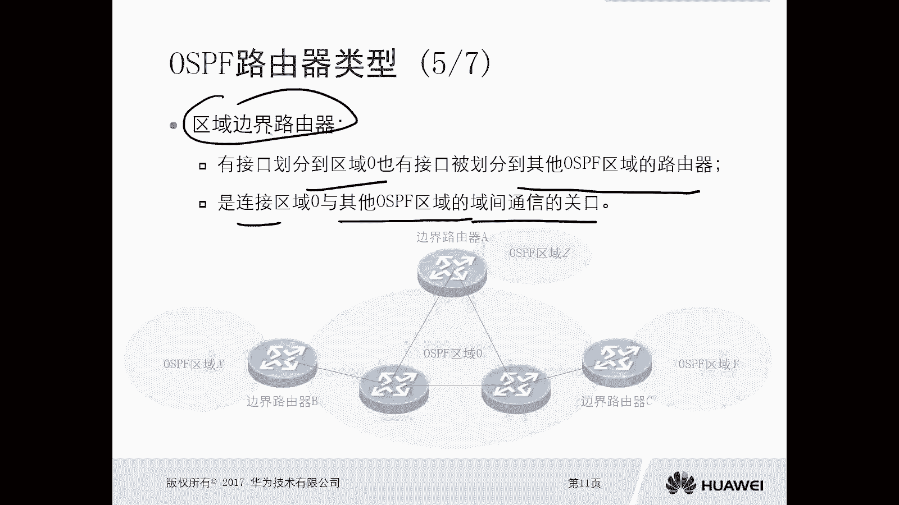

# 华为认证ICT学院HCIA／HCIP-Datacom教程【共56集】 数通 路由交换 考试 题库 - P39：第2册-第9章-1-多区域OSPF - ICT网络攻城狮 - BV1yc41147f8

好，那么接下来我们看一下这个多区域的OSPF啊，那么前面章节里面呢，应该是提到过单曲的OSPF对吧，哎那么接下来我们看一下这个多区域OSSPF，那么本节主要是通过如下三个方面啊。

对这个多区域的OSSPF呢进行一个介绍，那么第一个呢就是这个OSPF的一个，分层结构的概述，那么OSPF呢是可以分层的啊，那么第二呢是OSPF路由器的类型啊，第三个呢是OSPF虚链路来。

我们先看一下这个分层结构概述，那么第一个呢是OSPF的可靠性，那么可靠性呢主要体现有什么，有这么几点啊，第一点呢是同步数据库啊，是先同步数据库，然后呢去独立计算路由，那么我们前面讲过这种链路状态路线呢。

都是相互交互的这种这种拓扑啊，就是链路通告信息对吧，就是链路的状态信息或者链路状态信息，那么同步了这些链路状态信息以后呢，各自形成一个独立的数据库，然后利用这个数据库呢去独立计算路由。

那这个要比我们之前讲的那种距离矢量路由器，那要可靠的多对，因为距离使用路由器呢，就是哎我告诉你，你去某个目的地，从我这里面找就可以了，那么开销是多少，但具体你是不是很清楚呢，不一定你不清楚对吧。

这是我们当时讲的距离矢量，那么内容状态就不一样了，因为它有数据库啊，就是好比是大地图嘛，你根据地图自己去规划不就行了吗，第二个是规避了环路等问题，那么OSPF本身设计的时候，他会考虑到区域内的环。

区域间的房管等等啊，那么它有自己的这个房管的机制，所以说呢这个协议肯定要避免环路的，你想一个协议自己都避免不了环路，那这个协议肯定是没法用的对吧，即使是距离矢量路由协议，它有防范机制啊。

你比如说前面我们讲过的rap对不对，各种各样的使用分割呀，都用反转呀，对吧等等，好，第三个呢是OSPF计算出来的最短路径，往往是更优哎，因为我们OSPF，它采用的叫做DJ斯特拉算法。

那么也叫做SPF算法，对不对，那么他算出来的一定是最短路径啊，而且是最优的，这个呢是这个OSPF的一个可靠性的一个体现，那么OSPF的一个分层结构呃，我们去规划这个OSPF网络的时候呢。

我们可以划分为不同的区域，那么后面呢我们会看到拓扑什么趋于零啊，有区一区二啊，好多区这个区域它的这个编号啊，它是一个32位的二进制式二进制的数对吧，那刚才你讲了去一趋于零。

这怎么会是一个32位的二进制数呢，OK那么在OSPF协议里边，实际上他看到的比如说趋于零，去零实际上等于0。0。0。0，那去一呢就等于0。0。0。1，没有吧，诶他是这样的一个效果啊，这个效果啊。

所以说呢在鞋里面呢，它是一个32位的二进制数，但是我们去配置的时候，一般是配置一个十进制是吧，什么零啊一啊二啊，对不对，好，那么区域的编号呢你可以采用点分十进制，也可以采用十进制数字表示。

所以说我们平常去配置OSPF的时候。

都是采用十进制数去表示的好，我们可以看一下，这个就是OSSPF区域设计的一个拓扑对吧，我们可以看到嗯，这里边呢路由器呃12345对吧，那么属于趋零对，然后6789属于去一。

后面十十一十二十三十四属于去二对，同时呢上面这台路由器啊没有编号，哎我们我们暂且把它变为15吧，哎那么这台路由器呢，我们可以看一下，它是不属于任何OSPF区域的啊，所以说那么这台路由器呢。

我们可以看到它是和AR2运行的其他路由器，比如说运行的rap啊，运行了这个BGP啊等等，对不对，而我们可以看到这个OSPF呢，它是可以去做这样的一个区域的设计的啊，我们一般简单网络来讲呢。

我们可能用一个单曲OSPF就搞定了，但是对于一个复杂的网络环境，你要实现更复杂的一些功能，比如说过滤呀，比如说策略呀，对不对，哎比如说由于这个设备性能差异比较大呀。

我们有可能就要设计这种多区域的一个拓扑。

多区的拓扑，那么当我们去设计这个呃，多区的o s p f top的时候呢，我们有几种路由器的类型呢需要认识一下，哎，那么我们接下来就要去看这个OSSPF路由器，还有一个类型的分类了。

那么在os pf这种多区域里面呢，它的路由器的分类呢，第一种呢叫做内部路由器啊，内部路由器，第二种呢叫做骨干路由器啊，第三种呢叫做区域边界路由器，那么第四种呢叫做自制系统边界路由器对吧好。

那么这两个我们可能说的比较少啊，就是用英文的方式说的比较少，一个叫做AR对吧，也就是B2，那么像这种去边界路由器ABR自制系统，边界路由器ASPR这两个路由器呢，我们说的最多了啊，ABASBR对吧。

这是IR，这是BR，后面这两个说的非常多的好，那么接下来我们看一下什么是内部路由器。

那么内部路由器呢顾名思义，顾名思义啊，就是所有接口，就是某台路由器的所有接口，都被划分到同一个OSPF区域，里面的OSPF路由器，大家都想我们去给OSPF去划分区的时候，它是以接口为单位的。

就是一个接口，你可以输入一个区，如果说你所有接口属于同一个区域，那么说明这台路由器呢，就属于这个区域里面的一个内部游戏，当然这个区域内内部路由器呢，这个区呢可以是去零，也可以不是趋于零。

我们可以看到有什么区一区二对吧，但是呢要求是完全以所有接口，完全属于某个区域运行，其所属区的OSPF运算法，则，则仅生成区内部的一个路由表项，在区域里边的里边呢。

我们只能是通过本区域里面的这个SPI算法，那么得到这个区域内部的路由表象，那对于其他区域里面的路由表象怎么得到呢，那么就会使用ABR就是区域边界的游戏。

对不对，我再去解释，那我们看一下这个图对吧，这个图你看这个是属于趋OSPF趋于N，这个N的话有可能是零，可能是一，可能是二对吧，那么这里呢我们可以看一下，明显他这个区域的框框是把上面这台路由器。

比如CC1口和二口划分到了去N，然后路由器A和B呢是所有接口，因为所有接口嘛，对不对，都是属于全，那么对于路由器A和路由器B来讲，他们就叫做内部路由器，那么对于C那么很有可能它后边还有接口接口。

可能属于另外的区域，比如去X那么对于C呢，它就不是一个内部路线，因为它有接口属于趋N，有的接口属于去X，所以说我们的内部路由器，是所有接口都划分到了，同一个OSP区里面的内好。

那么骨干路由器，谷歌路由器呢，是至少有一个接口被划分到去零里面的，OSSPF路由器，诶这个比较特殊，必须是有一个接口化的，趋于零的这种呢叫做古玩游戏，而且这个区域必须是确定。

你说我把这个接口给它划分到其他区域，可以吗，不行，这个区域必须是train。

哎你比如说我们可以看一下这个对吧，可以看一下这个啊，这个图里面按照我们刚才说的这个定义啊，就至少有一个接口划到了血影，那你看上面那个路由器ABCDE，那么所有的路由器ABCDE啊，这几台路由器。

你看A这两个接口去对吧，然后B呢三个接口都属于一个血液呃，C呢呃都属于虚零，那么E啊和D呢就一个接口属于虚灵，那么至于这个ABCDE这五台设备，实际上是最少有一个接口吧，对不对，画到区里。

所以我们认为它叫做骨干路线，同时我们可以看一下这个骨干路由器B和，谷歌路由器C是不是也叫做内部路由器啊，他只不过这个内部是属于趋零的对吧，所以大家注意一下，在我们OSPF里面去零表示的是骨干区域。

非零的区域叫做非骨干区域，哎这个一定要搞清楚啊，一定是强点啊，OSPF里面的骨干区域是趋于零，非零的区域是非管区哎。

那么这是一个骨干，如那么还有一种路由器都有去边界路由器，第三种，那么区域边界路由器呢，是有的接口划分到了趋零，也有的接口呢被划分到了其他的OSPF区，这么一台炉器，它叫做区域边界路系。

那么它这个区域边界路由器呢，是连接去零和其他OSSPF区域的，这个预间通信的一个关口，那么也就是说你趋于零，要和非零的区域进行通信，一定是要经过这个区域边界路由器的，所以说通过这个名字。

我们应该能够猜想出来区域边界，你是在某个某两个区域中间的一台设备，对不对，所以说我们可以看一下这个图。

那么对于这个拓扑图里面有趋于零，趋于X趋Y趋于Z，对于路由器，路由器B路由器C那么就叫做区域边界的游戏，那么一定是一部分接口呢呃是划分到了趋于零，一部分接口划分到了非零的区唉。

那么这种情况你想你去X要和趋于零硬通信，趋X要和趋Z进行通信，趋于零和趋呃和这趋Y硬通信，你甭管是哪两个区域通信，它都是要经过这种边界路由器，所以呢它是一个预先通信的一个关口，那么这么一台路由器呢。

就去边界路由器叫做ABR。

哎这个AB2好，那么最后一种哎，最后一种路由器叫做自制系统，边界路由器叫做AS的啊，ASB啊，多了一个啊，Asb，对比好，那么什么样的一台路由器呢叫做ASB呢，我们将通过其他方式获得的外部路由。

注入到OSPF网中啊，从而获得OSSPF网络之外录入信息的路径，你比如说有一个网络环境，它是一个OSPF区，但是呢他某台路由器呢又和其他的网络有相连，但是其他的网络呢，比如说它采用的不是OSPF。

采用的是rap，假设我画个图啊，你这边是OSPF对吧，然后这边呢是对吧，你在OP里面有台主机，想去访问rap里面那一台服务器，那么是不是意味着你在OSPF区里面，就必须有这台服务器的一个路由啊。

同时你在rap区域里面，必须有这个PC的路由对吧，那比如说这两个网络中间有一台路由器设备，A对吧，那你怎么样才能让PC，让这个OSP学习到的路由，才能让学习到OSP路由新引入引入。

就是我在A这个设备上把OSPF的路由给它，扔给rap里面去，然后在A上面呢又把rap呢扔到这个OSPF，就是来回挂对吧，因为你本身两种鞋呢，它不可能自动的互通这些路由信息。

所以只能通过引入这个方式去做啊，哎这个呢我们在路由器上是可以操作的，OK假设我们在A上去做了引入，那么这种情况下，只要你A产生了外部路由，因为我们把rap的路由引到OSSPF路由。

你是从外来协议注进来的，所以它叫做外部路由，只要A上产生了外部，OK那么这个A这个设备呢，它就叫做ASBR，唉去边界路由器啊。

这个注意一下好，当然我们获取的方式，你除了可以是动态路由，也可以是静态路由对吧，你比如说我在ASPR上，我配置一个静态，然后把这个静态路由呢我给它引到，给它灌到这个OSPF里面。

那么只要是这台设备产生了外部对吧。

那比如说我们这个图对吧，就是刚才和我画的基本类似，我去零取X就是边界路由器AB对吧，就是玩路由器，路由器路由器，然后这边呢连接了一个rap区域对吧好，那么这台设备。

如果说你将rap协议的路由啊引到了OSPF，那么变成了外部路由在OSSPF里面显示，那么这个设备假设它叫做A这个A设备呢，它就是一个自制系统边界的路径，那我一直在强调，只有引入的时候。

它才叫做自制编辑器，自制系统录器啊，如果说你这个路由器A只是连接了OSPF，只是连接了rap，你没有在这个路由器A上去引入外部路由，到OSPF，那么这台设备呢就不叫做自制系统编辑器，这个一定要注意一下。

只有产生外部路由的路由器。

就是自制系统编程由器啊，好，那么接下来我们再看一下这个OSSPF，路由器类型，它的一个补充啊，首先这个区域零叫做古玩，区域叫做backbone error，那么除了内部路由器和去边界路由器。

两种互斥的类型之外，其他类型并不互斥，那也就是说很有可能你是AB对吧，哎所以说已经注销，但是如果说你是一个内部路由器，你就没有可能变成一个AB呢，不可能不会的，对不对好。

那么OSPF区的一个边界是在路由器上，而不是在链路上，那么我们所有的OSSPF区域呢，它这都是在这个路由器上进行一个分分，这个分区域的划分区域的。

我们可以看一下，这像这种图，你看我们这个灰色打底的都是区域对吧，你看这个区域它是不是划分的时候，都是从路由器路由器就隔开了，有没有从链路上看呀，没有，因为我们刚才讲了OSPF的区域，它是以接口为单位的。

对不对，那你你比如说路由器这个B，你的一接口属于去X，你的二接口属于趋零，那可不就是你的区域是从路由器分开的嘛。

对不对，不是在电路上一定会出现，好，那么下一个第四个呢，就是OSPF区设计要求他有要求啊，就是你所有的区域都必须趋于零直接相连，因为你确定是古玩区域，其他区域是非古玩区域，非古玩区域的路由信息。

只能通过古玩区域相互传递，那如果说你非管区域的路由信息啊啊，非管区域你没有和管区域直接相连的话，你的路由信息怎么传递呢对吧，所以说一定要直接相连，但是有些情况下呢，可能嗯不管是你的设计缺陷也好啊。

还是说我们在网络进行融合变更的时候，有可能会嗯，使得某些区域和这个骨干区域没有直接相连，那么这种情况下，我们就要使用到一种技术。

叫做OSPF的训练路，好我们看一下这个OSSPF虚链路，那么不符合OSPF设计要求的网络设计，有那么两种，第一种呢是非管区域，没有与骨干区域物理上直接相连啊，比如说我们下面那个图啊。

不管是什么原因造成的啊，一般情况下你想我们去设计网络，不会这样设计对吧，所以说最大的可能就是诶我们去做网络变更，去做网络融合对吧，比如两个公司合并了，放一块哎，发现哎这个这个这个区域有问题对吧。

可能是这样的，你比如说这边有个管区域，那么中间有个区域里，N后边还有个区M，那么这种情况下会有什么问题呢，问题呢，就是趋于M和趋于N就没法进行互通对吧，同时你去N和去M能互通吗，也互通不了。

你的路由是不传递的，这种情况下就有问题，那么第二种呢，就是古玩区域本身在物理上不连续，你比如说我上面一个区域零，下面一个区域中间有个区域，把两个区域给分开了，这种情况下。

这两个区域里面的路由信息传递也是有问题的，哎你看这两种不管是哪一种。

它都是不符合OSPF设计要求的，所以我们就要虚链路了，我不那么什么是OSPF系列路呢，这个序列路呢，它是一条穿越非骨干区域的一个逻辑的通道，哎所以它有序列了嘛，逻辑通道啊，那么在OSPF区域设计。

不满足OSSPF设计要求的时候，我们可以通过，在这个AB2之间去建立逻辑连接，让这个OSPF网络能够正常完成。

路由信息的交互呀，你比如说我们刚才看到的非管区域，没有和管区直接相连，而采用的这个OPF路的设计啊，我们可以看下图不图，这边是去一诶，左侧是去零，右侧是区二，你看明显这个区二和区零它是没有直接相连的。

那么这部分路由器它们相互通呢，肯定是有问题的，包括你去一啊和去二也是互通，也有问题，路由信息都没有，所以这种情况下，我们需要在四和五上去创建一条血路，那么虚线路我们可以认为它就是一条链路。

只不过这条链路属于趋零，那么既然它属于趋于零，我们是不是可以认为这个趋于零，实际上是延伸到了去五个A5对吧，那这样的话，你看这个去二是不是和去零就直接相连了对吧，所以说大家注意下趋于零。

它属于哎就虚电路属于趋于零的一部分，只有这样的话才能够继续解决。

刚才我们遇到的问题，对他另外一个，比如说古文区域没有和古文区域之间相连，对我们也可以采用OSPF对吧，你比如说左右侧都是O区，零，中间是区一，那这两个趋于零，他们录入信息传递肯定是有问题的。

我们还是在四和五上对吧，这种边界设备上啊，我们就做一个序列，这样的话相当于是你整个区域就打通了对吧，那你左侧趋于零和右侧趋于零，就融合成一个趋于零了对吧，那么他们传递有没有问题对吧。

会不会影响区域的路由信息传递的也不会嘛。

对不对，你看好，但是呢我们还要对这个OSPF序列中，做一个说明嗯，训练路它是网络这个补丁类的技术，就是为了去修复的，对不对，本身我们OSSPF设计的时候，你的肺管区要必须要和管去这个互联，对不对。

那么第二个呢是网络中你采用了虚电路，如果你采用削弱，那么是这个网络中存在故障，或者是设计缺陷的一个体现对吧，你不要说我们学完OSPF了，你再去设计OSPF的时候，你为了体现出来你技术学得好。

搞一个训练不出来就有点对吧，你不要以为削弱是很高大上的一种技术，哎我为了体现我学的多好多好，我搞出来一个吧，只要懂OSPF的，认为你这个设计是有问题的对吧，你这不是自己给自己找麻烦吗，所以注意一下啊。

哎不会这样用的啊，所以说我们设计OSSPF的时候，千万要注意，序列入，会增加网络中的管理流量和设备的处理负担，那么提高管理员对网络问题进行，排除的一个难度，只要你本身有OSPF有问题吗。

你你你按照常规的设计，很容易排除，你搞了个虚拟就很麻烦了对吧，就是自己给自己找麻烦嘛，如果你这样设计的话啊，那么设置全新的OSSPF的网的时候，那么这种技术是不应该以，其他理由而被考虑在内的。

除非说虚线路作为某些电路失效时的备份策略，OK虚电路除了解决刚才我们遇到的那两种情况，实际上还有一个用途，就是做备份，我们可以做某些内容的备份策略对吧，那么这种情况下你可以用，除此之外，你不要去用路。

不要去设计一个有缺陷的OP网络好。

这就是这个多层次的这个OSPF，多区的这个OSPF好，那么小节目看一下OSPF区域类型的分类，内部管路由器，边缘路由器去边路吧，OSPF的设计的解决方案主要是为了解决，比如说两个主管区域没有直接相连。

或者说非管区域和古玩区域没有直接相连，这种问题，当然这两种呢，我们不建议大家去设计的时候设计出来，当然你也不会设计出来，对不对，那么训练在什么时候用能用的地方呢，就是哎比如说某些链路备份的时候。

我们可以除此之外，不要去不要不要不能说不能用啊，就是不要去让让设计出来一个OSSPF，让他去用。

