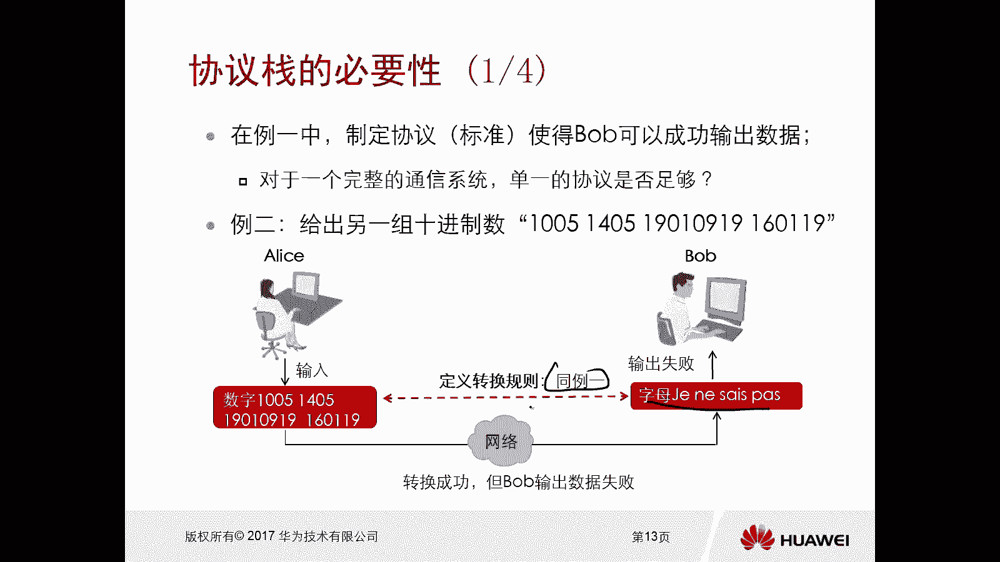

# 华为认证ICT学院HCIA／HCIP-Datacom教程【共56集】 数通 路由交换 考试 题库 - P3：第1册-第3章-2-网络协议的作用和协议栈的必要性 - ICT网络攻城狮 - BV1yc41147f8

好那刚才我们讲的是这个通用的规则对吧，接下来我们看一下网络协议的作用，那么实现数据通信呢有两个元素，两个要素，第一个是媒介，第二个呢是协议，我们看一下媒介的定义啊，媒介的定义呢就是信息传输的介质和载体。

那么我们现在最常见的介质和载体比较多啊，你比如说网线啊对吧，然后我网线呢有学名叫双绞线对吧，网线俗称，那么我们还有电话线呀，还有光纤呀，还有无线呀，无线电波对吧等等，那么它的作用呢就是通过设备。

线缆或者是电磁波等等物理介质，实现各通信系统之间的数据传输，哎这个比较简单，比较容易理解，那么协议呢，协议的定义呢是约定俗成的规则或者语言，那么它的作用是为了确保不同通信系统之间。

可以按照既定流程操作而定义的一条标准，一套标准，那比如举个简单例子吧，比如说我们两个人在聊天，那一个人他是中国人，要不他不懂外语，另外一个人是外国人，他不懂中文，那么我们想一下他们两个能不能交流啊对吧。

直接交流不成嘛，你中间还搞一个翻译，对不对，哎我们不考虑翻译的情况下啊，他俩肯定是没法进行沟通的对吧，你说我我说汉汉语他听不懂吗，那人家说这个外语我也听不懂嘛，对不对，所以说我们得去规定是吧。

哎比如规定我们要用相同的规则，要用相同的语言，你们有相同的语言，那你不用去聊了对吧，聊不下去对不对，这是这个协议啊，好所以说理解习的关键呢是理解标准好。

那么接下来我们看一下，有一个例子啊，比如说现在这个爱丽丝要和bob要进行通信啊，那么给出了一组这个十进制数啊，那么观察我们定义这个标准前后的区别，那么第一个呢是没有定义输出标准的一个场景。

那比如说爱丽丝和鲍勃已经通信了，那么爱丽丝呢输入了一个数字，一组数字吧，一组这是十进制的数啊，输了那么这个数字呢通过网络的媒介，然后传递到bob，因为我们是没有去定义转换规则的，那么bob呢拿到以后。

他就不知道怎么转换对吧，你这个给我发过来这么一串数字，我怎么转换呀，那么这种情况下就会输出失败啊，那部分看不到的，有问题的，对不对，哎所以在这里边呢，我们这个BB它是无法去输出数据的，有转换失败哎。

这是没有标准的一个场景啊，没有去定义场景，那么接下来我们再看，还是刚才那个例子，但是呢我们在这呢定义了输出标准的场景，比如说还是爱丽丝和鲍勃进行通信对吧，爱丽丝呢还是输入了相同的一组十进制数。

然后呢通过网络媒介进行传输，同时呢我们定义了输出标准的场景啊，定义了这个输出的一个标准啊，那么这个定义的一个标标准是什么呢，就是给转换规则转位子呢就是每两位数一组，每两位数是一组。

该两位数代表其在拉丁字母表中，对应位置的一个字母啊，这个字母我们就是按照这种规则啊，假设假设是这样的一个规则，然后到了bob这边呢，bob就按照这个规则进行转换，将这个数字呢转换成拉丁字母。

那么转换成拉丁字母呢正好对应的是华为对吧，正好对应的字母是华为，那这样输出汉字呢，比如说就是华为，对不对，哎就这个好，那这样的话这个BB就是输出这个数据就成功了。

成功，所以我们接下来看一下协议和功能服务，它的一个区分，那么对于企业来讲，它与通信系统的关系是什么样的啊，就是对通信系统之间呢的一个操作呢，去提供这个规范的，那实际上我们的协议呢就是各种各样的规范。

那前面我们也讲过了，什么七层啊，什么四层啊，对不对，那每一层都有各层的协议，那么不同的协议呢它有不同的规范规范，对不对，那相同的协议规范是一样的，对不对，但是与通信系统的固有属性呢，这个是没有的。

对不对，哎，所以说协议的本质呢是规范化操作的一个框架，那么对于功能呢，功能是通信系统最终所希望产生的一个效果，效果是什么样的，这个和通信系统的固有属性是有关的，那么它的本质是规范化操作的一个目的。

一个是框架，一个是目的，所以我们总结一下，通信系统双方通过遵循某个协议哎，可以使得整个通信系统产生既定的一个效果，那就是功能嘛，就是通过规范，通过框架可以达到一个什么样的功能或者效果，但是鞋本身呢。

它是不会赋予或者剥夺任何通信系统方的，一个功能的和他没关系啊，这个是网络协议的一个作用。

刚才我们讲到了是一种协议，而且我们举例呢是使用的一个协议，使得这个抱抱可以去成功输出数据对吧，因为我们刚才看到这个例子呢，是对一个这种完整的这种通信系统，我们用了一个非常简单的例子去讲述的。

但是如果说在真正通信的过程中，对一个非常非常完整的一个通信系统，单一的协议是否是能够足够的呢，啊那么答案呢肯定是不足够的啊，没法足够的啊，那么比如说我们这又给了一个第二个例子。

第二个例子是给了一组十进数啊，十进制数啊，就是这个数字我就不读了，那么这个十进制数。

还是在爱丽丝这边来进行输入，输入以后呢，我们定义的一个转换规则呢，和例一里面的是一样的啊，比如说我们就按照例一里面的啊进行输出，那么输出以后呢，我们看得到的一串字母是这样的。

那这样的字母表达的意思是什么呢，bob是不知道的，输出失败的对吧，输出失败吧，你看我们也是按照之前的规则标准去转换的呢，怎么会有这种问题呢。

对吧，哎我们对比一下就知道了，那么之前我们例子一里面的数字呢，是一组根据转换原则转换的结果呢，正好是华为输出，结果是华为对吧，你在没有输出规则的情况下，我们只是转换规则，没有规则。

那么第一个例子正好恰好这是没有问题的，但是例子二呢我们做了更多的十进制，十进制数也还是一样的转换工作对吧，但是输出规则没有定义，最终得到的还是这个啊拉丁拉丁字母，但是这个拉丁字母。

你这个转这个这个这个输出结果到底是什么呢，搞不清楚，因为我们前边它的输出的规则呢，实际上我们是利用拼音中文的方式输出的，那么对于下面这个呢，你还能还能使用什么拼音或者中文进行输出吗，哎输出不来对吧。

输出不出来啊，所以说我们得到一个结论，例一中输出成功的原因，默认是使用中文格式输出的对吧，但是无论是利益还是利益，而二呢对鞋的制定都是不严谨的对啊。

他是不严谨的，Ok，那么接下来我们就看一下啊，在利益中这个完整的一个通信流程是这样的，比如说我们X说一个华为对吧，你现在要输入中文了对吧，输入中文输入中文啊，好呢，字母的方式华为啊取代替了好。

那么再将这个字母的华为呢去做一次转换，转换成一组十进制数对吧好，那么这个数字呢通过网络的方式进行传递到bob，bob呢，不过由于我们中间呢是有定义转换规则，还是按照我们刚才的转换规则啊。

就是每两位数为一组哎，该两位数代表其它在这个拉丁字母表中，对应位置的一个字母，那么这样的话将数字进行转换以后哎，那么变成一个华为字母，然后我们再按照输出规则，就是将字母使用中文格式进行输出。

那这个肯定是有规则的，那么再将字母华为输出与华为哎，这才是我们利益中完整的一个通信流程啊，完整的通信程，所以在这里呢，我们可以看到它并不是有一个协议搞定的，它是有两种协议共同完成的，最起码在这里边呢。

我们看到它有一个转换的规则和输出规则。

对不对，哎，输出规则，所以说对于一个复杂的通信系统呢，通常具备以下几个特点啊，第一个呢数据的表现形式都那么有，可能它是文本，有可能那个图片有可能是视频，有可能是语音对吧，太多了。

我们现在网络是承载的数据太多太多了，对不对，你可以想一下，在网络上有哪些数据不能承载对吧，几乎没有看好，那么传输介质呢它的类型不尽相同，那这个也很多，最常见的什么网线，光纤，这个前面都说过了。

无线无线电波对，那么涉及的流，涉及涉及到的操作流程呢是非常繁琐的，所以说我们需要每一个通信系统，要制定一个分层的框架啊，那么目的呢是为了实现，为特定的操作去提供规范化的一个标准，那就是协议，对吧好。

那不同的协议在内容上呢，你不会相互重复或者冲突，你得分开各自干各自的呀对吧，你比如说刚才我们看到了转换的这个规则，你就转换的输出的规则就是输出的，你两者之间的你不要又重复了，你不要冲突啊，对不对，哎。

所以在这个框架里面，包含的协议就共同构成了协议战，说白了就是一大堆协议放在一块儿唉，协同去工作，而且协议和协议之间呢不重复，不冲突，不影响，这就是协战，所以我们现在已经感受到了对吧。

你一个复杂的通信系统，在通信过程中呢没有协议上肯定是不可以的。

